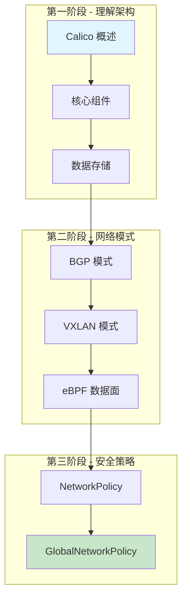

Calico 是一个高性能的容器网络解决方案，提供网络连接和网络安全策略功能。它支持多种数据面（iptables、eBPF）和网络模式（BGP、VXLAN）。

## 你将学到

- Calico 架构设计和核心组件
- Felix、BIRD、Typha 等组件的工作原理
- BGP 和 VXLAN 网络模式
- eBPF 数据面
- NetworkPolicy 和 GlobalNetworkPolicy

## 学习路线图

## 文档版本

- **Calico 版本**: 基于 v3.26+
- **文档版本**: 1.0
- **最后更新**: 2025 年 1 月
