## 概述

理解 Calico 的工作原理，首先需要掌握 Linux 网络的核心概念。本章介绍 Linux 网络命名空间、虚拟网络设备、路由和 ARP 等基础知识，这些是容器网络的基石。

## 前置知识

- Linux 基本命令操作
- TCP/IP 协议基础
- 基本的网络概念（IP 地址、子网、网关）

## Network Namespace - 网络命名空间

### 什么是 Network Namespace

Network Namespace 是 Linux 内核提供的网络隔离机制，每个 namespace 拥有独立的：

- 网络设备（如 eth0、lo）
- IP 地址
- 路由表
- iptables 规则
- 网络端口空间

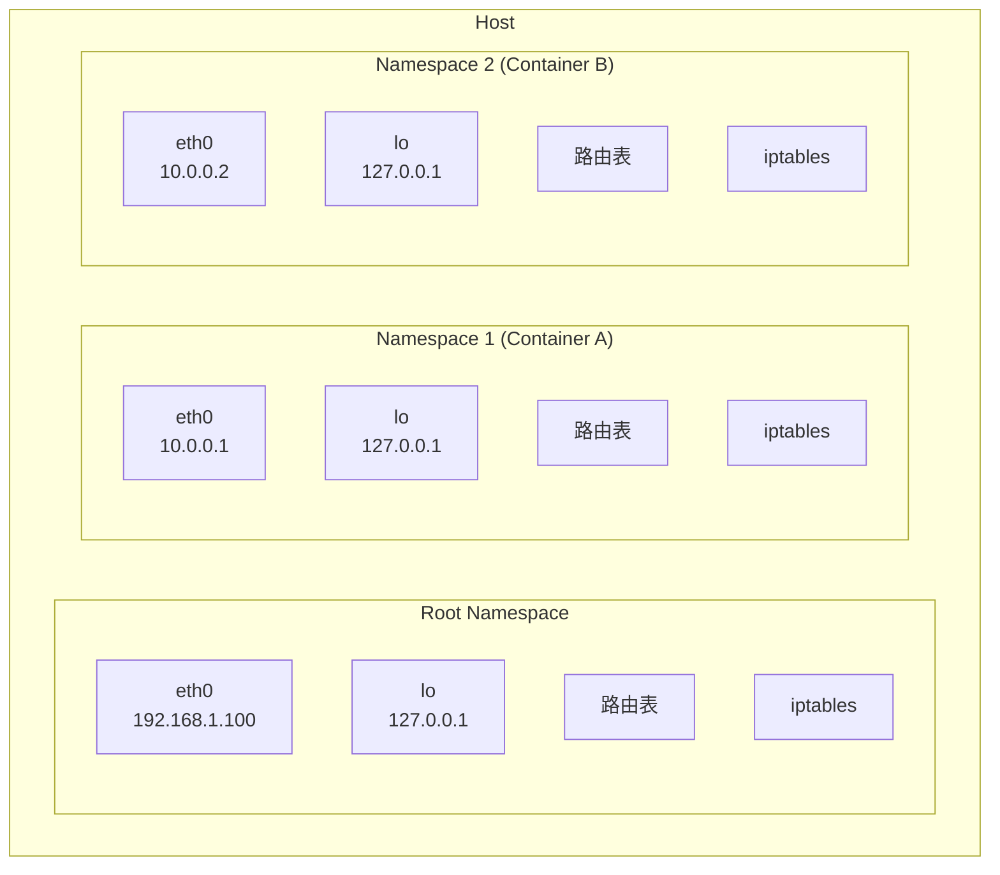

### Namespace 与容器的关系

每个 Docker/Kubernetes 容器都运行在自己的 Network Namespace 中：

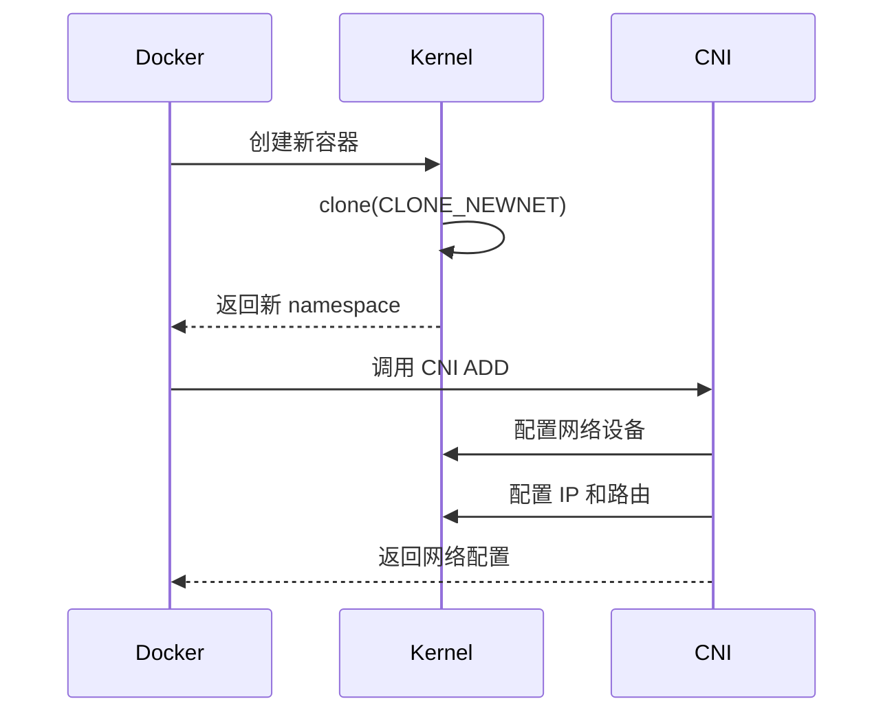

## Linux 网络设备类型

### 物理设备与虚拟设备

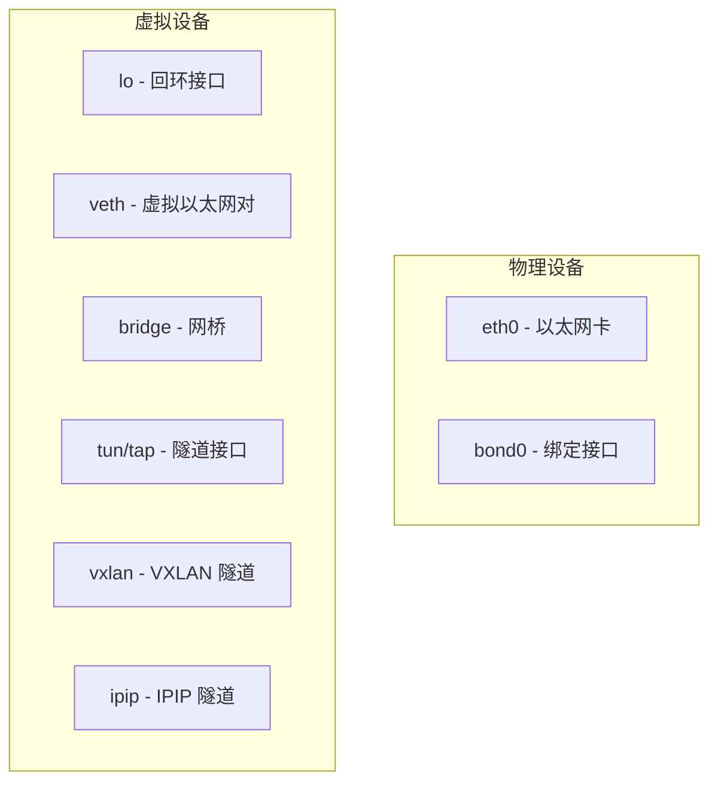

### veth pair - 虚拟以太网对

veth pair 是成对出现的虚拟网络设备，从一端发送的数据会从另一端接收。这是容器网络的核心组件。

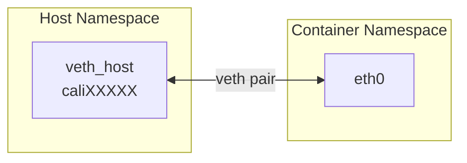

**特点**:
- 成对创建，成对销毁
- 一端可以移动到不同的 namespace
- 类似于一根网线连接两个网卡

### Bridge - 网桥

Linux bridge 是虚拟的二层交换机：

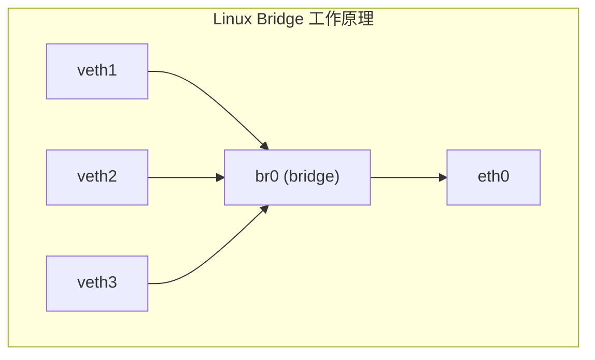

> **注意**: Calico 默认不使用 bridge 模式，而是使用纯路由（L3）模式，每个 veth 直接路由，性能更高。

### tun/tap 设备

- **tun**: 三层设备，处理 IP 包
- **tap**: 二层设备，处理以太网帧

用于 VPN、隧道等场景。

## 路由表与路由规则

### 路由表结构

Linux 支持多路由表，通过 `ip rule` 选择使用哪个表：

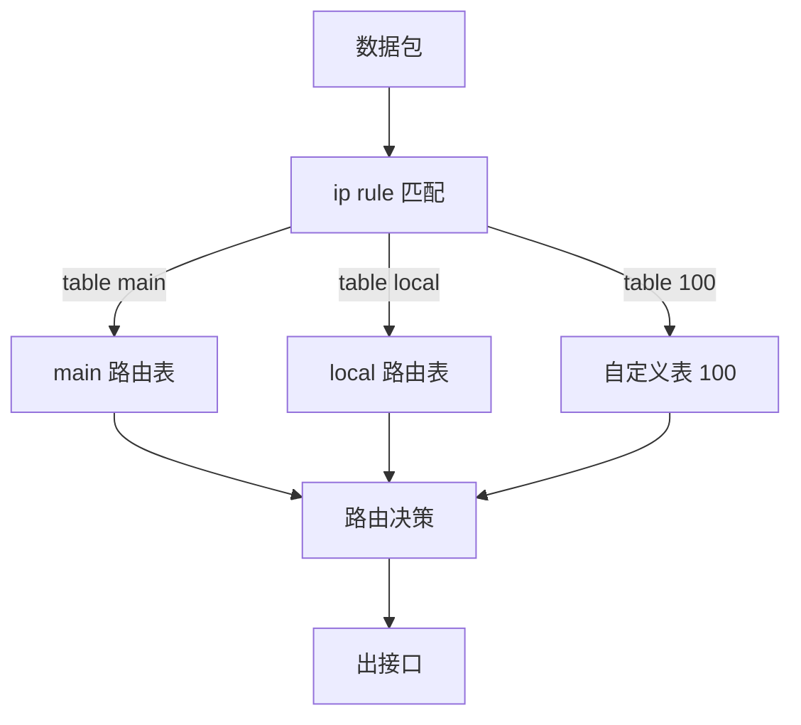

### 路由类型

```bash
# 直连路由 - 目标在本地网络
10.0.0.0/24 dev eth0 proto kernel scope link src 10.0.0.1

# 网关路由 - 通过网关转发
default via 192.168.1.1 dev eth0

# 黑洞路由 - 丢弃数据包
blackhole 10.1.0.0/16

# Calico Pod 路由示例
10.244.1.5 dev cali1234567890a scope link
```

### 路由决策流程

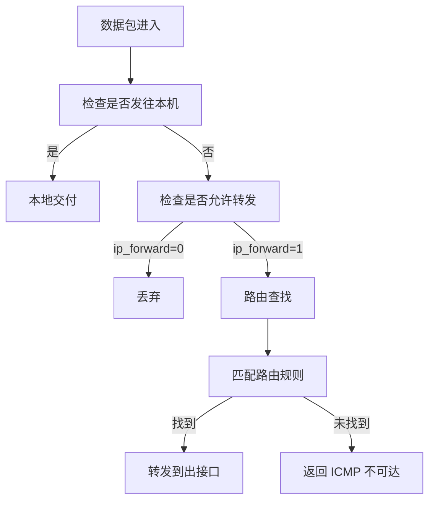

## ARP 与邻居表

### ARP 协议

ARP（Address Resolution Protocol）将 IP 地址解析为 MAC 地址：

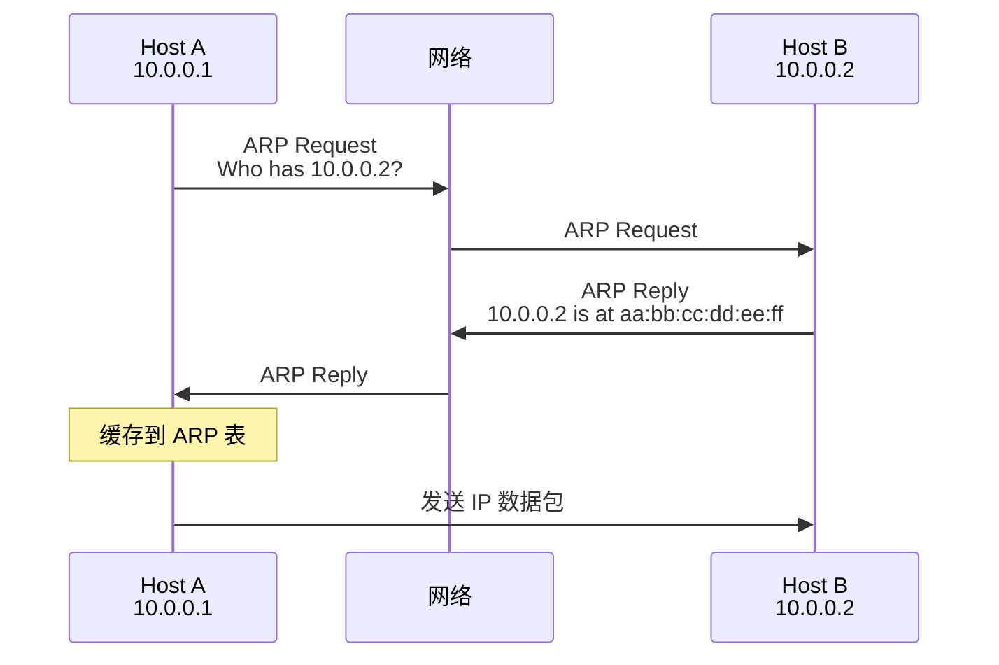

### 邻居表 (Neighbor Table)

```bash
# 查看邻居表
ip neigh show

# 输出示例
10.0.0.2 dev eth0 lladdr aa:bb:cc:dd:ee:ff REACHABLE
10.0.0.3 dev eth0 lladdr 11:22:33:44:55:66 STALE
10.0.0.4 dev eth0 INCOMPLETE  # ARP 未完成
```

### Proxy ARP

Proxy ARP 允许一台主机代替另一台主机回复 ARP 请求。Calico 在某些模式下使用 Proxy ARP：

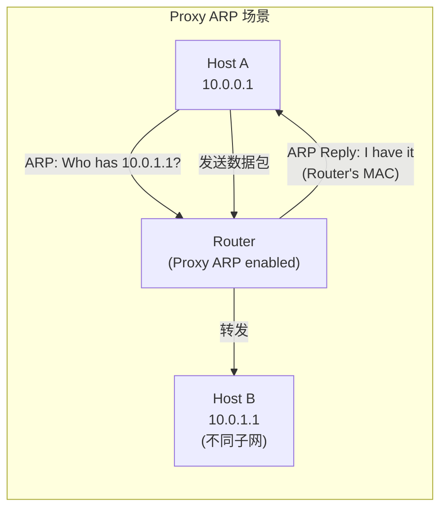

## 数据包在 Linux 中的流转

### 接收路径 (Ingress)

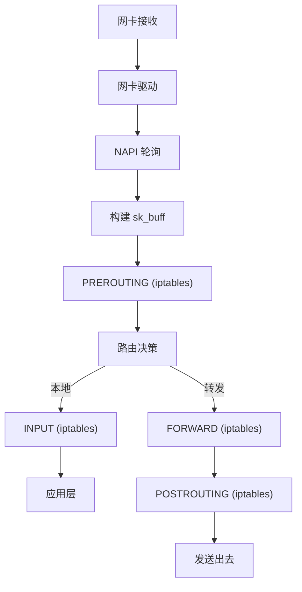

### 发送路径 (Egress)

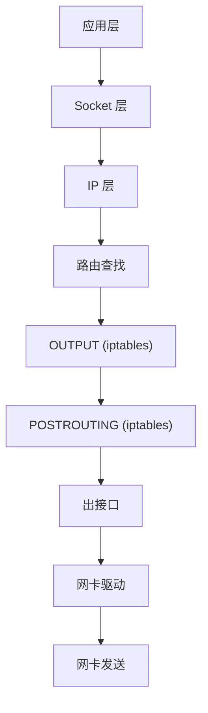

## 实验：创建 Network Namespace 并互联

### 实验目标

创建两个 network namespace，通过 veth pair 连接，模拟容器间通信。

### 实验步骤

```bash
# 1. 创建两个 namespace
sudo ip netns add ns1
sudo ip netns add ns2

# 2. 创建 veth pair
sudo ip link add veth1 type veth peer name veth2

# 3. 将 veth 分别移动到不同的 namespace
sudo ip link set veth1 netns ns1
sudo ip link set veth2 netns ns2

# 4. 配置 IP 地址
sudo ip netns exec ns1 ip addr add 10.0.0.1/24 dev veth1
sudo ip netns exec ns2 ip addr add 10.0.0.2/24 dev veth2

# 5. 启用接口
sudo ip netns exec ns1 ip link set veth1 up
sudo ip netns exec ns2 ip link set veth2 up
sudo ip netns exec ns1 ip link set lo up
sudo ip netns exec ns2 ip link set lo up

# 6. 测试连通性
sudo ip netns exec ns1 ping -c 3 10.0.0.2

# 7. 查看路由表
sudo ip netns exec ns1 ip route
sudo ip netns exec ns2 ip route

# 8. 查看 ARP 表
sudo ip netns exec ns1 ip neigh

# 清理
sudo ip netns del ns1
sudo ip netns del ns2
```

### 实验拓扑

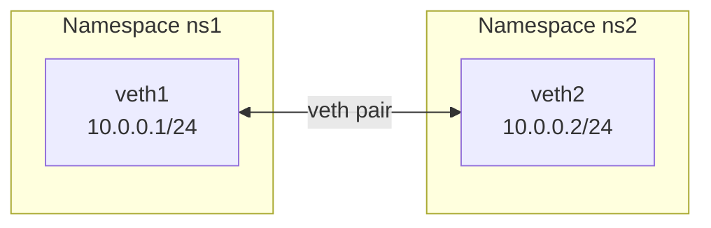

### 进阶实验：通过宿主机路由连接

模拟 Calico 的纯路由模式：

```bash
# 1. 创建 namespace
sudo ip netns add pod1
sudo ip netns add pod2

# 2. 创建 veth pairs（连接到 host namespace）
sudo ip link add veth-pod1 type veth peer name eth0 netns pod1
sudo ip link add veth-pod2 type veth peer name eth0 netns pod2

# 3. 配置 Pod 内部
sudo ip netns exec pod1 ip addr add 10.0.1.2/32 dev eth0
sudo ip netns exec pod1 ip link set eth0 up
sudo ip netns exec pod1 ip link set lo up
sudo ip netns exec pod1 ip route add 169.254.1.1 dev eth0
sudo ip netns exec pod1 ip route add default via 169.254.1.1 dev eth0

sudo ip netns exec pod2 ip addr add 10.0.2.2/32 dev eth0
sudo ip netns exec pod2 ip link set eth0 up
sudo ip netns exec pod2 ip link set lo up
sudo ip netns exec pod2 ip route add 169.254.1.1 dev eth0
sudo ip netns exec pod2 ip route add default via 169.254.1.1 dev eth0

# 4. 配置 Host 端
sudo ip link set veth-pod1 up
sudo ip link set veth-pod2 up

# 5. 启用 proxy ARP（模拟 Calico 行为）
sudo sysctl -w net.ipv4.conf.veth-pod1.proxy_arp=1
sudo sysctl -w net.ipv4.conf.veth-pod2.proxy_arp=1

# 6. 添加路由
sudo ip route add 10.0.1.2 dev veth-pod1
sudo ip route add 10.0.2.2 dev veth-pod2

# 7. 启用 IP 转发
sudo sysctl -w net.ipv4.ip_forward=1

# 8. 测试
sudo ip netns exec pod1 ping -c 3 10.0.2.2

# 清理
sudo ip netns del pod1
sudo ip netns del pod2
```

### 实验拓扑

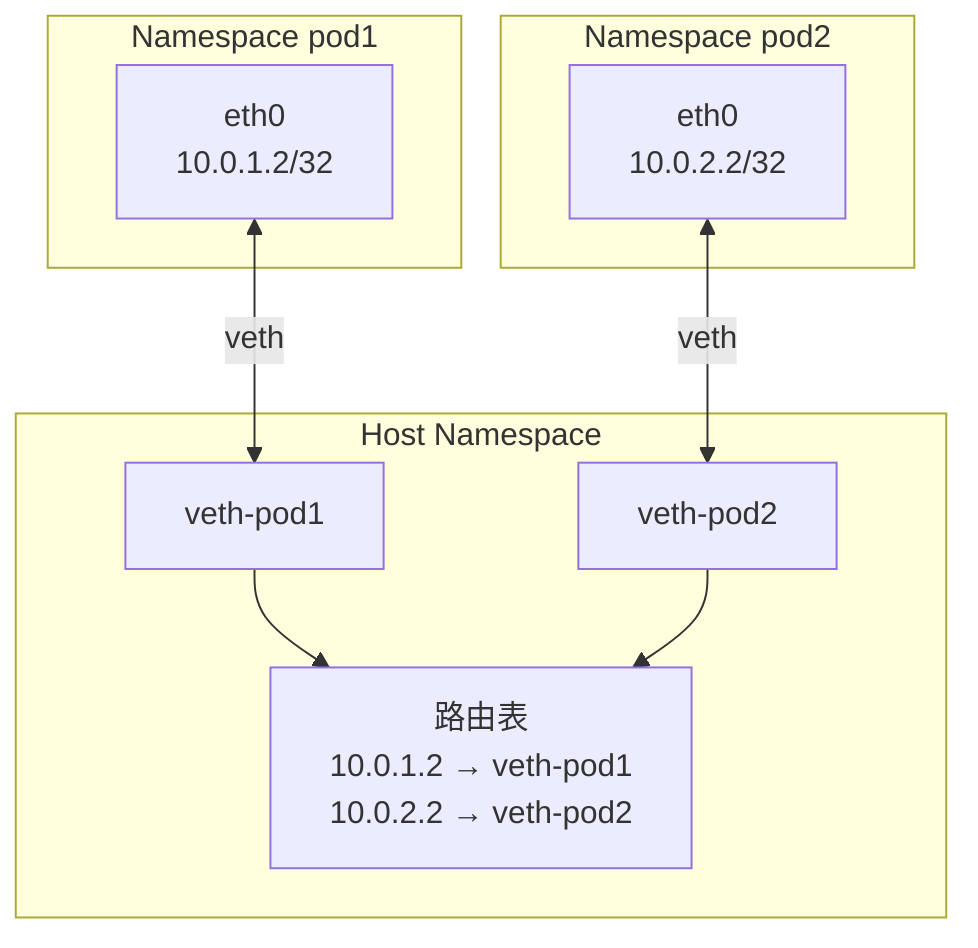

## 关键命令速查

### Namespace 操作

```bash
ip netns list                      # 列出所有 namespace
ip netns add <name>                # 创建 namespace
ip netns del <name>                # 删除 namespace
ip netns exec <name> <command>     # 在 namespace 中执行命令
```

### 链路层操作

```bash
ip link show                       # 显示所有接口
ip link add <name> type veth peer name <peer>  # 创建 veth
ip link set <name> netns <ns>      # 移动接口到 namespace
ip link set <name> up/down         # 启用/禁用接口
```

### IP 地址操作

```bash
ip addr show                       # 显示 IP 地址
ip addr add <ip/mask> dev <dev>    # 添加 IP 地址
ip addr del <ip/mask> dev <dev>    # 删除 IP 地址
```

### 路由操作

```bash
ip route show                      # 显示路由表
ip route add <dest> via <gw>       # 添加路由
ip route add <dest> dev <dev>      # 添加直连路由
ip route del <dest>                # 删除路由
```

### ARP 操作

```bash
ip neigh show                      # 显示邻居表
ip neigh add <ip> lladdr <mac> dev <dev>  # 添加静态条目
ip neigh flush all                 # 清空邻居表
```

## 总结

本章介绍了 Linux 网络的核心概念：

1. **Network Namespace** - 提供网络隔离，是容器网络的基础
2. **veth pair** - 连接不同 namespace 的虚拟网线
3. **路由** - 决定数据包的转发路径
4. **ARP** - IP 到 MAC 的地址解析

这些概念是理解 Calico 网络实现的基础。在后续章节中，我们将看到 Calico 如何利用这些机制构建高效的容器网络。

## 参考资料

- [Linux Network Namespace](https://man7.org/linux/man-pages/man8/ip-netns.8.html)
- [Virtual Ethernet Device](https://man7.org/linux/man-pages/man4/veth.4.html)
- [Linux Advanced Routing & Traffic Control](https://lartc.org/)
- [Understanding Linux Network Internals](https://www.oreilly.com/library/view/understanding-linux-network/0596002556/)
