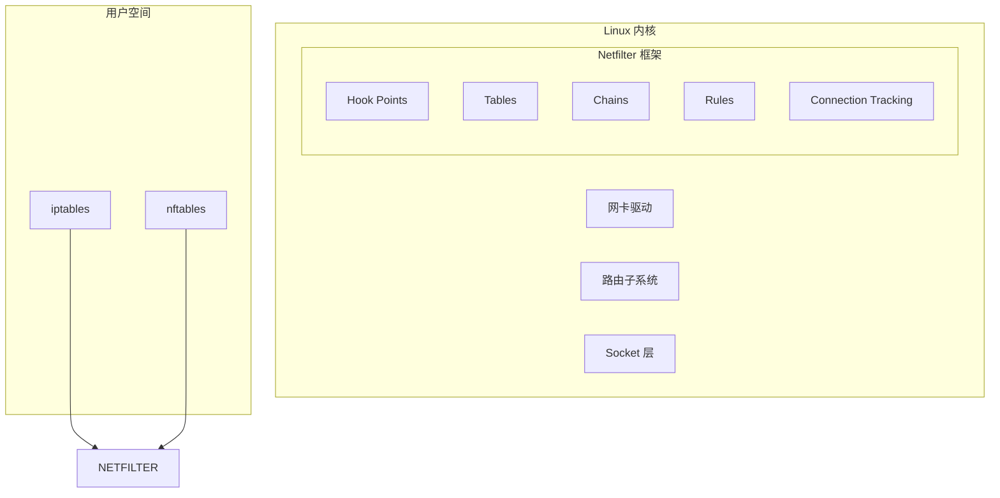
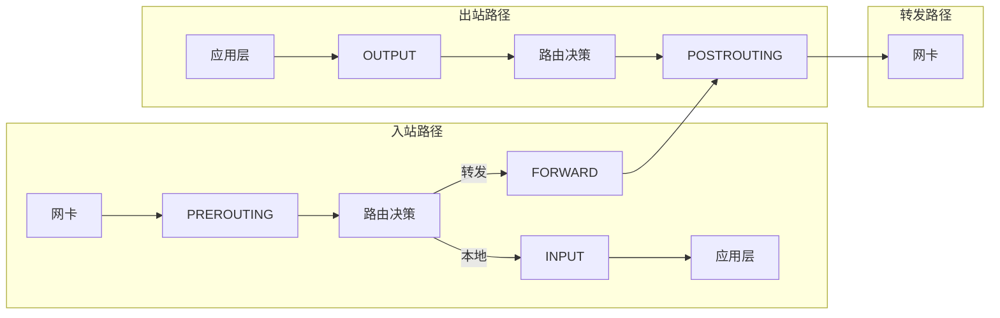
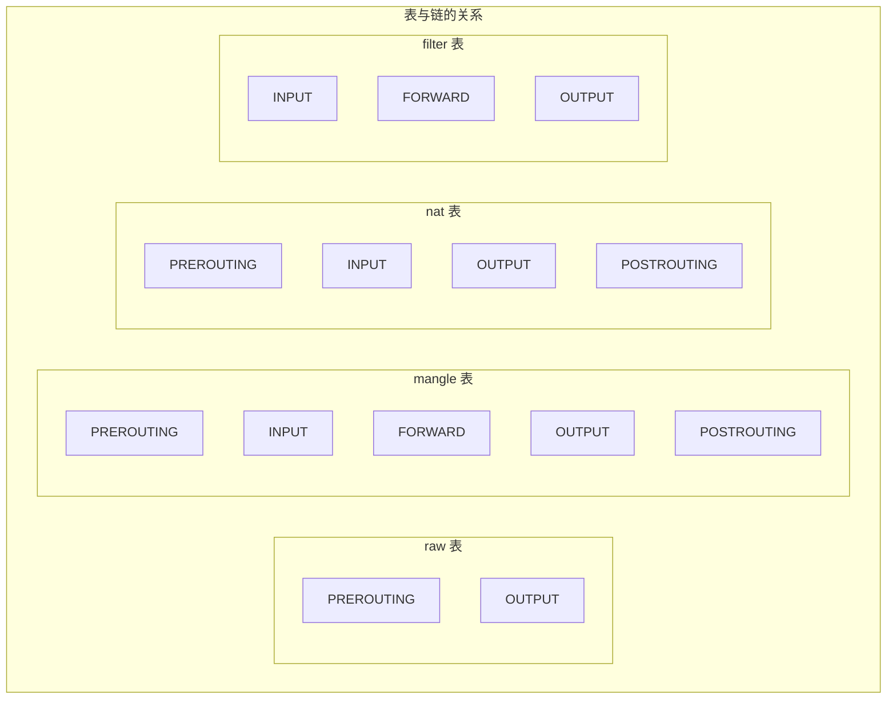
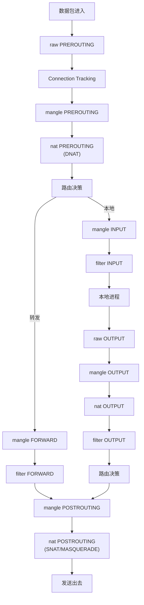
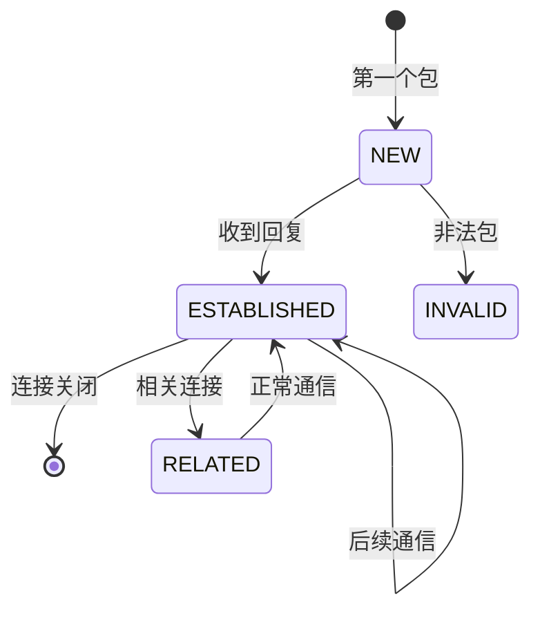
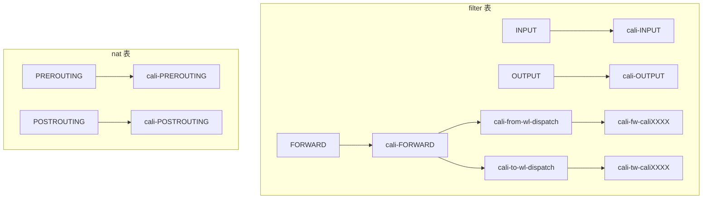
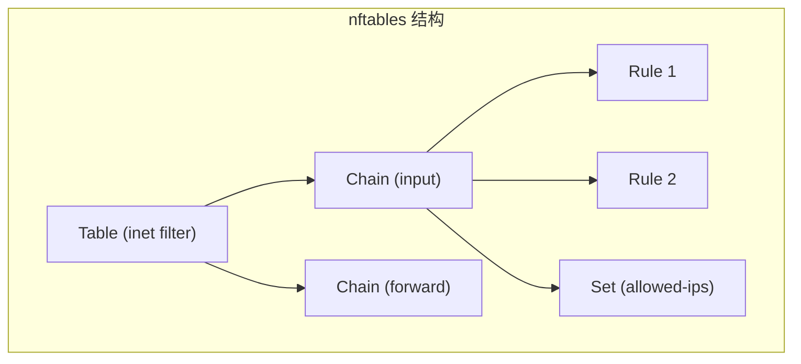
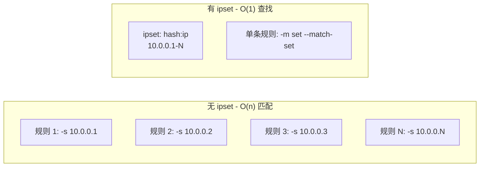

## 概述

iptables 是 Linux 内核防火墙的用户空间工具，也是 Calico 默认数据平面的核心组件。本章深入介绍 Netfilter 框架、iptables 的表链结构、规则匹配以及 nftables 的对比。

## 前置知识

- Linux 基础命令
- TCP/IP 协议栈
- 数据包结构（IP header、TCP/UDP header）

## Netfilter 框架

### 什么是 Netfilter

Netfilter 是 Linux 内核中的包过滤框架，提供以下功能：

- 数据包过滤（防火墙）
- 网络地址转换（NAT）
- 数据包修改（mangle）
- 连接追踪（conntrack）



### Netfilter Hook Points

数据包在内核中经过 5 个钩子点：



## iptables 五表五链

### 表（Tables）

| 表名 | 用途 | 内置链 |
|------|------|-------|
| **raw** | 连接追踪豁免 | PREROUTING, OUTPUT |
| **mangle** | 数据包修改 | 全部 5 个链 |
| **nat** | 地址转换 | PREROUTING, INPUT, OUTPUT, POSTROUTING |
| **filter** | 包过滤（防火墙） | INPUT, FORWARD, OUTPUT |
| **security** | SELinux 标记 | INPUT, FORWARD, OUTPUT |

### 链（Chains）



### 数据包流转顺序



## 规则匹配

### 规则结构

每条规则由匹配条件和目标动作组成：

```bash
iptables -A INPUT -p tcp --dport 80 -j ACCEPT
#        |链|     |--- 匹配条件 ---|  |目标|
```

### 常用匹配条件

```bash
# 协议匹配
-p tcp/udp/icmp

# 源/目标地址
-s 192.168.1.0/24
-d 10.0.0.1

# 接口匹配
-i eth0  # 入接口
-o eth1  # 出接口

# 端口匹配
--sport 1024:65535
--dport 80

# 状态匹配（conntrack）
-m conntrack --ctstate NEW,ESTABLISHED

# IP 集匹配
-m set --match-set my-ipset src
```

### 目标动作（Targets）

| 目标 | 说明 |
|------|------|
| **ACCEPT** | 接受数据包 |
| **DROP** | 丢弃数据包（无响应） |
| **REJECT** | 拒绝并返回 ICMP |
| **LOG** | 记录日志 |
| **RETURN** | 返回上级链 |
| **SNAT** | 源地址转换 |
| **DNAT** | 目标地址转换 |
| **MASQUERADE** | 动态 SNAT |
| **MARK** | 设置数据包标记 |

### 自定义链


## Connection Tracking（连接追踪）

### 连接状态



| 状态 | 说明 |
|------|------|
| **NEW** | 新连接的第一个包 |
| **ESTABLISHED** | 已建立连接的后续包 |
| **RELATED** | 与已有连接相关的新连接（如 FTP 数据连接） |
| **INVALID** | 无法识别的包 |
| **UNTRACKED** | 被 raw 表标记为不追踪 |

### conntrack 命令

```bash
# 查看连接追踪表
conntrack -L

# 示例输出
tcp   6 300 ESTABLISHED src=10.0.0.1 dst=10.0.0.2 sport=45678 dport=80 \
      src=10.0.0.2 dst=10.0.0.1 sport=80 dport=45678 [ASSURED] mark=0

# 清空连接追踪
conntrack -F

# 删除特定连接
conntrack -D -s 10.0.0.1
```

## Calico 使用的 iptables 规则

### Calico 链结构



### 常见 Calico 规则

```bash
# 查看 Calico filter 规则
iptables -L -n -v | grep -A 50 cali-FORWARD

# 典型输出
Chain cali-FORWARD (1 references)
 pkts bytes target     prot opt in     out     source      destination
 100K   10M cali-from-wl-dispatch  all  cali+  *    0.0.0.0/0   0.0.0.0/0
 100K   10M cali-to-wl-dispatch    all  *      cali+ 0.0.0.0/0  0.0.0.0/0
  50K    5M ACCEPT     all  --  *      *      0.0.0.0/0   0.0.0.0/0   mark match 0x10000/0x10000
```

### IPSet 的使用

Calico 使用 ipset 高效匹配大量 IP：

```bash
# 查看 Calico ipset
ipset list | grep cali

# 典型 ipset
Name: cali40s:some-policy-rule-id
Type: hash:net
Members:
10.0.0.0/24
10.0.1.0/24
```

## nftables - 下一代防火墙

### iptables vs nftables

| 特性 | iptables | nftables |
|------|----------|----------|
| 规则语法 | 命令行参数 | 结构化语法 |
| 原子更新 | 逐条更新 | 批量原子更新 |
| 性能 | 线性匹配 | 优化的数据结构 |
| 协议支持 | 分离的工具 | 统一框架 |
| 集合 | ipset（外部） | 内置集合 |

### nftables 基本语法

```bash
# 创建表
nft add table inet filter

# 创建链
nft add chain inet filter input { type filter hook input priority 0 \; }

# 添加规则
nft add rule inet filter input tcp dport 22 accept

# 查看规则
nft list ruleset
```

### nftables 结构



### Calico nftables 模式

Calico 3.26+ 支持 nftables 数据平面：

```bash
# 启用 nftables 模式
calicoctl patch felixconfiguration default --patch='{"spec":{"nftablesMode":"Enabled"}}'

# 查看 nftables 规则
nft list ruleset | grep cali
```

## 实验：手动配置防火墙规则

### 实验目标

创建基本的防火墙规则，理解 iptables 工作原理。

### 实验环境准备

```bash
# 保存当前规则（备份）
sudo iptables-save > ~/iptables-backup.txt

# 创建测试 namespace
sudo ip netns add fw-test
sudo ip link add veth-fw type veth peer name veth-ns
sudo ip link set veth-ns netns fw-test
sudo ip addr add 10.99.0.1/24 dev veth-fw
sudo ip link set veth-fw up
sudo ip netns exec fw-test ip addr add 10.99.0.2/24 dev veth-ns
sudo ip netns exec fw-test ip link set veth-ns up
sudo ip netns exec fw-test ip link set lo up
```

### 实验 1：基本过滤

```bash
# 启动简单的 HTTP 服务（在 namespace 中）
sudo ip netns exec fw-test python3 -m http.server 8080 &

# 测试连通性
curl http://10.99.0.2:8080

# 添加 DROP 规则
sudo iptables -A INPUT -s 10.99.0.2 -j DROP

# 再次测试（应该超时）
curl --connect-timeout 2 http://10.99.0.2:8080

# 查看规则
sudo iptables -L INPUT -n -v

# 删除规则
sudo iptables -D INPUT -s 10.99.0.2 -j DROP
```

### 实验 2：使用 conntrack

```bash
# 只允许已建立的连接
sudo iptables -A INPUT -m conntrack --ctstate ESTABLISHED,RELATED -j ACCEPT
sudo iptables -A INPUT -p tcp --dport 22 -m conntrack --ctstate NEW -j ACCEPT
sudo iptables -A INPUT -j DROP

# 查看连接追踪
sudo conntrack -L

# 清理
sudo iptables -F INPUT
```

### 实验 3：自定义链

```bash
# 创建自定义链
sudo iptables -N MY_RULES

# 添加规则到自定义链
sudo iptables -A MY_RULES -p tcp --dport 80 -j ACCEPT
sudo iptables -A MY_RULES -p tcp --dport 443 -j ACCEPT
sudo iptables -A MY_RULES -j RETURN

# 从 INPUT 跳转到自定义链
sudo iptables -A INPUT -j MY_RULES

# 查看
sudo iptables -L -n

# 清理
sudo iptables -F INPUT
sudo iptables -F MY_RULES
sudo iptables -X MY_RULES
```

### 实验 4：NAT 配置

```bash
# 启用 IP 转发
sudo sysctl -w net.ipv4.ip_forward=1

# MASQUERADE（SNAT）
sudo iptables -t nat -A POSTROUTING -s 10.99.0.0/24 -o eth0 -j MASQUERADE

# DNAT（端口转发）
sudo iptables -t nat -A PREROUTING -p tcp --dport 8888 -j DNAT --to-destination 10.99.0.2:8080

# 查看 NAT 规则
sudo iptables -t nat -L -n -v

# 清理
sudo iptables -t nat -F
```

### 清理实验环境

```bash
# 停止 HTTP 服务
sudo ip netns exec fw-test pkill python3

# 删除 namespace
sudo ip netns del fw-test

# 恢复 iptables（可选）
sudo iptables-restore < ~/iptables-backup.txt
```

## 性能优化

### ipset 的优势



### 减少规则数量

```bash
# 不好：多条规则
iptables -A INPUT -s 10.0.0.1 -j ACCEPT
iptables -A INPUT -s 10.0.0.2 -j ACCEPT
iptables -A INPUT -s 10.0.0.3 -j ACCEPT

# 好：使用 ipset
ipset create my-allowed hash:ip
ipset add my-allowed 10.0.0.1
ipset add my-allowed 10.0.0.2
ipset add my-allowed 10.0.0.3
iptables -A INPUT -m set --match-set my-allowed src -j ACCEPT
```

## 常用命令速查

### iptables 命令

```bash
# 列出规则
iptables -L -n -v                     # filter 表
iptables -t nat -L -n -v              # nat 表
iptables -t mangle -L -n -v           # mangle 表
iptables -t raw -L -n -v              # raw 表

# 添加规则
iptables -A <chain> <match> -j <target>
iptables -I <chain> <num> <match> -j <target>

# 删除规则
iptables -D <chain> <match> -j <target>
iptables -D <chain> <num>

# 清空链
iptables -F <chain>

# 保存/恢复
iptables-save > rules.txt
iptables-restore < rules.txt
```

### ipset 命令

```bash
# 创建集合
ipset create <name> <type>    # hash:ip, hash:net, hash:ip,port

# 添加/删除成员
ipset add <name> <member>
ipset del <name> <member>

# 列出集合
ipset list
ipset list <name>

# 销毁集合
ipset destroy <name>
```

### conntrack 命令

```bash
conntrack -L                  # 列出所有连接
conntrack -L -p tcp           # 只看 TCP
conntrack -E                  # 实时监控
conntrack -D -s <ip>          # 删除特定连接
conntrack -F                  # 清空所有
```

## 总结

本章介绍了 Linux 防火墙的核心知识：

1. **Netfilter** - 内核包过滤框架，提供 5 个 hook 点
2. **iptables 五表** - raw、mangle、nat、filter、security
3. **五链** - PREROUTING、INPUT、FORWARD、OUTPUT、POSTROUTING
4. **conntrack** - 连接追踪，支持状态化防火墙
5. **nftables** - 新一代防火墙，性能更优

Calico 利用这些机制实现网络策略，后续章节将详细介绍 Calico 的具体实现。

## 参考资料

- [Netfilter 官方文档](https://www.netfilter.org/documentation/)
- [iptables Tutorial](https://www.frozentux.net/iptables-tutorial/iptables-tutorial.html)
- [nftables Wiki](https://wiki.nftables.org/)
- [Calico iptables 实现](https://docs.tigera.io/calico/latest/reference/felix/ref-iptables)
