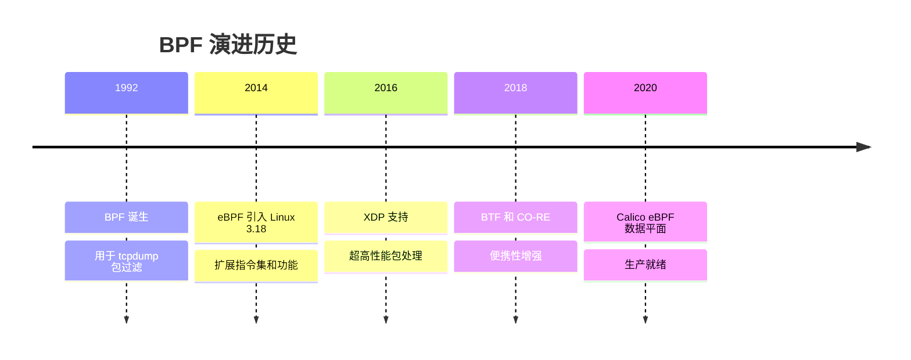
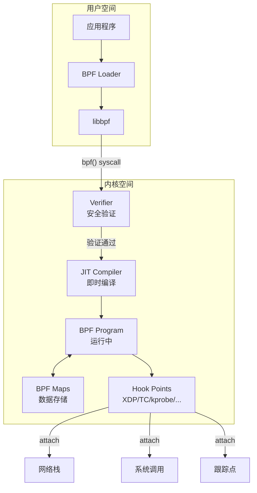
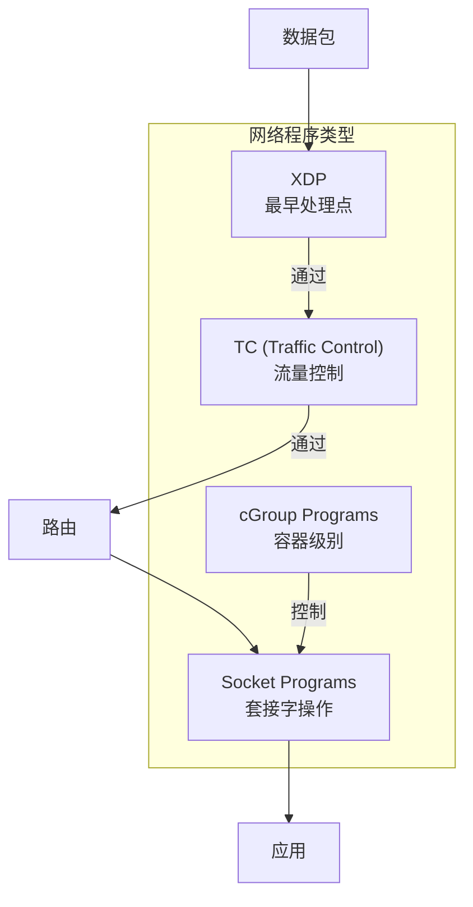
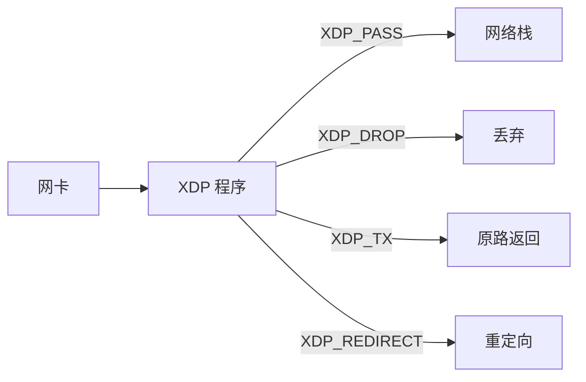
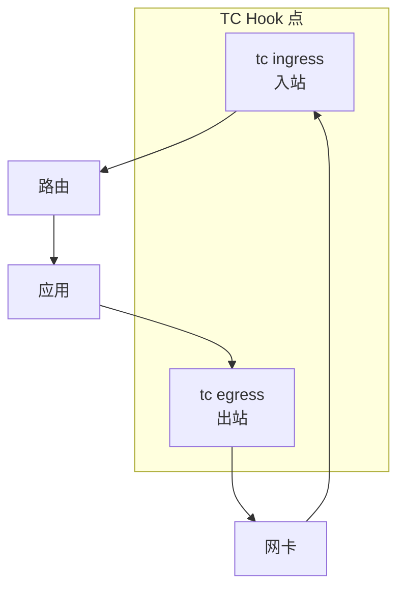
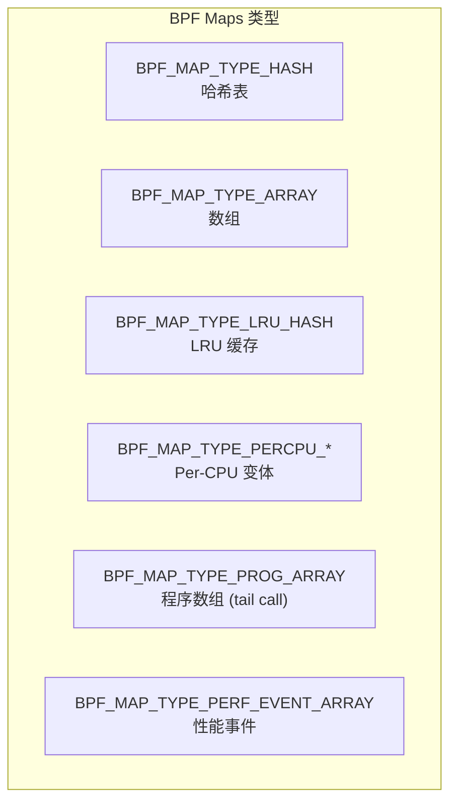
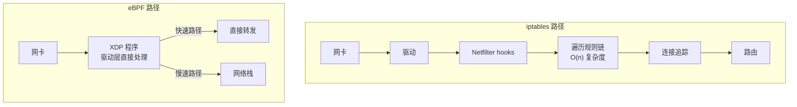
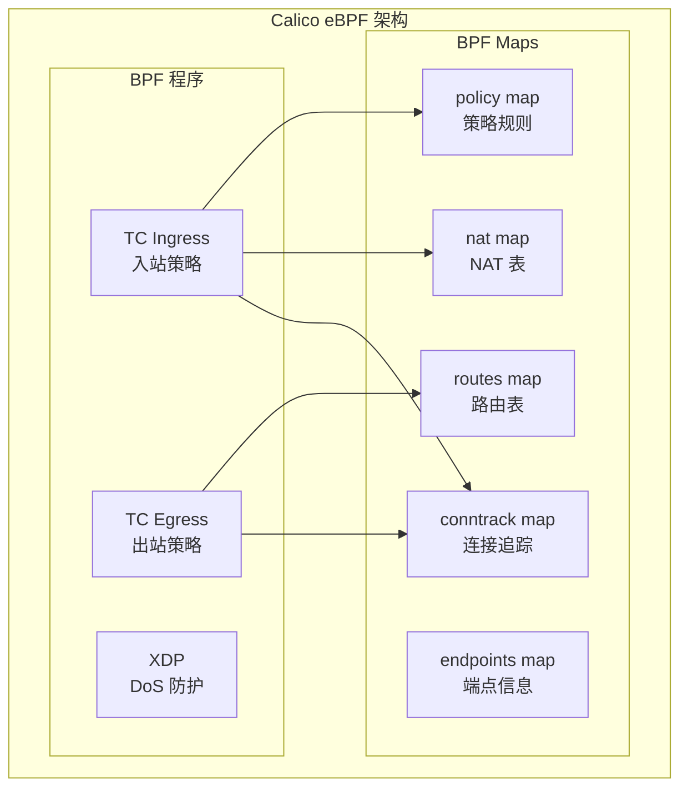
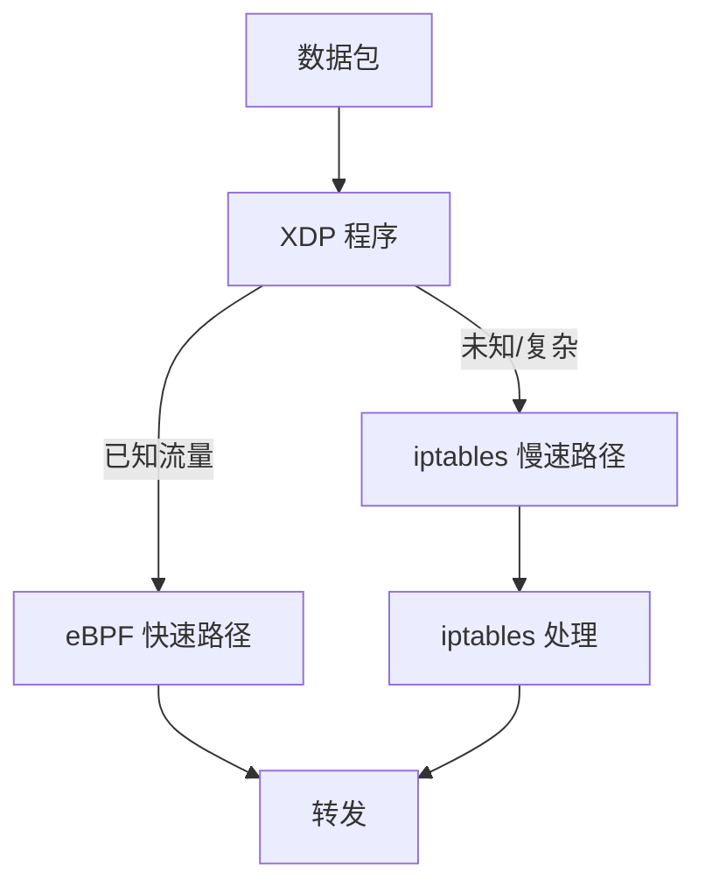

## 概述

eBPF（extended Berkeley Packet Filter）是 Linux 内核中的革命性技术，允许在内核中安全运行沙盒程序。Calico 使用 eBPF 作为高性能数据平面，替代传统的 iptables。本章介绍 eBPF 的核心概念及其在网络中的应用。

## 前置知识

- Linux 内核基础
- 网络协议栈工作原理
- C 语言基础（用于理解 eBPF 程序）

## eBPF 是什么

### 从 BPF 到 eBPF



### eBPF 架构



### 核心特性

| 特性 | 说明 |
|------|------|
| **安全性** | Verifier 确保程序安全，不会崩溃内核 |
| **高性能** | JIT 编译为原生机器码 |
| **可观测性** | 零拷贝访问内核数据 |
| **可编程** | 灵活的自定义逻辑 |
| **无需重启** | 动态加载/卸载程序 |

## BPF 程序类型

### 网络相关程序类型



### XDP (eXpress Data Path)

XDP 在网卡驱动层处理数据包，是最快的处理点：



**XDP 返回值**:
- `XDP_PASS`: 继续到网络栈
- `XDP_DROP`: 丢弃数据包
- `XDP_TX`: 从同一网卡发回
- `XDP_REDIRECT`: 重定向到其他接口/CPU
- `XDP_ABORTED`: 出错丢弃

### TC (Traffic Control)

TC 程序挂载在流量控制层：



**TC 返回值**:
- `TC_ACT_OK`: 继续处理
- `TC_ACT_SHOT`: 丢弃
- `TC_ACT_REDIRECT`: 重定向
- `TC_ACT_PIPE`: 继续到下一个 filter

## BPF Maps 数据结构

### 常用 Map 类型



| Map 类型 | 用途 |
|----------|------|
| **Hash** | 键值存储，如连接追踪表 |
| **Array** | 固定大小数组，如配置表 |
| **LRU Hash** | 自动淘汰旧条目，如 NAT 表 |
| **Per-CPU** | 每 CPU 独立，避免锁竞争 |
| **Prog Array** | 尾调用跳转表 |
| **Ring Buffer** | 高效事件传递到用户空间 |

### Map 操作

```c
// 用户空间操作
bpf_map_update_elem(map_fd, &key, &value, BPF_ANY);
bpf_map_lookup_elem(map_fd, &key, &value);
bpf_map_delete_elem(map_fd, &key);

// BPF 程序内操作
void *value = bpf_map_lookup_elem(&my_map, &key);
bpf_map_update_elem(&my_map, &key, &new_value, BPF_ANY);
```

## eBPF 在网络中的应用

### 与 iptables 性能对比



### 性能数据（典型场景）

| 场景 | iptables | eBPF | 提升 |
|------|----------|------|------|
| 包转发延迟 | ~10μs | ~2μs | 5x |
| 连接追踪查找 | O(n) | O(1) | 显著 |
| 规则匹配 | 线性遍历 | 哈希查找 | 10-100x |
| CPU 占用 | 高 | 低 | 30-50% |

### Calico eBPF 数据平面



## Calico eBPF 代码分析

### 代码位置

Calico 的 eBPF 程序位于：
- `felix/bpf-gpl/` - GPL 许可的 BPF 程序（C 代码）
- `felix/bpf/` - Go 封装和加载逻辑

### 核心文件

| 文件 | 功能 |
|------|------|
| `tc.c` | TC 程序主入口 |
| `policy.h` | 策略匹配逻辑 |
| `conntrack.h` | 连接追踪 |
| `nat.h` | NAT 处理 |
| `routes.h` | 路由查询 |
| `types.h` | 数据结构定义 |

### TC 程序入口分析

**文件**: `felix/bpf-gpl/tc.c`

```c
// TC 程序入口（简化）
SEC("tc")
int calico_tc_main(struct __sk_buff *skb) {
    // 1. 解析数据包
    struct cali_tc_ctx ctx = {};
    if (parse_packet(&ctx, skb) != PARSING_OK) {
        return TC_ACT_UNSPEC;
    }

    // 2. 连接追踪查找
    struct ct_entry *ct = ct_lookup(&ctx);

    // 3. 策略检查
    if (!policy_allow(&ctx, ct)) {
        return TC_ACT_SHOT;  // 丢弃
    }

    // 4. NAT 处理
    if (needs_nat(&ctx)) {
        do_nat(&ctx);
    }

    // 5. 转发决策
    return forward_packet(&ctx);
}
```

### BPF Maps 定义

**文件**: `felix/bpf-gpl/globals.h`

```c
// 连接追踪表
struct {
    __uint(type, BPF_MAP_TYPE_HASH);
    __type(key, struct ct_key);
    __type(value, struct ct_entry);
    __uint(max_entries, 512000);
} cali_v4_ct_map SEC(".maps");

// NAT 前端表
struct {
    __uint(type, BPF_MAP_TYPE_HASH);
    __type(key, struct nat_fe_key);
    __type(value, struct nat_fe_entry);
    __uint(max_entries, 64000);
} cali_v4_nat_fe SEC(".maps");

// 路由表
struct {
    __uint(type, BPF_MAP_TYPE_LPM_TRIE);
    __type(key, struct lpm_key);
    __type(value, struct route_entry);
    __uint(max_entries, 256000);
} cali_v4_routes SEC(".maps");
```

## 实验：编写简单 eBPF 程序

### 实验环境准备

```bash
# 安装依赖（Ubuntu/Debian）
sudo apt-get install -y clang llvm libelf-dev libbpf-dev linux-headers-$(uname -r)

# 检查内核版本（需要 4.18+）
uname -r
```

### 实验 1：简单的 XDP 丢包程序

创建 `xdp_drop.c`:

```c
#include <linux/bpf.h>
#include <bpf/bpf_helpers.h>

// 丢弃所有 ICMP 包
SEC("xdp")
int xdp_drop_icmp(struct xdp_md *ctx) {
    void *data = (void *)(long)ctx->data;
    void *data_end = (void *)(long)ctx->data_end;

    // 解析以太网头
    struct ethhdr *eth = data;
    if ((void *)(eth + 1) > data_end)
        return XDP_PASS;

    // 只处理 IPv4
    if (eth->h_proto != __constant_htons(ETH_P_IP))
        return XDP_PASS;

    // 解析 IP 头
    struct iphdr *ip = (void *)(eth + 1);
    if ((void *)(ip + 1) > data_end)
        return XDP_PASS;

    // 丢弃 ICMP
    if (ip->protocol == IPPROTO_ICMP) {
        bpf_printk("Dropping ICMP packet\n");
        return XDP_DROP;
    }

    return XDP_PASS;
}

char _license[] SEC("license") = "GPL";
```

编译和加载：

```bash
# 编译
clang -O2 -target bpf -c xdp_drop.c -o xdp_drop.o

# 加载到接口
sudo ip link set dev eth0 xdp obj xdp_drop.o sec xdp

# 测试（从另一台机器 ping）
ping <this-host-ip>  # 应该无响应

# 查看日志
sudo cat /sys/kernel/debug/tracing/trace_pipe

# 卸载
sudo ip link set dev eth0 xdp off
```

### 实验 2：包计数器

创建 `xdp_counter.c`:

```c
#include <linux/bpf.h>
#include <bpf/bpf_helpers.h>

// 定义 Map 存储计数
struct {
    __uint(type, BPF_MAP_TYPE_PERCPU_ARRAY);
    __type(key, __u32);
    __type(value, __u64);
    __uint(max_entries, 1);
} pkt_count SEC(".maps");

SEC("xdp")
int xdp_counter(struct xdp_md *ctx) {
    __u32 key = 0;
    __u64 *count;

    count = bpf_map_lookup_elem(&pkt_count, &key);
    if (count) {
        (*count)++;
    }

    return XDP_PASS;
}

char _license[] SEC("license") = "GPL";
```

用户空间读取程序 `read_counter.py`:

```python
#!/usr/bin/env python3
from bcc import BPF
import time

# 加载程序
b = BPF(src_file="xdp_counter.c")
fn = b.load_func("xdp_counter", BPF.XDP)
b.attach_xdp("eth0", fn)

# 获取 map
pkt_count = b.get_table("pkt_count")

try:
    while True:
        total = 0
        for k, v in pkt_count.items():
            total += v.value
        print(f"Total packets: {total}")
        time.sleep(1)
except KeyboardInterrupt:
    pass

# 清理
b.remove_xdp("eth0")
```

### 实验 3：查看 Calico eBPF Maps

```bash
# 启用 Calico eBPF 模式（如果未启用）
kubectl patch felixconfiguration default --type='merge' -p '{"spec":{"bpfEnabled":true}}'

# 查看加载的 BPF 程序
sudo bpftool prog list | grep calico

# 查看 BPF maps
sudo bpftool map list | grep cali

# 查看连接追踪表内容
sudo bpftool map dump name cali_v4_ct_map

# 查看路由表
sudo bpftool map dump name cali_v4_routes

# 查看 TC 程序附加情况
tc filter show dev <cali-interface> ingress
tc filter show dev <cali-interface> egress
```

## eBPF 调试技巧

### bpf_printk 日志

```c
// 在 BPF 程序中
bpf_printk("src=%pI4 dst=%pI4\n", &ip->saddr, &ip->daddr);

// 查看日志
sudo cat /sys/kernel/debug/tracing/trace_pipe
```

### bpftool 命令

```bash
# 列出程序
bpftool prog list

# 查看程序详情
bpftool prog show id <id>

# 导出程序字节码
bpftool prog dump xlated id <id>

# 列出 Maps
bpftool map list

# 查看 Map 内容
bpftool map dump id <id>

# 更新 Map 条目
bpftool map update id <id> key <hex> value <hex>
```

### 常见问题排查

```bash
# 检查 BPF 文件系统
mount | grep bpf

# 检查内核配置
cat /boot/config-$(uname -r) | grep BPF

# 查看 BPF 日志
dmesg | grep -i bpf

# 验证程序
llvm-objdump -d program.o
```

## eBPF 与 iptables 选择

### 何时使用 eBPF

- 高性能场景（>10Gbps）
- 大规模集群（>100 节点）
- 需要绕过 kube-proxy
- Linux 内核 5.3+

### 何时使用 iptables

- 老旧内核（<4.18）
- 需要与其他 iptables 工具兼容
- 小规模集群
- 调试更简单

### 混合模式

Calico 支持 eBPF 数据平面同时保留 iptables failsafe 规则：



## 总结

本章介绍了 eBPF 的核心概念：

1. **eBPF 架构** - Verifier 确保安全，JIT 提升性能
2. **程序类型** - XDP（最快）、TC（灵活）、Socket 等
3. **BPF Maps** - 程序间和用户空间数据共享
4. **网络应用** - 高性能包处理，替代 iptables
5. **Calico 实现** - TC 程序实现策略，Maps 存储状态

eBPF 是 Calico 高性能数据平面的基础，后续章节将深入分析 Calico 的 eBPF 实现细节。

## 参考资料

- [eBPF 官方网站](https://ebpf.io/)
- [BPF and XDP Reference Guide](https://docs.cilium.io/en/stable/bpf/)
- [Linux Kernel BPF Documentation](https://www.kernel.org/doc/html/latest/bpf/)
- [Calico eBPF Dataplane](https://docs.tigera.io/calico/latest/operations/ebpf/)
- [BCC Tools](https://github.com/iovisor/bcc)
