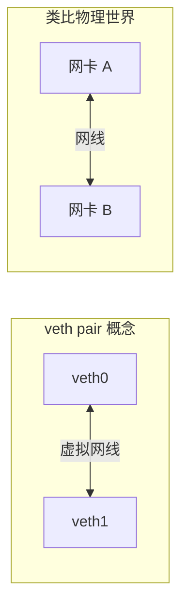
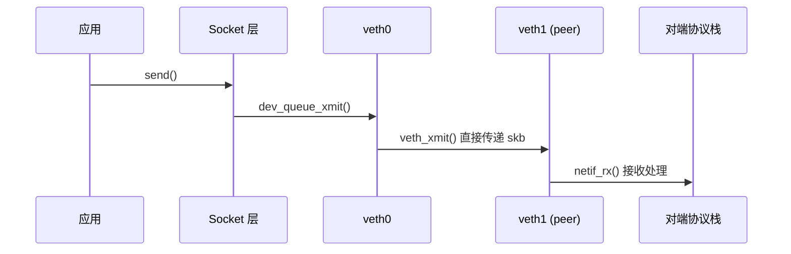
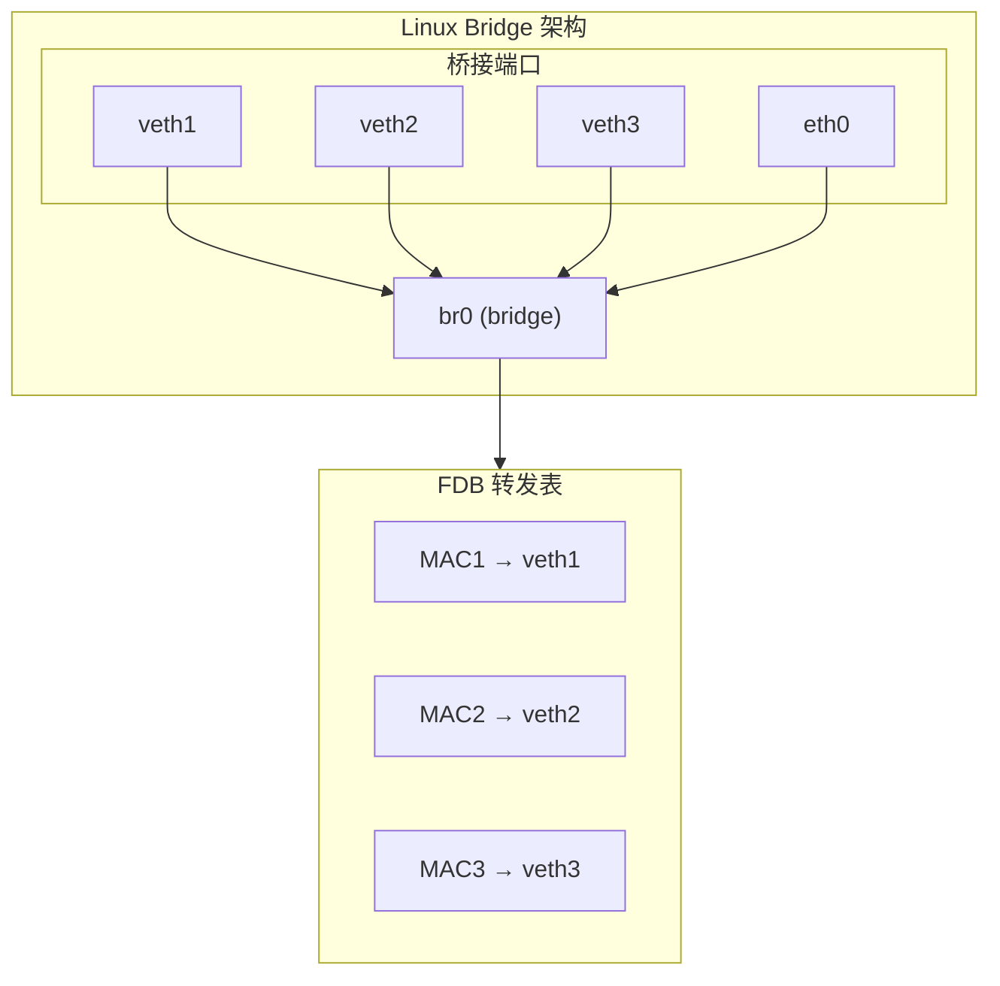
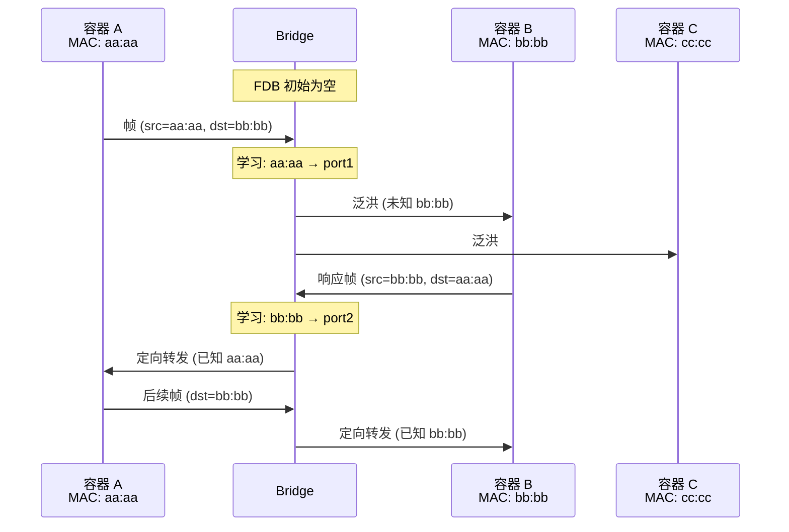
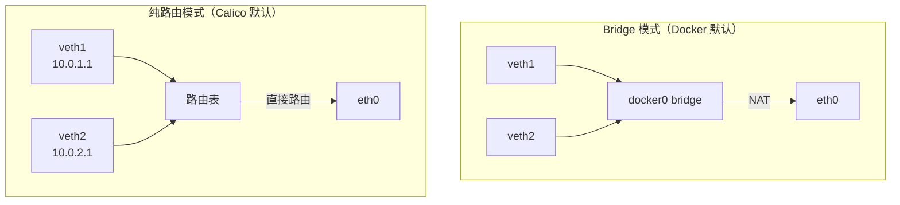
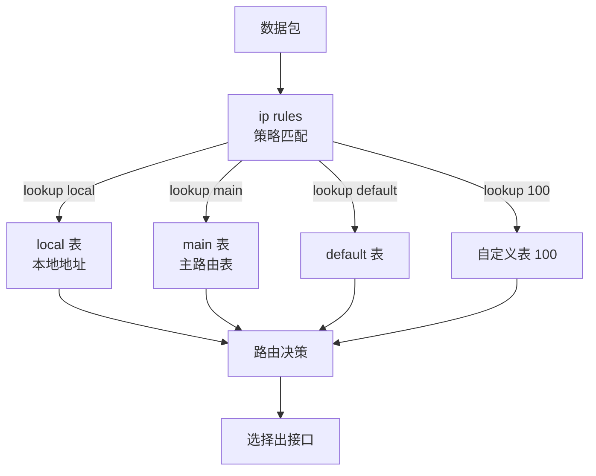
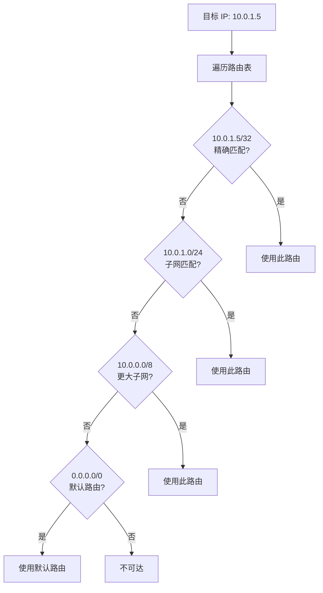
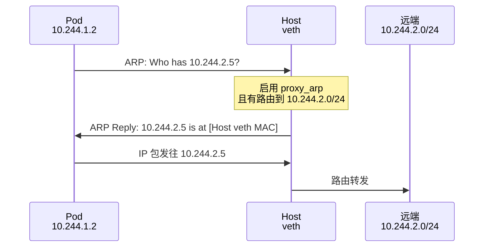
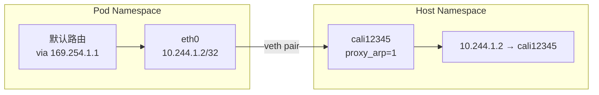
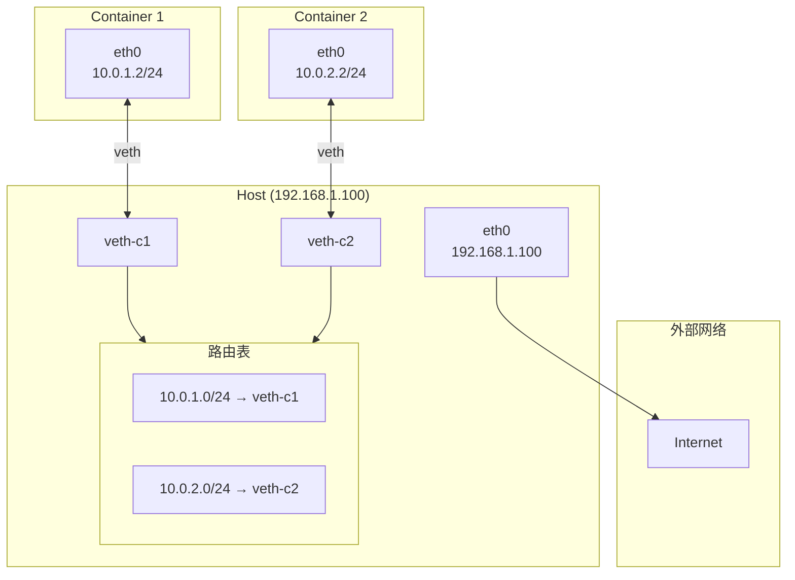

## 概述

veth pair 和 Linux bridge 是容器网络的核心组件。本章深入介绍 veth pair 的工作原理、Linux bridge 的实现机制，以及 Linux 路由决策流程，最后通过实验手动搭建一个容器网络。

## 前置知识

- Linux 网络命名空间
- 基本的 TCP/IP 知识
- Linux 命令行操作

## veth pair 原理

### 什么是 veth pair

veth（Virtual Ethernet）是成对创建的虚拟网络设备，一端发送的数据会直接出现在另一端，类似于一根虚拟网线。



### 内核实现

veth pair 在内核中的数据结构：

```c
// net/drivers/veth.c
struct veth_priv {
    struct net_device __rcu *peer;  // 指向对端设备
    atomic64_t          dropped;
    struct bpf_prog     *_xdp_prog;
    // ...
};
```

**数据传输流程**：



### veth 的特点

| 特点 | 说明 |
|------|------|
| 成对创建 | 创建时必须指定 peer name |
| 可跨 namespace | 一端可以移动到其他 namespace |
| 二层设备 | 传输以太网帧，有 MAC 地址 |
| 无需 IP | 可以不配置 IP 地址直接传输 |
| 支持 XDP | 可挂载 XDP 程序 |

### 创建和配置 veth

```bash
# 创建 veth pair
ip link add veth0 type veth peer name veth1

# 查看创建结果
ip link show type veth
# 输出：
# 5: veth1@veth0: <BROADCAST,MULTICAST> mtu 1500 ...
# 6: veth0@veth1: <BROADCAST,MULTICAST> mtu 1500 ...

# 移动一端到其他 namespace
ip link set veth1 netns my-namespace

# 配置 IP
ip addr add 10.0.0.1/24 dev veth0
ip netns exec my-namespace ip addr add 10.0.0.2/24 dev veth1

# 启用
ip link set veth0 up
ip netns exec my-namespace ip link set veth1 up
```

## Linux Bridge 工作原理

### 什么是 Linux Bridge

Linux bridge 是内核实现的虚拟二层交换机，可以将多个网络接口桥接在一起。



### 工作机制

Bridge 像物理交换机一样工作：

1. **学习** - 记录源 MAC 与入端口的对应关系
2. **转发** - 根据目标 MAC 查找出端口
3. **泛洪** - 未知目标 MAC 时向所有端口广播



### Bridge 命令

```bash
# 创建 bridge
ip link add br0 type bridge

# 添加接口到 bridge
ip link set veth1 master br0
ip link set veth2 master br0

# 查看 bridge 端口
bridge link show

# 查看 FDB（转发数据库）
bridge fdb show br br0

# 配置 bridge IP（可选，使宿主机能访问桥接网络）
ip addr add 192.168.100.1/24 dev br0

# 启用
ip link set br0 up

# 从 bridge 移除接口
ip link set veth1 nomaster

# 删除 bridge
ip link del br0
```

### Bridge vs 纯路由（Calico 的选择）



**Calico 使用纯路由模式的原因**：

| 特性 | Bridge 模式 | 纯路由模式 |
|------|------------|-----------|
| 性能 | 需要 MAC 学习和查找 | 直接路由，更快 |
| 广播域 | 共享广播域 | 隔离广播 |
| IP 管理 | 同一子网 | 可不同子网 |
| 策略控制 | 在 bridge 上难以精细控制 | 每个 veth 独立策略 |
| 扩展性 | 大规模时 FDB 表压力 | 路由表更高效 |

## Linux 路由决策流程

### 路由表结构

Linux 支持多路由表，通过策略路由（policy routing）选择：



### 路由查找算法



**最长前缀匹配**（Longest Prefix Match）：
- 多个路由匹配时，选择掩码最长的
- 例如：10.0.1.5 同时匹配 10.0.0.0/8 和 10.0.1.0/24，选择 /24

### 路由类型详解

```bash
# 直连路由（Connected）
10.0.0.0/24 dev eth0 proto kernel scope link src 10.0.0.1

# 静态路由（via 网关）
10.1.0.0/24 via 10.0.0.254 dev eth0

# 主机路由（/32）
10.0.1.5 dev cali12345 scope link

# 黑洞路由
blackhole 192.168.0.0/16

# 策略路由示例
ip rule add from 10.0.1.0/24 table 100
ip route add default via 10.0.2.1 table 100
```

### Calico 路由示例

```bash
# 查看 Calico 节点的路由表
ip route | grep cali

# 典型输出：
# Pod 路由（本节点）
10.244.1.2 dev cali1234abcd scope link
10.244.1.3 dev cali5678efgh scope link

# Pod 路由（其他节点，BGP 学习）
10.244.2.0/24 via 192.168.1.102 dev eth0 proto bird
10.244.3.0/24 via 192.168.1.103 dev eth0 proto bird

# 隧道路由（IPIP 模式）
10.244.2.0/24 via 192.168.1.102 dev tunl0 proto bird onlink
```

## Proxy ARP

### 什么是 Proxy ARP

Proxy ARP 允许一台设备代替另一台设备回复 ARP 请求。当目标 IP 不在本地子网但经过本设备路由时很有用。



### Calico 中的 Proxy ARP

Calico 使用 Proxy ARP 让 Pod 能够与任意 IP 通信：

```bash
# Calico veth 配置
# Pod 内：
# - IP: 10.244.1.2/32（注意是 /32）
# - 网关: 169.254.1.1（链路本地地址）

# Host 侧 veth：
# - 启用 proxy_arp
sysctl net.ipv4.conf.cali12345.proxy_arp=1
```

**工作流程**：



## 实验：手动搭建容器网络

### 实验目标

不使用 Docker 或 CNI，手动创建两个"容器"（network namespace），并实现：
1. 容器与宿主机通信
2. 容器之间通信
3. 容器访问外网

### 实验拓扑



### 步骤 1：创建 Network Namespace

```bash
# 创建两个 namespace（模拟容器）
sudo ip netns add container1
sudo ip netns add container2

# 验证
ip netns list
```

### 步骤 2：创建 veth pairs

```bash
# 为 container1 创建 veth pair
sudo ip link add veth-c1 type veth peer name eth0 netns container1

# 为 container2 创建 veth pair
sudo ip link add veth-c2 type veth peer name eth0 netns container2

# 查看 host 侧的 veth
ip link | grep veth
```

### 步骤 3：配置 IP 地址

```bash
# Container1 配置
sudo ip netns exec container1 ip addr add 10.0.1.2/24 dev eth0
sudo ip netns exec container1 ip link set eth0 up
sudo ip netns exec container1 ip link set lo up

# Container2 配置
sudo ip netns exec container2 ip addr add 10.0.2.2/24 dev eth0
sudo ip netns exec container2 ip link set eth0 up
sudo ip netns exec container2 ip link set lo up

# Host 侧 veth 配置
sudo ip addr add 10.0.1.1/24 dev veth-c1
sudo ip addr add 10.0.2.1/24 dev veth-c2
sudo ip link set veth-c1 up
sudo ip link set veth-c2 up
```

### 步骤 4：配置路由

```bash
# Container1 默认路由
sudo ip netns exec container1 ip route add default via 10.0.1.1

# Container2 默认路由
sudo ip netns exec container2 ip route add default via 10.0.2.1

# 启用 IP 转发
sudo sysctl -w net.ipv4.ip_forward=1
```

### 步骤 5：测试容器间通信

```bash
# Container1 ping Container2
sudo ip netns exec container1 ping -c 3 10.0.2.2

# Container2 ping Container1
sudo ip netns exec container2 ping -c 3 10.0.1.2

# 查看路由
sudo ip netns exec container1 ip route
# 输出：
# 10.0.1.0/24 dev eth0 proto kernel scope link src 10.0.1.2
# default via 10.0.1.1 dev eth0
```

### 步骤 6：配置 NAT 访问外网

```bash
# 配置 MASQUERADE（SNAT）
sudo iptables -t nat -A POSTROUTING -s 10.0.1.0/24 -o eth0 -j MASQUERADE
sudo iptables -t nat -A POSTROUTING -s 10.0.2.0/24 -o eth0 -j MASQUERADE

# 测试外网访问
sudo ip netns exec container1 ping -c 3 8.8.8.8

# 测试 DNS（如果有）
sudo ip netns exec container1 curl -s ifconfig.me
```

### 步骤 7：使用 Calico 风格的配置

模拟 Calico 的 /32 路由 + Proxy ARP：

```bash
# 清理之前的配置
sudo ip netns del container1
sudo ip netns del container2

# 重新创建
sudo ip netns add container1
sudo ip netns add container2

# 创建 veth（Calico 风格命名）
sudo ip link add cali0001 type veth peer name eth0 netns container1
sudo ip link add cali0002 type veth peer name eth0 netns container2

# Container 内配置（/32 地址 + 链路本地网关）
sudo ip netns exec container1 ip addr add 10.244.1.2/32 dev eth0
sudo ip netns exec container1 ip link set eth0 up
sudo ip netns exec container1 ip link set lo up
sudo ip netns exec container1 ip route add 169.254.1.1 dev eth0
sudo ip netns exec container1 ip route add default via 169.254.1.1 dev eth0

sudo ip netns exec container2 ip addr add 10.244.1.3/32 dev eth0
sudo ip netns exec container2 ip link set eth0 up
sudo ip netns exec container2 ip link set lo up
sudo ip netns exec container2 ip route add 169.254.1.1 dev eth0
sudo ip netns exec container2 ip route add default via 169.254.1.1 dev eth0

# Host 侧配置
sudo ip link set cali0001 up
sudo ip link set cali0002 up

# 启用 Proxy ARP
sudo sysctl -w net.ipv4.conf.cali0001.proxy_arp=1
sudo sysctl -w net.ipv4.conf.cali0002.proxy_arp=1

# 添加路由（Calico 风格）
sudo ip route add 10.244.1.2 dev cali0001 scope link
sudo ip route add 10.244.1.3 dev cali0002 scope link

# 启用转发
sudo sysctl -w net.ipv4.ip_forward=1

# 测试
sudo ip netns exec container1 ping -c 3 10.244.1.3
```

### 清理实验环境

```bash
# 删除 namespace
sudo ip netns del container1
sudo ip netns del container2

# 清理 NAT 规则
sudo iptables -t nat -F POSTROUTING

# veth 会随 namespace 删除自动清理
```

## 关键命令速查

### veth 操作

```bash
# 创建
ip link add <name> type veth peer name <peer-name>
ip link add <name> type veth peer name <peer-name> netns <ns>

# 移动到 namespace
ip link set <name> netns <ns>

# 重命名
ip link set <name> name <new-name>
```

### Bridge 操作

```bash
# 创建
ip link add <name> type bridge

# 添加端口
ip link set <dev> master <bridge>

# 移除端口
ip link set <dev> nomaster

# 查看 FDB
bridge fdb show br <bridge>

# STP 控制
ip link set <bridge> type bridge stp_state 1
```

### 路由操作

```bash
# 添加主机路由
ip route add <ip>/32 dev <dev> scope link

# 添加网络路由
ip route add <network>/<prefix> via <gateway>

# 策略路由
ip rule add from <src> table <table-id>
ip route add default via <gw> table <table-id>
```

### Proxy ARP

```bash
# 启用
sysctl -w net.ipv4.conf.<dev>.proxy_arp=1

# 查看
sysctl net.ipv4.conf.<dev>.proxy_arp
```

## 总结

本章介绍了容器网络的核心组件：

1. **veth pair** - 连接不同 namespace 的虚拟网线
2. **Linux bridge** - 虚拟二层交换机，Docker 默认使用
3. **路由** - Calico 使用纯路由模式，每个 Pod 独立路由
4. **Proxy ARP** - 让 Pod 能够与任意 IP 通信

Calico 选择纯路由模式而非 bridge 模式，因为：
- 性能更高（无需 MAC 学习）
- 策略控制更精细（每个 veth 独立）
- 扩展性更好（路由表比 FDB 表更高效）

## 参考资料

- [Linux Virtual Ethernet Pair](https://man7.org/linux/man-pages/man4/veth.4.html)
- [Linux Bridge](https://wiki.linuxfoundation.org/networking/bridge)
- [Calico Routing Modes](https://docs.tigera.io/calico/latest/networking/configuring/vxlan-ipip)
- [Understanding Linux Routing](https://www.kernel.org/doc/Documentation/networking/ip-sysctl.txt)
