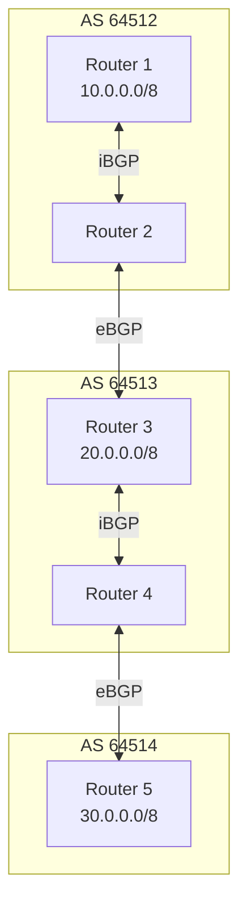
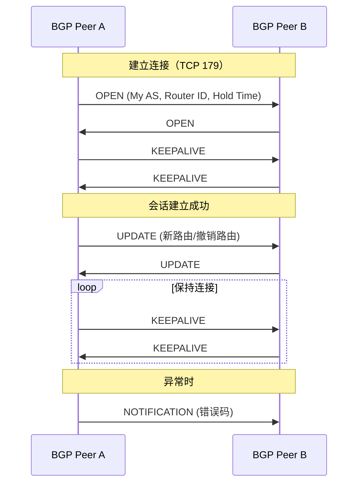
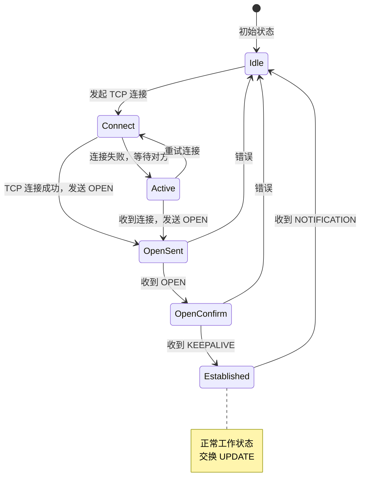
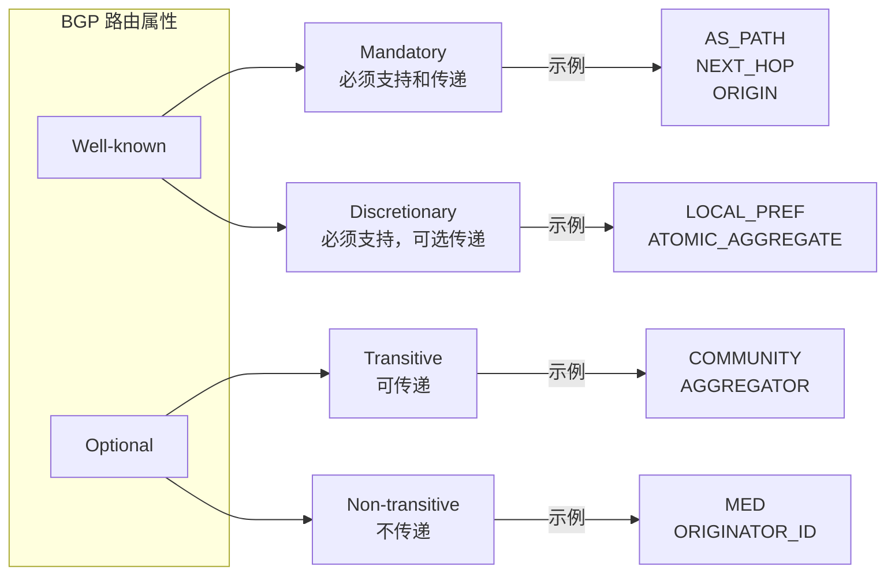
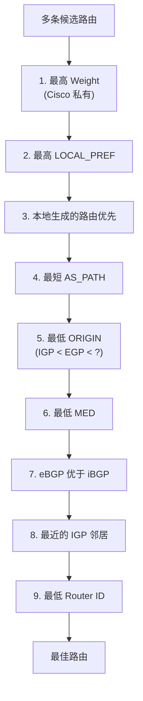
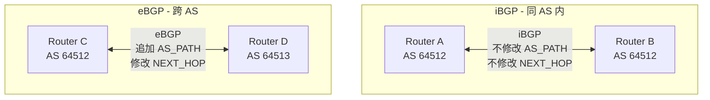
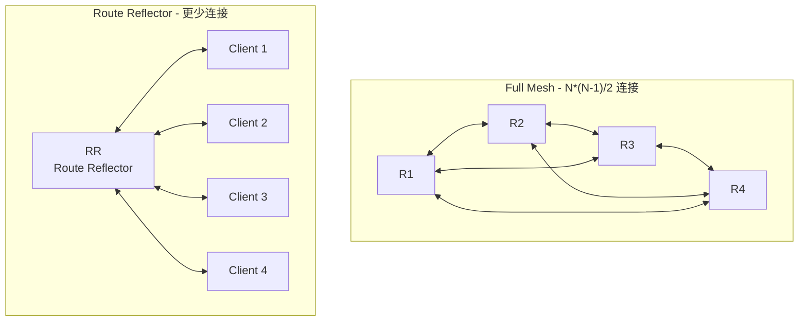
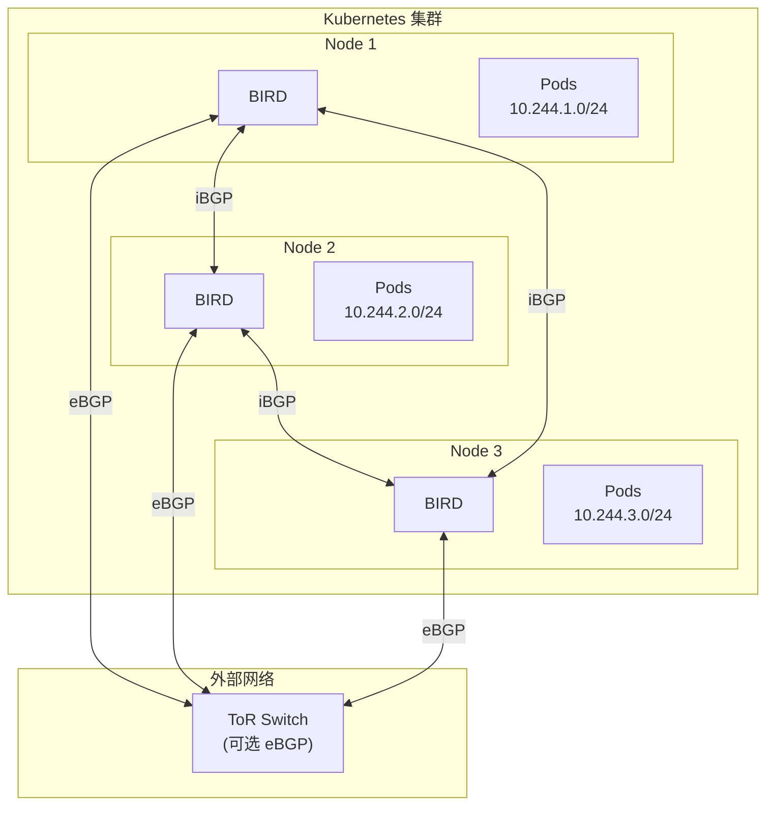
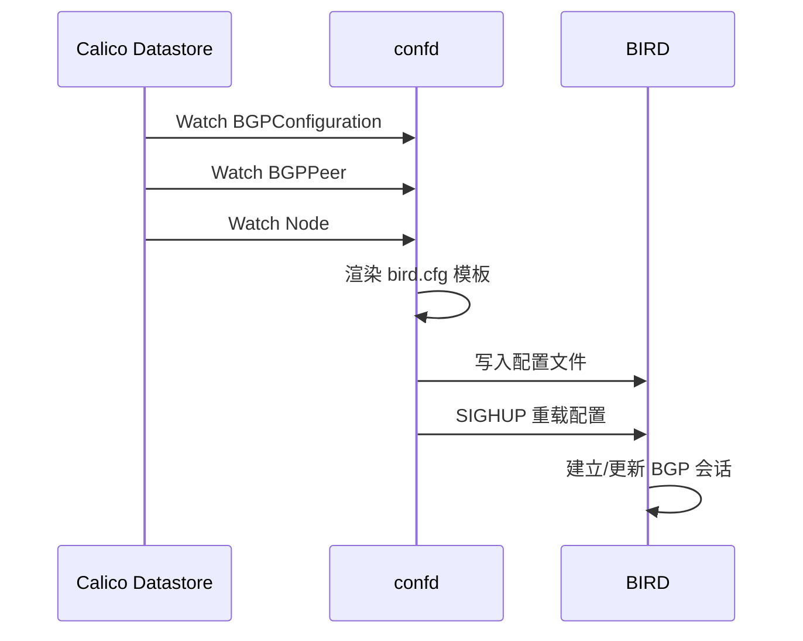
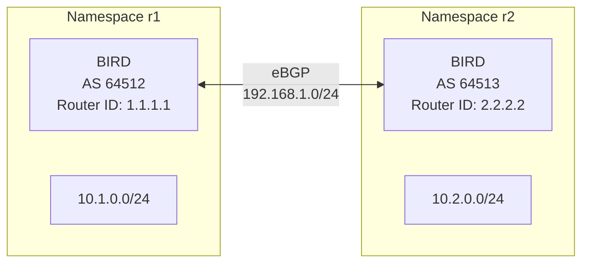

## 概述

BGP（Border Gateway Protocol，边界网关协议）是互联网的核心路由协议，也是 Calico 实现跨节点路由分发的关键技术。本章介绍 BGP 的基本概念、工作原理，以及 Calico 使用的 BIRD 路由软件。

## 前置知识

- TCP/IP 网络基础
- 路由基本概念
- Linux 路由表操作

## BGP 协议基础

### 什么是 BGP

BGP 是一种路径向量（Path Vector）路由协议，用于在自治系统（AS）之间交换路由信息。



### 核心概念

| 概念 | 说明 |
|------|------|
| **AS（自治系统）** | 共享统一路由策略的网络集合，由 ASN 标识 |
| **ASN** | AS Number，16位（1-65535）或32位标识符 |
| **iBGP** | 同一 AS 内部的 BGP 对等 |
| **eBGP** | 不同 AS 之间的 BGP 对等 |
| **Peer** | BGP 邻居，建立 TCP 连接交换路由 |
| **NLRI** | Network Layer Reachability Information，路由前缀 |
| **Path Attributes** | 路由属性（AS_PATH、NEXT_HOP 等） |

### BGP 消息类型



| 消息类型 | 用途 |
|----------|------|
| **OPEN** | 建立会话，交换参数（AS、Router ID、能力） |
| **UPDATE** | 通告新路由或撤销路由 |
| **KEEPALIVE** | 保持会话活跃（默认 60s 间隔） |
| **NOTIFICATION** | 报告错误，关闭会话 |

### BGP 状态机



### 路由属性

BGP UPDATE 消息包含多种路由属性：



**关键属性**：

| 属性 | 类型 | 说明 |
|------|------|------|
| **AS_PATH** | Well-known Mandatory | 路由经过的 AS 列表，用于防环 |
| **NEXT_HOP** | Well-known Mandatory | 下一跳地址 |
| **ORIGIN** | Well-known Mandatory | 路由来源（IGP/EGP/Incomplete） |
| **LOCAL_PREF** | Well-known Discretionary | 本地优先级（iBGP 内） |
| **MED** | Optional Non-transitive | 多出口鉴别符 |
| **COMMUNITY** | Optional Transitive | 路由标签/分组 |

### BGP 选路算法

当有多条路由到达同一目的地时，BGP 按以下顺序选择最佳路由：



## iBGP vs eBGP

### 主要区别



| 特性 | iBGP | eBGP |
|------|------|------|
| AS 关系 | 同一 AS | 不同 AS |
| AS_PATH | 不修改 | 追加本 AS |
| NEXT_HOP | 默认不修改 | 修改为自己 |
| TTL | 默认 255 | 默认 1 |
| 全互联要求 | 需要全互联或 RR | 不需要 |

### iBGP 全互联问题

iBGP 有一个规则：从 iBGP 邻居学到的路由不会再传给其他 iBGP 邻居（防环）。这导致 iBGP 需要全互联（Full Mesh）。



**解决方案**：
1. **Route Reflector (RR)** - 专门的路由反射器，可以将 iBGP 路由反射给其他客户端
2. **Confederation** - 将 AS 划分为多个子 AS

## Calico 中的 BGP

### Calico BGP 架构



### BGP 模式

Calico 支持多种 BGP 配置模式：

**1. Node-to-Node Mesh（默认）**

```yaml
# 默认启用，所有节点互相建立 BGP 连接
apiVersion: projectcalico.org/v3
kind: BGPConfiguration
metadata:
  name: default
spec:
  nodeToNodeMeshEnabled: true
  asNumber: 64512
```

**2. Route Reflector 模式**

```yaml
# 禁用 mesh，使用 RR
apiVersion: projectcalico.org/v3
kind: BGPConfiguration
metadata:
  name: default
spec:
  nodeToNodeMeshEnabled: false
  asNumber: 64512

---
# 指定 RR 节点
apiVersion: projectcalico.org/v3
kind: Node
metadata:
  name: node-rr-1
  labels:
    route-reflector: "true"
spec:
  bgp:
    routeReflectorClusterID: 1.0.0.1
```

**3. 与外部网络对等**

```yaml
apiVersion: projectcalico.org/v3
kind: BGPPeer
metadata:
  name: tor-switch
spec:
  peerIP: 192.168.1.1
  asNumber: 64513
  nodeSelector: all()
```

## BIRD 路由软件

### 什么是 BIRD

BIRD（BIRD Internet Routing Daemon）是开源的路由软件，支持 BGP、OSPF、RIP 等协议。Calico 使用 BIRD 作为 BGP 实现。

### BIRD 配置结构

```
BIRD 配置
├── Router ID        # 路由器标识
├── Protocol kernel  # 内核路由同步
├── Protocol device  # 设备监控
├── Protocol direct  # 直连路由
├── Filter           # 路由过滤器
├── Protocol bgp     # BGP 配置
│   ├── Template     # BGP 模板
│   └── Peer         # 具体邻居
└── Debug           # 调试选项
```

### BIRD 配置示例

```bash
# /etc/calico/confd/config/bird.cfg (由 confd 生成)

# Router ID
router id 192.168.1.100;

# 日志配置
log syslog all;

# 内核协议 - 同步路由到内核
protocol kernel {
    learn;             # 学习内核路由
    persist;           # 退出时保留路由
    scan time 2;       # 扫描间隔
    import all;
    export filter {
        if net ~ 10.244.0.0/16 then accept;
        reject;
    };
    graceful restart;
}

# 设备协议
protocol device {
    scan time 2;
}

# 直连路由
protocol direct {
    interface "eth*", "en*";
}

# BGP 模板
template bgp bgp_template {
    local as 64512;
    multihop;
    import all;
    export filter {
        if net ~ 10.244.0.0/16 then accept;
        reject;
    };
    graceful restart;
}

# BGP Peer
protocol bgp peer_192_168_1_101 from bgp_template {
    neighbor 192.168.1.101 as 64512;
}

protocol bgp peer_192_168_1_102 from bgp_template {
    neighbor 192.168.1.102 as 64512;
}
```

### BIRD 命令行

```bash
# 进入 BIRD 命令行（在 calico-node 容器中）
kubectl exec -it <calico-node-pod> -c calico-node -- birdcl

# 常用命令
bird> show protocols              # 显示所有协议状态
bird> show protocols all bgp1     # 显示特定协议详情
bird> show route                  # 显示路由表
bird> show route for 10.244.1.0/24  # 查询特定路由
bird> show route protocol bgp1    # 显示从 bgp1 学到的路由
bird> show route export bgp1      # 显示导出给 bgp1 的路由
bird> configure                   # 重新加载配置
bird> restart bgp1                # 重启特定协议
```

### confd 配置生成

confd 监听 Calico 数据存储，动态生成 BIRD 配置：



## 实验：BGP 基础实验

### 实验环境

使用 network namespace 模拟两个 BGP 路由器。



### 步骤 1：创建实验环境

```bash
# 安装 BIRD
sudo apt-get install bird2

# 创建 namespace
sudo ip netns add r1
sudo ip netns add r2

# 创建 veth pair 连接两个 namespace
sudo ip link add veth-r1 type veth peer name veth-r2
sudo ip link set veth-r1 netns r1
sudo ip link set veth-r2 netns r2

# 配置 IP
sudo ip netns exec r1 ip addr add 192.168.1.1/24 dev veth-r1
sudo ip netns exec r1 ip link set veth-r1 up
sudo ip netns exec r1 ip link set lo up

sudo ip netns exec r2 ip addr add 192.168.1.2/24 dev veth-r2
sudo ip netns exec r2 ip link set veth-r2 up
sudo ip netns exec r2 ip link set lo up

# 添加模拟网络
sudo ip netns exec r1 ip addr add 10.1.0.1/24 dev lo
sudo ip netns exec r2 ip addr add 10.2.0.1/24 dev lo

# 测试连通性
sudo ip netns exec r1 ping -c 2 192.168.1.2
```

### 步骤 2：配置 BIRD

R1 配置（/tmp/bird-r1.conf）：

```bash
cat > /tmp/bird-r1.conf << 'EOF'
log stderr all;
router id 1.1.1.1;

protocol device {
    scan time 2;
}

protocol direct {
    ipv4;
    interface "lo";
}

protocol kernel {
    ipv4 {
        import all;
        export all;
    };
}

protocol bgp peer_r2 {
    local 192.168.1.1 as 64512;
    neighbor 192.168.1.2 as 64513;
    ipv4 {
        import all;
        export where net ~ 10.1.0.0/24;
    };
}
EOF
```

R2 配置（/tmp/bird-r2.conf）：

```bash
cat > /tmp/bird-r2.conf << 'EOF'
log stderr all;
router id 2.2.2.2;

protocol device {
    scan time 2;
}

protocol direct {
    ipv4;
    interface "lo";
}

protocol kernel {
    ipv4 {
        import all;
        export all;
    };
}

protocol bgp peer_r1 {
    local 192.168.1.2 as 64513;
    neighbor 192.168.1.1 as 64512;
    ipv4 {
        import all;
        export where net ~ 10.2.0.0/24;
    };
}
EOF
```

### 步骤 3：启动 BIRD

```bash
# 在 r1 中启动 BIRD
sudo ip netns exec r1 bird -c /tmp/bird-r1.conf -s /tmp/bird-r1.ctl -P /tmp/bird-r1.pid

# 在 r2 中启动 BIRD
sudo ip netns exec r2 bird -c /tmp/bird-r2.conf -s /tmp/bird-r2.ctl -P /tmp/bird-r2.pid

# 等待几秒让 BGP 建立
sleep 5
```

### 步骤 4：验证 BGP 会话

```bash
# 查看 R1 的 BGP 状态
sudo ip netns exec r1 birdc -s /tmp/bird-r1.ctl show protocols
# 输出应显示 peer_r2 为 Established

# 查看学到的路由
sudo ip netns exec r1 birdc -s /tmp/bird-r1.ctl show route
# 应该看到 10.2.0.0/24 via 192.168.1.2

# 查看内核路由表
sudo ip netns exec r1 ip route
# 10.2.0.0/24 via 192.168.1.2 dev veth-r1 proto bird

# 测试跨 AS 通信
sudo ip netns exec r1 ping -c 2 10.2.0.1
```

### 步骤 5：查看 BGP 详情

```bash
# 查看详细的协议信息
sudo ip netns exec r1 birdc -s /tmp/bird-r1.ctl show protocols all peer_r2

# 输出示例：
# peer_r2    BGP        ---        up     2024-01-15    Established
#   BGP state:          Established
#     Neighbor address: 192.168.1.2
#     Neighbor AS:      64513
#     Local AS:         64512
#     Neighbor ID:      2.2.2.2
#     ...
#   Channel ipv4
#     State:          UP
#     Routes:         1 imported, 1 exported
```

### 清理实验

```bash
# 停止 BIRD
sudo kill $(cat /tmp/bird-r1.pid)
sudo kill $(cat /tmp/bird-r2.pid)

# 删除 namespace
sudo ip netns del r1
sudo ip netns del r2

# 清理文件
rm -f /tmp/bird-r*.conf /tmp/bird-r*.ctl /tmp/bird-r*.pid
```

## 实验：查看 Calico BGP 状态

```bash
# 查看 Calico 节点的 BGP 状态
kubectl exec -it -n kube-system <calico-node-pod> -c calico-node -- birdcl show protocols

# 查看路由
kubectl exec -it -n kube-system <calico-node-pod> -c calico-node -- birdcl show route

# 使用 calicoctl
calicoctl node status

# 输出示例：
# Calico process is running.
#
# IPv4 BGP status
# +--------------+-------------------+-------+----------+-------------+
# | PEER ADDRESS |     PEER TYPE     | STATE |  SINCE   |    INFO     |
# +--------------+-------------------+-------+----------+-------------+
# | 192.168.1.2  | node-to-node mesh | up    | 10:23:45 | Established |
# | 192.168.1.3  | node-to-node mesh | up    | 10:23:46 | Established |
# +--------------+-------------------+-------+----------+-------------+
```

## 总结

本章介绍了 BGP 协议的核心知识：

1. **BGP 基础** - 路径向量协议，用于 AS 间路由交换
2. **iBGP vs eBGP** - 同 AS 与跨 AS 的 BGP 对等
3. **路由属性** - AS_PATH、NEXT_HOP、LOCAL_PREF 等
4. **选路算法** - 最长前缀匹配 + 属性优先级
5. **BIRD** - Calico 使用的 BGP 实现
6. **Calico BGP 模式** - Node-to-Node Mesh、Route Reflector

BGP 使 Calico 能够在节点间分发 Pod 路由，实现纯路由的容器网络。

## 参考资料

- [RFC 4271 - BGP-4](https://tools.ietf.org/html/rfc4271)
- [BIRD User's Guide](https://bird.network.cz/doc/)
- [Calico BGP Configuration](https://docs.tigera.io/calico/latest/networking/configuring/bgp)
- [BGP Best Path Selection](https://www.cisco.com/c/en/us/support/docs/ip/border-gateway-protocol-bgp/13753-25.html)
