## 概述

Kubernetes 定义了一套简洁而强大的网络模型，为容器提供扁平的网络空间。本章介绍 Kubernetes 网络的四大基本要求、Pod 网络模型，以及各种通信场景的实现方式。

## 前置知识

- Kubernetes 基础概念（Pod、Node、Service）
- Linux 网络基础
- 容器基础知识

## Kubernetes 网络四大要求

Kubernetes 网络模型基于以下四个核心要求：

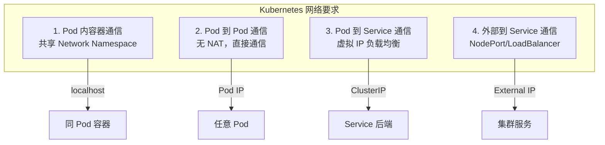

### 1. 同 Pod 内容器通信

同一 Pod 内的容器共享 Network Namespace：

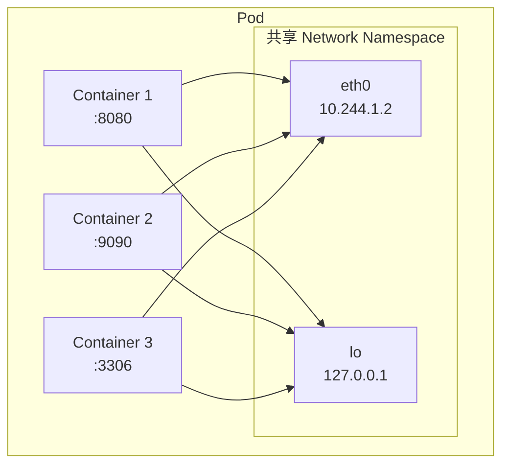

- 容器间通过 `localhost` 通信
- 端口不能冲突
- 共享 IP 地址

### 2. Pod 到 Pod 通信

所有 Pod 都可以不经 NAT 直接通信：

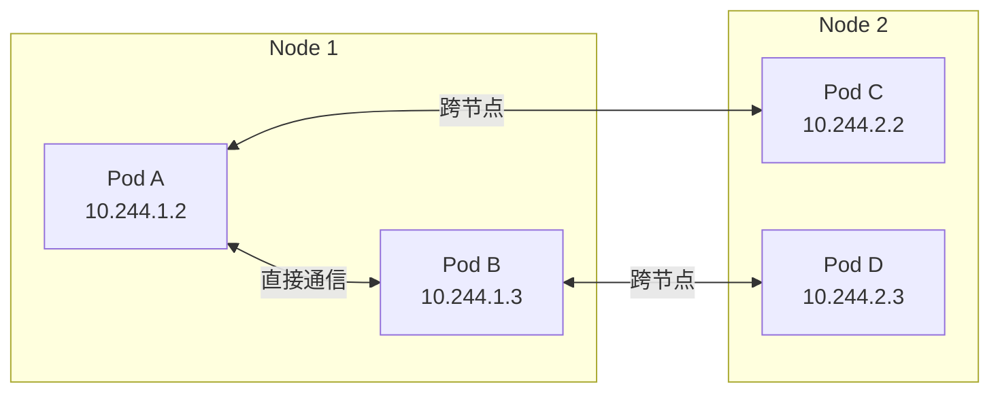

**关键特征**：
- 每个 Pod 有独立的 IP 地址
- Pod 看到的源 IP 是真实 Pod IP（无 NAT）
- 同节点和跨节点通信方式对 Pod 透明

### 3. Pod 到 Service 通信

Service 提供稳定的虚拟 IP 和负载均衡：

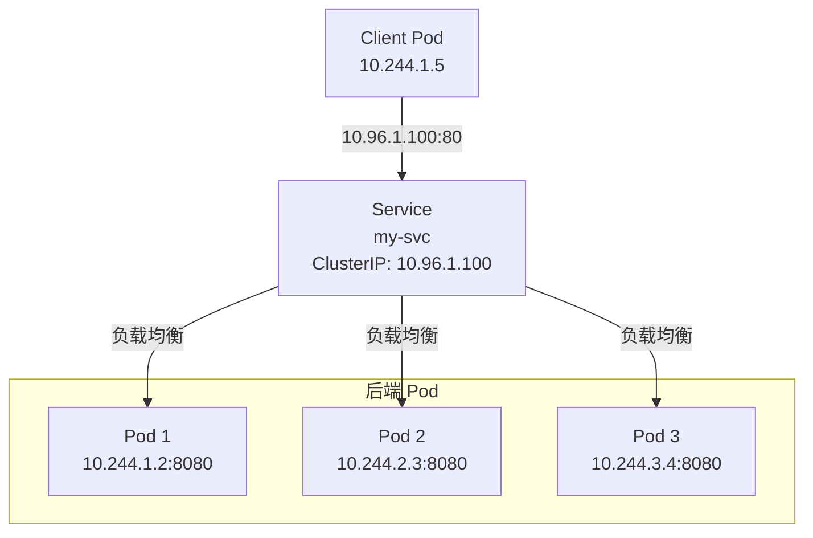

### 4. 外部到 Service 通信

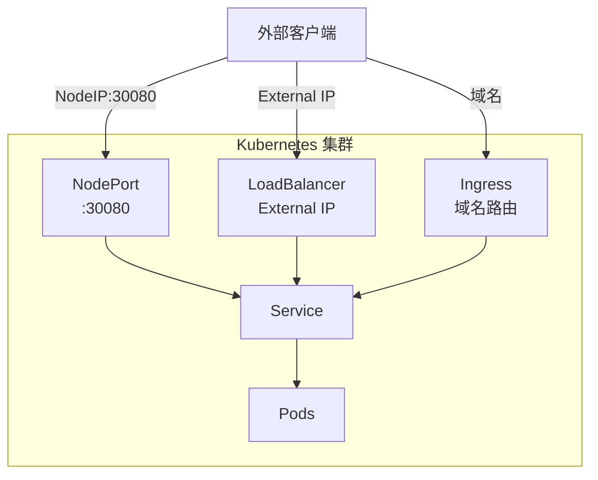

## Pod 网络模型

### Pod 网络结构

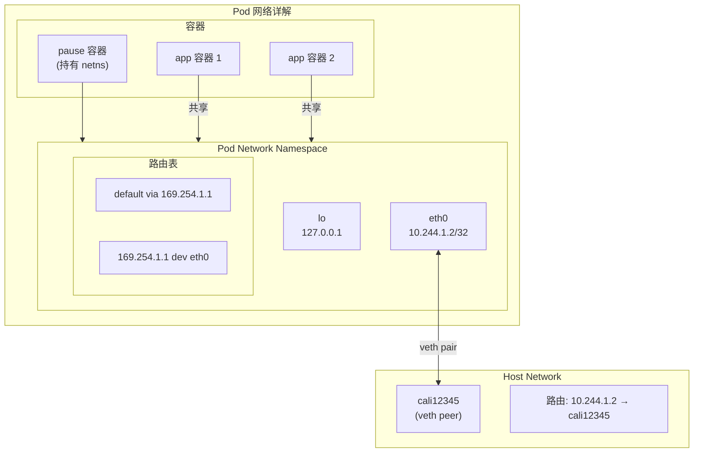

### pause 容器的作用

每个 Pod 都有一个隐藏的 `pause` 容器：

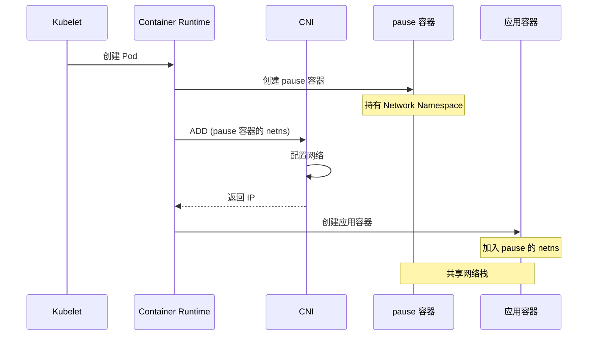

**pause 容器的职责**：
1. 持有 Pod 的 Network Namespace
2. 作为 PID 1 进程（init 进程）
3. 回收僵尸进程

### IP 地址分配

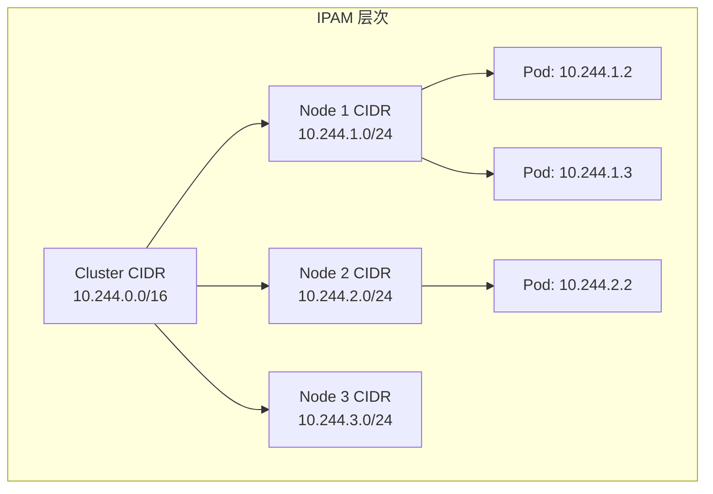

## 通信场景详解

### 场景 1：同节点 Pod 通信

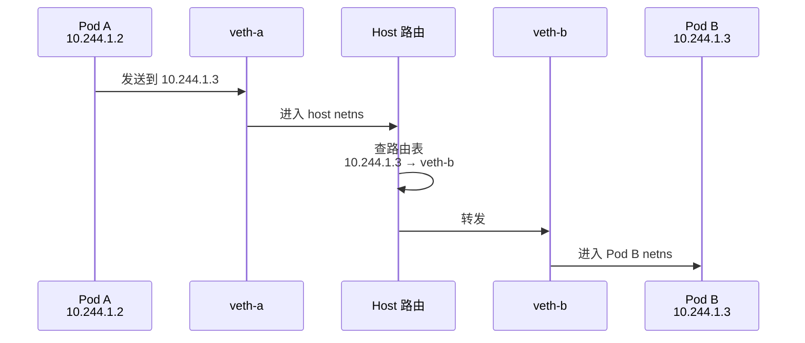

**特点**：
- 不经过物理网络
- 在内核中完成转发
- 延迟最低

### 场景 2：跨节点 Pod 通信（路由模式）

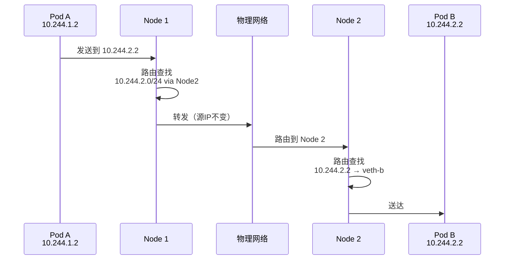

### 场景 3：跨节点 Pod 通信（IPIP/VXLAN 模式）

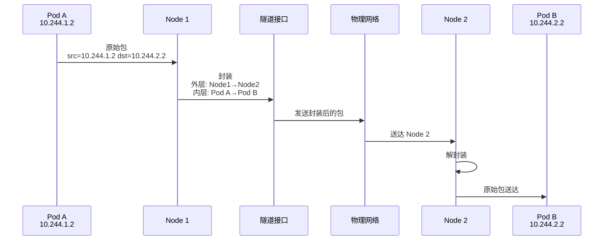

### 场景 4：Pod 访问 Service

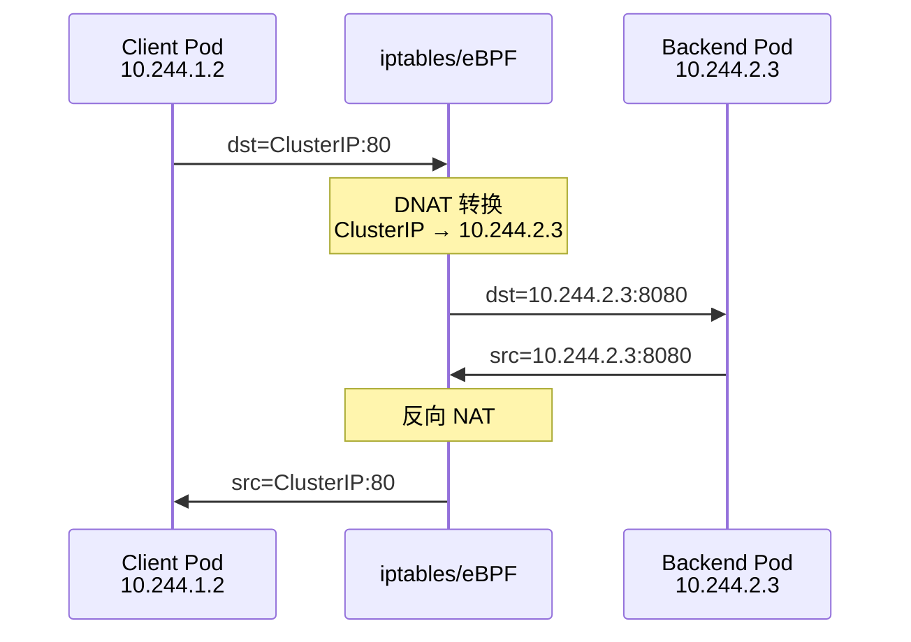

## Node 网络

### Node 网络组件

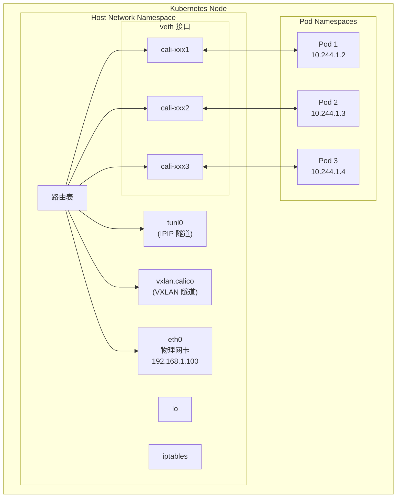

### Node 路由表示例

```bash
# Calico 节点的典型路由表
$ ip route

# 默认路由
default via 192.168.1.1 dev eth0

# 本节点 Pod 路由
10.244.1.2 dev cali12345 scope link
10.244.1.3 dev cali67890 scope link
10.244.1.4 dev caliabc12 scope link

# 其他节点 Pod 路由（BGP 学习，路由模式）
10.244.2.0/24 via 192.168.1.101 dev eth0 proto bird
10.244.3.0/24 via 192.168.1.102 dev eth0 proto bird

# 或者隧道模式
# 10.244.2.0/24 via 192.168.1.101 dev tunl0 proto bird onlink
# 10.244.3.0/24 via 192.168.1.102 dev tunl0 proto bird onlink
```

## CNI 插件的职责

CNI（Container Network Interface）负责 Pod 网络的创建和删除：

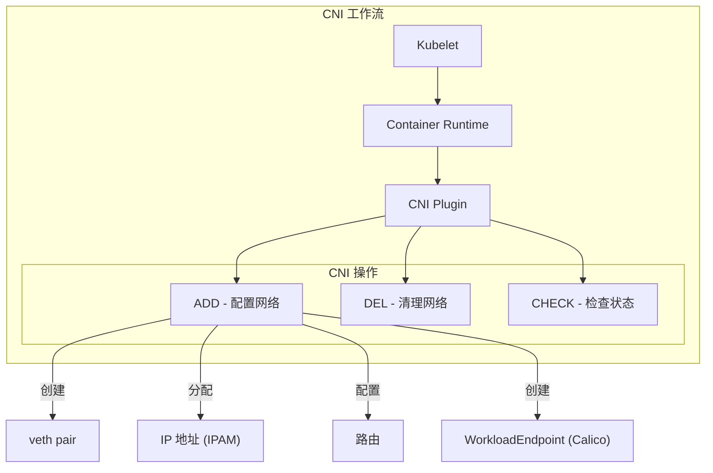

## 实验：探索 Pod 网络

### 实验 1：查看 Pod 网络配置

```bash
# 创建测试 Pod
kubectl run test-pod --image=nginx --restart=Never

# 查看 Pod IP
kubectl get pod test-pod -o wide

# 进入 Pod 查看网络
kubectl exec -it test-pod -- sh

# 在 Pod 内执行
ip addr          # 查看接口
ip route         # 查看路由
cat /etc/resolv.conf  # 查看 DNS
```

### 实验 2：追踪 Pod 网络接口

```bash
# 获取 Pod 所在节点
NODE=$(kubectl get pod test-pod -o jsonpath='{.spec.nodeName}')

# SSH 到节点
ssh $NODE

# 找到对应的 veth
# 方法1：通过接口索引
kubectl exec test-pod -- cat /sys/class/net/eth0/iflink
# 假设输出 15

ip link | grep "^15:"
# 输出：15: cali12345@if4: ...

# 方法2：通过 IP
ip route | grep <pod-ip>
# 输出：10.244.1.2 dev cali12345 scope link
```

### 实验 3：测试 Pod 间通信

```bash
# 创建两个 Pod
kubectl run pod-a --image=nginx --restart=Never
kubectl run pod-b --image=busybox --restart=Never --command -- sleep 3600

# 获取 pod-a 的 IP
POD_A_IP=$(kubectl get pod pod-a -o jsonpath='{.status.podIP}')

# 从 pod-b ping pod-a
kubectl exec pod-b -- ping -c 3 $POD_A_IP

# 从 pod-b curl pod-a
kubectl exec pod-b -- wget -qO- http://$POD_A_IP

# 清理
kubectl delete pod pod-a pod-b
```

### 实验 4：观察跨节点通信

```bash
# 创建 DaemonSet 确保 Pod 分布在不同节点
cat << 'EOF' | kubectl apply -f -
apiVersion: apps/v1
kind: DaemonSet
metadata:
  name: network-test
spec:
  selector:
    matchLabels:
      app: network-test
  template:
    metadata:
      labels:
        app: network-test
    spec:
      containers:
      - name: test
        image: busybox
        command: ["sleep", "3600"]
EOF

# 等待 Pod 运行
kubectl wait --for=condition=Ready pod -l app=network-test

# 获取 Pod 列表
kubectl get pods -l app=network-test -o wide

# 从一个 Pod ping 另一个节点的 Pod
kubectl exec <pod-on-node1> -- ping -c 3 <ip-of-pod-on-node2>

# 在节点上抓包观察
tcpdump -i eth0 icmp

# 清理
kubectl delete ds network-test
```

## Kubernetes 网络与 Calico

### Calico 如何满足 K8s 网络要求

| K8s 要求 | Calico 实现 |
|----------|------------|
| Pod 内通信 | 共享 netns（K8s 原生） |
| Pod 到 Pod | 纯路由/IPIP/VXLAN |
| Pod 到 Service | iptables/eBPF kube-proxy 替代 |
| 外部到 Service | NodePort/LoadBalancer 支持 |

### Calico 网络架构

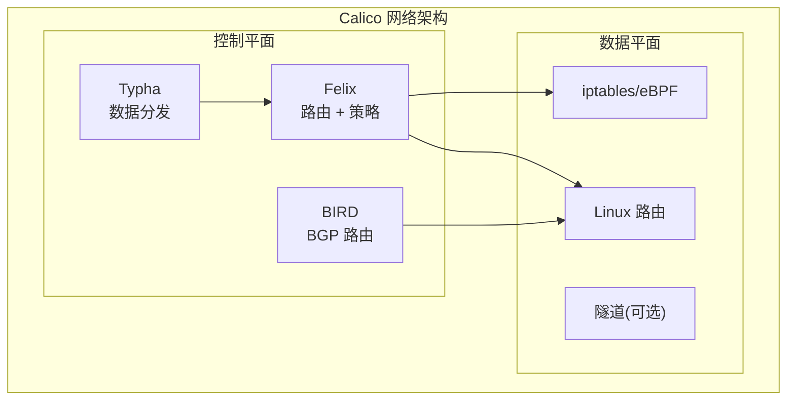

## 总结

本章介绍了 Kubernetes 网络模型的核心概念：

1. **四大要求** - Pod 内、Pod 间、Pod-Service、外部-Service 通信
2. **Pod 网络** - 独立 IP、共享 netns、pause 容器
3. **通信场景** - 同节点、跨节点、访问 Service
4. **Node 网络** - veth、路由表、隧道接口

理解这些概念是掌握 Calico 的基础，后续章节将深入 CNI 规范和 Calico 的具体实现。

## 参考资料

- [Kubernetes 网络模型](https://kubernetes.io/docs/concepts/cluster-administration/networking/)
- [Pod 网络](https://kubernetes.io/docs/concepts/workloads/pods/#pod-networking)
- [Service 网络](https://kubernetes.io/docs/concepts/services-networking/service/)
- [Calico 网络架构](https://docs.tigera.io/calico/latest/about/)
