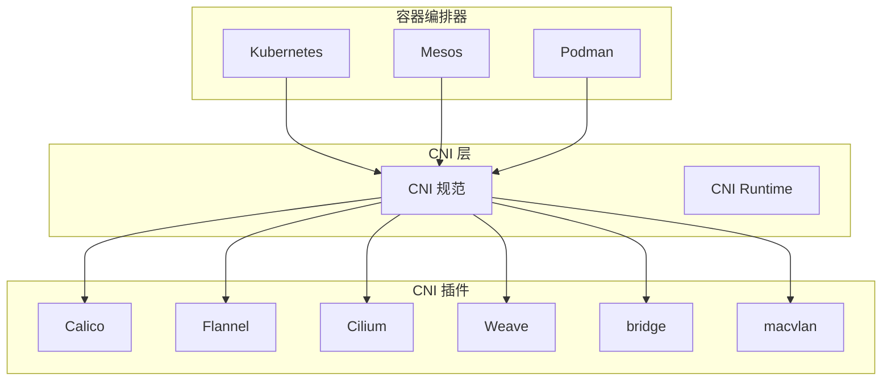
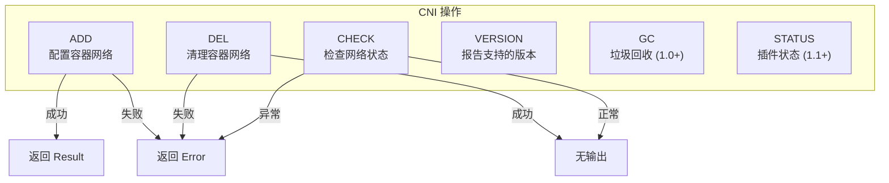
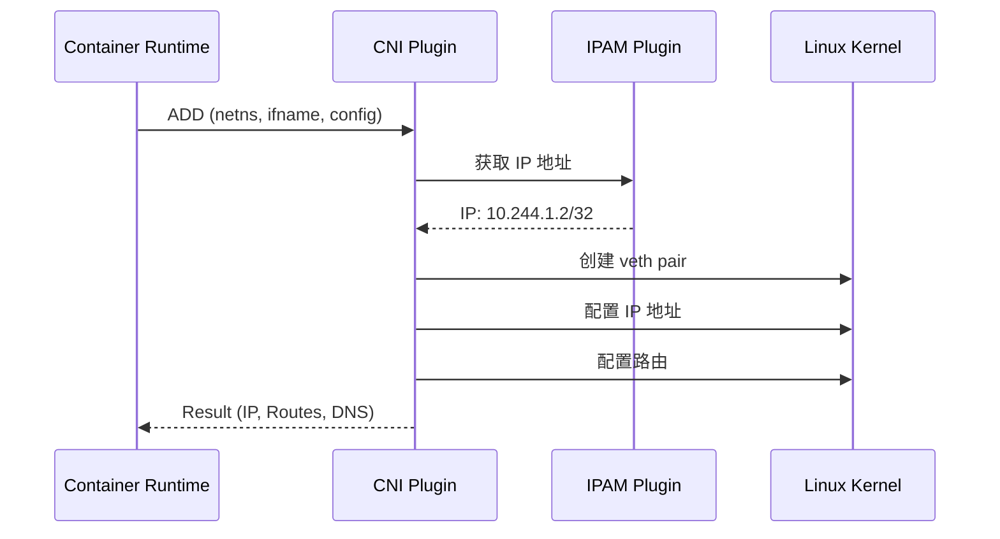
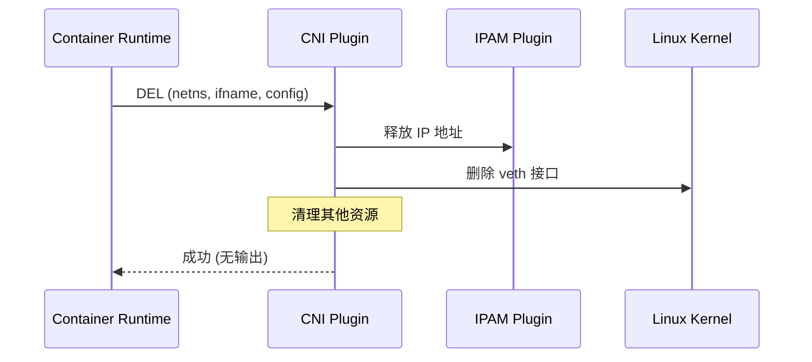
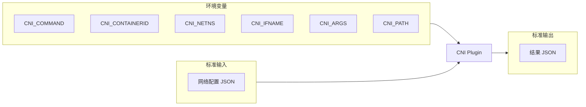
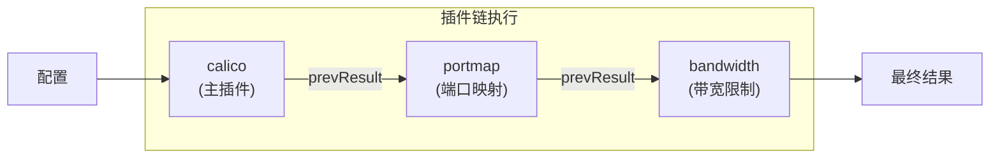
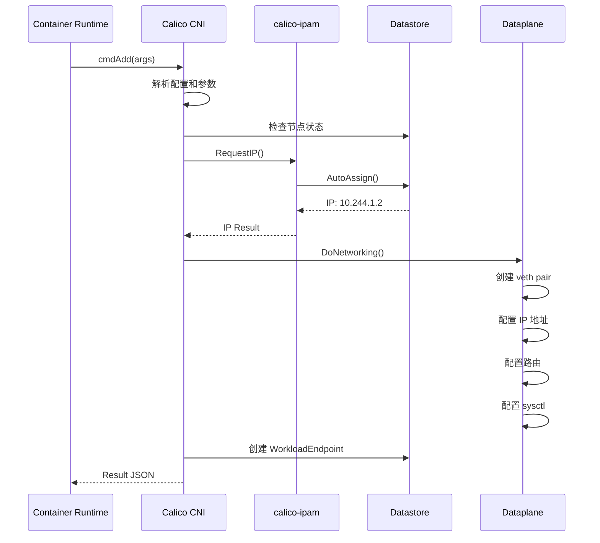
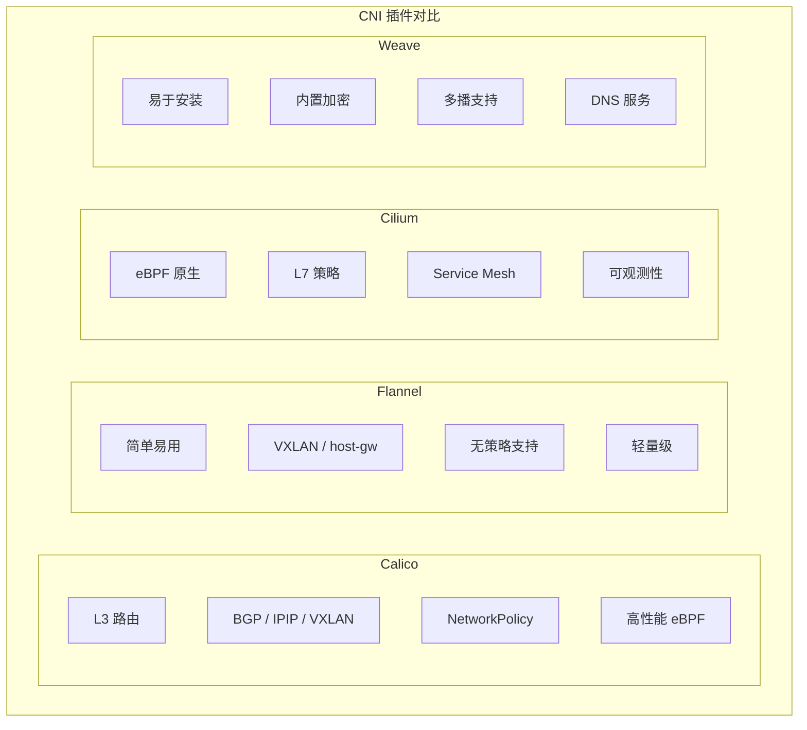

## 概述

CNI（Container Network Interface）是 CNCF 项目，定义了容器网络配置的标准接口。本章深入介绍 CNI 规范、插件接口、配置格式，以及 Calico CNI 插件的实现。

## 前置知识

- Kubernetes 网络模型
- Linux 网络基础
- JSON 基础

## CNI 是什么

### CNI 的定位



**CNI 的职责**：
- 定义容器网络配置的 JSON 格式
- 定义插件的调用接口（ADD/DEL/CHECK/VERSION）
- 规定参数传递方式（环境变量 + stdin）

**CNI 不负责**：
- 具体的网络实现
- Pod 到 Service 的通信
- 网络策略

### CNI 规范版本

| 版本 | 特性 |
|------|------|
| 0.1.0 | 基础规范 |
| 0.3.0 | 增加 CHECK 操作 |
| 0.4.0 | 增加 prevResult |
| 1.0.0 | 稳定版本，增加 GC 操作 |
| 1.1.0 | 增加 STATUS 操作 |

## CNI 插件接口

### 操作类型



### ADD 操作

**用途**：为容器配置网络

**输入**：
- 环境变量：`CNI_COMMAND=ADD`、`CNI_CONTAINERID`、`CNI_NETNS`、`CNI_IFNAME`、`CNI_PATH`
- stdin：网络配置 JSON

**输出**：
- stdout：Result JSON（包含分配的 IP 等）
- 退出码：0 成功，非 0 失败



### DEL 操作

**用途**：清理容器网络资源

**注意事项**：
- DEL 必须是幂等的
- 即使资源不存在也应返回成功
- 容器可能已经不存在



### CHECK 操作

**用途**：验证容器网络配置是否正确

```bash
# CHECK 返回成功（退出码 0）表示：
# 1. 接口存在且配置正确
# 2. IP 地址正确
# 3. 路由正确
```

### 参数传递



**环境变量说明**：

| 变量 | 说明 | 示例 |
|------|------|------|
| CNI_COMMAND | 操作类型 | ADD, DEL, CHECK |
| CNI_CONTAINERID | 容器 ID | abc123... |
| CNI_NETNS | 网络命名空间路径 | /var/run/netns/xxx |
| CNI_IFNAME | 接口名称 | eth0 |
| CNI_ARGS | 额外参数 | K8S_POD_NAME=xxx |
| CNI_PATH | 插件搜索路径 | /opt/cni/bin |

## CNI 配置文件格式

### 基本结构

```json
{
  "cniVersion": "1.0.0",
  "name": "my-network",
  "type": "calico",
  "ipam": {
    "type": "calico-ipam"
  },
  "kubernetes": {
    "kubeconfig": "/etc/cni/net.d/calico-kubeconfig"
  }
}
```

### 配置字段说明

| 字段 | 必需 | 说明 |
|------|------|------|
| cniVersion | 是 | CNI 规范版本 |
| name | 是 | 网络名称 |
| type | 是 | 主插件名称 |
| ipam | 否 | IPAM 插件配置 |
| dns | 否 | DNS 配置 |
| args | 否 | 额外参数 |
| prevResult | 否 | 链式调用时的上一个结果 |

### Calico CNI 配置示例

```json
{
  "name": "k8s-pod-network",
  "cniVersion": "0.3.1",
  "plugins": [
    {
      "type": "calico",
      "log_level": "info",
      "log_file_path": "/var/log/calico/cni/cni.log",
      "datastore_type": "kubernetes",
      "nodename": "__KUBERNETES_NODE_NAME__",
      "mtu": __CNI_MTU__,
      "ipam": {
        "type": "calico-ipam"
      },
      "policy": {
        "type": "k8s"
      },
      "kubernetes": {
        "kubeconfig": "__KUBECONFIG_FILEPATH__"
      }
    },
    {
      "type": "portmap",
      "snat": true,
      "capabilities": {"portMappings": true}
    },
    {
      "type": "bandwidth",
      "capabilities": {"bandwidth": true}
    }
  ]
}
```

### 配置文件位置

```bash
# 默认位置
/etc/cni/net.d/

# Calico 配置文件
/etc/cni/net.d/10-calico.conflist

# 查看配置
cat /etc/cni/net.d/10-calico.conflist | jq .
```

## 插件链（Chaining）

### 什么是插件链

CNI 支持将多个插件串联执行：



### conflist 格式

```json
{
  "cniVersion": "1.0.0",
  "name": "my-network",
  "plugins": [
    {
      "type": "calico",
      "ipam": { "type": "calico-ipam" }
    },
    {
      "type": "portmap",
      "capabilities": { "portMappings": true }
    },
    {
      "type": "bandwidth",
      "capabilities": { "bandwidth": true }
    }
  ]
}
```

### 常用 CNI 插件

| 插件 | 类型 | 功能 |
|------|------|------|
| bridge | Main | Linux 网桥 |
| macvlan | Main | MACVLAN 接口 |
| ipvlan | Main | IPVLAN 接口 |
| calico | Main | Calico 网络 |
| flannel | Main | Flannel 网络 |
| portmap | Meta | 端口映射 |
| bandwidth | Meta | 带宽限制 |
| tuning | Meta | sysctl 调优 |
| host-local | IPAM | 本地 IP 分配 |
| calico-ipam | IPAM | Calico IPAM |

## Result 格式

### ADD 操作返回值

```json
{
  "cniVersion": "1.0.0",
  "interfaces": [
    {
      "name": "eth0",
      "mac": "0a:58:0a:f4:01:02",
      "sandbox": "/var/run/netns/cni-xxx"
    },
    {
      "name": "cali12345",
      "mac": "ee:ee:ee:ee:ee:ee"
    }
  ],
  "ips": [
    {
      "address": "10.244.1.2/32",
      "gateway": "169.254.1.1",
      "interface": 0
    }
  ],
  "routes": [
    {
      "dst": "0.0.0.0/0",
      "gw": "169.254.1.1"
    }
  ],
  "dns": {
    "nameservers": ["10.96.0.10"],
    "domain": "cluster.local",
    "search": ["default.svc.cluster.local", "svc.cluster.local"]
  }
}
```

### Error 格式

```json
{
  "cniVersion": "1.0.0",
  "code": 7,
  "msg": "failed to allocate IP",
  "details": "no available IPs in pool"
}
```

**标准错误码**：

| 代码 | 说明 |
|------|------|
| 1 | 不兼容的 CNI 版本 |
| 2 | 不支持的网络配置字段 |
| 3 | 容器/网络不存在 |
| 4 | 无效的环境变量 |
| 5 | I/O 错误 |
| 6 | 解码错误 |
| 7 | 无效的网络配置 |
| 11 | 重试 |

## Calico CNI 实现分析

### 代码位置

```
cni-plugin/
├── cmd/
│   └── calico/          # 主入口
├── pkg/
│   ├── plugin/          # 主插件逻辑
│   │   └── plugin.go    # ADD/DEL 实现
│   ├── ipamplugin/      # IPAM 插件
│   │   └── ipam_plugin.go
│   └── dataplane/       # 数据平面操作
│       └── linux/
│           └── dataplane_linux.go
```

### ADD 操作流程

**文件**: `cni-plugin/pkg/plugin/plugin.go`



### 核心代码解析

**cmdAdd 函数** (`cni-plugin/pkg/plugin/plugin.go:167`):

```go
func cmdAdd(args *skel.CmdArgs) (err error) {
    // 1. 解析配置
    conf, err := types.LoadNetConf(args.StdinData)

    // 2. 获取 Kubernetes 信息
    k8sArgs := types.K8sArgs{}
    cni.LoadArgs(args.Args, &k8sArgs)

    // 3. 等待节点就绪
    nodename := determineNodename(conf, k8sArgs)

    // 4. 创建 Calico 客户端
    calicoClient, err := NewK8sClient(conf, nodename)

    // 5. 调用 IPAM 分配 IP
    result, err := utils.AddIPAM(conf, args, nodename)

    // 6. 配置网络（创建 veth、路由等）
    hostVethName, contVethMAC, err := DoNetworking(
        ctx, calicoClient, args, conf, result, nodename, routes, endpoint, logger)

    // 7. 创建 WorkloadEndpoint
    _, err = calicoClient.WorkloadEndpoints().Create(ctx, endpoint, options.SetOptions{})

    // 8. 返回结果
    return cni.PrintResult(result, conf.CNIVersion)
}
```

**DoNetworking 函数** (`cni-plugin/pkg/dataplane/linux/dataplane_linux.go`):

```go
func (d *linuxDataplane) DoNetworking(
    ctx context.Context,
    calicoClient calicoclient.Interface,
    args *skel.CmdArgs,
    result *cniv1.Result,
    ...) error {

    // 1. 创建 veth pair
    hostVethName = "cali" + args.ContainerID[:min(11, len(args.ContainerID))]
    _, contVethMAC, err = ip.SetupVethWithName(args.IfName, hostVethName, conf.MTU, hostNS)

    // 2. 配置主机侧 veth
    hostVeth, err := netlink.LinkByName(hostVethName)
    netlink.LinkSetUp(hostVeth)

    // 3. 配置容器侧
    netns.Do(func(_ ns.NetNS) error {
        // 配置 IP 地址
        netlink.AddrAdd(contVeth, &netlink.Addr{IPNet: &addr})

        // 配置路由
        // 169.254.1.1 dev eth0
        // default via 169.254.1.1 dev eth0
        return nil
    })

    // 4. 配置主机路由
    // 10.244.1.2 dev cali12345 scope link
    netlink.RouteAdd(&netlink.Route{...})

    // 5. 启用 proxy_arp
    writeProcSys(fmt.Sprintf("/proc/sys/net/ipv4/conf/%s/proxy_arp", hostVethName), "1")

    return nil
}
```

## 实验：手动调用 CNI 插件

### 实验环境准备

```bash
# 创建测试 netns
sudo ip netns add test-cni

# 确保 CNI 插件路径
ls /opt/cni/bin/
```

### 实验 1：使用 bridge 插件

```bash
# 创建配置文件
cat > /tmp/bridge.conf << 'EOF'
{
    "cniVersion": "1.0.0",
    "name": "mynet",
    "type": "bridge",
    "bridge": "cni0",
    "isGateway": true,
    "ipMasq": true,
    "ipam": {
        "type": "host-local",
        "subnet": "10.22.0.0/16",
        "routes": [
            { "dst": "0.0.0.0/0" }
        ]
    }
}
EOF

# 调用 ADD
export CNI_COMMAND=ADD
export CNI_CONTAINERID=test123
export CNI_NETNS=/var/run/netns/test-cni
export CNI_IFNAME=eth0
export CNI_PATH=/opt/cni/bin

cat /tmp/bridge.conf | sudo -E /opt/cni/bin/bridge

# 查看结果
sudo ip netns exec test-cni ip addr
sudo ip netns exec test-cni ip route

# 查看 bridge
ip link show cni0
bridge link show

# 调用 DEL
export CNI_COMMAND=DEL
cat /tmp/bridge.conf | sudo -E /opt/cni/bin/bridge

# 清理
sudo ip netns del test-cni
sudo ip link del cni0
```

### 实验 2：查看 Calico CNI 日志

```bash
# 查看 CNI 日志
tail -f /var/log/calico/cni/cni.log

# 创建 Pod 触发 CNI
kubectl run test --image=nginx --restart=Never

# 观察日志输出
# 2024-01-15 10:00:00.000 [INFO] Extracted pod ... namespace default
# 2024-01-15 10:00:00.100 [INFO] Calico CNI ADD
# 2024-01-15 10:00:00.200 [INFO] Added veth ...

# 清理
kubectl delete pod test
```

### 实验 3：检查 CNI 配置

```bash
# 查看当前 CNI 配置
cat /etc/cni/net.d/10-calico.conflist | jq .

# 检查 IPAM 分配
calicoctl ipam show --show-blocks

# 查看 WorkloadEndpoint
calicoctl get workloadendpoint -A -o wide
```

## 常见 CNI 插件对比



| 特性 | Calico | Flannel | Cilium | Weave |
|------|--------|---------|--------|-------|
| 网络模式 | L3 路由/Overlay | Overlay | eBPF | Overlay |
| NetworkPolicy | 原生支持 | 不支持 | 扩展支持 | 有限支持 |
| 性能 | 高 | 中 | 高 | 中 |
| 复杂度 | 中 | 低 | 高 | 低 |
| eBPF | 支持 | 不支持 | 核心 | 不支持 |
| 企业支持 | Tigera | CoreOS | Isovalent | Weaveworks |

## 总结

本章介绍了 CNI 规范的核心知识：

1. **CNI 接口** - ADD/DEL/CHECK 三个核心操作
2. **配置格式** - JSON 配置文件和 conflist
3. **参数传递** - 环境变量 + stdin
4. **插件链** - 多插件串联执行
5. **Calico 实现** - CNI 插件 + IPAM 插件

CNI 是 Kubernetes 网络的基础接口，理解 CNI 有助于排查网络问题和定制网络方案。

## 参考资料

- [CNI 规范](https://github.com/containernetworking/cni/blob/master/SPEC.md)
- [CNI 插件](https://github.com/containernetworking/plugins)
- [Calico CNI 文档](https://docs.tigera.io/calico/latest/reference/cni-plugin/)
- [Kubernetes 网络插件](https://kubernetes.io/docs/concepts/cluster-administration/networking/)
