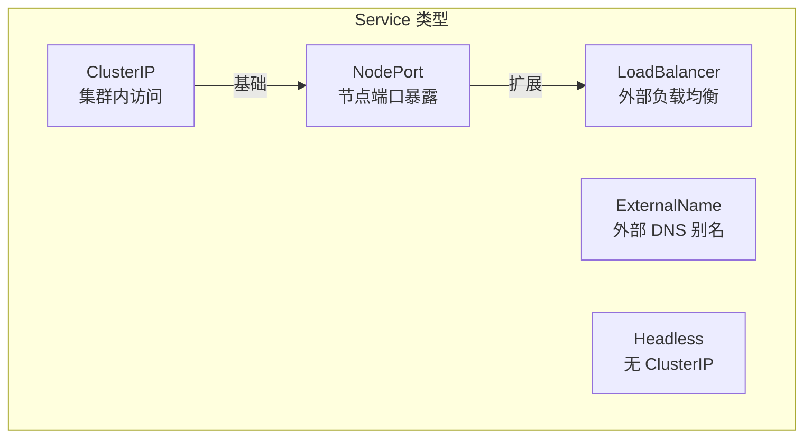
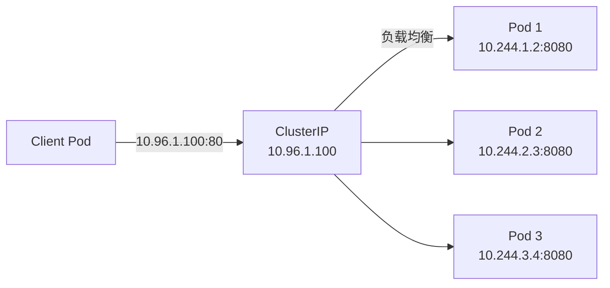
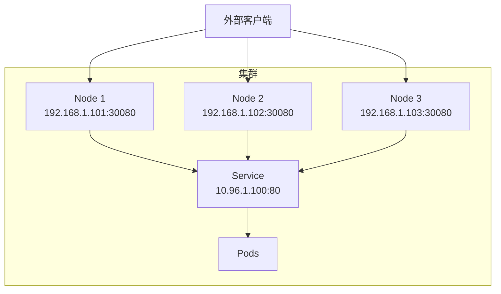
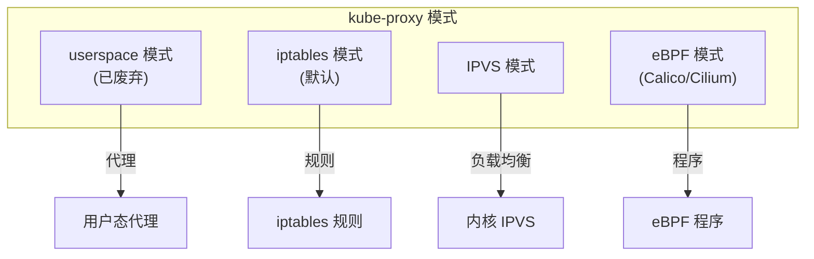
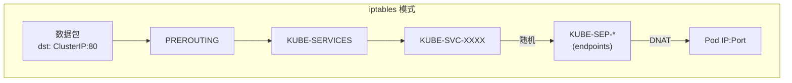
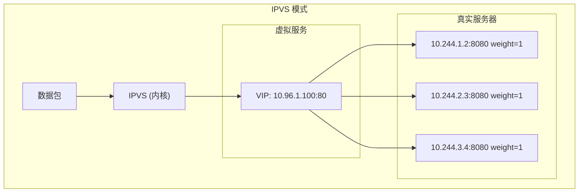
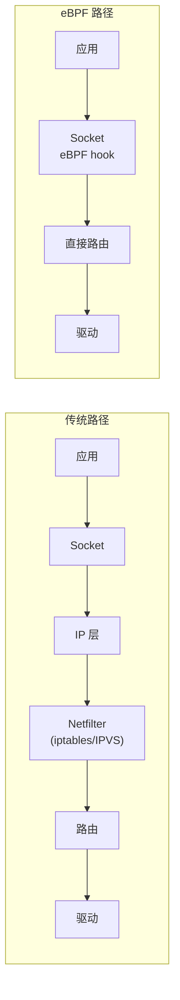
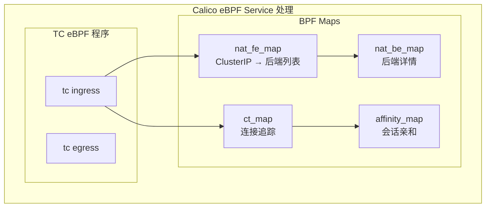
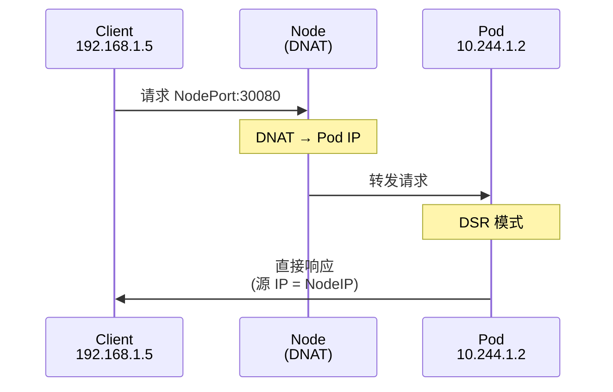
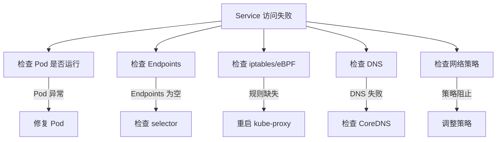

## 概述

Kubernetes Service 提供了稳定的服务访问入口和负载均衡。本章介绍 Service 的类型、kube-proxy 的工作模式，以及 Calico 如何通过 eBPF 替代 kube-proxy 实现更高性能的服务代理。

## 前置知识

- Kubernetes Service 基础概念
- iptables 基础
- Linux 网络基础

## Service 类型

### Service 类型概览



### ClusterIP

集群内部访问的虚拟 IP：

```yaml
apiVersion: v1
kind: Service
metadata:
  name: my-service
spec:
  type: ClusterIP  # 默认类型
  selector:
    app: my-app
  ports:
  - port: 80
    targetPort: 8080
```



### NodePort

在每个节点上开放端口：

```yaml
apiVersion: v1
kind: Service
metadata:
  name: my-nodeport
spec:
  type: NodePort
  selector:
    app: my-app
  ports:
  - port: 80
    targetPort: 8080
    nodePort: 30080  # 30000-32767
```



### LoadBalancer

云平台的外部负载均衡器：

```yaml
apiVersion: v1
kind: Service
metadata:
  name: my-loadbalancer
spec:
  type: LoadBalancer
  selector:
    app: my-app
  ports:
  - port: 80
    targetPort: 8080
```

### Headless Service

无 ClusterIP，直接返回 Pod IP：

```yaml
apiVersion: v1
kind: Service
metadata:
  name: my-headless
spec:
  clusterIP: None  # Headless
  selector:
    app: my-app
  ports:
  - port: 80
```

```bash
# DNS 查询返回所有 Pod IP
nslookup my-headless.default.svc.cluster.local

# 返回：
# Name: my-headless.default.svc.cluster.local
# Address: 10.244.1.2
# Address: 10.244.2.3
# Address: 10.244.3.4
```

## Endpoints 与 EndpointSlice

### Endpoints

每个 Service 对应一个 Endpoints 对象，记录后端 Pod 地址：

```yaml
apiVersion: v1
kind: Endpoints
metadata:
  name: my-service
subsets:
- addresses:
  - ip: 10.244.1.2
    nodeName: node-1
  - ip: 10.244.2.3
    nodeName: node-2
  ports:
  - port: 8080
    protocol: TCP
```

### EndpointSlice

Kubernetes 1.21+ 推荐使用 EndpointSlice，支持更大规模：

```yaml
apiVersion: discovery.k8s.io/v1
kind: EndpointSlice
metadata:
  name: my-service-abc12
  labels:
    kubernetes.io/service-name: my-service
addressType: IPv4
ports:
- name: http
  port: 8080
  protocol: TCP
endpoints:
- addresses:
  - 10.244.1.2
  conditions:
    ready: true
  nodeName: node-1
```

**EndpointSlice vs Endpoints**：

| 特性 | Endpoints | EndpointSlice |
|------|-----------|---------------|
| 最大条目 | 无限制（但有性能问题） | 每个 Slice 100 个 |
| 分片 | 不支持 | 自动分片 |
| 性能 | 大规模时差 | 优化过 |
| 拓扑感知 | 有限 | 完善 |

## kube-proxy 工作模式

### 模式对比



### iptables 模式



**iptables 规则示例**：

```bash
# 查看 Service 规则
iptables -t nat -L KUBE-SERVICES -n

# 典型规则链
-A KUBE-SERVICES -d 10.96.1.100/32 -p tcp --dport 80 -j KUBE-SVC-XXXX

# Service 链（负载均衡）
-A KUBE-SVC-XXXX -m statistic --mode random --probability 0.33333 -j KUBE-SEP-AAA
-A KUBE-SVC-XXXX -m statistic --mode random --probability 0.50000 -j KUBE-SEP-BBB
-A KUBE-SVC-XXXX -j KUBE-SEP-CCC

# Endpoint 链（DNAT）
-A KUBE-SEP-AAA -p tcp -j DNAT --to-destination 10.244.1.2:8080
-A KUBE-SEP-BBB -p tcp -j DNAT --to-destination 10.244.2.3:8080
-A KUBE-SEP-CCC -p tcp -j DNAT --to-destination 10.244.3.4:8080
```

**iptables 模式的问题**：

1. **规则数量** - O(n) 规则，n 为 Service * Endpoints
2. **更新延迟** - 规则多时更新慢
3. **连接中断** - 更新规则可能影响已有连接
4. **负载均衡** - 只有随机，无权重/会话亲和

### IPVS 模式



**IPVS 优势**：

| 特性 | iptables | IPVS |
|------|----------|------|
| 复杂度 | O(n) | O(1) hash 查找 |
| 负载均衡算法 | 随机 | rr, wrr, lc, wlc, sh, dh, sed, nq |
| 连接追踪 | conntrack | IPVS 自带 |
| 规则更新 | 全量 | 增量 |

**启用 IPVS**：

```yaml
# kube-proxy 配置
apiVersion: kubeproxy.config.k8s.io/v1alpha1
kind: KubeProxyConfiguration
mode: "ipvs"
ipvs:
  scheduler: "rr"  # 轮询
```

```bash
# 查看 IPVS 规则
ipvsadm -Ln

# 示例输出
TCP  10.96.1.100:80 rr
  -> 10.244.1.2:8080    Masq    1      0          0
  -> 10.244.2.3:8080    Masq    1      0          0
  -> 10.244.3.4:8080    Masq    1      0          0
```

## Calico eBPF kube-proxy 替代

### 为什么替代 kube-proxy



**eBPF 优势**：

1. **更少的数据包处理** - 在 socket 层直接处理
2. **保留源 IP** - 无需 SNAT
3. **更好的性能** - 减少内核遍历
4. **原生负载均衡** - 使用 Maglev 等算法

### 启用 Calico eBPF 模式

```yaml
# 1. 禁用 kube-proxy
kubectl patch ds -n kube-system kube-proxy -p '{"spec":{"template":{"spec":{"nodeSelector":{"non-calico": "true"}}}}}'

# 2. 启用 Calico eBPF
kubectl patch installation.operator.tigera.io default --type merge -p '{"spec":{"calicoNetwork":{"linuxDataplane":"BPF"}}}'

# 或通过 calicoctl
calicoctl patch felixconfiguration default --patch='{"spec":{"bpfEnabled": true, "bpfKubeProxyIptablesCleanupEnabled": true}}'
```

### Calico eBPF Service 实现



**代码位置**: `felix/bpf/nat/`

```c
// felix/bpf-gpl/nat.h（简化）
struct nat_fe_key {
    __u32 addr;      // ClusterIP
    __u16 port;      // Service port
    __u8 proto;      // TCP/UDP
};

struct nat_fe_value {
    __u32 count;     // 后端数量
    __u32 id;        // Service ID
    __u32 flags;     // 配置标志
};

struct nat_be_key {
    __u32 id;        // Service ID
    __u32 ordinal;   // 后端序号
};

struct nat_be_value {
    __u32 addr;      // Pod IP
    __u16 port;      // Pod port
};
```

### DSR（Direct Server Return）

Calico eBPF 支持 DSR 模式，响应包直接返回：



**DSR 优势**：
- 减少节点间流量
- 降低延迟
- 保留源 IP

## 实验：探索 Service 网络

### 实验 1：创建 Service 并观察 iptables

```bash
# 创建 Deployment
kubectl create deployment nginx --image=nginx --replicas=3

# 创建 Service
kubectl expose deployment nginx --port=80 --target-port=80

# 查看 Service 和 Endpoints
kubectl get svc nginx
kubectl get endpoints nginx

# 查看 iptables 规则
CLUSTER_IP=$(kubectl get svc nginx -o jsonpath='{.spec.clusterIP}')
iptables -t nat -L KUBE-SERVICES -n | grep $CLUSTER_IP

# 查看 Service 链
SVC_CHAIN=$(iptables -t nat -L KUBE-SERVICES -n | grep $CLUSTER_IP | awk '{print $1}')
iptables -t nat -L $SVC_CHAIN -n

# 清理
kubectl delete deployment nginx
kubectl delete svc nginx
```

### 实验 2：NodePort 流量追踪

```bash
# 创建 NodePort Service
kubectl create deployment web --image=nginx
kubectl expose deployment web --type=NodePort --port=80

# 获取 NodePort
NODE_PORT=$(kubectl get svc web -o jsonpath='{.spec.ports[0].nodePort}')
echo "NodePort: $NODE_PORT"

# 在节点上抓包
tcpdump -i any port $NODE_PORT -nn

# 从外部访问
curl http://<node-ip>:$NODE_PORT

# 观察 iptables
iptables -t nat -L KUBE-NODEPORTS -n

# 清理
kubectl delete deployment web
kubectl delete svc web
```

### 实验 3：查看 Calico eBPF Service Maps

```bash
# 确保启用 eBPF 模式
kubectl get felixconfiguration default -o jsonpath='{.spec.bpfEnabled}'

# 查看 NAT 前端表
sudo bpftool map dump name cali_v4_nat_fe

# 查看 NAT 后端表
sudo bpftool map dump name cali_v4_nat_be

# 查看连接追踪
sudo bpftool map dump name cali_v4_ct

# 创建 Service 并观察 map 变化
kubectl create deployment test --image=nginx
kubectl expose deployment test --port=80
sleep 5
sudo bpftool map dump name cali_v4_nat_fe | grep -A5 "key"

# 清理
kubectl delete deployment test
kubectl delete svc test
```

### 实验 4：对比 iptables 和 eBPF 性能

```bash
# 使用 wrk 进行基准测试（需要安装 wrk）

# 创建测试服务
kubectl create deployment perf-test --image=nginx --replicas=3
kubectl expose deployment perf-test --port=80
POD_IP=$(kubectl get pod -l app=perf-test -o jsonpath='{.items[0].status.podIP}')
SVC_IP=$(kubectl get svc perf-test -o jsonpath='{.spec.clusterIP}')

# 直接访问 Pod（基准）
kubectl run wrk --rm -it --image=skandyla/wrk -- -t2 -c10 -d30s http://$POD_IP/

# 通过 Service 访问
kubectl run wrk --rm -it --image=skandyla/wrk -- -t2 -c10 -d30s http://$SVC_IP/

# 清理
kubectl delete deployment perf-test
kubectl delete svc perf-test
```

## Service 网络故障排查

### 常见问题



### 排查命令

```bash
# 检查 Service
kubectl get svc <service-name> -o yaml
kubectl describe svc <service-name>

# 检查 Endpoints
kubectl get endpoints <service-name>
kubectl describe endpoints <service-name>

# 检查 DNS
kubectl run tmp --rm -it --image=busybox -- nslookup <service-name>

# 检查 iptables
iptables -t nat -L KUBE-SERVICES -n | grep <cluster-ip>

# 检查 IPVS
ipvsadm -Ln | grep -A5 <cluster-ip>

# 检查 Calico eBPF
bpftool map dump name cali_v4_nat_fe | grep <cluster-ip>

# 测试连接
kubectl run tmp --rm -it --image=busybox -- wget -qO- http://<service-name>
```

## 总结

本章介绍了 Kubernetes Service 和 kube-proxy：

1. **Service 类型** - ClusterIP、NodePort、LoadBalancer、Headless
2. **Endpoints** - 记录 Service 后端地址
3. **kube-proxy 模式** - userspace、iptables、IPVS
4. **Calico eBPF** - 高性能 kube-proxy 替代方案
5. **DSR** - 直接服务器返回优化

Calico 的 eBPF 数据平面不仅可以替代 kube-proxy，还能提供更好的性能和更丰富的功能。

## 参考资料

- [Kubernetes Service](https://kubernetes.io/docs/concepts/services-networking/service/)
- [kube-proxy](https://kubernetes.io/docs/reference/command-line-tools-reference/kube-proxy/)
- [Calico eBPF Dataplane](https://docs.tigera.io/calico/latest/operations/ebpf/)
- [IPVS-Based In-Cluster Load Balancing](https://kubernetes.io/blog/2018/07/09/ipvs-based-in-cluster-load-balancing-deep-dive/)
