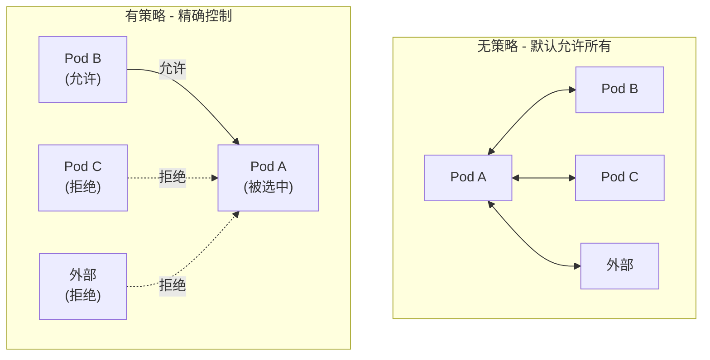
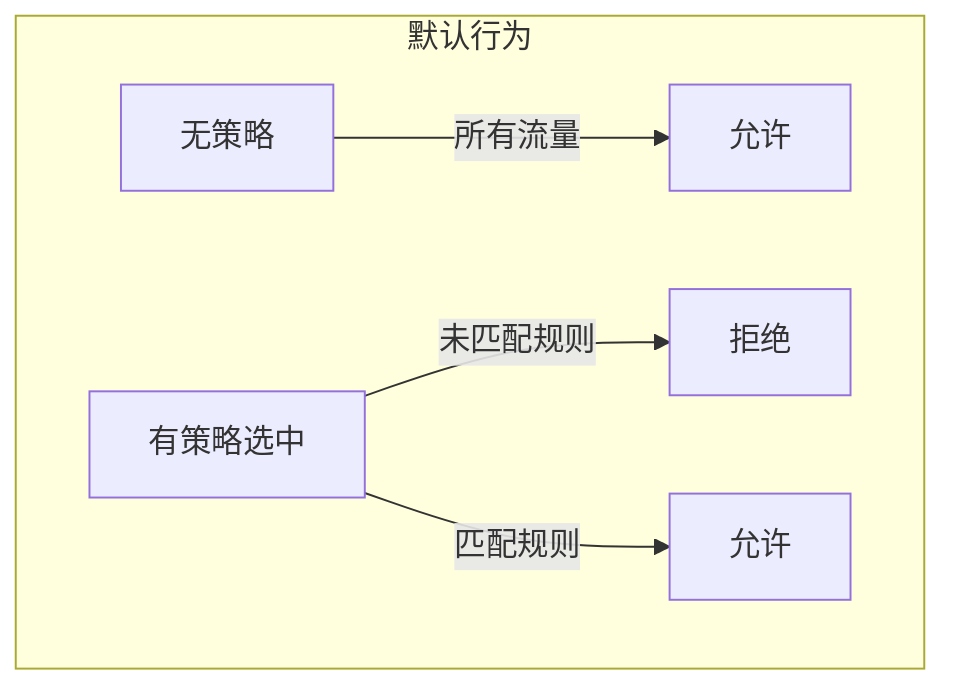
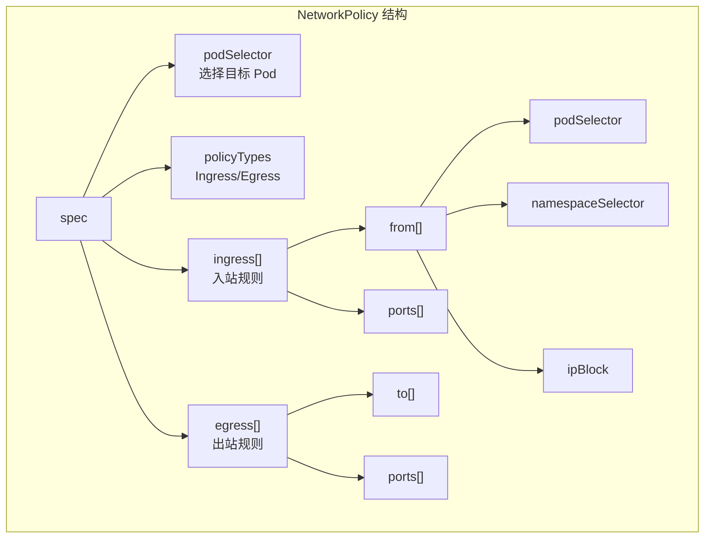
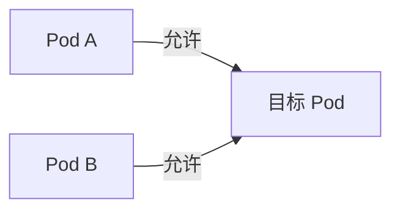
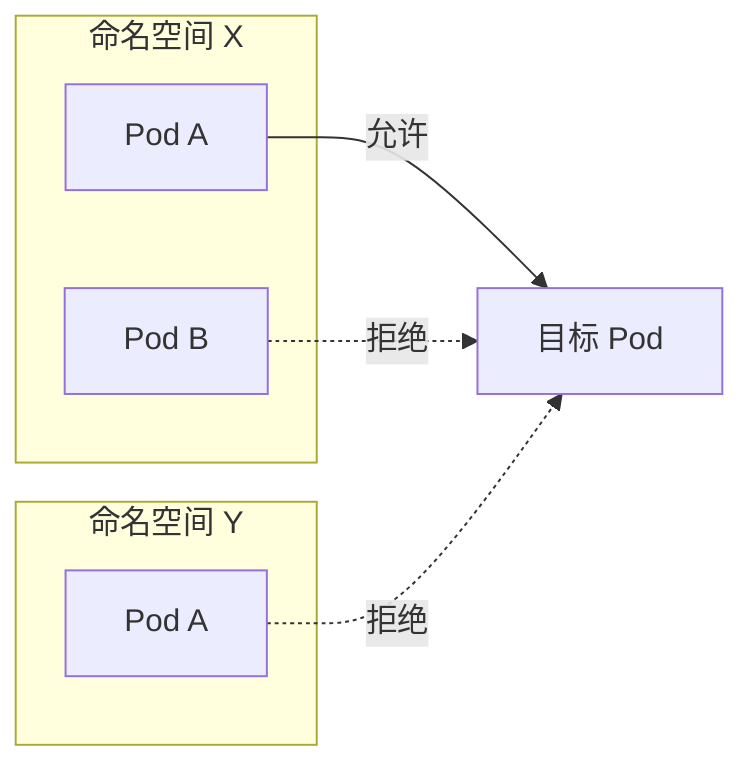
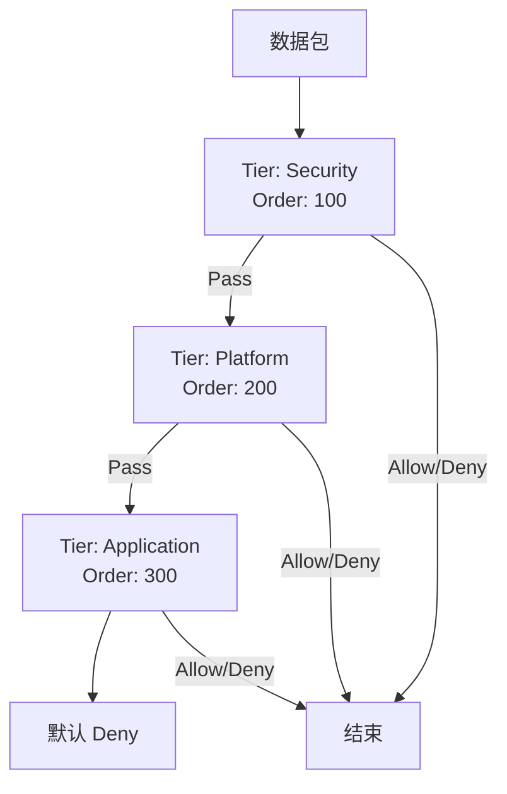
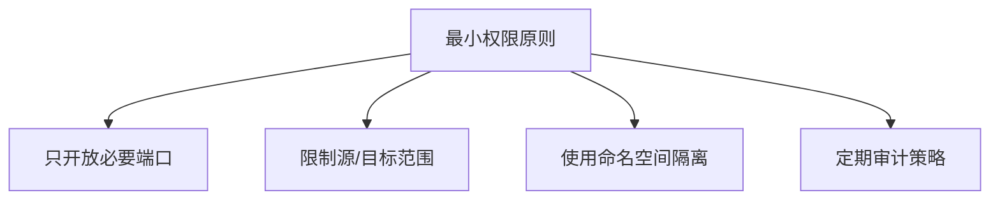

## 概述

Kubernetes NetworkPolicy 提供了 Pod 级别的网络隔离和访问控制。本章介绍 NetworkPolicy 的资源结构、规则语义，以及 Calico 对 NetworkPolicy 的扩展。

## 前置知识

- Kubernetes Pod 和标签
- 网络基础（IP、端口、协议）
- YAML 语法

## NetworkPolicy 基础

### 什么是 NetworkPolicy

NetworkPolicy 是 Kubernetes 原生的网络安全策略资源，用于控制 Pod 的入站（Ingress）和出站（Egress）流量。



### 核心概念

| 概念 | 说明 |
|------|------|
| **podSelector** | 选择策略适用的 Pod |
| **policyTypes** | 策略类型：Ingress、Egress 或两者 |
| **ingress** | 入站规则 |
| **egress** | 出站规则 |
| **from/to** | 流量来源/目标 |
| **ports** | 允许的端口 |

### 默认行为



**关键规则**：
1. 默认情况下，Pod 允许所有入站和出站流量
2. 一旦 Pod 被 NetworkPolicy 选中，未明确允许的流量被拒绝
3. 多个策略的效果是叠加的（允许的并集）

## NetworkPolicy 资源结构

### 完整结构

```yaml
apiVersion: networking.k8s.io/v1
kind: NetworkPolicy
metadata:
  name: example-policy
  namespace: default
spec:
  # 1. 选择策略适用的 Pod
  podSelector:
    matchLabels:
      app: web

  # 2. 策略类型
  policyTypes:
  - Ingress
  - Egress

  # 3. 入站规则
  ingress:
  - from:
    - podSelector:
        matchLabels:
          role: frontend
    - namespaceSelector:
        matchLabels:
          project: myproject
    - ipBlock:
        cidr: 172.17.0.0/16
        except:
        - 172.17.1.0/24
    ports:
    - protocol: TCP
      port: 80

  # 4. 出站规则
  egress:
  - to:
    - podSelector:
        matchLabels:
          role: db
    ports:
    - protocol: TCP
      port: 5432
```

### 字段详解



## 规则语义

### podSelector

选择 Pod：

```yaml
# 选择标签 app=web 的 Pod
podSelector:
  matchLabels:
    app: web

# 选择所有 Pod（空选择器）
podSelector: {}

# 使用表达式
podSelector:
  matchExpressions:
  - key: app
    operator: In
    values: [web, api]
```

### namespaceSelector

跨命名空间选择：

```yaml
# 允许来自标签 project=frontend 的命名空间
from:
- namespaceSelector:
    matchLabels:
      project: frontend

# 允许来自任何命名空间的特定 Pod
from:
- namespaceSelector: {}
  podSelector:
    matchLabels:
      role: monitor

# 组合条件（AND 逻辑）
from:
- namespaceSelector:
    matchLabels:
      project: frontend
  podSelector:
    matchLabels:
      role: web
```

### ipBlock

基于 IP 地址范围：

```yaml
# 允许特定 CIDR
from:
- ipBlock:
    cidr: 10.0.0.0/8

# 排除部分地址
from:
- ipBlock:
    cidr: 172.17.0.0/16
    except:
    - 172.17.1.0/24
```

### ports

端口匹配：

```yaml
ports:
# TCP 端口 80
- protocol: TCP
  port: 80

# UDP 端口范围（需要 K8s 1.25+）
- protocol: UDP
  port: 53

# 命名端口
- protocol: TCP
  port: http

# 端口范围（K8s 1.25+）
- protocol: TCP
  port: 32000
  endPort: 32768
```

## 常见策略模式

### 默认拒绝所有入站

```yaml
apiVersion: networking.k8s.io/v1
kind: NetworkPolicy
metadata:
  name: default-deny-ingress
spec:
  podSelector: {}  # 选择所有 Pod
  policyTypes:
  - Ingress
  # 没有 ingress 规则 = 拒绝所有入站
```

### 默认拒绝所有出站

```yaml
apiVersion: networking.k8s.io/v1
kind: NetworkPolicy
metadata:
  name: default-deny-egress
spec:
  podSelector: {}
  policyTypes:
  - Egress
  # 没有 egress 规则 = 拒绝所有出站
```

### 允许同命名空间内通信

```yaml
apiVersion: networking.k8s.io/v1
kind: NetworkPolicy
metadata:
  name: allow-same-namespace
spec:
  podSelector: {}
  policyTypes:
  - Ingress
  ingress:
  - from:
    - podSelector: {}  # 同命名空间的所有 Pod
```

### 允许特定 Pod 访问

```yaml
apiVersion: networking.k8s.io/v1
kind: NetworkPolicy
metadata:
  name: allow-frontend-to-backend
spec:
  podSelector:
    matchLabels:
      app: backend
  policyTypes:
  - Ingress
  ingress:
  - from:
    - podSelector:
        matchLabels:
          app: frontend
    ports:
    - protocol: TCP
      port: 8080
```

### 允许访问外部服务

```yaml
apiVersion: networking.k8s.io/v1
kind: NetworkPolicy
metadata:
  name: allow-external-db
spec:
  podSelector:
    matchLabels:
      app: backend
  policyTypes:
  - Egress
  egress:
  - to:
    - ipBlock:
        cidr: 10.100.0.0/16  # 外部数据库网段
    ports:
    - protocol: TCP
      port: 5432
```

### 允许 DNS 访问

```yaml
apiVersion: networking.k8s.io/v1
kind: NetworkPolicy
metadata:
  name: allow-dns
spec:
  podSelector: {}
  policyTypes:
  - Egress
  egress:
  - to:
    - namespaceSelector: {}
      podSelector:
        matchLabels:
          k8s-app: kube-dns
    ports:
    - protocol: UDP
      port: 53
    - protocol: TCP
      port: 53
```

## from/to 的 AND 与 OR 逻辑

### OR 逻辑（数组元素）

```yaml
# 允许来自 Pod A 或 Pod B（OR）
ingress:
- from:
  - podSelector:
      matchLabels:
        app: a
  - podSelector:
      matchLabels:
        app: b
```



### AND 逻辑（同一元素内）

```yaml
# 允许来自命名空间 X 中的 Pod A（AND）
ingress:
- from:
  - namespaceSelector:
      matchLabels:
        name: x
    podSelector:
      matchLabels:
        app: a
```



### 混合示例

```yaml
ingress:
- from:
  # 条件 1: 命名空间 X 中的 Pod A（AND）
  - namespaceSelector:
      matchLabels:
        name: x
    podSelector:
      matchLabels:
        app: a
  # 条件 2: 任何命名空间的 Pod B（OR with 条件1）
  - podSelector:
      matchLabels:
        app: b
```

## Calico NetworkPolicy 扩展

### Calico 扩展能力

Calico 提供了超越 K8s 原生 NetworkPolicy 的功能：

| 功能 | K8s NetworkPolicy | Calico NetworkPolicy |
|------|-------------------|---------------------|
| 命名空间作用域 | 是 | 是 + GlobalNetworkPolicy |
| 规则顺序 | 无（并集） | 有（Tier + Order） |
| 拒绝规则 | 隐式 | 显式 Allow/Deny/Pass/Log |
| 应用层策略 | 否 | 是（HTTP、DNS） |
| 日志 | 否 | 是 |
| 主机端点 | 否 | 是 |
| 全局策略 | 否 | 是 |
| ICMP 规则 | 有限 | 完整 |

### GlobalNetworkPolicy

```yaml
apiVersion: projectcalico.org/v3
kind: GlobalNetworkPolicy
metadata:
  name: deny-external-egress
spec:
  selector: all()
  types:
  - Egress
  egress:
  - action: Deny
    destination:
      notNets:
      - 10.0.0.0/8
      - 172.16.0.0/12
      - 192.168.0.0/16
```

### Tier（策略层）



```yaml
apiVersion: projectcalico.org/v3
kind: Tier
metadata:
  name: security
spec:
  order: 100

---
apiVersion: projectcalico.org/v3
kind: GlobalNetworkPolicy
metadata:
  name: block-malicious-ips
spec:
  tier: security
  order: 10
  selector: all()
  types:
  - Ingress
  ingress:
  - action: Deny
    source:
      nets:
      - 1.2.3.0/24  # 恶意 IP
```

### 显式 Deny 和 Log

```yaml
apiVersion: projectcalico.org/v3
kind: NetworkPolicy
metadata:
  name: explicit-deny-with-log
  namespace: default
spec:
  selector: app == 'web'
  types:
  - Ingress
  ingress:
  # 记录并拒绝可疑流量
  - action: Log
    source:
      selector: suspicious == 'true'
  - action: Deny
    source:
      selector: suspicious == 'true'
  # 允许正常流量
  - action: Allow
    source:
      selector: app == 'frontend'
```

### 应用层策略

```yaml
apiVersion: projectcalico.org/v3
kind: GlobalNetworkPolicy
metadata:
  name: allow-specific-http
spec:
  selector: app == 'api'
  types:
  - Ingress
  ingress:
  - action: Allow
    http:
      methods: ["GET", "POST"]
      paths:
      - exact: /api/v1/users
      - prefix: /api/v1/products
```

## 实验：NetworkPolicy 实践

### 实验 1：默认拒绝策略

```bash
# 创建测试命名空间
kubectl create namespace policy-test

# 创建两个 Pod
kubectl run web --image=nginx -n policy-test --labels=app=web
kubectl run client --image=busybox -n policy-test --command -- sleep 3600

# 等待 Pod 就绪
kubectl wait --for=condition=Ready pod/web pod/client -n policy-test

# 测试连通性（应该成功）
WEB_IP=$(kubectl get pod web -n policy-test -o jsonpath='{.status.podIP}')
kubectl exec -n policy-test client -- wget -qO- --timeout=2 http://$WEB_IP

# 应用默认拒绝策略
cat << 'EOF' | kubectl apply -f -
apiVersion: networking.k8s.io/v1
kind: NetworkPolicy
metadata:
  name: default-deny
  namespace: policy-test
spec:
  podSelector: {}
  policyTypes:
  - Ingress
EOF

# 再次测试（应该失败）
kubectl exec -n policy-test client -- wget -qO- --timeout=2 http://$WEB_IP

# 清理
kubectl delete namespace policy-test
```

### 实验 2：允许特定流量

```bash
# 创建环境
kubectl create namespace np-demo
kubectl run web --image=nginx -n np-demo --labels=app=web,tier=backend
kubectl run frontend --image=busybox -n np-demo --labels=app=frontend --command -- sleep 3600
kubectl run other --image=busybox -n np-demo --labels=app=other --command -- sleep 3600

kubectl wait --for=condition=Ready pod -l app -n np-demo

# 应用策略：只允许 frontend 访问 web
cat << 'EOF' | kubectl apply -f -
apiVersion: networking.k8s.io/v1
kind: NetworkPolicy
metadata:
  name: allow-frontend
  namespace: np-demo
spec:
  podSelector:
    matchLabels:
      app: web
  policyTypes:
  - Ingress
  ingress:
  - from:
    - podSelector:
        matchLabels:
          app: frontend
    ports:
    - protocol: TCP
      port: 80
EOF

WEB_IP=$(kubectl get pod web -n np-demo -o jsonpath='{.status.podIP}')

# frontend 可以访问
kubectl exec -n np-demo frontend -- wget -qO- --timeout=2 http://$WEB_IP
# 输出 nginx 页面

# other 不能访问
kubectl exec -n np-demo other -- wget -qO- --timeout=2 http://$WEB_IP
# 超时

# 清理
kubectl delete namespace np-demo
```

### 实验 3：查看 Calico 策略规则

```bash
# 查看 Calico 策略
calicoctl get networkpolicy -A

# 查看策略详情
calicoctl get networkpolicy <name> -n <namespace> -o yaml

# 查看生成的 iptables 规则
iptables -L -n | grep cali

# 查看 Felix 策略缓存
kubectl exec -n kube-system <calico-node-pod> -c calico-node -- calico-node -show-status
```

### 实验 4：调试策略问题

```bash
# 启用 Calico 策略日志
cat << 'EOF' | calicoctl apply -f -
apiVersion: projectcalico.org/v3
kind: GlobalNetworkPolicy
metadata:
  name: log-denied
spec:
  tier: default
  order: 9999
  selector: all()
  types:
  - Ingress
  - Egress
  ingress:
  - action: Log
  egress:
  - action: Log
EOF

# 查看日志
kubectl logs -n kube-system -l k8s-app=calico-node -c calico-node | grep -i policy

# 使用 calicoctl 诊断
calicoctl node diags

# 清理
calicoctl delete globalnetworkpolicy log-denied
```

## NetworkPolicy 最佳实践

### 1. 默认拒绝策略

```yaml
# 每个命名空间应用默认拒绝
apiVersion: networking.k8s.io/v1
kind: NetworkPolicy
metadata:
  name: default-deny-all
spec:
  podSelector: {}
  policyTypes:
  - Ingress
  - Egress
```

### 2. 允许 DNS 出站

```yaml
# 通常需要允许 DNS
egress:
- to:
  - namespaceSelector:
      matchLabels:
        kubernetes.io/metadata.name: kube-system
    podSelector:
      matchLabels:
        k8s-app: kube-dns
  ports:
  - protocol: UDP
    port: 53
```

### 3. 最小权限原则



### 4. 命名约定

```bash
# 推荐的策略命名
<action>-<direction>-<source/dest>-to/from-<target>

# 示例
allow-ingress-frontend-to-backend
deny-egress-to-internet
allow-ingress-from-monitoring
```

## 总结

本章介绍了 Kubernetes NetworkPolicy：

1. **基本结构** - podSelector、policyTypes、ingress、egress
2. **选择器** - podSelector、namespaceSelector、ipBlock
3. **规则语义** - AND/OR 逻辑、默认行为
4. **常见模式** - 默认拒绝、允许特定流量
5. **Calico 扩展** - Tier、GlobalNetworkPolicy、应用层策略

NetworkPolicy 是 Kubernetes 安全的重要组成部分，Calico 提供了更强大的策略能力。

## 参考资料

- [Kubernetes NetworkPolicy](https://kubernetes.io/docs/concepts/services-networking/network-policies/)
- [Calico NetworkPolicy](https://docs.tigera.io/calico/latest/network-policy/)
- [NetworkPolicy Editor](https://editor.cilium.io/)
- [Calico Policy Tutorial](https://docs.tigera.io/calico/latest/network-policy/get-started/calico-policy/calico-network-policy)
