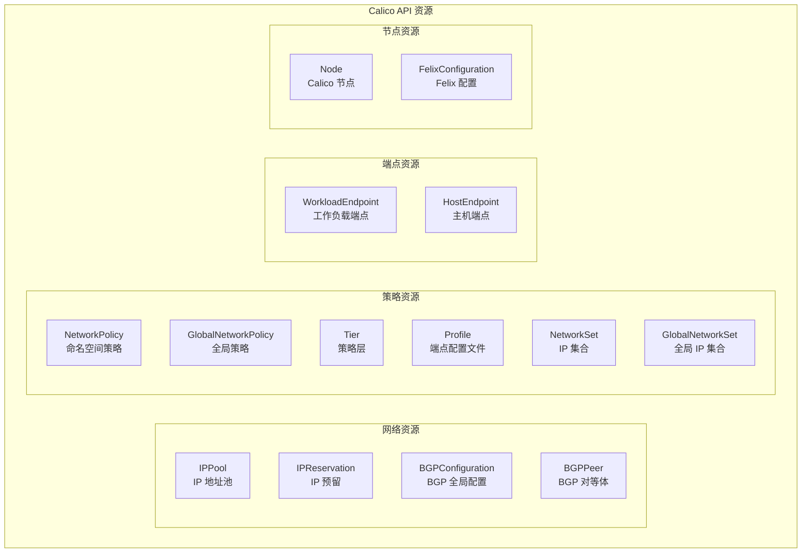
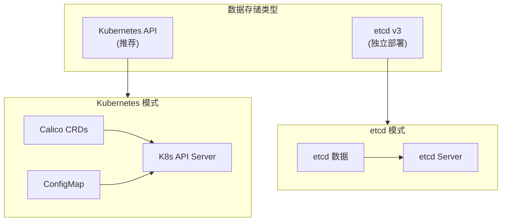
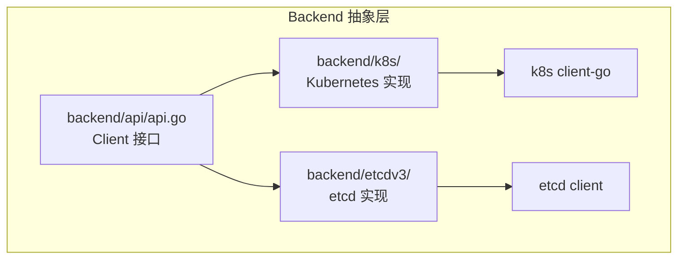
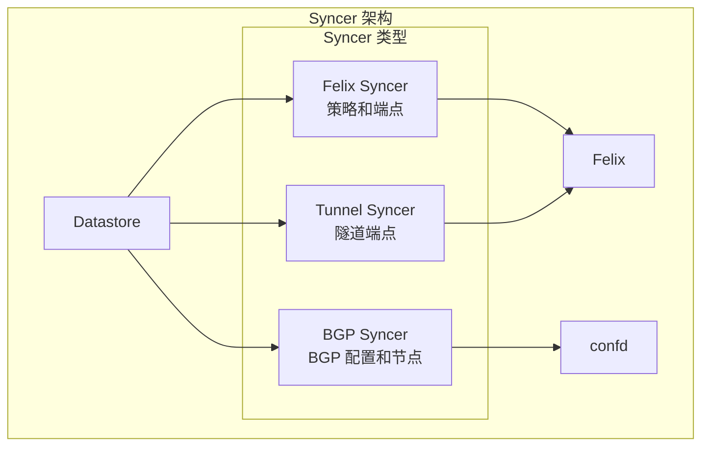
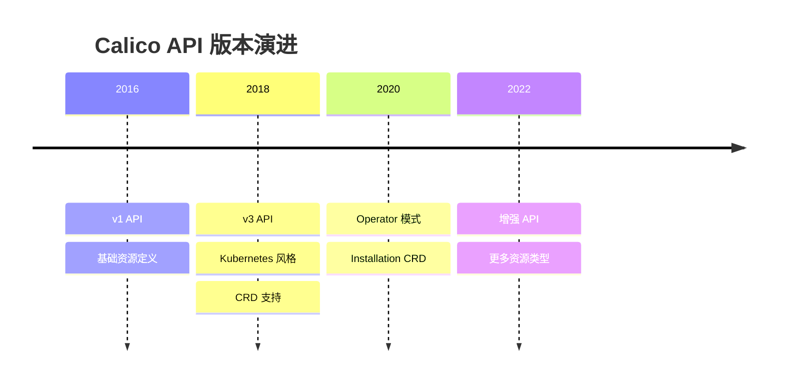

## 概述

Calico 使用 Kubernetes 风格的 API 来管理网络配置和策略。本章介绍 Calico 的 API 资源类型、CRD 定义、数据存储抽象层，以及 libcalico-go 客户端库的使用。

## 前置知识

- Kubernetes API 和 CRD 基础
- Go 语言基础
- etcd 基础（可选）

## Calico API 资源类型

### 资源分类



### 核心资源详解

| 资源 | 作用域 | 说明 |
|------|--------|------|
| **IPPool** | Global | 定义 Pod IP 地址范围 |
| **NetworkPolicy** | Namespaced | 命名空间级网络策略 |
| **GlobalNetworkPolicy** | Global | 集群级网络策略 |
| **WorkloadEndpoint** | Namespaced | Pod 网络端点信息 |
| **HostEndpoint** | Global | 主机网络端点 |
| **BGPPeer** | Global | BGP 邻居配置 |
| **BGPConfiguration** | Global | BGP 全局设置 |
| **FelixConfiguration** | Global | Felix 配置 |
| **Node** | Global | Calico 节点信息 |

## CRD 定义

### 代码位置

```
api/
├── pkg/
│   ├── apis/
│   │   └── projectcalico/
│   │       └── v3/           # API 类型定义
│   │           ├── bgpconfig.go
│   │           ├── bgppeer.go
│   │           ├── felixconfig.go
│   │           ├── ippool.go
│   │           ├── networkpolicy.go
│   │           ├── globalnetworkpolicy.go
│   │           ├── profile.go
│   │           ├── workloadendpoint.go
│   │           └── ...
│   └── lib/
│       └── numorstring/      # 端口范围等类型
└── go.mod
```

### IPPool 示例

**文件**: `api/pkg/apis/projectcalico/v3/ippool.go`

```go
// IPPool 定义
type IPPool struct {
    metav1.TypeMeta   `json:",inline"`
    metav1.ObjectMeta `json:"metadata,omitempty"`
    Spec              IPPoolSpec `json:"spec,omitempty"`
}

type IPPoolSpec struct {
    // CIDR 范围
    CIDR string `json:"cidr"`

    // 封装模式
    VXLANMode VXLANMode `json:"vxlanMode,omitempty"`
    IPIPMode  IPIPMode  `json:"ipipMode,omitempty"`

    // NAT 出站
    NATOutgoing bool `json:"natOutgoing,omitempty"`

    // 节点选择器
    NodeSelector string `json:"nodeSelector,omitempty"`

    // Block 大小
    BlockSize int `json:"blockSize,omitempty"`

    // 是否禁用
    Disabled bool `json:"disabled,omitempty"`
}
```

**YAML 示例**：

```yaml
apiVersion: projectcalico.org/v3
kind: IPPool
metadata:
  name: default-ipv4-pool
spec:
  cidr: 10.244.0.0/16
  ipipMode: CrossSubnet
  vxlanMode: Never
  natOutgoing: true
  blockSize: 26
  nodeSelector: all()
```

### NetworkPolicy 示例

**文件**: `api/pkg/apis/projectcalico/v3/networkpolicy.go`

```go
type NetworkPolicy struct {
    metav1.TypeMeta   `json:",inline"`
    metav1.ObjectMeta `json:"metadata,omitempty"`
    Spec              NetworkPolicySpec `json:"spec,omitempty"`
}

type NetworkPolicySpec struct {
    // 策略层
    Tier string `json:"tier,omitempty"`

    // 策略顺序
    Order *float64 `json:"order,omitempty"`

    // 选择器
    Selector string `json:"selector,omitempty"`

    // 入站规则
    Ingress []Rule `json:"ingress,omitempty"`

    // 出站规则
    Egress []Rule `json:"egress,omitempty"`

    // 策略类型
    Types []PolicyType `json:"types,omitempty"`
}

type Rule struct {
    Action    Action            `json:"action"`
    Protocol  *numorstring.Protocol `json:"protocol,omitempty"`
    Source    EntityRule        `json:"source,omitempty"`
    Destination EntityRule      `json:"destination,omitempty"`
    // ...
}
```

### WorkloadEndpoint 示例

**文件**: `api/pkg/apis/projectcalico/v3/workloadendpoint.go`

```go
type WorkloadEndpoint struct {
    metav1.TypeMeta   `json:",inline"`
    metav1.ObjectMeta `json:"metadata,omitempty"`
    Spec              WorkloadEndpointSpec `json:"spec,omitempty"`
}

type WorkloadEndpointSpec struct {
    // 编排器
    Orchestrator string `json:"orchestrator,omitempty"`

    // 工作负载
    Workload string `json:"workload,omitempty"`

    // 节点
    Node string `json:"node,omitempty"`

    // 容器 ID
    ContainerID string `json:"containerID,omitempty"`

    // Pod 信息
    Pod string `json:"pod,omitempty"`

    // 接口名
    InterfaceName string `json:"interfaceName,omitempty"`

    // MAC 地址
    MAC string `json:"mac,omitempty"`

    // IP 网络
    IPNetworks []string `json:"ipNetworks,omitempty"`

    // Profiles
    Profiles []string `json:"profiles,omitempty"`
}
```

## 数据存储抽象

### Datastore 类型

Calico 支持两种数据存储：



### Backend 抽象层

**代码位置**: `libcalico-go/lib/backend/`



**Client 接口** (`libcalico-go/lib/backend/api/api.go`):

```go
type Client interface {
    // CRUD 操作
    Create(ctx context.Context, object *model.KVPair) (*model.KVPair, error)
    Update(ctx context.Context, object *model.KVPair) (*model.KVPair, error)
    Apply(ctx context.Context, object *model.KVPair) (*model.KVPair, error)
    Delete(ctx context.Context, key model.Key, revision string) (*model.KVPair, error)
    Get(ctx context.Context, key model.Key, revision string) (*model.KVPair, error)
    List(ctx context.Context, list model.ListInterface, revision string) (*model.KVPairList, error)

    // Watch
    Watch(ctx context.Context, list model.ListInterface, revision string) (WatchInterface, error)

    // 其他
    EnsureInitialized() error
    Clean() error
    Close() error
}
```

### Kubernetes Backend

**文件**: `libcalico-go/lib/backend/k8s/k8s.go`

```go
// Kubernetes client 实现
type KubeClient struct {
    // K8s clientset
    ClientSet *kubernetes.Clientset

    // Calico clientset
    CalicoClientSet *calicoclient.Clientset

    // 资源转换器
    converters map[reflect.Type]converterInterface
}
```

**资源映射**：

| Calico 资源 | K8s 存储 |
|------------|---------|
| IPPool | CRD `ippools.crd.projectcalico.org` |
| NetworkPolicy | CRD `networkpolicies.crd.projectcalico.org` |
| WorkloadEndpoint | CRD `workloadendpoints.crd.projectcalico.org` |
| Node | 注解在 K8s Node 上 + CRD |
| Felix Config | CRD `felixconfigurations.crd.projectcalico.org` |

## libcalico-go 客户端库

### 代码结构

```
libcalico-go/
├── lib/
│   ├── apis/           # 内部 API 模型
│   ├── backend/        # 数据存储后端
│   │   ├── api/        # 后端接口
│   │   ├── k8s/        # K8s 实现
│   │   └── etcdv3/     # etcd 实现
│   ├── clientv3/       # v3 客户端
│   │   ├── client.go   # 客户端入口
│   │   ├── ippool.go
│   │   ├── networkpolicy.go
│   │   └── ...
│   ├── ipam/           # IPAM 实现
│   └── validator/      # 验证器
```

### 创建客户端

```go
import (
    "context"
    "github.com/projectcalico/api/pkg/apis/projectcalico/v3"
    client "github.com/projectcalico/calico/libcalico-go/lib/clientv3"
    "github.com/projectcalico/calico/libcalico-go/lib/options"
)

// 从环境变量/配置文件创建客户端
cfg, err := apiconfig.LoadClientConfig("")
if err != nil {
    return err
}

c, err := client.New(*cfg)
if err != nil {
    return err
}

// 或者直接指定配置
cfg := apiconfig.CalicoAPIConfig{
    Spec: apiconfig.CalicoAPIConfigSpec{
        DatastoreType: apiconfig.Kubernetes,
        KubeConfig: apiconfig.KubeConfig{
            Kubeconfig: "/path/to/kubeconfig",
        },
    },
}
c, err := client.New(cfg)
```

### 资源操作示例

```go
// 创建 IPPool
pool := &v3.IPPool{
    ObjectMeta: metav1.ObjectMeta{
        Name: "my-pool",
    },
    Spec: v3.IPPoolSpec{
        CIDR:        "10.100.0.0/16",
        IPIPMode:    v3.IPIPModeAlways,
        NATOutgoing: true,
    },
}

created, err := c.IPPools().Create(ctx, pool, options.SetOptions{})

// 获取 IPPool
pool, err := c.IPPools().Get(ctx, "my-pool", options.GetOptions{})

// 列出所有 IPPool
pools, err := c.IPPools().List(ctx, options.ListOptions{})

// 更新 IPPool
pool.Spec.NATOutgoing = false
updated, err := c.IPPools().Update(ctx, pool, options.SetOptions{})

// 删除 IPPool
_, err := c.IPPools().Delete(ctx, "my-pool", options.DeleteOptions{})
```

### Watch 资源变化

```go
// Watch NetworkPolicy 变化
watcher, err := c.NetworkPolicies().Watch(ctx, options.ListOptions{
    Namespace: "default",
})
if err != nil {
    return err
}
defer watcher.Stop()

for event := range watcher.ResultChan() {
    switch event.Type {
    case watch.Added:
        fmt.Printf("Added: %s\n", event.Object.(*v3.NetworkPolicy).Name)
    case watch.Modified:
        fmt.Printf("Modified: %s\n", event.Object.(*v3.NetworkPolicy).Name)
    case watch.Deleted:
        fmt.Printf("Deleted: %s\n", event.Object.(*v3.NetworkPolicy).Name)
    }
}
```

## Syncer 机制

### Syncer 架构

Syncer 负责从数据存储同步资源到各个组件：



### Felix Syncer

**文件**: `libcalico-go/lib/backend/syncersv1/felixsyncer/felixsyncerv1.go`

```go
// Felix Syncer 同步的资源
func New(client api.Client, cfg apiconfig.CalicoAPIConfigSpec, callbacks bapi.SyncerCallbacks) bapi.Syncer {
    resourceTypes := []watchersyncer.ResourceType{
        {
            ListInterface: model.ResourceListOptions{Kind: v3.KindNetworkPolicy},
        },
        {
            ListInterface: model.ResourceListOptions{Kind: v3.KindGlobalNetworkPolicy},
        },
        {
            ListInterface: model.ResourceListOptions{Kind: v3.KindProfile},
        },
        {
            ListInterface: model.ResourceListOptions{Kind: v3.KindWorkloadEndpoint},
        },
        {
            ListInterface: model.ResourceListOptions{Kind: v3.KindHostEndpoint},
        },
        {
            ListInterface: model.ResourceListOptions{Kind: v3.KindIPPool},
        },
        {
            ListInterface: model.ResourceListOptions{Kind: v3.KindNode},
        },
        // ... 更多资源
    }

    return watchersyncer.New(client, resourceTypes, callbacks)
}
```

### Syncer 回调

```go
type SyncerCallbacks interface {
    // 状态更新
    OnStatusUpdated(status SyncStatus)

    // 资源更新
    OnUpdates(updates []Update)
}

type Update struct {
    KVPair
    UpdateType UpdateType  // KVNew, KVUpdated, KVDeleted
}

type SyncStatus int
const (
    WaitForDatastore SyncStatus = iota
    ResyncInProgress
    InSync
)
```

## 实验：使用 calicoctl 操作资源

### 实验 1：查看资源

```bash
# 查看 IPPool
calicoctl get ippools -o yaml

# 查看节点
calicoctl get nodes -o wide

# 查看 WorkloadEndpoint
calicoctl get workloadendpoints -A -o wide

# 查看 NetworkPolicy
calicoctl get networkpolicies -A

# 查看 GlobalNetworkPolicy
calicoctl get globalnetworkpolicies

# 查看 FelixConfiguration
calicoctl get felixconfiguration default -o yaml
```

### 实验 2：创建和修改资源

```bash
# 创建 IPPool
cat << 'EOF' | calicoctl apply -f -
apiVersion: projectcalico.org/v3
kind: IPPool
metadata:
  name: test-pool
spec:
  cidr: 10.100.0.0/24
  ipipMode: Never
  vxlanMode: Never
  natOutgoing: true
  nodeSelector: all()
EOF

# 修改 IPPool
calicoctl patch ippool test-pool -p '{"spec":{"natOutgoing":false}}'

# 删除 IPPool
calicoctl delete ippool test-pool
```

### 实验 3：查看 CRD

```bash
# 列出 Calico CRDs
kubectl get crd | grep calico

# 查看 CRD 详情
kubectl get crd ippools.crd.projectcalico.org -o yaml

# 直接使用 kubectl 操作 Calico 资源
kubectl get ippools.crd.projectcalico.org

# 查看 IPPool 详情
kubectl describe ippool default-ipv4-ippool
```

### 实验 4：使用 Go 客户端

创建测试文件 `main.go`:

```go
package main

import (
    "context"
    "fmt"
    "os"

    "github.com/projectcalico/api/pkg/apis/projectcalico/v3"
    client "github.com/projectcalico/calico/libcalico-go/lib/clientv3"
    "github.com/projectcalico/calico/libcalico-go/lib/apiconfig"
    "github.com/projectcalico/calico/libcalico-go/lib/options"
)

func main() {
    // 创建客户端
    cfg, _ := apiconfig.LoadClientConfig("")
    c, err := client.New(*cfg)
    if err != nil {
        fmt.Printf("Error: %v\n", err)
        os.Exit(1)
    }

    ctx := context.Background()

    // 列出所有 IPPool
    pools, err := c.IPPools().List(ctx, options.ListOptions{})
    if err != nil {
        fmt.Printf("Error: %v\n", err)
        os.Exit(1)
    }

    fmt.Println("IP Pools:")
    for _, pool := range pools.Items {
        fmt.Printf("  - %s: %s\n", pool.Name, pool.Spec.CIDR)
    }

    // 列出所有节点
    nodes, err := c.Nodes().List(ctx, options.ListOptions{})
    if err != nil {
        fmt.Printf("Error: %v\n", err)
        os.Exit(1)
    }

    fmt.Println("\nNodes:")
    for _, node := range nodes.Items {
        fmt.Printf("  - %s: %s\n", node.Name, node.Spec.BGP.IPv4Address)
    }
}
```

运行：

```bash
go mod init test-calico
go mod tidy
go run main.go
```

## API 版本演进

### 版本历史



### v1 到 v3 迁移

| v1 | v3 | 变化 |
|----|-----|------|
| `policy` | `networkpolicy` | 区分 namespaced 和 global |
| `profile` | `profile` | 保持不变 |
| `hostEndpoint` | `hostendpoint` | 小写命名 |
| `workloadEndpoint` | `workloadendpoint` | 自动生成 |

## 总结

本章介绍了 Calico 的 API 和数据存储：

1. **API 资源** - IPPool、NetworkPolicy、WorkloadEndpoint 等
2. **CRD 定义** - 在 `api/pkg/apis/projectcalico/v3/` 目录
3. **数据存储** - 支持 Kubernetes API 和 etcd
4. **libcalico-go** - Go 客户端库，提供 CRUD 和 Watch
5. **Syncer** - 从数据存储同步资源到组件

理解 API 和数据存储是掌握 Calico 控制平面的基础。

## 参考资料

- [Calico API Reference](https://docs.tigera.io/calico/latest/reference/resources/)
- [libcalico-go 源码](https://github.com/projectcalico/calico/tree/master/libcalico-go)
- [Calico CRDs](https://github.com/projectcalico/calico/tree/master/api)
- [calicoctl 文档](https://docs.tigera.io/calico/latest/reference/calicoctl/)
