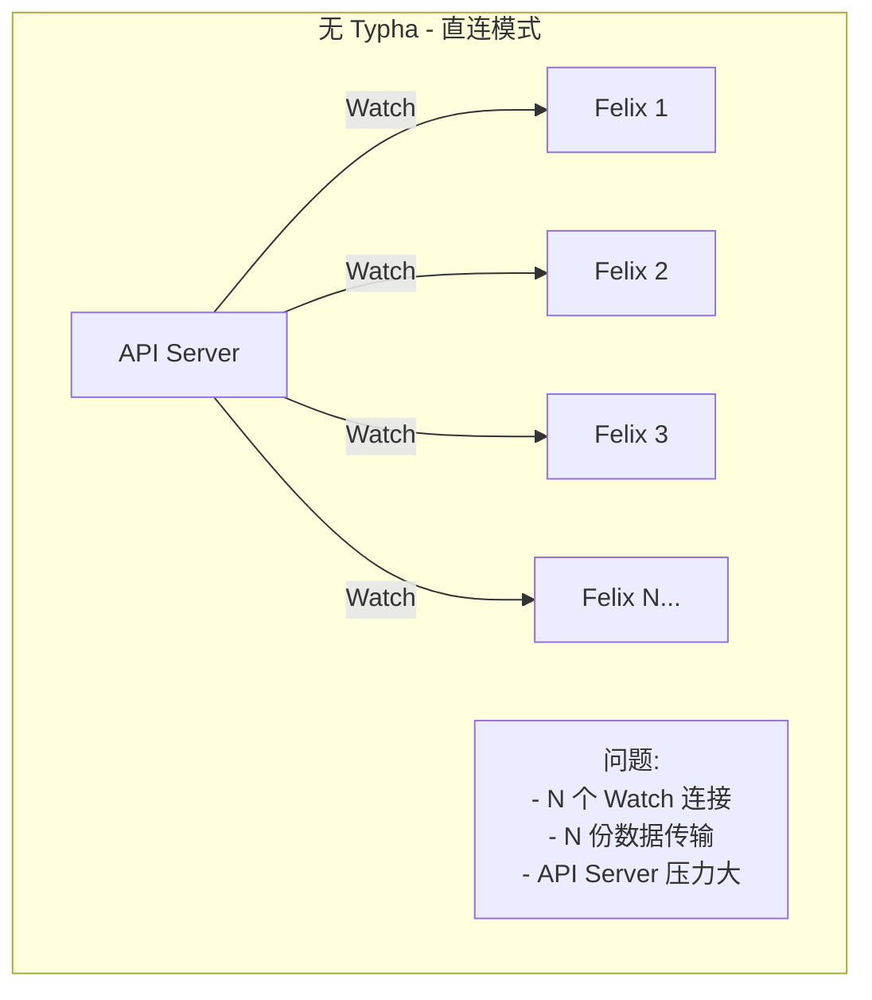
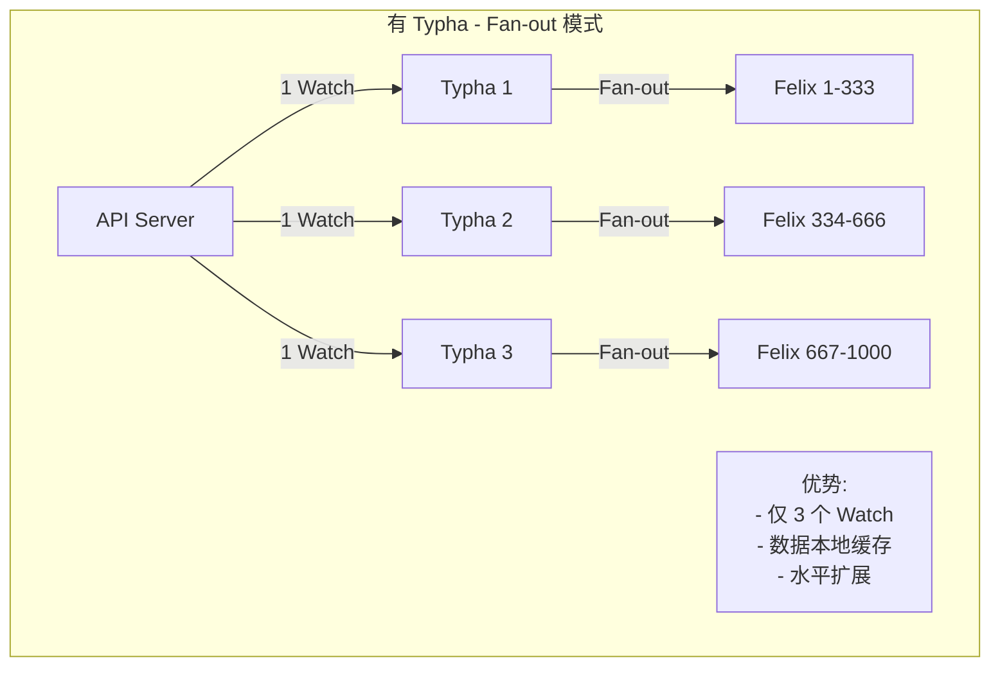
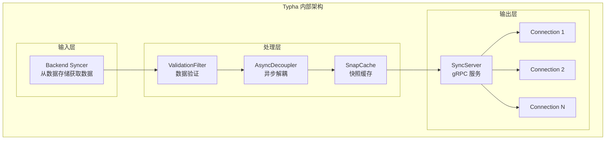
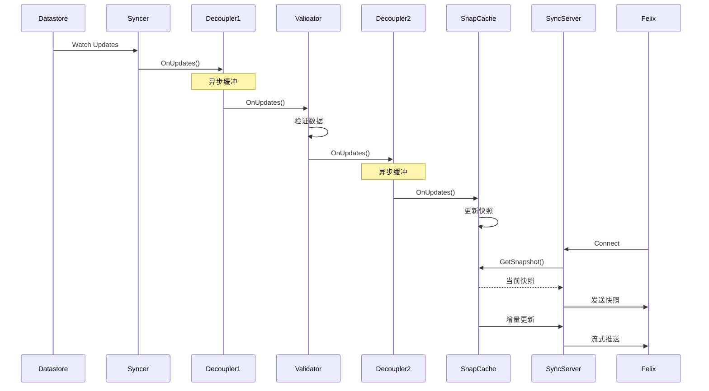
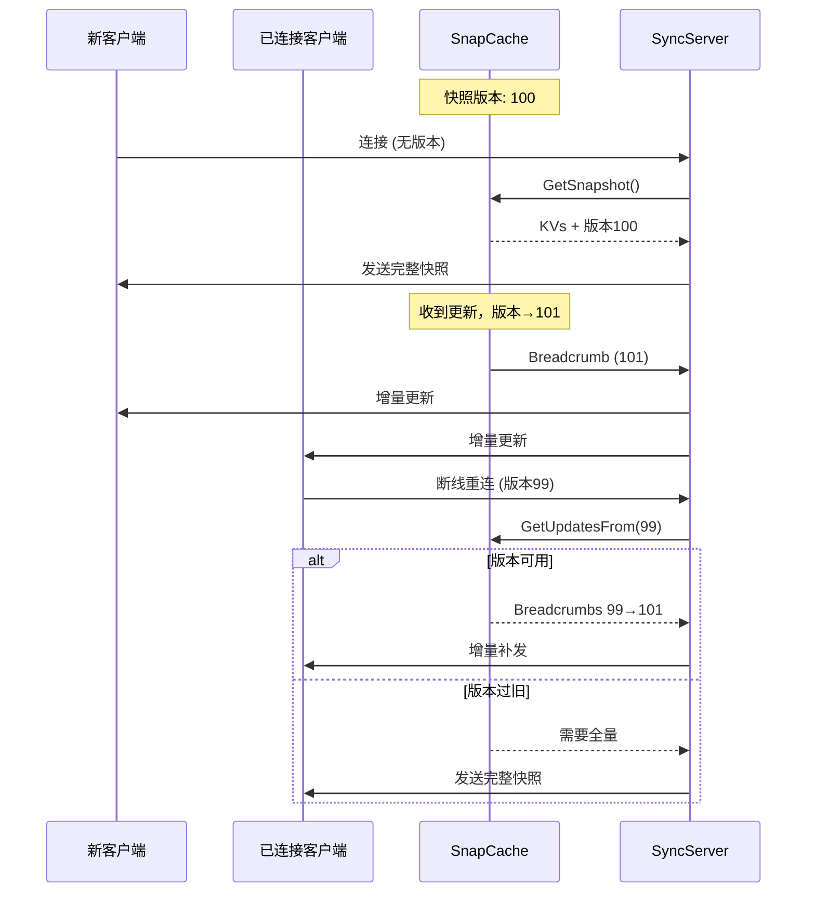
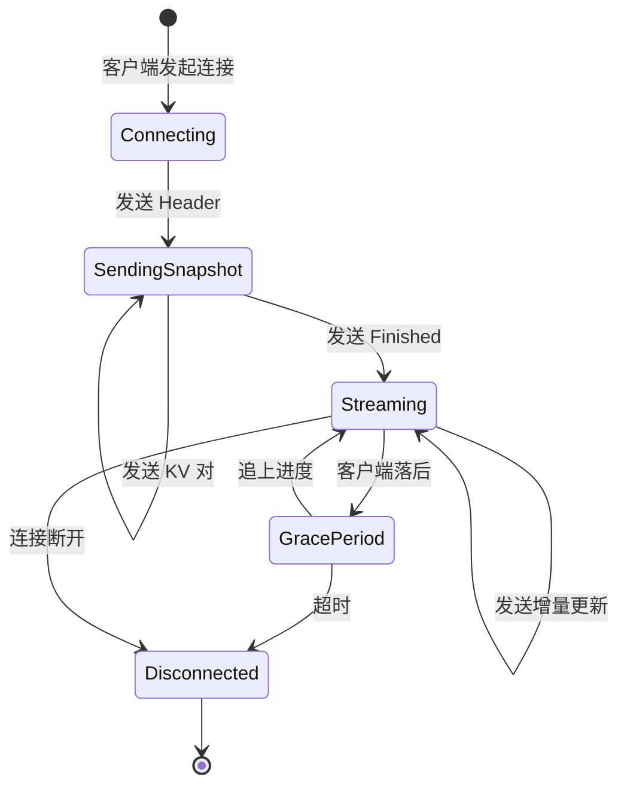
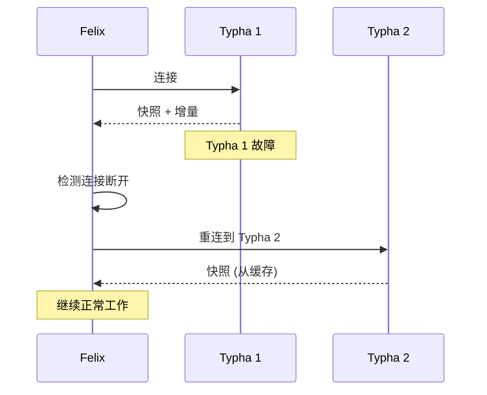

## 概述

Typha 是 Calico 的关键扩展性组件，作为数据存储和 Felix 之间的代理层，通过 fan-out 模式显著减少对 API Server 的连接数。本章深入介绍 Typha 的架构设计、工作原理和代码实现。

## 前置知识

- Calico 整体架构
- Kubernetes API Server 工作原理
- Go 并发编程基础

## 为什么需要 Typha

### 扩展性挑战

在大规模集群中，每个 Felix 直接连接 API Server 会带来问题：



**问题**：
- 1000 节点 = 1000 个 Watch 连接
- 每次更新发送 1000 次
- API Server 内存和 CPU 压力
- etcd 负载增加

### Typha 解决方案



**优势**：
- API Server 连接数：O(N) → O(Typha 实例数)
- 数据缓存和快照
- 客户端断线重连更快
- 故障隔离

## Typha 架构

### 核心组件



### 代码结构

```
typha/
├── cmd/
│   └── calico-typha/
│       └── typha.go           # 主入口
├── pkg/
│   ├── daemon/
│   │   └── daemon.go          # 守护进程生命周期
│   ├── discovery/
│   │   └── discovery.go       # 服务发现
│   ├── syncserver/
│   │   └── sync_server.go     # gRPC 同步服务
│   ├── snapcache/
│   │   └── cache.go           # 快照缓存
│   ├── calc/
│   │   └── async_decoupler.go # 异步解耦器
│   └── syncproto/
│       └── sync.proto         # gRPC 协议定义
```

## Syncer Pipeline

### Pipeline 架构

**文件**: `typha/pkg/daemon/daemon.go`

```go
type syncerPipeline struct {
    Type              syncproto.SyncerType
    Syncer            bapi.Syncer
    SyncerToValidator *calc.SyncerCallbacksDecoupler
    Validator         *calc.ValidationFilter
    ValidatorToCache  *calc.SyncerCallbacksDecoupler
    Cache             *snapcache.Cache
}
```



### 多 Syncer 类型

Typha 运行多个 Syncer，每个负责不同的资源类型：

```go
// typha/pkg/daemon/daemon.go
const (
    syncerTypeFelix      = "felix"      // Felix 需要的资源
    syncerTypeBGP        = "bgp"        // BGP/BIRD 需要的资源
    syncerTypeTunnelIPAlloc = "tunnel"  // 隧道 IP 分配
)
```

| Syncer 类型 | 同步的资源 | 消费者 |
|------------|----------|--------|
| Felix | Policy, Profile, Endpoint, IPPool, Node... | Felix |
| BGP | BGPConfig, BGPPeer, Node, IPPool... | BIRD/confd |
| Tunnel | Node, IPPool | Felix (隧道) |

## SnapCache 快照缓存

### 设计目标

1. **快照** - 新客户端可以快速获取当前完整状态
2. **增量** - 已连接客户端只收增量更新
3. **高效** - 最小化内存和 CPU 开销

### 核心数据结构

**文件**: `typha/pkg/snapcache/cache.go`

```go
type Cache struct {
    // 当前数据快照
    kvs map[string]interface{}

    // 快照版本
    snapshotSequenceNumber uint64

    // 更新 breadcrumb（用于增量同步）
    breadcrumbs       []*Breadcrumb
    breadcrumbIndexes map[uint64]int

    // 客户端管理
    wakeUpCond *sync.Cond
}

type Breadcrumb struct {
    SequenceNumber uint64
    Timestamp      time.Time
    Updates        []syncproto.SerializedUpdate
}
```

### 快照与增量同步



### Breadcrumb 机制

Breadcrumb（面包屑）记录历史更新，支持增量同步：

```go
func (c *Cache) RecordUpdate(update syncproto.SerializedUpdate) {
    c.lock.Lock()
    defer c.lock.Unlock()

    // 创建新的 breadcrumb
    c.snapshotSequenceNumber++
    bc := &Breadcrumb{
        SequenceNumber: c.snapshotSequenceNumber,
        Timestamp:      time.Now(),
        Updates:        []syncproto.SerializedUpdate{update},
    }

    // 添加到列表
    c.breadcrumbs = append(c.breadcrumbs, bc)
    c.breadcrumbIndexes[bc.SequenceNumber] = len(c.breadcrumbs) - 1

    // 清理过旧的 breadcrumb
    c.cleanOldBreadcrumbs()

    // 通知等待的客户端
    c.wakeUpCond.Broadcast()
}
```

## SyncServer gRPC 服务

### 协议定义

**文件**: `typha/pkg/syncproto/sync.proto`

```protobuf
service Sync {
    rpc Sync(stream SyncRequest) returns (stream SyncResponse);
}

message SyncRequest {
    oneof payload {
        SyncRequestStart start = 1;
        SyncRequestAck ack = 2;
    }
}

message SyncResponse {
    oneof payload {
        SyncResponseHeader header = 1;
        SyncResponseUpdate update = 2;
        SyncResponseFinished finished = 3;
        SyncResponsePing ping = 4;
    }
}
```

### 连接处理流程

**文件**: `typha/pkg/syncserver/sync_server.go`

```go
func (s *SyncServer) Sync(stream syncproto.Sync_SyncServer) error {
    // 1. 接收客户端请求
    req, err := stream.Recv()
    startReq := req.GetStart()

    // 2. 获取快照
    snapshot, seqNo := s.cache.GetSnapshot()

    // 3. 发送 Header
    stream.Send(&syncproto.SyncResponse{
        Payload: &syncproto.SyncResponse_Header{
            Header: &syncproto.SyncResponseHeader{
                SyncerType: startReq.SyncerType,
            },
        },
    })

    // 4. 发送快照数据
    for key, value := range snapshot {
        stream.Send(&syncproto.SyncResponse{
            Payload: &syncproto.SyncResponse_Update{
                Update: &syncproto.SerializedUpdate{
                    Key:   key,
                    Value: value,
                },
            },
        })
    }

    // 5. 发送快照完成标记
    stream.Send(&syncproto.SyncResponse{
        Payload: &syncproto.SyncResponse_Finished{
            Finished: &syncproto.SyncResponseFinished{},
        },
    })

    // 6. 持续发送增量更新
    for {
        updates := s.cache.WaitForUpdates(seqNo)
        for _, update := range updates {
            stream.Send(&syncproto.SyncResponse{
                Payload: &syncproto.SyncResponse_Update{
                    Update: &update,
                },
            })
        }
        seqNo = updates[len(updates)-1].SequenceNumber
    }
}
```

### 连接管理



## Felix 连接 Typha

### 连接配置

Felix 通过环境变量或配置文件指定 Typha 地址：

```yaml
# Felix 配置
apiVersion: projectcalico.org/v3
kind: FelixConfiguration
metadata:
  name: default
spec:
  typhaAddr: typha-service:5473
  typhaK8sServiceName: calico-typha
  typhaK8sNamespace: kube-system
```

### Felix Typha 客户端

**文件**: `felix/daemon/daemon.go`

```go
func connectToTypha(configParams *config.Config) (syncer bapi.Syncer, typhaClient *syncclient.SyncerClient) {
    // 发现 Typha 地址
    typhaAddr := discoverTyphaAddr(configParams)

    // 创建 Typha 客户端
    typhaClient = syncclient.New(
        typhaAddr,
        buildinfo.GitVersion,
        configParams.FelixHostname,
        "felix",  // syncer type
    )

    // 连接并开始同步
    err := typhaClient.Start(ctx)
    if err != nil {
        return nil, nil
    }

    return typhaClient, typhaClient
}
```

### 故障恢复



## 部署与扩展

### 部署建议

| 集群规模 | Typha 实例数 | 说明 |
|---------|-------------|------|
| < 50 节点 | 0 (可选) | 直连 API Server |
| 50-200 节点 | 2-3 | 高可用 |
| 200-500 节点 | 3-5 | 负载均衡 |
| > 500 节点 | 5+ | 按需扩展 |

### Typha Deployment

```yaml
apiVersion: apps/v1
kind: Deployment
metadata:
  name: calico-typha
  namespace: kube-system
spec:
  replicas: 3
  selector:
    matchLabels:
      k8s-app: calico-typha
  template:
    metadata:
      labels:
        k8s-app: calico-typha
    spec:
      containers:
      - name: calico-typha
        image: calico/typha:v3.26.0
        ports:
        - containerPort: 5473
          name: calico-typha
        env:
        - name: TYPHA_LOGSEVERITYSCREEN
          value: "info"
        - name: TYPHA_DATASTORETYPE
          value: "kubernetes"
        livenessProbe:
          httpGet:
            path: /liveness
            port: 9098
        readinessProbe:
          httpGet:
            path: /readiness
            port: 9098
        resources:
          requests:
            cpu: 100m
            memory: 100Mi
```

### 监控指标

Typha 暴露 Prometheus 指标：

```bash
# 连接数
typha_connections_streaming
typha_connections_grace_used

# 吞吐量
typha_updates_processed_total
typha_snapshots_generated_total

# 缓存状态
typha_breadcrumbs_in_cache
typha_cache_size_bytes

# 延迟
typha_client_write_latency_seconds
```

## 实验：观察 Typha 工作

### 实验 1：查看 Typha 状态

```bash
# 查看 Typha Pod
kubectl get pods -n kube-system -l k8s-app=calico-typha

# 查看 Typha 日志
kubectl logs -n kube-system -l k8s-app=calico-typha

# 查看连接数
kubectl exec -n kube-system <typha-pod> -- wget -qO- http://localhost:9098/metrics | grep typha_connections
```

### 实验 2：测试故障转移

```bash
# 记录当前 Felix 连接的 Typha
kubectl logs -n kube-system -l k8s-app=calico-node -c calico-node | grep -i typha

# 删除一个 Typha Pod
kubectl delete pod -n kube-system <typha-pod>

# 观察 Felix 重连
kubectl logs -n kube-system -l k8s-app=calico-node -c calico-node -f | grep -i typha
```

### 实验 3：性能对比

```bash
# 无 Typha 时 API Server 连接数
kubectl get --raw /metrics | grep apiserver_current_inflight_requests

# 启用 Typha 后
# 连接数应显著减少
```

## 代码深入分析

### 启动流程

**文件**: `typha/cmd/calico-typha/typha.go`

```go
func main() {
    // 1. 解析配置
    configParams := config.New()
    configParams.UpdateFrom(envVars)

    // 2. 创建 Daemon
    daemon := daemon.New()

    // 3. 启动
    daemon.Start(configParams)

    // 4. 等待信号
    daemon.WaitForShutdown()
}
```

**文件**: `typha/pkg/daemon/daemon.go`

```go
func (d *Daemon) Start(configParams *config.Config) {
    // 1. 创建后端客户端
    backendClient := d.createBackendClient(configParams)

    // 2. 创建 Syncer Pipeline
    for _, syncerType := range []string{"felix", "bgp", "tunnel"} {
        pipeline := d.createSyncerPipeline(syncerType, backendClient)
        d.pipelines[syncerType] = pipeline
    }

    // 3. 启动 gRPC 服务
    d.server = syncserver.New(d.caches, configParams)
    d.server.Start()

    // 4. 启动所有 Syncer
    for _, pipeline := range d.pipelines {
        pipeline.Syncer.Start()
    }
}
```

### 关键配置参数

| 参数 | 默认值 | 说明 |
|------|-------|------|
| `TYPHA_MAXCONNECTIONSLOWERLIMIT` | 100 | 最小连接数 |
| `TYPHA_MAXCONNECTIONSUPPERLIMIT` | 0 (无限) | 最大连接数 |
| `TYPHA_CONNECTIONDROPSFREQUENCY` | 0 | 连接重平衡频率 |
| `TYPHA_CONNECTIONBALANCINGINTERVALSECS` | 30 | 负载均衡间隔 |
| `TYPHA_MAXMESSAGESPERSECOND` | 0 (无限) | 消息速率限制 |
| `TYPHA_SHUTDOWNTIMEOUT` | 30s | 优雅关闭超时 |

## 总结

本章介绍了 Typha 的架构和工作原理：

1. **扩展性解决方案** - Fan-out 代理模式减少 API Server 负载
2. **Syncer Pipeline** - Syncer → Validator → Decoupler → Cache
3. **SnapCache** - 快照缓存 + Breadcrumb 增量同步
4. **SyncServer** - gRPC 服务处理客户端连接
5. **故障恢复** - 客户端自动重连其他 Typha 实例

Typha 是 Calico 大规模部署的关键组件，理解其架构有助于优化集群性能。

## 参考资料

- [Typha 源码](https://github.com/projectcalico/calico/tree/master/typha)
- [Calico 扩展性指南](https://docs.tigera.io/calico/latest/operations/comms/reduce-nodes)
- [Typha 设计文档](https://github.com/projectcalico/calico/blob/master/typha/docs/design.md)
