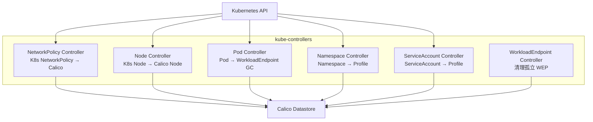
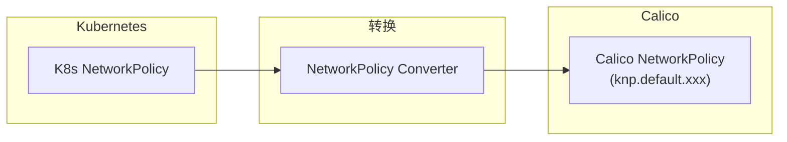
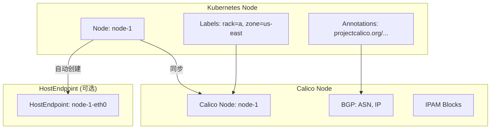
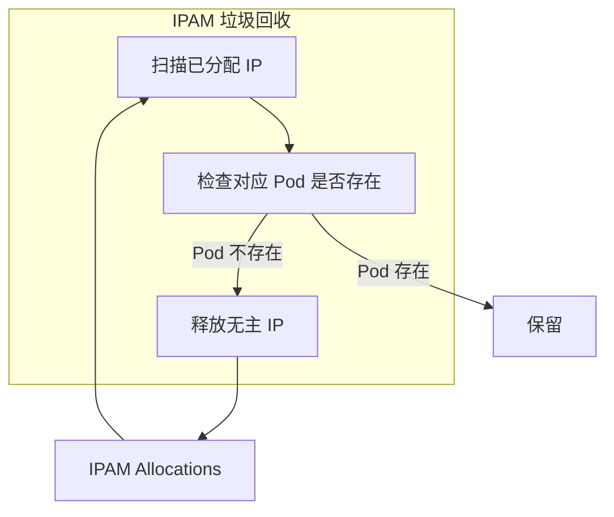
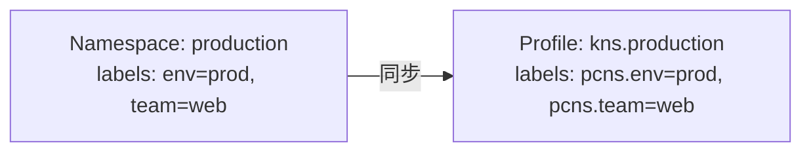

## 概述

kube-controllers 是 Calico 的 Kubernetes 控制器集合，负责将 Kubernetes 资源同步到 Calico 数据存储，并执行 IPAM 垃圾回收等管理任务。本章详细介绍各个 Controller 的职责和实现。

## 前置知识

- Kubernetes Controller 模式
- Kubernetes Informer 机制
- Calico API 资源

## Controller 概览

### 包含的 Controller



### Controller 职责

| Controller | 监听资源 | 输出资源 | 主要功能 |
|-----------|---------|---------|---------|
| **NetworkPolicy** | K8s NetworkPolicy | Calico NetworkPolicy | 策略转换 |
| **Node** | K8s Node | Calico Node, HostEndpoint | 节点管理 |
| **Pod** | K8s Pod | (GC) | IPAM 垃圾回收 |
| **Namespace** | K8s Namespace | Calico Profile | 命名空间标签同步 |
| **ServiceAccount** | K8s ServiceAccount | Calico Profile | ServiceAccount 标签 |
| **WorkloadEndpoint** | Calico WEP | (GC) | 清理孤立端点 |

## 代码结构

```
kube-controllers/
├── cmd/
│   └── kube-controllers/
│       └── main.go              # 主入口
├── pkg/
│   ├── config/
│   │   └── config.go            # 配置管理
│   ├── controllers/
│   │   ├── controller.go        # Controller 接口
│   │   ├── networkpolicy/       # NetworkPolicy Controller
│   │   ├── node/                # Node Controller
│   │   ├── pod/                 # Pod Controller
│   │   ├── namespace/           # Namespace Controller
│   │   ├── serviceaccount/      # ServiceAccount Controller
│   │   └── workloadendpoint/    # WorkloadEndpoint Controller
│   ├── converter/
│   │   └── networkpolicy_converter.go  # 策略转换
│   └── status/
│       └── status.go            # 状态报告
```

## NetworkPolicy Controller

### 功能

将 Kubernetes NetworkPolicy 转换为 Calico NetworkPolicy：



### 转换逻辑

**文件**: `kube-controllers/pkg/converter/networkpolicy_converter.go`

```go
func K8sNetworkPolicyToCalico(np *networkingv1.NetworkPolicy) (*apiv3.NetworkPolicy, error) {
    // 1. 创建 Calico NetworkPolicy
    policy := &apiv3.NetworkPolicy{
        ObjectMeta: metav1.ObjectMeta{
            Name:      "knp.default." + np.Name,  // 添加前缀避免冲突
            Namespace: np.Namespace,
        },
        Spec: apiv3.NetworkPolicySpec{
            Order:    &order1000,  // K8s 策略固定顺序 1000
            Selector: selectorFromPodSelector(np.Spec.PodSelector),
            Types:    convertPolicyTypes(np.Spec.PolicyTypes),
        },
    }

    // 2. 转换 Ingress 规则
    for _, rule := range np.Spec.Ingress {
        calicoRule := convertIngressRule(rule)
        policy.Spec.Ingress = append(policy.Spec.Ingress, calicoRule)
    }

    // 3. 转换 Egress 规则
    for _, rule := range np.Spec.Egress {
        calicoRule := convertEgressRule(rule)
        policy.Spec.Egress = append(policy.Spec.Egress, calicoRule)
    }

    return policy, nil
}
```

### Selector 转换

```go
// K8s PodSelector → Calico Selector
func selectorFromPodSelector(ps metav1.LabelSelector) string {
    // matchLabels: app=web → app == 'web'
    // matchExpressions: In → in {...}
    // matchExpressions: NotIn → not in {...}
    // matchExpressions: Exists → has(key)
    // matchExpressions: DoesNotExist → !has(key)

    selectors := []string{}

    for key, value := range ps.MatchLabels {
        selectors = append(selectors, fmt.Sprintf("%s == '%s'", key, value))
    }

    for _, expr := range ps.MatchExpressions {
        switch expr.Operator {
        case "In":
            selectors = append(selectors, fmt.Sprintf("%s in { %s }", expr.Key, strings.Join(expr.Values, ", ")))
        case "NotIn":
            selectors = append(selectors, fmt.Sprintf("%s not in { %s }", expr.Key, strings.Join(expr.Values, ", ")))
        case "Exists":
            selectors = append(selectors, fmt.Sprintf("has(%s)", expr.Key))
        case "DoesNotExist":
            selectors = append(selectors, fmt.Sprintf("!has(%s)", expr.Key))
        }
    }

    return strings.Join(selectors, " && ")
}
```

### Controller 实现

**文件**: `kube-controllers/pkg/controllers/networkpolicy/policy_controller.go`

```go
type policyController struct {
    informer      cache.SharedIndexInformer
    calicoClient  client.Interface
    cache         map[string]*apiv3.NetworkPolicy
}

func (c *policyController) Run(stopCh <-chan struct{}) {
    // 使用 K8s Informer 监听 NetworkPolicy
    c.informer.AddEventHandler(cache.ResourceEventHandlerFuncs{
        AddFunc:    c.onAdd,
        UpdateFunc: c.onUpdate,
        DeleteFunc: c.onDelete,
    })

    c.informer.Run(stopCh)
}

func (c *policyController) onAdd(obj interface{}) {
    np := obj.(*networkingv1.NetworkPolicy)

    // 转换
    calicoPolicy, err := converter.K8sNetworkPolicyToCalico(np)
    if err != nil {
        return
    }

    // 创建到 Calico
    _, err = c.calicoClient.NetworkPolicies().Create(ctx, calicoPolicy, options.SetOptions{})
}

func (c *policyController) onUpdate(oldObj, newObj interface{}) {
    // 类似 onAdd，但使用 Update
}

func (c *policyController) onDelete(obj interface{}) {
    np := obj.(*networkingv1.NetworkPolicy)
    name := "knp.default." + np.Name
    c.calicoClient.NetworkPolicies().Delete(ctx, np.Namespace, name, options.DeleteOptions{})
}
```

## Node Controller

### 功能

1. 同步 K8s Node 到 Calico Node
2. 管理 HostEndpoint（可选）
3. 清理已删除节点的 IPAM 数据



### 实现

**文件**: `kube-controllers/pkg/controllers/node/node_controller.go`

```go
type nodeController struct {
    k8sInformer   cache.SharedIndexInformer
    calicoClient  client.Interface
    syncStatus    *status.Status

    // 配置
    autoHostEndpointEnabled bool
}

func (c *nodeController) onK8sNodeAdd(obj interface{}) {
    k8sNode := obj.(*corev1.Node)

    // 1. 获取或创建 Calico Node
    calicoNode, err := c.calicoClient.Nodes().Get(ctx, k8sNode.Name, options.GetOptions{})
    if err != nil {
        calicoNode = &apiv3.Node{
            ObjectMeta: metav1.ObjectMeta{Name: k8sNode.Name},
        }
    }

    // 2. 同步标签
    calicoNode.Labels = mergeLabels(calicoNode.Labels, k8sNode.Labels)

    // 3. 从注解获取 BGP 配置
    if bgpIP := k8sNode.Annotations["projectcalico.org/IPv4Address"]; bgpIP != "" {
        calicoNode.Spec.BGP = &apiv3.NodeBGPSpec{
            IPv4Address: bgpIP,
        }
    }

    // 4. 更新 Calico Node
    c.calicoClient.Nodes().Update(ctx, calicoNode, options.SetOptions{})

    // 5. 自动创建 HostEndpoint（如果启用）
    if c.autoHostEndpointEnabled {
        c.createHostEndpoint(k8sNode)
    }
}

func (c *nodeController) onK8sNodeDelete(obj interface{}) {
    k8sNode := obj.(*corev1.Node)

    // 1. 删除 Calico Node
    c.calicoClient.Nodes().Delete(ctx, k8sNode.Name, options.DeleteOptions{})

    // 2. 清理 IPAM 数据
    c.cleanupIPAM(k8sNode.Name)

    // 3. 删除 HostEndpoint
    if c.autoHostEndpointEnabled {
        c.deleteHostEndpoint(k8sNode.Name)
    }
}
```

## Pod Controller

### 功能

Pod Controller 主要负责 IPAM 垃圾回收：



### 实现

**文件**: `kube-controllers/pkg/controllers/pod/pod_controller.go`

```go
type podController struct {
    k8sClient     kubernetes.Interface
    calicoClient  client.Interface
    ipamClient    ipam.Interface

    gcInterval    time.Duration
}

func (c *podController) Run(stopCh <-chan struct{}) {
    ticker := time.NewTicker(c.gcInterval)
    defer ticker.Stop()

    for {
        select {
        case <-ticker.C:
            c.runGC()
        case <-stopCh:
            return
        }
    }
}

func (c *podController) runGC() {
    // 1. 获取所有 IPAM 分配
    allocations, err := c.ipamClient.GetAllAllocations(ctx)

    // 2. 获取所有 Pod
    pods, err := c.k8sClient.CoreV1().Pods("").List(ctx, metav1.ListOptions{})
    podSet := make(map[string]bool)
    for _, pod := range pods.Items {
        key := pod.Namespace + "/" + pod.Name
        podSet[key] = true
    }

    // 3. 检查每个分配
    for _, alloc := range allocations {
        // 解析 handle（格式: k8s-pod-network.namespace.podname）
        podKey := parsePodKeyFromHandle(alloc.Handle)

        if !podSet[podKey] {
            // Pod 不存在，释放 IP
            log.Infof("Releasing orphaned IP %s (pod %s)", alloc.IP, podKey)
            c.ipamClient.ReleaseByHandle(ctx, alloc.Handle)
        }
    }
}
```

## Namespace Controller

### 功能

为每个 Namespace 创建 Calico Profile，包含命名空间标签：



### 实现

**文件**: `kube-controllers/pkg/controllers/namespace/namespace_controller.go`

```go
func (c *namespaceController) syncNamespace(ns *corev1.Namespace) error {
    // 1. 构建 Profile 名称
    profileName := "kns." + ns.Name

    // 2. 创建 Profile
    profile := &apiv3.Profile{
        ObjectMeta: metav1.ObjectMeta{
            Name: profileName,
        },
        Spec: apiv3.ProfileSpec{
            // 将命名空间标签转换为 Profile 标签
            // 添加 pcns. 前缀避免冲突
            LabelsToApply: map[string]string{
                "pcns.kubernetes.io/metadata.name": ns.Name,
            },
        },
    }

    // 添加用户标签
    for key, value := range ns.Labels {
        profile.Spec.LabelsToApply["pcns."+key] = value
    }

    // 3. 创建或更新
    _, err := c.calicoClient.Profiles().Apply(ctx, profile, options.SetOptions{})
    return err
}
```

## ServiceAccount Controller

### 功能

类似 Namespace Controller，为 ServiceAccount 创建 Profile：

```go
func (c *serviceAccountController) syncServiceAccount(sa *corev1.ServiceAccount) error {
    profileName := "ksa." + sa.Namespace + "." + sa.Name

    profile := &apiv3.Profile{
        ObjectMeta: metav1.ObjectMeta{
            Name: profileName,
        },
        Spec: apiv3.ProfileSpec{
            LabelsToApply: map[string]string{
                "pcsa.kubernetes.io/metadata.name":      sa.Name,
                "pcsa.kubernetes.io/metadata.namespace": sa.Namespace,
            },
        },
    }

    // 添加 ServiceAccount 标签
    for key, value := range sa.Labels {
        profile.Spec.LabelsToApply["pcsa."+key] = value
    }

    _, err := c.calicoClient.Profiles().Apply(ctx, profile, options.SetOptions{})
    return err
}
```

## WorkloadEndpoint Controller

### 功能

清理孤立的 WorkloadEndpoint（Pod 已删除但 WEP 残留）：

```go
func (c *workloadEndpointController) runGC() {
    // 1. 列出所有 WorkloadEndpoint
    weps, _ := c.calicoClient.WorkloadEndpoints().List(ctx, options.ListOptions{})

    // 2. 列出所有 Pod
    pods, _ := c.k8sClient.CoreV1().Pods("").List(ctx, metav1.ListOptions{})
    podSet := make(map[string]bool)
    for _, pod := range pods.Items {
        podSet[pod.Namespace+"/"+pod.Name] = true
    }

    // 3. 删除孤立的 WEP
    for _, wep := range weps.Items {
        podKey := wep.Namespace + "/" + wep.Spec.Pod
        if !podSet[podKey] {
            log.Infof("Deleting orphaned WorkloadEndpoint %s", wep.Name)
            c.calicoClient.WorkloadEndpoints().Delete(ctx, wep.Namespace, wep.Name, options.DeleteOptions{})
        }
    }
}
```

## 启动流程

### 主函数

**文件**: `kube-controllers/cmd/kube-controllers/main.go`

```go
func main() {
    // 1. 解析配置
    config := config.LoadConfig()

    // 2. 创建客户端
    k8sClient := createK8sClient()
    calicoClient := createCalicoClient()

    // 3. 创建 Controller Manager
    mgr := controllers.NewControllerManager(config, k8sClient, calicoClient)

    // 4. 注册 Controller
    if config.Controllers.NetworkPolicy.Enabled {
        mgr.RegisterController("networkpolicy", networkpolicy.NewController)
    }
    if config.Controllers.Node.Enabled {
        mgr.RegisterController("node", node.NewController)
    }
    if config.Controllers.Pod.Enabled {
        mgr.RegisterController("pod", pod.NewController)
    }
    // ... 其他 Controller

    // 5. 启动
    mgr.Run(stopCh)
}
```

### 配置

```yaml
apiVersion: v1
kind: ConfigMap
metadata:
  name: calico-kube-controllers-config
  namespace: kube-system
data:
  # 启用的 Controller
  ENABLED_CONTROLLERS: node,namespace,serviceaccount,workloadendpoint,networkpolicy

  # GC 间隔
  COMPACTION_PERIOD: 10m

  # 日志级别
  LOG_LEVEL: info
```

## 实验：观察 kube-controllers

### 实验 1：查看 Controller 状态

```bash
# 查看 kube-controllers Pod
kubectl get pods -n kube-system -l k8s-app=calico-kube-controllers

# 查看日志
kubectl logs -n kube-system -l k8s-app=calico-kube-controllers

# 查看 Controller 指标
kubectl exec -n kube-system <pod> -- wget -qO- http://localhost:9094/metrics
```

### 实验 2：观察 NetworkPolicy 转换

```bash
# 创建 K8s NetworkPolicy
cat << 'EOF' | kubectl apply -f -
apiVersion: networking.k8s.io/v1
kind: NetworkPolicy
metadata:
  name: test-policy
  namespace: default
spec:
  podSelector:
    matchLabels:
      app: web
  policyTypes:
  - Ingress
  ingress:
  - from:
    - podSelector:
        matchLabels:
          role: frontend
    ports:
    - protocol: TCP
      port: 80
EOF

# 查看生成的 Calico NetworkPolicy
calicoctl get networkpolicy -n default -o yaml | grep -A 50 "knp.default.test-policy"

# 删除并观察
kubectl delete networkpolicy test-policy
calicoctl get networkpolicy -n default | grep knp
```

### 实验 3：观察 Namespace Profile

```bash
# 创建带标签的 Namespace
kubectl create namespace test-ns
kubectl label namespace test-ns environment=test team=dev

# 查看生成的 Profile
calicoctl get profile kns.test-ns -o yaml

# 输出应包含：
# spec:
#   labelsToApply:
#     pcns.environment: test
#     pcns.team: dev
#     pcns.kubernetes.io/metadata.name: test-ns

# 清理
kubectl delete namespace test-ns
```

### 实验 4：IPAM GC 测试

```bash
# 查看当前 IPAM 分配
calicoctl ipam show --show-blocks

# 创建并删除 Pod（快速，不让 CNI 清理）
kubectl run test-pod --image=nginx --restart=Never
sleep 5
# 直接删除（模拟异常情况，实际中 CNI 会清理）
kubectl delete pod test-pod --grace-period=0 --force

# 等待 GC 运行（默认间隔 10 分钟）
# 或查看日志
kubectl logs -n kube-system -l k8s-app=calico-kube-controllers | grep -i "releasing"
```

## 高级配置

### 高可用部署

```yaml
apiVersion: apps/v1
kind: Deployment
metadata:
  name: calico-kube-controllers
  namespace: kube-system
spec:
  replicas: 1  # 只能运行一个实例（使用 Leader Election）
  selector:
    matchLabels:
      k8s-app: calico-kube-controllers
  template:
    spec:
      containers:
      - name: calico-kube-controllers
        image: calico/kube-controllers:v3.26.0
        env:
        - name: ENABLED_CONTROLLERS
          value: node,namespace,serviceaccount,workloadendpoint,networkpolicy
        - name: LOG_LEVEL
          value: info
        livenessProbe:
          exec:
            command:
            - /usr/bin/check-status
            - -l
        readinessProbe:
          exec:
            command:
            - /usr/bin/check-status
            - -r
```

### Leader Election

kube-controllers 使用 K8s Lease 进行 Leader Election：

```bash
# 查看 Leader Election
kubectl get lease -n kube-system calico-kube-controllers

# 输出
# NAME                       HOLDER           AGE
# calico-kube-controllers    controller-xxx   10h
```

## 总结

本章介绍了 kube-controllers 的各个 Controller：

1. **NetworkPolicy Controller** - K8s NetworkPolicy → Calico NetworkPolicy
2. **Node Controller** - K8s Node → Calico Node + HostEndpoint
3. **Pod Controller** - IPAM 垃圾回收
4. **Namespace Controller** - Namespace → Profile
5. **ServiceAccount Controller** - ServiceAccount → Profile
6. **WorkloadEndpoint Controller** - 清理孤立 WEP

这些 Controller 是 Calico 与 Kubernetes 集成的桥梁。

## 参考资料

- [kube-controllers 源码](https://github.com/projectcalico/calico/tree/master/kube-controllers)
- [Kubernetes Controller 模式](https://kubernetes.io/docs/concepts/architecture/controller/)
- [Calico IPAM](https://docs.tigera.io/calico/latest/networking/ipam/)
