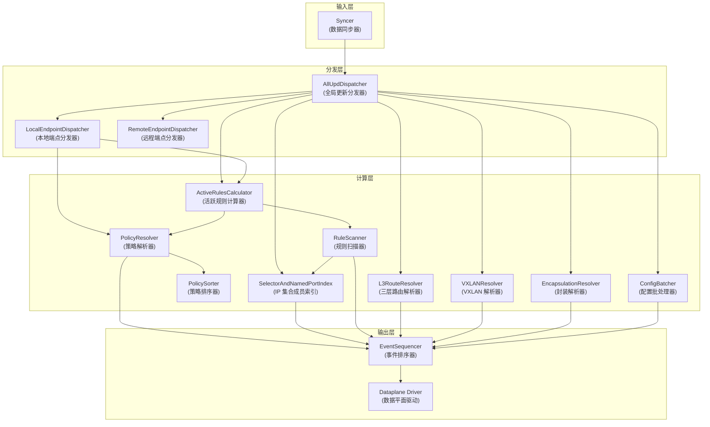
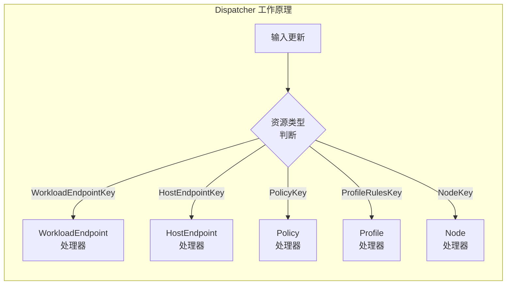
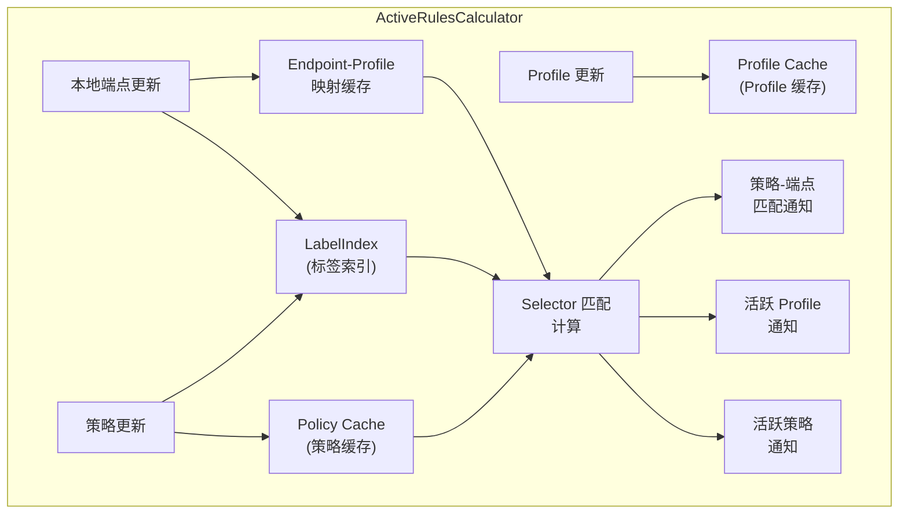
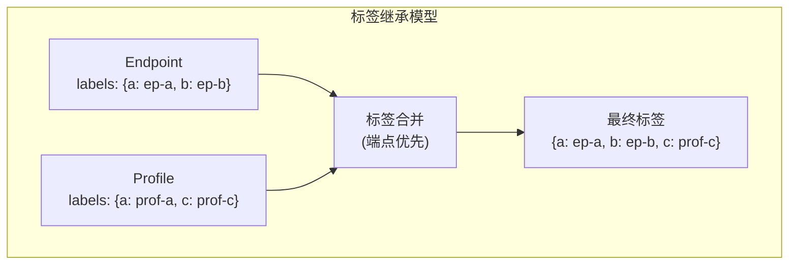
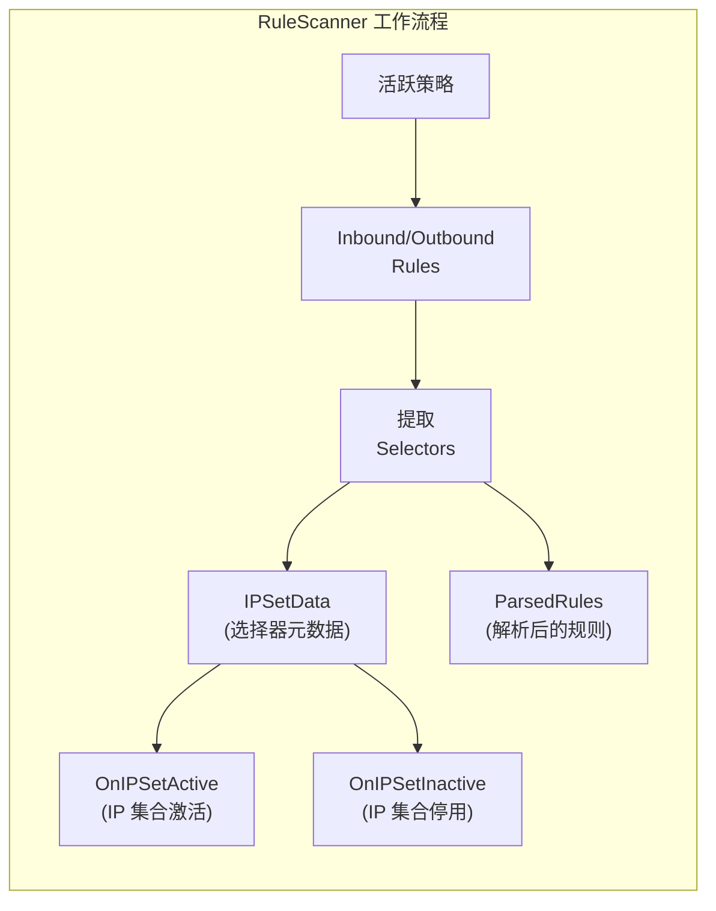
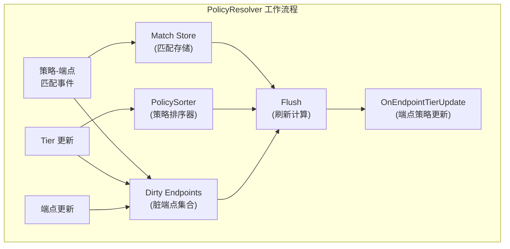
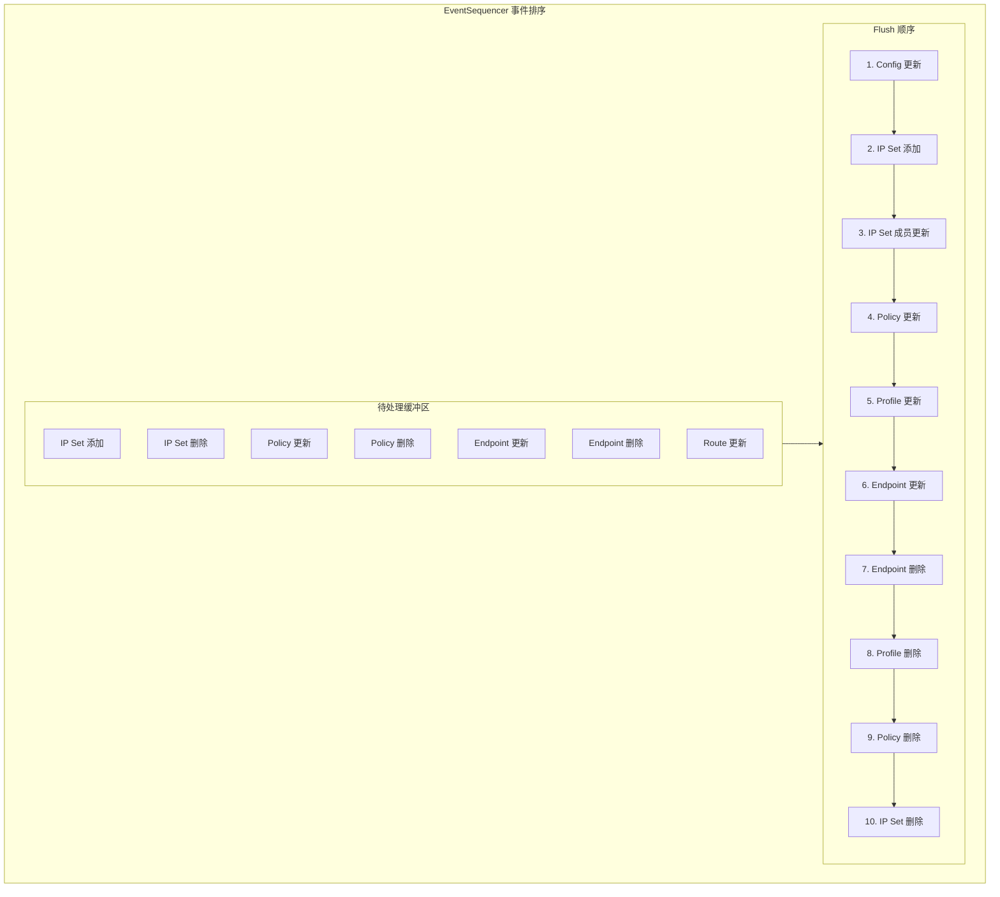
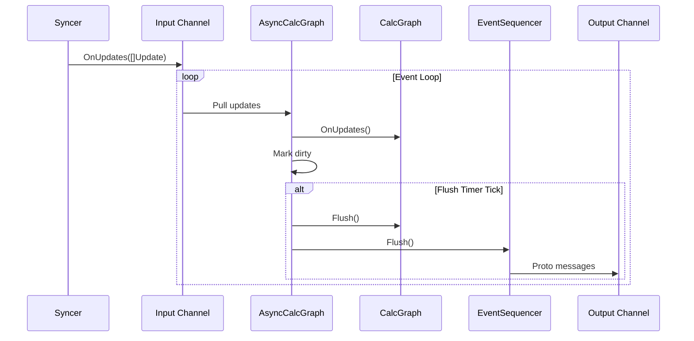
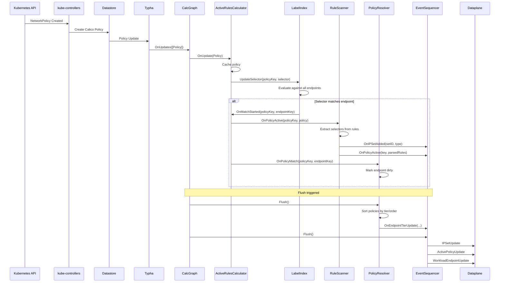
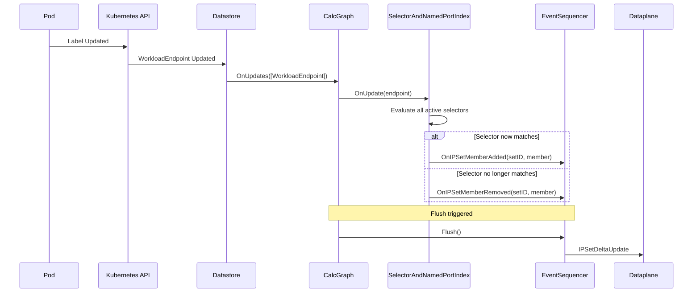

## 概述

Felix 的计算图（Calculation Graph）是 Calico 控制平面的核心组件，负责将从数据存储（通过 Typha 或直接连接）接收的原始配置数据转换为特定于本节点的数据平面配置。计算图采用流式处理架构，通过多个处理节点的协作，实现高效的增量更新。

本章深入分析计算图的架构设计、核心组件、数据流转机制，以及标签索引与选择器匹配的实现原理。

## 前置知识

- [Calico 架构概览](../00-overview/01-architecture-overview.md)
- [API 与数据存储](01-api-and-datastore.md)
- [Typha 架构](02-typha-architecture.md)
- [NetworkPolicy 模型](../02-kubernetes-networking/04-network-policy-model.md)

## 计算图架构

### 整体架构

计算图是一个有向无环图（DAG），由多个处理节点组成，每个节点负责特定的计算任务：



### 核心设计理念

计算图的设计遵循以下原则：

1. **增量更新**：只处理变化的数据，避免全量重算
2. **依赖排序**：按依赖关系顺序处理更新
3. **本地过滤**：只处理与本节点相关的端点和策略
4. **批量优化**：合并多个更新，减少数据平面操作

### CalcGraph 结构

```go
// 文件: felix/calc/calc_graph.go:114-135

type CalcGraph struct {
    // AllUpdDispatcher 是计算图的输入节点
    AllUpdDispatcher *dispatcher.Dispatcher

    // 指向其他计算图节点的指针
    localEndpointDispatcher *dispatcher.Dispatcher
    activeRulesCalculator   *ActiveRulesCalculator
    ruleScanner             *RuleScanner
    serviceIndex            *serviceindex.ServiceIndex
    ipsetMemberIndex        *labelindex.SelectorAndNamedPortIndex
    hostIPPassthru          *DataplanePassthru
    l3RouteResolver         *L3RouteResolver
    vxlanResolver           *VXLANResolver
    configBatcher           *ConfigBatcher
    profileDecoder          *ProfileDecoder
    encapsulationResolver   *EncapsulationResolver
    policyResolver          *PolicyResolver
}
```

## 核心组件详解

### 1. Dispatcher（分发器）

Dispatcher 是计算图的路由层，根据资源类型将更新分发到不同的处理器：



#### 本地端点过滤

LocalEndpointDispatcher 只传递本节点的端点更新：

```go
// 文件: felix/calc/calc_graph.go:543-574

// endpointHostnameFilter 过滤非本机端点
type endpointHostnameFilter struct {
    hostname string
}

func (f *endpointHostnameFilter) OnUpdate(update api.Update) (filterOut bool) {
    switch key := update.Key.(type) {
    case model.WorkloadEndpointKey:
        if key.Hostname != f.hostname {
            filterOut = true  // 过滤掉非本机端点
        }
    case model.HostEndpointKey:
        if key.Hostname != f.hostname {
            filterOut = true
        }
    }
    return
}
```

### 2. ActiveRulesCalculator（活跃规则计算器）

ActiveRulesCalculator 是计算图的核心组件，负责计算哪些策略和 Profile 在本节点上是活跃的。



#### 结构定义

```go
// 文件: felix/calc/active_rules_calculator.go:61-97

type ActiveRulesCalculator struct {
    // 所有已知的 Tier/Policy/Profile 缓存
    allTiers        map[string]*model.Tier
    allPolicies     packedmap.Map[model.PolicyKey, *model.Policy]
    allProfileRules packedmap.Deduped[string, *model.ProfileRules]

    // Policy/Profile ID 到匹配端点集合的映射
    policyIDToEndpointKeys  multidict.Multidict[any, any]
    profileIDToEndpointKeys multidict.Multidict[string, any]

    // 标签索引，用于策略选择器与本地端点的匹配
    labelIndex *labelindex.InheritIndex

    // 端点到 Profile ID 的缓存
    endpointKeyToProfileIDs *EndpointKeyToProfileIDMap

    // 回调接口
    RuleScanner          ruleScanner
    PolicyMatchListeners []PolicyMatchListener
}
```

#### 匹配计算流程

```go
// 文件: felix/calc/active_rules_calculator.go:352-391

// 当选择器开始匹配端点时调用
func (arc *ActiveRulesCalculator) onMatchStarted(selID, labelId interface{}) {
    polKey := selID.(model.PolicyKey)
    policyWasActive := arc.policyIDToEndpointKeys.ContainsKey(polKey)
    arc.policyIDToEndpointKeys.Put(selID, labelId)

    if !policyWasActive {
        // 策略之前不活跃，现在变为活跃
        log.Debugf("Policy %v now active", polKey)
        policy, known := arc.allPolicies.Get(polKey)
        if !known {
            log.WithField("policy", polKey).Panic("Policy active but missing from allPolicies.")
        }
        // 通知 RuleScanner 策略变为活跃
        arc.sendPolicyUpdate(polKey, policy)
    }

    // 通知 PolicyMatchListeners（包括 PolicyResolver）
    if labelId, ok := labelId.(model.EndpointKey); ok {
        for _, l := range arc.PolicyMatchListeners {
            l.OnPolicyMatch(polKey, labelId)
        }
    }
}

// 当选择器停止匹配端点时调用
func (arc *ActiveRulesCalculator) onMatchStopped(selID, labelId interface{}) {
    polKey := selID.(model.PolicyKey)
    arc.policyIDToEndpointKeys.Discard(selID, labelId)

    if !arc.policyIDToEndpointKeys.ContainsKey(selID) {
        // 策略不再活跃
        log.Debugf("Policy %v no longer active", polKey)
        policy, _ := arc.allPolicies.Get(polKey)
        arc.sendPolicyUpdate(polKey, policy)
    }

    // 通知匹配停止
    if labelId, ok := labelId.(model.EndpointKey); ok {
        for _, l := range arc.PolicyMatchListeners {
            l.OnPolicyMatchStopped(polKey, labelId)
        }
    }
}
```

### 3. InheritIndex（标签继承索引）

InheritIndex 是选择器匹配的核心实现，支持标签继承机制：



#### 结构定义

```go
// 文件: felix/labelindex/label_inheritance_index.go:96-110

type InheritIndex struct {
    // 端点数据缓存
    itemDataByID         map[interface{}]*itemData
    // 父级（Profile）数据缓存
    parentDataByParentID map[string]*parentData
    // 选择器缓存
    selectorsById        map[interface{}]*selector.Selector

    // 当前匹配关系
    selIdsByLabelId map[interface{}]set.Typed[any]
    labelIdsBySelId map[interface{}]set.Typed[any]

    // 回调函数
    OnMatchStarted MatchCallback
    OnMatchStopped MatchCallback

    // 脏数据集合（需要重新计算）
    dirtyItemIDs set.Typed[any]
}
```

#### 匹配更新流程

```go
// 文件: felix/labelindex/label_inheritance_index.go:374-386

func (idx *InheritIndex) updateMatches(
    selId interface{},
    sel *selector.Selector,
    labelId interface{},
    labels parser.Labels,
) {
    // 使用选择器评估标签
    nowMatches := sel.EvaluateLabels(labels)
    if nowMatches {
        idx.storeMatch(selId, labelId)
    } else {
        idx.deleteMatch(selId, labelId)
    }
}
```

### 4. RuleScanner（规则扫描器）

RuleScanner 扫描活跃策略中的规则，提取选择器并管理 IP 集合：



#### 规则转换

```go
// 文件: felix/calc/rule_scanner.go:191-282

func (rs *RuleScanner) updateRules(
    key interface{},
    inbound, outbound []model.Rule,
    untracked, preDNAT bool,
    origNamespace string,
    origSelector string,
    tier string,
    perfHints []apiv3.PolicyPerformanceHint,
) (parsedRules *ParsedRules) {
    // 提取所有新的选择器和命名端口
    currentUIDToIPSet := make(map[string]*IPSetData)
    parsedInbound := make([]*ParsedRule, len(inbound))

    for ii, rule := range inbound {
        parsed, allIPSets := ruleToParsedRule(&rule)
        parsedInbound[ii] = parsed
        for _, ipSet := range allIPSets {
            currentUIDToIPSet[ipSet.UniqueID()] = ipSet
        }
    }

    // 计算新增和删除的 IP 集合
    addedUids := set.New[string]()
    for uid := range currentUIDToIPSet {
        if !rs.rulesIDToUIDs.Contains(key, uid) {
            addedUids.Add(uid)
        }
    }

    removedUids := set.New[string]()
    rs.rulesIDToUIDs.Iter(key, func(uid string) {
        if _, ok := currentUIDToIPSet[uid]; !ok {
            removedUids.Add(uid)
        }
    })

    // 触发 IP 集合激活/停用事件
    for uid := range addedUids.All() {
        rs.rulesIDToUIDs.Put(key, uid)
        if !rs.uidsToRulesIDs.ContainsKey(uid) {
            ipSet := currentUIDToIPSet[uid]
            rs.ipSetsByUID[uid] = ipSet
            rs.OnIPSetActive(ipSet)  // 通知 IP 集合激活
        }
        rs.uidsToRulesIDs.Put(uid, key)
    }

    for uid := range removedUids.All() {
        rs.rulesIDToUIDs.Discard(key, uid)
        rs.uidsToRulesIDs.Discard(uid, key)
        if !rs.uidsToRulesIDs.ContainsKey(uid) {
            ipSetData := rs.ipSetsByUID[uid]
            delete(rs.ipSetsByUID, uid)
            rs.OnIPSetInactive(ipSetData)  // 通知 IP 集合停用
        }
    }

    return parsedRules
}
```

### 5. PolicyResolver（策略解析器）

PolicyResolver 计算每个端点的完整策略列表（按优先级排序）：



#### 结构定义

```go
// 文件: felix/calc/policy_resolver.go:52-66

type PolicyResolver struct {
    // 策略到端点的映射
    policyIDToEndpointIDs multidict.Multidict[model.PolicyKey, model.EndpointKey]
    // 端点到策略的映射
    endpointIDToPolicyIDs multidict.Multidict[model.EndpointKey, model.PolicyKey]
    // 策略元数据
    allPolicies           map[model.PolicyKey]policyMetadata
    // 排序后的 Tier 数据
    sortedTierData        []*TierInfo
    // 本地端点
    endpoints             map[model.Key]model.Endpoint
    // 需要重新计算的端点
    dirtyEndpoints        set.Set[model.EndpointKey]
    // 策略排序器
    policySorter          *PolicySorter
    // 回调接口
    Callbacks             []PolicyResolverCallbacks
}
```

#### Flush 计算

```go
// 文件: felix/calc/policy_resolver.go:178-201

func (pr *PolicyResolver) Flush() {
    if !pr.InSync {
        return
    }

    // 处理待处理的策略更新
    pr.pendingPolicyUpdates.Iter(func(polKey model.PolicyKey) error {
        policy, ok := pr.allPolicies[polKey]
        if !ok {
            return nil
        }
        pr.policySorter.UpdatePolicy(polKey, &policy)
        return set.RemoveItem
    })

    // 获取排序后的 Tier 数据
    pr.sortedTierData = pr.policySorter.Sorted()

    // 为每个脏端点发送更新
    for endpointID := range pr.dirtyEndpoints.All() {
        pr.sendEndpointUpdate(endpointID)
    }
    pr.dirtyEndpoints.Clear()
}
```

### 6. EventSequencer（事件排序器）

EventSequencer 是计算图的输出层，负责缓冲和排序更新事件，确保按依赖顺序发送到数据平面：



#### Flush 实现

```go
// 文件: felix/calc/event_sequencer.go:867-920

func (buf *EventSequencer) Flush() {
    // 1. 首先刷新配置更新（可能触发重启）
    buf.flushReadyFlag()
    buf.flushConfigUpdate()

    // 2. 按依赖顺序刷新添加/更新
    // IP 集合 -> 策略 -> 端点
    buf.flushAddedIPSets()
    buf.flushIPSetDeltas()
    buf.flushPolicyUpdates()
    buf.flushProfileUpdates()
    buf.flushEndpointTierUpdates()

    // 3. 按相反顺序刷新删除
    // 端点 -> 策略 -> IP 集合
    buf.flushEndpointTierDeletes()
    buf.flushProfileDeletes()
    buf.flushPolicyDeletes()
    buf.flushRemovedIPSets()

    // 4. 刷新其他资源
    buf.flushServiceAccounts()
    buf.flushNamespaces()

    // 5. VXLAN 相关（先删后加）
    buf.flushRouteRemoves()
    buf.flushVTEPRemoves()
    buf.flushVTEPAdds()
    buf.flushRouteAdds()

    // 6. 集群范围的更新
    buf.flushHostWireguardDeletes()
    buf.flushHostWireguardUpdates()
    buf.flushHostIPDeletes()
    buf.flushHostIPUpdates()
    buf.flushIPPoolDeletes()
    buf.flushIPPoolUpdates()
    buf.flushEncapUpdate()

    // 7. BGP 和 Service 更新
    if buf.pendingGlobalBGPConfig != nil {
        buf.Callback(buf.pendingGlobalBGPConfig)
        buf.pendingGlobalBGPConfig = nil
    }
    buf.flushServices()
}
```

## 异步计算图

### AsyncCalcGraph

AsyncCalcGraph 封装了同步的 CalcGraph，提供异步处理能力：



#### 结构定义

```go
// 文件: felix/calc/async_calc_graph.go:72-88

type AsyncCalcGraph struct {
    CalcGraph        *CalcGraph
    inputEvents      chan interface{}
    outputChannels   []chan<- interface{}
    eventSequencer   *EventSequencer
    beenInSync       bool
    needToSendInSync bool
    syncStatusNow    api.SyncStatus
    healthAggregator *health.HealthAggregator

    flushTicks       <-chan time.Time
    healthTicks      <-chan time.Time
    flushLeakyBucket int      // 漏桶限流
    dirty            bool
}
```

#### 主循环

```go
// 文件: felix/calc/async_calc_graph.go:136-194

func (acg *AsyncCalcGraph) loop() {
    log.Info("AsyncCalcGraph running")
    acg.reportHealth()

    for {
        select {
        case update := <-acg.inputEvents:
            switch update := update.(type) {
            case []api.Update:
                // 逐个处理更新，中间报告健康状态
                for i, upd := range update {
                    updStartTime := time.Now()
                    acg.CalcGraph.OnUpdates(update[i : i+1])
                    summaryUpdateTime.Observe(time.Since(updStartTime).Seconds())
                    // 记录处理统计
                    typeName := reflect.TypeOf(upd.Key).Name()
                    countUpdatesProcessed.WithLabelValues(typeName).Inc()
                    acg.reportHealth()
                }
            case api.SyncStatus:
                acg.syncStatusNow = update
                acg.CalcGraph.OnStatusUpdated(update)
                if update == api.InSync && !acg.beenInSync {
                    log.Info("First time we've been in sync")
                    acg.beenInSync = true
                    acg.needToSendInSync = true
                    acg.dirty = true
                    if acg.flushLeakyBucket == 0 {
                        acg.flushLeakyBucket++  // 强制刷新
                    }
                }
            }
            acg.dirty = true

        case <-acg.flushTicks:
            // 定时器：填充漏桶
            if acg.flushLeakyBucket < leakyBucketSize {
                acg.flushLeakyBucket++
            }

        case <-acg.healthTicks:
            acg.reportHealth()
        }
        acg.maybeFlush()
    }
}
```

### 限流机制

AsyncCalcGraph 使用漏桶算法限制 Flush 频率：

```go
// 文件: felix/calc/async_calc_graph.go:206-229

func (acg *AsyncCalcGraph) maybeFlush() {
    if !acg.dirty {
        return
    }
    if acg.flushLeakyBucket > 0 {
        log.Debug("Not throttled: flushing event buffer")
        acg.flushLeakyBucket--

        flushStart := time.Now()
        acg.CalcGraph.Flush()
        acg.eventSequencer.Flush()
        flushDuration := time.Since(flushStart)

        if flushDuration > time.Second {
            log.WithField("time", flushDuration).Info("Flush took over 1s.")
        }

        if acg.needToSendInSync {
            log.Info("First flush after becoming in sync, sending InSync message.")
            acg.onEvent(&proto.InSync{})
            acg.needToSendInSync = false
        }
        acg.dirty = false
    } else {
        log.Debug("Throttled: not flushing event buffer")
    }
}
```

## 数据流详解

### 策略更新流程

以创建 NetworkPolicy 为例：



### IP 集合成员更新流程

当端点标签变化导致 IP 集合成员变化时：



## 关键代码路径

### 计算图创建

```go
// 文件: felix/calc/calc_graph.go:149-532

func NewCalculationGraph(
    callbacks PipelineCallbacks,
    cache *LookupsCache,
    conf *config.Config,
    liveCallback func(),
) *CalcGraph {
    hostname := conf.FelixHostname
    cg := &CalcGraph{}

    // 1. 创建全局更新分发器
    allUpdDispatcher := dispatcher.NewDispatcher()
    cg.AllUpdDispatcher = allUpdDispatcher

    // 2. 创建本地端点分发器（带过滤）
    localEndpointDispatcher := dispatcher.NewDispatcher()
    localEndpointFilter := &endpointHostnameFilter{hostname: hostname}
    localEndpointFilter.RegisterWith(localEndpointDispatcher)

    // 3. 创建 ActiveRulesCalculator
    activeRulesCalc := NewActiveRulesCalculator()
    activeRulesCalc.RegisterWith(localEndpointDispatcher, allUpdDispatcher)

    // 4. 创建 RuleScanner
    ruleScanner := NewRuleScanner()
    activeRulesCalc.RuleScanner = ruleScanner
    ruleScanner.RulesUpdateCallbacks = callbacks

    // 5. 创建 IP 集合成员索引
    ipsetMemberIndex := labelindex.NewSelectorAndNamedPortIndex(...)
    ipsetMemberIndex.RegisterWith(allUpdDispatcher)

    // 6. 连接 RuleScanner 和 IPSetMemberIndex
    ruleScanner.OnIPSetActive = func(ipSet *IPSetData) {
        callbacks.OnIPSetAdded(ipSet.UniqueID(), ipSet.DataplaneProtocolType())
        ipsetMemberIndex.UpdateIPSet(ipSet.UniqueID(), ipSet.Selector, ...)
    }
    ruleScanner.OnIPSetInactive = func(ipSet *IPSetData) {
        ipsetMemberIndex.DeleteIPSet(ipSet.UniqueID())
        callbacks.OnIPSetRemoved(ipSet.UniqueID())
    }

    // 7. 创建 PolicyResolver
    polResolver := NewPolicyResolver()
    activeRulesCalc.RegisterPolicyMatchListener(polResolver)
    polResolver.RegisterWith(allUpdDispatcher, localEndpointDispatcher)
    polResolver.RegisterCallback(callbacks)

    // 8. 创建路由解析器（如果需要）
    if conf.BPFEnabled || conf.Encapsulation.VXLANEnabled || ... {
        l3RR := NewL3RouteResolver(hostname, callbacks, ...)
        l3RR.RegisterWith(allUpdDispatcher, localEndpointDispatcher)
    }

    return cg
}
```

### 计算图启动

```go
// 文件: felix/daemon/daemon.go（简化）

func (d *Daemon) startCalculationGraph() {
    // 创建输出通道
    outputChannels := []chan<- interface{}{d.dataplaneChannel}

    // 创建异步计算图
    d.asyncCalcGraph = calc.NewAsyncCalcGraph(
        d.config,
        outputChannels,
        d.healthAggregator,
        lookupCache,
    )

    // 启动计算图
    d.asyncCalcGraph.Start()

    // 连接 Syncer
    d.syncer.AddCallbacks(d.asyncCalcGraph)
}
```

## 性能优化

### 1. 增量更新

计算图只处理变化的数据：

- **脏数据追踪**：使用 `dirtyItemIDs`、`dirtyEndpoints` 等集合追踪需要重新计算的项
- **增量 IP 集合更新**：使用 `IPSetDeltaUpdate` 而非全量更新
- **选择性重算**：只有受影响的端点才会重新计算策略

### 2. 数据压缩

```go
// 文件: felix/calc/active_rules_calculator.go:67-70

// 使用压缩 Map 存储策略（减少内存占用）
allPolicies     packedmap.Map[model.PolicyKey, *model.Policy]
// 使用去重压缩 Map 存储 Profile（相同内容共享存储）
allProfileRules packedmap.Deduped[string, *model.ProfileRules]
```

### 3. 批量处理

- **漏桶限流**：防止频繁 Flush 导致的性能问题
- **事件合并**：在 Flush 之前合并同一资源的多次更新
- **批量刷新**：一次 Flush 处理所有待处理的更新

### 4. 本地过滤

- **端点过滤**：只处理本节点的端点
- **策略过滤**：只处理匹配本地端点的策略
- **Profile 过滤**：只处理本地端点引用的 Profile

## 调试技巧

### 1. 日志级别

设置 Felix 日志级别为 Debug 查看计算图详细日志：

```bash
# 设置日志级别
kubectl patch felixconfiguration default \
  --type='merge' \
  -p '{"spec":{"logSeverityScreen":"Debug"}}'

# 查看相关日志
kubectl logs -n calico-system -l k8s-app=calico-node -c calico-node | \
  grep -E "(ActiveRulesCalculator|RuleScanner|PolicyResolver|EventSequencer)"
```

### 2. Prometheus 指标

计算图暴露多个 Prometheus 指标：

```
# 活跃选择器数量
felix_active_local_selectors

# 活跃端点数量
felix_active_local_endpoints

# 活跃策略数量
felix_active_local_policies

# 计算图更新处理数量
felix_calc_graph_updates_processed

# 计算图输出事件数量
felix_calc_graph_output_events

# 更新处理时间
felix_calc_graph_update_time_seconds
```

### 3. 关键断点位置

| 功能 | 文件 | 函数 |
|------|------|------|
| 策略激活 | `active_rules_calculator.go:352` | `onMatchStarted` |
| 策略停用 | `active_rules_calculator.go:376` | `onMatchStopped` |
| 规则扫描 | `rule_scanner.go:191` | `updateRules` |
| 策略排序 | `policy_resolver.go:178` | `Flush` |
| 事件输出 | `event_sequencer.go:867` | `Flush` |
| 标签匹配 | `label_inheritance_index.go:374` | `updateMatches` |

## 实验：观察计算图运行

### 准备工作

```bash
# 创建测试命名空间
kubectl create namespace calc-graph-test

# 部署测试 Pod
kubectl apply -f - <<EOF
apiVersion: v1
kind: Pod
metadata:
  name: test-pod
  namespace: calc-graph-test
  labels:
    app: test
    version: v1
spec:
  containers:
  - name: nginx
    image: nginx:alpine
EOF
```

### 实验 1：观察策略激活

```bash
# 开启 Felix Debug 日志
kubectl patch felixconfiguration default \
  --type='merge' -p '{"spec":{"logSeverityScreen":"Debug"}}'

# 在另一个终端监控日志
kubectl logs -n calico-system -l k8s-app=calico-node -c calico-node -f | \
  grep -E "(Policy.*active|IPSet.*active)"

# 创建网络策略
kubectl apply -f - <<EOF
apiVersion: networking.k8s.io/v1
kind: NetworkPolicy
metadata:
  name: test-policy
  namespace: calc-graph-test
spec:
  podSelector:
    matchLabels:
      app: test
  policyTypes:
  - Ingress
  ingress:
  - from:
    - podSelector:
        matchLabels:
          role: client
EOF

# 观察日志输出，应该看到类似：
# Policy default/test-policy now active
# IPSet now active: ...
```

### 实验 2：观察 IP 集合成员更新

```bash
# 监控 IP 集合成员变化
kubectl logs -n calico-system -l k8s-app=calico-node -c calico-node -f | \
  grep -E "(Member added|Member removed)"

# 创建匹配策略选择器的 Pod
kubectl apply -f - <<EOF
apiVersion: v1
kind: Pod
metadata:
  name: client-pod
  namespace: calc-graph-test
  labels:
    role: client
spec:
  containers:
  - name: nginx
    image: nginx:alpine
EOF

# 观察日志，应该看到成员被添加到 IP 集合

# 修改标签使其不再匹配
kubectl label pod client-pod -n calc-graph-test role-

# 观察日志，应该看到成员从 IP 集合移除
```

### 实验 3：观察 Prometheus 指标

```bash
# 端口转发到 Felix 指标端口
kubectl port-forward -n calico-system \
  $(kubectl get pod -n calico-system -l k8s-app=calico-node -o name | head -1) \
  9091:9091

# 查询计算图指标
curl -s http://localhost:9091/metrics | grep felix_calc_graph
curl -s http://localhost:9091/metrics | grep felix_active_local
```

### 清理

```bash
kubectl delete namespace calc-graph-test
kubectl patch felixconfiguration default \
  --type='merge' -p '{"spec":{"logSeverityScreen":"Info"}}'
```

## 总结

Felix 计算图是 Calico 控制平面的核心，它：

1. **采用 DAG 架构**：通过多个专门化的处理节点，将原始数据转换为数据平面配置
2. **实现增量更新**：只处理变化的数据，避免全量重算
3. **支持标签继承**：端点可以从 Profile 继承标签
4. **保证依赖顺序**：通过 EventSequencer 确保更新按正确顺序发送
5. **提供高性能**：通过本地过滤、批量处理、限流等机制优化性能

理解计算图的工作原理对于调试策略问题、优化大规模部署非常重要。

## 参考资料

- [Felix 设计文档](https://docs.projectcalico.org/reference/architecture/overview)
- [Calico 源码 - felix/calc/](https://github.com/projectcalico/calico/tree/master/felix/calc)
- [Calico 源码 - felix/labelindex/](https://github.com/projectcalico/calico/tree/master/felix/labelindex)
