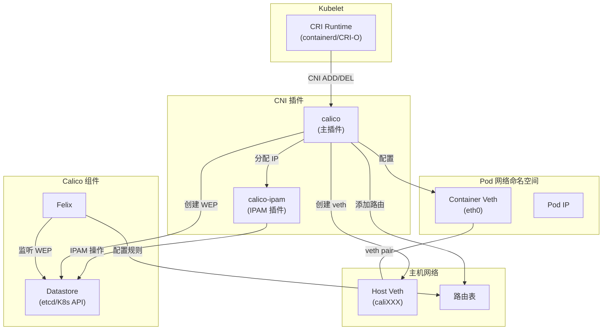
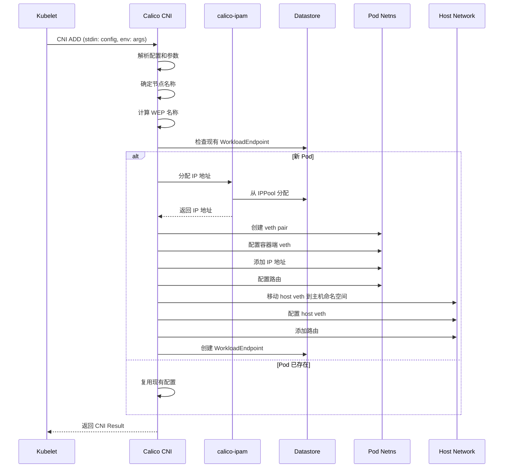
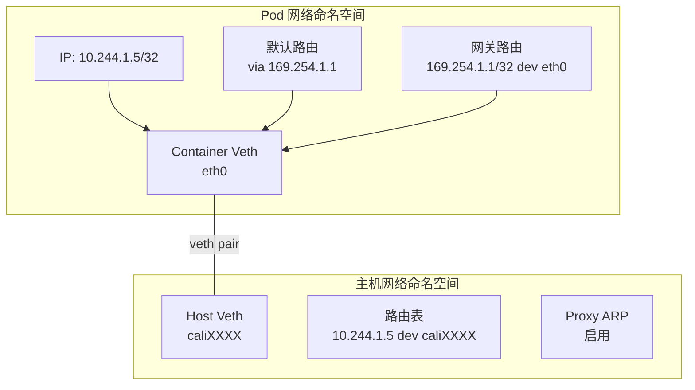
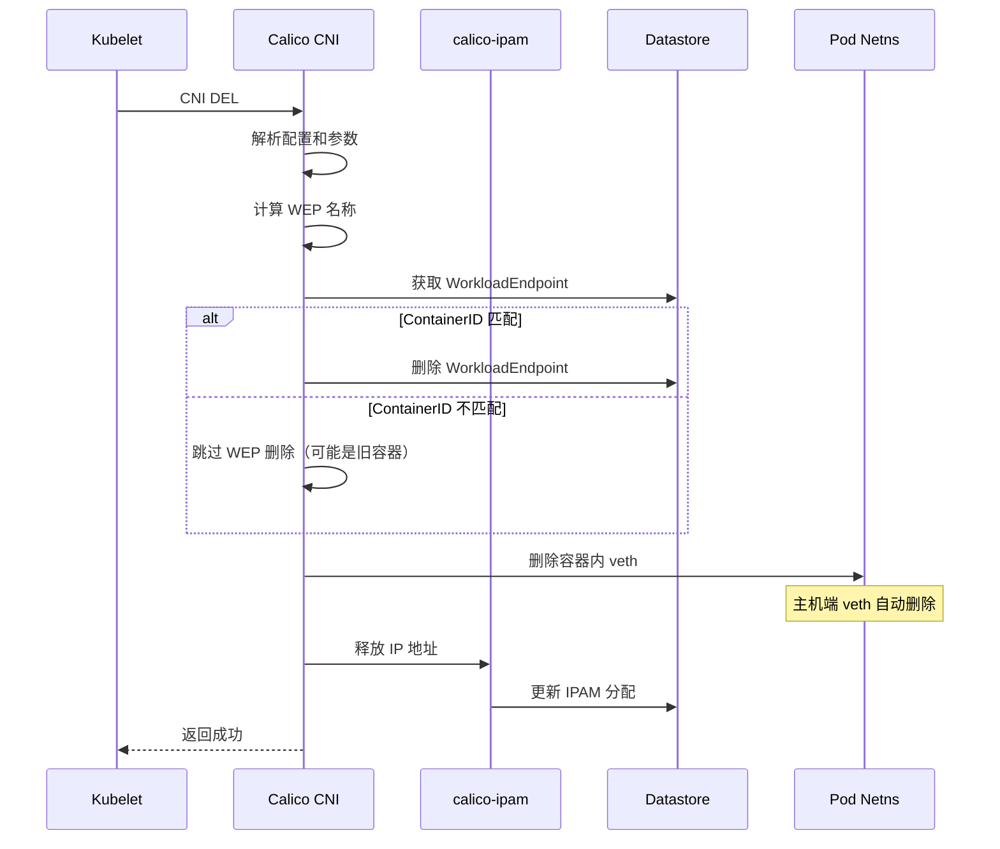

## 概述

Calico CNI 插件是 Kubernetes 与 Calico 网络之间的桥梁。当 kubelet 创建或删除 Pod 时，会调用 CNI 插件来配置 Pod 的网络。本章深入分析 Calico CNI 插件的完整工作流程，包括 ADD、DEL 操作的详细实现。

## 前置知识

- [CNI 规范详解](../02-kubernetes-networking/02-cni-specification.md)
- [K8s 网络模型](../02-kubernetes-networking/01-k8s-network-model.md)
- [veth/网桥/路由](../01-network-fundamentals/04-veth-bridge-routing.md)

## CNI 插件架构

### 整体架构



### 插件入口

```go
// 文件: cni-plugin/pkg/plugin/plugin.go:721-786

func Main(version string) {
    // 设置日志格式
    logutils.ConfigureFormatter("cni-plugin")

    // 解析命令行参数
    flagSet := flag.NewFlagSet("Calico", flag.ExitOnError)
    versionFlag := flagSet.Bool("v", false, "Display version")
    testConnectionFlag := flagSet.Bool("t", false, "Test datastore connection")

    // 注册 CNI 操作
    funcs := skel.CNIFuncs{
        Add:   cmdAdd,    // ADD 操作
        Del:   cmdDel,    // DEL 操作
        Check: cmdDummyCheck,  // CHECK 操作
    }

    skel.PluginMainFuncs(funcs,
        cniSpecVersion.PluginSupports("0.1.0", "0.2.0", "0.3.0", "0.3.1", "0.4.0", "1.0.0"),
        "Calico CNI plugin "+version)
}
```

## ADD 操作详解

### 完整流程

当 kubelet 创建 Pod 时，会调用 CNI ADD 操作：



### 核心代码分析

#### 1. cmdAdd 入口

```go
// 文件: cni-plugin/pkg/plugin/plugin.go:149-591

func cmdAdd(args *skel.CmdArgs) (err error) {
    // 恢复 panic
    defer func() {
        if e := recover(); e != nil {
            msg := fmt.Sprintf("Calico CNI panicked during ADD: %s", e)
            err = errors.New(msg)
        }
    }()

    // 1. 解析网络配置
    conf := types.NetConf{}
    if err := json.Unmarshal(args.StdinData, &conf); err != nil {
        return fmt.Errorf("failed to load netconf: %v", err)
    }

    // 2. 确定节点名称
    nodename := utils.DetermineNodename(conf)

    // 3. 提取工作负载标识符
    wepIDs, err := utils.GetIdentifiers(args, nodename)
    if err != nil {
        return
    }

    // 4. 创建 Calico 客户端
    calicoClient, err := utils.CreateClient(conf)
    if err != nil {
        return fmt.Errorf("error creating calico client: %v", err)
    }

    // 5. 检查现有端点
    endpoints, err := calicoClient.WorkloadEndpoints().List(ctx, options.ListOptions{
        Name:      wepPrefix,
        Namespace: wepIDs.Namespace,
        Prefix:    true,
    })

    // 6. 根据编排器类型处理
    if wepIDs.Orchestrator == api.OrchestratorKubernetes {
        result, err = k8s.CmdAddK8s(ctx, args, conf, *wepIDs, calicoClient, endpoint)
    } else {
        // 非 K8s 环境的处理
        // ...
    }

    return
}
```

#### 2. Kubernetes 专用处理

```go
// 文件: cni-plugin/pkg/k8s/k8s.go:56-573

func CmdAddK8s(ctx context.Context, args *skel.CmdArgs, conf types.NetConf,
    epIDs utils.WEPIdentifiers, calicoClient calicoclient.Interface,
    endpoint *libapi.WorkloadEndpoint) (*cniv1.Result, error) {

    // 1. 获取数据平面处理器
    d, err := dataplane.GetDataplane(conf, logger)
    if err != nil {
        return nil, err
    }

    // 2. 创建 K8s 客户端
    client, err := NewK8sClient(conf, logger)
    if err != nil {
        return nil, err
    }

    // 3. 获取 Pod 信息（标签、注解、端口等）
    labels, annot, ports, profiles, generateName, serviceAccount, err :=
        getK8sPodInfo(client, epIDs.Pod, epIDs.Namespace)

    // 4. 处理 IP 分配
    switch {
    case ipAddrs == "" && ipAddrsNoIpam == "":
        // 调用 IPAM 插件
        result, err = utils.AddIPAM(conf, args, logger)

    case ipAddrsNoIpam != "":
        // 绕过 IPAM，使用注解指定的 IP
        result, err = overrideIPAMResult(ipAddrsNoIpam, logger)

    case ipAddrs != "":
        // 使用 IPAM 分配指定的 IP
        result, err = ipAddrsResult(ipAddrs, conf, args, logger)
    }

    // 5. 配置端点
    if endpoint == nil {
        endpoint = libapi.NewWorkloadEndpoint()
    }
    endpoint.Name = epIDs.WEPName
    endpoint.Namespace = epIDs.Namespace
    endpoint.Labels = labels
    endpoint.Spec.Endpoint = epIDs.Endpoint
    endpoint.Spec.Node = epIDs.Node
    endpoint.Spec.Orchestrator = epIDs.Orchestrator
    endpoint.Spec.Pod = epIDs.Pod
    endpoint.Spec.Ports = ports
    endpoint.Spec.Profiles = profiles

    // 6. 填充 IP 网络信息
    utils.PopulateEndpointNets(endpoint, result)

    // 7. 执行网络配置（创建 veth、配置路由等）
    desiredVethName := k8sconversion.NewConverter().VethNameForWorkload(
        epIDs.Namespace, epIDs.Pod)
    hostVethName, contVethMac, err := d.DoNetworking(
        ctx, calicoClient, args, result, desiredVethName, routes, endpoint, annot)

    // 8. 更新端点信息
    endpoint.Spec.MAC = mac.String()
    endpoint.Spec.InterfaceName = hostVethName
    endpoint.Spec.ContainerID = epIDs.ContainerID

    // 9. 写入数据存储
    endpointOut, err := utils.CreateOrUpdate(ctxPatchCNI, calicoClient, endpoint)

    // 10. 等待 Felix 完成策略配置（可选）
    if conf.PolicySetupTimeoutSeconds > 0 {
        wait.ForEndpointReadyWithTimeout(conf.EndpointStatusDir, endpointOut, timeout)
    }

    return result, nil
}
```

### veth 创建详解



#### DoNetworking 实现

```go
// 文件: cni-plugin/pkg/dataplane/linux/dataplane_linux.go:65-109

func (d *LinuxDataplane) DoNetworking(
    ctx context.Context,
    calicoClient calicoclient.Interface,
    args *skel.CmdArgs,
    result *cniv1.Result,
    desiredVethName string,
    routes []*net.IPNet,
    endpoint *api.WorkloadEndpoint,
    annotations map[string]string,
) (hostVethName, contVethMAC string, err error) {
    hostVethName = desiredVethName

    // 创建 netlink handle
    hostNlHandle, err := netlink.NewHandle(syscall.NETLINK_ROUTE)
    defer hostNlHandle.Close()

    // 在容器命名空间中设置网络
    contVethMAC, err = d.DoWorkloadNetnsSetUp(
        hostNlHandle,
        args.Netns,
        result.IPs,
        args.IfName,
        hostVethName,
        routes,
        annotations,
    )

    // 获取主机端 veth
    hostVeth, err := hostNlHandle.LinkByName(hostVethName)

    // 在主机端添加路由
    err = SetupRoutes(hostNlHandle, hostVeth, result)

    return hostVethName, contVethMAC, err
}
```

#### veth pair 创建

```go
// 文件: cni-plugin/pkg/dataplane/linux/dataplane_linux.go:115-403

func (d *LinuxDataplane) DoWorkloadNetnsSetUp(
    hostNlHandle *netlink.Handle,
    netnsPath string,
    ipAddrs []*cniv1.IPConfig,
    contVethName string,
    hostVethName string,
    routes []*net.IPNet,
    annotations map[string]string,
) (contVethMAC string, err error) {
    // 清理已存在的 hostVeth
    if oldHostVeth, err := hostNlHandle.LinkByName(hostVethName); err == nil {
        hostNlHandle.LinkDel(oldHostVeth)
    }

    // 进入容器网络命名空间
    err = ns.WithNetNSPath(netnsPath, func(hostNS ns.NetNS) error {
        // 1. 创建 veth pair
        la := netlink.NewLinkAttrs()
        la.Name = contVethName
        la.MTU = d.mtu
        la.NumTxQueues = d.queues
        la.NumRxQueues = d.queues

        veth := &netlink.Veth{
            LinkAttrs:     la,
            PeerName:      hostVethName,
            PeerNamespace: netlink.NsFd(int(hostNS.Fd())),  // 主机命名空间
        }

        if err := netlink.LinkAdd(veth); err != nil {
            return err
        }

        // 2. 设置主机端 MAC 地址
        hostVeth, _ := hostNlHandle.LinkByName(hostVethName)
        hostNlHandle.LinkSetHardwareAddr(hostVeth, hostSideMAC)

        // 3. 判断 IPv4/IPv6
        var hasIPv4, hasIPv6 bool
        for _, addr := range ipAddrs {
            if addr.Address.IP.To4() != nil {
                hasIPv4 = true
                addr.Address.Mask = net.CIDRMask(32, 32)  // /32 掩码
            } else if addr.Address.IP.To16() != nil {
                hasIPv6 = true
                addr.Address.Mask = net.CIDRMask(128, 128)
            }
        }

        // 4. 禁用 IPv6 DAD
        if hasIPv6 {
            disableDAD(contVethName)
        }

        // 5. 配置主机端 sysctls
        hostNS.Do(func(_ ns.NetNS) error {
            return d.configureSysctls(hostVethName, hasIPv4, hasIPv6)
        })

        // 6. 启用 veth 接口
        hostNlHandle.LinkSetUp(hostVeth)
        contVeth, _ := netlink.LinkByName(contVethName)
        netlink.LinkSetUp(contVeth)

        // 7. 获取容器端 MAC
        contVethMAC = contVeth.Attrs().HardwareAddr.String()

        // 8. 配置 IPv4 路由
        if hasIPv4 {
            // 添加连接路由到虚拟网关
            gw := net.IPv4(169, 254, 1, 1)
            gwNet := &net.IPNet{IP: gw, Mask: net.CIDRMask(32, 32)}
            netlink.RouteAdd(&netlink.Route{
                LinkIndex: contVeth.Attrs().Index,
                Scope:     netlink.SCOPE_LINK,
                Dst:       gwNet,
            })

            // 添加默认路由
            for _, r := range routes {
                if r.IP.To4() != nil {
                    ip.AddRoute(r, gw, contVeth)
                }
            }
        }

        // 9. 配置 IPv6 路由
        if hasIPv6 {
            // 启用 IPv6
            writeProcSys("/proc/sys/net/ipv6/conf/all/disable_ipv6", "0")

            // 获取主机端 link-local 地址作为网关
            addresses, _ := hostNlHandle.AddrList(hostVeth, netlink.FAMILY_V6)
            hostIPv6Addr := addresses[0].IP

            for _, r := range routes {
                if r.IP.To4() == nil {
                    ip.AddRoute(r, hostIPv6Addr, contVeth)
                }
            }
        }

        // 10. 添加 IP 地址到容器 veth
        for _, addr := range ipAddrs {
            netlink.AddrAdd(contVeth, &netlink.Addr{IPNet: &addr.Address})
        }

        // 11. 配置容器 sysctls
        d.configureContainerSysctls(hasIPv4, hasIPv6)

        return nil
    })

    return contVethMAC, err
}
```

### 主机端路由配置

```go
// 文件: cni-plugin/pkg/dataplane/linux/dataplane_linux.go:415-483

func SetupRoutes(hostNlHandle *netlink.Handle, hostVeth netlink.Link,
    result *cniv1.Result) error {

    // 为每个 IP 添加路由
    for _, ipAddr := range result.IPs {
        route := netlink.Route{
            LinkIndex: hostVeth.Attrs().Index,
            Scope:     netlink.SCOPE_LINK,
            Dst:       &ipAddr.Address,
        }
        err := hostNlHandle.RouteAdd(&route)

        if err != nil {
            switch err {
            case syscall.EEXIST:
                // 路由已存在，检查是否指向正确的接口
                routes, _ := hostNlHandle.RouteList(hostVeth, netlink.FAMILY_ALL)
                for _, r := range routes {
                    if r.LinkIndex == route.LinkIndex &&
                       r.Dst.IP.Equal(route.Dst.IP) &&
                       r.Scope == route.Scope {
                        // 路由已正确配置
                        return nil
                    }
                }
                return fmt.Errorf("route already exists for different interface")
            default:
                return fmt.Errorf("failed to add route: %v", err)
            }
        }
    }
    return nil
}
```

### sysctl 配置

CNI 插件配置多个重要的 sysctl 参数：

```go
// 文件: cni-plugin/pkg/dataplane/linux/dataplane_linux.go:486-552

func (d *LinuxDataplane) configureSysctls(hostVethName string,
    hasIPv4, hasIPv6 bool) error {

    if hasIPv4 {
        // 启用 route_localnet：允许 NAT 到本地主机
        writeProcSys(fmt.Sprintf(
            "/proc/sys/net/ipv4/conf/%s/route_localnet", hostVethName), "1")

        // 禁用 proxy_delay：Calico 网络不需要延迟
        writeProcSys(fmt.Sprintf(
            "/proc/sys/net/ipv4/neigh/%s/proxy_delay", hostVethName), "0")

        // 启用 proxy_arp：主机响应所有 ARP 请求
        // 这样容器使用虚拟网关 169.254.1.1 时，主机会响应
        writeProcSys(fmt.Sprintf(
            "/proc/sys/net/ipv4/conf/%s/proxy_arp", hostVethName), "1")

        // 启用 IP 转发
        writeProcSys(fmt.Sprintf(
            "/proc/sys/net/ipv4/conf/%s/forwarding", hostVethName), "1")
    }

    if hasIPv6 {
        // 禁用 DAD（重复地址检测）
        writeProcSys(fmt.Sprintf(
            "/proc/sys/net/ipv6/conf/%s/accept_dad", hostVethName), "0")

        // 启用 IPv6
        writeProcSys(fmt.Sprintf(
            "/proc/sys/net/ipv6/conf/%s/disable_ipv6", hostVethName), "0")

        // 启用 proxy_ndp：类似 proxy_arp
        writeProcSys(fmt.Sprintf(
            "/proc/sys/net/ipv6/conf/%s/proxy_ndp", hostVethName), "1")

        // 启用 IPv6 转发
        writeProcSys(fmt.Sprintf(
            "/proc/sys/net/ipv6/conf/%s/forwarding", hostVethName), "1")
    }

    return nil
}
```

## DEL 操作详解

### 流程图



### 核心代码

```go
// 文件: cni-plugin/pkg/plugin/plugin.go:593-714

func cmdDel(args *skel.CmdArgs) (err error) {
    // 解析配置
    conf := types.NetConf{}
    json.Unmarshal(args.StdinData, &conf)

    // 确定节点名称
    nodename := utils.DetermineNodename(conf)

    // 获取端点标识符
    epIDs, err := utils.GetIdentifiers(args, nodename)

    // 创建客户端
    calicoClient, err := utils.CreateClient(conf)

    // 计算 WEP 名称
    epIDs.WEPName, err = epIDs.CalculateWorkloadEndpointName(false)

    // K8s 特定处理
    if epIDs.Orchestrator == api.OrchestratorKubernetes {
        return k8s.CmdDelK8s(ctx, calicoClient, *epIDs, args, conf, logger)
    }

    // 非 K8s 处理
    // 1. 释放 IP
    ipamErr := utils.DeleteIPAM(conf, args, logger)

    // 2. 删除 WorkloadEndpoint
    calicoClient.WorkloadEndpoints().Delete(ctx,
        epIDs.Namespace, epIDs.WEPName, options.DeleteOptions{})

    // 3. 清理网络命名空间
    d, _ := dataplane.GetDataplane(conf, logger)
    d.CleanUpNamespace(args)

    return ipamErr
}
```

### K8s DEL 处理

```go
// 文件: cni-plugin/pkg/k8s/k8s.go:575-667

func CmdDelK8s(ctx context.Context, c calicoclient.Interface,
    epIDs utils.WEPIdentifiers, args *skel.CmdArgs,
    conf types.NetConf, logger *logrus.Entry) error {

    d, _ := dataplane.GetDataplane(conf, logger)

    // 重试循环，处理并发修改
    for attempts := 5; attempts >= 0; attempts-- {
        wep, err := c.WorkloadEndpoints().Get(ctx,
            epIDs.Namespace, epIDs.WEPName, options.GetOptions{})

        if err != nil {
            if _, ok := err.(cerrors.ErrorResourceDoesNotExist); ok {
                // WEP 不存在，继续清理
                break
            }
            return err
        }

        // 检查 ContainerID 是否匹配
        if wep.Spec.ContainerID != "" &&
           args.ContainerID != wep.Spec.ContainerID {
            // ContainerID 不匹配，这是旧容器的 DEL 调用
            // 不删除 WEP，但仍需清理 IPAM
            logger.Warning("CNI_CONTAINERID does not match, skip WEP delete")
            break
        }

        // 删除 WEP
        _, err = c.WorkloadEndpoints().Delete(ctx,
            wep.Namespace, wep.Name,
            options.DeleteOptions{
                ResourceVersion: wep.ResourceVersion,
                UID:             &wep.UID,
            })

        if err != nil {
            switch err.(type) {
            case cerrors.ErrorResourceDoesNotExist:
                // 已被删除
            case cerrors.ErrorResourceUpdateConflict:
                // 并发修改，重试
                continue
            default:
                return err
            }
        }
        break
    }

    // 清理网络命名空间
    d.CleanUpNamespace(args)

    // 释放 IP 地址
    utils.DeleteIPAM(conf, args, logger)

    return nil
}
```

## WorkloadEndpoint 资源

### 结构定义

WorkloadEndpoint（WEP）是 Calico 的核心资源，表示一个工作负载的网络端点：

```yaml
apiVersion: projectcalico.org/v3
kind: WorkloadEndpoint
metadata:
  name: node1-k8s-nginx--abc123-eth0
  namespace: default
  labels:
    app: nginx
    projectcalico.org/namespace: default
    projectcalico.org/orchestrator: k8s
    projectcalico.org/serviceaccount: default
spec:
  node: node1
  orchestrator: k8s
  pod: nginx-abc123
  endpoint: eth0
  containerID: abc123def456
  interfaceName: cali12345678901
  mac: "ee:ee:ee:ee:ee:ee"
  ipNetworks:
    - 10.244.1.5/32
  profiles:
    - kns.default
    - ksa.default.default
  ports:
    - name: http
      port: 80
      protocol: TCP
```

### WEP 名称计算

```go
// WEP 名称格式: <node>-k8s-<namespace>-<pod>-<endpoint>
// 例如: node1-k8s-default-nginx--abc123-eth0

func (w *WEPIdentifiers) CalculateWorkloadEndpointName(prefix bool) (string, error) {
    // 使用标识符构建名称
    // 处理特殊字符（如连字符变为双连字符）
    // ...
}
```

## CNI 配置

### 配置文件示例

```json
{
  "name": "k8s-pod-network",
  "cniVersion": "0.3.1",
  "plugins": [
    {
      "type": "calico",
      "datastore_type": "kubernetes",
      "mtu": 1440,
      "nodename_file_optional": false,
      "log_level": "Info",
      "log_file_path": "/var/log/calico/cni/cni.log",
      "ipam": {
        "type": "calico-ipam",
        "assign_ipv4": "true",
        "assign_ipv6": "false"
      },
      "container_settings": {
        "allow_ip_forwarding": false
      },
      "policy": {
        "type": "k8s"
      },
      "kubernetes": {
        "kubeconfig": "/etc/cni/net.d/calico-kubeconfig"
      }
    },
    {
      "type": "portmap",
      "snat": true,
      "capabilities": {"portMappings": true}
    },
    {
      "type": "bandwidth",
      "capabilities": {"bandwidth": true}
    }
  ]
}
```

### 关键配置项

| 配置项 | 说明 |
|--------|------|
| `datastore_type` | 数据存储类型：`kubernetes` 或 `etcdv3` |
| `mtu` | 接口 MTU 值 |
| `ipam.type` | IPAM 插件类型：`calico-ipam` 或 `host-local` |
| `policy.type` | 策略类型：`k8s` 表示使用 K8s NetworkPolicy |
| `container_settings.allow_ip_forwarding` | 是否允许容器内 IP 转发 |

## 注解支持

Calico CNI 支持多个 Pod 注解：

| 注解 | 说明 |
|------|------|
| `cni.projectcalico.org/ipv4pools` | 指定 IPv4 IP Pool |
| `cni.projectcalico.org/ipv6pools` | 指定 IPv6 IP Pool |
| `cni.projectcalico.org/ipAddrs` | 指定固定 IP（通过 IPAM） |
| `cni.projectcalico.org/ipAddrsNoIpam` | 指定固定 IP（绕过 IPAM） |
| `cni.projectcalico.org/floatingIPs` | 配置浮动 IP（DNAT） |
| `cni.projectcalico.org/hwAddr` | 指定容器 MAC 地址 |

## 调试技巧

### 1. 查看 CNI 日志

```bash
# 查看 CNI 插件日志
cat /var/log/calico/cni/cni.log

# 实时监控
tail -f /var/log/calico/cni/cni.log
```

### 2. 检查 WorkloadEndpoint

```bash
# 列出所有 WEP
calicoctl get workloadendpoints -A

# 查看特定 WEP 详情
calicoctl get workloadendpoint <wep-name> -n <namespace> -o yaml
```

### 3. 检查网络配置

```bash
# 进入 Pod 网络命名空间
POD_ID=$(crictl pods --name <pod-name> -q)
NETNS=$(crictl inspectp $POD_ID | jq -r '.info.runtimeSpec.linux.namespaces[] | select(.type=="network") | .path')
nsenter --net=$NETNS ip addr
nsenter --net=$NETNS ip route
```

### 4. 检查主机端配置

```bash
# 查看 veth 接口
ip link show type veth | grep cali

# 查看路由
ip route | grep cali

# 查看 sysctl 设置
sysctl -a | grep cali
```

## 实验：手动模拟 CNI 操作

### 准备工作

```bash
# 创建测试网络命名空间
ip netns add test-ns

# 获取 CNI 配置
cat /etc/cni/net.d/10-calico.conflist
```

### 模拟 ADD 操作

```bash
# 设置环境变量
export CNI_COMMAND=ADD
export CNI_CONTAINERID=test-container-123
export CNI_NETNS=/var/run/netns/test-ns
export CNI_IFNAME=eth0
export CNI_PATH=/opt/cni/bin

# 准备配置
CONFIG=$(cat /etc/cni/net.d/10-calico.conflist | jq '.plugins[0]')

# 调用 CNI 插件
echo $CONFIG | /opt/cni/bin/calico
```

### 验证结果

```bash
# 检查容器命名空间
ip netns exec test-ns ip addr
ip netns exec test-ns ip route

# 检查主机端
ip link show type veth
ip route | grep test

# 检查 WorkloadEndpoint
calicoctl get wep -A | grep test
```

### 模拟 DEL 操作

```bash
export CNI_COMMAND=DEL

echo $CONFIG | /opt/cni/bin/calico

# 验证清理
ip netns exec test-ns ip addr  # 应该失败
ip link show type veth | grep test  # 应该没有
```

### 清理

```bash
ip netns delete test-ns
unset CNI_COMMAND CNI_CONTAINERID CNI_NETNS CNI_IFNAME CNI_PATH
```

## 总结

Calico CNI 插件是 Pod 网络配置的核心组件：

1. **ADD 操作**：分配 IP、创建 veth pair、配置路由、创建 WorkloadEndpoint
2. **DEL 操作**：删除 WorkloadEndpoint、清理网络命名空间、释放 IP
3. **veth pair**：连接 Pod 网络命名空间和主机网络
4. **路由配置**：使用 link-local 地址作为网关，启用 proxy ARP
5. **WorkloadEndpoint**：Calico 的核心资源，存储端点信息

理解 CNI 插件的工作流程对于排查 Pod 网络问题至关重要。

## 参考资料

- [CNI 规范](https://github.com/containernetworking/cni/blob/master/SPEC.md)
- [Calico CNI 插件配置](https://docs.projectcalico.org/reference/cni-plugin/configuration)
- [Calico 源码 - cni-plugin/](https://github.com/projectcalico/calico/tree/master/cni-plugin)
