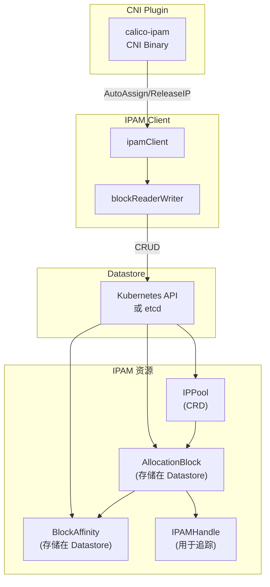
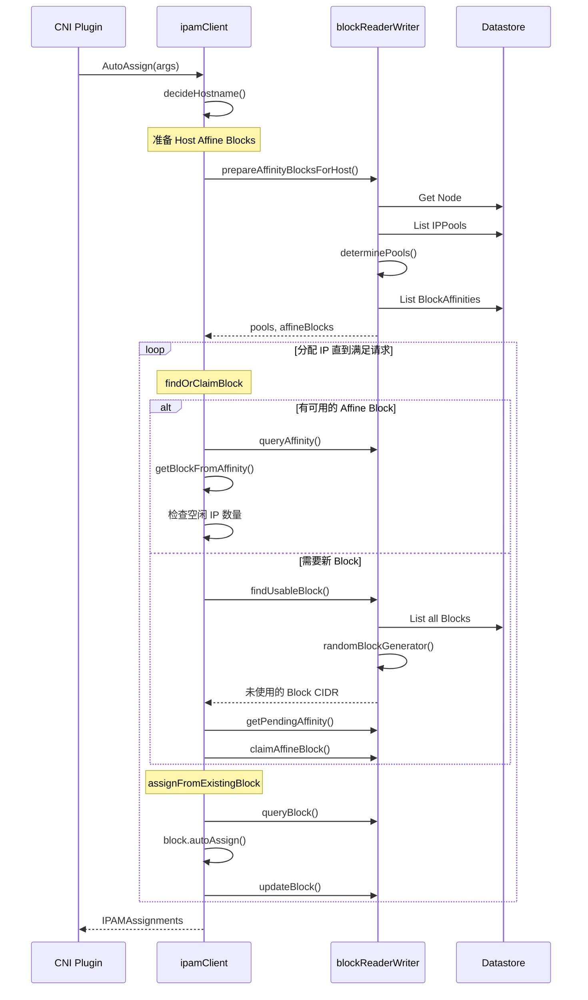
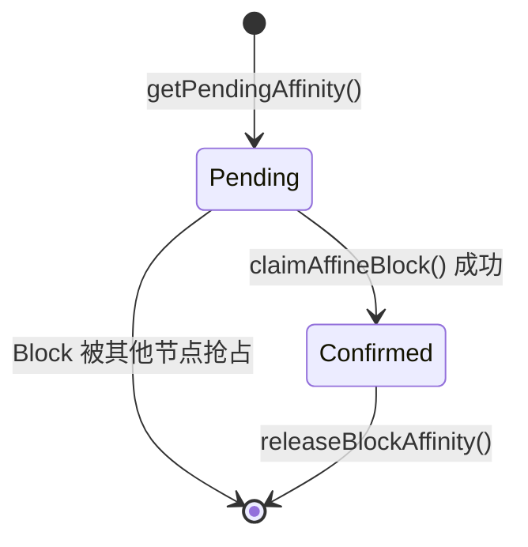

## 概述

Calico IPAM (IP Address Management) 是一个分布式 IP 地址管理系统，负责为 Pod 分配和回收 IP 地址。与传统的中心化 IPAM 不同，Calico IPAM 采用分层设计（IP Pool → Block → IP），通过 Block 亲和性机制减少分配冲突，提供高效的 IP 地址管理能力。

本文将深入分析 Calico IPAM 的核心概念、数据结构、分配算法和实现细节。

## 前置知识

- [CNI 规范](../02-kubernetes-networking/02-cni-specification.md)
- [CNI 插件工作流](01-cni-plugin-workflow.md)
- Kubernetes Pod 生命周期
- 基本的 IP 地址/CIDR 概念

## 核心概念

### IP Pool

IP Pool 是 Calico 中最大的 IP 地址分配单元，定义了可用于 Pod 的 IP 地址范围：

```yaml
apiVersion: projectcalico.org/v3
kind: IPPool
metadata:
  name: default-ipv4-ippool
spec:
  cidr: 10.244.0.0/16
  blockSize: 26              # 每个 Block 的大小（/26 = 64 个 IP）
  ipipMode: Never
  vxlanMode: Never
  natOutgoing: true
  nodeSelector: all()        # 节点选择器
  namespaceSelector: ""      # 命名空间选择器
  allowedUses:
    - Workload               # 允许的使用场景
    - Tunnel
```

### Block（CIDR 块）

Block 是 IP Pool 的子网段，是 IPAM 分配的基本单位：

```
IP Pool: 10.244.0.0/16 (65536 个 IP)
        ├── Block: 10.244.0.0/26 (64 个 IP) → Node-1 affine
        ├── Block: 10.244.0.64/26 (64 个 IP) → Node-1 affine
        ├── Block: 10.244.0.128/26 (64 个 IP) → Node-2 affine
        └── ...
```

### Block 亲和性 (Affinity)

每个 Block 会与一个节点建立亲和关系，确保同一节点上的 Pod 优先从本地 Block 分配 IP：

```go
// libcalico-go/lib/backend/model/block.go:118-120
type AllocationBlock struct {
    CIDR net.IPNet `json:"cidr"`
    // Affinity 格式: "host:<hostname>" 或 "virtual:<name>"
    Affinity *string `json:"affinity"`
    AffinityClaimTime *metav1.Time `json:"affinity_claim_time,omitempty"`
    // ...
}
```

## 整体架构



## 数据结构详解

### AllocationBlock 结构

Block 是 IPAM 的核心数据结构，存储了 IP 分配状态：

```go
// libcalico-go/lib/backend/model/block.go:114-159
type AllocationBlock struct {
    // Block 的 CIDR
    CIDR net.IPNet `json:"cidr"`

    // Block 亲和性，格式: "host:<hostname>"
    Affinity *string `json:"affinity"`

    // 亲和性声明时间
    AffinityClaimTime *metav1.Time `json:"affinity_claim_time,omitempty"`

    // 分配数组：索引是 IP 的序号，值是 Attributes 数组的索引
    // nil 表示未分配
    Allocations []*int `json:"allocations"`

    // 未分配的 IP 序号列表
    Unallocated []int `json:"unallocated"`

    // 分配属性数组
    Attributes []AllocationAttribute `json:"attributes"`

    // 用于并发控制的序列号
    SequenceNumber uint64 `json:"sequenceNumber"`

    // 每个分配的序列号映射
    SequenceNumberForAllocation map[string]uint64
}
```

### IP 到序号的映射

Block 使用序号 (ordinal) 来标识 IP 地址的位置：

```go
// libcalico-go/lib/backend/model/block.go:241-259
func (b *AllocationBlock) OrdinalToIP(ordinal int) net.IP {
    ip := b.CIDR.IP
    var intIP *big.Int
    if ip.To4() != nil {
        intIP = big.NewInt(0).SetBytes(ip.To4())
    } else {
        intIP = big.NewInt(0).SetBytes(ip.To16())
    }
    intIP.Add(intIP, big.NewInt(int64(ordinal)))
    // ...
}

func (b *AllocationBlock) IPToOrdinal(ip net.IP) (int, error) {
    // IP 地址减去 Block 起始地址得到序号
}
```

### Block 初始化

```go
// libcalico-go/lib/ipam/ipam_block.go:43-91
func newBlock(cidr cnet.IPNet, rsvdAttr *HostReservedAttr) allocationBlock {
    ones, size := cidr.Mask.Size()
    numAddresses := 1 << uint(size-ones)  // 计算地址数量

    b := model.AllocationBlock{}
    b.Allocations = make([]*int, numAddresses)
    b.Unallocated = make([]int, numAddresses)
    b.CIDR = cidr

    // 初始化序列号（使用时间戳防止重复）
    b.SequenceNumber = uint64(time.Now().UnixNano())

    // 初始化未分配列表
    for i := 0; i < numAddresses; i++ {
        b.Unallocated[i] = i
    }

    // Windows 环境下预留特殊 IP
    if rsvdAttr != nil {
        // 预留 x.0, x.1, x.2 和广播地址
    }

    return allocationBlock{&b}
}
```

## IP 分配流程

### AutoAssign 主流程



### AutoAssign 入口函数

```go
// libcalico-go/lib/ipam/ipam.go:100-147
func (c ipamClient) AutoAssign(ctx context.Context, args AutoAssignArgs) (*IPAMAssignments, *IPAMAssignments, error) {
    // 确定主机名
    hostname, err := decideHostname(args.Hostname)
    if err != nil {
        return nil, nil, err
    }
    log.Infof("Auto-assign %d ipv4, %d ipv6 addrs for host '%s'", args.Num4, args.Num6, hostname)

    var v4ia, v6ia *IPAMAssignments

    // 分配 IPv4 地址
    if args.Num4 != 0 {
        v4ia, err = c.autoAssign(ctx, args.Num4, args.HandleID, args.Attrs,
            args.IPv4Pools, 4, hostname, args.MaxBlocksPerHost,
            args.HostReservedAttrIPv4s, args.IntendedUse, args.Namespace)
        if err != nil {
            return v4ia, nil, err
        }
    }

    // 分配 IPv6 地址
    if args.Num6 != 0 {
        v6ia, err = c.autoAssign(ctx, args.Num6, args.HandleID, args.Attrs,
            args.IPv6Pools, 6, hostname, args.MaxBlocksPerHost,
            args.HostReservedAttrIPv6s, args.IntendedUse, args.Namespace)
        if err != nil {
            return v4ia, v6ia, err
        }
    }

    return v4ia, v6ia, nil
}
```

### 内部 autoAssign 函数

```go
// libcalico-go/lib/ipam/ipam.go:682-800
func (c ipamClient) autoAssign(ctx context.Context, num int, handleID *string,
    attrs map[string]string, requestedPools []net.IPNet, version int,
    host string, maxNumBlocks int, rsvdAttr *HostReservedAttr,
    use v3.IPPoolAllowedUse, namespace *corev1.Namespace) (*IPAMAssignments, error) {

    // 1. 加载保留的 IP
    reservations, err := c.getReservedIPs(ctx)

    // 2. 获取节点的 Affine Blocks
    pools, affBlocks, err := c.prepareAffinityBlocksForHost(ctx, requestedPools,
        version, host, rsvdAttr, use, namespace)

    // 3. 计算 Block 限制
    if maxNumBlocks == 0 {
        maxNumBlocks = 20  // 默认最大 20 个 Block
    }

    // 4. 初始化分配状态
    s := &blockAssignState{
        client:                c,
        version:               version,
        affinityCfg:           affinityCfg,
        pools:                 pools,
        remainingAffineBlocks: affBlocks,
        hostReservedAttr:      rsvdAttr,
        allowNewClaim:         true,
        reservations:          reservations,
    }

    // 5. 循环分配直到满足请求
    for len(ia.IPs) < num {
        // 检查是否允许申请新 Block
        if maxNumBlocks > 0 && numBlocksOwned >= maxNumBlocks {
            s.allowNewClaim = false
        }

        // 查找或申请 Block
        b, newlyClaimed, err := s.findOrClaimBlock(ctx, 1)
        if err != nil {
            // 处理错误
        }

        // 从 Block 中分配 IP
        newIPs, err := c.assignFromExistingBlock(ctx, b, rem, handleID,
            attrs, affinityCfg, config.StrictAffinity, reservations)
        ia.IPs = append(ia.IPs, newIPs...)
    }

    return ia, nil
}
```

### Block 内的 IP 分配

```go
// libcalico-go/lib/ipam/ipam_block.go:93-145
func (b *allocationBlock) autoAssign(num int, handleID *string,
    affinityCfg AffinityConfig, attrs map[string]string,
    affinityCheck bool, reservations addrFilter) ([]cnet.IPNet, error) {

    // 1. 检查 Block 亲和性
    if affinityCheck && b.Affinity != nil && !affinityMatches(affinityCfg, b.AllocationBlock) {
        return nil, errors.New("Block affinity does not match")
    }

    // 2. 遍历未分配列表分配 IP
    _, mask, _ := cnet.ParseCIDR(b.CIDR.String())
    var ips []cnet.IPNet
    updatedUnallocated := b.Unallocated[:0]
    var attrIndexPtr *int

    for idx, ordinal := range b.Unallocated {
        // 检查是否已分配足够
        if len(ips) >= num {
            updatedUnallocated = append(updatedUnallocated, b.Unallocated[idx:]...)
            break
        }

        // 检查 IP 是否被保留
        addr := b.OrdinalToIP(ordinal)
        if reservations.MatchesIP(addr) {
            updatedUnallocated = append(updatedUnallocated, ordinal)
            continue
        }

        // 分配 IP
        if attrIndexPtr == nil {
            attrIndex := b.findOrAddAttribute(handleID, attrs)
            attrIndexPtr = &attrIndex
        }
        b.Allocations[ordinal] = attrIndexPtr

        ipNet := *mask
        ipNet.IP = addr.IP
        ips = append(ips, ipNet)

        // 设置分配序列号
        b.SetSequenceNumberForOrdinal(ordinal)
    }

    b.Unallocated = updatedUnallocated
    return ips, nil
}
```

## Block 查找与申请

### findOrClaimBlock

```go
// libcalico-go/lib/ipam/ipam.go:510-641
func (s *blockAssignState) findOrClaimBlock(ctx context.Context, minFreeIps int) (*model.KVPair, bool, error) {
    // 1. 首先尝试使用现有的 Affine Blocks
    for len(s.remainingAffineBlocks) > 0 {
        cidr := s.remainingAffineBlocks[0]
        s.remainingAffineBlocks = s.remainingAffineBlocks[1:]

        // 跳过完全被保留的 Block
        if s.reservations.MatchesWholeCIDR(&cidr) {
            continue
        }

        // 获取 Block 并检查空闲 IP 数量
        aff, err := s.client.blockReaderWriter.queryAffinity(ctx, s.affinityCfg, cidr, "")
        b, err := s.client.getBlockFromAffinity(ctx, aff, s.hostReservedAttr, s.affinityCfg)

        block := allocationBlock{b.Value.(*model.AllocationBlock)}
        if block.NumFreeAddresses(s.reservations) >= minFreeIps {
            return b, false, nil
        }
    }

    // 2. 没有可用的 Affine Block，检查是否允许申请新 Block
    if !s.allowNewClaim {
        return nil, false, ErrBlockLimit
    }

    // 3. 查找可用的未分配 Block
    config, _ := s.client.GetIPAMConfig(ctx)
    if config.AutoAllocateBlocks {
        subnet, err := s.client.blockReaderWriter.findUsableBlock(ctx,
            s.affinityCfg, s.version, s.pools, s.reservations, *config)

        // 4. 申请 Block 亲和性
        pa, err := s.client.blockReaderWriter.getPendingAffinity(ctx, s.affinityCfg, *subnet)

        // 5. 获取并确认 Block
        b, err := s.client.getBlockFromAffinity(ctx, pa, s.hostReservedAttr, s.affinityCfg)
        return b, true, nil
    }

    return nil, false, errors.New("failed to find or claim a block")
}
```

### findUsableBlock - 随机 Block 选择

```go
// libcalico-go/lib/ipam/ipam_block_reader_writer.go:118-247
func (rw blockReaderWriter) findUsableBlock(ctx context.Context,
    affinityCfg AffinityConfig, version int, pools []v3.IPPool,
    reservations addrFilter, config IPAMConfig) (*cnet.IPNet, error) {

    // 1. 预先列出所有已存在的 Block
    existingBlocks, err := rw.listBlocks(ctx, "")

    // 2. 构建已存在 Block 的映射
    exists := map[string]blockInfo{}
    for _, e := range existingBlocks.KVPairs {
        // 记录 Block 信息
    }

    // 3. 遍历所有 Pool，使用随机 Block 生成器
    var emptyBlocks []blockInfo
    for _, pool := range pools {
        blocks := randomBlockGenerator(pool, affinityCfg.Host)
        for subnet := blocks(); subnet != nil; subnet = blocks() {
            // 检查 Block 是否被保留
            if reservations.MatchesWholeCIDR(subnet) {
                continue
            }

            // 检查 Block 是否已存在
            if info, ok := exists[subnet.String()]; !ok {
                // 找到空闲 Block
                return subnet, nil
            } else if info.affinityCfg == affinityCfg && info.numFree != 0 {
                // 属于当前节点且有空闲
                return subnet, nil
            } else if info.empty && info.numFree != 0 {
                // 空的 Block，可能可以回收
                emptyBlocks = append(emptyBlocks, info)
            }
        }
    }

    // 4. 尝试回收空的 Block
    if len(emptyBlocks) > 0 {
        for _, block := range emptyBlocks {
            age := time.Since(block.claimTime)
            if age < EmptyBlockMinReclaimAge {
                continue  // 避免抢占刚分配的 Block
            }

            err := rw.releaseBlockAffinity(ctx, block.affinityCfg, block.cidr,
                releaseAffinityOpts{RequireEmpty: true})
            if err == nil {
                return &block.cidr, nil
            }
        }
    }

    return nil, noFreeBlocksError("No Free Blocks")
}
```

### 随机 Block 生成器

为了避免多个节点同时申请同一个 Block，Calico 使用基于主机名的随机起始位置：

```go
// libcalico-go/lib/ipam/ipam_block_reader_writer.go
func randomBlockGenerator(pool v3.IPPool, hostName string) func() *cnet.IPNet {
    // 计算 Pool 中的 Block 数量
    _, poolNet, _ := cnet.ParseCIDR(pool.Spec.CIDR)
    poolSize, _ := poolNet.Mask.Size()
    numBlocks := 1 << uint(pool.Spec.BlockSize - poolSize)

    // 使用主机名生成随机起始位置
    h := fnv.New64a()
    h.Write([]byte(hostName))
    start := int(h.Sum64() % uint64(numBlocks))

    // 返回迭代器函数
    current := start
    first := true
    return func() *cnet.IPNet {
        if !first && current == start {
            return nil  // 已遍历完所有 Block
        }
        first = false

        // 计算当前 Block 的 CIDR
        subnet := calculateBlockCIDR(poolNet, pool.Spec.BlockSize, current)

        // 移动到下一个 Block
        current = (current + 1) % numBlocks

        return subnet
    }
}
```

## Block 亲和性管理

### 亲和性状态机



### 申请 Pending 亲和性

```go
// libcalico-go/lib/ipam/ipam_block_reader_writer.go:249-285
func (rw blockReaderWriter) getPendingAffinity(ctx context.Context,
    affinityCfg AffinityConfig, subnet cnet.IPNet) (*model.KVPair, error) {

    // 创建 Pending 状态的亲和性
    obj := model.KVPair{
        Key:   model.BlockAffinityKey{Host: affinityCfg.Host, CIDR: subnet},
        Value: &model.BlockAffinity{State: model.StatePending},
    }

    aff, err := rw.client.Create(ctx, &obj)
    if err != nil {
        if _, ok := err.(cerrors.ErrorResourceAlreadyExists); ok {
            // 亲和性已存在，获取并返回
            aff, err = rw.queryAffinity(ctx, affinityCfg, subnet, "")
            if aff.Value.(*model.BlockAffinity).State != model.StateConfirmed {
                aff.Value.(*model.BlockAffinity).State = model.StatePending
                return rw.updateAffinity(ctx, aff)
            }
            return aff, nil
        }
        return nil, err
    }

    return aff, nil
}
```

### 确认 Block 亲和性

```go
// libcalico-go/lib/ipam/ipam_block_reader_writer.go:287-350
func (rw blockReaderWriter) claimAffineBlock(ctx context.Context,
    aff *model.KVPair, config IPAMConfig, rsvdAttr *HostReservedAttr,
    affinityCfg AffinityConfig) (*model.KVPair, error) {

    subnet := aff.Key.(model.BlockAffinityKey).CIDR
    host := aff.Key.(model.BlockAffinityKey).Host

    // 创建新 Block
    affinityKeyStr := fmt.Sprintf("%s:%s", affinityCfg.AffinityType, host)
    block := newBlock(subnet, rsvdAttr)
    block.Affinity = &affinityKeyStr
    now := metav1.NewTime(time.Now())
    block.AffinityClaimTime = &now

    // 尝试创建 Block
    obj := model.KVPair{
        Key:   model.BlockKey{CIDR: subnet},
        Value: block.AllocationBlock,
    }

    b, err := rw.client.Create(ctx, &obj)
    if err != nil {
        if _, ok := err.(cerrors.ErrorResourceAlreadyExists); ok {
            // Block 已存在，检查是否属于当前节点
            b, err = rw.queryBlock(ctx, subnet, "")
            if b.Value.(*model.AllocationBlock).Affinity == nil ||
               *b.Value.(*model.AllocationBlock).Affinity != affinityKeyStr {
                // Block 被其他节点抢占，删除 Pending 亲和性
                rw.deleteAffinity(ctx, aff)
                return nil, errBlockClaimConflict{...}
            }
        }
    }

    // 确认亲和性
    aff.Value.(*model.BlockAffinity).State = model.StateConfirmed
    aff, err = rw.updateAffinity(ctx, aff)

    return b, nil
}
```

## IP 释放流程

### ReleaseIPs 入口

```go
// libcalico-go/lib/ipam/ipam.go (简化版)
func (c ipamClient) ReleaseIPs(ctx context.Context, opts ReleaseOptions) ([]net.IP, error) {
    // 1. 获取包含该 IP 的 Block
    blockCIDR := getBlockCIDRForAddress(addr, pool)

    // 2. 从 Block 中释放 IP
    for i := 0; i < datastoreRetries; i++ {
        b, err := c.blockReaderWriter.queryBlock(ctx, blockCIDR, "")
        block := allocationBlock{b.Value.(*model.AllocationBlock)}

        // 释放 IP
        unallocated, _, err := block.release(addresses)

        // 更新 Block
        _, err = c.blockReaderWriter.updateBlock(ctx, b)
        if err == nil {
            break
        }
    }

    return unallocated, nil
}
```

### Block 内的 IP 释放

```go
// libcalico-go/lib/ipam/ipam_block.go:263-386
func (b *allocationBlock) release(addresses []ReleaseOptions) ([]cnet.IP, map[string]int, error) {
    unallocated := []cnet.IP{}
    countByHandle := map[string]int{}
    var ordinals []int
    delRefCounts := map[int]int{}

    // 1. 处理每个要释放的地址
    for ipStr, opts := range uniqueAddresses {
        ip := cnet.MustParseIP(ipStr)
        ordinal, err := b.IPToOrdinal(ip)

        // 2. 检查序列号（防止释放已重新分配的 IP）
        if opts.SequenceNumber != nil &&
           *opts.SequenceNumber != b.GetSequenceNumberForOrdinal(ordinal) {
            return nil, nil, cerrors.ErrorResourceUpdateConflict{...}
        }

        // 3. 检查是否已分配
        attrIdx := b.Allocations[ordinal]
        if attrIdx == nil {
            unallocated = append(unallocated, ip)
            continue
        }

        ordinals = append(ordinals, ordinal)
        delRefCounts[*attrIdx]++
    }

    // 4. 清理不再引用的属性
    refCounts := b.attributeRefCounts()
    attrsToDelete := []int{}
    for idx, refs := range delRefCounts {
        if refCounts[idx] == refs {
            attrsToDelete = append(attrsToDelete, idx)
        }
    }
    if len(attrsToDelete) != 0 {
        b.deleteAttributes(attrsToDelete, ordinals)
    }

    // 5. 释放 IP
    for _, ordinal := range ordinals {
        b.Allocations[ordinal] = nil
        b.Unallocated = append(b.Unallocated, ordinal)
        b.ClearSequenceNumberForOrdinal(ordinal)
    }

    return unallocated, countByHandle, nil
}
```

## Pool 选择与过滤

### 节点选择器

```go
// libcalico-go/lib/ipam/pools.go:36-48
func SelectsNode(pool v3.IPPool, n libapiv3.Node) (bool, error) {
    // 空选择器匹配所有节点
    if len(pool.Spec.NodeSelector) == 0 {
        return true, nil
    }

    // 解析并评估选择器
    sel, err := selector.Parse(pool.Spec.NodeSelector)
    if err != nil {
        return false, err
    }

    return sel.Evaluate(n.Labels), nil
}
```

### 命名空间选择器

```go
// libcalico-go/lib/ipam/pools.go:50-69
func SelectsNamespace(pool v3.IPPool, namespace *corev1.Namespace) (bool, error) {
    if len(pool.Spec.NamespaceSelector) == 0 {
        return true, nil
    }

    sel, err := selector.Parse(pool.Spec.NamespaceSelector)
    if err != nil {
        return false, err
    }

    if namespace != nil {
        return sel.Evaluate(namespace.Labels), nil
    }
    return sel.Evaluate(map[string]string{}), nil
}
```

### 用途过滤

```go
// libcalico-go/lib/ipam/ipam.go:476-489
func filterPoolsByUse(pools []v3.IPPool, use v3.IPPoolAllowedUse) []v3.IPPool {
    var filteredPools []v3.IPPool
    for _, p := range pools {
        for _, allowed := range p.Spec.AllowedUses {
            if allowed == use {
                filteredPools = append(filteredPools, p)
                break
            }
        }
    }
    return filteredPools
}
```

## 并发控制与错误处理

### 序列号机制

为了防止释放已重新分配的 IP，Calico 使用序列号进行并发控制：

```go
// libcalico-go/lib/backend/model/block.go:161-174
func (b *AllocationBlock) SetSequenceNumberForOrdinal(ordinal int) {
    if b.SequenceNumberForAllocation == nil {
        b.SequenceNumberForAllocation = map[string]uint64{}
    }
    b.SequenceNumberForAllocation[fmt.Sprintf("%d", ordinal)] = b.SequenceNumber
}

func (b *AllocationBlock) GetSequenceNumberForOrdinal(ordinal int) uint64 {
    return b.SequenceNumberForAllocation[fmt.Sprintf("%d", ordinal)]
}
```

### 乐观锁重试

```go
// libcalico-go/lib/ipam/ipam.go:43-46
const (
    datastoreRetries  = 100  // 最大重试次数
    ipamKeyErrRetries = 3
)

// 重试循环示例
for i := 0; i < datastoreRetries; i++ {
    // 读取 Block
    b, err := c.blockReaderWriter.queryBlock(ctx, blockCIDR, "")

    // 修改 Block
    // ...

    // 更新 Block（带版本检查）
    _, err = c.blockReaderWriter.updateBlock(ctx, b)
    if err != nil {
        if _, ok := err.(cerrors.ErrorResourceUpdateConflict); ok {
            // CAS 冲突，重试
            continue
        }
        return err
    }
    break
}
```

## IPAM 配置

### IPAMConfig 结构

```go
// libcalico-go/lib/ipam/ipam_types.go
type IPAMConfig struct {
    // 是否自动分配 Block
    AutoAllocateBlocks bool `json:"autoAllocateBlocks"`

    // 严格亲和性模式（仅从本节点的 Block 分配）
    StrictAffinity bool `json:"strictAffinity"`

    // 每节点最大 Block 数量
    MaxBlocksPerHost int `json:"maxBlocksPerHost"`
}
```

### 严格亲和性模式

当 `StrictAffinity=true` 时，IPAM 只会从当前节点的 Affine Block 中分配 IP，不会尝试使用其他节点的 Block：

```go
if config.StrictAffinity {
    // 仅使用本节点的 Block
    if !affinityMatches(affinityCfg, block.AllocationBlock) {
        return nil, errors.New("Block affinity does not match")
    }
}
```

## 调试与排障

### 查看 IP Pool 状态

```bash
# 列出所有 IP Pool
kubectl get ippools -o wide

# 查看 IP Pool 详情
kubectl get ippool default-ipv4-ippool -o yaml
```

### 查看 Block 分配

```bash
# 使用 calicoctl 查看 Block
calicoctl ipam show --show-blocks

# 查看特定节点的 Block
calicoctl ipam show --show-blocks | grep <node-name>

# 查看 Block 详细信息
calicoctl get ipamblocks -o yaml
```

### 查看 IP 分配

```bash
# 查看所有 IP 分配
calicoctl ipam show

# 查看特定 IP 的分配信息
calicoctl ipam show --ip=10.244.0.5

# 释放指定 IP
calicoctl ipam release --ip=10.244.0.5
```

### 常见问题排查

1. **IP 地址耗尽**
```bash
# 检查 Pool 使用情况
calicoctl ipam show --show-blocks
# 输出示例：
# Block    | Affinity | IPs in use | IPs free
# 10.244.0.0/26 | host:node1 | 60 | 4
```

2. **Block 碎片化**
```bash
# 检查空 Block
calicoctl get ipamblocks -o custom-columns=CIDR:.spec.cidr,AFFINITY:.spec.affinity,ALLOCATIONS:.spec.allocations
```

3. **亲和性问题**
```bash
# 检查 Block 亲和性
calicoctl get blockaffinities -o yaml
```

## 实验：观察 IPAM 分配过程

### 准备工作

```bash
# 确保 Calico 已安装
kubectl get pods -n kube-system -l k8s-app=calico-node

# 查看当前 IP Pool
kubectl get ippools -o yaml
```

### 观察 Block 分配

```bash
# 1. 记录当前 Block 状态
calicoctl ipam show --show-blocks > /tmp/blocks-before.txt

# 2. 创建多个 Pod
kubectl create deployment nginx --image=nginx --replicas=10

# 3. 等待 Pod 就绪
kubectl wait --for=condition=ready pod -l app=nginx --timeout=60s

# 4. 对比 Block 变化
calicoctl ipam show --show-blocks > /tmp/blocks-after.txt
diff /tmp/blocks-before.txt /tmp/blocks-after.txt
```

### 观察 IP 释放

```bash
# 1. 获取一个 Pod 的 IP
POD_IP=$(kubectl get pod -l app=nginx -o jsonpath='{.items[0].status.podIP}')
echo "Pod IP: $POD_IP"

# 2. 查看该 IP 的分配信息
calicoctl ipam show --ip=$POD_IP

# 3. 删除该 Pod
kubectl delete pod -l app=nginx --field-selector=status.podIP=$POD_IP

# 4. 确认 IP 已释放
calicoctl ipam show --ip=$POD_IP
```

### 观察 Block 回收

```bash
# 1. 删除所有 nginx Pod
kubectl delete deployment nginx

# 2. 等待 IP 释放
sleep 10

# 3. 检查 Block 状态（空 Block 可能被回收）
calicoctl ipam show --show-blocks
```

## 总结

Calico IPAM 的核心设计思想：

1. **分层结构**：IP Pool → Block → IP，通过 Block 作为中间层减少分配冲突
2. **Block 亲和性**：每个节点优先使用自己的 Affine Block，提高分配效率
3. **随机 Block 选择**：基于主机名的随机起始位置，避免多节点同时申请同一 Block
4. **乐观锁并发控制**：使用版本号和序列号防止并发冲突
5. **空 Block 回收**：自动回收空闲 Block，支持小型 Pool 的高效使用

## 参考资料

- [Calico IPAM 官方文档](https://docs.projectcalico.org/networking/ipam)
- [IP Pool 配置参考](https://docs.projectcalico.org/reference/resources/ippool)
- 源代码：`libcalico-go/lib/ipam/`
