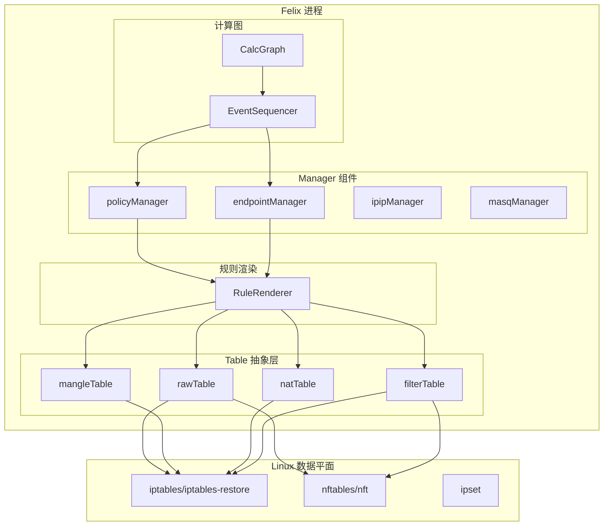
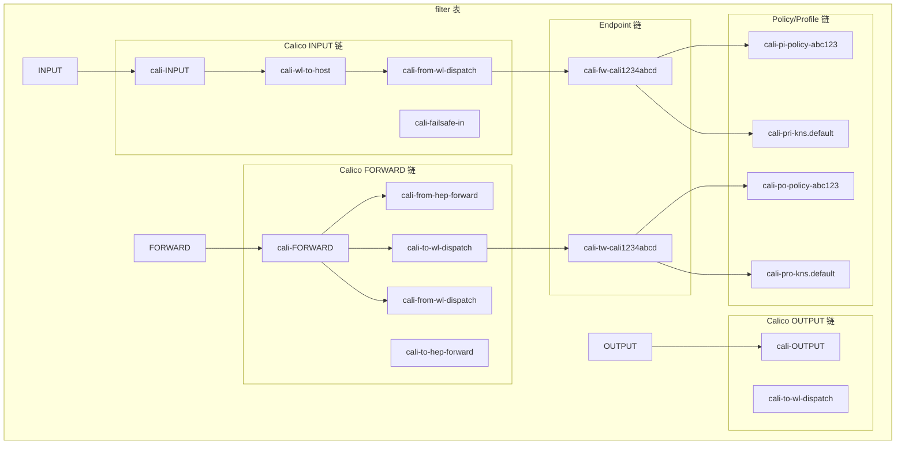
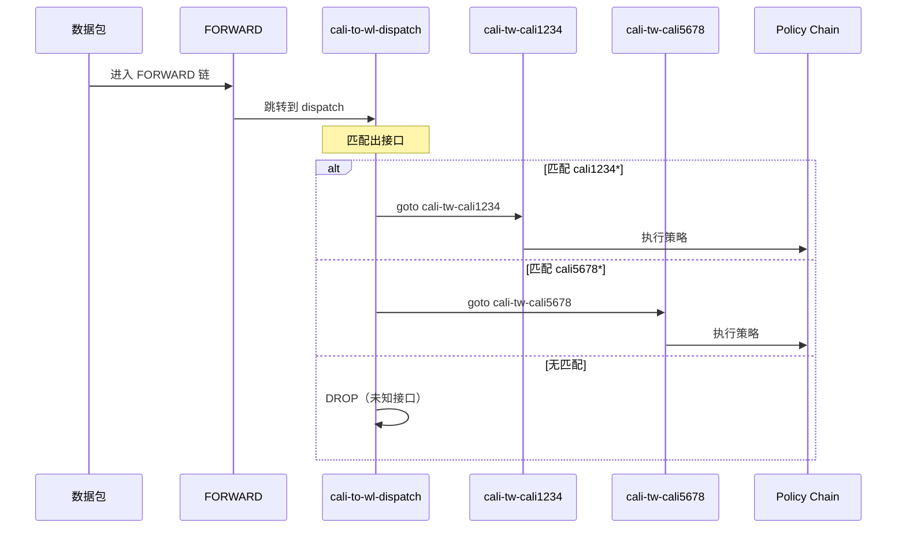
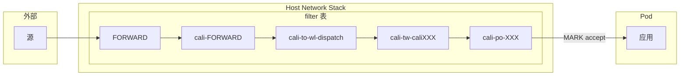

## 概述

Calico 的 iptables 数据平面是其最成熟、应用最广泛的网络策略实现方式。Felix 通过管理 Linux iptables/nftables 规则来实现网络策略的执行、流量过滤和 NAT 功能。

本文将深入分析 Felix iptables 数据平面的架构设计、链结构、规则渲染和增量更新机制。

## 前置知识

- [iptables/nftables 详解](../01-network-fundamentals/02-iptables-nftables.md)
- [Felix 计算图原理](../03-calico-control-plane/04-felix-calc-graph.md)
- [Linux 网络基础](../01-network-fundamentals/01-linux-networking-basics.md)

## 整体架构



## InternalDataplane 核心结构

Felix 的数据平面驱动定义在 [int_dataplane.go](felix/dataplane/linux/int_dataplane.go)：

```go
// felix/dataplane/linux/int_dataplane.go:322-423
type InternalDataplane struct {
    toDataplane   chan interface{}
    fromDataplane chan interface{}

    // 路由表管理
    mainRouteTables []routetable.SyncerInterface

    // iptables/nftables 表
    allTables    []generictables.Table
    mangleTables []generictables.Table
    natTables    []generictables.Table
    rawTables    []generictables.Table
    filterTables []generictables.Table

    // IPSet 管理
    ipSets []dpsets.IPSetsDataplane

    // 各种 Manager
    allManagers []Manager

    // 规则渲染器
    ruleRenderer rules.RuleRenderer

    // 同步状态
    datastoreInSync    bool
    ifaceMonitorInSync bool
    dataplaneNeedsSync bool

    // nftables 模式标志
    nftablesEnabled bool
}
```

### Manager 接口

每个 Manager 负责数据平面的一个方面：

```go
type Manager interface {
    // 接收来自计算图的更新
    OnUpdate(msg interface{})
    // 完成延迟的工作（应用到数据平面）
    CompleteDeferredWork() error
}
```

主要的 Manager 包括：

| Manager | 职责 |
|---------|------|
| policyManager | 策略/Profile 到链的转换 |
| endpointManager | Workload/Host Endpoint 管理 |
| ipipManager | IPIP 隧道管理 |
| vxlanManager | VXLAN 隧道管理 |
| masqManager | NAT 伪装管理 |
| routeManager | 路由表管理 |

## iptables 链结构

### Calico 链命名规则

```
cali-<direction><type>-<name>
```

- **direction**: `fw` (from workload), `tw` (to workload), `fh` (from host), `th` (to host)
- **type**: `wl` (workload), `hep` (host endpoint), `po` (policy), `pro` (profile)
- **name**: 接口名或策略/Profile ID 的哈希

### Filter 表链结构



### 四表规则分布

| 表 | 用途 | 主要链 |
|----|------|--------|
| raw | 连接跟踪豁免（untracked 策略） | PREROUTING, OUTPUT |
| mangle | QoS 标记、端点标记 | PREROUTING, FORWARD, OUTPUT |
| nat | SNAT/DNAT、MASQUERADE | PREROUTING, POSTROUTING |
| filter | 策略执行、流量过滤 | INPUT, FORWARD, OUTPUT |

## Table 抽象层

### Table 接口

Felix 使用 `generictables.Table` 接口抽象 iptables/nftables 操作：

```go
// felix/generictables/types.go
type Table interface {
    // 更新链（替换整个链内容）
    UpdateChains([]*Chain)
    // 删除链
    RemoveChainByName(name string)
    // 插入规则到内核链
    InsertOrAppendRules(chainName string, rules []Rule)
    // 应用更改
    Apply() (time.Duration, error)
}
```

### iptables Table 实现

```go
// felix/iptables/table.go:189-200
type Table struct {
    name      string
    ipVersion uint8

    // 规则渲染器
    render IptablesRenderer

    // 要插入到内核链的规则
    chainToInsertedRules map[string][]generictables.Rule

    // 期望的链内容
    chainNameToChain map[string]*generictables.Chain

    // 数据平面中的实际哈希
    chainToDataplaneHashes map[string][]string

    // 脏标记
    dirtyChains set.Set[string]
}
```

### 规则哈希机制

为了支持增量更新，Felix 为每条规则计算唯一哈希：

```go
// felix/iptables/table.go (简化)
func (t *Table) Apply() (time.Duration, error) {
    // 1. 读取当前 iptables 状态
    currentHashes := t.readDataplaneState()

    // 2. 比较期望状态与当前状态
    for chainName := range t.dirtyChains {
        desiredChain := t.chainNameToChain[chainName]
        currentChainHashes := currentHashes[chainName]

        // 计算差异
        updates := t.calculateUpdates(desiredChain, currentChainHashes)

        // 生成 iptables-restore 命令
        t.renderUpdates(updates)
    }

    // 3. 通过 iptables-restore 批量应用
    return t.executeRestore()
}
```

规则哈希存储在注释中：

```bash
# 示例规则
-A cali-fw-cali1234abcd -m comment --comment "cali:abc123xyz" -j cali-pi-policy-xyz
```

## 规则渲染器 (RuleRenderer)

### RuleRenderer 接口

```go
// felix/rules/rule_defs.go
type RuleRenderer interface {
    // 静态链（系统启动时创建）
    StaticFilterTableChains(ipVersion uint8) []*generictables.Chain
    StaticNATTableChains(ipVersion uint8) []*generictables.Chain
    StaticRawTableChains(ipVersion uint8) []*generictables.Chain
    StaticMangleTableChains(ipVersion uint8) []*generictables.Chain

    // 策略到链的转换
    PolicyToIptablesChains(policyID *types.PolicyID, policy *proto.Policy, ipVersion uint8) []*generictables.Chain

    // Profile 到链的转换
    ProfileToIptablesChains(profileID *types.ProfileID, profile *proto.Profile, ipVersion uint8) (inbound, outbound *generictables.Chain)

    // Workload Endpoint 链
    WorkloadEndpointToIptablesChains(ifaceName string, endpoint *proto.WorkloadEndpoint, ipSetIDsByTier []*ipSetIDsByTier) (inbound, outbound *generictables.Chain)

    // Dispatch 链
    WorkloadDispatchChains(endpoints map[types.WorkloadEndpointID]*proto.WorkloadEndpoint) []*generictables.Chain
}
```

### 静态链生成

```go
// felix/rules/static.go:30-35
func (r *DefaultRuleRenderer) StaticFilterTableChains(ipVersion uint8) (chains []*generictables.Chain) {
    chains = append(chains, r.StaticFilterForwardChains()...)
    chains = append(chains, r.StaticFilterInputChains(ipVersion)...)
    chains = append(chains, r.StaticFilterOutputChains(ipVersion)...)
    return
}
```

### INPUT 链规则示例

```go
// felix/rules/static.go:250-271
func (r *DefaultRuleRenderer) filterInputChain(ipVersion uint8) *generictables.Chain {
    var inputRules []generictables.Rule

    // 允许 IPIP 隧道流量
    if ipVersion == 4 && r.IPIPEnabled {
        inputRules = append(inputRules,
            generictables.Rule{
                Match: r.NewMatch().ProtocolNum(ProtoIPIP).
                    SourceIPSet(r.IPSetConfigV4.NameForMainIPSet(IPSetIDAllHostNets)).
                    DestAddrType(generictables.AddrTypeLocal),
                Action:  r.filterAllowAction,
                Comment: []string{"Allow IPIP packets from Calico hosts"},
            },
            generictables.Rule{
                Match:   r.NewMatch().ProtocolNum(ProtoIPIP),
                Action:  r.IptablesFilterDenyAction(),
                Comment: []string{"Drop IPIP packets from non-Calico hosts"},
            },
        )
    }

    // 允许 VXLAN 隧道流量
    if ipVersion == 4 && r.VXLANEnabled {
        inputRules = append(inputRules,
            generictables.Rule{
                Match: r.NewMatch().ProtocolNum(ProtoUDP).
                    DestPorts(uint16(r.Config.VXLANPort)).
                    SourceIPSet(r.IPSetConfigV4.NameForMainIPSet(IPSetIDAllVXLANSourceNets)).
                    DestAddrType(generictables.AddrTypeLocal),
                Action:  r.filterAllowAction,
                Comment: []string{"Allow IPv4 VXLAN packets from allowed hosts"},
            },
        )
    }

    return &generictables.Chain{Name: ChainFilterInput, Rules: inputRules}
}
```

## policyManager 详解

policyManager 负责将 Policy/Profile 更新转换为 iptables 链：

```go
// felix/dataplane/linux/policy_mgr.go:33-44
type policyManager struct {
    rawTable     Table
    mangleTable  Table
    filterTable  Table
    ruleRenderer policyRenderer
    ipVersion    uint8
}

func (m *policyManager) OnUpdate(msg interface{}) {
    switch msg := msg.(type) {
    case *proto.ActivePolicyUpdate:
        id := types.ProtoToPolicyID(msg.GetId())
        // 将策略转换为 iptables 链
        chains := m.ruleRenderer.PolicyToIptablesChains(&id, msg.Policy, m.ipVersion)

        // 更新到所有相关的表
        m.rawTable.UpdateChains(chains)
        m.mangleTable.UpdateChains(chains)
        m.filterTable.UpdateChains(chains)

    case *proto.ActivePolicyRemove:
        id := types.ProtoToPolicyID(msg.GetId())
        m.cleanUpPolicy(&id)

    case *proto.ActiveProfileUpdate:
        id := types.ProtoToProfileID(msg.GetId())
        inbound, outbound := m.ruleRenderer.ProfileToIptablesChains(&id, msg.Profile, m.ipVersion)
        m.filterTable.UpdateChains([]*generictables.Chain{inbound, outbound})
        m.mangleTable.UpdateChains([]*generictables.Chain{outbound})

    case *proto.ActiveProfileRemove:
        // 清理 Profile 链
    }
}
```

### 策略到链的转换

```go
// felix/rules/policy.go (简化)
func (r *DefaultRuleRenderer) PolicyToIptablesChains(
    policyID *types.PolicyID,
    policy *proto.Policy,
    ipVersion uint8,
) []*generictables.Chain {
    // 生成入站策略链
    inboundChain := r.policyChainRules(
        PolicyInboundPfx,
        policyID,
        policy.InboundRules,
        ipVersion,
    )

    // 生成出站策略链
    outboundChain := r.policyChainRules(
        PolicyOutboundPfx,
        policyID,
        policy.OutboundRules,
        ipVersion,
    )

    return []*generictables.Chain{inboundChain, outboundChain}
}

func (r *DefaultRuleRenderer) policyChainRules(
    prefix PolicyChainPrefix,
    policyID *types.PolicyID,
    rules []*proto.Rule,
    ipVersion uint8,
) *generictables.Chain {
    var iptablesRules []generictables.Rule

    for _, rule := range rules {
        // 转换每条规则
        match := r.ruleToMatch(rule, ipVersion)
        action := r.ruleToAction(rule)

        iptablesRules = append(iptablesRules, generictables.Rule{
            Match:  match,
            Action: action,
        })
    }

    return &generictables.Chain{
        Name:  PolicyChainName(prefix, policyID),
        Rules: iptablesRules,
    }
}
```

## Dispatch 链机制

Dispatch 链用于将流量路由到正确的 Endpoint 链。

### 工作原理



### Dispatch 链生成

```go
// felix/rules/dispatch.go:40-68
func (r *DefaultRuleRenderer) WorkloadDispatchChains(
    endpoints map[types.WorkloadEndpointID]*proto.WorkloadEndpoint,
) []*generictables.Chain {
    // 提取所有端点名称
    names := make([]string, 0, len(endpoints))
    for _, endpoint := range endpoints {
        names = append(names, endpoint.Name)
    }

    // 默认规则：丢弃未知接口的流量
    endRules := []generictables.Rule{
        {
            Match:   r.NewMatch(),
            Action:  r.IptablesFilterDenyAction(),
            Comment: []string{"Unknown interface"},
        },
    }

    // 生成基于接口名的分发链
    return r.interfaceNameDispatchChains(
        names,
        WorkloadFromEndpointPfx,  // "cali-fw-"
        WorkloadToEndpointPfx,    // "cali-tw-"
        ChainFromWorkloadDispatch,
        ChainToWorkloadDispatch,
        endRules,
        endRules,
    )
}
```

### 前缀树优化

为了减少延迟，Calico 使用前缀树结构组织 dispatch 链：

```go
// 当有很多端点时，使用前缀树减少匹配延迟
// 例如：cali1234, cali1235, cali5678
//
// cali-to-wl-dispatch:
//   -o cali123+ -> goto cali-to-wl-dispatch-0
//   -o cali5+   -> goto cali-to-wl-dispatch-1
//
// cali-to-wl-dispatch-0:
//   -o cali1234 -> goto cali-tw-cali1234
//   -o cali1235 -> goto cali-tw-cali1235
//
// cali-to-wl-dispatch-1:
//   -o cali5678 -> goto cali-tw-cali5678
```

## IPSet 集成

### IPSet 用途

Calico 使用 ipset 来高效地匹配大量 IP 地址：

| IPSet ID | 用途 |
|----------|------|
| `cali40all-hosts-net` | 所有 Calico 节点的 IP |
| `cali40all-vxlan-net` | 所有 VXLAN 源 IP |
| `cali40this-host` | 本机 IP 地址 |
| `cali40s:<selector-hash>` | 策略选择器匹配的 IP |

### IPSet 规则示例

```go
// 使用 IPSet 匹配源地址
generictables.Rule{
    Match: r.NewMatch().SourceIPSet("cali40all-hosts-net"),
    Action: r.Allow(),
}

// 生成的 iptables 规则
// -m set --match-set cali40all-hosts-net src -j ACCEPT
```

## 增量更新机制

### Apply 流程

```go
// felix/iptables/table.go (简化)
func (t *Table) Apply() (time.Duration, error) {
    start := time.Now()

    // 1. 使用 iptables-save 读取当前状态
    currentState, err := t.readCurrentState()
    if err != nil {
        return 0, err
    }

    // 2. 计算需要更新的链
    updates := t.calculateRequiredUpdates(currentState)
    if len(updates) == 0 {
        return time.Since(start), nil
    }

    // 3. 生成 iptables-restore 输入
    restoreInput := t.renderRestoreInput(updates)

    // 4. 执行 iptables-restore
    err = t.executeRestore(restoreInput)

    return time.Since(start), err
}
```

### iptables-restore 批量更新

```bash
# Felix 生成的 iptables-restore 输入示例
*filter
:cali-fw-cali1234 - [0:0]
-A cali-fw-cali1234 -m comment --comment "cali:abc123" -j cali-pi-policy-xyz
-A cali-fw-cali1234 -m comment --comment "cali:def456" -j cali-pri-kns.default
-A cali-fw-cali1234 -m comment --comment "cali:ghi789" -m mark --mark 0x10000/0x10000 -j RETURN
-A cali-fw-cali1234 -m comment --comment "cali:jkl012" -j DROP
COMMIT
```

### 规则比较与差量更新

```go
func (t *Table) calculateChainUpdates(chainName string) []update {
    desired := t.chainNameToChain[chainName]
    current := t.chainToDataplaneHashes[chainName]

    var updates []update

    // 比较每条规则的哈希
    for i, desiredRule := range desired.Rules {
        desiredHash := desiredRule.Hash()
        if i < len(current) && current[i] == desiredHash {
            // 规则相同，跳过
            continue
        }
        // 规则不同，需要更新
        updates = append(updates, update{
            position: i,
            rule:     desiredRule,
        })
    }

    return updates
}
```

## nftables 支持

从 Calico v3.26 开始，Felix 支持 nftables 作为数据平面后端：

```go
// felix/dataplane/linux/int_dataplane.go:437-504
func NewIntDataplaneDriver(config Config) *InternalDataplane {
    // 检测是否使用 nftables
    kubeProxyNftablesEnabled, _ := detectKubeProxyNftablesMode()
    nftablesEnabled := useNftables(config.RulesConfig.NFTablesMode, kubeProxyNftablesEnabled)

    if nftablesEnabled {
        // 创建 nftables 表
        nftablesV4RootTable := nftables.NewTable("calico", 4, ...)
        mangleTableV4 = nftables.NewTableLayer("mangle", nftablesV4RootTable)
        natTableV4 = nftables.NewTableLayer("nat", nftablesV4RootTable)
        rawTableV4 = nftables.NewTableLayer("raw", nftablesV4RootTable)
        filterTableV4 = nftables.NewTableLayer("filter", nftablesV4RootTable)
    } else {
        // 创建 iptables 表
        mangleTableV4 = iptables.NewTable("mangle", 4, ...)
        natTableV4 = iptables.NewTable("nat", 4, ...)
        rawTableV4 = iptables.NewTable("raw", 4, ...)
        filterTableV4 = iptables.NewTable("filter", 4, ...)
    }
}
```

## 数据包流转路径

### Pod 出站流量

```mermaid
graph LR
    subgraph pod["Pod"]
        APP["应用"]
    end

    subgraph host["Host Network Stack"]
        subgraph raw["raw 表"]
            R_PRE["PREROUTING"]
            R_cali["cali-PREROUTING"]
        end

        subgraph mangle["mangle 表"]
            M_PRE["PREROUTING"]
            M_FWD["FORWARD"]
        end

        subgraph filter["filter 表"]
            F_FWD["FORWARD"]
            F_cali["cali-FORWARD"]
            F_from["cali-from-wl-dispatch"]
            F_fw["cali-fw-caliXXX"]
            F_policy["cali-pi-XXX"]
        end

        subgraph nat["nat 表"]
            N_POST["POSTROUTING"]
            N_masq["cali-nat-outgoing"]
        end
    end

    APP -->|veth| R_PRE
    R_PRE --> R_cali
    R_cali --> M_PRE
    M_PRE --> M_FWD
    M_FWD --> F_FWD
    F_FWD --> F_cali
    F_cali --> F_from
    F_from --> F_fw
    F_fw --> F_policy
    F_policy -->|MARK accept| N_POST
    N_POST --> N_masq
```



### Pod 入站流量



## 调试与排障

### 查看 Calico iptables 规则

```bash
# 查看 filter 表的 Calico 链
sudo iptables -L -n -v | grep -A 20 "Chain cali-"

# 保存完整规则
sudo iptables-save -t filter | grep cali

# 查看特定链
sudo iptables -L cali-FORWARD -n -v --line-numbers
```

### 跟踪数据包

```bash
# 启用 iptables 日志
sudo iptables -t filter -I cali-FORWARD -j LOG --log-prefix "CALICO-FORWARD: "

# 使用 trace 模块
sudo iptables -t raw -I PREROUTING -p icmp -j TRACE
sudo iptables -t raw -I OUTPUT -p icmp -j TRACE

# 查看追踪日志
sudo dmesg | grep TRACE
```

### 查看 Felix 日志

```bash
# 查看 Felix iptables 操作日志
kubectl logs -n kube-system -l k8s-app=calico-node -c calico-node | grep -i iptables

# 启用详细日志
kubectl set env daemonset/calico-node -n kube-system FELIX_LOGSEVERITYSCREEN=Debug
```

### 常见问题

1. **规则不生效**
```bash
# 检查规则是否存在
sudo iptables -L cali-pi-<policy-hash> -n -v

# 检查 IPSet 是否正确
sudo ipset list | grep cali
```

2. **性能问题**
```bash
# 检查链长度
sudo iptables -L -n | wc -l

# 检查规则匹配计数
sudo iptables -L -n -v | head -50
```

3. **规则冲突**
```bash
# 检查非 Calico 规则
sudo iptables -L FORWARD -n -v | grep -v cali
```

## 实验：观察 iptables 规则变化

### 准备工作

```bash
# 创建测试 namespace
kubectl create namespace test-ns

# 保存初始规则
sudo iptables-save > /tmp/rules-before.txt
```

### 创建 Pod 观察规则

```bash
# 创建 Pod
kubectl run nginx --image=nginx -n test-ns

# 等待 Pod 就绪
kubectl wait --for=condition=ready pod/nginx -n test-ns

# 保存规则
sudo iptables-save > /tmp/rules-after-pod.txt

# 比较差异
diff /tmp/rules-before.txt /tmp/rules-after-pod.txt | grep cali
```

### 应用 NetworkPolicy

```yaml
# policy.yaml
apiVersion: networking.k8s.io/v1
kind: NetworkPolicy
metadata:
  name: deny-all
  namespace: test-ns
spec:
  podSelector: {}
  policyTypes:
  - Ingress
  - Egress
```

```bash
# 应用策略
kubectl apply -f policy.yaml

# 保存规则
sudo iptables-save > /tmp/rules-after-policy.txt

# 查看新增的策略链
diff /tmp/rules-after-pod.txt /tmp/rules-after-policy.txt | grep -E "^\+" | grep cali
```

### 清理

```bash
kubectl delete namespace test-ns
```

## 总结

Calico iptables 数据平面的核心设计：

1. **分层架构**：Manager → RuleRenderer → Table → iptables
2. **增量更新**：使用规则哈希实现差量更新，避免全量重写
3. **链组织**：通过 Dispatch 链和前缀树优化大规模端点的匹配效率
4. **IPSet 集成**：高效处理大量 IP 地址的匹配
5. **nftables 支持**：通过统一的 Table 抽象支持 iptables 和 nftables

## 参考资料

- [Calico iptables 文档](https://docs.projectcalico.org/reference/felix/configuration)
- 源代码：`felix/dataplane/linux/`
- 源代码：`felix/rules/`
- 源代码：`felix/iptables/`
