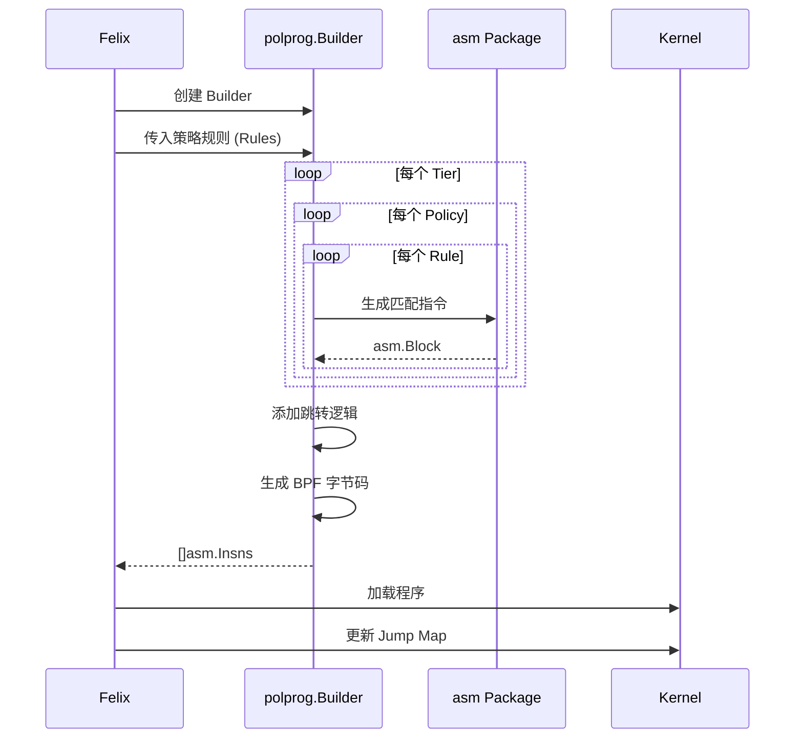
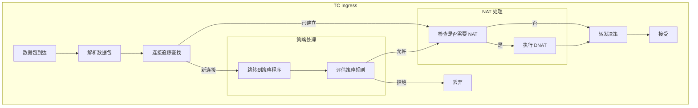
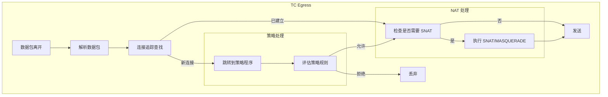

## 概述

Calico 的 eBPF 数据平面是一种高性能的网络策略实现方式，相比传统的 iptables 方案，eBPF 提供了更低的延迟、更好的可扩展性和更丰富的可观测性。

eBPF 数据平面的主要优势：
- **更高性能**：直接在内核中处理数据包，减少用户态/内核态切换
- **可替代 kube-proxy**：原生实现 Service 负载均衡
- **更好的可扩展性**：O(1) 的策略查找复杂度（相比 iptables 的 O(n)）
- **丰富的可观测性**：流量日志、连接追踪等

本文将深入分析 Calico eBPF 数据平面的架构设计、BPF Maps 结构、程序加载和策略编译机制。

## 前置知识

- [eBPF 技术介绍](../01-network-fundamentals/03-ebpf-introduction.md)
- [Felix 计算图原理](../03-calico-control-plane/04-felix-calc-graph.md)
- [iptables 数据平面](03-iptables-dataplane.md)

## 整体架构

```mermaid
graph TB
    subgraph felix["Felix 进程"]
        subgraph managers["Manager 组件"]
            BPFEPMgr["bpfEndpointManager"]
            BPFRouteMgr["bpfRouteManager"]
            BPFProxy["BPF Proxy<br/>(替代 kube-proxy)"]
        end

        subgraph compiler["策略编译"]
            PolProg["polprog.Builder"]
            ASM["asm Package"]
        end
    end

    subgraph kernel["Linux 内核"]
        subgraph hooks["BPF Hooks"]
            TC_IN["TC Ingress"]
            TC_OUT["TC Egress"]
            XDP["XDP"]
            Cgroup["Cgroup Connect"]
        end

        subgraph maps["BPF Maps"]
            CT["Conntrack Map"]
            NAT_FE["NAT Frontend Map"]
            NAT_BE["NAT Backend Map"]
            Routes["Routes Map"]
            IPSets["IPSets Map"]
            IfState["Interface State Map"]
            JumpMap["Jump Map"]
        end

        subgraph progs["BPF Programs"]
            TC_Prog["tc.c"]
            XDP_Prog["xdp.c"]
            Connect["connect.c"]
            Policy["policy_prog"]
        end
    end

    BPFEPMgr --> TC_IN
    BPFEPMgr --> TC_OUT
    BPFEPMgr --> XDP

    BPFProxy --> NAT_FE
    BPFProxy --> NAT_BE

    BPFRouteMgr --> Routes

    PolProg --> Policy
    ASM --> Policy

    TC_Prog --> CT
    TC_Prog --> NAT_FE
    TC_Prog --> Policy
```



## bpfEndpointManager

bpfEndpointManager 是 eBPF 数据平面的核心组件，负责管理接口上的 BPF 程序。

### 核心结构

```go
// felix/dataplane/linux/bpf_ep_mgr.go:200+
type bpfInterface struct {
    name           string
    ifIndex        int
    ifaceType      IfaceType

    // 策略信息
    info           ifaceInfo
    dpState        bpfInterfaceState

    // 附加点
    tcIngress      attachPoint
    tcEgress       attachPoint
    xdp            attachPoint
}

type bpfEndpointManager struct {
    // 接口映射
    nameToIface    map[string]*bpfInterface
    ifIndexToIface map[int]*bpfInterface

    // 策略状态
    policies     map[types.PolicyID]*proto.Policy
    profiles     map[types.ProfileID]*proto.Profile
    workloads    map[types.WorkloadEndpointID]*proto.WorkloadEndpoint
    hostEndpoints map[types.HostEndpointID]*proto.HostEndpoint

    // BPF Maps
    bpfmaps *bpfmap.Maps

    // 规则编译器
    polprogBuilder *polprog.Builder
}
```

### 接口类型

```go
// felix/dataplane/linux/bpf_ep_mgr.go:131-142
type IfaceType int32

const (
    IfaceTypeData      IfaceType = iota  // 数据接口（工作负载 veth）
    IfaceTypeWireguard                    // WireGuard 隧道
    IfaceTypeIPIP                         // IPIP 隧道
    IfaceTypeVXLAN                        // VXLAN 隧道
    IfaceTypeL3                           // L3 接口
    IfaceTypeBond                         // Bond 接口
    IfaceTypeBondSlave                    // Bond Slave
    IfaceTypeUnknown
)
```

### attachPoint 接口

```go
// felix/dataplane/linux/bpf_ep_mgr.go:144-153
type attachPoint interface {
    IfaceName() string
    IfaceIndex() int
    HookName() hook.Hook
    AttachProgram() error
    DetachProgram() error
    Log() *logrus.Entry
    LogVal() string
    PolicyJmp(proto.IPVersion) int
}
```

## BPF 程序加载

### TC 附加点

TC (Traffic Control) 是 Calico eBPF 程序的主要附加点：

```go
// felix/bpf/tc/attach.go:40-80
type AttachPoint struct {
    bpf.AttachPoint

    Type           tcdefs.EndpointType  // Workload, Host, Tunnel 等
    ToOrFrom       tcdefs.ToOrFromEp    // Ingress 或 Egress
    HookLayoutV4   hook.Layout
    HookLayoutV6   hook.Layout

    // 主机 IP
    HostIPv4       net.IP
    HostIPv6       net.IP
    HostTunnelIPv4 net.IP

    // 配置
    DSR            bool            // Direct Server Return
    TunnelMTU      uint16
    VXLANPort      uint16
    WgPort         uint16

    // NAT 配置
    NATin          uint32
    NATout         uint32

    // 程序 Map
    ProgramsMap    maps.Map
}
```

### 程序附加流程

```go
// felix/bpf/tc/attach.go:146-198
func (ap *AttachPoint) AttachProgram() error {
    logCxt := log.WithField("attachPoint", ap)

    // 加载 preamble 程序
    binaryToLoad := path.Join(bpfdefs.ObjectDir, fmt.Sprintf("tc_preamble_%s.o", ap.Hook))

    // 根据附加类型选择 TCX 或传统 TC
    if ap.AttachType == apiv3.BPFAttachOptionTCX {
        err := ap.attachTCXProgram(binaryToLoad)
        if err != nil {
            return err
        }
        logCxt.Info("Program attached to tcx.")
        return nil
    }

    // 传统 TC 附加
    obj, err := ap.loadObject(binaryToLoad, nil)
    if err != nil {
        return err
    }
    defer obj.Close()

    err = obj.AttachClassifier("cali_tc_preamble", ap.Iface, ap.Hook == hook.Ingress, prio, handle)
    if err != nil {
        return err
    }

    logCxt.Info("Program attached to tc.")
    return nil
}
```

### XDP 附加点

XDP (eXpress Data Path) 提供最早的数据包处理点：

```go
// felix/bpf/xdp/attach.go
type AttachPoint struct {
    bpf.AttachPoint
    Modes       []bpf.XDPMode
    HookLayoutV4 hook.Layout
    HookLayoutV6 hook.Layout
}

func (ap *AttachPoint) AttachProgram() error {
    // 加载 XDP 程序
    binaryToLoad := path.Join(bpfdefs.ObjectDir, "xdp.o")
    obj, err := ap.loadObject(binaryToLoad)
    if err != nil {
        return err
    }
    defer obj.Close()

    // 附加到接口
    return obj.AttachXDP(ap.Iface, ap.Modes)
}
```

## BPF Maps 详解

### Map 类型概览

| Map 名称 | 类型 | 用途 |
|---------|------|------|
| cali_v4_ct | LRU Hash | IPv4 连接追踪 |
| cali_v4_nat_fe | LPM Trie | NAT 前端（Service IP → Backend ID） |
| cali_v4_nat_be | Hash | NAT 后端（Backend ID → Endpoint） |
| cali_v4_routes | LPM Trie | 路由信息 |
| cali_v4_ip_sets | LPM Trie | IP 集合（策略匹配） |
| cali_state | Per-CPU Array | 处理状态 |
| cali_jump | Prog Array | 程序跳转表 |
| cali_iface | Hash | 接口状态 |

### 连接追踪 Map

```go
// felix/bpf/conntrack/map.go:53-73
type Key = curVer.Key    // [KeySize]byte
type Value = curVer.Value // [ValueSize]byte

// 连接类型
const (
    TypeNormal     uint8 = iota  // 普通连接
    TypeNATForward               // NAT 转发条目
    TypeNATReverse               // NAT 反向条目
)

// 创建连接追踪条目
func NewValueNormal(lastSeen time.Duration, flags uint32, legA, legB Leg) Value {
    return curVer.NewValueNormal(lastSeen, flags, legA, legB)
}

func NewValueNATForward(lastSeen time.Duration, flags uint32, revKey Key) Value {
    return curVer.NewValueNATForward(lastSeen, flags, revKey)
}

func NewValueNATReverse(lastSeen time.Duration, flags uint32, legA, legB Leg,
    tunnelIP, origIP net.IP, origPort uint16) Value {
    return curVer.NewValueNATReverse(lastSeen, flags, legA, legB, tunnelIP, origIP, origPort)
}
```

### NAT Maps

```go
// felix/bpf/nat/maps.go:58-96

// NAT Frontend Key
// struct calico_nat_v4_key {
//    uint32_t prefixLen;
//    uint32_t addr;     // Service IP (NBO)
//    uint16_t port;     // Service Port (HBO)
//    uint8_t protocol;
//    uint32_t saddr;    // Source IP for source-based routing
//    uint8_t pad;
// };
type FrontendKey [frontendKeySize]byte

// NAT Frontend Value
// struct calico_nat_v4_value {
//    uint32_t id;             // Backend ID
//    uint32_t count;          // Backend 数量
//    uint32_t local;          // 本地 Backend 数量
//    uint32_t affinity_timeo; // 亲和性超时
//    uint32_t flags;
// };
type FrontendValue [frontendValueSize]byte

// NAT Backend Key
// struct calico_nat_secondary_v4_key {
//    uint32_t id;       // Backend ID
//    uint32_t ordinal;  // Backend 序号
// };
type BackendKey [backendKeySize]byte

// NAT Backend Value
// struct calico_nat_dest {
//    uint32_t addr;  // Endpoint IP
//    uint16_t port;  // Endpoint Port
//    uint8_t pad[2];
// };
type BackendValue [backendValueSize]byte
```

### IPSet Map

```go
// felix/bpf/ipsets/map.go
// IP Set Entry 结构
// struct ip4_set_key {
//    uint32_t mask;    // CIDR 前缀长度
//    uint64_t set_id;  // IPSet ID
//    uint32_t addr;    // IP 地址
//    uint16_t port;    // 端口（可选）
//    uint8_t protocol; // 协议（可选）
//    uint8_t pad;
// };

const IPSetEntrySize = 20
const IPSetEntryV6Size = 32

type IPSetMember struct {
    SetID    uint64
    Addr     ip.Addr
    Port     uint16
    Protocol uint8
    CIDR     uint8
}
```

## 策略程序编译

Calico 的 eBPF 策略程序是动态生成的 BPF 字节码。

### polprog.Builder

```go
// felix/bpf/polprog/pol_prog_builder.go:41-66
type Builder struct {
    blocks          []*asm.Block
    b               *asm.Block

    tierID          int
    policyID        int
    ruleID          int

    ipSetIDProvider ipSetIDProvider
    ipSetMapFD      maps.FD
    stateMapFD      maps.FD
    staticJumpMapFD maps.FD
    policyJumpMapFD maps.FD

    policyDebugEnabled bool
    forIPv6            bool
    allowJmp           int
    denyJmp            int

    maxJumpsPerProgram int
    numRulesInProgram  int
}
```

### 策略规则结构

```go
// felix/bpf/polprog/pol_prog_builder.go:170-194
type Rule struct {
    *proto.Rule
    MatchID RuleMatchID
}

type Policy struct {
    Kind      string
    Namespace string
    Name      string
    Rules     []Rule
}

type Tier struct {
    Name      string
    EndRuleID RuleMatchID
    EndAction TierEndAction
    Policies  []Policy
}

type Rules struct {
    // Workload 策略
    Tiers            []Tier
    SuppressNormalHostPolicy bool

    // Host Endpoint 策略
    HostPreDnatTiers []Tier
    HostForwardTiers []Tier
    HostNormalTiers  []Tier

    // Profile（作为默认策略）
    Profiles         []Policy
}
```

### 编译流程



### 规则编译示例

```go
// 简化的规则编译逻辑
func (b *Builder) compileRule(rule *Rule) {
    // 1. 匹配源 IP
    if rule.SrcNet != nil {
        b.emitIPSetMatch(rule.SrcNet, "src")
    }

    // 2. 匹配目标 IP
    if rule.DstNet != nil {
        b.emitIPSetMatch(rule.DstNet, "dst")
    }

    // 3. 匹配协议
    if rule.Protocol != nil {
        b.emitProtoMatch(rule.Protocol)
    }

    // 4. 匹配端口
    if len(rule.DstPorts) > 0 {
        b.emitPortMatch(rule.DstPorts, "dst")
    }

    // 5. 执行动作
    switch rule.Action {
    case "allow":
        b.emitJump(b.allowJmp)
    case "deny":
        b.emitJump(b.denyJmp)
    case "pass":
        // 继续下一条规则
    }
}

func (b *Builder) emitIPSetMatch(ipSetID string, direction string) {
    // 生成 IPSet 查找指令
    // 1. 加载 IP 地址到寄存器
    // 2. 构造 IPSet key
    // 3. 调用 bpf_map_lookup_elem
    // 4. 检查返回值
}
```

## 数据包处理流程

### TC Ingress 流程



### TC Egress 流程



## BPF Proxy（替代 kube-proxy）

Calico eBPF 模式可以完全替代 kube-proxy：

```go
// felix/bpf/proxy/kube-proxy.go
type KubeProxy struct {
    // Service 状态
    services     map[types.ServicePortName]*serviceInfo
    endpoints    map[types.ServicePortName][]endpointInfo

    // NAT Maps
    natFeMap     maps.Map
    natBeMap     maps.Map
    affinityMap  maps.Map

    // 同步状态
    syncer       *Syncer
}

func (k *KubeProxy) OnServiceUpdate(svc *v1.Service) {
    // 更新 Service 信息
    // 1. 计算 Frontend Key
    // 2. 分配 Backend ID
    // 3. 更新 NAT Maps
}

func (k *KubeProxy) OnEndpointsUpdate(eps *v1.Endpoints) {
    // 更新 Endpoints
    // 1. 获取 Service 的 Backend ID
    // 2. 更新 Backend Map
    // 3. 更新 Affinity Map（如果需要）
}
```

### Service 负载均衡实现

```c
// felix/bpf-gpl/nat.h (简化)
static CALI_BPF_INLINE int calico_nat_v4(struct cali_tc_ctx *ctx) {
    // 1. 查找 NAT Frontend
    struct calico_nat_v4_key fe_key = {
        .addr = ctx->state->ip_dst,
        .port = ctx->state->dport,
        .protocol = ctx->state->ip_proto,
    };

    struct calico_nat_v4_value *fe_val = cali_nat_fe_lookup_elem(&fe_key);
    if (!fe_val) {
        return CALI_NAT_NO_MATCH;
    }

    // 2. 选择后端（考虑亲和性）
    uint32_t backend_id = fe_val->id;
    uint32_t ordinal = select_backend(fe_val->count, ctx);

    // 3. 查找后端地址
    struct calico_nat_secondary_v4_key be_key = {
        .id = backend_id,
        .ordinal = ordinal,
    };

    struct calico_nat_dest *be_val = cali_nat_be_lookup_elem(&be_key);
    if (!be_val) {
        return CALI_NAT_NO_BACKEND;
    }

    // 4. 执行 DNAT
    ctx->state->post_nat_ip_dst = be_val->addr;
    ctx->state->post_nat_dport = be_val->port;

    return CALI_NAT_SUCCESS;
}
```

## 配置与调优

### 启用 eBPF 模式

```yaml
# FelixConfiguration
apiVersion: projectcalico.org/v3
kind: FelixConfiguration
metadata:
  name: default
spec:
  bpfEnabled: true
  bpfDisableUnprivileged: true
  bpfLogLevel: "off"          # off, info, debug
  bpfDataIfacePattern: "^(en|eth|tunl|wireguard).*"
  bpfConnectTimeLoadBalancingEnabled: true  # Connect-time LB
  bpfExternalServiceMode: Tunnel  # Tunnel 或 DSR
  bpfKubeProxyIptablesCleanupEnabled: true
```

### Map 大小配置

```yaml
spec:
  bpfMapSizeConntrack: 512000      # 连接追踪表大小
  bpfMapSizeNATFrontend: 65536     # NAT Frontend 表大小
  bpfMapSizeNATBackend: 262144     # NAT Backend 表大小
  bpfMapSizeIPSets: 1048576        # IPSet 表大小
  bpfMapSizeRoute: 262144          # 路由表大小
```

## 调试与排障

### 查看 BPF 程序

```bash
# 列出所有 BPF 程序
sudo bpftool prog list

# 查看特定接口的 TC 程序
sudo tc filter show dev eth0 ingress
sudo tc filter show dev eth0 egress

# 查看 XDP 程序
sudo bpftool net show
```

### 查看 BPF Maps

```bash
# 列出所有 Maps
sudo bpftool map list

# 查看连接追踪表
sudo bpftool map dump pinned /sys/fs/bpf/tc/globals/cali_v4_ct

# 查看 NAT 表
sudo bpftool map dump pinned /sys/fs/bpf/tc/globals/cali_v4_nat_fe
sudo bpftool map dump pinned /sys/fs/bpf/tc/globals/cali_v4_nat_be
```

### calico-bpf 工具

```bash
# 连接追踪
calico-bpf conntrack dump

# 路由
calico-bpf routes dump

# IPSets
calico-bpf ipsets dump

# NAT
calico-bpf nat dump

# 策略计数器
calico-bpf counters dump
```

### 常见问题

1. **程序加载失败**
```bash
# 检查内核版本（需要 >= 5.3）
uname -r

# 检查 BPF 文件系统
mount | grep bpf

# 检查 Felix 日志
kubectl logs -n calico-system -l k8s-app=calico-node -c calico-node | grep -i bpf
```

2. **连接追踪表满**
```bash
# 检查表使用情况
calico-bpf conntrack dump | wc -l

# 增加表大小
kubectl patch felixconfiguration default --type=merge \
  -p '{"spec":{"bpfMapSizeConntrack": 1000000}}'
```

3. **策略不生效**
```bash
# 检查策略程序是否加载
sudo bpftool prog list | grep cali_pol

# 查看策略计数器
calico-bpf counters dump
```

## 实验：观察 eBPF 数据平面

### 准备工作

```bash
# 确保 eBPF 模式已启用
kubectl get felixconfiguration default -o yaml | grep bpfEnabled

# 确保 calico-bpf 工具可用
which calico-bpf || echo "Install calico-bpf from calico-node pod"
```

### 观察连接追踪

```bash
# 1. 创建测试 Pod
kubectl run nginx --image=nginx
kubectl run client --image=busybox --command -- sleep 3600

# 2. 发起连接
kubectl exec client -- wget -qO- http://<nginx-pod-ip>

# 3. 查看连接追踪条目
calico-bpf conntrack dump | grep <nginx-pod-ip>
```

### 观察 Service NAT

```bash
# 1. 创建 Service
kubectl expose pod nginx --port=80

# 2. 访问 Service
kubectl exec client -- wget -qO- http://<service-ip>

# 3. 查看 NAT 表
calico-bpf nat dump | grep <service-ip>
```

### 查看策略程序

```bash
# 1. 应用 NetworkPolicy
kubectl apply -f - <<EOF
apiVersion: networking.k8s.io/v1
kind: NetworkPolicy
metadata:
  name: deny-all
spec:
  podSelector:
    matchLabels:
      run: nginx
  policyTypes:
  - Ingress
EOF

# 2. 查看策略程序
sudo bpftool prog list | grep -A2 cali_pol

# 3. 测试策略
kubectl exec client -- wget -qO- --timeout=5 http://<nginx-pod-ip>
# 应该超时
```

## 总结

Calico eBPF 数据平面的核心设计：

1. **TC/XDP Hooks**：在最早的数据包处理点执行策略
2. **BPF Maps**：高效的键值存储用于连接追踪、NAT、路由等
3. **动态策略编译**：将 NetworkPolicy 编译为 BPF 字节码
4. **替代 kube-proxy**：原生实现 Service 负载均衡
5. **O(1) 查找**：相比 iptables 的 O(n)，提供更好的可扩展性

## 参考资料

- [Calico eBPF 官方文档](https://docs.projectcalico.org/maintenance/ebpf/enabling-bpf)
- [eBPF 内核文档](https://www.kernel.org/doc/html/latest/bpf/)
- 源代码：`felix/bpf/`
- 源代码：`felix/bpf-gpl/`
- 源代码：`felix/dataplane/linux/bpf_ep_mgr.go`
