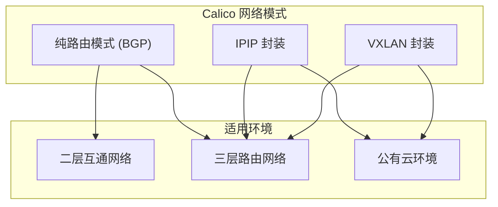
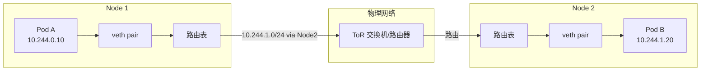
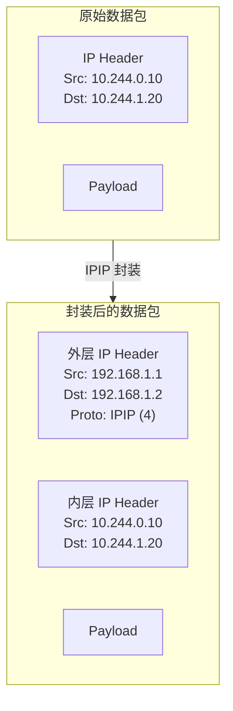
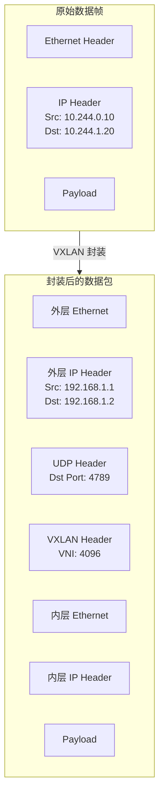
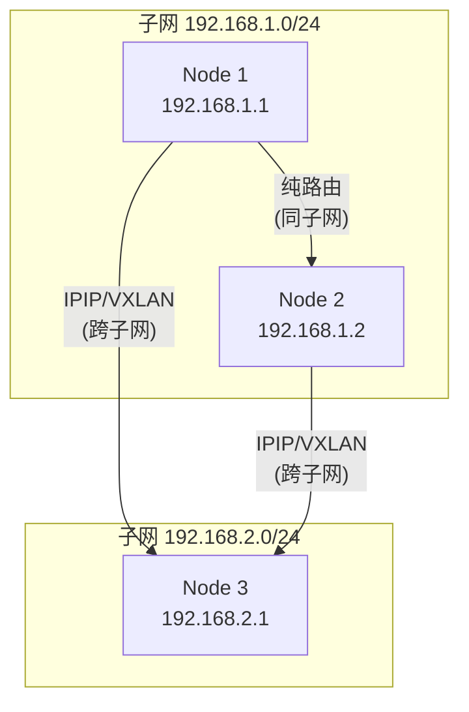

## 概述

Calico 支持多种跨节点通信模式，包括纯路由模式（BGP）和封装模式（IPIP、VXLAN）。不同的模式适用于不同的网络环境，各有优缺点。

本文将深入分析 Calico 的路由机制、IPIP 和 VXLAN 封装的实现原理，以及如何根据网络环境选择合适的模式。

## 前置知识

- [Linux 网络基础](../01-network-fundamentals/01-linux-networking-basics.md)
- [veth/网桥/路由](../01-network-fundamentals/04-veth-bridge-routing.md)
- [BGP 协议基础](../01-network-fundamentals/05-bgp-fundamentals.md)

## 通信模式概览



| 模式 | 优点 | 缺点 | 适用场景 |
|------|------|------|----------|
| BGP | 最高性能、无封装开销 | 需要网络设备支持 | 数据中心、可控网络 |
| IPIP | 简单、开销小（20字节） | 仅支持 IPv4 | 跨子网、公有云 |
| VXLAN | 支持 IPv4/IPv6、兼容性好 | 开销较大（50字节） | 公有云、混合云 |

## 纯路由模式 (BGP)

### 工作原理

在纯路由模式下，Calico 通过 BGP 协议将 Pod CIDR 路由通告给网络中的其他节点和路由器。



### 路由配置

```bash
# Node 1 上的路由
ip route show
# 本地 Pod 网段
10.244.0.0/24 dev cali0 scope link
# 远程节点的 Pod 网段（通过 BGP 学习）
10.244.1.0/24 via 192.168.1.2 dev eth0 proto bird

# Node 2 上的路由
ip route show
10.244.1.0/24 dev cali0 scope link
10.244.0.0/24 via 192.168.1.1 dev eth0 proto bird
```

### 数据包流程

```
Pod A (10.244.0.10) → Pod B (10.244.1.20)

1. Pod A 发送数据包：
   源 IP: 10.244.0.10, 目的 IP: 10.244.1.20

2. 数据包到达 Node 1 的 veth 对端

3. Node 1 查询路由表：
   10.244.1.0/24 via 192.168.1.2

4. 数据包通过物理网络发送到 Node 2

5. Node 2 接收数据包，查询路由表：
   10.244.1.0/24 dev cali0

6. 数据包通过 veth 传递给 Pod B
```

## IPIP 封装

### 工作原理

IPIP (IP-in-IP) 将原始 IP 数据包封装在另一个 IP 数据包中，用于跨子网通信。



### ipipManager

```go
// felix/dataplane/linux/ipip_mgr.go:35-54
type ipipManager struct {
    hostname      string
    ipVersion     uint8
    routeProtocol netlink.RouteProtocol
    routeMgr      *routeManager
    dpConfig      Config

    // 隧道设备信息
    tunnelDevice    string
    tunnelDeviceMTU int

    // 主机 IP 映射
    activeHostnameToIP map[string]string
}

func newIPIPManager(
    mainRouteTable routetable.Interface,
    tunnelDevice string,
    ipVersion uint8,
    mtu int,
    dpConfig Config,
    opRecorder logutils.OpRecorder,
) *ipipManager {
    m := &ipipManager{
        activeHostnameToIP: map[string]string{},
        hostname:           dpConfig.Hostname,
        tunnelDevice:       tunnelDevice,  // 默认 "tunl0"
        tunnelDeviceMTU:    mtu,
        // ...
    }
    return m
}
```

### 隧道设备配置

```bash
# 查看 IPIP 隧道设备
ip link show tunl0
# tunl0: <NOARP,UP,LOWER_UP> mtu 1440 qdisc noqueue state UNKNOWN
#     link/ipip 0.0.0.0 brd 0.0.0.0

# 配置隧道地址
ip addr add 10.244.0.1/32 dev tunl0

# 查看 IPIP 路由
ip route show | grep tunl0
# 10.244.1.0/26 via 192.168.1.2 dev tunl0 proto bird onlink
```

### IPIP 路由生成

```go
// felix/dataplane/linux/ipip_mgr.go
func (m *ipipManager) tunnelRoute(cidr ip.CIDR, msg *proto.RouteUpdate) *routetable.Target {
    // 获取远程节点的 IP
    tunnelIP := m.activeHostnameToIP[msg.DstNodeName]
    if tunnelIP == "" {
        return nil
    }

    // 生成通过 IPIP 隧道的路由
    return &routetable.Target{
        Type:   routetable.TargetTypeViaGateway,
        CIDR:   cidr,
        GW:     ip.FromString(tunnelIP),
        Device: m.tunnelDevice,  // tunl0
        Flags:  netlink.FLAG_ONLINK,
    }
}
```

### IPIP 模式配置

```yaml
# IPPool 配置
apiVersion: projectcalico.org/v3
kind: IPPool
metadata:
  name: default-ipv4-ippool
spec:
  cidr: 10.244.0.0/16
  ipipMode: Always    # Always: 总是使用 IPIP
                      # CrossSubnet: 仅跨子网时使用
                      # Never: 不使用 IPIP
  natOutgoing: true
```

## VXLAN 封装

### 工作原理

VXLAN (Virtual Extensible LAN) 使用 UDP 封装二层帧，提供比 IPIP 更好的兼容性。



### vxlanManager

```go
// felix/dataplane/linux/vxlan_mgr.go:40-71
type vxlanManager struct {
    hostname string
    routeMgr *routeManager
    fdb      VXLANFDB

    ipsetsDataplane dpsets.IPSetsDataplane
    ipSetMetadata   ipsets.IPSetMetadata

    // VTEP（VXLAN Tunnel Endpoint）信息
    vtepsByNode map[string]*proto.VXLANTunnelEndpointUpdate
    myVTEP      *proto.VXLANTunnelEndpointUpdate

    // VXLAN 配置
    vxlanDevice string  // 默认 "vxlan.calico"
    vxlanID     int     // VNI，默认 4096
    vxlanPort   int     // UDP 端口，默认 4789
    ipVersion   uint8
    mtu         int

    vtepsDirty bool
}
```

### VTEP 更新处理

```go
func (m *vxlanManager) OnUpdate(msg interface{}) {
    switch msg := msg.(type) {
    case *proto.VXLANTunnelEndpointUpdate:
        // 更新远程 VTEP 信息
        m.vtepsByNode[msg.Node] = msg
        m.vtepsDirty = true

        if msg.Node == m.hostname {
            // 更新本地 VTEP
            m.myVTEPLock.Lock()
            m.myVTEP = msg
            m.myVTEPLock.Unlock()
        }

    case *proto.VXLANTunnelEndpointRemove:
        delete(m.vtepsByNode, msg.Node)
        m.vtepsDirty = true
    }
}
```

### VXLAN 设备配置

```bash
# 查看 VXLAN 设备
ip -d link show vxlan.calico
# vxlan.calico: <BROADCAST,MULTICAST,UP,LOWER_UP> mtu 1410 qdisc noqueue state UNKNOWN
#     link/ether 66:51:c5:28:aa:a9 brd ff:ff:ff:ff:ff:ff promiscuity 0
#     vxlan id 4096 local 192.168.1.1 dev eth0 srcport 0 0 dstport 4789 ...

# 查看 VXLAN FDB（转发数据库）
bridge fdb show dev vxlan.calico
# 66:7f:95:74:bb:9f dst 192.168.1.2 self permanent

# 查看 VXLAN 路由
ip route show | grep vxlan.calico
# 10.244.1.0/26 via 10.244.1.1 dev vxlan.calico onlink
```

### VXLAN FDB 管理

```go
// felix/vxlanfdb/vxlanfdb.go
type VTEP struct {
    TunnelIP   net.IP
    TunnelMAC  net.HardwareAddr
    HostIP     net.IP
    ParentDev  string
}

func (v *VXLANFDB) SetVTEPs(vteps []VTEP) {
    // 清理旧的 FDB 条目
    for mac := range v.currentFDBByMAC {
        if !newVTEPs[mac] {
            v.deleteFDB(mac)
        }
    }

    // 添加新的 FDB 条目
    for _, vtep := range vteps {
        v.addFDB(vtep.TunnelMAC, vtep.HostIP)
    }
}
```

### VXLAN 模式配置

```yaml
# IPPool 配置
apiVersion: projectcalico.org/v3
kind: IPPool
metadata:
  name: default-ipv4-ippool
spec:
  cidr: 10.244.0.0/16
  vxlanMode: Always   # Always: 总是使用 VXLAN
                      # CrossSubnet: 仅跨子网时使用
                      # Never: 不使用 VXLAN
  natOutgoing: true
```

## routeManager 详解

routeManager 是 IPIP 和 VXLAN Manager 的共享组件，负责管理隧道路由。

### 结构定义

```go
// felix/dataplane/linux/route_mgr.go:38-79
type routeManager struct {
    routeTable           routetable.Interface
    routeClassTunnel     routetable.RouteClass
    routeClassSameSubnet routetable.RouteClass
    ipVersion            uint8
    ippoolType           proto.IPPoolType

    // 设备信息
    parentDevice     string
    parentDeviceAddr string
    tunnelDevice     string
    tunnelDeviceMTU  int
    tunnelRouteFn    func(ip.CIDR, *proto.RouteUpdate) *routetable.Target

    // 路由状态
    routesByDest    map[string]*proto.RouteUpdate
    localIPAMBlocks map[string]*proto.RouteUpdate

    hostname       string
    routesDirty    bool
    routeProtocol  netlink.RouteProtocol
}
```

### 路由更新处理

```go
// felix/dataplane/linux/route_mgr.go:159-200
func (m *routeManager) OnUpdate(protoBufMsg interface{}) {
    switch msg := protoBufMsg.(type) {
    case *proto.RouteUpdate:
        cidr, err := ip.CIDRFromString(msg.Dst)
        if err != nil || m.ipVersion != cidr.Version() {
            return
        }

        // 清理旧路由
        m.deleteRoute(msg.Dst)

        // 处理远程 IPAM Block
        if isType(msg, proto.RouteType_REMOTE_WORKLOAD) && msg.IpPoolType == m.ippoolType {
            m.routesByDest[msg.Dst] = msg
            m.routesDirty = true
        }

        // 处理远程隧道端点路由
        if isRemoteTunnelRoute(msg, m.ippoolType) {
            m.routesByDest[msg.Dst] = msg
            m.routesDirty = true
        }

        // 处理本地 IPAM Block
        if m.routeIsLocalBlock(msg) {
            m.localIPAMBlocks[msg.Dst] = msg
            m.routesDirty = true
        }

    case *proto.RouteRemove:
        m.deleteRoute(msg.Dst)
    }
}
```

### 路由应用

```go
func (m *routeManager) CompleteDeferredWork() error {
    if !m.routesDirty {
        return nil
    }

    // 确保隧道设备存在并配置正确
    err := m.ensureTunnelDevice()
    if err != nil {
        return err
    }

    // 应用路由更新
    for dst, route := range m.routesByDest {
        cidr := ip.MustParseCIDROrIP(dst)
        target := m.tunnelRouteFn(cidr, route)
        if target != nil {
            m.routeTable.SetRoutes(m.routeClassTunnel, cidr, []routetable.Target{*target})
        }
    }

    // 处理同子网路由（不需要封装）
    for dst, route := range m.routesByDest {
        if m.isSameSubnet(route) {
            cidr := ip.MustParseCIDROrIP(dst)
            target := m.sameSubnetRoute(cidr, route)
            m.routeTable.SetRoutes(m.routeClassSameSubnet, cidr, []routetable.Target{*target})
        }
    }

    m.routesDirty = false
    return nil
}
```

## CrossSubnet 模式

CrossSubnet 模式是一种智能的封装策略，仅在跨子网通信时才使用封装。

### 工作原理



### 配置示例

```yaml
apiVersion: projectcalico.org/v3
kind: IPPool
metadata:
  name: default-ipv4-ippool
spec:
  cidr: 10.244.0.0/16
  ipipMode: CrossSubnet  # 或 vxlanMode: CrossSubnet
  natOutgoing: true
```

### 同子网判断

```go
func (m *routeManager) isSameSubnet(route *proto.RouteUpdate) bool {
    // 获取本地节点的 IP
    localIP := net.ParseIP(m.parentDeviceAddr)
    if localIP == nil {
        return false
    }

    // 获取远程节点的 IP
    remoteIP := net.ParseIP(route.DstNodeIp)
    if remoteIP == nil {
        return false
    }

    // 判断是否在同一子网
    localSubnet := getSubnet(localIP, m.subnetMask)
    remoteSubnet := getSubnet(remoteIP, m.subnetMask)

    return localSubnet.String() == remoteSubnet.String()
}
```

## MTU 计算

### 封装开销

| 模式 | 封装开销 | 说明 |
|------|----------|------|
| BGP (纯路由) | 0 | 无封装 |
| IPIP | 20 字节 | IP 头 |
| VXLAN (IPv4) | 50 字节 | IP(20) + UDP(8) + VXLAN(8) + Ethernet(14) |
| VXLAN (IPv6) | 70 字节 | IP(40) + UDP(8) + VXLAN(8) + Ethernet(14) |
| WireGuard | 60 字节 | WireGuard 开销 |

### MTU 配置

```go
// felix/dataplane/linux/int_dataplane.go:429-435
const (
    ipipMTUOverhead        = 20
    vxlanMTUOverhead       = 50
    vxlanV6MTUOverhead     = 70
    wireguardMTUOverhead   = 60
    wireguardV6MTUOverhead = 80
)

func determinePodMTU(config Config) int {
    // 从主机 MTU 减去封装开销
    mtu := config.hostMTU

    if config.IPIPEnabled {
        mtu -= ipipMTUOverhead
    } else if config.VXLANEnabled {
        mtu -= vxlanMTUOverhead
    } else if config.WireguardEnabled {
        mtu -= wireguardMTUOverhead
    }

    return mtu
}
```

### MTU 配置示例

```yaml
# FelixConfiguration
apiVersion: projectcalico.org/v3
kind: FelixConfiguration
metadata:
  name: default
spec:
  # 自动检测主机 MTU
  mtuIfacePattern: "^(en|eth).*"

  # 或手动配置
  # ipipMTU: 1440      # IPIP 隧道 MTU
  # vxlanMTU: 1410     # VXLAN 隧道 MTU
```

## 调试与排障

### 检查封装模式

```bash
# 查看 IPPool 配置
kubectl get ippool -o yaml

# 输出示例：
# spec:
#   cidr: 10.244.0.0/16
#   ipipMode: Always
#   vxlanMode: Never
```

### 检查隧道设备

```bash
# IPIP 隧道
ip -d link show tunl0
ip addr show tunl0

# VXLAN 隧道
ip -d link show vxlan.calico
ip addr show vxlan.calico

# 查看 VXLAN FDB
bridge fdb show dev vxlan.calico
```

### 检查路由

```bash
# 查看所有路由
ip route show

# 查看 Calico 路由
ip route show proto bird    # BGP 路由
ip route show proto 80      # Felix 管理的路由

# 查看通过隧道的路由
ip route show | grep -E "tunl0|vxlan"
```

### 抓包分析

```bash
# 抓取 IPIP 流量
tcpdump -i eth0 proto 4 -n

# 抓取 VXLAN 流量
tcpdump -i eth0 port 4789 -n

# 查看封装后的数据包
tcpdump -i eth0 -e -n host <remote-node-ip>
```

### 常见问题

1. **跨节点 Pod 无法通信**
```bash
# 检查路由是否正确
ip route get <pod-ip>

# 检查隧道设备是否 UP
ip link show tunl0
ip link show vxlan.calico

# 检查防火墙规则
iptables -L -n | grep -E "IPIP|4789"
```

2. **MTU 问题导致大包丢失**
```bash
# 检查 MTU 设置
ip link show tunl0 | grep mtu
ip link show vxlan.calico | grep mtu

# 测试 MTU
ping -M do -s 1400 <pod-ip>
```

3. **VXLAN FDB 条目缺失**
```bash
# 检查 FDB 条目
bridge fdb show dev vxlan.calico

# 查看 Felix 日志
kubectl logs -n kube-system -l k8s-app=calico-node -c calico-node | grep -i vxlan
```

## 实验：对比不同封装模式

### 准备工作

```bash
# 确保有两个节点
kubectl get nodes -o wide
```

### 测试纯路由模式

```bash
# 1. 配置 IPPool 为纯路由模式
kubectl patch ippool default-ipv4-ippool --type=merge \
  -p '{"spec":{"ipipMode":"Never","vxlanMode":"Never"}}'

# 2. 创建测试 Pod
kubectl run test1 --image=busybox --command -- sleep 3600
kubectl run test2 --image=busybox --command -- sleep 3600

# 3. 查看路由
ip route show | grep -E "10.244"

# 4. 测试连通性
kubectl exec test1 -- ping -c 3 <test2-pod-ip>
```

### 测试 IPIP 模式

```bash
# 1. 配置 IPPool 为 IPIP 模式
kubectl patch ippool default-ipv4-ippool --type=merge \
  -p '{"spec":{"ipipMode":"Always","vxlanMode":"Never"}}'

# 2. 等待路由更新
sleep 30

# 3. 查看 IPIP 路由
ip route show | grep tunl0

# 4. 抓包观察封装
tcpdump -i eth0 proto 4 -c 10
```

### 测试 VXLAN 模式

```bash
# 1. 配置 IPPool 为 VXLAN 模式
kubectl patch ippool default-ipv4-ippool --type=merge \
  -p '{"spec":{"ipipMode":"Never","vxlanMode":"Always"}}'

# 2. 等待路由更新
sleep 30

# 3. 查看 VXLAN 路由
ip route show | grep vxlan.calico

# 4. 抓包观察封装
tcpdump -i eth0 port 4789 -c 10
```

### 清理

```bash
kubectl delete pod test1 test2
```

## 总结

Calico 路由与封装的核心要点：

1. **纯路由模式（BGP）**：最高性能，但需要网络基础设施支持
2. **IPIP 封装**：轻量级封装，适合 IPv4 跨子网通信
3. **VXLAN 封装**：兼容性好，支持 IPv4/IPv6
4. **CrossSubnet 模式**：智能选择，同子网纯路由，跨子网封装
5. **MTU 管理**：自动计算封装开销，确保数据包不被分片

## 参考资料

- [Calico 网络选项](https://docs.projectcalico.org/networking/determine-best-networking)
- [配置 overlay 网络](https://docs.projectcalico.org/networking/vxlan-ipip)
- 源代码：`felix/dataplane/linux/ipip_mgr.go`
- 源代码：`felix/dataplane/linux/vxlan_mgr.go`
- 源代码：`felix/dataplane/linux/route_mgr.go`
