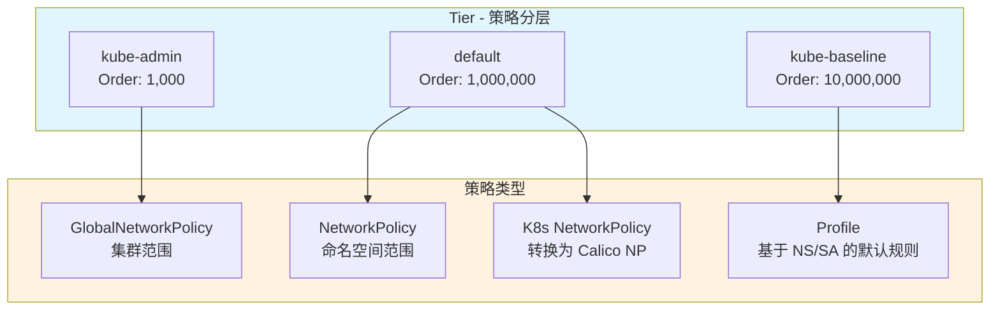
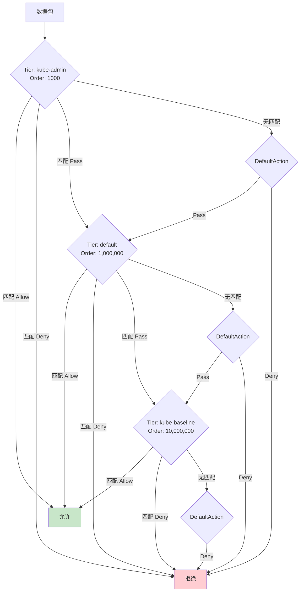
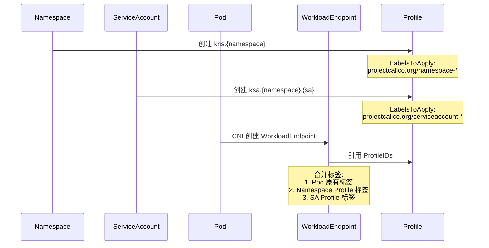
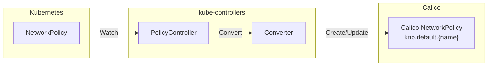
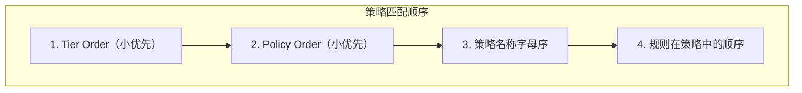

## 概述

Calico 提供了强大而灵活的网络策略模型，支持 Kubernetes 原生 NetworkPolicy 以及 Calico 扩展的 NetworkPolicy 和 GlobalNetworkPolicy。本文深入分析 Calico 策略的数据模型、层级结构、规则语义以及与 Kubernetes NetworkPolicy 的关系。

## 前置知识

- Kubernetes NetworkPolicy 基础
- Calico 架构组件（Felix、kube-controllers）
- 标签选择器语法

## 策略类型总览

### 策略层级结构



### 策略资源对比

| 特性 | K8s NetworkPolicy | Calico NetworkPolicy | GlobalNetworkPolicy |
|------|-------------------|---------------------|---------------------|
| 作用范围 | Namespace | Namespace | 集群 |
| Tier 支持 | 固定 default | 可配置 | 可配置 |
| Order 控制 | 无 | 支持 | 支持 |
| DoNotTrack | 不支持 | 不支持 | 支持 |
| PreDNAT | 不支持 | 不支持 | 支持 |
| ApplyOnForward | 不支持 | 不支持 | 支持 |
| 主机端点 | 不支持 | 不支持 | 支持 |
| 服务账户选择器 | 不支持 | 支持 | 支持 |
| HTTP 规则 | 不支持 | 支持 | 支持 |

## 核心数据结构

### Rule 结构

Rule 是策略的核心单元，定义了匹配条件和动作：

```go
// api/pkg/apis/projectcalico/v3/policy_common.go:36-66

type Rule struct {
    Action      Action                    `json:"action"`           // Allow/Deny/Log/Pass
    IPVersion   *int                      `json:"ipVersion,omitempty"`
    Protocol    *numorstring.Protocol     `json:"protocol,omitempty"`
    ICMP        *ICMPFields               `json:"icmp,omitempty"`
    NotProtocol *numorstring.Protocol     `json:"notProtocol,omitempty"`
    NotICMP     *ICMPFields               `json:"notICMP,omitempty"`
    Source      EntityRule                `json:"source,omitempty"`
    Destination EntityRule                `json:"destination,omitempty"`
    HTTP        *HTTPMatch                `json:"http,omitempty"`   // 应用层策略
    Metadata    *RuleMetadata             `json:"metadata,omitempty"`
}
```

### EntityRule - 端点匹配

```go
// api/pkg/apis/projectcalico/v3/policy_common.go:109-180

type EntityRule struct {
    // 网络匹配
    Nets    []string `json:"nets,omitempty"`     // CIDR 列表
    NotNets []string `json:"notNets,omitempty"`  // 排除的 CIDR

    // 端点选择器
    Selector          string `json:"selector,omitempty"`          // Pod 选择器
    NamespaceSelector string `json:"namespaceSelector,omitempty"` // 命名空间选择器
    NotSelector       string `json:"notSelector,omitempty"`       // 否定选择器

    // 端口匹配
    Ports    []numorstring.Port `json:"ports,omitempty"`
    NotPorts []numorstring.Port `json:"notPorts,omitempty"`

    // 服务匹配
    Services        *ServiceMatch        `json:"services,omitempty"`
    ServiceAccounts *ServiceAccountMatch `json:"serviceAccounts,omitempty"`
}
```

### Action 类型

```go
// api/pkg/apis/projectcalico/v3/policy_common.go:202-209

const (
    Allow Action = "Allow"  // 允许流量
    Deny  Action = "Deny"   // 拒绝流量
    Log   Action = "Log"    // 记录日志，继续处理
    Pass  Action = "Pass"   // 跳过当前 Tier，进入下一个
)
```

**语义说明**：
- `Allow`: 立即允许数据包，不再处理后续规则
- `Deny`: 立即丢弃数据包
- `Log`: 记录日志，继续匹配后续规则
- `Pass`: 跳过当前 Tier 的剩余策略，进入下一个 Tier

## Tier 分层机制

### Tier 结构定义

```go
// api/pkg/apis/projectcalico/v3/tier.go:35-60

type Tier struct {
    metav1.TypeMeta   `json:",inline"`
    metav1.ObjectMeta `json:"metadata"`
    Spec              TierSpec `json:"spec"`
}

type TierSpec struct {
    // Order 决定 Tier 的处理顺序，数值小的先处理
    Order *float64 `json:"order,omitempty"`
    // DefaultAction 当 Tier 内没有策略匹配时的默认动作
    DefaultAction *Action `json:"defaultAction,omitempty"`
}

// 预定义 Tier Order
const (
    KubeAdminTierOrder    = float64(1_000)      // 管理员策略
    DefaultTierOrder      = float64(1_000_000)  // 默认策略
    KubeBaselineTierOrder = float64(10_000_000) // 基线策略
)
```

### Tier 处理流程



## NetworkPolicy 结构

### Calico NetworkPolicy

```go
// api/pkg/apis/projectcalico/v3/networkpolicy.go

type NetworkPolicy struct {
    metav1.TypeMeta   `json:",inline"`
    metav1.ObjectMeta `json:"metadata,omitempty"`
    Spec              NetworkPolicySpec `json:"spec,omitempty"`
}

type NetworkPolicySpec struct {
    // Tier 指定策略所属的层级
    Tier string `json:"tier,omitempty"`

    // Order 在 Tier 内的优先级，数值小的先处理
    Order *float64 `json:"order,omitempty"`

    // Selector 选择此策略应用的端点
    Selector string `json:"selector,omitempty" validate:"selector"`

    // Types 指定策略类型
    Types []PolicyType `json:"types,omitempty"`

    // Ingress 入站规则
    Ingress []Rule `json:"ingress,omitempty"`

    // Egress 出站规则
    Egress []Rule `json:"egress,omitempty"`

    // ServiceAccountSelector 基于 SA 选择端点
    ServiceAccountSelector string `json:"serviceAccountSelector,omitempty"`
}
```

### GlobalNetworkPolicy 扩展字段

```go
// api/pkg/apis/projectcalico/v3/globalnetworkpolicy.go

type GlobalNetworkPolicySpec struct {
    // 继承 NetworkPolicySpec 的所有字段...

    // DoNotTrack 绕过连接追踪，用于高性能场景
    DoNotTrack bool `json:"doNotTrack,omitempty"`

    // PreDNAT 在 DNAT 之前应用，用于 NodePort 等场景
    PreDNAT bool `json:"preDNAT,omitempty"`

    // ApplyOnForward 应用于转发流量（而非本地端点）
    ApplyOnForward bool `json:"applyOnForward,omitempty"`

    // NamespaceSelector 跨命名空间选择端点
    NamespaceSelector string `json:"namespaceSelector,omitempty"`
}
```

## Profile 机制

### Profile 与标签继承

```go
// api/pkg/apis/projectcalico/v3/profile.go:41-60

type Profile struct {
    metav1.TypeMeta   `json:",inline"`
    metav1.ObjectMeta `json:"metadata,omitempty"`
    Spec              ProfileSpec `json:"spec,omitempty"`
}

type ProfileSpec struct {
    // Ingress 入站规则
    Ingress []Rule `json:"ingress,omitempty"`
    // Egress 出站规则
    Egress []Rule `json:"egress,omitempty"`
    // LabelsToApply 应用到端点的标签
    LabelsToApply map[string]string `json:"labelsToApply,omitempty"`
}
```

### Profile 类型

Calico 自动创建以下 Profile：

| 前缀 | 来源 | 用途 |
|------|------|------|
| `kns.` | Namespace | 继承命名空间标签 |
| `ksa.` | ServiceAccount | 继承服务账户标签 |

```go
// libcalico-go/lib/backend/k8s/conversion/constants.go

const (
    NamespaceProfileNamePrefix      = "kns."
    ServiceAccountProfileNamePrefix = "ksa."
    NamespaceLabelPrefix           = "projectcalico.org/namespace-"
    ServiceAccountLabelPrefix      = "projectcalico.org/serviceaccount-"
)
```

### 标签继承流程



## K8s NetworkPolicy 转换

### 转换流程



### 转换代码分析

```go
// kube-controllers/pkg/converter/networkpolicy_converter.go:42-76

func (p *policyConverter) Convert(k8sObj interface{}) (interface{}, error) {
    np := k8sObj.(*networkingv1.NetworkPolicy)

    // 调用核心转换逻辑
    c := conversion.NewConverter()
    kvp, err := c.K8sNetworkPolicyToCalico(np)

    cnp := kvp.Value.(*api.NetworkPolicy)

    // 添加前缀避免命名冲突
    policyName := KubernetesNetworkPolicyEtcdPrefix + np.Name  // "knp.default."
    cnp.ObjectMeta = metav1.ObjectMeta{
        Name:      policyName,
        Namespace: cnp.Namespace,
    }

    return *cnp, err
}
```

### 规则转换

```go
// libcalico-go/lib/backend/k8s/conversion/conversion.go:277-381

func (c converter) K8sNetworkPolicyToCalico(np *networkingv1.NetworkPolicy) (*model.KVPair, error) {
    // K8s NetworkPolicy 固定 Order 为 1000
    order := float64(1000.0)

    // 转换 Ingress 规则
    var ingressRules []apiv3.Rule
    for _, r := range np.Spec.Ingress {
        rules, err := c.k8sRuleToCalico(r.From, r.Ports, true)
        ingressRules = append(ingressRules, rules...)
    }

    // 转换 Egress 规则
    var egressRules []apiv3.Rule
    for _, r := range np.Spec.Egress {
        rules, err := c.k8sRuleToCalico(r.To, r.Ports, false)
        egressRules = append(egressRules, rules...)
    }

    // 转换 PodSelector 为 Calico Selector
    policy := apiv3.NewNetworkPolicy()
    policy.Spec = apiv3.NetworkPolicySpec{
        Order:    &order,
        Selector: k8sSelectorToCalico(&np.Spec.PodSelector, SelectorPod),
        Ingress:  ingressRules,
        Egress:   egressRules,
        Types:    policyTypes,
    }

    return &model.KVPair{
        Key:   model.ResourceKey{Name: np.Name, Namespace: np.Namespace, Kind: model.KindKubernetesNetworkPolicy},
        Value: policy,
    }, nil
}
```

### 选择器转换

```go
// libcalico-go/lib/backend/k8s/conversion/conversion.go:385-433

func k8sSelectorToCalico(s *metav1.LabelSelector, selectorType selectorType) string {
    selectors := []string{}

    // Pod 选择器添加 orchestrator 前缀
    if selectorType == SelectorPod {
        selectors = append(selectors, "projectcalico.org/orchestrator == 'k8s'")
    }

    // 转换 matchLabels
    for k, v := range s.MatchLabels {
        selectors = append(selectors, fmt.Sprintf("%s == '%s'", k, v))
    }

    // 转换 matchExpressions
    for _, e := range s.MatchExpressions {
        switch e.Operator {
        case metav1.LabelSelectorOpIn:
            selectors = append(selectors, fmt.Sprintf("%s in { '%s' }", e.Key, valueList))
        case metav1.LabelSelectorOpNotIn:
            selectors = append(selectors, fmt.Sprintf("%s not in { '%s' }", e.Key, valueList))
        case metav1.LabelSelectorOpExists:
            selectors = append(selectors, fmt.Sprintf("has(%s)", e.Key))
        case metav1.LabelSelectorOpDoesNotExist:
            selectors = append(selectors, fmt.Sprintf("! has(%s)", e.Key))
        }
    }

    return strings.Join(selectors, " && ")
}
```

## 策略匹配语义

### 匹配优先级



### 隐式默认行为

| 策略类型 | 无规则匹配时 | 说明 |
|----------|-------------|------|
| K8s NetworkPolicy | 隐式 Deny | 被选中的 Pod，未匹配规则的流量被拒绝 |
| Calico NetworkPolicy | 取决于 Tier DefaultAction | 通常为 Deny |
| GlobalNetworkPolicy | 取决于 Tier DefaultAction | 可配置 |
| Profile | Allow | 默认允许（命名空间隔离前） |

### 策略评估逻辑

```go
// felix/calc/policy_resolver.go:203-252

func (pr *PolicyResolver) sendEndpointUpdate(endpointID model.EndpointKey) {
    endpoint := pr.endpoints[endpointID.(model.Key)]

    applicableTiers := []TierInfo{}

    // 遍历所有 Tier（按 Order 排序）
    for _, tier := range pr.sortedTierData {
        if !tier.Valid {
            continue
        }

        tierMatches := false
        filteredTier := TierInfo{
            Name:          tier.Name,
            Order:         tier.Order,
            DefaultAction: tier.DefaultAction,
            Valid:         true,
        }

        // 遍历 Tier 内的策略（按 Order 排序）
        for _, polKV := range tier.OrderedPolicies {
            // 检查策略是否匹配此端点
            if pr.endpointIDToPolicyIDs.Contains(endpointID, polKV.Key) {
                tierMatches = true
                filteredTier.OrderedPolicies = append(filteredTier.OrderedPolicies, polKV)
            }
        }

        if tierMatches {
            applicableTiers = append(applicableTiers, filteredTier)
        }
    }

    // 回调通知端点的有效策略列表
    for _, cb := range pr.Callbacks {
        cb.OnEndpointTierUpdate(endpointID, endpoint, peerData, applicableTiers)
    }
}
```

## 策略示例

### 基本 Ingress 策略

```yaml
apiVersion: projectcalico.org/v3
kind: NetworkPolicy
metadata:
  name: allow-web-ingress
  namespace: production
spec:
  selector: app == 'web'
  types:
    - Ingress
  ingress:
    - action: Allow
      protocol: TCP
      source:
        selector: app == 'frontend'
      destination:
        ports:
          - 80
          - 443
```

### 多 Tier 策略

```yaml
# 高优先级安全策略
apiVersion: projectcalico.org/v3
kind: GlobalNetworkPolicy
metadata:
  name: security-block-external
spec:
  tier: kube-admin
  order: 100
  selector: security-zone == 'internal'
  types:
    - Ingress
  ingress:
    - action: Deny
      source:
        nets:
          - 0.0.0.0/0
        notNets:
          - 10.0.0.0/8
          - 172.16.0.0/12
          - 192.168.0.0/16
---
# 默认策略
apiVersion: projectcalico.org/v3
kind: NetworkPolicy
metadata:
  name: allow-internal
  namespace: production
spec:
  tier: default
  order: 1000
  selector: all()
  types:
    - Ingress
  ingress:
    - action: Allow
      source:
        namespaceSelector: environment == 'production'
```

### PreDNAT 策略（NodePort 场景）

```yaml
apiVersion: projectcalico.org/v3
kind: GlobalNetworkPolicy
metadata:
  name: allow-nodeport-ingress
spec:
  preDNAT: true
  applyOnForward: true
  order: 10
  selector: has(node-role.kubernetes.io/worker)
  types:
    - Ingress
  ingress:
    - action: Allow
      protocol: TCP
      destination:
        ports:
          - 30000:32767  # NodePort 范围
```

## 实验

### 实验 1：策略优先级验证

```bash
# 1. 创建测试命名空间和 Pod
kubectl create namespace policy-test
kubectl run web --image=nginx -n policy-test --labels="app=web"
kubectl run client --image=busybox -n policy-test --labels="app=client" -- sleep 3600

# 2. 创建低优先级 Allow 策略
cat <<EOF | calicoctl apply -f -
apiVersion: projectcalico.org/v3
kind: NetworkPolicy
metadata:
  name: low-priority-allow
  namespace: policy-test
spec:
  tier: default
  order: 2000
  selector: app == 'web'
  types:
    - Ingress
  ingress:
    - action: Allow
      source:
        selector: app == 'client'
EOF

# 3. 验证连接成功
kubectl exec -n policy-test client -- wget -qO- --timeout=2 web

# 4. 创建高优先级 Deny 策略
cat <<EOF | calicoctl apply -f -
apiVersion: projectcalico.org/v3
kind: NetworkPolicy
metadata:
  name: high-priority-deny
  namespace: policy-test
spec:
  tier: default
  order: 1000
  selector: app == 'web'
  types:
    - Ingress
  ingress:
    - action: Deny
      source:
        selector: app == 'client'
EOF

# 5. 验证连接被阻止
kubectl exec -n policy-test client -- wget -qO- --timeout=2 web  # 应该超时

# 6. 查看策略排序
calicoctl get networkpolicy -n policy-test -o wide
```

### 实验 2：Tier 层级验证

```bash
# 1. 创建自定义 Tier
cat <<EOF | calicoctl apply -f -
apiVersion: projectcalico.org/v3
kind: Tier
metadata:
  name: security
spec:
  order: 500
  defaultAction: Pass
EOF

# 2. 在 security tier 创建 Pass 策略
cat <<EOF | calicoctl apply -f -
apiVersion: projectcalico.org/v3
kind: GlobalNetworkPolicy
metadata:
  name: security-audit
spec:
  tier: security
  order: 100
  selector: all()
  types:
    - Ingress
    - Egress
  ingress:
    - action: Log
    - action: Pass
  egress:
    - action: Log
    - action: Pass
EOF

# 3. 在 default tier 创建实际策略
cat <<EOF | calicoctl apply -f -
apiVersion: projectcalico.org/v3
kind: NetworkPolicy
metadata:
  name: default-allow-internal
  namespace: policy-test
spec:
  tier: default
  selector: all()
  types:
    - Ingress
  ingress:
    - action: Allow
      source:
        namespaceSelector: all()
EOF

# 4. 验证流量经过两个 Tier
kubectl exec -n policy-test client -- wget -qO- --timeout=2 web

# 5. 查看 Tier 列表
calicoctl get tier -o wide
```

### 实验 3：K8s NetworkPolicy 转换

```bash
# 1. 创建 K8s NetworkPolicy
cat <<EOF | kubectl apply -f -
apiVersion: networking.k8s.io/v1
kind: NetworkPolicy
metadata:
  name: k8s-allow-web
  namespace: policy-test
spec:
  podSelector:
    matchLabels:
      app: web
  policyTypes:
    - Ingress
  ingress:
    - from:
        - podSelector:
            matchLabels:
              app: client
      ports:
        - protocol: TCP
          port: 80
EOF

# 2. 查看转换后的 Calico 策略
calicoctl get networkpolicy -n policy-test knp.default.k8s-allow-web -o yaml

# 3. 验证策略名称前缀
calicoctl get networkpolicy -n policy-test -o wide | grep knp.default
```

## 总结

Calico 策略模型的核心特点：

1. **分层 Tier 机制**：支持多层策略评估，实现安全策略与业务策略分离
2. **Order 优先级**：在 Tier 内部通过 Order 控制策略评估顺序
3. **灵活的动作**：支持 Allow/Deny/Log/Pass 四种动作
4. **丰富的选择器**：支持标签、命名空间、服务账户多维度匹配
5. **K8s 兼容**：自动转换 K8s NetworkPolicy，保持语义一致
6. **Profile 继承**：通过 Profile 实现命名空间和服务账户的标签继承

## 参考资料

- [Calico NetworkPolicy API](https://docs.tigera.io/calico/latest/reference/resources/networkpolicy)
- [Calico GlobalNetworkPolicy API](https://docs.tigera.io/calico/latest/reference/resources/globalnetworkpolicy)
- [Kubernetes NetworkPolicy](https://kubernetes.io/docs/concepts/services-networking/network-policies/)
- 代码路径：`api/pkg/apis/projectcalico/v3/`
