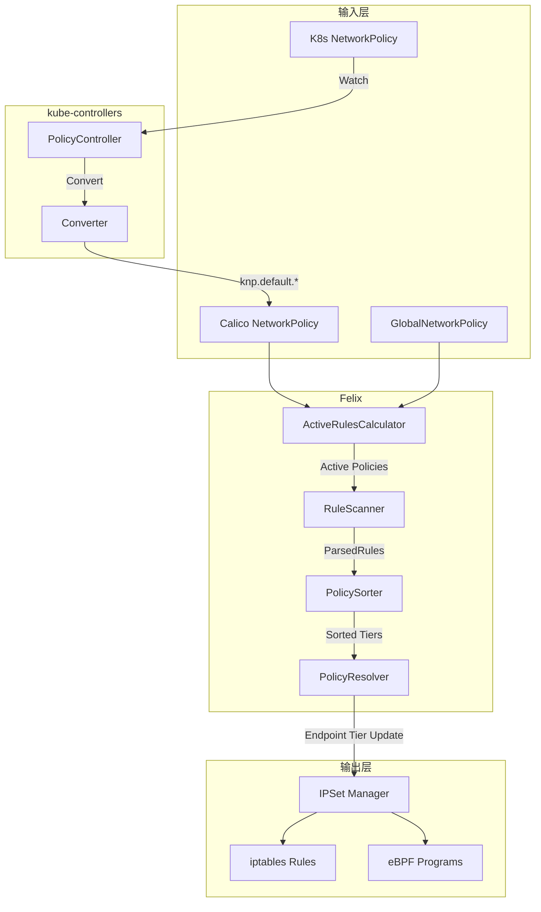
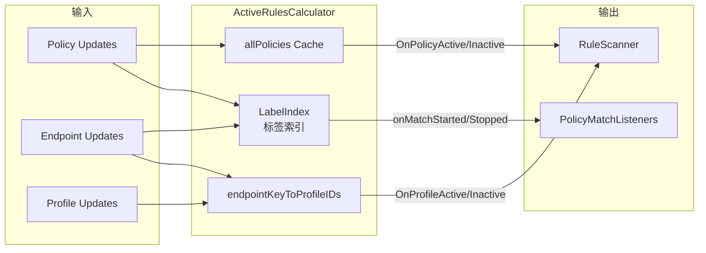
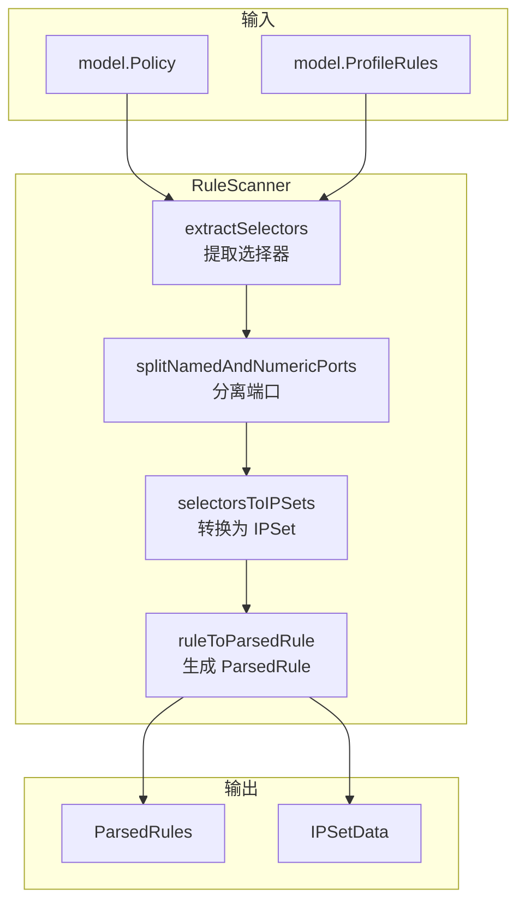
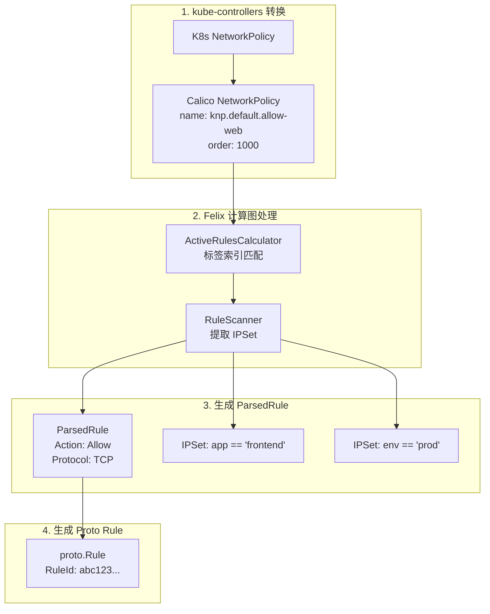

## 概述

本文深入分析 Calico 如何将高级策略定义转换为底层数据平面规则。这个过程涉及多个组件协作：kube-controllers 负责 K8s NetworkPolicy 转换、Felix 计算图负责策略匹配计算、RuleScanner 负责选择器到 IPSet 的转换、最终由数据平面驱动生成具体的 iptables/eBPF 规则。

## 前置知识

- Calico 策略模型
- Felix 计算图架构
- iptables/eBPF 数据平面

## 转换流程总览



## K8s NetworkPolicy 转换

### 转换入口

```go
// kube-controllers/pkg/controllers/networkpolicy/policy_controller.go:98-109

Handler: cache.ResourceEventHandlerFuncs{
    AddFunc: func(obj interface{}) {
        policy, err := policyConverter.Convert(obj)
        if err != nil {
            return
        }
        k := policyConverter.GetKey(policy)
        ccache.Set(k, policy)
    },
    // UpdateFunc 和 DeleteFunc 类似...
}
```

### 核心转换逻辑

```go
// libcalico-go/lib/backend/k8s/conversion/conversion.go:277-381

func (c converter) K8sNetworkPolicyToCalico(np *networkingv1.NetworkPolicy) (*model.KVPair, error) {
    // 1. 固定 Order 为 1000
    order := float64(1000.0)

    // 2. 转换 Ingress 规则
    var ingressRules []apiv3.Rule
    for _, r := range np.Spec.Ingress {
        rules, err := c.k8sRuleToCalico(r.From, r.Ports, true)
        ingressRules = append(ingressRules, rules...)
    }

    // 3. 转换 Egress 规则
    var egressRules []apiv3.Rule
    for _, r := range np.Spec.Egress {
        rules, err := c.k8sRuleToCalico(r.To, r.Ports, false)
        egressRules = append(egressRules, rules...)
    }

    // 4. 确定策略类型
    policyTypes := []apiv3.PolicyType{}
    for _, policyType := range np.Spec.PolicyTypes {
        switch policyType {
        case networkingv1.PolicyTypeIngress:
            policyTypes = append(policyTypes, apiv3.PolicyTypeIngress)
        case networkingv1.PolicyTypeEgress:
            policyTypes = append(policyTypes, apiv3.PolicyTypeEgress)
        }
    }

    // 5. 构建 Calico NetworkPolicy
    policy := apiv3.NewNetworkPolicy()
    policy.Spec = apiv3.NetworkPolicySpec{
        Order:    &order,
        Selector: k8sSelectorToCalico(&np.Spec.PodSelector, SelectorPod),
        Ingress:  ingressRules,
        Egress:   egressRules,
        Types:    policyTypes,
    }

    return &model.KVPair{
        Key:   model.ResourceKey{Name: np.Name, Namespace: np.Namespace, Kind: model.KindKubernetesNetworkPolicy},
        Value: policy,
    }, nil
}
```

### 规则转换详情

```go
// libcalico-go/lib/backend/k8s/conversion/conversion.go:435-566

func (c converter) k8sRuleToCalico(
    rPeers []networkingv1.NetworkPolicyPeer,
    rPorts []networkingv1.NetworkPolicyPort,
    ingress bool,
) ([]apiv3.Rule, error) {
    // 1. 按协议分组端口
    protocolPorts := map[string][]numorstring.Port{}
    for _, port := range ports {
        protocol, calicoPorts, err := c.k8sPortToCalicoFields(port)
        pStr := protocol.String()
        protocolPorts[pStr] = append(protocolPorts[pStr], calicoPorts...)
    }

    // 2. 生成规则（每个协议一条规则）
    for _, protocolStr := range protocols {
        calicoPorts := protocolPorts[protocolStr]
        calicoPorts = SimplifyPorts(calicoPorts)  // 端口范围合并优化

        for _, peer := range peers {
            // 转换 peer 为 Calico 字段
            selector, nsSelector, nets, notNets := c.k8sPeerToCalicoFields(peer)

            if ingress {
                rules = append(rules, apiv3.Rule{
                    Action:   "Allow",
                    Protocol: protocol,
                    Source: apiv3.EntityRule{
                        Selector:          selector,
                        NamespaceSelector: nsSelector,
                        Nets:              nets,
                        NotNets:           notNets,
                    },
                    Destination: apiv3.EntityRule{
                        Ports: calicoPorts,
                    },
                })
            } else {
                // Egress 规则，Destination 包含选择器
                rules = append(rules, apiv3.Rule{
                    Action:   "Allow",
                    Protocol: protocol,
                    Destination: apiv3.EntityRule{
                        Ports:             calicoPorts,
                        Selector:          selector,
                        NamespaceSelector: nsSelector,
                        Nets:              nets,
                        NotNets:           notNets,
                    },
                })
            }
        }
    }
    return rules, nil
}
```

### 端口范围优化

```go
// libcalico-go/lib/backend/k8s/conversion/conversion.go:568-628

// SimplifyPorts 将离散端口合并为连续范围
// 输入: [80, 81, 82, 9090, "foo"]
// 输出: [80-82, 9090, "foo"]
func SimplifyPorts(ports []numorstring.Port) []numorstring.Port {
    if len(ports) <= 1 {
        return ports
    }

    var numericPorts []int
    var outputPorts []numorstring.Port

    // 1. 分离数字端口和命名端口
    for _, p := range ports {
        if p.PortName != "" {
            outputPorts = append(outputPorts, p)  // 命名端口直接传递
        } else {
            for i := int(p.MinPort); i <= int(p.MaxPort); i++ {
                numericPorts = append(numericPorts, i)
            }
        }
    }

    // 2. 排序数字端口
    sort.Ints(numericPorts)

    // 3. 合并连续端口为范围
    for len(numericPorts) > 0 {
        firstPortInRange := numericPorts[0]
        lastPortInRange := firstPortInRange
        numericPorts = numericPorts[1:]

        for len(numericPorts) > 0 {
            nextPort := numericPorts[0]
            if nextPort > lastPortInRange+1 {
                break  // 不连续，开始新范围
            }
            lastPortInRange = nextPort
            numericPorts = numericPorts[1:]
        }

        outputPorts = appendPortRange(outputPorts, firstPortInRange, lastPortInRange)
    }

    return outputPorts
}
```

## Felix 策略处理流程

### ActiveRulesCalculator



### 策略匹配计算

```go
// felix/calc/active_rules_calculator.go:141-284

func (arc *ActiveRulesCalculator) OnUpdate(update api.Update) (_ bool) {
    switch key := update.Key.(type) {
    case model.PolicyKey:
        oldPolicy, _ := arc.allPolicies.Get(key)

        if update.Value != nil {
            policy := update.Value.(*model.Policy)
            arc.allPolicies.Set(key, policy)

            // 解析策略选择器并更新标签索引
            sel, err := selector.Parse(policy.Selector)
            arc.labelIndex.UpdateSelector(key, sel)

            // 如果策略匹配了某些端点，通知 RuleScanner
            if arc.policyIDToEndpointKeys.ContainsKey(key) {
                arc.sendPolicyUpdate(key, policy)
            }
        } else {
            arc.allPolicies.Delete(key)
            arc.labelIndex.DeleteSelector(key)
        }

    case model.WorkloadEndpointKey:
        if update.Value != nil {
            endpoint := update.Value.(*model.WorkloadEndpoint)
            profileIDs := endpoint.ProfileIDs
            arc.updateEndpointProfileIDs(key, profileIDs)
        } else {
            arc.updateEndpointProfileIDs(key, []string{})
        }
        // 更新标签索引
        arc.labelIndex.OnUpdate(update)
    }
    return
}
```

### 匹配事件处理

```go
// felix/calc/active_rules_calculator.go:352-391

func (arc *ActiveRulesCalculator) onMatchStarted(selID, labelId interface{}) {
    polKey := selID.(model.PolicyKey)
    policyWasActive := arc.policyIDToEndpointKeys.ContainsKey(polKey)
    arc.policyIDToEndpointKeys.Put(selID, labelId)

    if !policyWasActive {
        // 策略首次激活，通知 RuleScanner
        policy, _ := arc.allPolicies.Get(polKey)
        arc.sendPolicyUpdate(polKey, policy)
    }

    // 通知 PolicyMatchListeners
    if labelId, ok := labelId.(model.EndpointKey); ok {
        for _, l := range arc.PolicyMatchListeners {
            l.OnPolicyMatch(polKey, labelId)
        }
    }
}

func (arc *ActiveRulesCalculator) onMatchStopped(selID, labelId interface{}) {
    polKey := selID.(model.PolicyKey)
    arc.policyIDToEndpointKeys.Discard(selID, labelId)

    if !arc.policyIDToEndpointKeys.ContainsKey(selID) {
        // 策略不再活跃
        policy, _ := arc.allPolicies.Get(polKey)
        arc.sendPolicyUpdate(polKey, policy)
    }

    if labelId, ok := labelId.(model.EndpointKey); ok {
        for _, l := range arc.PolicyMatchListeners {
            l.OnPolicyMatchStopped(polKey, labelId)
        }
    }
}
```

## RuleScanner - 规则扫描

### 功能概述

RuleScanner 负责：
1. 扫描规则中的选择器和命名端口
2. 将选择器转换为 IPSet 定义
3. 生成 ParsedRule 中间表示
4. 追踪活跃的 IPSet

### 规则扫描流程



### 核心数据结构

```go
// felix/calc/rule_scanner.go:290-309

type ParsedRules struct {
    Namespace        string           // 命名空间（NetworkPolicy）
    InboundRules     []*ParsedRule
    OutboundRules    []*ParsedRule
    Untracked        bool             // DoNotTrack 策略
    PreDNAT          bool             // PreDNAT 策略
    Tier             string
    OriginalSelector string
    PerformanceHints []apiv3.PolicyPerformanceHint
}

type ParsedRule struct {
    Action   string
    Protocol *numorstring.Protocol

    // 正向匹配
    SrcNets              []*net.IPNet
    SrcPorts             []numorstring.Port
    SrcNamedPortIPSetIDs []string    // 命名端口 -> IPSet ID
    SrcIPSetIDs          []string    // 选择器 -> IPSet ID
    DstNets              []*net.IPNet
    DstPorts             []numorstring.Port
    DstNamedPortIPSetIDs []string
    DstIPSetIDs          []string
    DstIPPortSetIDs      []string    // Service -> IPSet ID

    // 否定匹配
    NotSrcNets              []*net.IPNet
    NotSrcIPSetIDs          []string
    // ... 其他否定字段
}
```

### 规则转换实现

```go
// felix/calc/rule_scanner.go:369-509

func ruleToParsedRule(rule *model.Rule) (parsedRule *ParsedRule, allIPSets []*IPSetData) {
    // 1. 提取选择器
    srcSel, dstSel, notSrcSels, notDstSels := extractSelectors(rule)

    // 2. 分离数字端口和命名端口
    srcNumericPorts, srcNamedPorts := splitNamedAndNumericPorts(rule.SrcPorts)
    dstNumericPorts, dstNamedPorts := splitNamedAndNumericPorts(rule.DstPorts)

    // 3. 确定协议（用于命名端口）
    namedPortProto := ipsetmember.ProtocolTCP
    if rule.Protocol != nil {
        if ipsetmember.ProtocolUDP.MatchesModelProtocol(*rule.Protocol) {
            namedPortProto = ipsetmember.ProtocolUDP
        }
    }

    // 4. 命名端口转 IPSet
    srcNamedPortIPSets := namedPortsToIPSets(srcNamedPorts, srcSel, namedPortProto)
    dstNamedPortIPSets := namedPortsToIPSets(dstNamedPorts, dstSel, namedPortProto)

    // 5. 选择器转 IPSet（优化：如果只有命名端口，可跳过）
    var srcSelIPSets, dstSelIPSets []*IPSetData
    if len(srcNumericPorts) > 0 || len(srcNamedPorts) == 0 {
        srcSelIPSets = selectorsToIPSets(srcSel)
    }

    // 6. Service 匹配
    var dstIPPortSets []*IPSetData
    if rule.DstService != "" {
        svc := fmt.Sprintf("%s/%s", rule.DstServiceNamespace, rule.DstService)
        dstIPPortSets = append(dstIPPortSets, &IPSetData{
            Service:             svc,
            ServiceIncludePorts: true,
        })
    }

    // 7. 构建 ParsedRule
    parsedRule = &ParsedRule{
        Action:               rule.Action,
        Protocol:             rule.Protocol,
        SrcNets:              rule.AllSrcNets(),
        SrcPorts:             srcNumericPorts,
        SrcNamedPortIPSetIDs: ipSetsToUIDs(srcNamedPortIPSets),
        SrcIPSetIDs:          ipSetsToUIDs(srcSelIPSets),
        DstNets:              rule.AllDstNets(),
        DstPorts:             dstNumericPorts,
        DstNamedPortIPSetIDs: ipSetsToUIDs(dstNamedPortIPSets),
        DstIPSetIDs:          ipSetsToUIDs(dstSelIPSets),
        DstIPPortSetIDs:      ipSetsToUIDs(dstIPPortSets),
        // ...
    }

    // 8. 收集所有 IPSet
    allIPSets = append(allIPSets, srcNamedPortIPSets...)
    allIPSets = append(allIPSets, dstNamedPortIPSets...)
    allIPSets = append(allIPSets, srcSelIPSets...)
    allIPSets = append(allIPSets, dstSelIPSets...)
    allIPSets = append(allIPSets, dstIPPortSets...)

    return
}
```

### IPSet 唯一 ID 生成

```go
// felix/calc/rule_scanner.go:113-136

func (d *IPSetData) UniqueID() string {
    if d.cachedUID == "" {
        if d.Service != "" {
            // Service 类型 IPSet
            if d.ServiceIncludePorts {
                d.cachedUID = hash.MakeUniqueID("svc", d.Service)
            } else {
                d.cachedUID = hash.MakeUniqueID("svcnoport", d.Service)
            }
        } else {
            // 选择器/命名端口类型 IPSet
            selID := d.Selector.UniqueID()
            if d.NamedPortProtocol == ipsetmember.ProtocolNone {
                d.cachedUID = selID
            } else {
                idToHash := selID + "," + d.NamedPortProtocol.String() + "," + d.NamedPort
                d.cachedUID = hash.MakeUniqueID("n", idToHash)
            }
        }
    }
    return d.cachedUID
}
```

## 规则到 Proto 转换

### 转换入口

```go
// felix/calc/rule_convert.go:36-43

func parsedRulesToProtoRules(in []*ParsedRule, ruleIDSeed string) (out []*proto.Rule) {
    out = make([]*proto.Rule, len(in))
    for ii, inRule := range in {
        out[ii] = parsedRuleToProtoRule(inRule)
    }
    // 生成规则 ID（用于日志和调试）
    fillInRuleIDs(out, ruleIDSeed)
    return
}
```

### 规则 ID 生成

```go
// felix/calc/rule_convert.go:45-89

func fillInRuleIDs(rules []*proto.Rule, ruleIDSeed string) {
    s := sha256.New224()
    s.Write([]byte(ruleIDSeed))
    hash := s.Sum(nil)

    for ii, rule := range rules {
        // 链式哈希：每个规则的 ID 依赖前面所有规则
        s.Reset()
        s.Write(hash)

        // 序列化规则并加入哈希
        rule.RuleId = ""
        data, _ := googleproto.Marshal(rule)
        s.Write(data)

        hash = s.Sum(hash[0:0])

        // Base64 编码，取前 16 字符
        ruleID := base64.RawURLEncoding.EncodeToString(hash)[:RuleIDLength]
        rule.RuleId = ruleID
    }
}
```

### Proto 规则结构

```go
// felix/calc/rule_convert.go:91-215

func parsedRuleToProtoRule(in *ParsedRule) *proto.Rule {
    out := &proto.Rule{
        Action:    in.Action,
        IpVersion: ipVersionToProtoIPVersion(in.IPVersion, in.Protocol),
        Protocol:  protocolToProtoProtocol(in.Protocol),

        // 源匹配
        SrcNet:               ipNetsToProtoStrings(in.SrcNets),
        SrcPorts:             portsToProtoPorts(in.SrcPorts),
        SrcNamedPortIpSetIds: in.SrcNamedPortIPSetIDs,
        SrcIpSetIds:          in.SrcIPSetIDs,

        // 目标匹配
        DstNet:               ipNetsToProtoStrings(in.DstNets),
        DstPorts:             portsToProtoPorts(in.DstPorts),
        DstNamedPortIpSetIds: in.DstNamedPortIPSetIDs,
        DstIpSetIds:          in.DstIPSetIDs,
        DstIpPortSetIds:      in.DstIPPortSetIDs,

        // 否定匹配
        NotSrcNet:    ipNetsToProtoStrings(in.NotSrcNets),
        NotDstNet:    ipNetsToProtoStrings(in.NotDstNets),
        // ...

        // HTTP 匹配（应用层策略）
        HttpMatch: convertHTTPMatch(in.HTTPMatch),
    }

    // ICMP 匹配
    if in.ICMPType != nil {
        if in.ICMPCode != nil {
            out.Icmp = &proto.Rule_IcmpTypeCode{
                IcmpTypeCode: &proto.IcmpTypeAndCode{
                    Type: int32(*in.ICMPType),
                    Code: int32(*in.ICMPCode),
                },
            }
        } else {
            out.Icmp = &proto.Rule_IcmpType{
                IcmpType: int32(*in.ICMPType),
            }
        }
    }

    return out
}
```

## PolicyResolver - 策略解析

### 策略排序

```go
// felix/calc/policy_sorter.go:31-66

type PolicySorter struct {
    tiers       map[string]*TierInfo
    sortedTiers *btree.BTreeG[tierInfoKey]
}

func (poc *PolicySorter) Sorted() []*TierInfo {
    var tiers []*TierInfo
    // 遍历排序后的 Tier
    poc.sortedTiers.Ascend(func(t tierInfoKey) bool {
        if ti := poc.tiers[t.Name]; ti != nil {
            // 提取排序后的策略列表
            ti.OrderedPolicies = make([]PolKV, 0, len(ti.Policies))
            ti.SortedPolicies.Ascend(func(kv PolKV) bool {
                ti.OrderedPolicies = append(ti.OrderedPolicies, kv)
                return true
            })
            tiers = append(tiers, ti)
        }
        return true
    })
    return tiers
}
```

### 排序规则

```go
// felix/calc/policy_sorter.go:146-161

func TierLess(i, j tierInfoKey) bool {
    // 1. 有效 Tier 优先于无效 Tier
    if !i.Valid && j.Valid {
        return false
    } else if i.Valid && !j.Valid {
        return true
    }

    // 2. 有 Order 的优先于无 Order 的
    if i.Order == nil && j.Order != nil {
        return false
    } else if i.Order != nil && j.Order == nil {
        return true
    }

    // 3. Order 相同时按名称排序
    if i.Order == j.Order || *i.Order == *j.Order {
        return i.Name < j.Name
    }

    // 4. Order 小的优先
    return *i.Order < *j.Order
}

// felix/calc/policy_sorter.go:388-400

func PolKVLess(i, j PolKV) bool {
    // Order 相同时，按 Name/Namespace/Kind 排序
    if i.Value.Order == j.Value.Order {
        iStr := fmt.Sprintf("%s/%s/%s", i.Key.Name, i.Key.Namespace, i.Key.Kind)
        jStr := fmt.Sprintf("%s/%s/%s", j.Key.Name, j.Key.Namespace, j.Key.Kind)
        return iStr < jStr
    }
    return i.Value.Order < j.Value.Order
}
```

### 端点策略更新

```go
// felix/calc/policy_resolver.go:203-252

func (pr *PolicyResolver) sendEndpointUpdate(endpointID model.EndpointKey) {
    endpoint := pr.endpoints[endpointID.(model.Key)]

    applicableTiers := []TierInfo{}

    // 遍历所有 Tier
    for _, tier := range pr.sortedTierData {
        if !tier.Valid {
            continue
        }

        tierMatches := false
        filteredTier := TierInfo{
            Name:          tier.Name,
            Order:         tier.Order,
            DefaultAction: tier.DefaultAction,
            Valid:         true,
        }

        // 过滤出匹配此端点的策略
        for _, polKV := range tier.OrderedPolicies {
            if pr.endpointIDToPolicyIDs.Contains(endpointID, polKV.Key) {
                tierMatches = true
                filteredTier.OrderedPolicies = append(filteredTier.OrderedPolicies, polKV)
            }
        }

        if tierMatches {
            applicableTiers = append(applicableTiers, filteredTier)
        }
    }

    // 回调通知
    for _, cb := range pr.Callbacks {
        cb.OnEndpointTierUpdate(endpointID, endpoint, peerData, applicableTiers)
    }
}
```

## 完整转换示例

### 输入：K8s NetworkPolicy

```yaml
apiVersion: networking.k8s.io/v1
kind: NetworkPolicy
metadata:
  name: allow-web
  namespace: production
spec:
  podSelector:
    matchLabels:
      app: web
  policyTypes:
    - Ingress
  ingress:
    - from:
        - podSelector:
            matchLabels:
              app: frontend
        - namespaceSelector:
            matchLabels:
              env: prod
      ports:
        - protocol: TCP
          port: 80
        - protocol: TCP
          port: 443
```

### 转换过程



### 输出：Proto Rule

```go
&proto.Rule{
    RuleId:   "abc123def456...",
    Action:   "Allow",
    Protocol: &proto.Protocol{NumberOrName: &proto.Protocol_Name{Name: "TCP"}},

    // 源匹配（两个 IPSet，OR 关系）
    SrcIpSetIds: []string{
        "s:QW1wPT1mdWxsPT1...",  // app == 'frontend'
        "s:ZW52PT1wcm9kCg...",   // env == 'prod' (namespace selector)
    },

    // 目标端口
    DstPorts: []*proto.PortRange{
        {First: 80, Last: 80},
        {First: 443, Last: 443},
    },
}
```

## 实验

### 实验 1：追踪策略转换

```bash
# 1. 创建 K8s NetworkPolicy
cat <<EOF | kubectl apply -f -
apiVersion: networking.k8s.io/v1
kind: NetworkPolicy
metadata:
  name: test-convert
  namespace: default
spec:
  podSelector:
    matchLabels:
      app: test
  ingress:
    - from:
        - podSelector:
            matchLabels:
              role: client
      ports:
        - port: 8080
EOF

# 2. 查看转换后的 Calico 策略
calicoctl get networkpolicy -n default knp.default.test-convert -o yaml

# 3. 查看生成的 IPSet
sudo ipset list | grep cali

# 4. 查看 iptables 规则
sudo iptables -L cali-pi-* -v -n
```

### 实验 2：观察策略排序

```bash
# 1. 创建多个不同 Order 的策略
cat <<EOF | calicoctl apply -f -
apiVersion: projectcalico.org/v3
kind: NetworkPolicy
metadata:
  name: policy-high
  namespace: default
spec:
  order: 100
  selector: all()
  ingress:
    - action: Log
---
apiVersion: projectcalico.org/v3
kind: NetworkPolicy
metadata:
  name: policy-low
  namespace: default
spec:
  order: 200
  selector: all()
  ingress:
    - action: Log
EOF

# 2. 查看排序后的策略列表
calicoctl get networkpolicy -n default -o wide

# 3. 启用 Felix debug 日志
kubectl set env daemonset/calico-node -n kube-system FELIX_LOGSEVERITYSYS=debug

# 4. 查看 Felix 日志中的策略计算
kubectl logs -n kube-system -l k8s-app=calico-node -c calico-node | grep "Policy"
```

### 实验 3：IPSet 生命周期

```bash
# 1. 创建策略触发 IPSet 创建
cat <<EOF | calicoctl apply -f -
apiVersion: projectcalico.org/v3
kind: NetworkPolicy
metadata:
  name: ipset-test
  namespace: default
spec:
  selector: app == 'web'
  ingress:
    - action: Allow
      source:
        selector: app == 'client'
EOF

# 2. 查看新创建的 IPSet
sudo ipset list | head -50

# 3. 创建匹配的 Pod
kubectl run web --image=nginx --labels="app=web"
kubectl run client --image=busybox --labels="app=client" -- sleep 3600

# 4. 观察 IPSet 成员变化
sudo ipset list | grep -A 20 "cali"

# 5. 删除策略，观察 IPSet 清理
calicoctl delete networkpolicy -n default ipset-test
sudo ipset list | grep "cali" | wc -l
```

## 总结

策略到规则的转换是一个多阶段流水线：

1. **K8s 转换**：kube-controllers 将 K8s NetworkPolicy 转换为 Calico NetworkPolicy
2. **策略激活**：ActiveRulesCalculator 通过标签索引确定哪些策略匹配哪些端点
3. **规则扫描**：RuleScanner 提取选择器，生成 IPSet 定义和 ParsedRule
4. **策略排序**：PolicySorter 按 Tier 和 Order 排序
5. **端点解析**：PolicyResolver 为每个端点计算完整的策略列表
6. **Proto 转换**：生成最终的 proto.Rule，包含规则 ID

关键优化：
- 端口范围合并（SimplifyPorts）
- 选择器与命名端口合并（减少 IPSet 数量）
- 增量更新（只更新变化的策略/端点）

## 参考资料

- 代码路径：`felix/calc/rule_scanner.go`
- 代码路径：`felix/calc/rule_convert.go`
- 代码路径：`felix/calc/policy_resolver.go`
- 代码路径：`libcalico-go/lib/backend/k8s/conversion/conversion.go`
