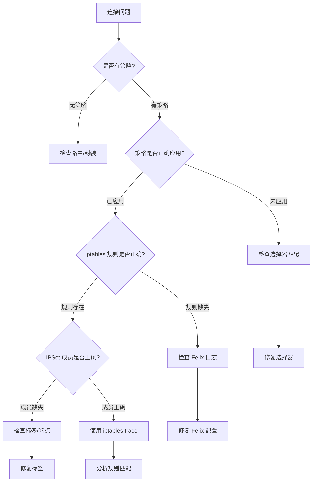

## 概述

网络策略问题是 Kubernetes 网络中最常见的故障类型之一。本文提供系统化的策略调试方法，涵盖从策略验证、规则检查到流量追踪的完整调试流程。

## 前置知识

- Calico 策略模型
- iptables 基础
- calicoctl 使用
- kubectl 使用

## 调试思路框架



## 工具准备

### calicoctl 安装

```bash
# 下载 calicoctl
curl -O -L https://github.com/projectcalico/calico/releases/download/v3.27.0/calicoctl-linux-amd64
chmod +x calicoctl-linux-amd64
sudo mv calicoctl-linux-amd64 /usr/local/bin/calicoctl

# 配置访问
export CALICO_DATASTORE_TYPE=kubernetes
export CALICO_KUBECONFIG=~/.kube/config
```

### 常用诊断工具

```bash
# 安装网络诊断工具
sudo apt-get install -y tcpdump conntrack ipset iptables

# eBPF 调试工具
sudo apt-get install -y bpftool linux-tools-$(uname -r)
```

## 策略检查

### 查看策略列表

```bash
# 查看所有 NetworkPolicy
calicoctl get networkpolicy -A -o wide

# 查看 GlobalNetworkPolicy
calicoctl get globalnetworkpolicy -o wide

# 查看 K8s NetworkPolicy（转换后）
calicoctl get networkpolicy -n default | grep knp.default

# 查看 Tier
calicoctl get tier -o wide
```

### 查看策略详情

```bash
# 查看策略 YAML
calicoctl get networkpolicy -n production allow-web -o yaml

# 查看策略应用的端点
calicoctl get workloadendpoint -A -o wide | grep <pod-name>
```

### 策略评估

```bash
# 查看端点详情（包括策略列表）
calicoctl get workloadendpoint <node>-k8s-<pod>-eth0 -o yaml

# 检查端点的 Profiles
kubectl get pod <pod-name> -o jsonpath='{.metadata.namespace}' | \
  xargs -I {} echo "kns.{}"
```

## 选择器验证

### 检查 Pod 标签

```bash
# 查看 Pod 标签
kubectl get pod -n production web-pod -o jsonpath='{.metadata.labels}' | jq

# 查看所有匹配标签的 Pod
kubectl get pod -A -l app=web

# 检查标签格式
kubectl get pod -n production web-pod -o yaml | grep -A 20 "labels:"
```

### 验证选择器语法

```bash
# 使用 calicoctl 验证选择器
calicoctl get workloadendpoint -A -l "app == 'web'"

# 检查命名空间选择器
calicoctl get workloadendpoint -A -l "projectcalico.org/namespace == 'production'"

# 复杂选择器测试
calicoctl get workloadendpoint -A -l "app == 'web' && environment in {'prod', 'staging'}"
```

### 常见选择器问题

| 问题 | 错误示例 | 正确写法 |
|------|---------|---------|
| 引号不匹配 | `app == "web'` | `app == 'web'` |
| 操作符错误 | `app = 'web'` | `app == 'web'` |
| 集合语法 | `app in ['a', 'b']` | `app in {'a', 'b'}` |
| 空格问题 | `app=='web'` | `app == 'web'` |
| 布尔运算 | `app == 'web' AND env == 'prod'` | `app == 'web' && env == 'prod'` |

## iptables 规则检查

### 查看 Calico 链

```bash
# 查看 filter 表中的 Calico 链
sudo iptables -L -v -n | grep -E "^Chain cali"

# 查看特定策略链
sudo iptables -L cali-pi-<policy-hash> -v -n

# 查看 workload 分发链
sudo iptables -L cali-tw-<endpoint-id> -v -n
sudo iptables -L cali-fw-<endpoint-id> -v -n

# 查看所有 Calico 规则（包含行号）
sudo iptables -L -v -n --line-numbers | grep -A 100 "cali"
```

### 链命名规则

```
cali-PREROUTING     - PREROUTING 入口
cali-INPUT          - INPUT 入口
cali-FORWARD        - FORWARD 入口
cali-OUTPUT         - OUTPUT 入口
cali-POSTROUTING    - POSTROUTING 入口

cali-pi-<hash>      - Policy Ingress 链
cali-po-<hash>      - Policy Egress 链

cali-pri-<hash>     - Profile Ingress 链
cali-pro-<hash>     - Profile Egress 链

cali-tw-<id>        - To Workload（入站）
cali-fw-<id>        - From Workload（出站）

cali-wl-to-host     - Workload 到 Host
cali-from-wl-dispatch - Workload 出站分发
cali-to-wl-dispatch   - Workload 入站分发
```

### 规则匹配追踪

```bash
# 1. 启用 iptables trace
sudo iptables -t raw -A PREROUTING -p tcp --dport 80 -j TRACE
sudo iptables -t raw -A OUTPUT -p tcp --dport 80 -j TRACE

# 2. 触发流量
kubectl exec client-pod -- curl web-pod:80

# 3. 查看 trace 日志
sudo dmesg | grep TRACE | tail -50

# 4. 清理 trace 规则
sudo iptables -t raw -D PREROUTING -p tcp --dport 80 -j TRACE
sudo iptables -t raw -D OUTPUT -p tcp --dport 80 -j TRACE
```

### 规则计数分析

```bash
# 重置规则计数器
sudo iptables -Z

# 触发流量
kubectl exec client-pod -- curl web-pod:80

# 查看匹配的规则
sudo iptables -L -v -n | grep -v " 0 " | head -50
```

## IPSet 检查

### 查看 Calico IPSet

```bash
# 列出所有 Calico IPSet
sudo ipset list | grep "^Name:" | grep cali

# 查看特定 IPSet 详情
sudo ipset list cali40s:QW1wPT1mdWxsPT1...

# 查看 IPSet 成员数量
sudo ipset list | grep -A 3 "^Name: cali" | grep "Number of entries"

# 统计 IPSet 数量
sudo ipset list | grep "^Name:" | wc -l
```

### IPSet 类型

```
cali40s:   - 选择器 IPSet（hash:net）
cali40n:   - 命名端口 IPSet（hash:ip,port）
cali40svc: - Service IPSet
cali40all: - 特殊 IPSet
```

### 验证 IPSet 成员

```bash
# 获取 Pod IP
POD_IP=$(kubectl get pod web-pod -o jsonpath='{.status.podIP}')

# 检查 IP 是否在 IPSet 中
sudo ipset test cali40s:QW1wPT1... $POD_IP

# 查看 IPSet 成员
sudo ipset list cali40s:QW1wPT1... | tail -20
```

## Felix 日志分析

### 启用 Debug 日志

```bash
# 通过 FelixConfiguration
cat <<EOF | calicoctl apply -f -
apiVersion: projectcalico.org/v3
kind: FelixConfiguration
metadata:
  name: default
spec:
  logSeverityScreen: Debug
EOF

# 或通过环境变量
kubectl set env daemonset/calico-node -n kube-system FELIX_LOGSEVERITYSYS=debug
```

### 查看 Felix 日志

```bash
# 查看 Felix 日志
kubectl logs -n kube-system -l k8s-app=calico-node -c calico-node --tail=100

# 过滤策略相关日志
kubectl logs -n kube-system -l k8s-app=calico-node -c calico-node | grep -i "policy"

# 过滤端点相关日志
kubectl logs -n kube-system -l k8s-app=calico-node -c calico-node | grep -i "endpoint"

# 过滤 IPSet 相关日志
kubectl logs -n kube-system -l k8s-app=calico-node -c calico-node | grep -i "ipset"
```

### 关键日志模式

```bash
# 策略激活
grep "Policy.*active" felix.log

# 端点更新
grep "Endpoint.*update" felix.log

# 规则编程
grep "Programming" felix.log

# 同步状态
grep "In sync" felix.log

# 错误和警告
grep -E "ERROR|WARN" felix.log
```

## eBPF 数据平面调试

### 检查 eBPF 程序

```bash
# 查看加载的 BPF 程序
sudo bpftool prog show | grep -A 5 "cali"

# 查看 BPF Maps
sudo bpftool map show | grep -A 3 "cali"

# 查看接口上的 TC 程序
tc filter show dev eth0 ingress
tc filter show dev eth0 egress
```

### eBPF 连接追踪

```bash
# 查看 conntrack map
sudo bpftool map dump name cali_v4_ct

# 查看 NAT map
sudo bpftool map dump name cali_v4_nat_fe

# 查看策略 map
sudo bpftool map dump name cali_v4_pol
```

### eBPF 调试日志

```bash
# 启用 eBPF debug
cat <<EOF | calicoctl apply -f -
apiVersion: projectcalico.org/v3
kind: FelixConfiguration
metadata:
  name: default
spec:
  bpfLogLevel: Debug
EOF

# 查看 BPF trace 日志
sudo cat /sys/kernel/debug/tracing/trace_pipe
```

## 流量追踪

### tcpdump 抓包

```bash
# 在 Pod 接口抓包
POD_IFNAME=$(kubectl exec -n production web-pod -- cat /sys/class/net/eth0/iflink)
HOST_IFNAME=$(ip link | grep "^$POD_IFNAME:" | awk -F: '{print $2}')
sudo tcpdump -i $HOST_IFNAME -nn

# 抓取特定端口
sudo tcpdump -i cali+ port 80 -nn

# 保存到文件
sudo tcpdump -i cali+ -w /tmp/capture.pcap
```

### conntrack 分析

```bash
# 查看连接追踪表
sudo conntrack -L | grep <pod-ip>

# 实时监控新连接
sudo conntrack -E | grep <pod-ip>

# 查看连接统计
sudo conntrack -C
```

## 常见问题排查

### 问题 1：策略不生效

```bash
# 检查步骤
# 1. 确认策略存在
calicoctl get networkpolicy -n <namespace> -o wide

# 2. 检查选择器匹配
kubectl get pod -n <namespace> -l <selector>
calicoctl get workloadendpoint -n <namespace> | grep <pod>

# 3. 检查 iptables 规则
sudo iptables -L cali-pi-<hash> -v -n

# 4. 检查 IPSet
sudo ipset list | grep -A 10 "cali40s"

# 5. 查看 Felix 日志
kubectl logs -n kube-system <calico-node-pod> -c calico-node | grep -i error
```

### 问题 2：Pod 无法访问外部

```bash
# 检查 egress 策略
calicoctl get networkpolicy -n <namespace> -o yaml | grep -A 20 "egress"

# 检查 GlobalNetworkPolicy
calicoctl get globalnetworkpolicy -o yaml | grep -A 20 "egress"

# 检查 NAT 规则
sudo iptables -t nat -L POSTROUTING -v -n | grep MASQ

# 检查默认路由
kubectl exec <pod> -- ip route
```

### 问题 3：跨命名空间访问失败

```bash
# 检查 namespaceSelector
calicoctl get networkpolicy -A -o yaml | grep namespaceSelector

# 确认命名空间标签
kubectl get namespace <ns> --show-labels

# 检查 Profile 标签
calicoctl get profile kns.<namespace> -o yaml
```

### 问题 4：NodePort 访问失败

```bash
# 检查 preDNAT 策略
calicoctl get globalnetworkpolicy -o yaml | grep preDNAT

# 检查 HostEndpoint
calicoctl get hostendpoint -o wide

# 检查 NAT 规则
sudo iptables -t nat -L KUBE-NODEPORTS -v -n
```

## 调试脚本

### 完整诊断脚本

```bash
#!/bin/bash
# calico-debug.sh

NAMESPACE=${1:-default}
POD=${2:-""}

echo "=== Calico 策略诊断 ==="

echo -e "\n=== 1. 策略列表 ==="
calicoctl get networkpolicy -n $NAMESPACE -o wide
calicoctl get globalnetworkpolicy -o wide

echo -e "\n=== 2. Tier 列表 ==="
calicoctl get tier -o wide

if [ -n "$POD" ]; then
    echo -e "\n=== 3. Pod 信息 ==="
    kubectl get pod -n $NAMESPACE $POD -o wide
    kubectl get pod -n $NAMESPACE $POD -o jsonpath='{.metadata.labels}' | jq

    echo -e "\n=== 4. WorkloadEndpoint ==="
    NODE=$(kubectl get pod -n $NAMESPACE $POD -o jsonpath='{.spec.nodeName}')
    calicoctl get workloadendpoint -n $NAMESPACE | grep $POD

    echo -e "\n=== 5. IPSet 检查 ==="
    POD_IP=$(kubectl get pod -n $NAMESPACE $POD -o jsonpath='{.status.podIP}')
    echo "Pod IP: $POD_IP"
    sudo ipset list | grep -A 5 $POD_IP || echo "IP not found in any IPSet"
fi

echo -e "\n=== 6. iptables Calico 链 ==="
sudo iptables -L -v -n | grep -E "^Chain cali" | head -20

echo -e "\n=== 7. Felix 最近错误 ==="
kubectl logs -n kube-system -l k8s-app=calico-node -c calico-node --tail=20 | grep -i error

echo -e "\n=== 诊断完成 ==="
```

### 使用方法

```bash
chmod +x calico-debug.sh
./calico-debug.sh production web-pod
```

## 实验

### 实验 1：策略匹配调试

```bash
# 1. 创建测试环境
kubectl create namespace policy-debug
kubectl run web --image=nginx -n policy-debug --labels="app=web,tier=frontend"
kubectl run client --image=busybox -n policy-debug --labels="app=client" -- sleep 3600

# 2. 创建策略（故意使用错误选择器）
cat <<EOF | calicoctl apply -f -
apiVersion: projectcalico.org/v3
kind: NetworkPolicy
metadata:
  name: wrong-selector
  namespace: policy-debug
spec:
  selector: app == 'Web'  # 注意大小写错误
  ingress:
    - action: Allow
      source:
        selector: app == 'client'
EOF

# 3. 测试连接（应该成功，因为策略未匹配）
kubectl exec -n policy-debug client -- wget -qO- --timeout=2 web

# 4. 检查策略匹配
calicoctl get workloadendpoint -n policy-debug
kubectl get pod -n policy-debug -l "app == 'Web'"  # 无结果
kubectl get pod -n policy-debug -l "app == 'web'"  # 有结果

# 5. 修复选择器
calicoctl patch networkpolicy wrong-selector -n policy-debug -p '{"spec":{"selector":"app == '\''web'\''"}}'

# 6. 再次测试
kubectl exec -n policy-debug client -- wget -qO- --timeout=2 web
```

### 实验 2：iptables 规则追踪

```bash
# 1. 创建策略
cat <<EOF | kubectl apply -f -
apiVersion: networking.k8s.io/v1
kind: NetworkPolicy
metadata:
  name: trace-test
  namespace: policy-debug
spec:
  podSelector:
    matchLabels:
      app: web
  ingress:
    - from:
        - podSelector:
            matchLabels:
              app: allowed
      ports:
        - port: 80
EOF

# 2. 获取 Pod IP
WEB_IP=$(kubectl get pod -n policy-debug web -o jsonpath='{.status.podIP}')

# 3. 启用 trace
sudo iptables -t raw -A PREROUTING -d $WEB_IP -j TRACE

# 4. 从不匹配的 client 访问（应该被拒绝）
kubectl exec -n policy-debug client -- wget -qO- --timeout=2 $WEB_IP:80

# 5. 查看 trace
sudo dmesg | grep TRACE | tail -30

# 6. 创建匹配的 Pod 测试
kubectl run allowed --image=busybox -n policy-debug --labels="app=allowed" -- sleep 3600
kubectl exec -n policy-debug allowed -- wget -qO- --timeout=2 $WEB_IP:80

# 7. 再次查看 trace
sudo dmesg | grep TRACE | tail -30

# 8. 清理
sudo iptables -t raw -D PREROUTING -d $WEB_IP -j TRACE
```

### 实验 3：IPSet 成员验证

```bash
# 1. 查看当前 IPSet
sudo ipset list | grep "^Name:" | wc -l

# 2. 创建策略触发 IPSet 创建
cat <<EOF | calicoctl apply -f -
apiVersion: projectcalico.org/v3
kind: NetworkPolicy
metadata:
  name: ipset-debug
  namespace: policy-debug
spec:
  selector: app == 'web'
  ingress:
    - action: Allow
      source:
        selector: tier == 'backend'
EOF

# 3. 查看新创建的 IPSet
sudo ipset list | grep -A 10 "cali40s" | head -30

# 4. 创建匹配的 Pod
kubectl run backend --image=busybox -n policy-debug --labels="tier=backend" -- sleep 3600

# 5. 验证 IPSet 成员
BACKEND_IP=$(kubectl get pod -n policy-debug backend -o jsonpath='{.status.podIP}')
sudo ipset list | grep $BACKEND_IP

# 6. 删除 Pod，观察 IPSet 变化
kubectl delete pod -n policy-debug backend
sleep 5
sudo ipset list | grep $BACKEND_IP  # 应该不存在了
```

## 总结

策略调试的关键步骤：

1. **验证策略存在**：使用 calicoctl 确认策略已创建
2. **检查选择器**：确保标签匹配正确
3. **验证规则生成**：检查 iptables/eBPF 规则
4. **检查 IPSet 成员**：确保端点 IP 在正确的 IPSet 中
5. **追踪流量路径**：使用 tcpdump/iptables trace 定位问题

调试工具选择：
- **策略层**：calicoctl、kubectl
- **规则层**：iptables、ipset、bpftool
- **流量层**：tcpdump、conntrack
- **日志层**：Felix logs、dmesg

## 参考资料

- [Calico Troubleshooting](https://docs.tigera.io/calico/latest/operations/troubleshoot/)
- [calicoctl Reference](https://docs.tigera.io/calico/latest/reference/calicoctl/)
- [Felix Configuration](https://docs.tigera.io/calico/latest/reference/resources/felixconfig)
