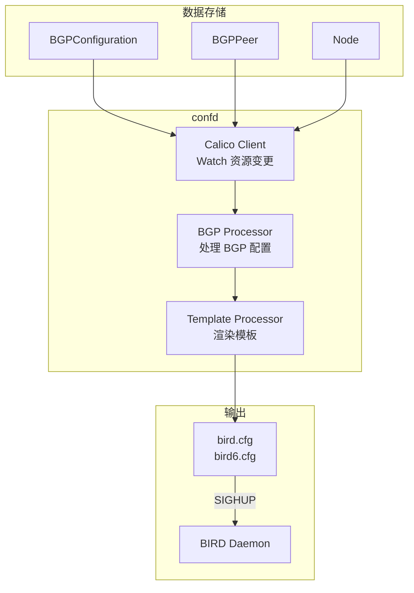
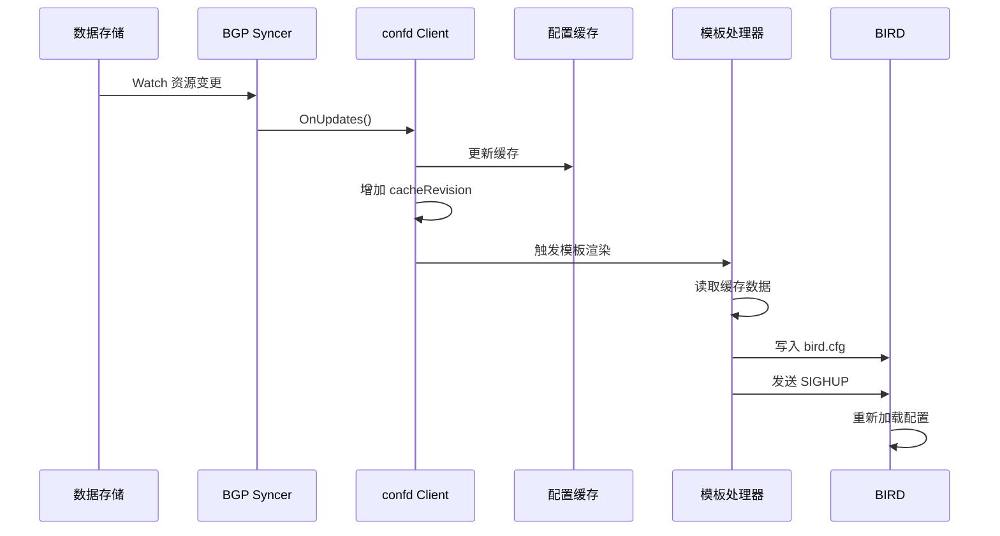

## 概述

Calico 使用 BIRD（BIRD Internet Routing Daemon）作为 BGP 路由守护进程，通过 confd 动态生成 BIRD 配置。本文深入分析 BIRD 的配置结构、confd 的模板渲染机制以及配置热更新流程。

## 前置知识

- BGP 协议基础
- Calico 架构概览
- Go template 语法

## 架构总览



## BIRD 简介

### 什么是 BIRD

BIRD 是一个开源的路由守护进程，支持多种路由协议：
- BGP（Border Gateway Protocol）
- OSPF（Open Shortest Path First）
- RIP（Routing Information Protocol）
- 静态路由

Calico 主要使用 BIRD 的 BGP 功能来实现跨节点路由通告。

### BIRD 配置结构

```
bird.cfg
├── 全局配置
│   ├── router id
│   ├── log 配置
│   └── debug 配置
├── protocol kernel
│   └── 内核路由表同步
├── protocol device
│   └── 设备接口监控
├── protocol direct
│   └── 直连路由学习
├── filter 定义
│   └── 路由过滤规则
└── protocol bgp (多个)
    └── BGP 对等配置
```

## confd 客户端

### 客户端初始化

```go
// confd/pkg/backends/calico/client.go:100-175

func NewCalicoClient(confdConfig *config.Config) (*client, error) {
    // 加载 Calico 客户端配置
    clientCfg, err := apiconfig.LoadClientConfig(confdConfig.CalicoConfig)

    // 创建 Calico v3 客户端
    cc, err := clientv3.New(*clientCfg)

    // 查询 BGP 配置，确定是否启用 node-to-node mesh
    cfg, err := cc.BGPConfigurations().Get(ctx, "default", options.GetOptions{})
    nodeMeshEnabled := true
    if cfg != nil && cfg.Spec.NodeToNodeMeshEnabled != nil {
        nodeMeshEnabled = *cfg.Spec.NodeToNodeMeshEnabled
    }

    // 创建客户端实例
    c := &client{
        client:          bc,
        cache:           make(map[string]string),
        peeringCache:    make(map[string]string),
        cacheRevision:   1,
        nodeMeshEnabled: nodeMeshEnabled,
        bgpPeers:        make(map[string]*apiv3.BGPPeer),
        // ...
    }

    // 启动 syncer
    if syncclientutils.MustStartSyncerClientIfTyphaConfigured(...) {
        // 使用 Typha
    } else {
        // 使用本地 syncer
        c.syncer = bgpsyncer.New(c.client, c, template.NodeName, clientCfg.Spec)
        c.syncer.Start()
    }

    return c, nil
}
```

### 数据同步流程



### 缓存键值结构

```go
// confd 使用的缓存键格式
var globalDefaults = map[string]string{
    "/calico/bgp/v1/global/as_num":    "64512",      // 全局 AS 号
    "/calico/bgp/v1/global/node_mesh": `{"enabled": true}`,  // 节点网格
    globalLogging:                     "info",       // 日志级别
}

// 节点相关键
"/calico/bgp/v1/host/{node}/ip_addr_v4"    // 节点 IPv4 地址
"/calico/bgp/v1/host/{node}/ip_addr_v6"    // 节点 IPv6 地址
"/calico/bgp/v1/host/{node}/as_num"        // 节点 AS 号
"/calico/bgp/v1/host/{node}/rr_cluster_id" // 路由反射器集群 ID

// 对等相关键
"/calico/bgp/v1/global/peer_v4/{peer}"     // 全局 IPv4 对等
"/calico/bgp/v1/global/peer_v6/{peer}"     // 全局 IPv6 对等
"/calico/bgp/v1/host/{node}/peer_v4/{peer}" // 节点特定 IPv4 对等
"/calico/bgp/v1/host/{node}/peer_v6/{peer}" // 节点特定 IPv6 对等
```

## BGP 配置处理

### BirdBGPConfig 结构

```go
// confd/pkg/backends/types/bird_bgp_config.go:17-31

type BirdBGPConfig struct {
    NodeName         string
    NodeIP           string
    NodeIPv6         string
    ASNumber         string
    RouterID         string
    Peers            []BirdBGPPeer
    Filters          map[string]string
    Communities      []CommunityRule
    LogLevel         string
    DebugMode        string           // "all", "{ states }", ""
    ListenAddress    string
    ListenPort       string
    DirectInterfaces string           // 接口模式字符串
}
```

### BirdBGPPeer 结构

```go
// confd/pkg/backends/types/bird_bgp_config.go:34-55

type BirdBGPPeer struct {
    Name            string
    IP              string
    Port            string
    ASNumber        string
    LocalASNumber   string
    Type            string            // "mesh", "global", "node"
    ImportFilter    string
    ExportFilter    string
    Password        string
    TTLSecurity     string
    RouteReflector  bool
    RRClusterID     string
    SourceAddr      string
    NextHopSelf     bool
    NextHopKeep     bool
    Passive         bool
    GracefulRestart string
    KeepaliveTime   string
    NumAllowLocalAs string
}
```

### 配置生成流程

```go
// confd/pkg/backends/calico/bgp_processor.go:50-109

func (c *client) GetBirdBGPConfig(ipVersion int) (*types.BirdBGPConfig, error) {
    // 1. 检查缓存
    currentRevision := c.GetCurrentRevision()
    if cached, ok := configCache[ipVersion]; ok && cached.revision == currentRevision {
        return cached.config, nil
    }

    // 2. 初始化配置
    config := &types.BirdBGPConfig{
        NodeName:    NodeName,
        Peers:       make([]types.BirdBGPPeer, 0),
        Filters:     make(map[string]string),
        Communities: make([]types.CommunityRule, 0),
    }

    // 3. 填充节点配置
    if err := c.populateNodeConfig(config, ipVersion); err != nil {
        return nil, err
    }

    // 4. 处理所有对等类型
    if err := c.processPeers(config, ipVersion); err != nil {
        return nil, err
    }

    // 5. 排序对等（保证配置稳定性）
    sort.Slice(config.Peers, func(i, j int) bool {
        return config.Peers[i].Name < config.Peers[j].Name
    })

    // 6. 处理 Community 规则
    if err := c.processCommunityRules(config, ipVersion); err != nil {
        return nil, err
    }

    // 7. 更新缓存
    configCache[ipVersion] = &bgpConfigCache{
        config:   config,
        revision: currentRevision,
    }

    return config, nil
}
```

### 节点配置填充

```go
// confd/pkg/backends/calico/bgp_processor.go:112-205

func (c *client) populateNodeConfig(config *types.BirdBGPConfig, ipVersion int) error {
    // 获取节点 IP
    nodeIPv4Key := fmt.Sprintf("/calico/bgp/v1/host/%s/ip_addr_v4", NodeName)
    config.NodeIP, _ = c.GetValue(nodeIPv4Key)

    // 获取 AS 号（节点优先，回退到全局）
    asNum, err := c.getNodeOrGlobalValue(NodeName, "as_num")
    config.ASNumber = asNum

    // 处理 Router ID
    routerID := os.Getenv("CALICO_ROUTER_ID")
    if routerID == "hash" {
        config.RouterID, _ = template.HashToIPv4(config.NodeName)
    } else if routerID != "" {
        config.RouterID = routerID
    } else {
        config.RouterID = config.NodeIP
    }

    // 处理监听地址和端口
    bindMode, _ := c.getNodeOrGlobalValue(NodeName, "bind_mode")
    if bindMode == "NodeIP" {
        config.ListenAddress = config.NodeIP
    }

    // 处理忽略的接口
    ignoredInterfaces, _ := c.getNodeOrGlobalValue(NodeName, "ignored_interfaces")
    if ignoredInterfaces != "" {
        // 构建接口模式
        config.DirectInterfaces = buildInterfacePattern(ignoredInterfaces)
    } else {
        config.DirectInterfaces = `-"cali*", -"kube-ipvs*", "*"`
    }

    return nil
}
```

### 对等处理

```go
// confd/pkg/backends/calico/bgp_processor.go:208-228

func (c *client) processPeers(config *types.BirdBGPConfig, ipVersion int) error {
    // 获取本节点的路由反射器集群 ID
    nodeClusterID, _ := c.GetValue(fmt.Sprintf(
        "/calico/bgp/v1/host/%s/rr_cluster_id", NodeName))

    // 1. 处理 node-to-node mesh 对等
    if err := c.processMeshPeers(config, nodeClusterID, ipVersion); err != nil {
        return err
    }

    // 2. 处理全局对等
    if err := c.processGlobalPeers(config, nodeClusterID, ipVersion); err != nil {
        return err
    }

    // 3. 处理节点特定对等
    if err := c.processNodePeers(config, nodeClusterID, ipVersion); err != nil {
        return err
    }

    return nil
}
```

### Mesh 对等处理

```go
// confd/pkg/backends/calico/bgp_processor.go:231-361

func (c *client) processMeshPeers(config *types.BirdBGPConfig, nodeClusterID string, ipVersion int) error {
    // 如果本节点是路由反射器，跳过 mesh
    if nodeClusterID != "" {
        return nil
    }

    // 检查 mesh 是否启用
    meshConfigValue, _ := c.GetValue("/calico/bgp/v1/global/node_mesh")
    var meshConfig struct {
        Enabled bool `json:"enabled"`
    }
    json.Unmarshal([]byte(meshConfigValue), &meshConfig)
    if !meshConfig.Enabled {
        return nil
    }

    // 获取所有节点 IP
    hostIPsMap, _ := c.GetValues([]string{"/calico/bgp/v1/host"})

    for host, peerIP := range hostsMap {
        // 跳过自己
        if peerIP == currentNodeIP {
            continue
        }

        // 跳过路由反射器
        peerClusterID, _ := c.GetValue(fmt.Sprintf(
            "/calico/bgp/v1/host/%s/rr_cluster_id", host))
        if peerClusterID != "" {
            continue
        }

        // 创建 mesh 对等
        peer := types.BirdBGPPeer{
            Name:         fmt.Sprintf("Mesh_%s", strings.ReplaceAll(peerIP, ".", "_")),
            IP:           peerIP,
            ASNumber:     peerAS,
            Type:         "mesh",
            SourceAddr:   currentNodeIP,
            ExportFilter: "calico_export_to_bgp_peers(true);\n    reject;",
        }

        // 单向连接避免竞争
        if peerIP > currentNodeIP {
            peer.Passive = true
        }

        config.Peers = append(config.Peers, peer)
    }

    return nil
}
```

## 模板渲染

### 模板文件位置

```
/etc/calico/confd/templates/
├── bird.cfg.template      # BIRD IPv4 配置模板
├── bird6.cfg.template     # BIRD IPv6 配置模板
├── bird_aggr.cfg.template # 聚合路由模板
└── bird_ipam.cfg.template # IPAM 路由模板
```

### 模板结构示例

```go
// bird.cfg.template 简化示例

{{- $config := .BGPConfig }}

# Router ID and global config
router id {{ $config.RouterID }};

log syslog all;
{{- if eq $config.DebugMode "all" }}
debug protocols all;
{{- end }}

# Kernel protocol
protocol kernel {
    learn;
    persist;
    scan time 2;
    import all;
    export filter calico_kernel_programming;
    graceful restart;
}

# Device protocol
protocol device {
    scan time 2;
}

# Direct protocol
protocol direct {
    interface {{ $config.DirectInterfaces }};
}

# BGP filter functions
filter calico_export_to_bgp_peers(bool is_mesh) {
    # 导出过滤逻辑
    if (ifname ~ "cali*" || ifname ~ "tap*") then accept;
    if (dest = RTD_BLACKHOLE) then accept;
    reject;
}

# BGP peers
{{- range $peer := $config.Peers }}
protocol bgp '{{ $peer.Name }}' {
    local as {{ $config.ASNumber }};
    {{- if $peer.LocalASNumber }}
    local as {{ $peer.LocalASNumber }};
    {{- end }}
    neighbor {{ $peer.IP }} as {{ $peer.ASNumber }};
    {{- if $peer.Port }}
    neighbor port {{ $peer.Port }};
    {{- end }}
    {{- if $peer.SourceAddr }}
    source address {{ $peer.SourceAddr }};
    {{- end }}
    {{- if $peer.Password }}
    password "{{ $peer.Password }}";
    {{- end }}
    {{- if $peer.Passive }}
    passive;
    {{- end }}
    {{- if $peer.RouteReflector }}
    rr client;
    rr cluster id {{ $peer.RRClusterID }};
    {{- end }}

    import filter {
        {{ $peer.ImportFilter }}
    };
    export filter {
        {{ $peer.ExportFilter }}
    };
}
{{- end }}
```

### 模板函数

```go
// confd/pkg/resource/template/template_funcs.go

// 常用模板函数
func init() {
    funcMap = template.FuncMap{
        "getenv":           os.Getenv,
        "hashToIPv4":       HashToIPv4,
        "truncateAndHash":  TruncateAndHashName,
        "parseIP":          parseIP,
        "split":            strings.Split,
        "join":             strings.Join,
        "replace":          strings.Replace,
        // ...
    }
}

// 节点名哈希为 IPv4（用于 Router ID）
func HashToIPv4(nodeName string) (string, error) {
    h := fnv.New32a()
    h.Write([]byte(nodeName))
    sum := h.Sum32()
    return fmt.Sprintf("%d.%d.%d.%d",
        (sum>>24)&0xFF,
        (sum>>16)&0xFF,
        (sum>>8)&0xFF,
        sum&0xFF,
    ), nil
}
```

## 配置热更新

### 更新触发

```go
// confd/pkg/resource/template/processor.go

func (p *Processor) process() error {
    // 1. 获取当前配置数据
    config, err := p.client.GetBirdBGPConfig(p.ipVersion)
    if err != nil {
        return err
    }

    // 2. 渲染模板
    var buf bytes.Buffer
    if err := p.template.Execute(&buf, map[string]interface{}{
        "BGPConfig": config,
    }); err != nil {
        return err
    }

    // 3. 比较新旧配置
    newContent := buf.String()
    if newContent == p.lastContent {
        return nil  // 无变化，跳过
    }

    // 4. 写入配置文件
    if err := os.WriteFile(p.destPath, buf.Bytes(), 0644); err != nil {
        return err
    }
    p.lastContent = newContent

    // 5. 通知 BIRD 重新加载
    if err := p.reloadBird(); err != nil {
        return err
    }

    return nil
}

func (p *Processor) reloadBird() error {
    // 发送 SIGHUP 给 BIRD
    cmd := exec.Command("birdc", "configure")
    return cmd.Run()
}
```

### BIRD 配置重载


### 无中断更新

BIRD 支持软重配置（soft reconfiguration），可以在不中断现有 BGP 会话的情况下应用配置变更：

```bash
# 检查配置语法
birdc configure check

# 应用新配置（不中断会话）
birdc configure

# 强制完全重配置
birdc configure undo
birdc configure
```

## 实验

### 实验 1：查看 BIRD 配置

```bash
# 进入 calico-node 容器
kubectl exec -it -n kube-system calico-node-xxxxx -c calico-node -- /bin/sh

# 查看 BIRD IPv4 配置
cat /etc/calico/confd/config/bird.cfg

# 查看 BIRD IPv6 配置
cat /etc/calico/confd/config/bird6.cfg

# 使用 birdc 检查状态
birdc show status
birdc show protocols all
birdc show route
```

### 实验 2：观察配置变更

```bash
# 终端 1：监控配置文件
kubectl exec -it -n kube-system calico-node-xxxxx -c calico-node -- \
    watch -n 1 'cat /etc/calico/confd/config/bird.cfg | head -50'

# 终端 2：创建新的 BGP 对等
cat <<EOF | calicoctl apply -f -
apiVersion: projectcalico.org/v3
kind: BGPPeer
metadata:
  name: test-peer
spec:
  peerIP: 10.0.0.100
  asNumber: 65000
EOF

# 观察配置变化

# 清理
calicoctl delete bgppeer test-peer
```

### 实验 3：验证 confd 缓存

```bash
# 查看 confd 日志
kubectl logs -n kube-system calico-node-xxxxx -c calico-node | grep -i confd

# 启用 debug 日志
kubectl set env daemonset/calico-node -n kube-system CALICO_BGP_LOGSEVERITYSCREEN=debug

# 查看缓存命中/未命中
kubectl logs -n kube-system -l k8s-app=calico-node -c calico-node | grep "cache"
```

## 故障排查

### 常见问题

| 问题 | 原因 | 解决方案 |
|------|------|---------|
| 配置未更新 | confd 未检测到变更 | 检查 cacheRevision 是否增加 |
| BIRD 启动失败 | 配置语法错误 | 运行 `birdc configure check` |
| 对等建立失败 | IP/AS 配置错误 | 检查 BGPPeer 资源 |
| 路由未通告 | 过滤规则问题 | 检查 export filter |

### 调试命令

```bash
# 检查 BIRD 状态
birdc show status

# 查看协议状态
birdc show protocols

# 查看特定协议详情
birdc show protocols all Mesh_192_168_1_1

# 查看路由表
birdc show route

# 查看导出的路由
birdc show route export Mesh_192_168_1_1

# 查看导入的路由
birdc show route import Mesh_192_168_1_1
```

## 总结

BIRD 与 confd 的协作机制：

1. **数据驱动**：confd 监听 Calico 数据存储的 BGP 相关资源变更
2. **缓存优化**：使用 revision 机制避免不必要的配置重新生成
3. **模板渲染**：将结构化数据转换为 BIRD 配置文件
4. **热更新**：通过 `birdc configure` 实现无中断配置更新
5. **稳定排序**：对等按名称排序，保证配置稳定性

关键优势：
- 动态配置更新，无需重启 BIRD
- 模板化配置，易于维护和扩展
- 与 Calico 数据模型紧密集成

## 参考资料

- [BIRD 官方文档](https://bird.network.cz/?get_doc)
- [Calico BGP 配置](https://docs.tigera.io/calico/latest/networking/configuring/bgp)
- 代码路径：`confd/pkg/backends/calico/`
- 代码路径：`confd/pkg/resource/template/`
