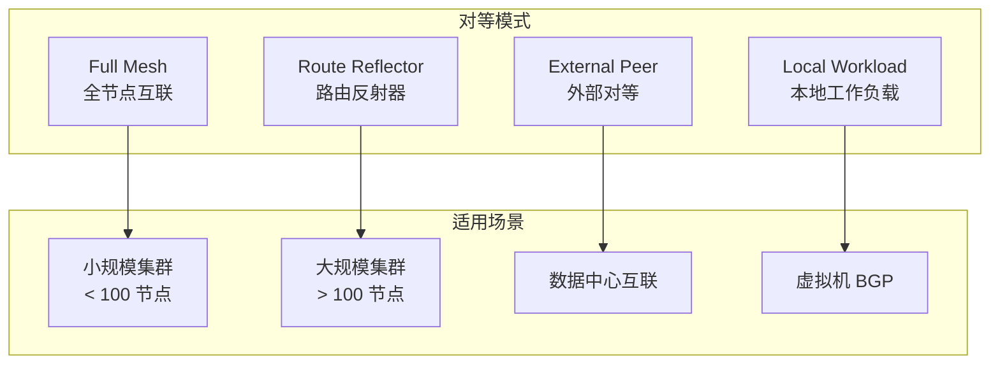
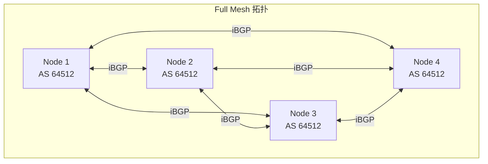
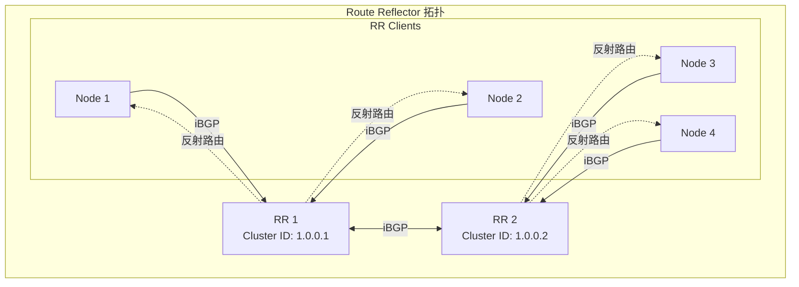
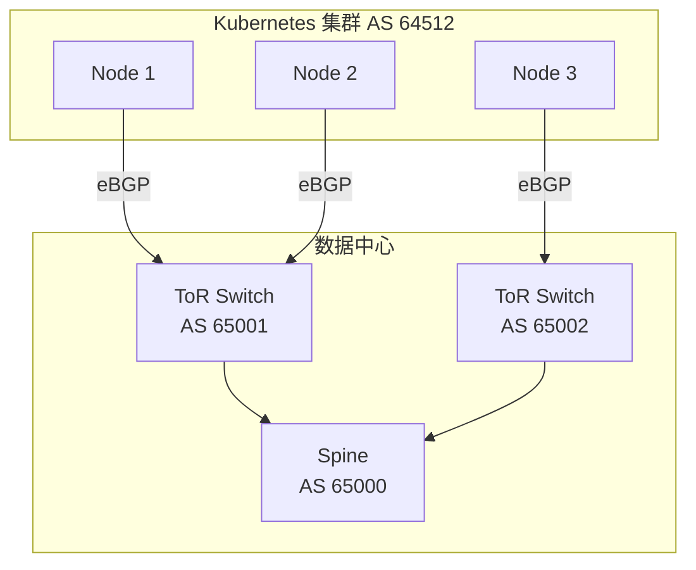
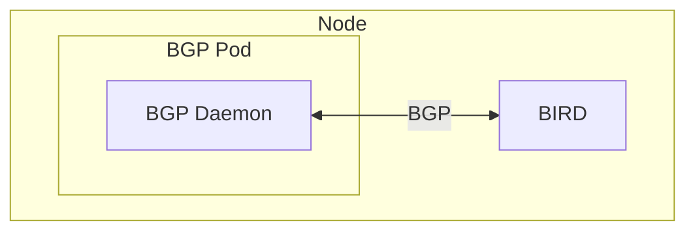

## 概述

Calico 支持多种 BGP 对等模式，从简单的全网格（Full Mesh）到复杂的路由反射器（Route Reflector）拓扑。本文详细介绍各种对等模式的配置方法、适用场景和最佳实践。

## 前置知识

- BGP 协议基础（iBGP vs eBGP）
- Calico 架构
- BIRD 配置基础

## BGP 对等模式总览



## BGPPeer API

### 资源定义

```go
// api/pkg/apis/projectcalico/v3/bgppeer.go:43-155

type BGPPeer struct {
    metav1.TypeMeta   `json:",inline"`
    metav1.ObjectMeta `json:"metadata,omitempty"`
    Spec              BGPPeerSpec `json:"spec,omitempty"`
}

type BGPPeerSpec struct {
    // 目标节点名称（单节点）
    Node string `json:"node,omitempty"`

    // 节点选择器（多节点）
    NodeSelector string `json:"nodeSelector,omitempty"`

    // 对等 IP 地址
    PeerIP string `json:"peerIP,omitempty"`

    // 对等 AS 号
    ASNumber numorstring.ASNumber `json:"asNumber,omitempty"`

    // 本地 AS 号（可选）
    LocalASNumber *numorstring.ASNumber `json:"localASNumber,omitempty"`

    // 对等选择器（Calico 节点间对等）
    PeerSelector string `json:"peerSelector,omitempty"`

    // 密码认证
    Password *BGPPassword `json:"password,omitempty"`

    // 源地址配置
    SourceAddress SourceAddress `json:"sourceAddress,omitempty"`

    // 优雅重启超时
    MaxRestartTime *metav1.Duration `json:"maxRestartTime,omitempty"`

    // Keepalive 间隔
    KeepaliveTime *metav1.Duration `json:"keepaliveTime,omitempty"`

    // TTL 安全
    TTLSecurity *uint8 `json:"ttlSecurity,omitempty"`

    // BGP 过滤器
    Filters []string `json:"filters,omitempty"`

    // 下一跳模式
    NextHopMode *NextHopMode `json:"nextHopMode,omitempty"`
}
```

### BGPConfiguration API

```go
// api/pkg/apis/projectcalico/v3/bgpconfig.go:49-138

type BGPConfiguration struct {
    metav1.TypeMeta   `json:",inline"`
    metav1.ObjectMeta `json:"metadata,omitempty"`
    Spec              BGPConfigurationSpec `json:"spec,omitempty"`
}

type BGPConfigurationSpec struct {
    // 日志级别
    LogSeverityScreen string `json:"logSeverityScreen,omitempty"`

    // Node-to-Node Mesh 开关
    NodeToNodeMeshEnabled *bool `json:"nodeToNodeMeshEnabled,omitempty"`

    // 默认 AS 号
    ASNumber *numorstring.ASNumber `json:"asNumber,omitempty"`

    // Service 路由通告
    ServiceLoadBalancerIPs []ServiceLoadBalancerIPBlock `json:"serviceLoadBalancerIPs,omitempty"`
    ServiceExternalIPs     []ServiceExternalIPBlock     `json:"serviceExternalIPs,omitempty"`
    ServiceClusterIPs      []ServiceClusterIPBlock      `json:"serviceClusterIPs,omitempty"`

    // BGP 社区
    Communities []Community `json:"communities,omitempty"`

    // 前缀通告
    PrefixAdvertisements []PrefixAdvertisement `json:"prefixAdvertisements,omitempty"`

    // 监听端口
    ListenPort uint16 `json:"listenPort,omitempty"`

    // Mesh 密码
    NodeMeshPassword *BGPPassword `json:"nodeMeshPassword,omitempty"`

    // 绑定模式
    BindMode *BindMode `json:"bindMode,omitempty"`
}
```

## 模式一：Full Mesh（全网格）

### 工作原理



### 配置方法

Full Mesh 是 Calico 的默认配置，无需额外配置：

```yaml
apiVersion: projectcalico.org/v3
kind: BGPConfiguration
metadata:
  name: default
spec:
  logSeverityScreen: Info
  nodeToNodeMeshEnabled: true  # 默认开启
  asNumber: 64512
```

### 连接数计算

对于 n 个节点，Full Mesh 需要 n(n-1)/2 个 BGP 连接：

| 节点数 | 连接数 |
|--------|--------|
| 10     | 45     |
| 50     | 1,225  |
| 100    | 4,950  |
| 500    | 124,750|

### Mesh 对等代码分析

```go
// confd/pkg/backends/calico/bgp_processor.go:231-361

func (c *client) processMeshPeers(config *types.BirdBGPConfig, nodeClusterID string, ipVersion int) error {
    // 路由反射器不参与 mesh
    if nodeClusterID != "" {
        return nil
    }

    // 检查 mesh 是否启用
    meshConfigValue, _ := c.GetValue("/calico/bgp/v1/global/node_mesh")
    var meshConfig struct {
        Enabled bool `json:"enabled"`
    }
    json.Unmarshal([]byte(meshConfigValue), &meshConfig)
    if !meshConfig.Enabled {
        return nil
    }

    // 获取所有节点并建立对等
    for host, peerIP := range hostsMap {
        if peerIP == currentNodeIP {
            continue  // 跳过自己
        }
        if peerClusterID, _ := c.GetValue(...); peerClusterID != "" {
            continue  // 跳过路由反射器
        }

        peer := types.BirdBGPPeer{
            Name:     fmt.Sprintf("Mesh_%s", ...),
            IP:       peerIP,
            ASNumber: peerAS,
            Type:     "mesh",
        }

        // 单向连接避免竞争条件
        if peerIP > currentNodeIP {
            peer.Passive = true
        }

        config.Peers = append(config.Peers, peer)
    }
    return nil
}
```

## 模式二：Route Reflector（路由反射器）

### 工作原理



### 配置步骤

#### 1. 禁用 Node-to-Node Mesh

```yaml
apiVersion: projectcalico.org/v3
kind: BGPConfiguration
metadata:
  name: default
spec:
  nodeToNodeMeshEnabled: false
  asNumber: 64512
```

#### 2. 配置路由反射器节点

```bash
# 给节点添加路由反射器标签
kubectl label node node1 route-reflector=true
kubectl label node node2 route-reflector=true

# 配置路由反射器集群 ID
calicoctl patch node node1 -p '{"spec": {"bgp": {"routeReflectorClusterID": "1.0.0.1"}}}'
calicoctl patch node node2 -p '{"spec": {"bgp": {"routeReflectorClusterID": "1.0.0.1"}}}'
```

#### 3. 配置 RR 之间的对等

```yaml
apiVersion: projectcalico.org/v3
kind: BGPPeer
metadata:
  name: rr-to-rr-mesh
spec:
  nodeSelector: route-reflector == 'true'
  peerSelector: route-reflector == 'true'
```

#### 4. 配置客户端到 RR 的对等

```yaml
apiVersion: projectcalico.org/v3
kind: BGPPeer
metadata:
  name: node-to-rr
spec:
  nodeSelector: "!has(route-reflector)"
  peerSelector: route-reflector == 'true'
```

### RR 客户端检测

```go
// confd/pkg/backends/calico/bgp_processor.go:530-550

// 检查对等是否为 RR 客户端
if result.ASNumber == effectiveNodeAS && nodeClusterID != "" {
    if peer.RRClusterID == "" || peer.RRClusterID != nodeClusterID {
        result.RouteReflector = true
        result.RRClusterID = nodeClusterID
    }
}
```

## 模式三：External BGP（eBGP）

### 与外部路由器对等



### 配置示例

#### 全局对等（所有节点）

```yaml
apiVersion: projectcalico.org/v3
kind: BGPPeer
metadata:
  name: external-tor
spec:
  peerIP: 10.0.0.1
  asNumber: 65001
  # 适用于所有节点
```

#### 节点选择器对等

```yaml
apiVersion: projectcalico.org/v3
kind: BGPPeer
metadata:
  name: rack1-tor
spec:
  nodeSelector: rack == 'rack1'
  peerIP: 10.0.1.1
  asNumber: 65001
```

#### 单节点对等

```yaml
apiVersion: projectcalico.org/v3
kind: BGPPeer
metadata:
  name: node1-peer
spec:
  node: node1
  peerIP: 10.0.0.100
  asNumber: 65100
```

### eBGP 特有配置

```yaml
apiVersion: projectcalico.org/v3
kind: BGPPeer
metadata:
  name: ebgp-peer
spec:
  peerIP: 10.0.0.1
  asNumber: 65001

  # TTL 安全（防止 IP 欺骗）
  ttlSecurity: 1

  # 源地址
  sourceAddress: UseNodeIP

  # 下一跳模式
  nextHopMode: Self  # 或 Keep

  # 密码认证
  password:
    secretKeyRef:
      name: bgp-secrets
      key: peer1-password

  # BGP 过滤器
  filters:
    - my-export-filter
```

## 模式四：本地工作负载对等

### 工作原理

允许 Pod 内运行的 BGP 守护进程与节点上的 BIRD 建立 BGP 会话。



### 配置方法

```yaml
# 1. 配置 BGPConfiguration
apiVersion: projectcalico.org/v3
kind: BGPConfiguration
metadata:
  name: default
spec:
  localWorkloadPeeringIPV4: 169.254.1.1  # 链路本地地址

---
# 2. 配置 BGPPeer
apiVersion: projectcalico.org/v3
kind: BGPPeer
metadata:
  name: local-workload-peer
spec:
  localWorkloadSelector: app == 'bgp-speaker'
  asNumber: 65100
```

## BGP 过滤器

### BGPFilter 资源

```yaml
apiVersion: projectcalico.org/v3
kind: BGPFilter
metadata:
  name: my-filter
spec:
  exportV4:
    - action: Accept
      matchOperator: In
      cidr: 10.0.0.0/8
    - action: Reject
  importV4:
    - action: Accept
      matchOperator: NotIn
      cidr: 0.0.0.0/0
```

### 应用过滤器

```yaml
apiVersion: projectcalico.org/v3
kind: BGPPeer
metadata:
  name: filtered-peer
spec:
  peerIP: 10.0.0.1
  asNumber: 65001
  filters:
    - my-filter
```

## 高级配置

### 多 AS 配置

```yaml
# 节点 1 使用不同的 AS
apiVersion: projectcalico.org/v3
kind: Node
metadata:
  name: node1
spec:
  bgp:
    ipv4Address: 10.0.0.10/24
    asNumber: 64513  # 覆盖全局 AS
```

### 本地 AS 覆盖

```yaml
# 与外部对等时使用不同的本地 AS
apiVersion: projectcalico.org/v3
kind: BGPPeer
metadata:
  name: peer-with-local-as
spec:
  peerIP: 10.0.0.1
  asNumber: 65001
  localASNumber: 64520  # 本地 AS 覆盖
```

### 社区标记

```yaml
apiVersion: projectcalico.org/v3
kind: BGPConfiguration
metadata:
  name: default
spec:
  communities:
    - name: no-export
      value: "65535:65281"
    - name: my-community
      value: "64512:100"

  prefixAdvertisements:
    - cidr: 10.244.0.0/16
      communities:
        - no-export
        - my-community
```

## 实验

### 实验 1：配置路由反射器

```bash
# 1. 禁用 mesh
cat <<EOF | calicoctl apply -f -
apiVersion: projectcalico.org/v3
kind: BGPConfiguration
metadata:
  name: default
spec:
  nodeToNodeMeshEnabled: false
  asNumber: 64512
EOF

# 2. 标记 RR 节点
kubectl label node node1 route-reflector=true

# 3. 配置 RR 集群 ID
calicoctl patch node node1 -p '{"spec": {"bgp": {"routeReflectorClusterID": "1.0.0.1"}}}'

# 4. 配置客户端到 RR 的对等
cat <<EOF | calicoctl apply -f -
apiVersion: projectcalico.org/v3
kind: BGPPeer
metadata:
  name: client-to-rr
spec:
  nodeSelector: "!has(route-reflector)"
  peerSelector: route-reflector == 'true'
EOF

# 5. 验证
calicoctl node status
```

### 实验 2：eBGP 对等

```bash
# 1. 创建外部对等
cat <<EOF | calicoctl apply -f -
apiVersion: projectcalico.org/v3
kind: BGPPeer
metadata:
  name: external-router
spec:
  peerIP: 192.168.1.1
  asNumber: 65001
  nodeSelector: all()
EOF

# 2. 查看对等状态
calicoctl node status

# 3. 在 BIRD 中查看详情
kubectl exec -it -n kube-system calico-node-xxxxx -c calico-node -- \
    birdc show protocols all
```

### 实验 3：BGP 过滤器

```bash
# 1. 创建过滤器
cat <<EOF | calicoctl apply -f -
apiVersion: projectcalico.org/v3
kind: BGPFilter
metadata:
  name: block-default
spec:
  exportV4:
    - action: Reject
      matchOperator: Equal
      cidr: 0.0.0.0/0
    - action: Accept
EOF

# 2. 应用到对等
cat <<EOF | calicoctl apply -f -
apiVersion: projectcalico.org/v3
kind: BGPPeer
metadata:
  name: filtered-peer
spec:
  peerIP: 192.168.1.1
  asNumber: 65001
  filters:
    - block-default
EOF

# 3. 验证过滤器效果
kubectl exec -it -n kube-system calico-node-xxxxx -c calico-node -- \
    birdc show route export filtered_peer
```

## 最佳实践

### 小规模集群（< 100 节点）

- 使用默认 Full Mesh
- 简单配置，易于管理
- 无需额外组件

### 中等规模（100-500 节点）

- 部署 2-3 个路由反射器
- RR 使用冗余配置
- 考虑分区部署

### 大规模集群（> 500 节点）

- 多层 RR 架构
- 按机架/区域分区
- 考虑使用外部 BGP 设备

### 安全建议

- 始终使用 MD5 密码认证
- 配置 TTL 安全
- 使用过滤器限制路由通告

## 总结

Calico BGP 对等模式选择指南：

| 模式 | 适用场景 | 复杂度 | 扩展性 |
|------|---------|--------|--------|
| Full Mesh | 小集群 | 低 | 差 |
| Route Reflector | 大集群 | 中 | 好 |
| External eBGP | DC 互联 | 高 | 取决于设计 |
| Local Workload | 特殊需求 | 高 | 取决于设计 |

## 参考资料

- [Calico BGP Peering](https://docs.tigera.io/calico/latest/networking/configuring/bgp)
- [Route Reflector Guide](https://docs.tigera.io/calico/latest/networking/configuring/bgp#route-reflectors)
- 代码路径：`api/pkg/apis/projectcalico/v3/bgppeer.go`
- 代码路径：`api/pkg/apis/projectcalico/v3/bgpconfig.go`
