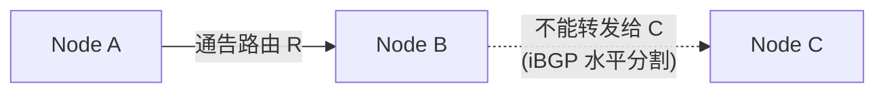
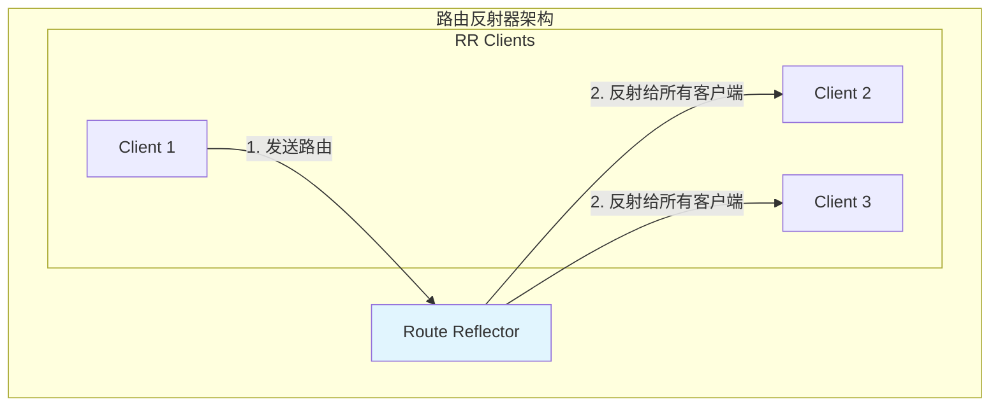
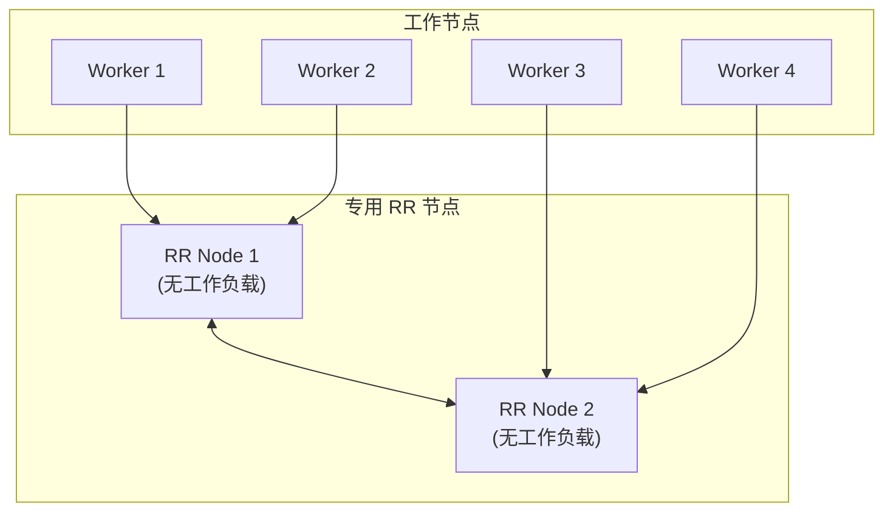
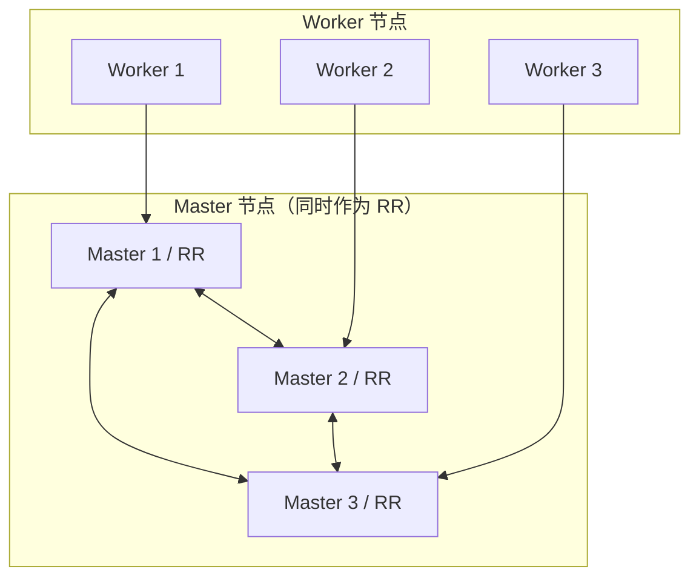
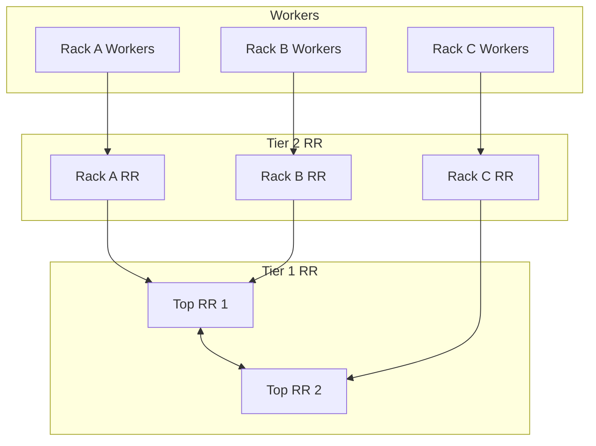
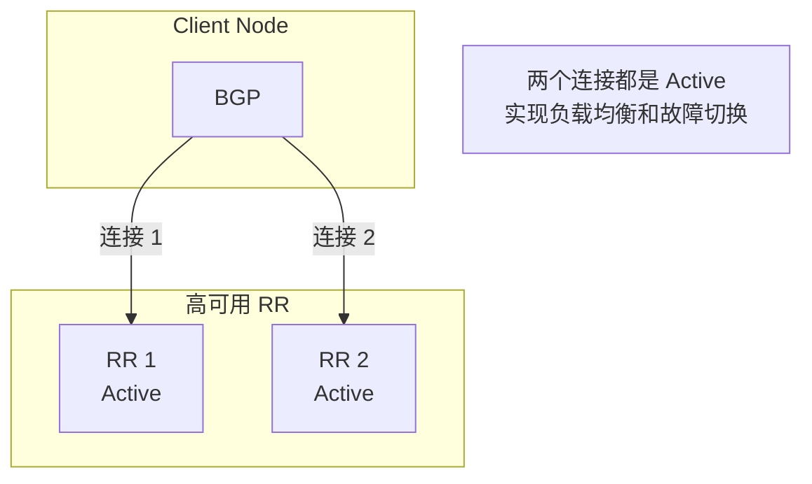
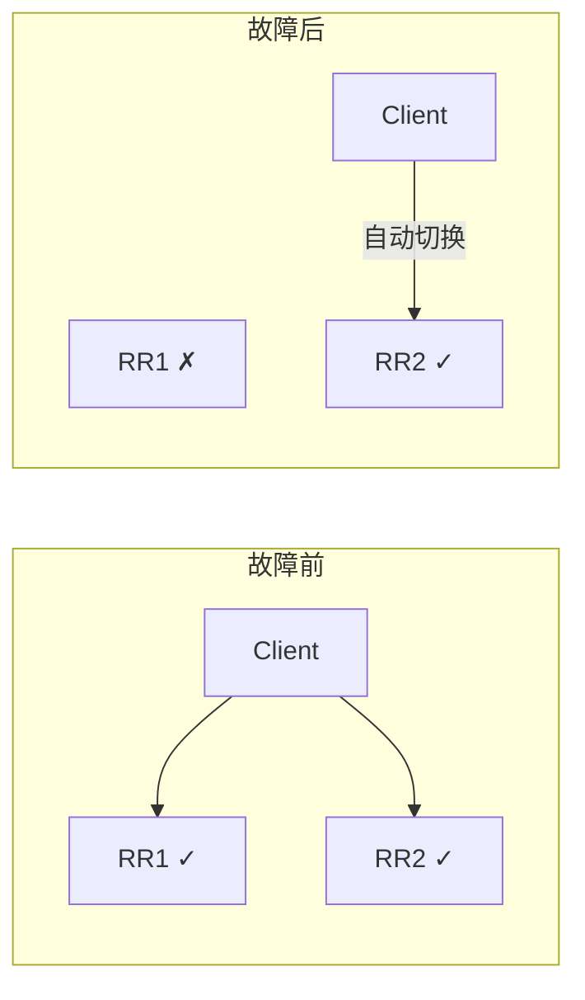

## 概述

在大规模 Calico 集群中，Full Mesh 拓扑会产生 O(n²) 的 BGP 连接数，导致严重的扩展性问题。路由反射器（Route Reflector，RR）通过引入层次化结构，将连接数降低到 O(n)，是大规模部署的关键技术。

## 前置知识

- BGP iBGP 原理
- Calico BGP 对等模式
- 集群高可用设计

## 路由反射器原理

### iBGP 水平分割问题

iBGP 规定：从 iBGP 邻居学到的路由不能再通告给其他 iBGP 邻居。这是为了防止路由环路。



解决方案：
1. **Full Mesh**：所有节点互联
2. **Route Reflector**：指定节点负责反射路由
3. **Confederation**：将大 AS 分割为子 AS（Calico 不支持）

### RR 工作原理



### RR 路由反射规则

| 路由来源 | 反射目标 | 是否反射 |
|----------|----------|----------|
| RR Client | 其他 RR Clients | 是 |
| RR Client | 非 Client iBGP | 是 |
| 非 Client iBGP | RR Clients | 是 |
| 非 Client iBGP | 非 Client iBGP | 否 |
| eBGP | 所有 iBGP | 是 |

### BGP 属性

RR 在反射路由时会添加/修改以下属性：

- **ORIGINATOR_ID**：原始路由发起者的 Router ID
- **CLUSTER_LIST**：路由经过的 RR 集群 ID 列表（用于防环）

## Calico RR 部署

### 部署模式

#### 模式 1：专用 RR 节点



**优点**：资源隔离，RR 稳定性高
**缺点**：需要额外节点

#### 模式 2：复用控制平面节点



**优点**：充分利用现有节点
**缺点**：Master 负载增加

#### 模式 3：分层 RR



**优点**：极佳扩展性
**缺点**：配置复杂

### 配置步骤

#### 步骤 1：禁用 Node-to-Node Mesh

```yaml
apiVersion: projectcalico.org/v3
kind: BGPConfiguration
metadata:
  name: default
spec:
  nodeToNodeMeshEnabled: false
  asNumber: 64512
```

```bash
calicoctl apply -f - <<EOF
apiVersion: projectcalico.org/v3
kind: BGPConfiguration
metadata:
  name: default
spec:
  nodeToNodeMeshEnabled: false
  asNumber: 64512
EOF
```

#### 步骤 2：标记 RR 节点

```bash
# 添加标签
kubectl label node master-1 route-reflector=true
kubectl label node master-2 route-reflector=true
kubectl label node master-3 route-reflector=true
```

#### 步骤 3：配置 RR 集群 ID

```bash
# 为每个 RR 配置相同的集群 ID
calicoctl patch node master-1 -p '{"spec": {"bgp": {"routeReflectorClusterID": "224.0.0.1"}}}'
calicoctl patch node master-2 -p '{"spec": {"bgp": {"routeReflectorClusterID": "224.0.0.1"}}}'
calicoctl patch node master-3 -p '{"spec": {"bgp": {"routeReflectorClusterID": "224.0.0.1"}}}'
```

> **集群 ID 选择**：
> - 使用点分十进制格式
> - 同一集群内的 RR 使用相同 ID
> - 不同集群使用不同 ID

#### 步骤 4：配置 RR 之间的对等

```yaml
apiVersion: projectcalico.org/v3
kind: BGPPeer
metadata:
  name: rr-mesh
spec:
  # 所有 RR 节点
  nodeSelector: has(route-reflector)
  # 与其他 RR 节点对等
  peerSelector: has(route-reflector)
```

#### 步骤 5：配置客户端到 RR 的对等

```yaml
apiVersion: projectcalico.org/v3
kind: BGPPeer
metadata:
  name: client-to-rr
spec:
  # 非 RR 节点
  nodeSelector: "!has(route-reflector)"
  # 与所有 RR 对等
  peerSelector: has(route-reflector)
```

### RR 配置代码分析

```go
// confd/pkg/backends/calico/bgp_processor.go:530-550

func (c *client) buildPeerFromData(peer *bgpPeer, ...) *types.BirdBGPPeer {
    // ...

    // 路由反射器处理
    // 如果本节点是 RR（有 cluster ID）且对等是 iBGP 且对等不在同一集群
    if result.ASNumber == effectiveNodeAS && nodeClusterID != "" {
        if peer.RRClusterID == "" || peer.RRClusterID != nodeClusterID {
            result.RouteReflector = true
            result.RRClusterID = nodeClusterID
        }
    }

    return result
}
```

生成的 BIRD 配置：

```
protocol bgp 'Node_10_0_0_10' {
    local as 64512;
    neighbor 10.0.0.10 as 64512;

    # RR 配置
    rr client;
    rr cluster id 224.0.0.1;

    import all;
    export filter {
        calico_export_to_bgp_peers(true);
        reject;
    };
}
```

## 高可用设计

### RR 冗余



### RR 数量建议

| 集群规模 | RR 数量 | 部署位置 |
|----------|---------|----------|
| 100-200 | 2-3 | 跨可用区 |
| 200-500 | 3-5 | 跨可用区 |
| 500+ | 5-7 或分层 | 跨区域 |

### 故障场景

#### RR 节点故障



客户端配置了多个 RR 对等，单个 RR 故障时自动切换到其他 RR。

### 优雅重启

```yaml
apiVersion: projectcalico.org/v3
kind: BGPConfiguration
metadata:
  name: default
spec:
  nodeMeshMaxRestartTime: 120s  # 优雅重启超时
```

```yaml
apiVersion: projectcalico.org/v3
kind: BGPPeer
metadata:
  name: client-to-rr
spec:
  nodeSelector: "!has(route-reflector)"
  peerSelector: has(route-reflector)
  maxRestartTime: 120s  # 对等级别的优雅重启
```

## 性能优化

### 连接数对比

| 节点数 | Full Mesh 连接 | 3 RR 连接 | 节省比例 |
|--------|---------------|-----------|---------|
| 100 | 4,950 | 303 | 94% |
| 500 | 124,750 | 1,503 | 99% |
| 1000 | 499,500 | 3,003 | 99.4% |

### RR 负载均衡

```yaml
# 使用拓扑感知分配 RR 客户端
apiVersion: projectcalico.org/v3
kind: BGPPeer
metadata:
  name: rack1-to-rr
spec:
  nodeSelector: topology.kubernetes.io/zone == 'zone-a'
  peerSelector: route-reflector == 'true' && topology.kubernetes.io/zone == 'zone-a'

---
apiVersion: projectcalico.org/v3
kind: BGPPeer
metadata:
  name: rack2-to-rr
spec:
  nodeSelector: topology.kubernetes.io/zone == 'zone-b'
  peerSelector: route-reflector == 'true' && topology.kubernetes.io/zone == 'zone-b'
```

## 监控和排障

### 验证 RR 配置

```bash
# 查看节点 BGP 状态
calicoctl node status

# 预期输出
# Calico process is running.
#
# IPv4 BGP status
# +---------------+-------------------+-------+----------+-------------+
# | PEER ADDRESS  |     PEER TYPE     | STATE |  SINCE   |    INFO     |
# +---------------+-------------------+-------+----------+-------------+
# | 10.0.0.11     | node-to-node mesh | up    | 10:00:00 | Established |
# | 10.0.0.12     | node-to-node mesh | up    | 10:00:00 | Established |
# +---------------+-------------------+-------+----------+-------------+
```

### BIRD 状态检查

```bash
# 进入 calico-node
kubectl exec -it -n kube-system calico-node-xxxxx -c calico-node -- /bin/sh

# 查看协议状态
birdc show protocols

# 查看详细状态
birdc show protocols all Node_10_0_0_10

# 查看路由
birdc show route

# 查看 RR 客户端路由
birdc show route where from = 10.0.0.10
```

### 常见问题

| 问题 | 症状 | 解决方案 |
|------|------|---------|
| RR 未配置集群 ID | 路由不反射 | 设置 routeReflectorClusterID |
| Mesh 未禁用 | 连接数过多 | 设置 nodeToNodeMeshEnabled: false |
| 对等配置错误 | BGP 会话不建立 | 检查 nodeSelector/peerSelector |
| 集群 ID 冲突 | 路由环路 | 确保 ID 唯一性 |

## 实验

### 实验 1：部署双 RR

```bash
#!/bin/bash
# deploy-rr.sh

# 1. 禁用 mesh
calicoctl apply -f - <<EOF
apiVersion: projectcalico.org/v3
kind: BGPConfiguration
metadata:
  name: default
spec:
  nodeToNodeMeshEnabled: false
  asNumber: 64512
EOF

# 2. 标记 RR 节点
kubectl label node master-1 route-reflector=true --overwrite
kubectl label node master-2 route-reflector=true --overwrite

# 3. 配置集群 ID
calicoctl patch node master-1 -p '{"spec": {"bgp": {"routeReflectorClusterID": "1.0.0.1"}}}'
calicoctl patch node master-2 -p '{"spec": {"bgp": {"routeReflectorClusterID": "1.0.0.1"}}}'

# 4. RR 互联
calicoctl apply -f - <<EOF
apiVersion: projectcalico.org/v3
kind: BGPPeer
metadata:
  name: rr-mesh
spec:
  nodeSelector: has(route-reflector)
  peerSelector: has(route-reflector)
EOF

# 5. 客户端到 RR
calicoctl apply -f - <<EOF
apiVersion: projectcalico.org/v3
kind: BGPPeer
metadata:
  name: client-to-rr
spec:
  nodeSelector: "!has(route-reflector)"
  peerSelector: has(route-reflector)
EOF

# 6. 验证
echo "等待 BGP 会话建立..."
sleep 30
calicoctl node status
```

### 实验 2：RR 故障切换

```bash
# 1. 查看当前状态
calicoctl node status

# 2. 模拟 RR 故障（drain 节点）
kubectl drain master-1 --ignore-daemonsets --delete-emptydir-data

# 3. 观察客户端切换
watch calicoctl node status

# 4. 恢复节点
kubectl uncordon master-1

# 5. 验证恢复
calicoctl node status
```

### 实验 3：分区 RR

```bash
# 为不同区域配置 RR
# Zone A
kubectl label node zone-a-master route-reflector=true zone=a
calicoctl patch node zone-a-master -p '{"spec": {"bgp": {"routeReflectorClusterID": "1.0.0.1"}}}'

# Zone B
kubectl label node zone-b-master route-reflector=true zone=b
calicoctl patch node zone-b-master -p '{"spec": {"bgp": {"routeReflectorClusterID": "1.0.0.2"}}}'

# RR 互联
calicoctl apply -f - <<EOF
apiVersion: projectcalico.org/v3
kind: BGPPeer
metadata:
  name: rr-inter-zone
spec:
  nodeSelector: has(route-reflector)
  peerSelector: has(route-reflector)
EOF

# Zone A 客户端到 Zone A RR
calicoctl apply -f - <<EOF
apiVersion: projectcalico.org/v3
kind: BGPPeer
metadata:
  name: zone-a-client-to-rr
spec:
  nodeSelector: zone == 'a' && !has(route-reflector)
  peerSelector: route-reflector == 'true' && zone == 'a'
EOF

# Zone B 客户端到 Zone B RR
calicoctl apply -f - <<EOF
apiVersion: projectcalico.org/v3
kind: BGPPeer
metadata:
  name: zone-b-client-to-rr
spec:
  nodeSelector: zone == 'b' && !has(route-reflector)
  peerSelector: route-reflector == 'true' && zone == 'b'
EOF
```

## 总结

路由反射器是大规模 Calico 集群的关键组件：

1. **扩展性**：将 O(n²) 连接降低到 O(n)
2. **冗余性**：多 RR 实现高可用
3. **灵活性**：支持分层、分区部署
4. **透明性**：对客户端透明，无需特殊配置

最佳实践：
- 至少部署 2 个 RR 实现冗余
- RR 分布在不同可用区
- 使用一致的集群 ID
- 启用优雅重启
- 定期监控 BGP 状态

## 参考资料

- [RFC 4456 - BGP Route Reflection](https://tools.ietf.org/html/rfc4456)
- [Calico Route Reflector Guide](https://docs.tigera.io/calico/latest/networking/configuring/bgp#route-reflectors)
- [BGP Best Practices](https://docs.tigera.io/calico/latest/networking/configuring/bgp#best-practices)
