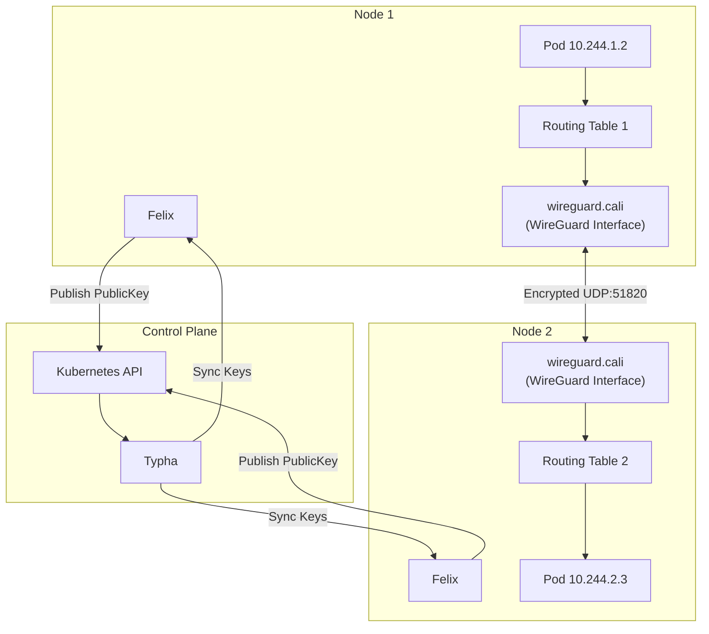
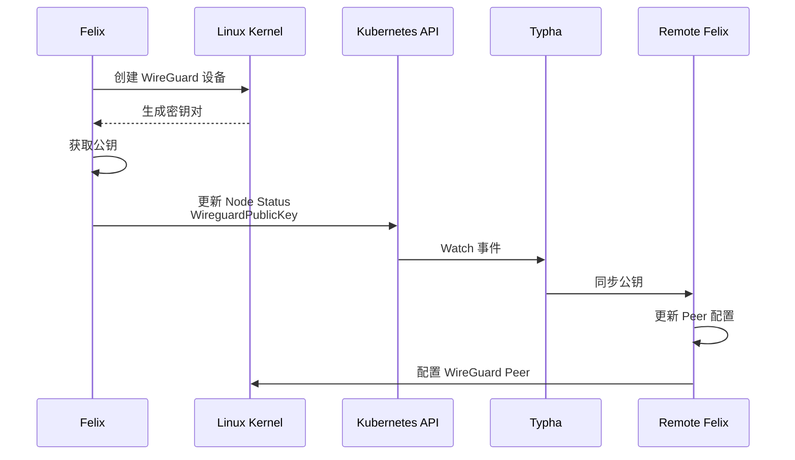
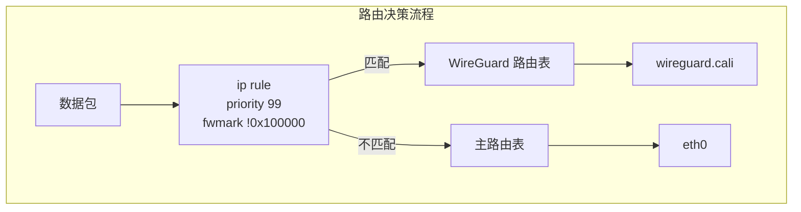
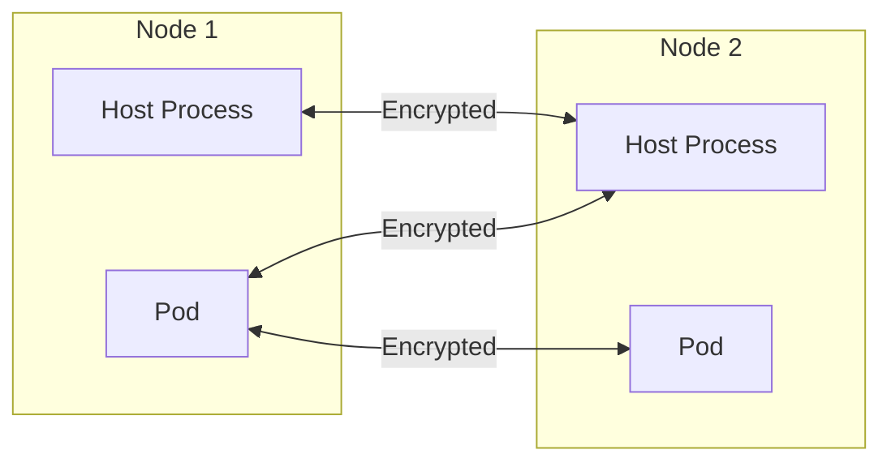
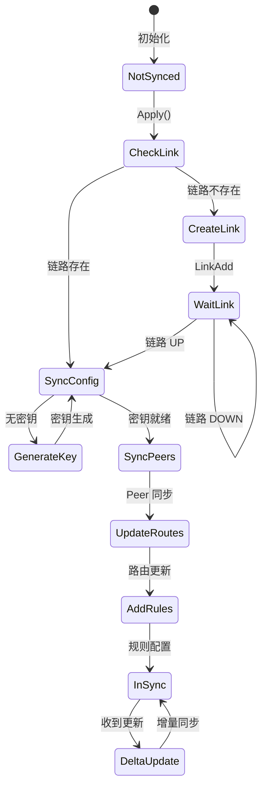

## 概述

WireGuard 是一种现代的、高性能的 VPN 协议，Calico 将其集成用于节点间流量加密。相比传统的 IPsec 方案，WireGuard 具有更简洁的代码实现、更低的性能开销和更简单的配置方式。本章深入分析 Calico 中 WireGuard 的实现原理。

## 前置知识

- Linux 网络基础
- Calico 数据平面架构
- 公钥加密基础
- Calico 路由机制

## WireGuard 协议基础

### 核心特点

```
┌─────────────────────────────────────────────────────────────────┐
│                    WireGuard 设计理念                            │
├─────────────────────────────────────────────────────────────────┤
│  1. 极简设计 - 约 4000 行代码（vs IPsec 的数万行）                │
│  2. 现代加密 - ChaCha20, Poly1305, Curve25519                   │
│  3. 高性能   - 内核态实现，零拷贝                                 │
│  4. 安全默认 - 无需配置协商，固定算法组合                          │
└─────────────────────────────────────────────────────────────────┘
```

### 加密算法

| 用途 | 算法 | 说明 |
|------|------|------|
| 密钥交换 | Curve25519 | 椭圆曲线 Diffie-Hellman |
| 对称加密 | ChaCha20 | 流密码 |
| 消息认证 | Poly1305 | MAC 认证 |
| 哈希函数 | BLAKE2s | 密钥派生 |

## Calico WireGuard 架构

### 整体架构



### 核心组件

#### 1. Wireguard 结构体

```go
// 文件: felix/wireguard/wireguard.go:110-171

type Wireguard struct {
    // 基本配置（不变）
    hostname      string
    config        *Config
    ipVersion     uint8
    interfaceName string

    // 客户端和工厂
    newNetlinkClient     func() (netlinkshim.Interface, error)
    newWireguardClient   func() (netlinkshim.Wireguard, error)
    cachedNetlinkClient  netlinkshim.Interface
    cachedWireguardClient netlinkshim.Wireguard

    // 同步状态
    inSyncWireguard     bool  // WireGuard 配置同步状态
    inSyncLink          bool  // 网络接口同步状态
    inSyncInterfaceAddr bool  // 接口地址同步状态
    ifaceUp             bool  // 接口是否 UP

    // 本节点信息
    ourPublicKey     *wgtypes.Key  // 本节点公钥
    ourInterfaceAddr ip.Addr       // 接口 IP 地址
    ourHostAddr      ip.Addr       // 主机 IP 地址

    // 本地路由信息
    localIPs    set.Set[ip.Addr]  // 本地 IP 集合
    localCIDRs  set.Set[ip.CIDR]  // 本地 CIDR 集合

    // 节点映射
    cidrToNodeName       map[ip.CIDR]string           // CIDR 到节点名映射
    nodes                map[string]*nodeData         // 节点数据缓存
    publicKeyToNodeNames map[wgtypes.Key]set.Set[string]  // 公钥到节点名映射
    nodeUpdates          map[string]*nodeUpdateData   // 待处理的节点更新

    // 路由管理
    routetable *routetable.ClassView
    routerule  *routerule.RouteRules
}
```

#### 2. 配置结构

```go
// 文件: felix/wireguard/config.go:18-37

type Config struct {
    // 启用控制
    Enabled             bool    // IPv4 WireGuard 启用
    EnabledV6           bool    // IPv6 WireGuard 启用

    // 网络配置
    ListeningPort       int     // IPv4 监听端口 [Default: 51820]
    ListeningPortV6     int     // IPv6 监听端口 [Default: 51821]
    InterfaceName       string  // IPv4 接口名 [Default: wireguard.cali]
    InterfaceNameV6     string  // IPv6 接口名 [Default: wg-v6.cali]
    MTU                 int     // IPv4 MTU [Default: 1440]
    MTUV6               int     // IPv6 MTU [Default: 1420]

    // 路由配置
    FirewallMark        int     // 防火墙标记
    RoutingRulePriority int     // 路由规则优先级 [Default: 99]
    RoutingTableIndex   int     // IPv4 路由表索引
    RoutingTableIndexV6 int     // IPv6 路由表索引

    // 高级配置
    EncryptHostTraffic  bool            // 加密主机流量
    PersistentKeepAlive time.Duration   // 保活间隔
    ThreadedNAPI        bool            // 启用多线程 NAPI
}
```

## 密钥管理

### 公钥发布流程



### 密钥存储

公钥存储在 Node 资源的 Status 中：

```yaml
apiVersion: projectcalico.org/v3
kind: Node
metadata:
  name: node-1
spec:
  bgp:
    ipv4Address: 192.168.1.10/24
status:
  wireguardPublicKey: "abc123..."      # IPv4 公钥
  wireguardPublicKeyV6: "def456..."    # IPv6 公钥
```

### 密钥生成代码

```go
// 文件: felix/wireguard/wireguard.go:1298-1312

// 在 resync 时检查并生成密钥
if device.PrivateKey == zeroKey || device.PublicKey == zeroKey {
    // 私钥或公钥未设置，生成新密钥对
    w.logCtx.Info("Generate new private/public key pair")
    pkey, err := wgtypes.GeneratePrivateKey()
    if err != nil {
        w.logCtx.WithError(err).Error("error generating private-key")
        return zeroKey, nil, err
    }
    wireguardUpdate.PrivateKey = &pkey

    // 从私钥派生公钥
    publicKey = pkey.PublicKey()
    w.logCtx.WithField("publicKey", publicKey).Debug("Generated new public key")
}
```

## Peer 管理

### nodeData 结构

```go
// 文件: felix/wireguard/wireguard.go:70-82

type nodeData struct {
    endpointAddr          ip.Addr           // 节点端点地址
    publicKey             wgtypes.Key       // 节点公钥
    cidrs                 set.Set[ip.CIDR]  // 允许的 CIDR 列表
    programmedInWireguard bool              // 是否已配置到 WireGuard
    routingToWireguard    bool              // 是否路由到 WireGuard
}
```

### Peer 配置逻辑

```go
// 文件: felix/wireguard/wireguard.go:1687-1701

// shouldProgramWireguardPeer 判断是否应该配置 peer
func (w *Wireguard) shouldProgramWireguardPeer(name string, node *nodeData) bool {
    logCtx := w.logCtx.WithField("node", name)

    // 必须有端点地址
    if node.endpointAddr == nil {
        logCtx.Debug("Peer should not be programmed, no endpoint address")
        return false
    }

    // 必须有有效的公钥
    if node.publicKey == zeroKey {
        logCtx.Debug("Peer should not be programmed, no valid public key")
        return false
    }

    // 只能有一个节点声明该公钥（避免冲突）
    if w.publicKeyToNodeNames[node.publicKey].Len() != 1 {
        logCtx.Debug("Peer should not be programmed, multiple nodes claiming same key")
        return false
    }

    logCtx.Debug("Peer should be programmed")
    return true
}
```

### AllowedIPs 设置

WireGuard 的 AllowedIPs 定义了哪些目标 IP 应该通过该 Peer 发送：

```go
// 文件: felix/wireguard/wireguard.go:84-90

func (n *nodeData) allowedCidrsForWireguard() []net.IPNet {
    cidrs := make([]net.IPNet, 0, n.cidrs.Len())
    for item := range n.cidrs.All() {
        cidrs = append(cidrs, item.ToIPNet())
    }
    return cidrs
}
```

## 路由集成

### 路由表与规则

Calico 使用独立的路由表管理 WireGuard 路由：



### 路由规则配置

```go
// 文件: felix/wireguard/wireguard.go:1632-1639

// addRouteRule 添加使用 WireGuard 表的路由规则
func (w *Wireguard) addRouteRule() {
    // 创建规则：匹配非 WireGuard 标记的流量，跳转到 WireGuard 路由表
    w.routerule.SetRule(routerule.NewRule(int(w.ipVersion), w.config.RoutingRulePriority).
        GoToTable(w.config.RoutingTableIndex).
        Not().MatchFWMarkWithMask(uint32(w.config.FirewallMark), uint32(w.config.FirewallMark)))
}
```

规则解释：
- 优先级 99（较高优先级）
- 匹配 **不带** WireGuard fwmark 的流量
- 跳转到 WireGuard 路由表处理

### 路由更新逻辑

```go
// 文件: felix/wireguard/wireguard.go:1092-1164

// updateRouteTableFromNodeUpdates 根据节点更新更新路由表
func (w *Wireguard) updateRouteTableFromNodeUpdates() {
    // 1. 先处理删除
    for _, update := range w.nodeUpdates {
        for cidr := range update.cidrsDeleted.All() {
            w.routetable.RouteRemove(w.interfaceName, cidr)
            w.routetable.RouteRemove(routetable.InterfaceNone, cidr)
        }
    }

    // 2. 再处理添加/更新
    for name, update := range w.nodeUpdates {
        node := w.getOrInitNodeData(name)
        shouldRouteToWireguard := w.shouldProgramWireguardPeer(name, node)

        // 决定路由目标
        var targetType routetable.TargetType
        var ifaceName string

        if !shouldRouteToWireguard {
            // 使用 throw 规则返回主路由表
            targetType = routetable.TargetTypeThrow
            ifaceName = routetable.InterfaceNone
        } else {
            // 路由到 WireGuard 接口
            ifaceName = w.interfaceName
        }

        // 配置路由
        for cidr := range updateSet.All() {
            w.routetable.RouteUpdate(ifaceName, routetable.Target{
                Type: targetType,
                CIDR: cidr,
            })
        }
    }
}
```

## 数据平面集成

### WireguardManager

```go
// 文件: felix/dataplane/linux/wireguard_mgr.go:38-59

type wireguardManager struct {
    wireguardRouteTable *wireguard.Wireguard
    dpConfig            Config
    ipVersion           uint8
}

func (m *wireguardManager) OnUpdate(protoBufMsg interface{}) {
    switch msg := protoBufMsg.(type) {
    case *proto.HostMetadataUpdate:
        // 更新节点端点地址
        m.wireguardRouteTable.EndpointUpdate(msg.Hostname, ip.FromString(msg.Ipv4Addr))

    case *proto.RouteUpdate:
        // 更新路由（工作负载、隧道地址）
        if msg.Types&proto.RouteType_REMOTE_WORKLOAD != 0 {
            m.wireguardRouteTable.RouteUpdate(msg.DstNodeName, cidr)
        }

    case *proto.WireguardEndpointUpdate:
        // 更新 WireGuard 端点（公钥、接口地址）
        key, _ := wgtypes.ParseKey(msg.PublicKey)
        m.wireguardRouteTable.EndpointWireguardUpdate(msg.Hostname, key, ifaceAddr)
    }
}
```

### 消息类型

| 消息类型 | 用途 |
|----------|------|
| `HostMetadataUpdate` | 节点 IP 地址更新 |
| `RouteUpdate` | 工作负载/隧道路由更新 |
| `WireguardEndpointUpdate` | WireGuard 公钥/接口地址更新 |

## Host Encryption

### 概述

Host Encryption 扩展了 WireGuard 加密范围，不仅加密 Pod 间流量，还加密主机间流量。



### 启用配置

```yaml
apiVersion: projectcalico.org/v3
kind: FelixConfiguration
metadata:
  name: default
spec:
  wireguardEnabled: true
  wireguardHostEncryptionEnabled: true  # 启用主机加密
```

### Bootstrap 问题

Host Encryption 可能导致启动时的路由不对称问题：

```
问题场景：
1. Node1 和 Node2 同时启用 WireGuard
2. Node1 获取了 Node2 的公钥，配置了加密路由
3. Node2 尚未获取 Node1 的公钥，使用直接路由
4. 结果：Node1→Node2 加密，Node2→Node1 未加密
5. 数据包被 WireGuard 设备丢弃（未知 Peer）
```

### Bootstrap 处理

```go
// 文件: felix/wireguard/bootstrap.go:129-178

// BootstrapAndFilterTyphaAddresses 处理 WireGuard 启动问题
func BootstrapAndFilterTyphaAddresses(
    configParams *config.Config,
    getNetlinkHandle func() (netlinkshim.Interface, error),
    getWireguardHandle func() (netlinkshim.Wireguard, error),
    calicoClient clientv3.NodesClient,
    typhas []discovery.Typha,
) ([]discovery.Typha, error) {

    // 1. 如果 WireGuard 禁用，删除所有配置
    if !wgEnabled {
        return typhas, removeWireguardForBootstrapping(...)
    }

    // 2. 获取内核中的公钥和 Peer 列表
    kernelPublicKey, kernelPeerKeys := getWireguardDeviceInfo(...)

    // 3. 如果内核无有效配置，删除 WireGuard
    if kernelPublicKey == "" || kernelPeerKeys.Len() == 0 {
        return typhas, removeWireguardForBootstrapping(...)
    }

    // 4. 检查存储的公钥是否与内核匹配
    storedPublicKey, _ := getPublicKeyForNode(...)
    if storedPublicKey != kernelPublicKey {
        return typhas, removeWireguardForBootstrapping(...)
    }

    // 5. 过滤 Typha 端点，排除不可达的节点
    if len(typhas) > 0 {
        filtered := filterTyphaEndpoints(configParams, calicoClient, typhas, kernelPeerKeys)
        if len(filtered) == 0 {
            // 无法连接任何 Typha，删除 WireGuard 配置
            return typhas, removeWireguardForBootstrapping(...)
        }
        return filtered, nil
    }

    return typhas, nil
}
```

## FelixConfiguration 配置

### 完整配置项

```yaml
apiVersion: projectcalico.org/v3
kind: FelixConfiguration
metadata:
  name: default
spec:
  # IPv4 WireGuard
  wireguardEnabled: true
  wireguardInterfaceName: wireguard.cali   # 接口名
  wireguardListeningPort: 51820            # UDP 端口
  wireguardMTU: 1440                       # MTU

  # IPv6 WireGuard
  wireguardEnabledV6: true
  wireguardInterfaceNameV6: wg-v6.cali
  wireguardListeningPortV6: 51821
  wireguardMTUV6: 1420

  # 通用配置
  wireguardRoutingRulePriority: 99         # 路由规则优先级
  wireguardHostEncryptionEnabled: false    # 主机加密
  wireguardKeepAlive: 0s                   # 保活间隔

  # 性能调优
  wireguardThreadingEnabled: false         # 多线程 NAPI
```

### 配置项说明

| 配置项 | 默认值 | 说明 |
|--------|--------|------|
| `wireguardEnabled` | false | 启用 IPv4 WireGuard |
| `wireguardEnabledV6` | false | 启用 IPv6 WireGuard |
| `wireguardInterfaceName` | wireguard.cali | IPv4 接口名 |
| `wireguardListeningPort` | 51820 | IPv4 监听端口 |
| `wireguardMTU` | 1440 | IPv4 MTU |
| `wireguardHostEncryptionEnabled` | false | 加密主机流量 |
| `wireguardRoutingRulePriority` | 99 | 路由规则优先级 |
| `wireguardThreadingEnabled` | false | 启用多线程 NAPI |

## Apply 流程

### 主循环

```go
// 文件: felix/wireguard/wireguard.go:641-875

func (w *Wireguard) Apply() (err error) {
    // 1. 延迟发送公钥状态更新
    defer func() {
        if !w.ourPublicKeyAgreesWithDataplaneMsg && w.ourPublicKey != nil {
            w.statusCallback(*w.ourPublicKey)
            w.ourPublicKeyAgreesWithDataplaneMsg = true
        }
    }()

    // 2. 如果 WireGuard 禁用，确保配置被删除
    if !w.Enabled() {
        if !w.inSyncWireguard {
            w.ensureDisabled(netlinkClient)
            w.ourPublicKey = &zeroKey
            w.inSyncWireguard = true
        }
        return nil
    }

    // 3. 准备更新
    wireguardPeerDelete := w.prepareWireguardPeerDeletion()
    conflictingKeys := w.updateCacheFromNodeUpdates()
    w.updateRouteTableFromNodeUpdates()

    // 4. 确保 WireGuard 链路就绪
    if !w.inSyncLink {
        if err := w.ensureLink(netlinkClient); err != nil {
            return err
        }
        w.inSyncLink = true
    }

    // 5. 并行执行更新
    var wg sync.WaitGroup

    // 5a. 更新接口地址
    if !w.inSyncInterfaceAddr {
        wg.Add(1)
        go func() {
            defer wg.Done()
            errLink = w.ensureLinkAddress(netlinkClient)
        }()
    }

    // 5b. 更新路由表
    wg.Add(1)
    go func() {
        defer wg.Done()
        errRoutes = w.routetable.Apply()
    }()

    // 5c. 更新 WireGuard 配置
    wg.Add(1)
    go func() {
        defer wg.Done()
        if w.inSyncWireguard {
            // Delta 更新
            w.applyWireguardConfig(wireguardClient, wireguardPeerDelete)
            wireguardNodeUpdate = w.constructWireguardDeltaFromNodeUpdates(conflictingKeys)
            w.applyWireguardConfig(wireguardClient, wireguardNodeUpdate)
        } else {
            // 全量同步
            publicKey, wireguardNodeUpdate, _ = w.constructWireguardDeltaForResync(wireguardClient)
            w.applyWireguardConfig(wireguardClient, wireguardNodeUpdate)
        }
        w.inSyncWireguard = true
    }()

    wg.Wait()

    // 6. 配置路由规则
    w.addRouteRule()
    w.routerule.Apply()

    return nil
}
```

### 状态机



## 性能考虑

### MTU 计算

WireGuard 封装增加约 60-80 字节开销：

```
标准 MTU:     1500 bytes
WireGuard 开销:
  - IPv4 头:   20 bytes
  - UDP 头:    8 bytes
  - WG 头:     32 bytes
  - MAC:       16 bytes
  总计:        76 bytes

推荐 MTU:     1440 bytes (IPv4)
             1420 bytes (IPv6)
```

### 多线程 NAPI

对于高吞吐场景，可启用多线程 NAPI：

```yaml
spec:
  wireguardThreadingEnabled: true
```

```go
// 文件: felix/wireguard/wireguard.go:1505-1533

func (w *Wireguard) maybeUpdateNAPIThreading() {
    if w.inSyncNAPI {
        return
    }
    // 必须等待链路 UP 和至少一个 Peer
    if !w.inSyncLink || len(w.nodes) == 0 || !w.inSyncWireguard {
        return
    }

    // 设置 NAPI 线程
    threadedNAPIBit := boolToBinaryString(w.config.ThreadedNAPI)
    napiThreadedPath := fmt.Sprintf("/sys/class/net/%s/threaded", w.interfaceName)
    w.writeProcSys(napiThreadedPath, threadedNAPIBit)
}
```

## 实验

### 实验 1：启用 WireGuard

```bash
# 1. 检查 WireGuard 内核模块
lsmod | grep wireguard

# 2. 启用 WireGuard
kubectl patch felixconfiguration default --type='merge' -p '{"spec":{"wireguardEnabled":true}}'

# 3. 等待配置生效
sleep 10

# 4. 检查 WireGuard 接口
kubectl exec -it -n calico-system ds/calico-node -- ip link show wireguard.cali

# 5. 查看 WireGuard 配置
kubectl exec -it -n calico-system ds/calico-node -- wg show
```

### 实验 2：验证加密

```bash
# 1. 创建测试 Pod
kubectl run test-pod-1 --image=busybox --command -- sleep 3600
kubectl run test-pod-2 --image=busybox --command -- sleep 3600

# 2. 获取 Pod IP
POD1_IP=$(kubectl get pod test-pod-1 -o jsonpath='{.status.podIP}')
POD2_IP=$(kubectl get pod test-pod-2 -o jsonpath='{.status.podIP}')

# 3. 在 Pod 间 ping
kubectl exec test-pod-1 -- ping -c 3 $POD2_IP

# 4. 在节点上抓包验证加密
# 应该看到 UDP 51820 端口的加密流量
tcpdump -i eth0 udp port 51820

# 5. 查看 WireGuard 统计
wg show wireguard.cali
```

### 实验 3：检查路由

```bash
# 1. 查看 WireGuard 路由表
ip route show table 1  # 假设表索引为 1

# 2. 查看路由规则
ip rule list

# 3. 验证路由路径
ip route get 10.244.2.3  # 目标 Pod IP
```

### 实验 4：检查公钥同步

```bash
# 1. 查看节点公钥
kubectl get node <node-name> -o yaml | grep -A5 status

# 2. 对比内核公钥
wg show wireguard.cali public-key

# 3. 查看 Peer 配置
wg show wireguard.cali peers
wg show wireguard.cali allowed-ips
```

## 故障排查

### 常见问题

#### 1. WireGuard 接口不存在

```bash
# 检查内核模块
lsmod | grep wireguard

# 如果不存在，加载模块
modprobe wireguard

# 检查 Felix 日志
kubectl logs -n calico-system ds/calico-node -c calico-node | grep -i wireguard
```

#### 2. Peer 不通

```bash
# 检查 Peer 配置
wg show wireguard.cali

# 检查公钥是否同步
kubectl get node -o custom-columns=NAME:.metadata.name,KEY:.status.wireguardPublicKey

# 检查 AllowedIPs
wg show wireguard.cali allowed-ips
```

#### 3. 路由不正确

```bash
# 检查路由表
ip route show table <wg-table-index>

# 检查路由规则
ip rule list | grep fwmark

# 验证目标路由
ip route get <target-ip>
```

### 调试命令

```bash
# WireGuard 状态
wg show

# 详细统计
wg show wireguard.cali dump

# 接口统计
ip -s link show wireguard.cali

# Felix 日志
kubectl logs -n calico-system ds/calico-node -c calico-node | grep -i "wireguard\|wg"
```

## 总结

Calico 的 WireGuard 集成提供了：

1. **简单配置** - 通过 FelixConfiguration 一键启用
2. **自动密钥管理** - 自动生成和分发公钥
3. **透明加密** - 对应用无感知的节点间加密
4. **高性能** - 内核态实现，低开销
5. **灵活路由** - 与 Calico 路由系统无缝集成

## 参考资料

- [WireGuard 官方文档](https://www.wireguard.com/)
- [Calico WireGuard 配置](https://docs.tigera.io/calico/latest/network-policy/encrypt-cluster-pod-traffic)
- `felix/wireguard/wireguard.go` - WireGuard 核心实现
- `felix/wireguard/bootstrap.go` - 启动处理
- `felix/dataplane/linux/wireguard_mgr.go` - 数据平面集成
