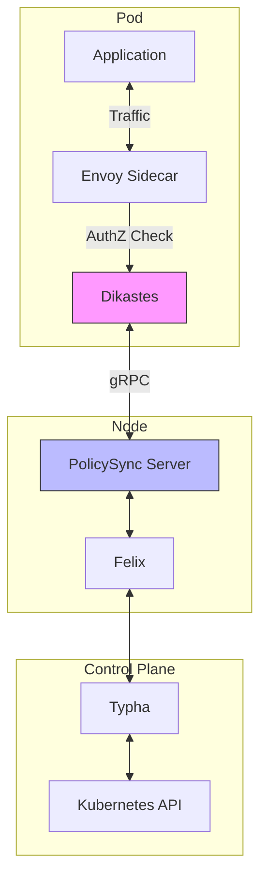
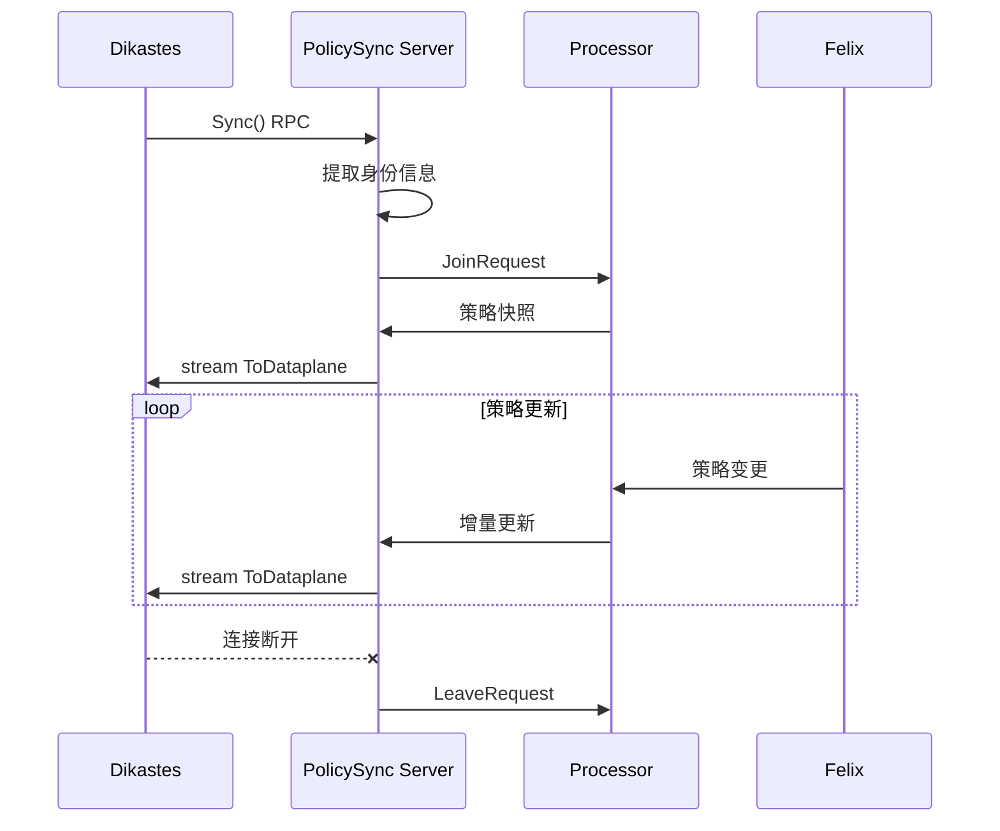
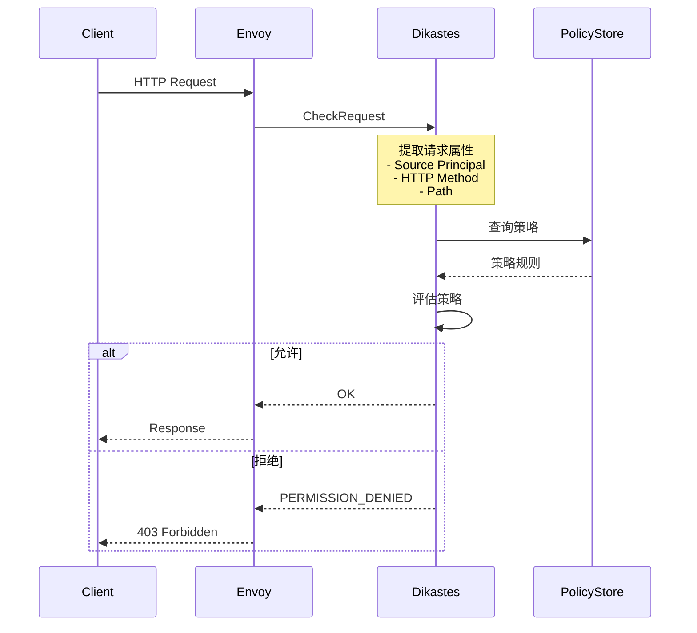
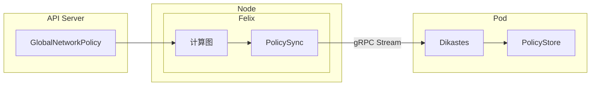
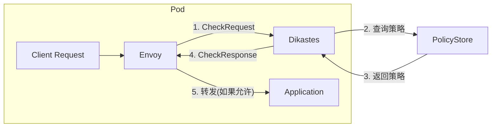
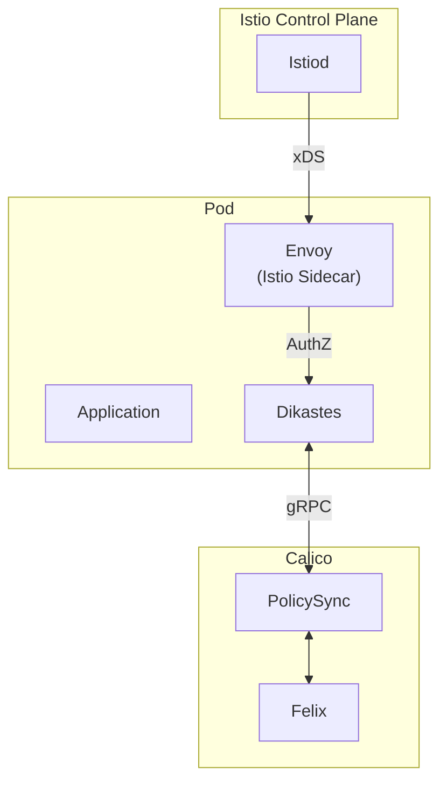

## 概述

Calico 可以与服务网格（如 Istio）集成，提供应用层（L7）策略能力。通过 Dikastes 组件，Calico 可以基于 HTTP 方法、路径、ServiceAccount 等应用层属性进行策略决策，实现零信任网络架构。

## 前置知识

- Kubernetes 网络模型
- Calico 策略模型
- Envoy 代理基础
- gRPC 协议

## 架构概述

### 整体架构



### 组件职责

| 组件 | 职责 |
|------|------|
| **Dikastes** | Envoy 外部授权服务，执行 L7 策略检查 |
| **PolicySync Server** | Felix 提供的策略同步服务，通过 Unix Socket 提供 |
| **Envoy** | 服务网格数据平面代理 |
| **Felix** | 策略计算和同步 |

## PolicySync 服务

### 服务端实现

```go
// 文件: felix/policysync/server.go:31-58

const (
    SockName       = "/policysync.sock"  // Unix Socket 路径
    OrchestratorId = "k8s"
    EndpointId     = "eth0"
)
const OutputQueueLen = 100

// Server 实现策略同步 API
type Server struct {
    proto.UnimplementedPolicySyncServer
    JoinUpdates chan<- interface{}    // 连接请求通道
    stats       chan<- *proto.DataplaneStats  // 统计通道
    nextJoinUID func() uint64         // UID 分配器
}

func NewServer(joins chan<- interface{}, collector collector.Collector, allocUID func() uint64) *Server {
    var stats chan<- *proto.DataplaneStats
    if collector != nil {
        stats = collector.ReportingChannel()
    }
    return &Server{
        JoinUpdates: joins,
        stats:       stats,
        nextJoinUID: allocUID,
    }
}
```

### gRPC 服务定义

```protobuf
// 文件: felix/proto/felixbackend.proto:5-29

service PolicySync {
  // Sync 流式 RPC，发送策略更新
  // 支持的消息类型：
  //  - InSync              // 同步完成信号
  //  - IPSetUpdate/Remove  // IP 集合更新
  //  - ActiveProfileUpdate/Remove  // Profile 更新
  //  - ActivePolicyUpdate/Remove   // Policy 更新
  //  - WorkloadEndpointUpdate/Remove  // 端点更新
  //  - ServiceAccountUpdate/Remove    // SA 更新
  //  - NamespaceUpdate/Remove         // 命名空间更新
  //  - RouteUpdate/Remove             // 路由更新
  rpc Sync(SyncRequest) returns (stream ToDataplane);

  // Report 上报数据平面统计
  rpc Report(DataplaneStats) returns (ReportResult);
}
```

### 连接处理流程

```go
// 文件: felix/policysync/server.go:65-137

func (s *Server) Sync(_ *proto.SyncRequest, stream proto.PolicySync_SyncServer) error {
    log.Info("New policy sync connection")

    // 1. 从请求上下文中提取工作负载身份
    cxt := stream.Context()
    creds, ok := binder.CallerFromContext(cxt)
    if !ok {
        return errors.New("unable to authenticate client")
    }
    workloadID := creds.Namespace + "/" + creds.Workload

    // 2. 分配唯一的连接 ID
    myJoinUID := s.nextJoinUID()

    // 3. 发送 Join 请求给 Processor
    updates := make(chan *proto.ToDataplane, OutputQueueLen)
    epID := types.WorkloadEndpointID{
        OrchestratorId: OrchestratorId,
        EndpointId:     EndpointId,
        WorkloadId:     workloadID,
    }
    joinMeta := JoinMetadata{
        EndpointID: epID,
        JoinUID:    myJoinUID,
    }
    s.JoinUpdates <- JoinRequest{
        JoinMetadata: joinMeta,
        C:            updates,
    }

    // 4. 清理逻辑（连接断开时执行）
    defer func() {
        // 发送 Leave 请求
        leaveRequest := LeaveRequest{JoinMetadata: joinMeta}
        s.JoinUpdates <- leaveRequest
        // 排空更新通道
        for range updates {
        }
    }()

    // 5. 转发更新到客户端
    for update := range updates {
        err := stream.Send(update)
        if err != nil {
            return err
        }
    }
    return nil
}
```

### 消息流程



## Dikastes 授权服务

### 主程序结构

```go
// 文件: app-policy/cmd/dikastes/dikastes.go:46-74

const usage = `Dikastes - the decider.

Usage:
  dikastes server [options]
  dikastes client <namespace> <account> [--method <method>] [options]

Options:
  -l --listen <port>     Unix domain socket path [default: /var/run/dikastes/dikastes.sock]
  -d --dial <target>     Target to dial. [default: localhost:50051]
  --debug                Log at Debug level.`

func main() {
    arguments, _ := docopt.ParseArgs(usage, nil, buildinfo.Version)

    if arguments["server"].(bool) {
        runServer(arguments)
    } else if arguments["client"].(bool) {
        runClient(arguments)
    }
}
```

### 服务端初始化

```go
// 文件: app-policy/cmd/dikastes/dikastes.go:76-161

func runServer(arguments map[string]interface{}) {
    filePath := arguments["--listen"].(string)
    dial := arguments["--dial"].(string)

    // 1. 创建 Unix Socket
    lis, _ := net.Listen("unix", filePath)
    os.Chmod(filePath, 0o777)  // 允许所有用户连接

    ctx, cancel := context.WithCancel(context.Background())
    defer cancel()

    // 2. 创建 gRPC 服务
    gs := grpc.NewServer()

    // 3. 初始化策略存储管理器
    storeManager := policystore.NewPolicyStoreManager()

    // 4. 创建授权检查服务器
    checkServer := checker.NewServer(ctx, storeManager)

    // 5. 注册 Envoy AuthZ 服务（支持多版本）
    authz.RegisterAuthorizationServer(gs, checkServer)           // v3
    authz_v2.RegisterAuthorizationServer(gs, checkServer.V2Compat())
    authz_v2alpha.RegisterAuthorizationServer(gs, checkServer.V2Compat())

    // 6. 启动策略同步客户端
    opts := uds.GetDialOptions()
    syncClient := syncher.NewClient(dial, storeManager, opts)
    go syncClient.Sync(ctx)

    // 7. 注册健康检查服务
    proto.RegisterHealthzServer(gs, health.NewHealthCheckService(syncClient))

    // 8. 启动 gRPC 服务
    go gs.Serve(lis)

    // 9. 等待信号
    sigChan := make(chan os.Signal, 1)
    signal.Notify(sigChan, os.Interrupt, syscall.SIGTERM)
    <-sigChan
    gs.GracefulStop()
}
```

### 授权检查逻辑

```go
// 文件: app-policy/checker/check.go:64-106

// Evaluate 评估流量是否匹配策略
func Evaluate(dir rules.RuleDir, store *policystore.PolicyStore, ep *proto.WorkloadEndpoint, flow Flow) []*calc.RuleID {
    _, trace := checkTiers(store, ep, dir, flow)
    return trace
}

// checkStore 检查策略并返回结果
func checkStore(store *policystore.PolicyStore, ep *proto.WorkloadEndpoint, dir rules.RuleDir, req Flow) (s status.Status) {
    s, _ = checkTiers(store, ep, dir, req)
    return
}

// checkTiers 检查分层策略
func checkTiers(store *policystore.PolicyStore, ep *proto.WorkloadEndpoint, dir rules.RuleDir, flow Flow) (s status.Status, trace []*calc.RuleID) {
    s = status.Status{Code: PERMISSION_DENIED}  // 默认拒绝

    if ep == nil {
        return
    }

    request := NewRequestCache(store, flow)

    // 遍历每个 Tier
    for _, tier := range ep.Tiers {
        policies := getPoliciesByDirection(dir, tier)
        if len(policies) == 0 {
            continue
        }

        action := NO_MATCH
    Policy:
        for _, pID := range policies {
            policy := store.PolicyByID[ftypes.ProtoToPolicyID(pID)]
            action, ruleIndex := checkPolicy(policy, dir, request)

            switch action {
            case ALLOW:
                s.Code = OK
                return
            case DENY:
                s.Code = PERMISSION_DENIED
                return
            case PASS:
                // 继续下一个 Tier
                break Policy
            }
        }

        // Tier 默认动作
        if action == NO_MATCH && tier.DefaultAction != string(v3.Pass) {
            s.Code = PERMISSION_DENIED
            return
        }
    }

    // 检查 Profile
    for _, name := range ep.ProfileIds {
        profile := store.ProfileByID[...]
        action, _ := checkProfile(profile, dir, request)
        if action == ALLOW {
            s.Code = OK
            return
        }
    }

    return
}
```

### 规则匹配

```go
// 文件: app-policy/checker/check.go:233-247

// checkRules 检查规则列表
func checkRules(rules []*proto.Rule, req *requestCache, policyNamespace string) (action Action, index int) {
    for i, r := range rules {
        if match(policyNamespace, r, req) {
            log.Debugf("checkRules: Rule matched %v", r)
            a := actionFromString(r.Action)
            if a != LOG {
                return a, i
            }
        }
    }
    return NO_MATCH, tierDefaultActionIndex
}

// actionFromString 转换动作字符串
func actionFromString(s string) Action {
    m := map[string]Action{
        "allow":     ALLOW,
        "deny":      DENY,
        "pass":      PASS,
        "next-tier": PASS,
        "log":       LOG,
    }
    return m[strings.ToLower(s)]
}
```

## Envoy 集成

### Envoy 外部授权

Dikastes 实现了 Envoy 的外部授权 API：



### CheckRequest 处理

```go
// Envoy AuthZ CheckRequest 结构
type CheckRequest struct {
    Attributes *AttributeContext
}

type AttributeContext struct {
    Source  *Peer
    Request *Request
}

type Peer struct {
    Principal string  // SPIFFE ID: spiffe://cluster.local/ns/<ns>/sa/<sa>
}

type Request struct {
    Http *HttpRequest
}

type HttpRequest struct {
    Method string
    Path   string
    Headers map[string]string
}
```

## 应用层策略

### GlobalNetworkPolicy 示例

```yaml
apiVersion: projectcalico.org/v3
kind: GlobalNetworkPolicy
metadata:
  name: allow-frontend-to-backend
spec:
  selector: app == 'backend'
  ingress:
    - action: Allow
      source:
        serviceAccounts:
          names:
            - frontend
          selector: role == 'web'
      http:
        methods:
          - GET
          - POST
        paths:
          - exact: /api/v1/data
          - prefix: /api/v2/
  egress:
    - action: Allow
```

### HTTP 规则匹配

```yaml
http:
  methods:
    - GET          # 精确匹配 HTTP 方法
    - POST
  paths:
    - exact: /api/v1/users           # 精确路径匹配
    - prefix: /api/v2/               # 前缀匹配
    - regex: /api/v[0-9]+/items/.*   # 正则匹配
```

### ServiceAccount 选择器

```yaml
source:
  serviceAccounts:
    names:
      - frontend      # 精确 SA 名称
    selector: role == 'api-client'  # SA 标签选择器
```

## 部署配置

### Dikastes Sidecar

```yaml
apiVersion: v1
kind: Pod
metadata:
  name: app-with-dikastes
spec:
  containers:
    - name: app
      image: myapp:latest
      ports:
        - containerPort: 8080

    - name: envoy
      image: envoyproxy/envoy:v1.28.0
      volumeMounts:
        - name: envoy-config
          mountPath: /etc/envoy

    - name: dikastes
      image: calico/dikastes:v3.27.0
      args:
        - server
        - --listen=/var/run/dikastes/dikastes.sock
        - --dial=/var/run/calico/policysync.sock
      volumeMounts:
        - name: dikastes-sock
          mountPath: /var/run/dikastes
        - name: policysync-sock
          mountPath: /var/run/calico

  volumes:
    - name: dikastes-sock
      emptyDir: {}
    - name: policysync-sock
      hostPath:
        path: /var/run/calico
```

### Envoy 配置

```yaml
static_resources:
  listeners:
    - name: listener_0
      address:
        socket_address:
          address: 0.0.0.0
          port_value: 8080
      filter_chains:
        - filters:
            - name: envoy.filters.network.http_connection_manager
              typed_config:
                "@type": type.googleapis.com/envoy.extensions.filters.network.http_connection_manager.v3.HttpConnectionManager
                stat_prefix: ingress_http
                http_filters:
                  # 外部授权过滤器
                  - name: envoy.filters.http.ext_authz
                    typed_config:
                      "@type": type.googleapis.com/envoy.extensions.filters.http.ext_authz.v3.ExtAuthz
                      grpc_service:
                        envoy_grpc:
                          cluster_name: dikastes
                      transport_api_version: V3
                  - name: envoy.filters.http.router
                    typed_config:
                      "@type": type.googleapis.com/envoy.extensions.filters.http.router.v3.Router
                route_config:
                  name: local_route
                  virtual_hosts:
                    - name: backend
                      domains: ["*"]
                      routes:
                        - match:
                            prefix: "/"
                          route:
                            cluster: local_service

  clusters:
    - name: dikastes
      type: STATIC
      connect_timeout: 0.25s
      http2_protocol_options: {}
      load_assignment:
        cluster_name: dikastes
        endpoints:
          - lb_endpoints:
              - endpoint:
                  address:
                    pipe:
                      path: /var/run/dikastes/dikastes.sock
```

## Felix PolicySync 配置

### FelixConfiguration

```yaml
apiVersion: projectcalico.org/v3
kind: FelixConfiguration
metadata:
  name: default
spec:
  # 启用 PolicySync
  policySyncPathPrefix: /var/run/calico
```

### 代码路径

```go
// 文件: felix/daemon/daemon.go

// 如果配置了 PolicySyncPathPrefix，启动 PolicySync 服务
if configParams.PolicySyncPathPrefix != "" {
    policySyncServer := policysync.NewServer(
        joins,
        collector,
        uidAllocator.NextUID,
    )
    // 注册 gRPC 服务
    policySyncServer.RegisterGrpc(grpcServer)
}
```

## 数据流

### 策略同步流



### 请求检查流



## 实验

### 实验 1：配置 PolicySync

```bash
# 1. 启用 PolicySync
kubectl patch felixconfiguration default --type='merge' \
  -p '{"spec":{"policySyncPathPrefix":"/var/run/calico"}}'

# 2. 验证 Socket 创建
kubectl exec -it -n calico-system ds/calico-node -c calico-node -- \
  ls -la /var/run/calico/policysync.sock

# 3. 查看 Felix 日志
kubectl logs -n calico-system ds/calico-node -c calico-node | grep -i policysync
```

### 实验 2：部署 Dikastes

```bash
# 1. 创建测试应用
cat <<EOF | kubectl apply -f -
apiVersion: v1
kind: Pod
metadata:
  name: test-dikastes
  labels:
    app: test
spec:
  containers:
    - name: app
      image: nginx:latest
      ports:
        - containerPort: 80
    - name: dikastes
      image: calico/dikastes:v3.27.0
      args:
        - server
        - --listen=/var/run/dikastes/dikastes.sock
        - --dial=unix:///var/run/calico/policysync.sock
        - --debug
      volumeMounts:
        - name: dikastes-sock
          mountPath: /var/run/dikastes
        - name: policysync-sock
          mountPath: /var/run/calico
  volumes:
    - name: dikastes-sock
      emptyDir: {}
    - name: policysync-sock
      hostPath:
        path: /var/run/calico
        type: Directory
EOF

# 2. 验证连接
kubectl logs test-dikastes -c dikastes
```

### 实验 3：测试应用层策略

```bash
# 1. 创建 ServiceAccount
kubectl create serviceaccount frontend
kubectl create serviceaccount backend

# 2. 部署测试 Pod
kubectl run frontend --image=curlimages/curl --serviceaccount=frontend -- sleep 3600
kubectl run backend --image=nginx --serviceaccount=backend --labels=app=backend

# 3. 创建应用层策略
cat <<EOF | kubectl apply -f -
apiVersion: projectcalico.org/v3
kind: GlobalNetworkPolicy
metadata:
  name: allow-get-only
spec:
  selector: app == 'backend'
  ingress:
    - action: Allow
      source:
        serviceAccounts:
          names:
            - frontend
      http:
        methods:
          - GET
    - action: Deny
EOF

# 4. 测试访问
# GET 应该被允许
kubectl exec frontend -- curl -X GET http://<backend-ip>

# POST 应该被拒绝
kubectl exec frontend -- curl -X POST http://<backend-ip>
```

## 与 Istio 集成

### 集成模式



### 优势

1. **统一策略管理** - 使用 Calico 策略统一管理 L3/L4 和 L7 策略
2. **深度可见性** - 结合 Calico 流量日志和 Istio 遥测
3. **零信任安全** - 基于身份的细粒度访问控制
4. **渐进式采用** - 可以逐步从 L3/L4 策略过渡到 L7 策略

## 总结

Calico 与服务网格的集成提供了：

1. **应用层策略** - 基于 HTTP 方法、路径等进行访问控制
2. **身份感知** - 基于 ServiceAccount 进行策略匹配
3. **统一框架** - 复用 Calico 策略模型和分发机制
4. **可扩展架构** - Dikastes 可作为任何 Envoy 部署的外部授权服务

## 参考资料

- [Calico Application Layer Policy](https://docs.tigera.io/calico/latest/network-policy/istio/)
- [Envoy External Authorization](https://www.envoyproxy.io/docs/envoy/latest/intro/arch_overview/security/ext_authz_filter)
- `felix/policysync/server.go` - PolicySync 服务端
- `app-policy/cmd/dikastes/dikastes.go` - Dikastes 主程序
- `app-policy/checker/check.go` - 策略检查逻辑
