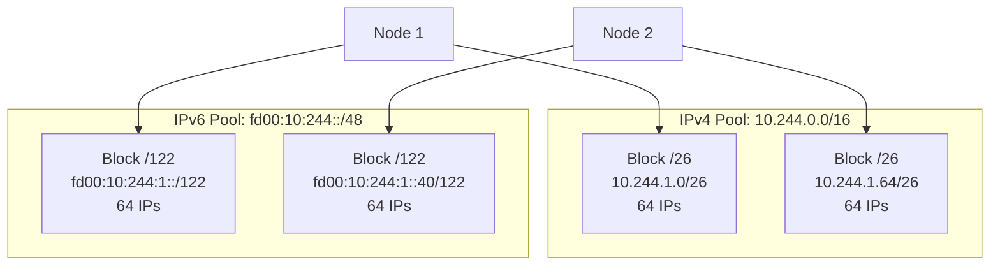
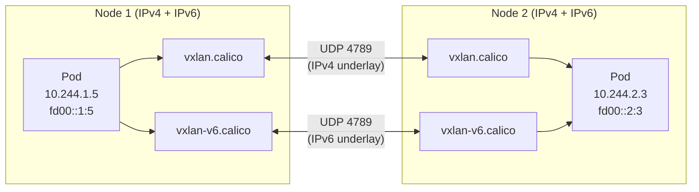

## 概述

Calico 完整支持 IPv6 和 IPv4/IPv6 双栈网络，允许 Pod 同时拥有 IPv4 和 IPv6 地址。本章深入分析 Calico 的双栈实现，包括 IPAM、路由、策略和封装的 IPv6 支持。

## 前置知识

- IPv6 地址与路由基础
- Kubernetes 双栈网络模型
- Calico IPAM 机制
- BGP 路由原理

## Kubernetes 双栈网络

### 双栈要求

Kubernetes 1.21+ 默认启用双栈支持：

```yaml
# kube-apiserver 配置
--service-cluster-ip-range=10.96.0.0/16,fd00:10:96::/112
--node-cidr-mask-size-ipv4=24
--node-cidr-mask-size-ipv6=120

# kube-controller-manager 配置
--cluster-cidr=10.244.0.0/16,fd00:10:244::/56
--service-cluster-ip-range=10.96.0.0/16,fd00:10:96::/112
```

### Pod 双栈 IP

```yaml
apiVersion: v1
kind: Pod
metadata:
  name: dual-stack-pod
spec:
  containers:
    - name: app
      image: nginx
status:
  podIPs:
    - ip: 10.244.1.5      # IPv4
    - ip: fd00:10:244:1::5  # IPv6
```

## Calico IPPool 配置

### IPv4 IPPool

```yaml
apiVersion: projectcalico.org/v3
kind: IPPool
metadata:
  name: ipv4-pool
spec:
  cidr: 10.244.0.0/16
  blockSize: 26                # 默认 /26，64 个 IP
  ipipMode: Never
  vxlanMode: CrossSubnet
  natOutgoing: true
  nodeSelector: all()
```

### IPv6 IPPool

```yaml
apiVersion: projectcalico.org/v3
kind: IPPool
metadata:
  name: ipv6-pool
spec:
  cidr: fd00:10:244::/48
  blockSize: 122               # 默认 /122，64 个 IP
  ipipMode: Never              # IPIP 不支持 IPv6
  vxlanMode: CrossSubnet       # VXLAN 支持 IPv6
  natOutgoing: true
  nodeSelector: all()
```

### IPPool 结构

```go
// 文件: api/pkg/apis/projectcalico/v3/ippool.go:48-97

type IPPoolSpec struct {
    // IP 池 CIDR
    CIDR string `json:"cidr" validate:"net"`

    // VXLAN 模式：Never, Always, CrossSubnet
    VXLANMode VXLANMode `json:"vxlanMode,omitempty"`

    // IPIP 模式：Never, Always, CrossSubnet（仅 IPv4）
    IPIPMode IPIPMode `json:"ipipMode,omitempty"`

    // 出站 NAT
    NATOutgoing bool `json:"natOutgoing,omitempty"`

    // 禁用分配
    Disabled bool `json:"disabled,omitempty"`

    // 禁用 BGP 导出
    DisableBGPExport bool `json:"disableBGPExport,omitempty"`

    // Block 大小：IPv4 默认 26，IPv6 默认 122
    BlockSize int `json:"blockSize,omitempty"`

    // 节点选择器
    NodeSelector string `json:"nodeSelector,omitempty"`

    // 允许的用途
    AllowedUses []IPPoolAllowedUse `json:"allowedUses,omitempty"`
}
```

## IPAM 双栈分配

### AutoAssign 参数

```go
// 文件: libcalico-go/lib/ipam/ipam_types.go:52-96

type AutoAssignArgs struct {
    // IPv4 分配数量
    Num4 int

    // IPv6 分配数量
    Num6 int

    // 分配句柄
    HandleID *string

    // 元数据属性
    Attrs map[string]string

    // 主机名
    Hostname string

    // IPv4 池列表
    IPv4Pools []cnet.IPNet

    // IPv6 池列表
    IPv6Pools []cnet.IPNet

    // 每主机最大 Block 数
    MaxBlocksPerHost int

    // IPv4 保留地址属性
    HostReservedAttrIPv4s *HostReservedAttr

    // IPv6 保留地址属性
    HostReservedAttrIPv6s *HostReservedAttr

    // 用途（Workload/Tunnel）
    IntendedUse v3.IPPoolAllowedUse
}
```

### 双栈分配流程

```go
// 文件: libcalico-go/lib/ipam/ipam.go:105-147

func (c ipamClient) AutoAssign(ctx context.Context, args AutoAssignArgs) (*IPAMAssignments, *IPAMAssignments, error) {
    hostname, err := decideHostname(args.Hostname)
    if err != nil {
        return nil, nil, err
    }
    log.Infof("Auto-assign %d ipv4, %d ipv6 addrs for host '%s'", args.Num4, args.Num6, hostname)

    var v4ia, v6ia *IPAMAssignments

    // 分配 IPv4 地址
    if args.Num4 != 0 {
        log.Debugf("Assigning IPv4 addresses")
        // 验证 IPv4Pools 确实是 IPv4
        for _, pool := range args.IPv4Pools {
            if pool.IP.To4() == nil {
                return nil, nil, fmt.Errorf("IPv4 pool contains IPv6 address")
            }
        }
        v4ia, err = c.autoAssign(ctx, args.Num4, args.HandleID, args.Attrs,
            args.IPv4Pools, 4, hostname, args.MaxBlocksPerHost,
            args.HostReservedAttrIPv4s, args.IntendedUse, args.Namespace)
        if err != nil {
            return v4ia, nil, err
        }
    }

    // 分配 IPv6 地址
    if args.Num6 != 0 {
        log.Debugf("Assigning IPv6 addresses")
        // 验证 IPv6Pools 确实是 IPv6
        for _, pool := range args.IPv6Pools {
            if pool.IP.To4() != nil {
                return nil, nil, fmt.Errorf("IPv6 pool contains IPv4 address")
            }
        }
        v6ia, err = c.autoAssign(ctx, args.Num6, args.HandleID, args.Attrs,
            args.IPv6Pools, 6, hostname, args.MaxBlocksPerHost,
            args.HostReservedAttrIPv6s, args.IntendedUse, args.Namespace)
        if err != nil {
            return v4ia, v6ia, err
        }
    }

    return v4ia, v6ia, nil
}
```

### Block 大小差异

| IP 版本 | 默认 Block 大小 | 地址数量 | 说明 |
|---------|-----------------|----------|------|
| IPv4 | /26 | 64 | 适合中小规模 Pod |
| IPv6 | /122 | 64 | 保持一致的 Block 容量 |



## Felix IPv6 支持

### FelixConfiguration

```yaml
apiVersion: projectcalico.org/v3
kind: FelixConfiguration
metadata:
  name: default
spec:
  # 启用 IPv6 支持
  ipv6Support: true

  # 路由刷新间隔
  routeRefreshInterval: 90s

  # VXLAN IPv6 配置
  vxlanMTUV6: 1430

  # WireGuard IPv6 配置
  wireguardEnabledV6: true
  wireguardInterfaceNameV6: wg-v6.cali
  wireguardListeningPortV6: 51821
  wireguardMTUV6: 1420

  # 设备路由源地址
  deviceRouteSourceAddressIPv6: "fd00::1"
```

### IP 版本处理

```go
// 文件: felix/rules/static.go

// 根据 IP 版本选择规则表
func (r *DefaultRuleRenderer) filterTable(ipVersion uint8) Table {
    if ipVersion == 4 {
        return r.filterTableIPv4
    }
    return r.filterTableIPv6
}

// 处理双栈 CIDR
func (r *DefaultRuleRenderer) processCIDR(cidr string) {
    ip, _, _ := net.ParseCIDR(cidr)
    if ip.To4() != nil {
        // IPv4 处理
        r.handleIPv4CIDR(cidr)
    } else {
        // IPv6 处理
        r.handleIPv6CIDR(cidr)
    }
}
```

## 封装模式

### VXLAN 双栈

VXLAN 是唯一同时支持 IPv4 和 IPv6 的封装模式：



### 封装模式对比

| 模式 | IPv4 支持 | IPv6 支持 | 说明 |
|------|-----------|-----------|------|
| BGP（纯路由） | Yes | Yes | 推荐用于 IPv6 |
| IPIP | Yes | No | 仅 IPv4 |
| VXLAN | Yes | Yes | 双栈推荐 |
| WireGuard | Yes | Yes | 双栈加密 |

### VXLAN IPv6 配置

```yaml
apiVersion: projectcalico.org/v3
kind: IPPool
metadata:
  name: ipv6-vxlan
spec:
  cidr: fd00:10:244::/48
  vxlanMode: CrossSubnet    # 跨子网使用 VXLAN
  ipipMode: Never           # IPv6 不支持 IPIP
  natOutgoing: true
```

## 策略 IPv6 支持

### NetworkPolicy 双栈

```yaml
apiVersion: projectcalico.org/v3
kind: NetworkPolicy
metadata:
  name: allow-ipv6-ingress
  namespace: default
spec:
  selector: app == 'web'
  ingress:
    # IPv4 规则
    - action: Allow
      source:
        nets:
          - 10.0.0.0/8
    # IPv6 规则
    - action: Allow
      source:
        nets:
          - fd00::/8
          - 2001:db8::/32
  egress:
    - action: Allow
```

### GlobalNetworkPolicy 双栈

```yaml
apiVersion: projectcalico.org/v3
kind: GlobalNetworkPolicy
metadata:
  name: deny-external-ipv6
spec:
  selector: all()
  ingress:
    # 允许集群内 IPv6
    - action: Allow
      source:
        nets:
          - fd00:10:244::/48
    # 拒绝外部 IPv6
    - action: Deny
      protocol: IPv6
  egress:
    - action: Allow
```

### 规则生成

```go
// Felix 规则渲染器处理 IPv6
func (r *DefaultRuleRenderer) policyRuleToIptablesRules(rule *proto.Rule, ipVersion uint8) []iptables.Rule {
    var rules []iptables.Rule

    // 检查 IP 版本匹配
    if rule.IpVersion != 0 && uint8(rule.IpVersion) != ipVersion {
        return nil
    }

    // 处理源/目标 CIDR
    for _, srcNet := range rule.SrcNet {
        ip, _, _ := net.ParseCIDR(srcNet)
        if (ip.To4() != nil) != (ipVersion == 4) {
            continue  // IP 版本不匹配
        }
        // 添加规则...
    }

    return rules
}
```

## BGP IPv6

### BGPConfiguration

```yaml
apiVersion: projectcalico.org/v3
kind: BGPConfiguration
metadata:
  name: default
spec:
  logSeverityScreen: Info
  nodeToNodeMeshEnabled: true

  # IPv4 Service CIDR
  serviceClusterIPs:
    - cidr: 10.96.0.0/16

  # IPv6 Service CIDR
  serviceClusterIPs:
    - cidr: fd00:10:96::/112

  # 外部 CIDR 通告
  serviceExternalIPs:
    - cidr: 203.0.113.0/24
    - cidr: 2001:db8:1::/48
```

### BGPPeer IPv6

```yaml
apiVersion: projectcalico.org/v3
kind: BGPPeer
metadata:
  name: ipv6-peer
spec:
  # IPv6 对等地址
  peerIP: 2001:db8::1
  asNumber: 64512

  # 节点选择器
  nodeSelector: rack == 'rack1'
```

### BIRD IPv6 配置

confd 生成的 BIRD IPv6 配置：

```
# bird6.cfg
router id 192.168.1.10;

protocol kernel {
    ipv6 {
        export all;
        import none;
    };
}

protocol device {
}

protocol bgp mesh_192_168_1_11 {
    local as 64512;
    neighbor 2001:db8::11 as 64512;
    ipv6 {
        import all;
        export filter {
            if net ~ [ fd00:10:244::/48+ ] then accept;
            reject;
        };
    };
}
```

## WireGuard IPv6

### 双栈 WireGuard 配置

```yaml
apiVersion: projectcalico.org/v3
kind: FelixConfiguration
metadata:
  name: default
spec:
  # IPv4 WireGuard
  wireguardEnabled: true
  wireguardInterfaceName: wireguard.cali
  wireguardListeningPort: 51820
  wireguardMTU: 1440

  # IPv6 WireGuard
  wireguardEnabledV6: true
  wireguardInterfaceNameV6: wg-v6.cali
  wireguardListeningPortV6: 51821
  wireguardMTUV6: 1420
```

### WireGuard IPv6 处理

```go
// 文件: felix/wireguard/wireguard.go

func NewWithShims(..., ipVersion uint8, ...) *Wireguard {
    interfaceName := config.InterfaceName
    if ipVersion == 6 {
        interfaceName = config.InterfaceNameV6
    }

    // 创建 WireGuard 管理器
    return &Wireguard{
        ipVersion:     ipVersion,
        interfaceName: interfaceName,
        // ...
    }
}

func (w *Wireguard) Enabled() bool {
    switch w.ipVersion {
    case 4:
        return w.config.Enabled
    case 6:
        return w.config.EnabledV6
    }
    return false
}
```

## 数据平面双栈

### 路由表

```bash
# IPv4 路由表
10.244.1.0/26 via 192.168.1.11 dev eth0 proto bird
10.244.2.0/26 via 192.168.1.12 dev eth0 proto bird

# IPv6 路由表
fd00:10:244:1::/122 via 2001:db8::11 dev eth0 proto bird
fd00:10:244:2::/122 via 2001:db8::12 dev eth0 proto bird
```

### iptables/ip6tables

Felix 同时管理 iptables 和 ip6tables：

```bash
# IPv4 策略链
iptables -t filter -L cali-fw-cali12345678901

# IPv6 策略链
ip6tables -t filter -L cali-fw-cali12345678901
```

### nftables 双栈

nftables 可以在单个规则集中处理双栈：

```
table inet calico {
    chain cali-forward {
        type filter hook forward priority 0;

        # IPv4 规则
        ip saddr 10.244.0.0/16 accept

        # IPv6 规则
        ip6 saddr fd00:10:244::/48 accept
    }
}
```

## CNI 双栈配置

### CNI 配置

```json
{
  "name": "k8s-pod-network",
  "cniVersion": "0.3.1",
  "plugins": [
    {
      "type": "calico",
      "datastore_type": "kubernetes",
      "ipam": {
        "type": "calico-ipam",
        "assign_ipv4": "true",
        "assign_ipv6": "true",
        "ipv4_pools": ["10.244.0.0/16"],
        "ipv6_pools": ["fd00:10:244::/48"]
      }
    }
  ]
}
```

### CNI ADD 双栈响应

```json
{
  "cniVersion": "0.3.1",
  "interfaces": [...],
  "ips": [
    {
      "version": "4",
      "address": "10.244.1.5/32",
      "gateway": "169.254.1.1"
    },
    {
      "version": "6",
      "address": "fd00:10:244:1::5/128",
      "gateway": "fe80::1"
    }
  ]
}
```

## 实验

### 实验 1：配置双栈 IPPool

```bash
# 1. 创建 IPv4 IPPool
cat <<EOF | calicoctl apply -f -
apiVersion: projectcalico.org/v3
kind: IPPool
metadata:
  name: ipv4-pool
spec:
  cidr: 10.244.0.0/16
  blockSize: 26
  vxlanMode: CrossSubnet
  natOutgoing: true
EOF

# 2. 创建 IPv6 IPPool
cat <<EOF | calicoctl apply -f -
apiVersion: projectcalico.org/v3
kind: IPPool
metadata:
  name: ipv6-pool
spec:
  cidr: fd00:10:244::/48
  blockSize: 122
  vxlanMode: CrossSubnet
  natOutgoing: true
EOF

# 3. 验证 IPPool
calicoctl get ippool -o wide
```

### 实验 2：启用 IPv6 支持

```bash
# 1. 更新 FelixConfiguration
kubectl patch felixconfiguration default --type='merge' \
  -p '{"spec":{"ipv6Support":true}}'

# 2. 验证 Felix 配置
kubectl get felixconfiguration default -o yaml | grep -i ipv6

# 3. 检查 ip6tables 规则
kubectl exec -it -n calico-system ds/calico-node -c calico-node -- \
  ip6tables -L -n -v | head -50
```

### 实验 3：创建双栈 Pod

```bash
# 1. 创建双栈 Pod
cat <<EOF | kubectl apply -f -
apiVersion: v1
kind: Pod
metadata:
  name: dual-stack-test
spec:
  containers:
    - name: test
      image: busybox
      command: ["sleep", "3600"]
EOF

# 2. 检查 Pod IP
kubectl get pod dual-stack-test -o jsonpath='{.status.podIPs}'

# 3. 验证 IPv6 连接
kubectl exec dual-stack-test -- ping6 -c 3 fd00:10:244:1::1

# 4. 查看路由
kubectl exec dual-stack-test -- ip -6 route
```

### 实验 4：双栈策略

```bash
# 1. 创建双栈 NetworkPolicy
cat <<EOF | kubectl apply -f -
apiVersion: projectcalico.org/v3
kind: NetworkPolicy
metadata:
  name: dual-stack-policy
  namespace: default
spec:
  selector: app == 'dual-stack-test'
  ingress:
    - action: Allow
      source:
        nets:
          - 10.244.0.0/16      # IPv4
          - fd00:10:244::/48   # IPv6
  egress:
    - action: Allow
EOF

# 2. 验证策略
calicoctl get networkpolicy dual-stack-policy -o yaml

# 3. 检查 iptables 规则
kubectl exec -it -n calico-system ds/calico-node -- \
  iptables -L cali-pi-* -n

# 4. 检查 ip6tables 规则
kubectl exec -it -n calico-system ds/calico-node -- \
  ip6tables -L cali-pi-* -n
```

### 实验 5：BGP IPv6

```bash
# 1. 配置 BGP IPv6 对等
cat <<EOF | calicoctl apply -f -
apiVersion: projectcalico.org/v3
kind: BGPConfiguration
metadata:
  name: default
spec:
  nodeToNodeMeshEnabled: true
  serviceClusterIPs:
    - cidr: 10.96.0.0/16
    - cidr: fd00:10:96::/112
EOF

# 2. 检查 BGP 状态
calicoctl node status

# 3. 查看 IPv6 路由
ip -6 route | grep bird
```

## 故障排查

### 常见问题

#### 1. IPv6 地址未分配

```bash
# 检查 IPPool 配置
calicoctl get ippool -o wide

# 检查节点 IPAM Block
calicoctl ipam show --show-blocks

# 检查 Felix IPv6 支持
kubectl get felixconfiguration default -o yaml | grep ipv6
```

#### 2. IPv6 路由不通

```bash
# 检查 IPv6 路由表
ip -6 route

# 检查 BGP 邻居
calicoctl node status

# 检查 VXLAN 接口（如果使用）
ip -6 addr show vxlan-v6.calico
```

#### 3. IPv6 策略不生效

```bash
# 检查 ip6tables 规则
ip6tables -L -n -v

# 检查 Felix 日志
kubectl logs -n calico-system ds/calico-node -c calico-node | grep -i ipv6

# 验证策略
calicoctl get networkpolicy -o wide
```

### 调试命令

```bash
# 双栈连接测试
kubectl exec test-pod -- ping 10.244.2.3        # IPv4
kubectl exec test-pod -- ping6 fd00:10:244:2::3  # IPv6

# 查看双栈地址
ip addr show | grep -E "inet |inet6 "

# BGP 路由
birdc6 show route
birdc6 show protocols

# IPAM 状态
calicoctl ipam show --show-configuration
```

## 总结

Calico 的双栈和 IPv6 支持包括：

1. **完整的 IPAM** - 独立的 IPv4 和 IPv6 地址池
2. **双栈策略** - 同一策略可包含 IPv4 和 IPv6 规则
3. **多种封装** - VXLAN 和 WireGuard 支持双栈
4. **BGP 双栈** - 同时通告 IPv4 和 IPv6 路由
5. **透明集成** - 与 Kubernetes 双栈无缝配合

## 参考资料

- [Calico IPv6 文档](https://docs.tigera.io/calico/latest/networking/ipam/ipv6)
- [Kubernetes 双栈网络](https://kubernetes.io/docs/concepts/services-networking/dual-stack/)
- `libcalico-go/lib/ipam/ipam.go` - IPAM 实现
- `api/pkg/apis/projectcalico/v3/ippool.go` - IPPool API
- `felix/rules/static.go` - 规则渲染
