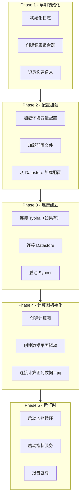
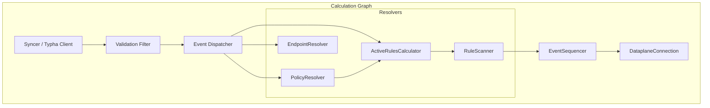
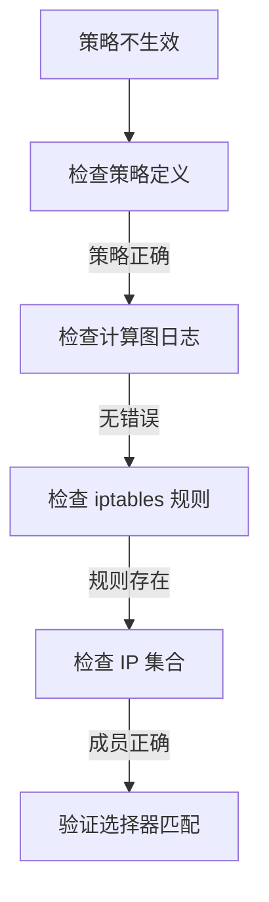

## 概述

本章深入分析 Felix 的调试链路，包括启动流程追踪、计算图调试、数据平面同步状态检查和关键日志点定位。

## 前置知识

- Felix 架构和组件
- 计算图原理
- Go 语言调试基础
- 日志分析技能

## 启动流程追踪

### Felix 启动入口

```go
// 文件: felix/daemon/daemon.go:113-132

func Run(configFile string, gitVersion string, buildDate string, gitRevision string) {
    // 1. 初始化早期日志
    logutils.ConfigureEarlyLogging()

    ctx := context.Background()

    // 2. 设置构建信息
    if len(buildinfo.Version) == 0 && len(gitVersion) != 0 {
        buildinfo.Version = gitVersion
        buildinfo.BuildDate = buildDate
        buildinfo.GitRevision = gitRevision
    }

    // 3. 记录启动日志
    buildInfoLogCxt := log.WithFields(log.Fields{
        "version":    buildinfo.Version,
        "builddate":  buildinfo.BuildDate,
        "gitcommit":  buildinfo.GitRevision,
        "GOMAXPROCS": runtime.GOMAXPROCS(0),
    })
    buildInfoLogCxt.Info("Felix starting up")

    // 4. 创建健康聚合器
    healthAggregator := health.NewHealthAggregator()

    // 5. 注册启动报告器
    const healthName = "FelixStartup"
    healthAggregator.RegisterReporter(healthName, &health.HealthReport{Live: true, Ready: true}, 0)

    // ...继续初始化
}
```

### 启动阶段



### 关键启动日志

```bash
# 启动信息
I0115 10:00:00.000000 Felix starting up version=v3.27.0 builddate=... gitcommit=...

# 配置加载
I0115 10:00:01.000000 Loading config from environment
I0115 10:00:01.100000 Merging config from file: /etc/calico/felix.cfg
I0115 10:00:01.200000 Loading config from datastore

# Typha 连接
I0115 10:00:02.000000 Connecting to Typha addresses=[...]
I0115 10:00:02.500000 Connected to Typha

# 计算图初始化
I0115 10:00:03.000000 Initializing calculation graph
I0115 10:00:03.100000 Calculation graph initialized

# 数据平面启动
I0115 10:00:04.000000 Starting internal dataplane driver
I0115 10:00:04.500000 Dataplane driver started

# 就绪报告
I0115 10:00:05.000000 Felix startup complete
```

## 计算图调试

### 计算图组件



### 调试计算图状态

```bash
# 启用计算图调试日志
kubectl patch felixconfiguration default --type='merge' \
  -p '{"spec":{"logSeverityScreen":"Debug","logDebugFilenameRegex":"calc"}}'

# 查看计算图日志
kubectl logs -n calico-system ds/calico-node -c calico-node | grep -i "calc_graph\|active_rules\|policy_resolver"
```

### 关键调试点

#### 1. PolicyResolver 调试

```go
// 文件: felix/calc/policy_resolver.go

// 策略解析日志
log.WithFields(log.Fields{
    "endpoint": epID,
    "tiers":    tierInfo,
}).Debug("Calculated tier data for endpoint")
```

```bash
# 过滤策略解析日志
kubectl logs -n calico-system ds/calico-node -c calico-node | grep "policy_resolver"
```

#### 2. ActiveRulesCalculator 调试

```go
// 文件: felix/calc/active_rules_calculator.go

// 活动规则日志
log.WithFields(log.Fields{
    "policyID": policyID,
    "action":   "add/remove",
}).Debug("Active policy changed")
```

```bash
# 过滤活动规则日志
kubectl logs -n calico-system ds/calico-node -c calico-node | grep "active_rules"
```

#### 3. RuleScanner 调试

```go
// 文件: felix/calc/rule_scanner.go

// IP 集合生成日志
log.WithFields(log.Fields{
    "ipSetID":  ipSetID,
    "selector": selector,
}).Debug("Created IP set for selector")
```

```bash
# 过滤规则扫描日志
kubectl logs -n calico-system ds/calico-node -c calico-node | grep "rule_scanner\|ipset"
```

### 模拟计算图挂起

```yaml
# 仅用于测试！
apiVersion: projectcalico.org/v3
kind: FelixConfiguration
metadata:
  name: default
spec:
  # 模拟计算图挂起（测试看门狗）
  debugSimulateCalcGraphHangAfter: 30s
```

## 数据平面调试

### 数据平面状态

```go
// 文件: felix/dataplane/linux/int_dataplane.go

type InternalDataplane struct {
    // 各种管理器
    iptablesRawMangleAndFilterTables *iptables.Table
    iptablesNATTables                *iptables.Table
    ipSets                           *ipsets.IPSets
    routeTable                       *routetable.RouteTable

    // 同步状态
    datastoreInSync     bool
    ifaceMonitorInSync  bool
    routeTableInSync    bool

    // 健康报告
    health *health.HealthAggregator
}
```

### 同步状态检查

```bash
# 检查数据平面同步状态
kubectl exec -it -n calico-system ds/calico-node -c calico-node -- \
  wget -qO- http://localhost:9099/readiness

# 输出示例：
# +-------------------+---------+-----------+-----------+--------+
# | COMPONENT         | TIMEOUT | LIVENESS  | READINESS | DETAIL |
# +-------------------+---------+-----------+-----------+--------+
# | int-dataplane     | 90s     | live      | ready     |        |
# | dataplane-resync  | 90s     | live      | ready     |        |
# +-------------------+---------+-----------+-----------+--------+
```

### 数据平面日志

```bash
# iptables 管理日志
kubectl logs -n calico-system ds/calico-node -c calico-node | grep -i "iptables\|table"

# IP 集合日志
kubectl logs -n calico-system ds/calico-node -c calico-node | grep -i "ipset"

# 路由表日志
kubectl logs -n calico-system ds/calico-node -c calico-node | grep -i "route"
```

### 关键调试日志

```bash
# 数据平面驱动启动
D0115 10:00:04.000000 Starting internal dataplane driver
D0115 10:00:04.001000 Initializing iptables
D0115 10:00:04.100000 Creating ipsets manager
D0115 10:00:04.200000 Creating route table manager

# 策略同步
D0115 10:00:05.000000 Received policy update: policy-name
D0115 10:00:05.001000 Rendering iptables rules for policy
D0115 10:00:05.100000 Applying iptables rules

# IP 集合更新
D0115 10:00:06.000000 Updating ipset: cali40s:xxx
D0115 10:00:06.010000 Added 5 members to ipset

# 路由更新
D0115 10:00:07.000000 Adding route: 10.244.1.0/26 via 192.168.1.11
D0115 10:00:07.010000 Route added successfully
```

## 事件追踪

### Proto 消息类型

```protobuf
// 文件: felix/proto/felixbackend.proto

message ToDataplane {
    uint64 sequence_number = 15;
    oneof payload {
        InSync in_sync = 1;
        IPSetUpdate ipset_update = 2;
        IPSetDeltaUpdate ipset_delta_update = 3;
        ActivePolicyUpdate active_policy_update = 7;
        WorkloadEndpointUpdate workload_endpoint_update = 11;
        RouteUpdate route_update = 23;
        // ...
    }
}
```

### 事件日志

```bash
# 查看收到的事件
kubectl logs -n calico-system ds/calico-node -c calico-node | grep "ToDataplane\|sequence_number"

# 查看策略事件
kubectl logs -n calico-system ds/calico-node -c calico-node | grep "ActivePolicy"

# 查看端点事件
kubectl logs -n calico-system ds/calico-node -c calico-node | grep "WorkloadEndpoint"
```

### 事件序列号追踪

```go
// 事件序列号用于关联日志
log.WithField("seqNo", msg.SequenceNumber).Debug("Processing message")
```

```bash
# 按序列号追踪事件处理
kubectl logs -n calico-system ds/calico-node -c calico-node | grep "seqNo=12345"
```

## Typha 连接调试

### 连接状态

```bash
# 查看 Typha 连接日志
kubectl logs -n calico-system ds/calico-node -c calico-node | grep -i "typha\|sync.?client"

# 常见日志
I0115 10:00:02.000000 Connecting to Typha at 10.0.0.1:5473
I0115 10:00:02.500000 Connected to Typha, starting sync
I0115 10:00:03.000000 Received snapshot from Typha
I0115 10:00:03.100000 In sync with Typha
```

### 连接问题排查

```bash
# 检查 Typha 服务
kubectl get svc -n calico-system calico-typha

# 检查 Typha Pod
kubectl get pods -n calico-system -l k8s-app=calico-typha

# 检查连接
kubectl exec -it -n calico-system ds/calico-node -c calico-node -- \
  nc -zv calico-typha.calico-system.svc.cluster.local 5473
```

## 关键断点位置

### 策略处理链

| 文件 | 函数 | 说明 |
|------|------|------|
| `calc/calc_graph.go` | `NewCalculationGraph()` | 计算图创建 |
| `calc/policy_resolver.go` | `OnUpdate()` | 策略更新处理 |
| `calc/active_rules_calculator.go` | `OnPolicyMatch()` | 活动规则计算 |
| `calc/rule_scanner.go` | `ScanRules()` | 规则扫描 |
| `calc/event_sequencer.go` | `Flush()` | 事件排序输出 |

### 数据平面链

| 文件 | 函数 | 说明 |
|------|------|------|
| `dataplane/linux/int_dataplane.go` | `NewIntDataplaneDriver()` | 数据平面创建 |
| `dataplane/linux/int_dataplane.go` | `apply()` | 应用变更 |
| `iptables/table.go` | `Apply()` | iptables 应用 |
| `ipsets/ipsets.go` | `ApplyUpdates()` | IP 集合应用 |
| `routetable/route_table.go` | `Apply()` | 路由表应用 |

### 使用 Delve 调试

```bash
# 构建带调试信息的 Felix
cd felix
go build -gcflags="all=-N -l" -o bin/calico-felix ./cmd/calico-felix

# 使用 Delve 启动
dlv exec ./bin/calico-felix -- --config=/etc/calico/felix.cfg

# 设置断点
(dlv) break calc/policy_resolver.go:100
(dlv) break dataplane/linux/int_dataplane.go:200

# 继续执行
(dlv) continue
```

## 问题诊断流程

### 策略不生效



```bash
# 1. 检查策略是否正确创建
calicoctl get networkpolicy -n <namespace> -o yaml

# 2. 检查计算图是否处理
kubectl logs -n calico-system ds/calico-node -c calico-node | grep "<policy-name>"

# 3. 检查 iptables 规则
kubectl exec -it -n calico-system ds/calico-node -c calico-node -- \
  iptables-save | grep "<policy-hash>"

# 4. 检查 IP 集合
kubectl exec -it -n calico-system ds/calico-node -c calico-node -- \
  ipset list | grep -A 20 "cali40"
```

### Pod 网络不通

```bash
# 1. 检查 Pod 端点
calicoctl get workloadendpoint -A | grep <pod-name>

# 2. 检查路由
kubectl exec -it -n calico-system ds/calico-node -c calico-node -- \
  ip route | grep <pod-ip>

# 3. 检查 iptables
kubectl exec -it -n calico-system ds/calico-node -c calico-node -- \
  iptables -L -n -v | grep <interface>

# 4. 检查 conntrack
kubectl exec -it -n calico-system ds/calico-node -c calico-node -- \
  conntrack -L | grep <pod-ip>
```

## 日志级别动态调整

### 运行时调整

```bash
# 仅对特定模块启用 Debug
kubectl patch felixconfiguration default --type='merge' \
  -p '{"spec":{"logSeverityScreen":"Info","logDebugFilenameRegex":"calc|policy"}}'

# 完全 Debug 模式
kubectl patch felixconfiguration default --type='merge' \
  -p '{"spec":{"logSeverityScreen":"Debug","logDebugFilenameRegex":""}}'

# 恢复正常
kubectl patch felixconfiguration default --type='merge' \
  -p '{"spec":{"logSeverityScreen":"Info","logDebugFilenameRegex":"^$"}}'
```

### 日志正则过滤

```yaml
spec:
  # 仅调试计算图相关代码
  logDebugFilenameRegex: "calc.*\\.go"

  # 调试策略和规则
  logDebugFilenameRegex: "policy|rule"

  # 调试数据平面
  logDebugFilenameRegex: "dataplane|iptables|ipset"
```

## 实验

### 实验 1：追踪策略创建

```bash
# 1. 启用调试日志
kubectl patch felixconfiguration default --type='merge' \
  -p '{"spec":{"logSeverityScreen":"Debug","logDebugFilenameRegex":"policy|rule|calc"}}'

# 2. 开始日志监控
kubectl logs -n calico-system ds/calico-node -c calico-node -f &

# 3. 创建测试策略
cat <<EOF | kubectl apply -f -
apiVersion: projectcalico.org/v3
kind: NetworkPolicy
metadata:
  name: test-policy
  namespace: default
spec:
  selector: app == 'test'
  ingress:
    - action: Allow
      source:
        selector: role == 'frontend'
EOF

# 4. 观察日志输出
# 应该看到策略解析、规则扫描、IP 集合创建等日志

# 5. 清理
kubectl delete networkpolicy test-policy
```

### 实验 2：检查数据平面同步

```bash
# 1. 检查健康状态
kubectl exec -it -n calico-system ds/calico-node -c calico-node -- \
  wget -qO- http://localhost:9099/readiness

# 2. 查看数据平面日志
kubectl logs -n calico-system ds/calico-node -c calico-node | \
  grep -i "int_dataplane\|apply\|sync"

# 3. 触发手动重同步
# 通过重启 calico-node 或等待定期重同步
kubectl rollout restart ds/calico-node -n calico-system
```

## 总结

Felix 调试的关键点：

1. **启动流程** - 了解各阶段的初始化顺序和依赖
2. **计算图** - 追踪策略从定义到规则的转换
3. **数据平面** - 验证规则正确应用到内核
4. **事件序列** - 使用序列号关联整个处理链路
5. **日志过滤** - 精确控制调试信息的输出

## 参考资料

- `felix/daemon/daemon.go` - Felix 入口
- `felix/calc/calc_graph.go` - 计算图
- `felix/dataplane/linux/int_dataplane.go` - 数据平面
- `libcalico-go/lib/health/health.go` - 健康检查
