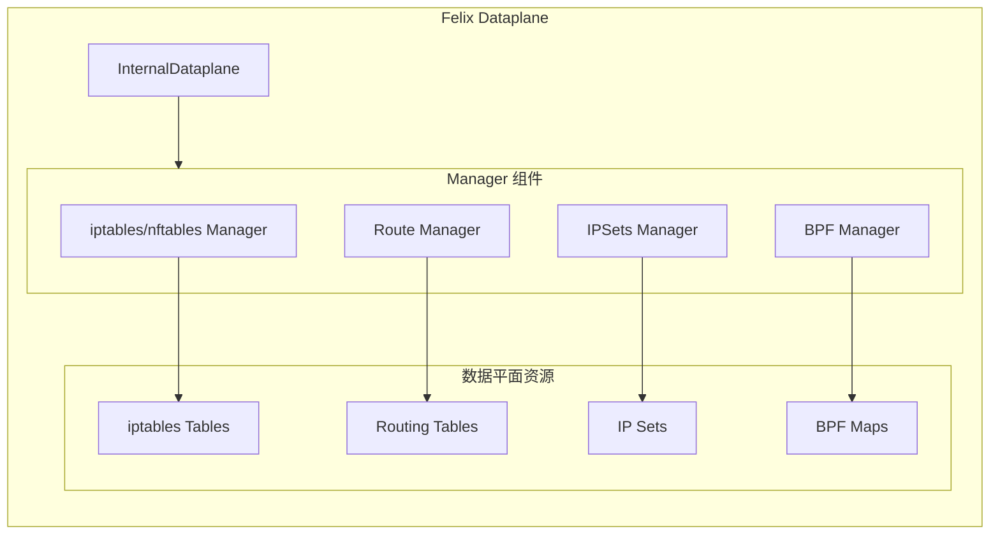

## 概述

本章详细介绍 Calico 数据平面的排障方法，包括 iptables 规则检查、eBPF 程序调试、路由表分析和 conntrack 诊断。掌握这些技能对于解决网络连通性问题至关重要。

## 前置知识

- Linux 网络基础（iptables、路由、conntrack）
- Calico 数据平面架构
- eBPF 基础概念

## 数据平面架构回顾



### 关键代码入口

数据平面的核心结构定义在 `felix/dataplane/linux/int_dataplane.go:322-399`：

```go
type InternalDataplane struct {
    toDataplane             chan interface{}
    fromDataplane           chan interface{}

    mainRouteTables []routetable.SyncerInterface
    allTables       []generictables.Table
    mangleTables    []generictables.Table
    natTables       []generictables.Table
    rawTables       []generictables.Table
    filterTables    []generictables.Table
    ipSets          []dpsets.IPSetsDataplane

    // BPF 状态
    xdpState          *xdpState
    sockmapState      *sockmapState

    // 同步状态
    datastoreInSync    bool
    ifaceMonitorInSync bool
    dataplaneNeedsSync bool
}
```

## iptables 规则检查

### 1. 查看 Calico 链结构

```bash
# 查看 filter 表所有链
sudo iptables -t filter -L -n -v --line-numbers

# 查看 Calico 特定链
sudo iptables -t filter -L cali-INPUT -n -v
sudo iptables -t filter -L cali-FORWARD -n -v
sudo iptables -t filter -L cali-OUTPUT -n -v

# 查看 nat 表
sudo iptables -t nat -L -n -v

# 查看 mangle 表
sudo iptables -t mangle -L -n -v

# 查看 raw 表
sudo iptables -t raw -L -n -v
```

### 2. Calico 链命名规则

Calico 使用特定的链命名约定，定义在 `felix/rules/static.go`：

| 链前缀 | 用途 | 示例 |
|--------|------|------|
| `cali-` | 顶层 Calico 链 | `cali-INPUT`, `cali-FORWARD` |
| `cali-pi-` | Policy Ingress | `cali-pi-default.deny-all` |
| `cali-po-` | Policy Egress | `cali-po-default.allow-web` |
| `cali-tw-` | To Workload | `cali-tw-cali12345678901` |
| `cali-fw-` | From Workload | `cali-fw-cali12345678901` |
| `cali-wl-to-host` | Workload to Host | 固定链名 |
| `cali-from-wl-dispatch` | Workload 分发 | 固定链名 |
| `cali-to-wl-dispatch` | Workload 分发 | 固定链名 |
| `cali-pro-` | Profile 规则 | `cali-pro-kns.default` |
| `cali-pri-` | Profile Ingress | `cali-pri-kns.default` |

### 3. 检查特定 Workload 规则

```bash
# 找到 Pod 对应的 veth 接口
POD_NAME="my-pod"
NAMESPACE="default"
VETH=$(kubectl exec -n $NAMESPACE $POD_NAME -- cat /sys/class/net/eth0/iflink | xargs -I {} sh -c "ip link | grep '^{}: ' | cut -d: -f2 | tr -d ' '")

echo "Pod veth interface: $VETH"

# 查看该接口的入站规则
IFACE_ID=$(echo $VETH | sed 's/cali//')
sudo iptables -t filter -L cali-tw-$IFACE_ID -n -v --line-numbers

# 查看该接口的出站规则
sudo iptables -t filter -L cali-fw-$IFACE_ID -n -v --line-numbers
```

### 4. 规则计数分析

```bash
# 查看规则命中计数
sudo iptables -t filter -L cali-FORWARD -n -v -x | head -20

# 重置计数器（用于测试）
sudo iptables -t filter -Z cali-FORWARD

# 生成测试流量后再次检查
sudo iptables -t filter -L cali-FORWARD -n -v -x | head -20
```

### 5. 使用 iptables-save 导出完整规则

```bash
# 导出所有规则
sudo iptables-save > /tmp/iptables-rules.txt

# 搜索特定规则
grep -n "DROP" /tmp/iptables-rules.txt
grep -n "REJECT" /tmp/iptables-rules.txt

# 查找特定 IP 相关规则
grep -n "10.244.1.5" /tmp/iptables-rules.txt
```

### 6. iptables 规则追踪

```bash
# 启用规则追踪（raw 表）
sudo iptables -t raw -A PREROUTING -p tcp --dport 80 -j TRACE
sudo iptables -t raw -A OUTPUT -p tcp --dport 80 -j TRACE

# 查看追踪日志
sudo dmesg | grep TRACE

# 或使用 nflog
sudo iptables -t raw -A PREROUTING -p tcp --dport 80 -j NFLOG --nflog-group 1
sudo tcpdump -i nflog:1

# 清理追踪规则
sudo iptables -t raw -D PREROUTING -p tcp --dport 80 -j TRACE
sudo iptables -t raw -D OUTPUT -p tcp --dport 80 -j TRACE
```

## IPSet 检查

### 1. 查看 Calico IPSet

```bash
# 列出所有 Calico IPSet
sudo ipset list -n | grep cali

# 查看特定 IPSet 内容
sudo ipset list cali40s:xxxxx

# 查看 IPSet 统计
sudo ipset list -t | grep -A 5 "cali"
```

### 2. IPSet 命名规则

IPSet 管理在 `felix/ipsets/ipsets.go:51-106`：

```go
type IPSets struct {
    IPVersionConfig *IPVersionConfig

    // setNameToAllMetadata 包含所有 IP set 元数据
    setNameToAllMetadata map[string]dataplaneMetadata

    // mainSetNameToMembers 包含成员信息
    mainSetNameToMembers map[string]*deltatracker.SetDeltaTracker[IPSetMember]

    // 脏标记追踪
    ipSetsWithDirtyMembers set.Set[string]
    ipSetsRequiringResync  set.Typed[string]
    fullResyncRequired     bool
}
```

IPSet 命名格式：
- `cali40s:<hash>` - IPv4 源地址集
- `cali40d:<hash>` - IPv4 目标地址集
- `cali60s:<hash>` - IPv6 源地址集
- `cali60d:<hash>` - IPv6 目标地址集
- `cali40t:<hash>` - 临时 IPSet

### 3. 验证 IPSet 与策略对应

```bash
# 从 iptables 规则中找到引用的 IPSet
sudo iptables-save | grep "match-set"

# 示例输出：
# -A cali-pi-xxx -m set --match-set cali40s:abcd1234 src -j ACCEPT

# 查看该 IPSet 的成员
sudo ipset list cali40s:abcd1234
```

## 路由表检查

### 1. 查看主路由表

```bash
# 查看所有路由
ip route show

# 查看 Calico 相关路由（通常是 blackhole 和 Pod 路由）
ip route show | grep -E "(blackhole|cali|tunl|vxlan)"

# 查看特定表
ip route show table 254  # main 表
ip route show table 253  # default 表
```

### 2. 路由管理代码

路由表管理在 `felix/routetable/route_table.go:130-150`：

```go
type RouteTable struct {
    logCxt        *log.Entry
    ipVersion     uint8
    netlinkFamily int
    tableIndex    int  // 路由表索引，默认 RT_TABLE_MAIN

    deviceRouteSourceAddress ip.Addr
    defaultRouteProtocol     netlink.RouteProtocol
    removeExternalRoutes     bool
    ownershipPolicy          OwnershipPolicy

    // 接口更新追踪
    fullResyncNeeded    bool
    ifacesToRescan      set.Set[string]
}
```

### 3. 检查 Pod 路由

```bash
# 列出所有 Pod 的路由
ip route show | grep cali

# 查看特定 Pod CIDR 的路由
ip route get 10.244.1.5

# 验证路由是否正确
# 本地 Pod 应该通过 veth 接口
# 远程 Pod 应该通过隧道接口或直接路由
```

### 4. 隧道路由检查

```bash
# IPIP 隧道路由
ip route show | grep tunl0

# VXLAN 隧道路由
ip route show | grep vxlan.calico

# 查看隧道接口信息
ip -d link show tunl0
ip -d link show vxlan.calico
```

### 5. 路由规则检查

```bash
# 查看路由规则（策略路由）
ip rule show

# WireGuard 可能添加的规则
ip rule show | grep wireguard

# 查看特定表的规则
ip rule show | grep "lookup 250"
```

## Conntrack 分析

### 1. 查看连接追踪表

```bash
# 安装 conntrack 工具
sudo apt-get install conntrack

# 查看所有连接
sudo conntrack -L

# 按协议过滤
sudo conntrack -L -p tcp
sudo conntrack -L -p udp
sudo conntrack -L -p icmp

# 按状态过滤
sudo conntrack -L -p tcp --state ESTABLISHED
sudo conntrack -L -p tcp --state TIME_WAIT
```

### 2. 查看特定连接

```bash
# 按源 IP 过滤
sudo conntrack -L -s 10.244.1.5

# 按目标 IP 过滤
sudo conntrack -L -d 10.96.0.1

# 按端口过滤
sudo conntrack -L -p tcp --dport 80
```

### 3. 实时监控连接

```bash
# 监控新连接
sudo conntrack -E

# 只监控特定事件
sudo conntrack -E -e NEW
sudo conntrack -E -e DESTROY

# 带过滤的监控
sudo conntrack -E -p tcp --dport 80
```

### 4. 清理连接追踪

```bash
# 清理特定连接
sudo conntrack -D -s 10.244.1.5

# 清理特定目标的连接
sudo conntrack -D -d 10.96.0.1 -p tcp --dport 80

# 清理所有连接（谨慎使用）
sudo conntrack -F
```

### 5. Conntrack 统计

```bash
# 查看 conntrack 统计
sudo conntrack -S

# 查看 conntrack 表大小限制
cat /proc/sys/net/netfilter/nf_conntrack_max

# 查看当前连接数
cat /proc/sys/net/netfilter/nf_conntrack_count
```

## eBPF 程序调试

### 1. 检查 BPF 程序加载状态

```bash
# 列出所有 BPF 程序
sudo bpftool prog list

# 查看 Calico TC 程序
sudo bpftool prog list | grep -i calico

# 查看特定接口的 TC 程序
sudo tc filter show dev eth0 ingress
sudo tc filter show dev eth0 egress

# 查看 cali 接口的程序
for iface in $(ip link | grep cali | cut -d: -f2 | tr -d ' '); do
    echo "=== $iface ==="
    sudo tc filter show dev $iface ingress 2>/dev/null
    sudo tc filter show dev $iface egress 2>/dev/null
done
```

### 2. 查看 BPF Maps

BPF Maps 定义在 `felix/bpf/maps/maps.go`：

```bash
# 列出所有 BPF maps
sudo bpftool map list

# 查看 Calico 相关 maps
sudo bpftool map list | grep -i cali

# 常见 Calico BPF maps
# - cali_v4_ct: IPv4 连接追踪
# - cali_v4_nat_fe: NAT frontend
# - cali_v4_nat_be: NAT backend
# - cali_v4_routes: 路由表
# - cali_v4_arp: ARP 缓存
```

### 3. 查看 Conntrack Map 内容

Conntrack Map 定义在 `felix/bpf/conntrack/map.go:138-150`：

```go
func Map() maps.Map {
    b := maps.NewPinnedMap(MapParams)
    b.UpgradeFn = maps.Upgrade
    b.GetMapParams = GetMapParams
    b.KVasUpgradable = GetKeyValueTypeFromVersion
    return b
}
```

```bash
# 查看 conntrack map 内容
sudo bpftool map dump name cali_v4_ct | head -50

# 获取特定条目
sudo bpftool map lookup name cali_v4_ct key <key_bytes>
```

### 4. 查看 NAT Maps

```bash
# Frontend map（Service VIP 到 backend 映射）
sudo bpftool map dump name cali_v4_nat_fe | head -20

# Backend map（实际后端信息）
sudo bpftool map dump name cali_v4_nat_be | head -20

# Affinity map（会话亲和性）
sudo bpftool map dump name cali_v4_nat_aff | head -20
```

### 5. 使用 calico-bpf 工具

```bash
# 进入 calico-node 容器
kubectl exec -it -n calico-system $(kubectl get pods -n calico-system -l k8s-app=calico-node -o name | head -1) -- /bin/bash

# 查看 conntrack 表
calico-bpf conntrack dump

# 查看 NAT 表
calico-bpf nat dump

# 查看路由表
calico-bpf routes dump

# 查看 policy 计数器
calico-bpf policy dump
```

### 6. BPF 程序追踪

```bash
# 使用 bpftrace 追踪（需要安装）
sudo bpftrace -e 'tracepoint:syscalls:sys_enter_bpf { @[comm] = count(); }'

# 追踪 TC 程序调用
sudo bpftrace -e 'kprobe:__dev_queue_xmit { @[comm] = count(); }'
```

## 接口状态检查

### 1. 查看 Calico 接口

```bash
# 列出所有 cali 接口
ip link show type veth | grep cali

# 查看接口详情
ip -d link show cali12345678901

# 查看接口统计
ip -s link show cali12345678901
```

### 2. 检查接口配置

```bash
# 查看 IP 地址
ip addr show cali12345678901

# 查看 ARP 表
ip neigh show dev cali12345678901

# 检查 proxy_arp 设置
cat /proc/sys/net/ipv4/conf/cali12345678901/proxy_arp

# 检查转发设置
cat /proc/sys/net/ipv4/conf/cali12345678901/forwarding
```

### 3. 检查隧道接口

```bash
# IPIP 隧道
ip -d link show tunl0
ip tunnel show

# VXLAN 隧道
ip -d link show vxlan.calico
bridge fdb show dev vxlan.calico

# WireGuard 隧道
ip -d link show wireguard.cali
sudo wg show wireguard.cali
```

## 数据包追踪

### 1. 使用 tcpdump

```bash
# 抓取特定接口的包
sudo tcpdump -i cali12345678901 -n

# 抓取特定协议和端口
sudo tcpdump -i any -n 'tcp port 80'

# 抓取特定 IP 的包
sudo tcpdump -i any -n 'host 10.244.1.5'

# 保存为 pcap 文件
sudo tcpdump -i any -n -w /tmp/calico-debug.pcap 'tcp port 80'
```

### 2. 追踪跨节点流量

```bash
# 在隧道接口抓包
sudo tcpdump -i tunl0 -n

# VXLAN 抓包
sudo tcpdump -i vxlan.calico -n

# 抓取封装的包（IPIP）
sudo tcpdump -i eth0 -n 'proto 4'

# 抓取 VXLAN 包
sudo tcpdump -i eth0 -n 'udp port 4789'
```

### 3. 使用 nftables 追踪

```bash
# 如果使用 nftables 后端
sudo nft monitor trace
```

## 数据平面同步状态

### 1. 检查 Felix 同步状态

```bash
# 查看 Felix 日志中的同步消息
kubectl logs -n calico-system -l k8s-app=calico-node -c calico-node | grep -i "sync\|resync\|apply"

# 关键日志模式
# "Finished applying dataplane updates" - 同步完成
# "Doing a full resync" - 完整重同步
# "Starting incremental update" - 增量更新
```

### 2. Prometheus 指标

```bash
# 获取数据平面相关指标
curl -s http://localhost:9091/metrics | grep -E "felix_(int_dataplane|iptables|route)"

# 关键指标：
# felix_int_dataplane_failures - 数据平面同步失败次数
# felix_int_dataplane_apply_time_seconds - Apply 耗时
# felix_iptables_restore_calls - iptables-restore 调用次数
# felix_iptables_restore_errors - iptables-restore 错误次数
# felix_route_table_num_routes - 管理的路由数
```

数据平面指标定义在 `felix/dataplane/linux/int_dataplane.go:102-141`：

```go
var (
    countDataplaneSyncErrors = prometheus.NewCounter(prometheus.CounterOpts{
        Name: "felix_int_dataplane_failures",
        Help: "Number of times dataplane updates failed and will be retried.",
    })

    gaugeInitialResyncApplyTime = prometheus.NewGauge(prometheus.GaugeOpts{
        Name: "felix_int_dataplane_initial_resync_time_seconds",
        Help: "Time in seconds that it took to do the initial resync...",
    })

    summaryApplyTime = cprometheus.NewSummary(prometheus.SummaryOpts{
        Name: "felix_int_dataplane_apply_time_seconds",
        Help: "Time in seconds for each incremental update...",
    })
)
```

### 3. 强制重同步

```bash
# 通过重启 Felix 触发完整重同步
kubectl delete pod -n calico-system -l k8s-app=calico-node

# 或者通过发送 SIGHUP（在节点上）
pkill -HUP calico-felix
```

## 常用排障脚本

### 1. 完整数据平面诊断

```bash
#!/bin/bash
# calico-dp-diag.sh - Calico 数据平面诊断脚本

echo "=== Calico Dataplane Diagnostics ==="
echo "Date: $(date)"
echo

echo "=== iptables Summary ==="
echo "Filter table chains: $(sudo iptables -t filter -L | grep -c '^Chain cali')"
echo "NAT table chains: $(sudo iptables -t nat -L | grep -c '^Chain cali')"
echo "Mangle table chains: $(sudo iptables -t mangle -L | grep -c '^Chain cali')"

echo
echo "=== IPSets ==="
echo "Calico IPSets count: $(sudo ipset list -n | grep -c '^cali')"

echo
echo "=== Routes ==="
echo "Calico routes: $(ip route | grep -c cali)"
echo "Tunnel routes: $(ip route | grep -c -E 'tunl|vxlan')"
echo "Blackhole routes: $(ip route | grep -c blackhole)"

echo
echo "=== Interfaces ==="
echo "Calico veth count: $(ip link | grep -c 'cali')"
echo "Tunnel interfaces: $(ip link | grep -c -E 'tunl|vxlan|wireguard')"

echo
echo "=== Conntrack ==="
echo "Total connections: $(sudo conntrack -C 2>/dev/null || echo 'N/A')"
echo "Max connections: $(cat /proc/sys/net/netfilter/nf_conntrack_max)"

echo
echo "=== BPF (if enabled) ==="
echo "BPF programs: $(sudo bpftool prog list 2>/dev/null | grep -c calico || echo 'N/A')"
echo "BPF maps: $(sudo bpftool map list 2>/dev/null | grep -c cali || echo 'N/A')"

echo
echo "=== Felix Metrics ==="
curl -s http://localhost:9091/metrics 2>/dev/null | grep -E "^felix_(int_dataplane|iptables|route)" | head -20
```

### 2. Pod 连通性检查

```bash
#!/bin/bash
# pod-connectivity-check.sh - Pod 连通性检查

POD_NAME=$1
NAMESPACE=${2:-default}

if [ -z "$POD_NAME" ]; then
    echo "Usage: $0 <pod-name> [namespace]"
    exit 1
fi

echo "=== Checking connectivity for pod: $NAMESPACE/$POD_NAME ==="

# 获取 Pod IP
POD_IP=$(kubectl get pod -n $NAMESPACE $POD_NAME -o jsonpath='{.status.podIP}')
echo "Pod IP: $POD_IP"

# 获取节点
NODE=$(kubectl get pod -n $NAMESPACE $POD_NAME -o jsonpath='{.spec.nodeName}')
echo "Node: $NODE"

# 获取接口名
echo
echo "=== Local interface ==="
# 在节点上找到对应接口
kubectl debug node/$NODE -it --image=busybox -- sh -c "
    ip route get $POD_IP 2>/dev/null | head -1
"

# 检查路由
echo
echo "=== Routes to Pod ==="
kubectl debug node/$NODE -it --image=busybox -- sh -c "
    ip route get $POD_IP
"

# 检查 iptables 规则
echo
echo "=== iptables rules for Pod ==="
kubectl debug node/$NODE -it --image=nicolaka/netshoot -- sh -c "
    iptables-save | grep -i $POD_IP | head -10
"
```

## 实验：端到端数据包追踪

### 实验目标

追踪一个数据包从 Pod A 到 Pod B 的完整路径。

### 实验步骤

1. **创建测试环境**

```bash
# 创建两个 Pod
kubectl run pod-a --image=nicolaka/netshoot --command -- sleep infinity
kubectl run pod-b --image=nicolaka/netshoot --command -- sleep infinity

# 等待 Pod 就绪
kubectl wait --for=condition=Ready pod/pod-a pod/pod-b

# 获取 Pod IP
POD_A_IP=$(kubectl get pod pod-a -o jsonpath='{.status.podIP}')
POD_B_IP=$(kubectl get pod pod-b -o jsonpath='{.status.podIP}')
echo "Pod A: $POD_A_IP"
echo "Pod B: $POD_B_IP"
```

2. **在多个点设置抓包**

```bash
# 在 Pod A 所在节点的 cali 接口抓包
# (新终端)
NODE_A=$(kubectl get pod pod-a -o jsonpath='{.spec.nodeName}')
kubectl debug node/$NODE_A -it --image=nicolaka/netshoot -- tcpdump -i any -n host $POD_A_IP and host $POD_B_IP

# 在 Pod B 所在节点的 cali 接口抓包
# (另一个新终端)
NODE_B=$(kubectl get pod pod-b -o jsonpath='{.spec.nodeName}')
kubectl debug node/$NODE_B -it --image=nicolaka/netshoot -- tcpdump -i any -n host $POD_A_IP and host $POD_B_IP
```

3. **生成测试流量**

```bash
# 从 Pod A ping Pod B
kubectl exec pod-a -- ping -c 3 $POD_B_IP

# 从 Pod A curl Pod B（如果有服务）
kubectl exec pod-a -- curl -v http://$POD_B_IP:80 --connect-timeout 5
```

4. **分析数据包路径**

```bash
# 检查 iptables 规则命中
kubectl debug node/$NODE_A -it --image=nicolaka/netshoot -- sh -c "
    iptables -t filter -L cali-FORWARD -v -n -x | head -20
"

# 检查 conntrack 条目
kubectl debug node/$NODE_A -it --image=nicolaka/netshoot -- sh -c "
    conntrack -L -s $POD_A_IP -d $POD_B_IP 2>/dev/null
"
```

5. **清理**

```bash
kubectl delete pod pod-a pod-b
```

## 总结

数据平面排障的关键点：

1. **分层检查**：从上到下检查 iptables → ipsets → routes → interfaces
2. **使用正确工具**：iptables-save、ipset、ip route、conntrack、bpftool
3. **关注指标**：Prometheus 指标是发现问题的重要途径
4. **日志分析**：Felix 日志包含详细的同步和错误信息
5. **数据包追踪**：tcpdump 和 iptables TRACE 是定位问题的利器

## 参考资料

- [Felix Dataplane 源码](https://github.com/projectcalico/calico/tree/master/felix/dataplane/linux)
- [iptables 表结构](https://github.com/projectcalico/calico/blob/master/felix/iptables/table.go)
- [BPF Maps 设计](https://github.com/projectcalico/calico/tree/master/felix/bpf/maps)
- [Route Table 管理](https://github.com/projectcalico/calico/blob/master/felix/routetable/route_table.go)
- [Calico Troubleshooting Guide](https://docs.tigera.io/calico/latest/operations/troubleshoot/)
