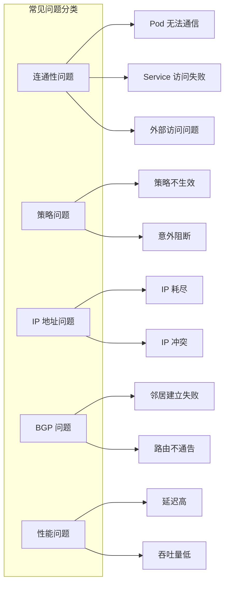

## 概述

本章汇总 Calico 使用过程中的常见问题及其解决方案，涵盖 Pod 网络连通性、策略执行、IP 地址管理、BGP 邻居等多个方面。

## 前置知识

- Calico 基本架构
- Kubernetes 网络模型
- 前几章的调试技能

## 问题分类



## Pod 无法通信

### 问题 1: Pod 之间无法 ping 通

#### 症状

```bash
# Pod A ping Pod B 失败
kubectl exec pod-a -- ping -c 3 10.244.1.5
# PING 10.244.1.5 (10.244.1.5): 56 data bytes
# --- 10.244.1.5 ping statistics ---
# 3 packets transmitted, 0 packets received, 100% packet loss
```

#### 排查步骤

**Step 1: 确认 Pod 状态**

```bash
# 检查两个 Pod 都在运行
kubectl get pods -o wide

# 检查 Pod 网络配置
kubectl exec pod-a -- ip addr
kubectl exec pod-b -- ip addr
```

**Step 2: 检查本地路由**

```bash
# 在 Pod A 所在节点检查路由
NODE_A=$(kubectl get pod pod-a -o jsonpath='{.spec.nodeName}')
ssh $NODE_A "ip route get 10.244.1.5"

# 应该看到类似：
# 10.244.1.5 via 192.168.1.2 dev tunl0 (跨节点)
# 或
# 10.244.1.5 dev cali12345 scope link (本地)
```

**Step 3: 检查 iptables 规则**

```bash
# 检查是否有 DROP 规则
ssh $NODE_A "sudo iptables -t filter -L cali-FORWARD -v -n | grep -i drop"

# 检查完整链路
ssh $NODE_A "sudo iptables -t filter -L -v -n | grep 10.244.1.5"
```

**Step 4: 检查 Felix 状态**

```bash
# 检查 Felix 是否正常
kubectl get pods -n calico-system -l k8s-app=calico-node -o wide

# 查看 Felix 日志
kubectl logs -n calico-system -l k8s-app=calico-node -c calico-node --tail=100 | grep -i error
```

#### 常见原因与解决方案

| 原因 | 解决方案 |
|------|----------|
| Felix 未同步完成 | 等待 Felix 完成同步，检查 `calico-node` Pod 状态 |
| 路由缺失 | 检查 BIRD/BGP 状态，确认路由通告正常 |
| iptables 规则错误 | 重启 Felix 触发规则重建 |
| 隧道接口故障 | 检查 tunl0/vxlan.calico 接口状态 |
| MTU 问题 | 调整 MTU 配置，考虑隧道开销 |

### 问题 2: 跨节点通信失败，同节点正常

#### 症状

同一节点上的 Pod 可以互相通信，但跨节点 Pod 无法通信。

#### 排查步骤

**Step 1: 确认封装模式**

```bash
# 查看 IPPool 配置
kubectl get ippools -o yaml

# 检查封装模式：IPIP、VXLAN 或 None
```

**Step 2: 检查隧道接口**

```bash
# IPIP 模式
ip link show tunl0
ip tunnel show

# VXLAN 模式
ip link show vxlan.calico
bridge fdb show dev vxlan.calico
```

**Step 3: 检查底层网络**

```bash
# 测试节点间连通性
ping <other_node_ip>

# 检查是否允许 IPIP 协议（协议号 4）
ssh $NODE_A "sudo tcpdump -i eth0 -n proto 4 -c 10"

# 检查是否允许 VXLAN 端口（默认 4789）
ssh $NODE_A "sudo tcpdump -i eth0 -n udp port 4789 -c 10"
```

**Step 4: 检查 BGP 路由**

```bash
# 进入 calico-node 容器
kubectl exec -it -n calico-system $(kubectl get pods -n calico-system -l k8s-app=calico-node -o name | head -1) -c calico-node -- /bin/bash

# 查看 BGP 邻居
birdcl show protocols

# 查看路由表
birdcl show route
```

#### 解决方案

```yaml
# 如果底层网络阻止 IPIP，改用 VXLAN
apiVersion: projectcalico.org/v3
kind: IPPool
metadata:
  name: default-ipv4-ippool
spec:
  cidr: 10.244.0.0/16
  encapsulation: VXLAN  # 或 VXLANCrossSubnet
  natOutgoing: true
  nodeSelector: all()
```

```bash
# 应用配置
kubectl apply -f ippool.yaml

# 重启所有 calico-node
kubectl rollout restart daemonset -n calico-system calico-node
```

### 问题 3: Pod 无法访问外部网络

#### 症状

Pod 可以访问集群内部服务，但无法访问外部网络（如 google.com）。

#### 排查步骤

```bash
# 测试外部访问
kubectl exec pod-a -- curl -v https://google.com --connect-timeout 5

# 检查 DNS
kubectl exec pod-a -- nslookup google.com

# 检查 NAT 规则
ssh $NODE_A "sudo iptables -t nat -L cali-nat-outgoing -v -n"
```

#### 常见原因

1. **natOutgoing 未启用**

```bash
# 检查 IPPool
kubectl get ippools -o yaml | grep natOutgoing
# 应该为 true
```

2. **节点缺少外出路由**

```bash
# 检查节点默认路由
ip route | grep default
```

3. **防火墙阻止**

```bash
# 检查节点防火墙
sudo iptables -t filter -L OUTPUT -v -n
sudo iptables -t filter -L FORWARD -v -n
```

## 策略问题

### 问题 4: NetworkPolicy 不生效

#### 症状

创建了 NetworkPolicy，但流量仍然通过。

#### 排查步骤

**Step 1: 验证策略语法**

```bash
# 查看策略
kubectl get networkpolicy -n <namespace> -o yaml

# 检查 selector 是否正确匹配 Pod
kubectl get pods -n <namespace> -l <selector_label>
```

**Step 2: 检查 Felix 是否处理了策略**

```bash
# 查看 Felix 日志
kubectl logs -n calico-system -l k8s-app=calico-node -c calico-node | grep -i policy

# 查看策略同步状态
kubectl logs -n calico-system -l k8s-app=calico-node -c calico-node | grep -i "policy.*sync"
```

**Step 3: 检查 iptables 规则**

```bash
# 找到 Pod 对应的策略链
VETH=$(kubectl exec -n <ns> <pod> -- cat /sys/class/net/eth0/iflink | xargs -I {} sh -c "grep -l {} /sys/class/net/*/ifindex 2>/dev/null | head -1 | cut -d/ -f5")

# 查看入站策略链
sudo iptables -t filter -L cali-pi-<policy_name> -v -n

# 查看 IPSet
sudo ipset list | grep cali
```

**Step 4: 检查 kube-controllers**

```bash
# 检查 kube-controllers 状态
kubectl get pods -n calico-system -l k8s-app=calico-kube-controllers

# 查看日志
kubectl logs -n calico-system -l k8s-app=calico-kube-controllers --tail=100
```

#### 常见原因与解决方案

| 原因 | 解决方案 |
|------|----------|
| Selector 不匹配 | 检查 Pod 标签和策略 selector |
| Namespace 不正确 | 确认策略在正确的 namespace |
| 策略优先级冲突 | 检查是否有更高优先级的 Allow 策略 |
| kube-controllers 故障 | 重启 kube-controllers |
| Felix 未同步 | 等待同步完成或重启 calico-node |

### 问题 5: 策略意外阻断流量

#### 症状

正常的流量被意外阻断，但没有明确的 Deny 策略。

#### 排查步骤

**Step 1: 理解默认行为**

```bash
# Kubernetes NetworkPolicy：
# - 没有策略时，默认允许所有流量
# - 有任何策略选中 Pod 时，默认变为拒绝，只允许策略明确允许的流量

# Calico GlobalNetworkPolicy：
# - 可以有明确的 Deny 规则
# - 按 order 排序执行
```

**Step 2: 列出所有相关策略**

```bash
# K8s NetworkPolicy
kubectl get networkpolicy -A

# Calico NetworkPolicy
kubectl get networkpolicies.projectcalico.org -A

# Calico GlobalNetworkPolicy
kubectl get globalnetworkpolicies.projectcalico.org
```

**Step 3: 检查策略顺序**

```bash
# 查看 GlobalNetworkPolicy 的 order
kubectl get globalnetworkpolicies.projectcalico.org -o yaml | grep -A 5 "order:"

# order 越小优先级越高
```

**Step 4: 使用 calicoctl 调试**

```bash
# 安装 calicoctl
kubectl apply -f https://raw.githubusercontent.com/projectcalico/calico/master/manifests/calicoctl.yaml

# 查看端点的有效策略
kubectl exec -n calico-system -it calicoctl -- /calicoctl get workloadendpoint -o wide

# 查看具体端点
kubectl exec -n calico-system -it calicoctl -- /calicoctl get workloadendpoint <endpoint_name> -o yaml
```

#### 解决方案示例

```yaml
# 确保允许 DNS 查询
apiVersion: projectcalico.org/v3
kind: GlobalNetworkPolicy
metadata:
  name: allow-dns
spec:
  order: 100
  selector: all()
  types:
  - Egress
  egress:
  - action: Allow
    protocol: UDP
    destination:
      ports:
      - 53
  - action: Allow
    protocol: TCP
    destination:
      ports:
      - 53
```

## IP 地址问题

### 问题 6: IP 地址耗尽

#### 症状

新 Pod 无法调度，报错类似：

```
Warning  FailedCreatePodSandBox  ... Failed to create pod sandbox: ...
failed to allocate for range 0: no IP addresses available in range set
```

#### 错误代码位置

IPAM 错误定义在 `libcalico-go/lib/ipam/ipam_errors.go:36-42`：

```go
// noFreeBlocksError indicates an attempt to claim a block
// when there are none available.
type noFreeBlocksError string

func (e noFreeBlocksError) Error() string {
    return string(e)
}
```

#### 排查步骤

**Step 1: 检查 IPPool 使用情况**

```bash
# 查看 IPPool
kubectl get ippools -o yaml

# 使用 calicoctl 查看详细信息
kubectl exec -n calico-system -it calicoctl -- /calicoctl ipam show

# 查看每个节点的分配
kubectl exec -n calico-system -it calicoctl -- /calicoctl ipam show --show-blocks
```

**Step 2: 检查泄漏的 IP**

```bash
# 查看所有分配的 IP
kubectl exec -n calico-system -it calicoctl -- /calicoctl ipam show --show-allocations

# 对比实际运行的 Pod
kubectl get pods -A -o wide | wc -l

# 检查是否有孤立的 WorkloadEndpoint
kubectl get workloadendpoints.projectcalico.org -A
```

**Step 3: 清理泄漏的 IP**

```bash
# 运行 IPAM GC
kubectl exec -n calico-system -it calicoctl -- /calicoctl ipam release --ip=<leaked_ip>

# 或者使用 kube-controllers 的 IPAM 垃圾回收
# 确保 kube-controllers 配置了 IPAM 控制器
kubectl get deployment -n calico-system calico-kube-controllers -o yaml | grep -A 10 "controllers:"
```

#### 解决方案

**扩展 IPPool**

```yaml
# 添加新的 IPPool
apiVersion: projectcalico.org/v3
kind: IPPool
metadata:
  name: additional-pool
spec:
  cidr: 10.245.0.0/16
  encapsulation: VXLAN
  natOutgoing: true
  nodeSelector: all()
```

**调整 Block 大小**

```yaml
# 减小 block 大小以提高利用率
apiVersion: projectcalico.org/v3
kind: IPPool
metadata:
  name: default-ipv4-ippool
spec:
  cidr: 10.244.0.0/16
  blockSize: 26  # 从默认的 26 减小到更小的值需要重新创建 Pool
```

**限制每节点的 Block 数量**

```yaml
# 在 FelixConfiguration 中设置
apiVersion: projectcalico.org/v3
kind: FelixConfiguration
metadata:
  name: default
spec:
  ipamMaxBlocksPerHost: 10
```

### 问题 7: IP 地址冲突

#### 症状

多个 Pod 拥有相同的 IP 地址，导致网络问题。

#### 排查步骤

```bash
# 查找重复 IP
kubectl get pods -A -o wide | awk '{print $7}' | sort | uniq -d

# 检查该 IP 的所有分配
kubectl exec -n calico-system -it calicoctl -- /calicoctl ipam show --ip=<conflicting_ip>

# 查看相关的 WorkloadEndpoint
kubectl get workloadendpoints.projectcalico.org -A -o yaml | grep -B 10 "<conflicting_ip>"
```

#### 解决方案

```bash
# 删除冲突的 Pod，让其重新调度
kubectl delete pod <conflicting_pod> -n <namespace>

# 如果问题持续，释放该 IP
kubectl exec -n calico-system -it calicoctl -- /calicoctl ipam release --ip=<conflicting_ip>
```

## BGP 问题

### 问题 8: BGP 邻居无法建立

#### 症状

BGP 邻居状态显示为 "Connect" 或 "Active" 而非 "Established"。

#### 排查步骤

**Step 1: 检查 BIRD 状态**

```bash
# 进入 calico-node 容器
kubectl exec -it -n calico-system $(kubectl get pods -n calico-system -l k8s-app=calico-node -o name | head -1) -c calico-node -- /bin/bash

# 查看 BGP 协议状态
birdcl show protocols

# 查看详细状态
birdcl show protocols all bgp1
```

**Step 2: 检查 BGP 配置**

```bash
# 查看 BIRD 配置
cat /etc/calico/confd/config/bird.cfg

# 检查 BGPPeer 配置
kubectl get bgppeers.projectcalico.org -o yaml
kubectl get bgpconfigurations.projectcalico.org -o yaml
```

**Step 3: 检查网络连通性**

```bash
# 测试 BGP 端口（默认 179）
nc -zv <peer_ip> 179

# 检查防火墙
sudo iptables -t filter -L INPUT -v -n | grep 179
```

**Step 4: 检查 AS 号配置**

```bash
# 查看本节点 AS 号
kubectl get nodes -o yaml | grep -A 5 "projectcalico.org/ASNumber"

# 查看 BGP 配置
kubectl get bgpconfigurations.projectcalico.org default -o yaml
```

#### 常见原因与解决方案

| 原因 | 解决方案 |
|------|----------|
| 防火墙阻止 179 端口 | 开放 TCP 179 端口 |
| AS 号不匹配 | 检查并统一 AS 号配置 |
| 路由器不支持的 BGP 版本 | 检查路由器 BGP 配置 |
| IP 地址配置错误 | 验证 peerIP 和 nodeSelector |

### 问题 9: 路由未通告

#### 症状

Pod CIDR 路由没有被 BGP 通告到其他节点或外部路由器。

#### 排查步骤

**Step 1: 检查 BIRD 路由表**

```bash
# 进入 calico-node
kubectl exec -it -n calico-system <calico-node-pod> -c calico-node -- birdcl show route

# 查看导出的路由
birdcl show route export bgp1

# 查看特定前缀
birdcl show route for 10.244.1.0/24
```

**Step 2: 检查 BGP 导出过滤器**

```bash
# 查看 BGPFilter
kubectl get bgpfilters.projectcalico.org -o yaml

# 查看 BIRD 配置中的过滤器
cat /etc/calico/confd/config/bird.cfg | grep -A 20 "filter"
```

**Step 3: 检查 IPPool 配置**

```bash
# 确认 IPPool 没有禁用 BGP
kubectl get ippools -o yaml | grep -A 5 "disabled"
```

#### 解决方案

```yaml
# 确保 IPPool 允许 BGP 通告
apiVersion: projectcalico.org/v3
kind: IPPool
metadata:
  name: default-ipv4-ippool
spec:
  cidr: 10.244.0.0/16
  disabled: false  # 确保未禁用
  # ...
```

## 性能问题

### 问题 10: 网络延迟高

#### 症状

Pod 之间的网络延迟明显高于预期。

#### 排查步骤

**Step 1: 基准测试**

```bash
# 安装 netperf 进行测试
kubectl run netperf-server --image=networkstatic/netperf -- netserver
kubectl run netperf-client --image=networkstatic/netperf -- sleep infinity

# 测试延迟
kubectl exec netperf-client -- netperf -H <server_ip> -t TCP_RR -l 10
```

**Step 2: 检查封装开销**

```bash
# 比较不同封装模式的延迟
# IPIP 增加约 20 字节头
# VXLAN 增加约 50 字节头

# 检查当前封装模式
kubectl get ippools -o yaml | grep encapsulation
```

**Step 3: 检查 CPU 使用**

```bash
# 查看 calico-node CPU 使用
kubectl top pods -n calico-system

# 检查 iptables 规则数量
sudo iptables -t filter -L | wc -l
```

#### 优化建议

1. **使用 eBPF 数据平面**

```yaml
apiVersion: projectcalico.org/v3
kind: FelixConfiguration
metadata:
  name: default
spec:
  bpfEnabled: true
  bpfKubeProxyIptablesCleanupEnabled: true
```

2. **优化 MTU**

```yaml
# 设置正确的 MTU，避免分片
apiVersion: operator.tigera.io/v1
kind: Installation
metadata:
  name: default
spec:
  calicoNetwork:
    mtu: 1440  # 对于 VXLAN
```

3. **使用 CrossSubnet 模式**

```yaml
# 只在跨子网时使用封装
apiVersion: projectcalico.org/v3
kind: IPPool
metadata:
  name: default-ipv4-ippool
spec:
  encapsulation: VXLANCrossSubnet  # 或 IPIPCrossSubnet
```

### 问题 11: 吞吐量低

#### 排查步骤

```bash
# 使用 iperf3 测试吞吐量
kubectl run iperf-server --image=networkstatic/iperf3 -- iperf3 -s
kubectl run iperf-client --image=networkstatic/iperf3 -- sleep infinity

kubectl exec iperf-client -- iperf3 -c <server_ip> -t 30
```

#### 优化建议

1. **启用 WireGuard**（如果需要加密）

```yaml
apiVersion: projectcalico.org/v3
kind: FelixConfiguration
metadata:
  name: default
spec:
  wireguardEnabled: true
```

2. **调整 conntrack 表大小**

```bash
# 增加 conntrack 表大小
echo 262144 > /proc/sys/net/netfilter/nf_conntrack_max
```

3. **使用本地路由**（非封装模式）

```yaml
apiVersion: projectcalico.org/v3
kind: IPPool
metadata:
  name: default-ipv4-ippool
spec:
  encapsulation: None  # 需要 BGP 或直接路由
```

## 快速诊断检查清单

### 通用检查

```bash
# 1. Calico 组件状态
kubectl get pods -n calico-system
kubectl get pods -n calico-apiserver

# 2. 节点状态
kubectl get nodes
calicoctl node status

# 3. 数据存储连接
kubectl logs -n calico-system -l k8s-app=calico-node -c calico-node | grep -i "datastore\|etcd"

# 4. Felix 健康检查
curl http://localhost:9099/liveness
curl http://localhost:9099/readiness

# 5. 指标检查
curl http://localhost:9091/metrics | grep -i error
```

### Pod 网络检查

```bash
# 1. Pod 基本信息
kubectl describe pod <pod_name>

# 2. 网络接口
kubectl exec <pod> -- ip addr
kubectl exec <pod> -- ip route

# 3. DNS
kubectl exec <pod> -- nslookup kubernetes

# 4. 连通性
kubectl exec <pod> -- ping -c 3 <target_ip>
kubectl exec <pod> -- curl -v <target_url>
```

### 策略检查

```bash
# 1. 列出所有策略
kubectl get networkpolicy -A
kubectl get globalnetworkpolicies.projectcalico.org
kubectl get networkpolicies.projectcalico.org -A

# 2. 检查端点
kubectl get workloadendpoints.projectcalico.org -A

# 3. 验证规则
sudo iptables -t filter -L | grep cali-pi-
sudo iptables -t filter -L | grep cali-po-
```

## 总结

排障的关键原则：

1. **系统性排查**：从上到下，从控制平面到数据平面
2. **收集证据**：日志、指标、数据包抓取
3. **对比分析**：正常情况 vs 异常情况
4. **逐步验证**：每次只改变一个变量
5. **记录过程**：保留排查步骤和结果

## 参考资料

- [Calico Troubleshooting](https://docs.tigera.io/calico/latest/operations/troubleshoot/)
- [CNI Plugin 源码](https://github.com/projectcalico/calico/tree/master/cni-plugin)
- [IPAM 错误定义](https://github.com/projectcalico/calico/blob/master/libcalico-go/lib/ipam/ipam_errors.go)
- [BGP Processor](https://github.com/projectcalico/calico/blob/master/confd/pkg/backends/calico/bgp_processor.go)
- [Felix Metrics](https://docs.tigera.io/calico/latest/reference/felix/prometheus)
