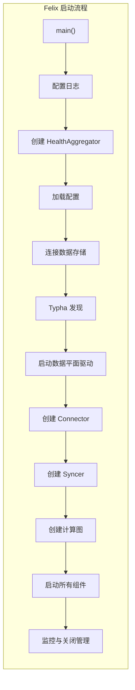
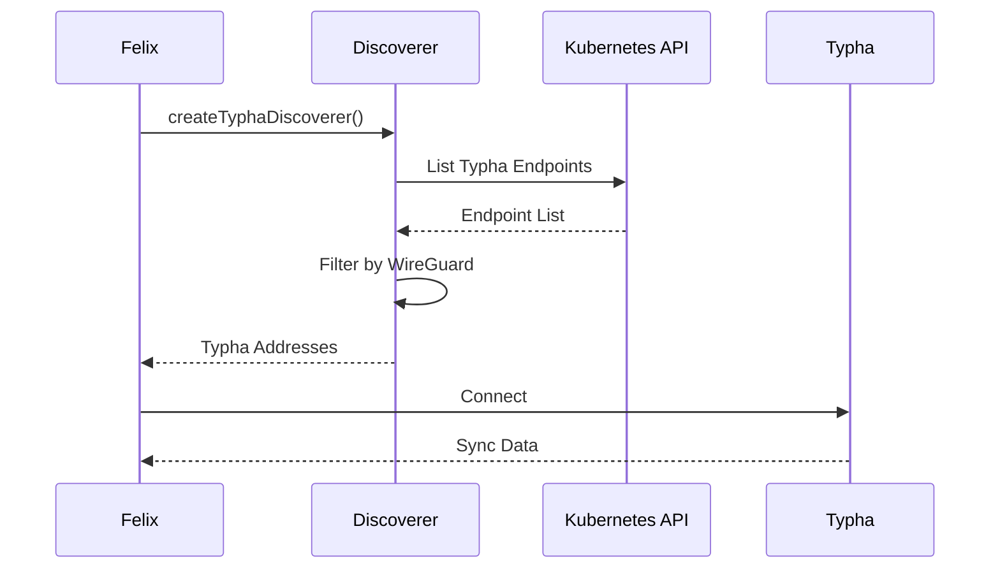
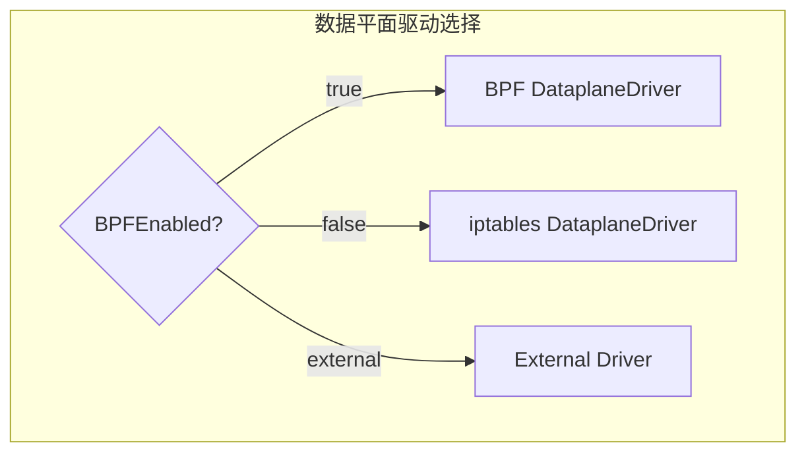
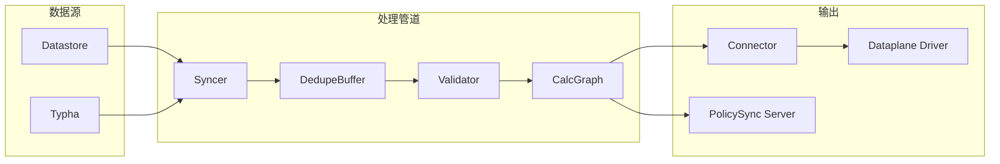
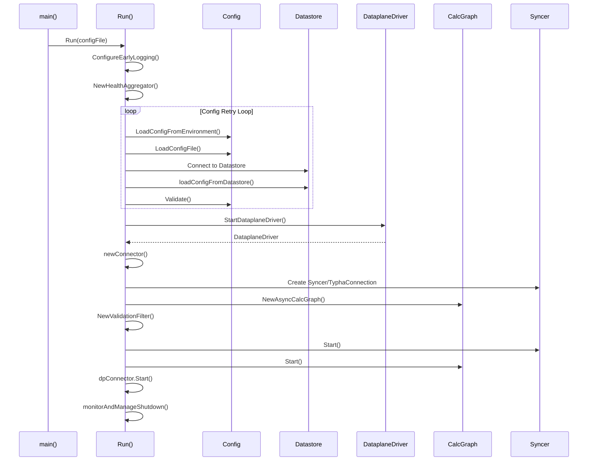

## 概述

本章深入分析 Felix 的启动流程，从 main() 入口函数开始，追踪配置加载、数据平面驱动初始化、计算图创建等关键步骤，帮助读者理解 Felix 的完整启动链路。

## 前置知识

- Go 语言基础
- Calico 整体架构
- Felix 组件职责

## 启动流程总览



## 代码入口

### main() 函数

Felix 的入口点在 `felix/cmd/calico-felix/main.go`：

```go
func main() {
    // 解析命令行参数
    configFile := flag.String("config", "", "Path to config file")
    flag.Parse()

    // 调用 daemon.Run() 开始主要启动逻辑
    daemon.Run(*configFile, gitVersion, buildDate, gitRevision)
}
```

### Run() 函数

核心启动逻辑在 `felix/daemon/daemon.go:113-779`。这个函数负责整个 Felix 的启动序列。

```go
// Run is the entry point to run a Felix instance.
//
// Its main role is to sequence Felix's startup by:
// - Initialising early logging config
// - Parsing command line parameters
// - Loading datastore configuration
// - Loading more configuration from the datastore
// - Starting the configured internal (golang) or external dataplane driver
// - Starting the background processing goroutines
// - Starting the usage reporting and prometheus metrics endpoint threads
func Run(configFile string, gitVersion string, buildDate string, gitRevision string) {
    // ... 启动逻辑
}
```

## 阶段 1：日志与健康检查初始化

### 早期日志配置

```go
// felix/daemon/daemon.go:116-117
func Run(configFile string, gitVersion string, buildDate string, gitRevision string) {
    // 配置早期日志，以便跟踪配置解析过程
    logutils.ConfigureEarlyLogging()

    ctx := context.Background()
    // ...
}
```

日志配置函数位于 `felix/logutils/logutils.go`，它根据环境变量设置初始日志级别。

### HealthAggregator 创建

```go
// felix/daemon/daemon.go:140-145
// 健康监控，用于 liveness 和 readiness 端点
healthAggregator := health.NewHealthAggregator()

const healthName = "FelixStartup"

// 注册此函数作为 liveness 和 readiness 的报告者
healthAggregator.RegisterReporter(healthName, &health.HealthReport{Live: true, Ready: true}, 0)
```

HealthAggregator 定义在 `libcalico-go/lib/health/health.go`，它聚合多个组件的健康状态。

## 阶段 2：配置加载

### 配置加载循环

Felix 使用一个重试循环来加载配置，确保能够处理暂时性故障：

```go
// felix/daemon/daemon.go:165-347
configRetry:
for {
    if numClientsCreated > 60 {
        // 避免连接泄漏，定期重启
        exitWithCustomRC(configChangedRC, "Restarting to avoid leaking datastore connections")
    }

    // 报告存活但未就绪
    healthAggregator.Report(healthName, &health.HealthReport{Live: true, Ready: false})

    // 1. 从环境变量加载配置
    configParams = config.New()
    envConfig := config.LoadConfigFromEnvironment(os.Environ())

    // 2. 从配置文件加载
    fileConfig, err := config.LoadConfigFile(configFile)
    if err != nil {
        log.WithError(err).Error("Failed to load configuration file")
        time.Sleep(1 * time.Second)
        continue configRetry
    }

    // 3. 合并配置
    _, err = configParams.UpdateFrom(envConfig, config.EnvironmentVariable)
    _, err = configParams.UpdateFrom(fileConfig, config.ConfigFile)
    // ...
}
```

### 配置源优先级

配置按以下优先级合并（后面的覆盖前面的）：


### 连接数据存储

```go
// felix/daemon/daemon.go:212-223
datastoreConfig = configParams.DatastoreConfig()
log.WithField("datastore", datastoreConfig.Spec.DatastoreType).Info("Connecting to datastore")

v3Client, err = client.New(datastoreConfig)
if err != nil {
    log.WithError(err).Error("Failed to create datastore client")
    time.Sleep(1 * time.Second)
    continue configRetry
}
log.Info("Created datastore client")
numClientsCreated++
backendClient = v3Client.(interface{ Backend() bapi.Client }).Backend()
```

### 从数据存储加载配置

```go
// felix/daemon/daemon.go:224-250
for {
    globalConfig, hostConfig, err := loadConfigFromDatastore(
        ctx, backendClient, datastoreConfig, configParams.FelixHostname)
    if err == ErrNotReady {
        log.Warn("Waiting for datastore to be initialized (or migrated)")
        time.Sleep(1 * time.Second)
        continue
    } else if err != nil {
        log.WithError(err).Error("Failed to get config from datastore")
        time.Sleep(1 * time.Second)
        continue configRetry
    }
    _, err = configParams.UpdateFrom(globalConfig, config.DatastoreGlobal)
    _, err = configParams.UpdateFrom(hostConfig, config.DatastorePerHost)
    break
}
```

### 封装模式计算

```go
// felix/daemon/daemon.go:258-269
// 列出所有 IP 池，计算封装模式
ippoolKVPList, err := backendClient.List(ctx, model.ResourceListOptions{Kind: apiv3.KindIPPool}, "")
if err != nil {
    log.WithError(err).Error("Failed to list IP Pools")
    continue configRetry
}

encapCalculator := calc.NewEncapsulationCalculator(configParams, ippoolKVPList)
configParams.Encapsulation.IPIPEnabled = encapCalculator.IPIPEnabled()
configParams.Encapsulation.VXLANEnabled = encapCalculator.VXLANEnabled()
configParams.Encapsulation.VXLANEnabledV6 = encapCalculator.VXLANEnabledV6()
```

## 阶段 3：Typha 发现

### 创建 Typha Discoverer

```go
// felix/daemon/daemon.go:322-344
typhaDiscoverer = createTyphaDiscoverer(configParams, k8sClientSet)

// WireGuard 可能阻止连接到 Typha，添加发现后过滤器
typhaDiscoverer.AddPostDiscoveryFilter(func(typhaAddresses []discovery.Typha) ([]discovery.Typha, error) {
    log.Info("Got post-discovery callback from Typha discoverer; checking if we need to " +
        "filter out any Typha addresses due to Wireguard bootstrap.")
    return bootstrapWireguardAndFilterTyphaAddresses(configParams, v3Client, typhaAddresses)
})

typhaAddresses, err := typhaDiscoverer.LoadTyphaAddrs()
if err != nil {
    log.WithError(err).Error("Typha discovery enabled but discovery failed.")
    continue configRetry
}
```

### Typha 连接流程



## 阶段 4：数据平面驱动启动

### 启动数据平面驱动

```go
// felix/daemon/daemon.go:440-466
var dpDriver dp.DataplaneDriver
var dpDriverCmd *exec.Cmd

failureReportChan := make(chan string)
configChangedRestartCallback := func() {
    failureReportChan <- reasonConfigChanged
    time.Sleep(gracefulShutdownTimeout)
    log.Panic("Graceful shutdown took too long")
}
fatalErrorCallback := func(err error) {
    log.WithError(err).Error("Shutting down due to fatal error")
    failureReportChan <- reasonFatalError
    time.Sleep(gracefulShutdownTimeout)
    log.Panic("Graceful shutdown took too long")
}

dpDriver, dpDriverCmd = dp.StartDataplaneDriver(
    configParams.Copy(),
    healthAggregator,
    dpStatsCollector,
    configChangedRestartCallback,
    fatalErrorCallback,
    k8sClientSet,
    lookupsCache,
)
```

### 数据平面驱动类型



StartDataplaneDriver 函数位于 `felix/dataplane/driver.go`：

```go
func StartDataplaneDriver(configParams *config.Config, ...) (DataplaneDriver, *exec.Cmd) {
    if configParams.UseInternalDataplaneDriver() {
        // 内部驱动（Go 实现）
        intDP := intdataplane.NewIntDataplaneDriver(...)
        intDP.Start()
        return intDP, nil
    } else {
        // 外部驱动
        return startExtDataplaneDriver(configParams, ...)
    }
}
```

## 阶段 5：Connector 和计算图创建

### 创建 Connector

Connector 连接计算图和数据平面驱动：

```go
// felix/daemon/daemon.go:482-488
dpConnector := newConnector(
    configParams.Copy(),
    connToUsageRepUpdChan,
    backendClient,
    v3Client,
    dpDriver,
    failureReportChan,
)
```

### 创建 Syncer

根据是否使用 Typha 选择 Syncer 类型：

```go
// felix/daemon/daemon.go:543-575
var syncer Startable
var typhaConnection *syncclient.SyncerClient
syncerToValidator := dedupebuffer.New()

if typhaDiscoverer.TyphaEnabled() {
    // 使用远程 Syncer（通过 Typha）
    log.Info("Connecting to Typha.")
    typhaConnection = syncclient.New(
        typhaDiscoverer,
        buildinfo.Version,
        configParams.FelixHostname,
        // ...
        syncerToValidator,
        &syncclient.Options{...},
    )
} else {
    // 本地 Syncer
    syncer = felixsyncer.New(backendClient, datastoreConfig.Spec, syncerToValidator, configParams.IsLeader())
}
```

### 创建计算图

```go
// felix/daemon/daemon.go:625-630
asyncCalcGraph := calc.NewAsyncCalcGraph(
    configParams.Copy(),
    calcGraphClientChannels,
    healthAggregator,
    lookupsCache,
)
```

### 创建 Validator

Validator 位于 Syncer 和计算图之间：

```go
// felix/daemon/daemon.go:684-688
// 创建 validator，位于 syncer 和计算图之间
validator := calc.NewValidationFilter(asyncCalcGraph, configParams)

go syncerToValidator.SendToSinkForever(validator)
asyncCalcGraph.Start()
log.Infof("Started the processing graph")
```

### 组件连接架构



## 阶段 6：启动所有组件

### 启动 Syncer

```go
// felix/daemon/daemon.go:578-620
if syncer != nil {
    log.Infof("Starting the datastore Syncer")
    syncer.Start()
} else {
    // 使用 Typha 连接
    for attempt := 1; ; attempt++ {
        log.Infof("Starting the Typha connection...")
        err := typhaConnection.Start(context.Background())
        if err != nil {
            log.WithError(err).Error("Failed to connect to Typha.")
            healthAggregator.Report(healthName, &health.HealthReport{Live: true, Ready: false})
            // 重试逻辑...
            continue
        }
        log.Infof("Connected to Typha on attempt %d", attempt)
        break
    }
}
```

### 启动 Connector

```go
// felix/daemon/daemon.go:722-736
dpConnector.Start()

// 发送初始配置到数据平面驱动
dpConnector.ToDataplane <- configParams.ToConfigUpdate()
```

### 启动 Prometheus 指标

```go
// felix/daemon/daemon.go:738-772
if configParams.PrometheusMetricsEnabled {
    log.Info("Prometheus metrics enabled.")
    gaugeHost := prometheus.NewGauge(prometheus.GaugeOpts{
        Name: "felix_host",
        Help: "Configured Felix hostname...",
        ConstLabels: prometheus.Labels{"host": configParams.FelixHostname},
    })
    gaugeHost.Set(1)
    prometheus.MustRegister(gaugeHost)

    go metricsserver.ServePrometheusMetricsHTTP(
        prometheus.DefaultGatherer,
        configParams.PrometheusMetricsHost,
        configParams.PrometheusMetricsPort,
    )
}
```

## 阶段 7：监控与关闭管理

### 监控函数

```go
// felix/daemon/daemon.go:779
monitorAndManageShutdown(failureReportChan, dpDriverCmd, stopSignalChans)
```

monitorAndManageShutdown 函数负责：
1. 监听失败报告通道
2. 处理系统信号（SIGTERM、SIGINT）
3. 协调优雅关闭

```go
func monitorAndManageShutdown(failureReportChan <-chan string, dpDriverCmd *exec.Cmd, stopSignalChans []chan<- *sync.WaitGroup) {
    // 设置信号处理
    signalChan := make(chan os.Signal, 1)
    signal.Notify(signalChan, syscall.SIGTERM, syscall.SIGINT)

    select {
    case sig := <-signalChan:
        log.WithField("signal", sig).Info("Got shutdown signal")
    case reason := <-failureReportChan:
        log.WithField("reason", reason).Warn("Shutting down due to failure")
    }

    // 执行优雅关闭
    // ...
}
```

## 启动时序图



## 关键配置参数

| 参数 | 说明 | 默认值 |
|------|------|--------|
| `DatastoreType` | 数据存储类型 | kubernetes |
| `TyphaAddr` | Typha 地址 | 自动发现 |
| `BPFEnabled` | 启用 BPF 数据平面 | false |
| `HealthEnabled` | 启用健康检查 | true |
| `HealthPort` | 健康检查端口 | 9099 |
| `PrometheusMetricsEnabled` | 启用 Prometheus | true |
| `PrometheusMetricsPort` | 指标端口 | 9091 |

## 调试断点建议

在调试 Felix 启动时，建议在以下位置设置断点：

| 位置 | 用途 |
|------|------|
| `daemon/daemon.go:113` | Run() 入口 |
| `daemon/daemon.go:179` | 配置加载开始 |
| `daemon/daemon.go:215` | 数据存储连接 |
| `daemon/daemon.go:335` | Typha 发现 |
| `daemon/daemon.go:458` | 数据平面驱动启动 |
| `daemon/daemon.go:625` | 计算图创建 |
| `daemon/daemon.go:689` | 处理管道启动 |

## 实验：追踪启动流程

### 1. 启用详细日志

```bash
# 设置日志级别
export FELIX_LOGSEVERITYSCREEN=debug

# 启动 Felix
./bin/calico-felix -config /etc/calico/felix.cfg
```

### 2. 观察启动日志

```bash
# 关键日志模式
grep -E "Felix starting|Loading config|Connecting to|Created.*client|Starting the|Connected to" /var/log/calico/felix.log
```

### 3. 检查健康端点

```bash
# 检查 liveness
curl http://localhost:9099/liveness

# 检查 readiness
curl http://localhost:9099/readiness
```

## 总结

Felix 的启动流程经过精心设计，具有以下特点：

1. **容错性**：配置加载使用重试循环，能够处理暂时性故障
2. **渐进式就绪**：从存活状态开始，逐步变为就绪状态
3. **模块化**：各组件独立启动，通过通道通信
4. **可观测性**：内置健康检查和 Prometheus 指标
5. **优雅关闭**：支持信号处理和协调关闭

## 参考资料

- [Felix Daemon 源码](https://github.com/projectcalico/calico/blob/master/felix/daemon/daemon.go)
- [配置模块](https://github.com/projectcalico/calico/tree/master/felix/config)
- [数据平面驱动](https://github.com/projectcalico/calico/tree/master/felix/dataplane)
- [计算图](https://github.com/projectcalico/calico/tree/master/felix/calc)
