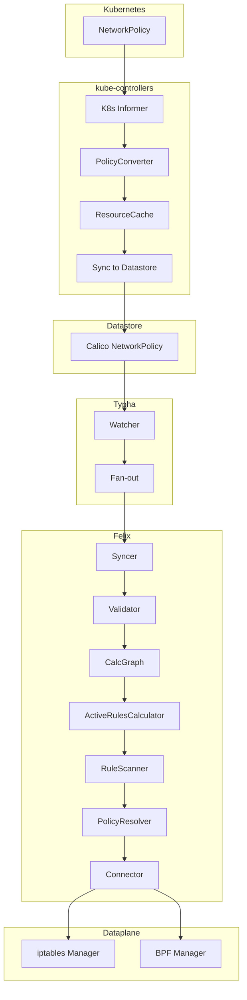
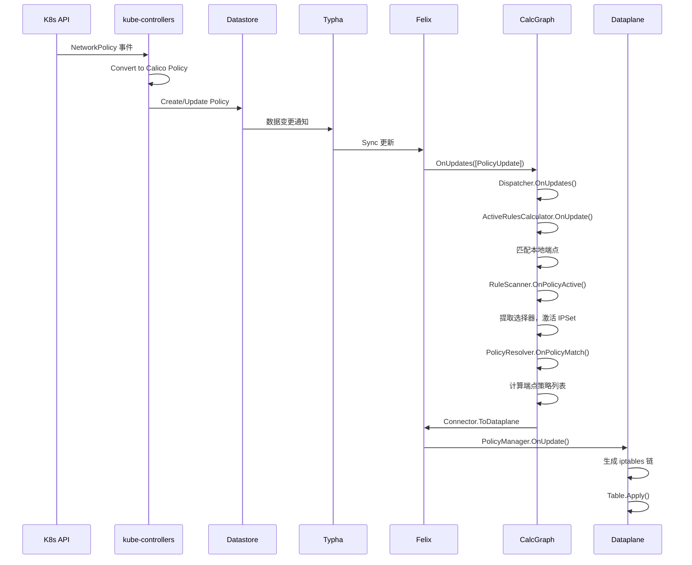

## 概述

本章追踪一个 Kubernetes NetworkPolicy 从创建到最终应用到数据平面的完整链路，涵盖 kube-controllers 的策略转换、Typha 的数据分发、Felix 的计算图处理以及最终的 iptables/eBPF 规则生成。

## 前置知识

- Kubernetes NetworkPolicy 模型
- Calico 控制平面架构
- Felix 计算图原理

## 策略同步全景图



## 阶段 1：kube-controllers 策略转换

### 策略控制器初始化

策略控制器定义在 `kube-controllers/pkg/controllers/networkpolicy/policy_controller.go:44-50`：

```go
type policyController struct {
    informer      cache.Controller
    resourceCache rcache.ResourceCache
    calicoClient  client.Interface
    ctx           context.Context
    cfg           config.GenericControllerConfig
}
```

### Informer 监听 K8s NetworkPolicy

```go
// kube-controllers/pkg/controllers/networkpolicy/policy_controller.go:53-139
func NewPolicyController(ctx context.Context, clientset *kubernetes.Clientset, c client.Interface, cfg config.GenericControllerConfig) controller.Controller {
    policyConverter := converter.NewPolicyConverter()

    // 创建 NetworkPolicy watcher
    listWatcher := cache.NewListWatchFromClient(
        clientset.NetworkingV1().RESTClient(),
        "networkpolicies",
        "",
        fields.Everything(),
    )

    // Informer 事件处理
    _, informer := cache.NewInformerWithOptions(cache.InformerOptions{
        ListerWatcher: listWatcher,
        ObjectType:    &networkingv1.NetworkPolicy{},
        Handler: cache.ResourceEventHandlerFuncs{
            AddFunc: func(obj interface{}) {
                policy, err := policyConverter.Convert(obj)
                if err != nil {
                    log.WithError(err).Error("Error converting policy")
                    return
                }
                k := policyConverter.GetKey(policy)
                ccache.Set(k, policy)
            },
            UpdateFunc: func(oldObj, newObj interface{}) {
                policy, err := policyConverter.Convert(newObj)
                k := policyConverter.GetKey(policy)
                ccache.Set(k, policy)
            },
            DeleteFunc: func(obj interface{}) {
                policy, err := policyConverter.Convert(obj)
                calicoKey := policyConverter.GetKey(policy)
                ccache.Delete(calicoKey)
            },
        },
    })
    // ...
}
```

### PolicyConverter 转换逻辑

PolicyConverter 将 K8s NetworkPolicy 转换为 Calico NetworkPolicy：

```go
// kube-controllers/pkg/converter/policy_converter.go
type policyConverter struct{}

func (c *policyConverter) Convert(obj interface{}) (interface{}, error) {
    np := obj.(*networkingv1.NetworkPolicy)

    // 转换为 Calico NetworkPolicy
    policy := &api.NetworkPolicy{
        ObjectMeta: metav1.ObjectMeta{
            Name:      converter.KubernetesNetworkPolicyEtcdPrefix + np.Name,
            Namespace: np.Namespace,
        },
        Spec: api.NetworkPolicySpec{
            Selector: c.convertSelector(np.Spec.PodSelector),
            Types:    c.convertTypes(np.Spec.PolicyTypes),
            Ingress:  c.convertIngress(np.Spec.Ingress),
            Egress:   c.convertEgress(np.Spec.Egress),
        },
    }
    return policy, nil
}
```

### 同步到 Calico 数据存储

```go
// kube-controllers/pkg/controllers/networkpolicy/policy_controller.go:142-200
func (c *policyController) Run(stopCh chan struct{}) {
    defer uruntime.HandleCrash()

    workqueue := c.resourceCache.GetQueue()
    defer workqueue.ShutDown()

    // 启动 Informer
    go c.informer.Run(stopCh)

    // 等待缓存同步
    if !cache.WaitForCacheSync(stopCh, c.informer.HasSynced) {
        return
    }

    // 启动 worker 处理队列
    for i := 0; i < c.cfg.NumberOfWorkers; i++ {
        go wait.Until(c.runWorker, time.Second, stopCh)
    }

    <-stopCh
}

func (c *policyController) runWorker() {
    for c.processNextItem() {
    }
}

func (c *policyController) processNextItem() bool {
    workqueue := c.resourceCache.GetQueue()
    key, quit := workqueue.Get()
    if quit {
        return false
    }
    defer workqueue.Done(key)

    // 同步策略到 Calico
    err := c.syncToDatastore(key.(string))
    // ...
}
```

## 阶段 2：Typha 数据分发

### Typha 监听数据存储变更

Typha 使用 Syncer 监听 Calico 数据存储的变更：

```go
// typha/pkg/syncserver/sync_server.go
type Server struct {
    callbacks  api.SyncerCallbacks
    syncer     api.Syncer
    cache      *snapcache.Cache
    connTracker *connTracker
}

func (s *Server) OnUpdates(updates []api.Update) {
    // 更新快照缓存
    s.cache.OnUpdates(updates)
}

func (s *Server) OnStatusUpdated(status api.SyncStatus) {
    s.cache.OnStatusUpdated(status)
}
```

### Fan-out 到 Felix 客户端

```go
// typha/pkg/snapcache/cache.go
type Cache struct {
    kvs          map[string]api.Update
    breadcrumbs  *Breadcrumbs
}

// 当 Felix 连接时，发送快照和增量更新
func (c *Cache) SendToClient(client *Client) {
    // 1. 发送当前快照
    for _, update := range c.kvs {
        client.Send(update)
    }

    // 2. 持续发送增量更新
    for update := range c.breadcrumbs.Updates() {
        client.Send(update)
    }
}
```

## 阶段 3：Felix 接收与处理

### Syncer 接收更新

Felix 通过 Typha 客户端或直接 Syncer 接收更新：

```go
// felix/daemon/daemon.go:543-575
if typhaDiscoverer.TyphaEnabled() {
    // 使用 Typha 客户端
    typhaConnection = syncclient.New(
        typhaDiscoverer,
        buildinfo.Version,
        configParams.FelixHostname,
        syncerToValidator,
        &syncclient.Options{...},
    )
} else {
    // 直接使用本地 Syncer
    syncer = felixsyncer.New(backendClient, datastoreConfig.Spec, syncerToValidator, configParams.IsLeader())
}
```

### Validator 验证更新

ValidationFilter 位于 Syncer 和计算图之间：

```go
// felix/calc/validation_filter.go
type ValidationFilter struct {
    sink          api.SyncerCallbacks
    configParams  *config.Config
}

func (v *ValidationFilter) OnUpdates(updates []api.Update) {
    var validUpdates []api.Update
    for _, update := range updates {
        if v.validateUpdate(update) {
            validUpdates = append(validUpdates, update)
        }
    }
    v.sink.OnUpdates(validUpdates)
}
```

### 计算图处理

计算图接收验证后的更新，定义在 `felix/calc/calc_graph.go:137-147`：

```go
func (g *CalcGraph) OnUpdates(updates []api.Update) {
    g.AllUpdDispatcher.OnUpdates(updates)
}

func (g *CalcGraph) OnStatusUpdated(update api.SyncStatus) {
    g.AllUpdDispatcher.OnStatusUpdated(update)
}
```

## 阶段 4：计算图内部处理

### Dispatcher 分发更新

Dispatcher 根据 Key 类型将更新分发到不同的接收器：

```go
// felix/dispatcher/dispatcher.go
type Dispatcher struct {
    receivers map[reflect.Type][]UpdateHandler
}

func (d *Dispatcher) OnUpdates(updates []api.Update) {
    for _, update := range updates {
        keyType := reflect.TypeOf(update.Key)
        if handlers, ok := d.receivers[keyType]; ok {
            for _, handler := range handlers {
                handler.OnUpdate(update)
            }
        }
    }
}
```

### ActiveRulesCalculator 处理策略

ActiveRulesCalculator 确定哪些策略对本地端点是活跃的：

```go
// felix/calc/active_rules_calculator.go:61-97
type ActiveRulesCalculator struct {
    // 所有策略和 Profile 的缓存
    allTiers        map[string]*model.Tier
    allPolicies     packedmap.Map[model.PolicyKey, *model.Policy]
    allProfileRules packedmap.Deduped[string, *model.ProfileRules]

    // 策略/Profile ID 到匹配端点的映射
    policyIDToEndpointKeys  multidict.Multidict[any, any]
    profileIDToEndpointKeys multidict.Multidict[string, any]

    // 标签索引，匹配策略选择器与本地端点
    labelIndex *labelindex.InheritIndex

    // 回调对象
    RuleScanner          ruleScanner
    PolicyMatchListeners []PolicyMatchListener
}
```

### OnUpdate 处理策略更新

```go
// felix/calc/active_rules_calculator.go:141-200
func (arc *ActiveRulesCalculator) OnUpdate(update api.Update) (_ bool) {
    switch key := update.Key.(type) {
    case model.PolicyKey:
        if update.Value != nil {
            policy := update.Value.(*model.Policy)
            log.WithField("key", key).Debug("Policy update")

            // 更新策略缓存
            arc.allPolicies.Set(key, policy)

            // 更新标签索引
            sel, err := selector.Parse(policy.Selector)
            if err == nil {
                arc.labelIndex.UpdateSelector(key, sel)
            }
        } else {
            log.WithField("key", key).Debug("Policy delete")
            arc.allPolicies.Delete(key)
            arc.labelIndex.DeleteSelector(key)
        }

    case model.WorkloadEndpointKey:
        if update.Value != nil {
            endpoint := update.Value.(*model.WorkloadEndpoint)
            // 更新端点的 Profile IDs
            arc.updateEndpointProfileIDs(key, endpoint.ProfileIDs)
        } else {
            arc.updateEndpointProfileIDs(key, nil)
        }
    }
    return
}
```

### 策略匹配触发

当策略选择器匹配到端点时，触发回调：

```go
// felix/calc/active_rules_calculator.go
func (arc *ActiveRulesCalculator) onMatchStarted(selID, labelId interface{}) {
    policyKey := selID.(model.PolicyKey)
    endpointKey := labelId.(model.EndpointKey)

    log.WithFields(log.Fields{
        "policy":   policyKey,
        "endpoint": endpointKey,
    }).Debug("Policy now matches endpoint")

    // 记录匹配关系
    arc.policyIDToEndpointKeys.Put(policyKey, endpointKey)

    // 如果是第一个匹配，通知 RuleScanner 策略变为活跃
    if arc.policyIDToEndpointKeys.Len(policyKey) == 1 {
        policy, _ := arc.allPolicies.Get(policyKey)
        arc.RuleScanner.OnPolicyActive(policyKey, policy)
    }

    // 通知策略匹配监听器
    for _, listener := range arc.PolicyMatchListeners {
        listener.OnPolicyMatch(policyKey, endpointKey)
    }
}
```

## 阶段 5：RuleScanner 提取 IPSet

### 扫描活跃策略规则

RuleScanner 扫描活跃策略中的选择器，生成 IPSet：

```go
// felix/calc/rule_scanner.go
type RuleScanner struct {
    activeSelectors map[string]*IPSetData
    RulesUpdateCallbacks rulesUpdateCallbacks
    OnIPSetActive   func(*IPSetData)
    OnIPSetInactive func(*IPSetData)
}

func (rs *RuleScanner) OnPolicyActive(key model.PolicyKey, policy *model.Policy) {
    // 解析策略规则
    parsedRules := rs.parseRules(policy)

    // 扫描规则中的选择器
    for _, rule := range parsedRules.InboundRules {
        rs.scanRule(rule)
    }
    for _, rule := range parsedRules.OutboundRules {
        rs.scanRule(rule)
    }

    // 通知回调
    rs.RulesUpdateCallbacks.OnPolicyActive(key, parsedRules)
}

func (rs *RuleScanner) scanRule(rule *ParsedRule) {
    // 提取源选择器
    if rule.SrcSelector != "" {
        ipSetData := &IPSetData{
            Selector: rule.SrcSelector,
        }
        rs.activateIPSet(ipSetData)
    }

    // 提取目标选择器
    if rule.DstSelector != "" {
        ipSetData := &IPSetData{
            Selector: rule.DstSelector,
        }
        rs.activateIPSet(ipSetData)
    }
}
```

### IPSet 激活

```go
// felix/calc/calc_graph.go:309-328
ruleScanner.OnIPSetActive = func(ipSet *IPSetData) {
    log.WithField("ipSet", ipSet).Info("IPSet now active")

    // 通知数据平面添加 IPSet
    callbacks.OnIPSetAdded(ipSet.UniqueID(), ipSet.DataplaneProtocolType())

    // 更新 IPSet 成员索引
    ipsetMemberIndex.UpdateIPSet(
        ipSet.UniqueID(),
        ipSet.Selector,
        ipSet.NamedPortProtocol,
        ipSet.NamedPort,
    )
    gaugeNumActiveSelectors.Inc()
}
```

## 阶段 6：PolicyResolver 解析端点策略

### 解析完整策略列表

PolicyResolver 为每个端点计算完整的策略列表：

```go
// felix/calc/policy_resolver.go
type PolicyResolver struct {
    // 策略排序器
    policySorter *PolicySorter

    // 端点到策略的映射
    endpointToPolicies map[model.EndpointKey][]TierInfo

    // 回调
    callbacks endpointCallbacks
}

func (pr *PolicyResolver) OnPolicyMatch(policyKey model.PolicyKey, endpointKey model.EndpointKey) {
    // 添加策略到端点
    pr.addPolicyToEndpoint(policyKey, endpointKey)

    // 重新排序并通知
    pr.recalculateEndpoint(endpointKey)
}

func (pr *PolicyResolver) recalculateEndpoint(endpointKey model.EndpointKey) {
    // 获取端点的所有匹配策略
    policies := pr.endpointToPolicies[endpointKey]

    // 按 Tier 和 Order 排序
    sortedTiers := pr.policySorter.SortPolicies(policies)

    // 获取端点信息
    endpoint := pr.getEndpoint(endpointKey)

    // 通知回调
    pr.callbacks.OnEndpointTierUpdate(endpointKey, endpoint, nil, sortedTiers)
}
```

### 策略排序

```go
// felix/calc/policy_sorter.go
type PolicySorter struct {
    tiers map[string]*tierInfo
}

func (ps *PolicySorter) SortPolicies(policies []model.PolicyKey) []TierInfo {
    // 按 Tier 分组
    tierToPolicies := make(map[string][]model.PolicyKey)
    for _, policy := range policies {
        tier := ps.getTier(policy)
        tierToPolicies[tier] = append(tierToPolicies[tier], policy)
    }

    // 按 Tier 顺序排序
    var result []TierInfo
    for _, tier := range ps.sortedTiers() {
        policies := tierToPolicies[tier.Name]
        // 按 Order 排序策略
        sort.Slice(policies, func(i, j int) bool {
            return ps.getOrder(policies[i]) < ps.getOrder(policies[j])
        })
        result = append(result, TierInfo{
            Name:     tier.Name,
            Policies: policies,
        })
    }
    return result
}
```

## 阶段 7：发送到数据平面

### EventSequencer 排序事件

EventSequencer 确保事件按正确顺序发送到数据平面：

```go
// felix/calc/event_sequencer.go
type EventSequencer struct {
    pendingIPSetAdds    map[string]*proto.IPSetUpdate
    pendingIPSetRemoves set.Set[string]
    pendingEndpoints    map[model.EndpointKey]*proto.WorkloadEndpointUpdate
    pendingPolicies     map[model.PolicyKey]*proto.ActivePolicyUpdate
}

func (es *EventSequencer) Flush(callbacks PipelineCallbacks) {
    // 1. 先发送 IPSet 添加
    for id, update := range es.pendingIPSetAdds {
        callbacks.OnIPSetAdded(id, update.Type)
    }

    // 2. 发送策略更新
    for key, update := range es.pendingPolicies {
        callbacks.OnPolicyActive(key, update)
    }

    // 3. 发送端点更新
    for key, update := range es.pendingEndpoints {
        callbacks.OnEndpointTierUpdate(key, update, ...)
    }

    // 4. 最后发送 IPSet 删除
    for id := range es.pendingIPSetRemoves {
        callbacks.OnIPSetRemoved(id)
    }
}
```

### Connector 转发到数据平面

Connector 将计算图的输出转发到数据平面驱动：

```go
// felix/daemon/connector.go
type Connector struct {
    ToDataplane   chan interface{}
    FromDataplane chan interface{}
}

func (c *Connector) OnPolicyActive(key model.PolicyKey, rules *ParsedRules) {
    update := &proto.ActivePolicyUpdate{
        Id: &proto.PolicyID{
            Tier: key.Tier,
            Name: key.Name,
        },
        Policy: &proto.Policy{
            InboundRules:  c.convertRules(rules.InboundRules),
            OutboundRules: c.convertRules(rules.OutboundRules),
        },
    }
    c.ToDataplane <- update
}
```

## 阶段 8：数据平面规则生成

### iptables 规则生成

PolicyManager 接收策略更新并生成 iptables 规则：

```go
// felix/dataplane/linux/policy_mgr.go
type PolicyManager struct {
    activePolicies map[proto.PolicyID]*proto.Policy
    rawTable       *iptables.Table
    filterTable    *iptables.Table
    mangleTable    *iptables.Table
}

func (pm *PolicyManager) OnUpdate(msg interface{}) {
    switch m := msg.(type) {
    case *proto.ActivePolicyUpdate:
        pm.activePolicies[*m.Id] = m.Policy
        pm.dirty = true
    case *proto.ActivePolicyRemove:
        delete(pm.activePolicies, *m.Id)
        pm.dirty = true
    }
}

func (pm *PolicyManager) CompleteDeferredWork() error {
    if !pm.dirty {
        return nil
    }

    // 为每个活跃策略生成链
    for id, policy := range pm.activePolicies {
        inChain := pm.generatePolicyChain(id, policy.InboundRules, "i")
        outChain := pm.generatePolicyChain(id, policy.OutboundRules, "o")

        pm.filterTable.UpdateChain(inChain)
        pm.filterTable.UpdateChain(outChain)
    }

    pm.dirty = false
    return nil
}
```

### 规则渲染

```go
// felix/rules/rule_defs.go
type RuleRenderer struct {
    config *Config
}

func (rr *RuleRenderer) PolicyToIptablesChains(
    policyID *proto.PolicyID,
    policy *proto.Policy,
    ipVersion uint8,
) []*iptables.Chain {
    inChain := &iptables.Chain{
        Name:  PolicyChainName(PolicyInboundPfx, policyID),
        Rules: rr.rulesToIptablesRules(policy.InboundRules, ipVersion),
    }
    outChain := &iptables.Chain{
        Name:  PolicyChainName(PolicyOutboundPfx, policyID),
        Rules: rr.rulesToIptablesRules(policy.OutboundRules, ipVersion),
    }
    return []*iptables.Chain{inChain, outChain}
}
```

## 完整流程时序图



## 关键代码路径汇总

| 阶段 | 文件 | 行号 | 函数 |
|------|------|------|------|
| K8s Informer | policy_controller.go | 93-137 | AddFunc/UpdateFunc/DeleteFunc |
| 策略转换 | policy_converter.go | - | Convert() |
| 数据存储同步 | policy_controller.go | 142-200 | Run(), processNextItem() |
| Typha 分发 | sync_server.go | - | OnUpdates() |
| Felix 接收 | daemon.go | 543-575 | syncer/typhaConnection |
| 计算图入口 | calc_graph.go | 137 | OnUpdates() |
| 活跃规则计算 | active_rules_calculator.go | 141 | OnUpdate() |
| 规则扫描 | rule_scanner.go | - | OnPolicyActive() |
| 策略解析 | policy_resolver.go | - | OnPolicyMatch() |
| 数据平面 | policy_mgr.go | - | OnUpdate(), CompleteDeferredWork() |

## 调试建议

### 1. 跟踪策略转换

```bash
# 查看 kube-controllers 日志
kubectl logs -n calico-system -l k8s-app=calico-kube-controllers | grep -i "network.*policy"

# 验证转换后的 Calico Policy
kubectl get networkpolicies.projectcalico.org -A -o yaml
```

### 2. 跟踪 Felix 处理

```bash
# 启用 Felix 调试日志
kubectl patch felixconfiguration default --type='merge' -p '{"spec":{"logSeverityScreen":"Debug"}}'

# 查看策略相关日志
kubectl logs -n calico-system -l k8s-app=calico-node -c calico-node | grep -i "policy\|active.*rule"
```

### 3. 验证数据平面规则

```bash
# 查看策略链
sudo iptables -t filter -L | grep -i cali-pi-

# 查看特定策略链
sudo iptables -t filter -L cali-pi-<policy-name> -v -n
```

## 总结

策略同步链路的关键点：

1. **分层处理**：kube-controllers → Datastore → Typha → Felix → Dataplane
2. **增量更新**：每个阶段只处理变化的部分
3. **选择性激活**：只有影响本地端点的策略才会被激活
4. **顺序保证**：EventSequencer 确保更新顺序正确
5. **批量应用**：数据平面批量应用规则以提高效率

## 参考资料

- [kube-controllers 策略控制器](https://github.com/projectcalico/calico/tree/master/kube-controllers/pkg/controllers/networkpolicy)
- [Felix 计算图](https://github.com/projectcalico/calico/tree/master/felix/calc)
- [ActiveRulesCalculator](https://github.com/projectcalico/calico/blob/master/felix/calc/active_rules_calculator.go)
- [PolicyResolver](https://github.com/projectcalico/calico/blob/master/felix/calc/policy_resolver.go)
