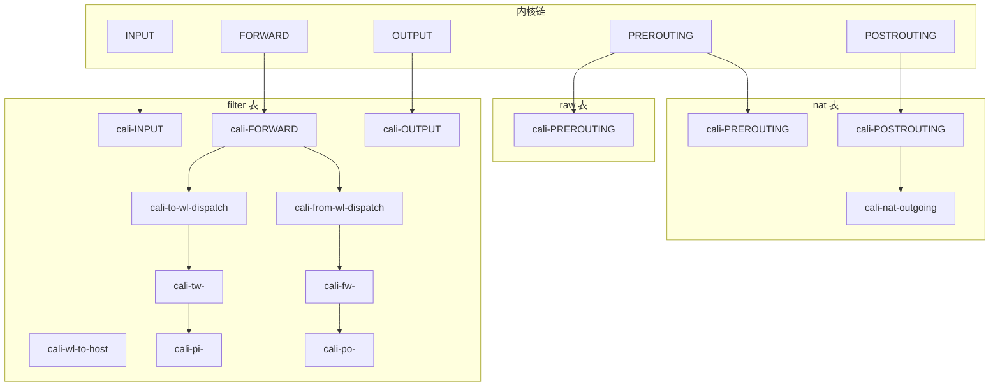
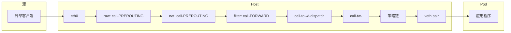
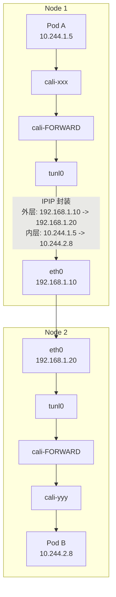
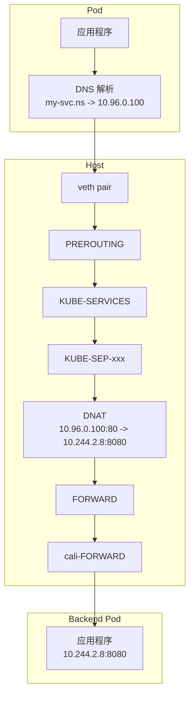
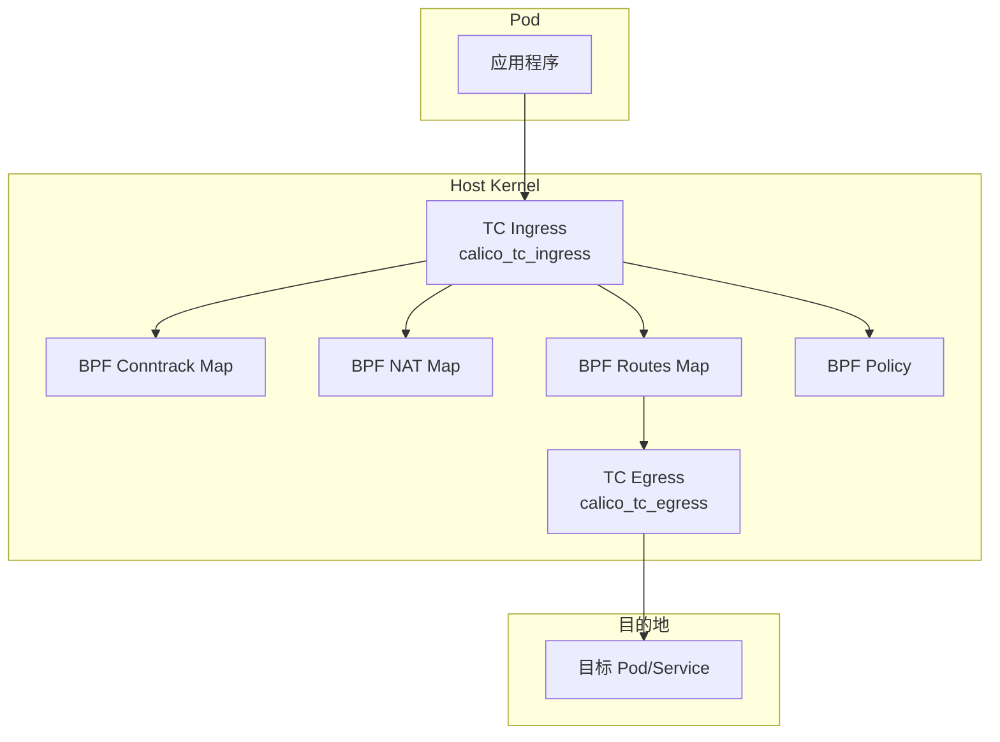

## 概述

本章详细分析数据包在 Calico 网络中的流转路径，包括 Pod 出站、Pod 入站、跨节点通信和 Service 访问等场景。通过追踪 iptables 链和 eBPF 程序的执行流程，深入理解 Calico 的数据平面工作原理。

## 前置知识

- iptables 五表五链
- Linux 网络命名空间
- Calico 数据平面架构

## Calico iptables 链架构

### 链命名规则

Calico 使用特定的前缀来命名 iptables 链，定义在 `felix/rules/rule_defs.go:34-119`：

```go
const (
    ChainNamePrefix = "cali-"

    // Filter 表链
    ChainFilterInput   = ChainNamePrefix + "INPUT"    // cali-INPUT
    ChainFilterForward = ChainNamePrefix + "FORWARD"  // cali-FORWARD
    ChainFilterOutput  = ChainNamePrefix + "OUTPUT"   // cali-OUTPUT

    // NAT 表链
    ChainNATPrerouting  = ChainNamePrefix + "PREROUTING"   // cali-PREROUTING
    ChainNATPostrouting = ChainNamePrefix + "POSTROUTING"  // cali-POSTROUTING
    ChainNATOutgoing    = ChainNamePrefix + "nat-outgoing" // cali-nat-outgoing

    // Workload 相关链
    ChainWorkloadToHost       = ChainNamePrefix + "wl-to-host"        // cali-wl-to-host
    ChainFromWorkloadDispatch = ChainNamePrefix + "from-wl-dispatch"  // cali-from-wl-dispatch
    ChainToWorkloadDispatch   = ChainNamePrefix + "to-wl-dispatch"    // cali-to-wl-dispatch

    // 端点链前缀
    WorkloadToEndpointPfx   = ChainNamePrefix + "tw-"  // cali-tw-<endpoint>
    WorkloadFromEndpointPfx = ChainNamePrefix + "fw-"  // cali-fw-<endpoint>

    // 策略链前缀
    PolicyInboundPfx   = ChainNamePrefix + "pi-"   // cali-pi-<policy>
    PolicyOutboundPfx  = ChainNamePrefix + "po-"   // cali-po-<policy>
    ProfileInboundPfx  = ChainNamePrefix + "pri-"  // cali-pri-<profile>
    ProfileOutboundPfx = ChainNamePrefix + "pro-"  // cali-pro-<profile>
}
```

### 链拓扑图



## 场景 1：Pod 出站流量

### 流量路径

当 Pod 发送数据包到外部时：

```mermaid
flowchart LR
    subgraph pod["Pod"]
        app["应用程序"]
    end

    subgraph host["Host"]
        veth["veth pair"]
        raw["raw: cali-PREROUTING"]
        mangle["mangle"]
        nat_pre["nat: cali-PREROUTING"]
        fwd["filter: cali-FORWARD"]
        from_wl["cali-from-wl-dispatch"]
        fw_ep["cali-fw-<endpoint>"]
        policy["策略链"]
        nat_post["nat: cali-POSTROUTING"]
        nat_out["cali-nat-outgoing"]
        eth0["eth0"]
    end

    subgraph dest["目的地"]
        target["外部服务"]
    end

    app --> veth
    veth --> raw
    raw --> mangle
    mangle --> nat_pre
    nat_pre --> fwd
    fwd --> from_wl
    from_wl --> fw_ep
    fw_ep --> policy
    policy --> nat_post
    nat_post --> nat_out
    nat_out --> eth0
    eth0 --> target
```



### 详细流程

#### Step 1: 数据包离开 Pod

数据包从 Pod 的 eth0 接口发出，通过 veth pair 进入宿主机。

```bash
# Pod 内
ip route
# default via 169.254.1.1 dev eth0
# 169.254.1.1 dev eth0 scope link

# 宿主机
ip link show | grep cali
# cali12345678901: <BROADCAST,MULTICAST,UP,LOWER_UP> mtu 1500 ...
```

#### Step 2: raw 表 PREROUTING

```bash
# 查看 raw 表规则
sudo iptables -t raw -L cali-PREROUTING -v -n

# 主要用于连接追踪标记和 untracked 流量处理
```

#### Step 3: filter 表 FORWARD 链

数据包经过 FORWARD 链，被 Calico 规则捕获：

```bash
# 查看 FORWARD 链中的 Calico 规则
sudo iptables -t filter -L FORWARD -v -n | grep cali

# Chain FORWARD (policy DROP)
# target     prot opt in     out     source       destination
# cali-FORWARD  all  --  *      *       0.0.0.0/0    0.0.0.0/0   /* cali:... */
```

#### Step 4: cali-FORWARD 链

```bash
sudo iptables -t filter -L cali-FORWARD -v -n

# 主要规则：
# 1. 检查已标记的允许流量
# 2. 调用 cali-from-wl-dispatch 处理来自 workload 的流量
# 3. 调用 cali-to-wl-dispatch 处理到 workload 的流量
```

#### Step 5: cali-from-wl-dispatch 链

分发到特定端点的出站链：

```bash
sudo iptables -t filter -L cali-from-wl-dispatch -v -n

# 按接口分发到对应的 cali-fw-<endpoint> 链
# -A cali-from-wl-dispatch -i cali12345678901 -m comment --comment "..." -g cali-fw-cali12345678901
```

#### Step 6: cali-fw-<endpoint> 链

端点的出站（egress）策略链：

```bash
sudo iptables -t filter -L cali-fw-cali12345678901 -v -n

# 规则顺序：
# 1. 接受已建立的连接
# 2. 设置标记
# 3. 调用策略链 cali-po-<policy>
# 4. 调用 Profile 链
# 5. 默认 DROP
```

#### Step 7: 策略评估

```bash
# 查看策略链
sudo iptables -t filter -L cali-po-default.allow-egress -v -n

# 策略链规则示例：
# -A cali-po-default.allow-egress -m set --match-set cali40s:xxxxx src -j MARK --set-xmark 0x10000/0x10000
# -A cali-po-default.allow-egress -m mark --mark 0x10000/0x10000 -j RETURN
```

#### Step 8: NAT POSTROUTING

如果目标是外部网络，执行 SNAT：

```bash
sudo iptables -t nat -L cali-POSTROUTING -v -n

# cali-nat-outgoing 链执行 MASQUERADE
sudo iptables -t nat -L cali-nat-outgoing -v -n
# -A cali-nat-outgoing -m set --match-set cali40masq-ipam-pools src -m set ! --match-set cali40all-ipam-pools dst -j MASQUERADE
```

## 场景 2：Pod 入站流量

### 流量路径

外部流量进入 Pod：



### 详细流程

#### Step 1: cali-FORWARD 调用 cali-to-wl-dispatch

```bash
sudo iptables -t filter -L cali-FORWARD -v -n | grep to-wl

# -A cali-FORWARD ... -j cali-to-wl-dispatch
```

#### Step 2: cali-to-wl-dispatch 分发

```bash
sudo iptables -t filter -L cali-to-wl-dispatch -v -n

# 按目标接口分发
# -A cali-to-wl-dispatch -o cali12345678901 -g cali-tw-cali12345678901
```

#### Step 3: cali-tw-<endpoint> 入站策略

```bash
sudo iptables -t filter -L cali-tw-cali12345678901 -v -n

# 规则顺序：
# 1. 接受已建立的连接
# 2. 调用策略链 cali-pi-<policy>
# 3. 调用 Profile 链
# 4. 默认 DROP
```

## 场景 3：跨节点 Pod 通信

### IPIP 封装模式



### 路由决策

```bash
# Node 1 路由表
ip route

# 本地 Pod 路由
10.244.1.0/24 dev cali-xxx scope link

# 远程 Pod 路由（通过隧道）
10.244.2.0/24 via 192.168.1.20 dev tunl0 proto bird onlink

# 或 VXLAN 模式
10.244.2.0/24 via 10.244.2.0 dev vxlan.calico onlink
```

### 封装过程

```bash
# 原始包
# src: 10.244.1.5, dst: 10.244.2.8

# IPIP 封装后
# 外层: src: 192.168.1.10, dst: 192.168.1.20, proto: IPIP(4)
# 内层: src: 10.244.1.5, dst: 10.244.2.8

# 抓包验证
sudo tcpdump -i eth0 -n proto 4
```

## 场景 4：Service 访问

### ClusterIP 访问流程



### NAT 规则

```bash
# 查看 Service 的 NAT 规则
sudo iptables -t nat -L KUBE-SERVICES -v -n | grep my-svc

# KUBE-SVC 链做负载均衡
sudo iptables -t nat -L KUBE-SVC-XXXX -v -n
# 使用 probability 做随机负载均衡

# KUBE-SEP 链做 DNAT
sudo iptables -t nat -L KUBE-SEP-YYYY -v -n
# -A KUBE-SEP-YYYY -p tcp -j DNAT --to-destination 10.244.2.8:8080
```

## eBPF 数据平面流程

### eBPF 模式架构



### eBPF 程序入口

TC 程序定义在 `felix/bpf-gpl/tc.c`：

```c
// Ingress 程序入口
SEC("tc/ingress")
int calico_tc_ingress(struct __sk_buff *skb) {
    // 1. 解析数据包
    struct cali_tc_ctx ctx = {};
    if (parse_packet(&ctx, skb) != CALI_PARSE_OK) {
        return TC_ACT_UNSPEC;
    }

    // 2. 连接追踪查找
    struct ct_result ct_result;
    ct_lookup(&ctx, &ct_result);

    // 3. NAT 处理
    if (needs_nat(&ctx)) {
        do_nat(&ctx);
    }

    // 4. 策略评估
    enum calico_policy_result pol_rc = calico_policy_check(&ctx);
    if (pol_rc == CALI_POL_DENY) {
        return TC_ACT_SHOT;
    }

    // 5. 路由决策
    return forward_packet(&ctx);
}
```

### BPF Maps

```bash
# 查看 Calico BPF maps
sudo bpftool map list | grep cali

# 常见 maps：
# cali_v4_ct        - 连接追踪
# cali_v4_routes    - 路由表
# cali_v4_nat_fe    - NAT frontend
# cali_v4_nat_be    - NAT backend
# cali_v4_nat_aff   - NAT affinity
```

### 连接追踪

```bash
# 查看 conntrack 表
sudo bpftool map dump name cali_v4_ct | head -50

# 条目格式：
# key: {proto, src_ip, src_port, dst_ip, dst_port}
# value: {type, flags, leg_a, leg_b, ...}
```

## 数据包追踪实验

### 实验 1：追踪 Pod 出站流量

```bash
#!/bin/bash
# trace-egress.sh

POD_IP="10.244.1.5"
DEST_IP="8.8.8.8"

# 1. 在各个检查点设置追踪
echo "Setting up iptables TRACE..."
sudo iptables -t raw -A PREROUTING -s $POD_IP -j TRACE
sudo iptables -t raw -A OUTPUT -s $POD_IP -j TRACE

# 2. 监控追踪日志
echo "Monitoring trace (Ctrl+C to stop)..."
sudo dmesg -w | grep TRACE &

# 3. 生成测试流量
kubectl exec <pod> -- ping -c 1 $DEST_IP

# 4. 清理
sudo iptables -t raw -D PREROUTING -s $POD_IP -j TRACE
sudo iptables -t raw -D OUTPUT -s $POD_IP -j TRACE
```

### 实验 2：追踪跨节点通信

```bash
#!/bin/bash
# trace-cross-node.sh

SRC_POD_IP="10.244.1.5"
DST_POD_IP="10.244.2.8"

# 1. 在源节点抓包
echo "Capturing on source node..."
sudo tcpdump -i any -n host $SRC_POD_IP and host $DST_POD_IP -w /tmp/src.pcap &
SRC_PID=$!

# 2. 在目标节点抓包
# (在目标节点执行)
sudo tcpdump -i any -n host $SRC_POD_IP and host $DST_POD_IP -w /tmp/dst.pcap &

# 3. 生成测试流量
kubectl exec <src-pod> -- curl http://$DST_POD_IP:80

# 4. 停止抓包
kill $SRC_PID

# 5. 分析抓包文件
tcpdump -r /tmp/src.pcap -n
```

### 实验 3：追踪 Service 访问

```bash
#!/bin/bash
# trace-service.sh

POD_IP="10.244.1.5"
SVC_IP="10.96.0.100"

# 1. 查看 DNAT 规则
echo "NAT rules for service:"
sudo iptables -t nat -L -n -v | grep -A 5 $SVC_IP

# 2. 监控 conntrack
echo "Conntrack entries:"
sudo conntrack -E -s $POD_IP &

# 3. 生成测试流量
kubectl exec <pod> -- curl http://$SVC_IP

# 4. 查看 NAT 后的连接
sudo conntrack -L -s $POD_IP
```

## 关键代码路径

| 场景 | 文件 | 函数/链 |
|------|------|---------|
| Filter 表规则 | felix/rules/static.go | StaticFilterTableChains() |
| NAT 表规则 | felix/rules/static.go | StaticNATTableChains() |
| 端点链生成 | felix/rules/endpoints.go | WorkloadEndpointToIptablesChains() |
| 策略链生成 | felix/rules/policy.go | PolicyToIptablesChains() |
| eBPF TC 程序 | felix/bpf-gpl/tc.c | calico_tc_ingress() |
| BPF 连接追踪 | felix/bpf/conntrack/map.go | Map(), Lookup() |
| BPF NAT | felix/bpf/nat/maps.go | FrontendMap(), BackendMap() |

## 性能优化点

### 1. 连接追踪优化

```bash
# 增加 conntrack 表大小
sysctl -w net.netfilter.nf_conntrack_max=524288

# 减少超时时间
sysctl -w net.netfilter.nf_conntrack_tcp_timeout_established=86400
```

### 2. eBPF 模式优势

| 特性 | iptables | eBPF |
|------|----------|------|
| 规则遍历 | 线性 O(n) | Map 查找 O(1) |
| NAT 实现 | conntrack + iptables | BPF Maps |
| 策略评估 | 多链跳转 | 单程序内联 |
| CPU 使用 | 较高 | 较低 |

### 3. 路由模式选择

| 模式 | 开销 | 适用场景 |
|------|------|----------|
| 纯路由 | 无封装开销 | 同子网，BGP 支持 |
| IPIP | 20 字节 | 跨子网，简单 |
| VXLAN | 50 字节 | 跨子网，多租户 |
| WireGuard | 加密开销 | 需要加密 |

## 总结

数据包在 Calico 中的流转遵循以下原则：

1. **分层处理**：raw → mangle → nat → filter
2. **分发机制**：dispatch 链按接口分发
3. **策略执行**：端点链调用策略链
4. **连接追踪**：复用已建立连接
5. **NAT 处理**：出站 SNAT，入站 DNAT

理解数据包流转路径对于排障和性能优化至关重要。

## 参考资料

- [Felix Rules 定义](https://github.com/projectcalico/calico/blob/master/felix/rules/rule_defs.go)
- [Static 链生成](https://github.com/projectcalico/calico/blob/master/felix/rules/static.go)
- [eBPF TC 程序](https://github.com/projectcalico/calico/blob/master/felix/bpf-gpl/tc.c)
- [BPF Conntrack](https://github.com/projectcalico/calico/tree/master/felix/bpf/conntrack)
