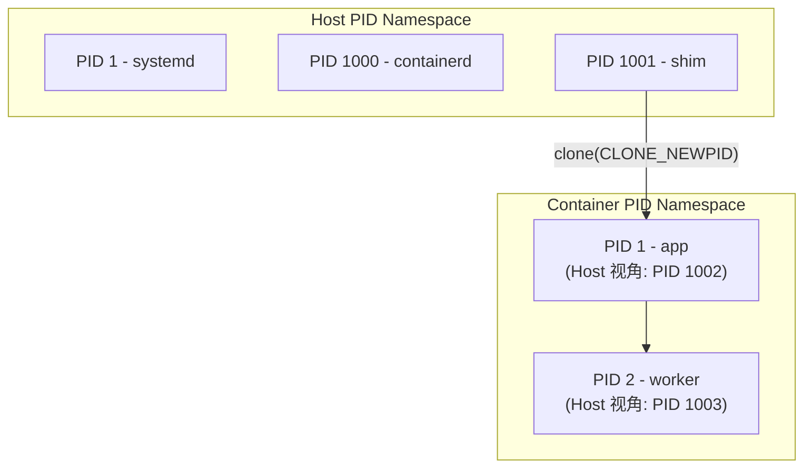
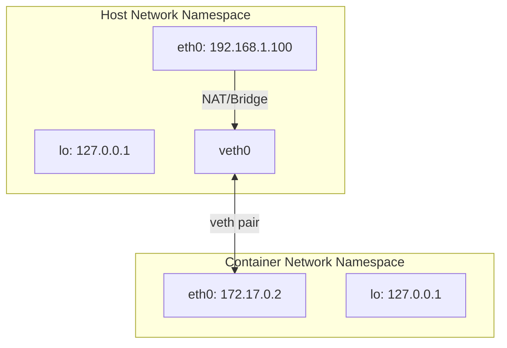
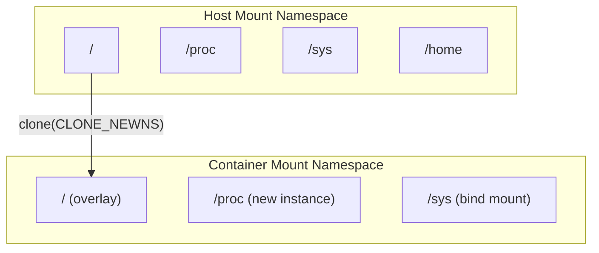
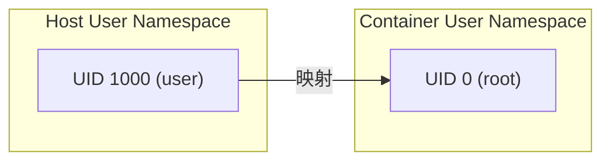

Namespace 是 Linux 内核提供的一种资源隔离机制，它是容器技术的核心基础之一。通过 Namespace，不同的进程可以拥有独立的系统资源视图，从而实现轻量级的隔离。

## Namespace 概述

### 为什么需要 Namespace

在传统的 Linux 系统中，所有进程共享相同的系统资源视图：

- 所有进程看到相同的进程 ID 空间
- 所有进程共享相同的网络栈
- 所有进程看到相同的文件系统挂载点

这种共享模式在需要隔离的场景下存在问题。Namespace 通过将全局系统资源包装在一个抽象层中，使得 Namespace 内的进程认为自己拥有独立的全局资源实例。

### Namespace 类型

Linux 内核目前支持 8 种 Namespace：

| Namespace | Flag | 隔离内容 | 内核版本 |
|-----------|------|----------|----------|
| Mount | `CLONE_NEWNS` | 挂载点 | 2.4.19 |
| UTS | `CLONE_NEWUTS` | 主机名和域名 | 2.6.19 |
| IPC | `CLONE_NEWIPC` | 进程间通信资源 | 2.6.19 |
| PID | `CLONE_NEWPID` | 进程 ID | 2.6.24 |
| Network | `CLONE_NEWNET` | 网络设备、栈、端口等 | 2.6.29 |
| User | `CLONE_NEWUSER` | 用户和组 ID | 3.8 |
| Cgroup | `CLONE_NEWCGROUP` | Cgroup 根目录 | 4.6 |
| Time | `CLONE_NEWTIME` | 系统时间 | 5.6 |

## 核心系统调用

Linux 提供了三个核心系统调用来操作 Namespace：

### clone() - 创建新进程并加入新 Namespace

```c
int clone(int (*fn)(void *), void *stack, int flags, void *arg, ...);
```

`clone()` 类似于 `fork()`，但可以通过 `flags` 参数指定创建哪些新的 Namespace：

```c
// 创建新进程，同时创建新的 PID 和 Network Namespace
int flags = CLONE_NEWPID | CLONE_NEWNET | SIGCHLD;
pid_t pid = clone(child_fn, stack + STACK_SIZE, flags, NULL);
```

### unshare() - 将当前进程移入新 Namespace

```c
int unshare(int flags);
```

`unshare()` 让当前进程脱离原有的 Namespace，进入新创建的 Namespace：

```c
// 当前进程进入新的 Mount Namespace
if (unshare(CLONE_NEWNS) == -1) {
    perror("unshare");
    exit(1);
}
```

### setns() - 加入已存在的 Namespace

```c
int setns(int fd, int nstype);
```

`setns()` 让当前进程加入一个已存在的 Namespace：

```c
// 打开目标进程的 Network Namespace
int fd = open("/proc/1234/ns/net", O_RDONLY);
if (setns(fd, CLONE_NEWNET) == -1) {
    perror("setns");
    exit(1);
}
close(fd);
```

## 各 Namespace 详解

### PID Namespace - 进程 ID 隔离

PID Namespace 隔离进程 ID 号码空间。在新的 PID Namespace 中，进程可以拥有独立的 PID，且第一个进程的 PID 为 1。



**关键特性**：

1. **PID 1 的特殊性**：Namespace 内的 PID 1 进程承担 init 进程的职责
   - 接收孤儿进程
   - 信号处理不同（不会被未捕获的 SIGTERM 杀死）

2. **嵌套视图**：父 Namespace 可以看到子 Namespace 的进程（但 PID 不同）

3. **进程树隔离**：子 Namespace 无法看到父 Namespace 的进程

**实战示例**：

```bash
# 创建新的 PID Namespace 并运行 shell
sudo unshare --pid --fork --mount-proc /bin/bash

# 在新 Namespace 中查看进程
ps aux
# 只能看到当前 shell 和 ps 命令本身
```

### Network Namespace - 网络隔离

Network Namespace 隔离网络栈，包括：

- 网络设备（eth0, lo 等）
- IPv4/IPv6 协议栈
- 路由表
- 防火墙规则（iptables）
- `/proc/net` 目录
- 端口号空间



**关键特性**：

1. **独立网络栈**：每个 Network Namespace 有独立的网络设备
2. **veth pair**：用于连接不同 Network Namespace
3. **Bridge**：用于多容器互联

**实战示例**：

```bash
# 创建新的 Network Namespace
sudo ip netns add test_ns

# 创建 veth pair
sudo ip link add veth0 type veth peer name veth1

# 将 veth1 移入新 Namespace
sudo ip link set veth1 netns test_ns

# 配置 IP 地址
sudo ip addr add 192.168.100.1/24 dev veth0
sudo ip link set veth0 up

sudo ip netns exec test_ns ip addr add 192.168.100.2/24 dev veth1
sudo ip netns exec test_ns ip link set veth1 up
sudo ip netns exec test_ns ip link set lo up

# 测试连通性
sudo ip netns exec test_ns ping 192.168.100.1
```

### Mount Namespace - 挂载点隔离

Mount Namespace 隔离文件系统挂载点。这是最早实现的 Namespace（2002年），也是容器文件系统隔离的基础。



**关键特性**：

1. **Copy-on-Write**：新 Namespace 继承父 Namespace 的挂载点副本
2. **挂载传播**：控制挂载事件在 Namespace 间的传播
   - `MS_SHARED`：共享挂载
   - `MS_PRIVATE`：私有挂载
   - `MS_SLAVE`：从属挂载

3. **pivot_root**：切换根文件系统

**实战示例**：

```bash
# 创建新的 Mount Namespace
sudo unshare --mount /bin/bash

# 挂载一个临时文件系统
mkdir /tmp/test_mount
mount -t tmpfs tmpfs /tmp/test_mount

# 这个挂载点只在当前 Namespace 可见
# 退出后挂载点自动消失
```

### UTS Namespace - 主机名隔离

UTS (UNIX Time-sharing System) Namespace 隔离主机名和域名：

```bash
# 创建新的 UTS Namespace 并设置主机名
sudo unshare --uts /bin/bash
hostname container-001
hostname  # 输出: container-001

# 在另一个终端查看主机的主机名，不受影响
```

### IPC Namespace - 进程间通信隔离

IPC Namespace 隔离 System V IPC 和 POSIX 消息队列：

- 信号量（Semaphores）
- 消息队列（Message Queues）
- 共享内存（Shared Memory）

### User Namespace - 用户隔离

User Namespace 隔离用户和组 ID。这是实现 Rootless 容器的关键技术：



**关键特性**：

1. **UID/GID 映射**：容器内的 root(0) 映射到宿主机的普通用户
2. **能力隔离**：Namespace 内的 root 只在该 Namespace 有效
3. **Rootless 容器**：允许非特权用户运行容器

**映射配置文件**：

```bash
# /proc/[pid]/uid_map 格式:
# 容器内起始UID  宿主机起始UID  映射范围
0 1000 1      # 容器内 UID 0 映射到宿主机 UID 1000
1 100000 65535  # 容器内 UID 1-65535 映射到宿主机 UID 100000-165535
```

### Cgroup Namespace - Cgroup 根目录隔离

Cgroup Namespace 隔离 Cgroup 层级的视图：

```bash
# 在容器内看到的 Cgroup 路径
/  # 实际可能是 /sys/fs/cgroup/docker/container-id
```

这使得容器内的进程认为自己处于 Cgroup 层级的根部。

## Namespace 在 containerd 中的应用

containerd 通过 OCI Runtime（如 runc）来创建和管理 Namespace。配置通过 OCI Runtime Spec 传递：

### OCI Spec 中的 Namespace 配置

```json
{
  "linux": {
    "namespaces": [
      {"type": "pid"},
      {"type": "network"},
      {"type": "ipc"},
      {"type": "uts"},
      {"type": "mount"},
      {"type": "user"},
      {"type": "cgroup"}
    ]
  }
}
```

### 共享 Namespace

某些场景下需要共享 Namespace（如 Kubernetes Pod 内的容器共享 Network Namespace）：

```json
{
  "linux": {
    "namespaces": [
      {"type": "pid"},
      {"type": "network", "path": "/proc/1234/ns/net"},  // 加入已存在的 Namespace
      {"type": "ipc", "path": "/proc/1234/ns/ipc"}
    ]
  }
}
```

### containerd 代码路径

在 containerd 中，Namespace 相关的处理主要在以下位置：

```
cmd/containerd-shim-runc-v2/
├── process/
│   └── init.go          # 进程初始化，设置 Namespace
└── runc/
    └── container.go     # 调用 runc 创建容器
```

runc 是实际执行 Namespace 创建的组件，它通过 `clone()` 系统调用创建新进程和 Namespace。

## /proc/[pid]/ns/ 接口

Linux 通过 `/proc/[pid]/ns/` 目录暴露进程的 Namespace 信息：

```bash
$ ls -la /proc/self/ns/
lrwxrwxrwx 1 root root 0 Jan 30 10:00 cgroup -> 'cgroup:[4026531835]'
lrwxrwxrwx 1 root root 0 Jan 30 10:00 ipc -> 'ipc:[4026531839]'
lrwxrwxrwx 1 root root 0 Jan 30 10:00 mnt -> 'mnt:[4026531840]'
lrwxrwxrwx 1 root root 0 Jan 30 10:00 net -> 'net:[4026531992]'
lrwxrwxrwx 1 root root 0 Jan 30 10:00 pid -> 'pid:[4026531836]'
lrwxrwxrwx 1 root root 0 Jan 30 10:00 user -> 'user:[4026531837]'
lrwxrwxrwx 1 root root 0 Jan 30 10:00 uts -> 'uts:[4026531838]'
```

每个链接指向一个 inode，格式为 `<type>:[<inode>]`。相同 inode 表示在同一个 Namespace 中。

**用途**：

1. **检查 Namespace**：判断两个进程是否在同一 Namespace
2. **持久化 Namespace**：通过 bind mount 保持 Namespace 存在
3. **加入 Namespace**：通过 `setns()` 加入

```bash
# 持久化 Network Namespace
touch /var/run/netns/my_ns
mount --bind /proc/1234/ns/net /var/run/netns/my_ns

# 进程退出后 Namespace 仍然存在
```

## 实战：手动创建容器隔离环境

下面的示例展示如何使用 Namespace 创建一个简单的隔离环境：

```bash
#!/bin/bash
# 需要 root 权限运行

# 1. 创建容器根文件系统
mkdir -p /tmp/container/{bin,lib,lib64,proc,sys,dev}

# 复制必要的程序和库
cp /bin/sh /bin/ls /bin/ps /tmp/container/bin/
# 复制依赖库（实际使用时需要 ldd 查看依赖）

# 2. 创建新的 Namespace 并运行容器
unshare --mount --uts --ipc --net --pid --fork \
  /bin/sh -c "
    # 设置主机名
    hostname container-demo

    # 挂载必要的文件系统
    mount -t proc proc /tmp/container/proc
    mount -t sysfs sysfs /tmp/container/sys

    # 切换根文件系统
    cd /tmp/container
    pivot_root . .
    umount -l /.

    # 运行 shell
    exec /bin/sh
"
```

## 小结

Namespace 是 Linux 容器的基础隔离机制：

1. **隔离性**：每种 Namespace 隔离不同的系统资源
2. **轻量级**：只是资源的逻辑分区，不涉及硬件虚拟化
3. **灵活性**：可以选择性地隔离资源，支持共享
4. **可组合**：多种 Namespace 可以组合使用

理解 Namespace 原理对于深入理解 containerd 如何管理容器至关重要。下一节我们将学习 [Cgroups](./02-linux-cgroups.md)，它提供了容器的资源限制能力。

## 参考资料

- [Linux Programmer's Manual - namespaces(7)](https://man7.org/linux/man-pages/man7/namespaces.7.html)
- [Linux Programmer's Manual - clone(2)](https://man7.org/linux/man-pages/man2/clone.2.html)
- [Linux Programmer's Manual - unshare(2)](https://man7.org/linux/man-pages/man2/unshare.2.html)
- [Linux Programmer's Manual - setns(2)](https://man7.org/linux/man-pages/man2/setns.2.html)
