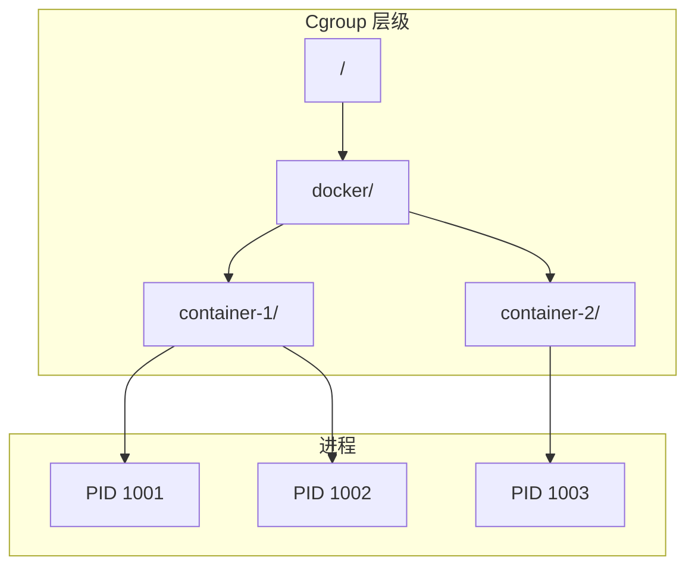
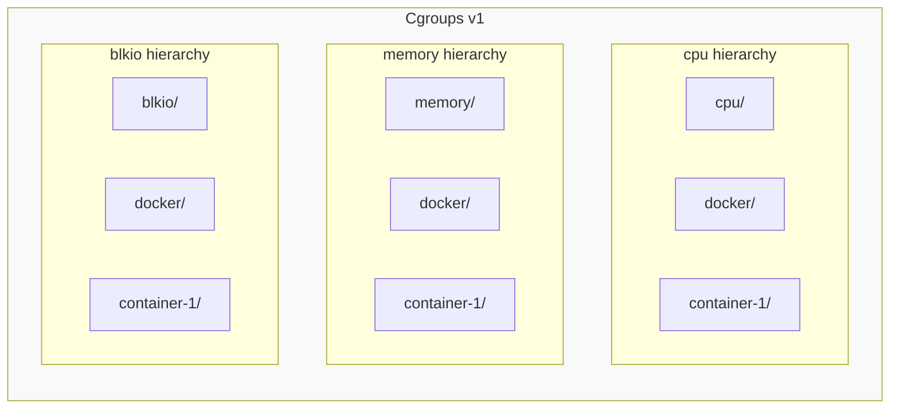
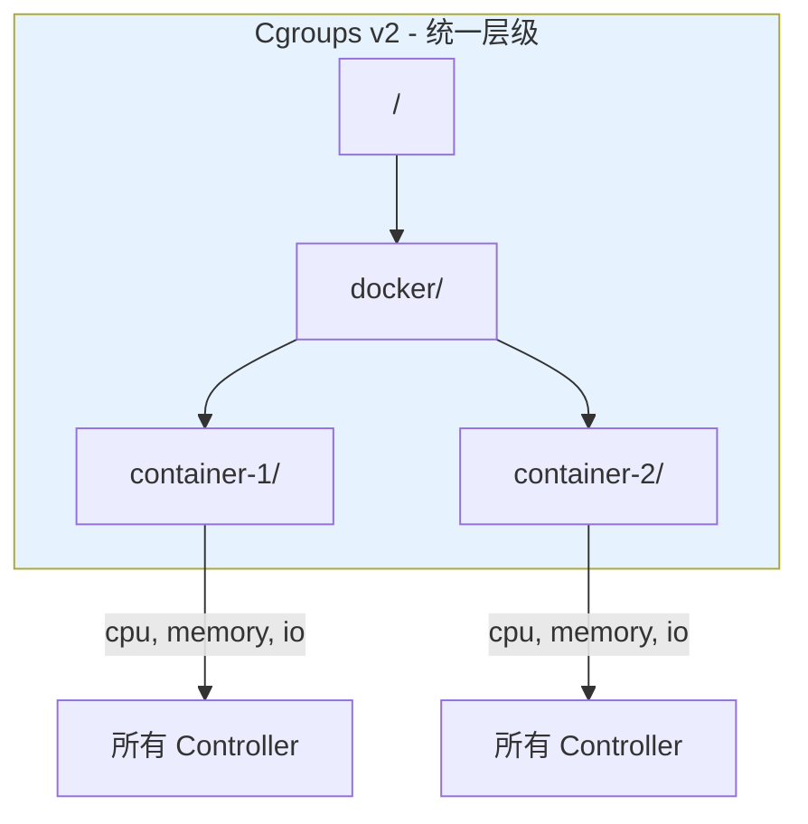
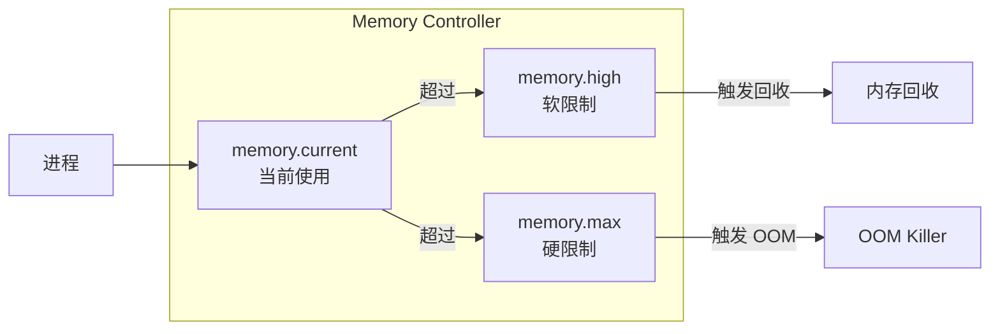

Cgroups（Control Groups）是 Linux 内核提供的资源限制、优先级分配、资源统计和进程控制机制。它是容器技术实现资源隔离的核心基础。

## Cgroups 概述

### 什么是 Cgroups

Cgroups 允许你：

1. **资源限制**：限制进程组使用的资源量（CPU、内存、IO 等）
2. **优先级控制**：控制进程组的资源分配优先级
3. **资源统计**：统计进程组的资源使用情况
4. **进程控制**：对进程组进行挂起/恢复等操作

### Cgroups 核心概念



**核心术语**：

| 术语 | 说明 |
|------|------|
| cgroup | 一组进程的集合，绑定到一组限制或参数 |
| hierarchy | cgroups 的树形结构 |
| subsystem/controller | 资源控制器（cpu, memory, io 等） |
| root cgroup | 层级的根节点，包含所有进程 |

## Cgroups v1 vs v2

Linux 内核支持两个版本的 Cgroups：

### Cgroups v1 架构



**v1 特点**：

- 每个 Controller 独立挂载在不同目录
- 进程可以属于不同层级的不同 cgroup
- 配置复杂，容易出现不一致
- 挂载点：`/sys/fs/cgroup/<controller>/`

### Cgroups v2 架构



**v2 特点**：

- 单一统一层级
- 所有 Controller 在同一层级
- 简化的接口
- 更好的资源分配一致性
- 挂载点：`/sys/fs/cgroup/`

### 版本对比

| 特性 | Cgroups v1 | Cgroups v2 |
|------|------------|------------|
| 层级结构 | 每个 Controller 独立层级 | 单一统一层级 |
| Controller 绑定 | 一个 Controller 只能属于一个层级 | 所有 Controller 在同一层级 |
| 线程支持 | 有限 | 完善的线程粒度控制 |
| 压力监控 | 无 | PSI (Pressure Stall Information) |
| 默认启用 | 内核 < 5.0 | 内核 >= 5.0 (可配置) |

### 检查系统使用的版本

```bash
# 检查是否挂载了 cgroup2
mount | grep cgroup

# Cgroups v2 统一层级
# cgroup2 on /sys/fs/cgroup type cgroup2 (rw,nosuid,nodev,noexec,relatime)

# Cgroups v1 混合模式
# cgroup on /sys/fs/cgroup/cpu type cgroup (rw,nosuid,nodev,noexec,relatime,cpu)
# cgroup on /sys/fs/cgroup/memory type cgroup (rw,nosuid,nodev,noexec,relatime,memory)

# 检查统一层级是否启用
cat /proc/cgroups
```

## 核心 Controller 详解

### CPU Controller

控制 CPU 时间分配：

**Cgroups v1 文件接口**：

```bash
/sys/fs/cgroup/cpu/docker/container-1/
├── cpu.cfs_period_us    # CFS 调度周期（微秒），默认 100000
├── cpu.cfs_quota_us     # 周期内可使用的 CPU 时间，-1 表示不限制
├── cpu.shares           # 相对权重，默认 1024
├── cpu.stat            # 统计信息
└── tasks               # 属于此 cgroup 的进程 PID
```

**Cgroups v2 文件接口**：

```bash
/sys/fs/cgroup/docker/container-1/
├── cpu.max             # 格式: quota period (如 "50000 100000" 表示 50% CPU)
├── cpu.weight          # 权重 1-10000，默认 100
├── cpu.stat           # 统计信息
└── cgroup.procs       # 属于此 cgroup 的进程 PID
```

**示例：限制容器使用 50% CPU**

```bash
# Cgroups v1
echo 50000 > /sys/fs/cgroup/cpu/docker/container-1/cpu.cfs_quota_us
echo 100000 > /sys/fs/cgroup/cpu/docker/container-1/cpu.cfs_period_us

# Cgroups v2
echo "50000 100000" > /sys/fs/cgroup/docker/container-1/cpu.max
```

### Memory Controller

控制内存使用：



**Cgroups v2 文件接口**：

```bash
/sys/fs/cgroup/docker/container-1/
├── memory.max          # 硬限制（字节），超过触发 OOM
├── memory.high         # 软限制，超过时积极回收内存
├── memory.min          # 最小保证内存
├── memory.low          # 低水位，低于此值时优先保留
├── memory.current      # 当前使用量
├── memory.swap.max     # swap 限制
├── memory.swap.current # 当前 swap 使用量
├── memory.stat         # 详细统计
└── memory.oom.group    # OOM 时杀死整个 cgroup
```

**示例：限制容器内存为 512MB**

```bash
# Cgroups v2
echo 536870912 > /sys/fs/cgroup/docker/container-1/memory.max

# 或使用单位后缀
echo "512M" > /sys/fs/cgroup/docker/container-1/memory.max
```

**OOM 行为控制**：

```bash
# 当 cgroup 内任何进程触发 OOM 时，杀死整个 cgroup
echo 1 > /sys/fs/cgroup/docker/container-1/memory.oom.group
```

### IO Controller

控制块设备 IO：

**Cgroups v2 文件接口**：

```bash
/sys/fs/cgroup/docker/container-1/
├── io.max              # IO 限制
├── io.weight           # IO 权重
├── io.stat             # IO 统计
└── io.pressure         # IO 压力信息
```

**io.max 格式**：

```bash
# 格式: 设备号 rbps=读带宽 wbps=写带宽 riops=读IOPS wiops=写IOPS
# 限制 /dev/sda (8:0) 的读写带宽为 10MB/s
echo "8:0 rbps=10485760 wbps=10485760" > io.max
```

### PIDs Controller

限制进程数量：

```bash
/sys/fs/cgroup/docker/container-1/
├── pids.max            # 最大进程数
├── pids.current        # 当前进程数
└── pids.events         # 事件计数
```

**示例：限制容器最多 100 个进程**

```bash
echo 100 > /sys/fs/cgroup/docker/container-1/pids.max
```

## Cgroup 操作实战

### 创建 Cgroup

```bash
# Cgroups v2
mkdir /sys/fs/cgroup/my_container

# 查看可用的 Controller
cat /sys/fs/cgroup/cgroup.controllers

# 启用 Controller（在父 cgroup 中）
echo "+cpu +memory +io +pids" > /sys/fs/cgroup/cgroup.subtree_control
```

### 将进程加入 Cgroup

```bash
# 将 PID 1234 加入 cgroup
echo 1234 > /sys/fs/cgroup/my_container/cgroup.procs

# 查看 cgroup 中的进程
cat /sys/fs/cgroup/my_container/cgroup.procs
```

### 设置资源限制

```bash
# 限制 CPU 为 50%
echo "50000 100000" > /sys/fs/cgroup/my_container/cpu.max

# 限制内存为 256MB
echo "256M" > /sys/fs/cgroup/my_container/memory.max

# 限制进程数为 50
echo 50 > /sys/fs/cgroup/my_container/pids.max
```

### 监控资源使用

```bash
# CPU 统计
cat /sys/fs/cgroup/my_container/cpu.stat
# usage_usec 1234567
# user_usec 1000000
# system_usec 234567

# 内存统计
cat /sys/fs/cgroup/my_container/memory.stat
# anon 12345678
# file 23456789
# ...

# 当前内存使用
cat /sys/fs/cgroup/my_container/memory.current

# IO 统计
cat /sys/fs/cgroup/my_container/io.stat
```

### 删除 Cgroup

```bash
# 必须先移出所有进程
echo 1234 > /sys/fs/cgroup/cgroup.procs  # 移到根 cgroup

# 删除 cgroup 目录
rmdir /sys/fs/cgroup/my_container
```

## PSI - Pressure Stall Information

Cgroups v2 引入了 PSI 机制，提供资源压力监控：

```bash
/sys/fs/cgroup/docker/container-1/
├── cpu.pressure
├── memory.pressure
└── io.pressure
```

**pressure 文件格式**：

```bash
cat /sys/fs/cgroup/docker/container-1/cpu.pressure
# some avg10=0.00 avg60=0.00 avg300=0.00 total=0
# full avg10=0.00 avg60=0.00 avg300=0.00 total=0
```

- `some`：至少有一个任务在等待资源
- `full`：所有任务都在等待资源
- `avg10/60/300`：10秒/60秒/300秒的平均压力百分比

**用途**：

- 监控容器是否资源不足
- 自动扩缩容的依据
- 性能问题诊断

## containerd 中的 Cgroups 集成

containerd 通过 OCI Runtime Spec 配置 Cgroups：

### OCI Spec 中的 Cgroups 配置

```json
{
  "linux": {
    "resources": {
      "memory": {
        "limit": 536870912,
        "reservation": 268435456,
        "swap": 536870912,
        "disableOOMKiller": false
      },
      "cpu": {
        "shares": 1024,
        "quota": 50000,
        "period": 100000,
        "cpus": "0-3",
        "mems": "0"
      },
      "pids": {
        "limit": 100
      },
      "blockIO": {
        "weight": 500,
        "throttleReadBpsDevice": [
          {"major": 8, "minor": 0, "rate": 10485760}
        ]
      }
    },
    "cgroupsPath": "/docker/container-1"
  }
}
```

### containerd Cgroups 代码路径

```
containerd 相关路径:
├── cmd/containerd-shim-runc-v2/
│   └── runc/
│       └── container.go    # 容器 Cgroups 配置
└── vendor/github.com/containerd/cgroups/  # Cgroups 库
```

containerd 使用 `github.com/containerd/cgroups` 库来操作 Cgroups：

```go
import "github.com/containerd/cgroups/v3/cgroup2"

// 创建 cgroup
manager, err := cgroup2.NewManager("/sys/fs/cgroup", "/my_container", &cgroup2.Resources{
    Memory: &cgroup2.Memory{
        Max: pointerTo(int64(536870912)), // 512MB
    },
    CPU: &cgroup2.CPU{
        Max: cgroup2.NewCPUMax(pointerTo(int64(50000)), pointerTo(uint64(100000))),
    },
})

// 将进程加入 cgroup
err = manager.AddProc(1234)

// 获取统计信息
stats, err := manager.Stat()
```

### Cgroups 驱动选择

containerd 支持两种 Cgroups 驱动：

1. **cgroupfs**（默认）
   - 直接操作 cgroup 文件系统
   - 适用于大多数场景

2. **systemd**
   - 通过 systemd 管理 cgroups
   - 与 systemd 集成的系统推荐使用

配置方式（containerd config.toml）：

```toml
[plugins."io.containerd.grpc.v1.cri".containerd.runtimes.runc.options]
  SystemdCgroup = true  # 使用 systemd 驱动
```

## 资源限制最佳实践

### 内存限制

```bash
# 设置合理的内存限制
memory.max = 应用峰值内存 * 1.2

# 设置软限制促进内存回收
memory.high = memory.max * 0.8

# 对于关键服务，保证最小内存
memory.min = 基础运行内存
```

### CPU 限制

```bash
# 对于 CPU 密集型应用，使用 quota 硬限制
cpu.max = "quota period"

# 对于混合负载，使用权重软限制
cpu.weight = 相对重要性 (1-10000)

# CPU 绑定（减少上下文切换）
cpuset.cpus = "0-3"
```

### IO 限制

```bash
# 限制带宽防止 IO 密集型任务影响其他容器
io.max = "device rbps=X wbps=Y"

# 使用权重进行公平调度
io.weight = 100
```

## 监控与告警

### 关键指标

| 指标 | 说明 | 告警阈值建议 |
|------|------|--------------|
| memory.current / memory.max | 内存使用率 | > 80% |
| cpu.stat usage_usec 增长率 | CPU 使用率 | > 90% |
| memory.pressure avg10 | 内存压力 | > 20% |
| io.pressure avg10 | IO 压力 | > 30% |
| pids.current / pids.max | 进程数使用率 | > 80% |

### 监控脚本示例

```bash
#!/bin/bash
CGROUP_PATH="/sys/fs/cgroup/docker/container-1"

# 内存使用率
mem_current=$(cat $CGROUP_PATH/memory.current)
mem_max=$(cat $CGROUP_PATH/memory.max)
mem_usage=$((mem_current * 100 / mem_max))
echo "Memory Usage: ${mem_usage}%"

# CPU 压力
cpu_pressure=$(cat $CGROUP_PATH/cpu.pressure | grep "some" | awk '{print $2}' | cut -d= -f2)
echo "CPU Pressure (avg10): ${cpu_pressure}%"

# 进程数
pids_current=$(cat $CGROUP_PATH/pids.current)
pids_max=$(cat $CGROUP_PATH/pids.max)
echo "PIDs: ${pids_current}/${pids_max}"
```

## 小结

Cgroups 是容器资源隔离的核心机制：

1. **资源限制**：通过各种 Controller 限制 CPU、内存、IO 等资源
2. **层级管理**：树形结构便于组织和继承
3. **统计监控**：提供丰富的资源使用统计
4. **v2 优势**：统一层级、PSI 监控、更简洁的接口

理解 Cgroups 原理有助于：
- 合理配置容器资源限制
- 诊断资源相关问题
- 优化容器性能

下一节我们将学习 [OverlayFS](./03-overlayfs.md)，它是容器文件系统分层的基础。

## 参考资料

- [Linux Kernel Documentation - cgroups](https://www.kernel.org/doc/Documentation/cgroup-v2.txt)
- [Red Hat - Resource Management Guide](https://access.redhat.com/documentation/en-us/red_hat_enterprise_linux/8/html/managing_monitoring_and_updating_the_kernel/using-cgroups-v2-to-control-distribution-of-cpu-time-for-applications_managing-monitoring-and-updating-the-kernel)
- [containerd/cgroups](https://github.com/containerd/cgroups)
