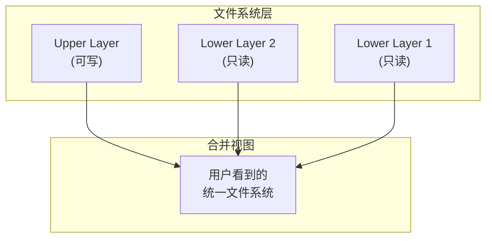
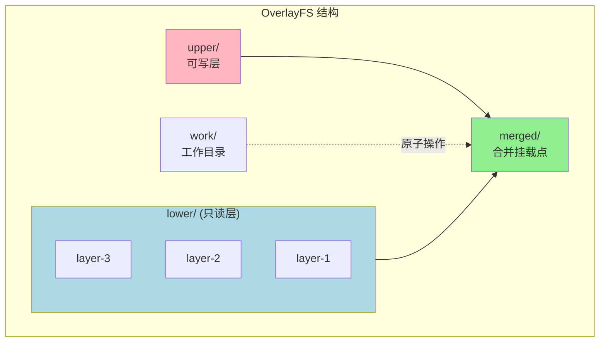
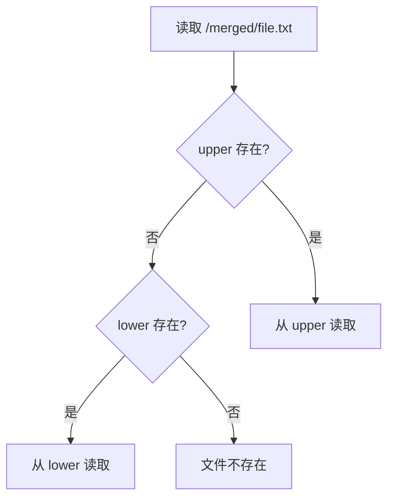
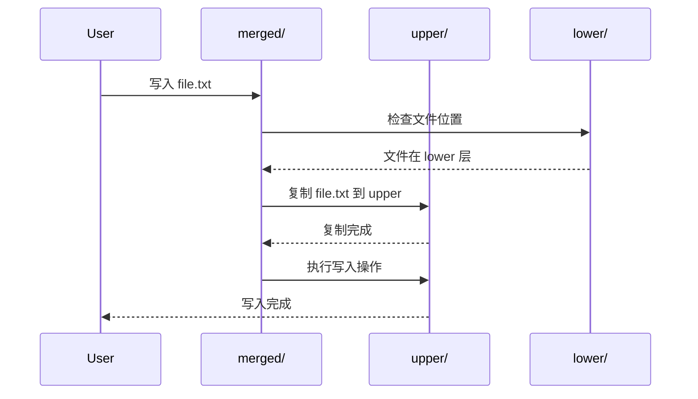
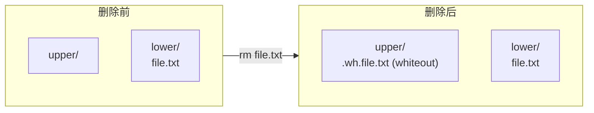
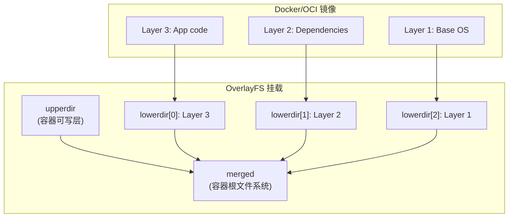

OverlayFS 是 Linux 内核提供的联合文件系统（Union Filesystem），它允许将多个目录叠加在一起，呈现为单一的文件系统视图。这是容器镜像分层存储的核心技术。

## 联合文件系统概念

### 什么是联合文件系统

联合文件系统将多个独立的文件系统分支（branch）合并为一个统一的视图：



**核心特性**：

- **分层叠加**：多个目录层叠成一个
- **Copy-on-Write**：写时复制，节省存储空间
- **透明合并**：用户看到统一的文件系统视图

### 为什么容器需要联合文件系统

1. **镜像分层**：多个容器共享相同的基础镜像层
2. **快速启动**：无需复制整个镜像
3. **存储效率**：相同的层只存储一份
4. **可追溯**：每层记录了文件系统的变更

## OverlayFS 架构

### 四层结构

OverlayFS 由四个关键组件组成：



| 组件 | 说明 | 特性 |
|------|------|------|
| **lowerdir** | 只读底层 | 可以有多个，从下到上叠加 |
| **upperdir** | 可写上层 | 所有修改都写入这里 |
| **workdir** | 工作目录 | 用于原子操作，必须为空 |
| **merged** | 合并视图 | 挂载点，用户访问的入口 |

### mount 命令详解

```bash
mount -t overlay overlay \
    -o lowerdir=/lower3:/lower2:/lower1,upperdir=/upper,workdir=/work \
    /merged
```

**参数说明**：

- `-t overlay`：文件系统类型
- `lowerdir=`：只读层，多个用 `:` 分隔，**右边的在下面**
- `upperdir=`：可写层
- `workdir=`：工作目录，必须和 upperdir 在同一文件系统
- 最后的路径是挂载点

## 读写操作原理

### 读取文件



**查找顺序**：从上到下

1. 先查找 upperdir
2. 依次查找 lowerdir（从左到右，即从上到下）
3. 返回第一个找到的文件

### 写入文件 - Copy-on-Write

当修改一个来自 lower 层的文件时，OverlayFS 会执行 Copy-on-Write：



**具体步骤**：

1. 用户请求修改 `/merged/file.txt`
2. OverlayFS 发现文件在 lower 层
3. 将文件完整复制到 upper 层
4. 在 upper 层执行修改
5. 后续访问都使用 upper 层的版本

### 删除文件 - Whiteout 机制

删除 lower 层的文件时，不能直接删除（lower 是只读的），而是使用 Whiteout 文件标记：



**Whiteout 文件**：

- 字符设备文件，major=0, minor=0
- 文件名格式：`.wh.<原文件名>`
- 标记该文件已被删除

```bash
# 查看 whiteout 文件
ls -la upper/
# c--------- 1 root root 0, 0 Jan 30 10:00 .wh.deleted_file

# 手动创建 whiteout
mknod upper/.wh.file.txt c 0 0
```

### 删除目录 - Opaque 目录

当删除并重建一个目录时，使用 Opaque 标记：

```bash
# upper 目录设置 opaque 属性
setfattr -n "trusted.overlay.opaque" -v "y" upper/new_dir

# 查看 opaque 属性
getfattr -n "trusted.overlay.opaque" upper/new_dir
```

Opaque 目录表示：忽略 lower 层中同名目录的所有内容。

## 实战：手动构建 OverlayFS

### 准备目录结构

```bash
# 创建目录
mkdir -p /tmp/overlay/{lower1,lower2,upper,work,merged}

# 创建 lower1 层文件
echo "base content" > /tmp/overlay/lower1/base.txt
mkdir /tmp/overlay/lower1/config
echo "config v1" > /tmp/overlay/lower1/config/app.conf

# 创建 lower2 层文件（覆盖部分 lower1）
echo "config v2" > /tmp/overlay/lower2/config/app.conf
echo "feature.txt" > /tmp/overlay/lower2/feature.txt
```

### 挂载 OverlayFS

```bash
# 挂载（需要 root 权限）
sudo mount -t overlay overlay \
    -o lowerdir=/tmp/overlay/lower2:/tmp/overlay/lower1,\
upperdir=/tmp/overlay/upper,\
workdir=/tmp/overlay/work \
    /tmp/overlay/merged
```

### 验证合并效果

```bash
# 查看合并后的文件
ls -la /tmp/overlay/merged/
# base.txt          # 来自 lower1
# config/           # 目录
# feature.txt       # 来自 lower2

cat /tmp/overlay/merged/config/app.conf
# config v2         # 来自 lower2（覆盖了 lower1）
```

### 测试写操作

```bash
# 修改来自 lower 的文件
echo "modified" >> /tmp/overlay/merged/base.txt

# 检查 upper 层
ls /tmp/overlay/upper/
# base.txt          # Copy-on-Write 复制到 upper

cat /tmp/overlay/upper/base.txt
# base content
# modified
```

### 测试删除操作

```bash
# 删除来自 lower 的文件
rm /tmp/overlay/merged/feature.txt

# 检查 whiteout 文件
ls -la /tmp/overlay/upper/
# c--------- 1 root root 0, 0 .wh.feature.txt
```

### 清理

```bash
sudo umount /tmp/overlay/merged
rm -rf /tmp/overlay
```

## OverlayFS 高级特性

### 多层 Lower

OverlayFS 支持最多 500 层 lower：

```bash
mount -t overlay overlay \
    -o lowerdir=/l500:/l499:...:/l2:/l1,upperdir=/upper,workdir=/work \
    /merged
```

**性能考虑**：

- 层数越多，查找文件越慢
- 建议控制在合理范围内
- 容器运行时通常会合并过多的层

### 只读 OverlayFS

不指定 upperdir 和 workdir 时为只读挂载：

```bash
mount -t overlay overlay \
    -o lowerdir=/layer2:/layer1 \
    /merged
```

这在只读容器场景下很有用。

### Index 特性

OverlayFS 支持 index 特性，用于：

- 验证 lower 层文件是否被修改
- 支持 NFS 导出

```bash
mount -t overlay overlay \
    -o lowerdir=/lower,upperdir=/upper,workdir=/work,index=on \
    /merged
```

containerd 默认关闭 index 以提升性能：

```bash
-o index=off
```

### redirect_dir 特性

允许在 upper 层重命名 lower 层的目录：

```bash
mount -t overlay overlay \
    -o lowerdir=/lower,upperdir=/upper,workdir=/work,redirect_dir=on \
    /merged
```

### metacopy 特性

只复制元数据，不复制文件内容，直到真正需要时：

```bash
mount -t overlay overlay \
    -o lowerdir=/lower,upperdir=/upper,workdir=/work,metacopy=on \
    /merged
```

这可以加速 Copy-on-Write 操作。

## 容器中的 OverlayFS

### 容器镜像层映射



### containerd Overlay Snapshotter

containerd 使用 Overlay Snapshotter 管理容器文件系统：

**目录结构**：

```
/var/lib/containerd/io.containerd.snapshotter.v1.overlayfs/
├── metadata.db          # BoltDB 元数据
└── snapshots/
    ├── 1/               # 镜像层 1
    │   └── fs/          # 层内容
    ├── 2/               # 镜像层 2
    │   └── fs/
    └── 3/               # 容器层
        ├── fs/          # upperdir
        └── work/        # workdir
```

**关键代码路径**：

```
plugins/snapshots/overlay/overlay.go
```

### 快照类型映射

| Snapshotter 概念 | OverlayFS 角色 |
|------------------|----------------|
| Committed Snapshot | lowerdir（只读层）|
| Active Snapshot | upperdir + workdir（可写层）|
| View | 只读 OverlayFS 挂载 |

## 性能特性与优化

### 性能优势

1. **快速启动**：无需复制镜像，直接挂载
2. **空间效率**：多容器共享相同的 lower 层
3. **写入隔离**：各容器的写入互不影响

### 性能考虑

1. **首次写入延迟**：Copy-on-Write 需要复制整个文件
2. **元数据开销**：层数增加会增加查找时间
3. **内存使用**：每层需要内存缓存目录结构

### 优化建议

```bash
# 1. 控制镜像层数
# 在 Dockerfile 中合并 RUN 指令

# 2. 将频繁修改的数据放在 volume
docker run -v /data:/app/data ...

# 3. 对于大文件，考虑使用 volume 而非 overlay

# 4. 使用 metacopy 加速（需要内核支持）
mount -t overlay ... -o metacopy=on ...
```

## 内核版本兼容性

| 特性 | 内核版本 |
|------|----------|
| 基础 OverlayFS | 3.18+ |
| 多层 lower | 4.0+ |
| redirect_dir | 4.10+ |
| index | 4.13+ |
| metacopy | 4.19+ |
| volatile | 5.6+ |

## 常见问题

### "overlay: filesystem ... has unsupported feature"

```bash
# 可能是 lower 层文件系统不支持 d_type
# 检查文件系统是否支持
xfs_info /dev/sda1 | grep ftype
# ftype=1 表示支持
```

### "overlay: workdir is not empty"

```bash
# workdir 必须为空
rm -rf /path/to/work/*
```

### "overlay: failed to verify upper root"

```bash
# upperdir 和 workdir 必须在同一文件系统
# 确保它们不在不同的挂载点
df /path/to/upper /path/to/work
```

## 小结

OverlayFS 是容器文件系统的基础：

1. **分层结构**：lower（只读）+ upper（可写）+ merged（合并视图）
2. **Copy-on-Write**：修改时才复制，节省空间和时间
3. **Whiteout 机制**：标记删除的文件
4. **高效共享**：多容器共享相同的镜像层

理解 OverlayFS 原理有助于：
- 理解容器镜像分层机制
- 优化镜像构建策略
- 诊断容器文件系统问题

下一节我们将学习 [OCI 规范](./04-oci-spec.md)，它定义了容器镜像和运行时的标准。

## 参考资料

- [Linux Kernel Documentation - OverlayFS](https://www.kernel.org/doc/Documentation/filesystems/overlayfs.txt)
- [Docker Storage Drivers](https://docs.docker.com/storage/storagedriver/overlayfs-driver/)
- [containerd Snapshotter](https://github.com/containerd/containerd/blob/main/docs/snapshotters/overlayfs.md)
