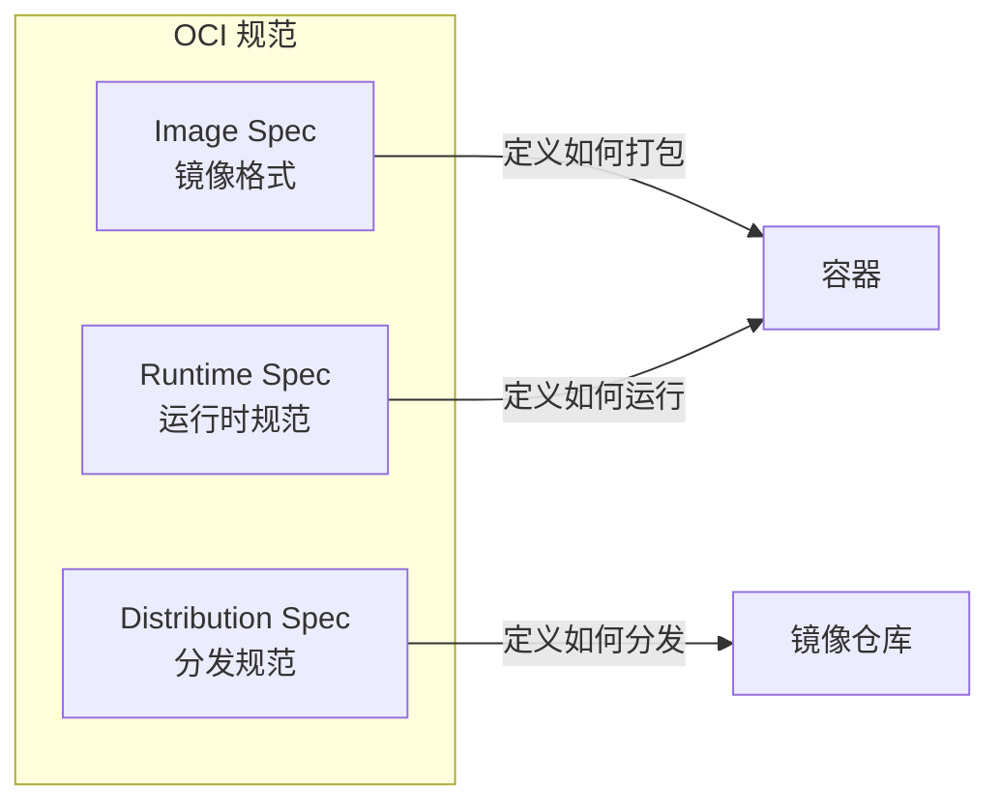
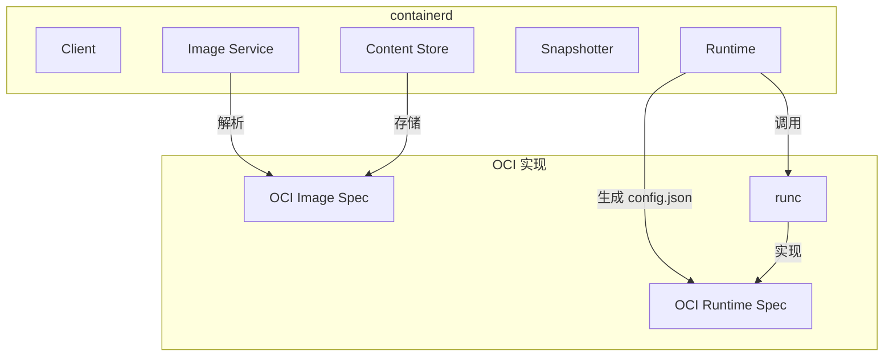
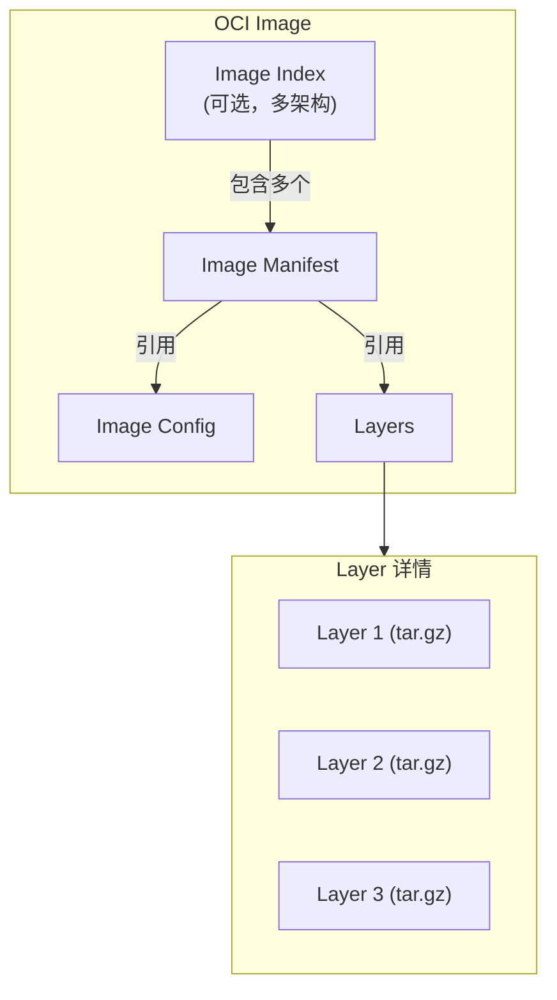
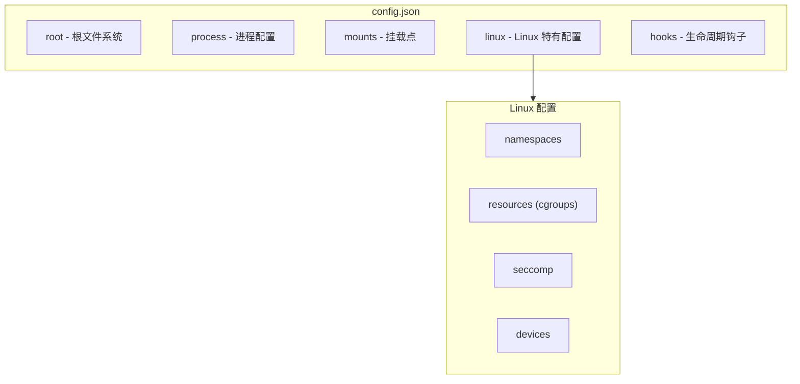
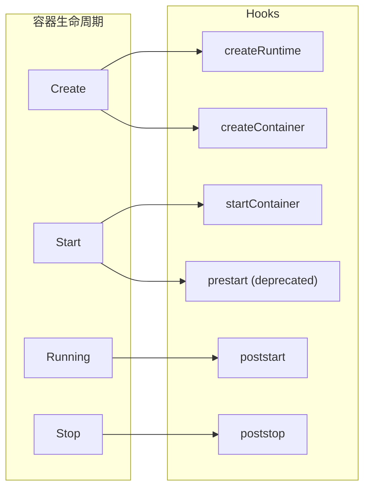
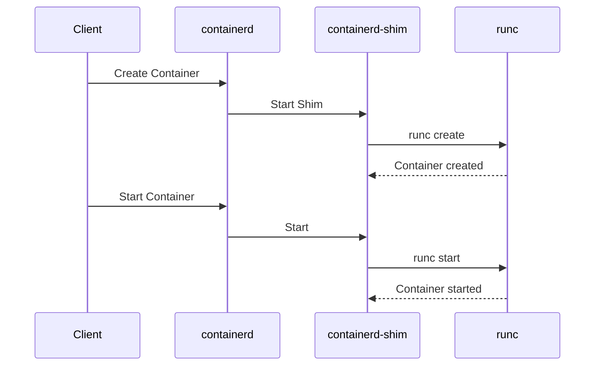
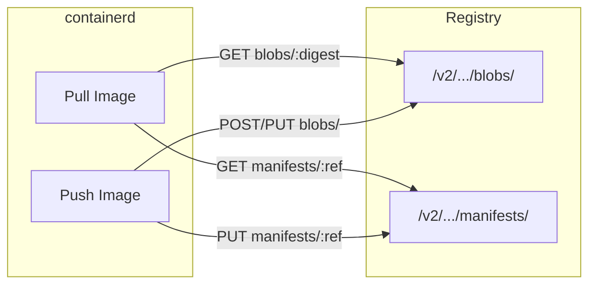
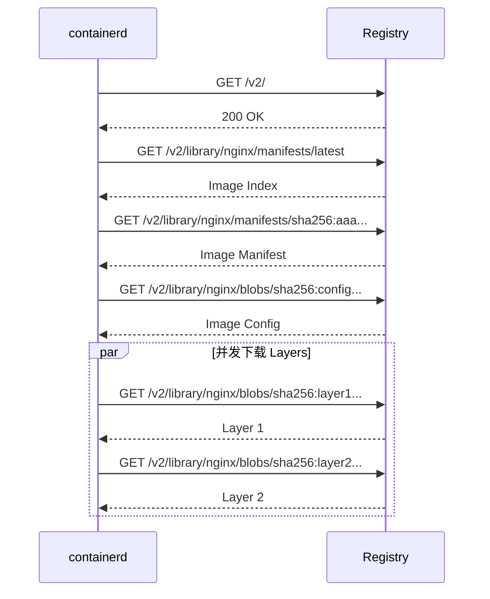

OCI（Open Container Initiative）是一个开放的行业标准组织，旨在定义容器镜像格式和运行时规范。理解 OCI 规范对于深入学习 containerd 至关重要。

## OCI 概述

### 什么是 OCI

OCI 于 2015 年由 Docker、CoreOS 等公司联合成立，目标是创建容器技术的开放标准。OCI 定义了三个核心规范：



| 规范 | 说明 | 仓库 |
|------|------|------|
| Image Spec | 定义容器镜像格式 | [opencontainers/image-spec](https://github.com/opencontainers/image-spec) |
| Runtime Spec | 定义容器运行时行为 | [opencontainers/runtime-spec](https://github.com/opencontainers/runtime-spec) |
| Distribution Spec | 定义镜像分发协议 | [opencontainers/distribution-spec](https://github.com/opencontainers/distribution-spec) |

### OCI 与 containerd 的关系



## OCI Image Specification

### 镜像结构概览

OCI 镜像由以下组件构成：



### Descriptor - 内容描述符

Descriptor 是 OCI 规范中的核心概念，用于描述任何内容：

```json
{
  "mediaType": "application/vnd.oci.image.manifest.v1+json",
  "digest": "sha256:7a5c7e1e...",
  "size": 1234,
  "annotations": {
    "org.opencontainers.image.created": "2024-01-30T10:00:00Z"
  }
}
```

| 字段 | 说明 |
|------|------|
| `mediaType` | 内容的 MIME 类型 |
| `digest` | 内容的 SHA256 摘要 |
| `size` | 内容大小（字节）|
| `annotations` | 可选的元数据标注 |

**常见 MediaType**：

| MediaType | 说明 |
|-----------|------|
| `application/vnd.oci.image.index.v1+json` | Image Index |
| `application/vnd.oci.image.manifest.v1+json` | Image Manifest |
| `application/vnd.oci.image.config.v1+json` | Image Config |
| `application/vnd.oci.image.layer.v1.tar+gzip` | Layer (gzip 压缩) |
| `application/vnd.oci.image.layer.v1.tar+zstd` | Layer (zstd 压缩) |

### Image Index - 多架构支持

Image Index（也称为 Manifest List）用于支持多架构镜像：

```json
{
  "schemaVersion": 2,
  "mediaType": "application/vnd.oci.image.index.v1+json",
  "manifests": [
    {
      "mediaType": "application/vnd.oci.image.manifest.v1+json",
      "digest": "sha256:aaa...",
      "size": 1234,
      "platform": {
        "architecture": "amd64",
        "os": "linux"
      }
    },
    {
      "mediaType": "application/vnd.oci.image.manifest.v1+json",
      "digest": "sha256:bbb...",
      "size": 1234,
      "platform": {
        "architecture": "arm64",
        "os": "linux"
      }
    }
  ]
}
```

### Image Manifest - 镜像清单

Manifest 描述单个平台的镜像：

```json
{
  "schemaVersion": 2,
  "mediaType": "application/vnd.oci.image.manifest.v1+json",
  "config": {
    "mediaType": "application/vnd.oci.image.config.v1+json",
    "digest": "sha256:config...",
    "size": 2048
  },
  "layers": [
    {
      "mediaType": "application/vnd.oci.image.layer.v1.tar+gzip",
      "digest": "sha256:layer1...",
      "size": 10485760
    },
    {
      "mediaType": "application/vnd.oci.image.layer.v1.tar+gzip",
      "digest": "sha256:layer2...",
      "size": 5242880
    }
  ],
  "annotations": {
    "org.opencontainers.image.created": "2024-01-30T10:00:00Z"
  }
}
```

### Image Config - 镜像配置

Config 包含运行容器所需的配置信息：

```json
{
  "architecture": "amd64",
  "os": "linux",
  "config": {
    "User": "app",
    "Env": [
      "PATH=/usr/local/sbin:/usr/local/bin:/usr/sbin:/usr/bin:/sbin:/bin",
      "APP_ENV=production"
    ],
    "Entrypoint": ["/app/server"],
    "Cmd": ["--config", "/etc/app/config.yaml"],
    "WorkingDir": "/app",
    "ExposedPorts": {
      "8080/tcp": {}
    },
    "Labels": {
      "maintainer": "team@example.com"
    }
  },
  "rootfs": {
    "type": "layers",
    "diff_ids": [
      "sha256:uncompressed_layer1...",
      "sha256:uncompressed_layer2..."
    ]
  },
  "history": [
    {
      "created": "2024-01-29T10:00:00Z",
      "created_by": "/bin/sh -c #(nop) ADD file:... in /"
    },
    {
      "created": "2024-01-30T10:00:00Z",
      "created_by": "/bin/sh -c apt-get update && apt-get install -y ..."
    }
  ]
}
```

**关键字段说明**：

| 字段 | 说明 |
|------|------|
| `config.User` | 运行用户 |
| `config.Env` | 环境变量 |
| `config.Entrypoint` | 入口点命令 |
| `config.Cmd` | 默认参数 |
| `config.WorkingDir` | 工作目录 |
| `rootfs.diff_ids` | 各层**未压缩**内容的 digest |
| `history` | 构建历史 |

### Layer - 文件系统层

Layer 是 tar 归档文件（通常经过压缩）：

```bash
# 查看 layer 内容
tar -tzf layer.tar.gz
# usr/
# usr/bin/
# usr/bin/app
# etc/
# etc/app/
# etc/app/config.yaml
```

**特殊文件**：

- **Whiteout 文件**：`.wh.<filename>` 表示删除文件
- **Opaque Whiteout**：`.wh..wh..opq` 表示删除目录下所有内容

## OCI Runtime Specification

### config.json 结构

Runtime Spec 定义了运行容器所需的配置文件 `config.json`：



### 完整 config.json 示例

```json
{
  "ociVersion": "1.0.2",
  "root": {
    "path": "rootfs",
    "readonly": false
  },
  "process": {
    "terminal": false,
    "user": {
      "uid": 1000,
      "gid": 1000,
      "additionalGids": [100, 200]
    },
    "args": ["/app/server", "--config", "/etc/app/config.yaml"],
    "env": [
      "PATH=/usr/local/sbin:/usr/local/bin:/usr/sbin:/usr/bin:/sbin:/bin",
      "APP_ENV=production"
    ],
    "cwd": "/app",
    "capabilities": {
      "bounding": ["CAP_NET_BIND_SERVICE"],
      "effective": ["CAP_NET_BIND_SERVICE"],
      "inheritable": [],
      "permitted": ["CAP_NET_BIND_SERVICE"],
      "ambient": []
    },
    "rlimits": [
      {
        "type": "RLIMIT_NOFILE",
        "hard": 1024,
        "soft": 1024
      }
    ],
    "noNewPrivileges": true
  },
  "mounts": [
    {
      "destination": "/proc",
      "type": "proc",
      "source": "proc"
    },
    {
      "destination": "/dev",
      "type": "tmpfs",
      "source": "tmpfs",
      "options": ["nosuid", "strictatime", "mode=755", "size=65536k"]
    },
    {
      "destination": "/sys",
      "type": "sysfs",
      "source": "sysfs",
      "options": ["nosuid", "noexec", "nodev", "ro"]
    },
    {
      "destination": "/data",
      "type": "bind",
      "source": "/host/data",
      "options": ["rbind", "rw"]
    }
  ],
  "linux": {
    "namespaces": [
      {"type": "pid"},
      {"type": "network"},
      {"type": "ipc"},
      {"type": "uts"},
      {"type": "mount"},
      {"type": "cgroup"}
    ],
    "resources": {
      "memory": {
        "limit": 536870912,
        "reservation": 268435456,
        "swap": 536870912
      },
      "cpu": {
        "shares": 1024,
        "quota": 50000,
        "period": 100000,
        "cpus": "0-3"
      },
      "pids": {
        "limit": 100
      }
    },
    "cgroupsPath": "/docker/container-1",
    "devices": [
      {
        "path": "/dev/null",
        "type": "c",
        "major": 1,
        "minor": 3,
        "fileMode": 438,
        "uid": 0,
        "gid": 0
      }
    ],
    "seccomp": {
      "defaultAction": "SCMP_ACT_ERRNO",
      "architectures": ["SCMP_ARCH_X86_64"],
      "syscalls": [
        {
          "names": ["read", "write", "open", "close", "mmap", "mprotect"],
          "action": "SCMP_ACT_ALLOW"
        }
      ]
    },
    "maskedPaths": [
      "/proc/kcore",
      "/proc/latency_stats",
      "/proc/timer_list"
    ],
    "readonlyPaths": [
      "/proc/asound",
      "/proc/bus",
      "/proc/fs"
    ]
  },
  "hooks": {
    "prestart": [
      {
        "path": "/usr/bin/setup-network",
        "args": ["setup-network", "eth0"],
        "env": ["NETWORK_TYPE=bridge"]
      }
    ],
    "poststart": [],
    "poststop": []
  }
}
```

### 核心字段详解

#### root - 根文件系统

```json
{
  "root": {
    "path": "rootfs",      // 相对于 bundle 目录的路径
    "readonly": false       // 是否只读
  }
}
```

#### process - 进程配置

```json
{
  "process": {
    "terminal": false,           // 是否分配 TTY
    "user": {
      "uid": 1000,               // 用户 ID
      "gid": 1000,               // 组 ID
      "additionalGids": [100]    // 附加组
    },
    "args": ["command", "arg1"], // 启动命令
    "env": ["KEY=value"],        // 环境变量
    "cwd": "/app",               // 工作目录
    "capabilities": {...},       // Linux capabilities
    "rlimits": [...],            // 资源限制
    "noNewPrivileges": true      // 禁止提权
  }
}
```

#### linux.namespaces - 命名空间

```json
{
  "linux": {
    "namespaces": [
      {"type": "pid"},                              // 新建 PID Namespace
      {"type": "network", "path": "/proc/1/ns/net"}, // 加入已有的 Network Namespace
      {"type": "ipc"},
      {"type": "uts"},
      {"type": "mount"},
      {"type": "user"},
      {"type": "cgroup"}
    ]
  }
}
```

- 不指定 `path`：创建新的 Namespace
- 指定 `path`：加入已存在的 Namespace

#### linux.resources - 资源限制

```json
{
  "linux": {
    "resources": {
      "memory": {
        "limit": 536870912,        // 内存硬限制 (512MB)
        "reservation": 268435456,  // 内存软限制 (256MB)
        "swap": 536870912,         // swap 限制
        "kernel": 67108864,        // 内核内存限制
        "disableOOMKiller": false  // 是否禁用 OOM Killer
      },
      "cpu": {
        "shares": 1024,            // CPU 权重
        "quota": 50000,            // CPU 配额 (50ms)
        "period": 100000,          // 周期 (100ms)
        "cpus": "0-3",             // 可用 CPU
        "mems": "0"                // 可用内存节点
      },
      "pids": {
        "limit": 100               // 最大进程数
      },
      "blockIO": {
        "weight": 500,             // IO 权重
        "throttleReadBpsDevice": [{
          "major": 8,
          "minor": 0,
          "rate": 10485760         // 读带宽限制 10MB/s
        }]
      }
    }
  }
}
```

### Hooks - 生命周期钩子



```json
{
  "hooks": {
    "createRuntime": [{
      "path": "/usr/bin/hook",
      "args": ["hook", "create-runtime"]
    }],
    "createContainer": [{
      "path": "/usr/bin/hook",
      "args": ["hook", "create-container"]
    }],
    "startContainer": [{
      "path": "/usr/bin/hook",
      "args": ["hook", "start-container"]
    }],
    "poststart": [{
      "path": "/usr/bin/hook",
      "args": ["hook", "poststart"]
    }],
    "poststop": [{
      "path": "/usr/bin/hook",
      "args": ["hook", "poststop"]
    }]
  }
}
```

## runc - OCI Runtime 参考实现

### runc 简介

runc 是 OCI Runtime Spec 的参考实现，由 Docker 捐赠给 OCI：

```bash
# 查看 runc 版本
runc --version
# runc version 1.1.x
# spec: 1.0.2-dev

# 查看支持的命令
runc --help
```

### 使用 runc 运行容器

```bash
# 1. 准备 bundle 目录
mkdir -p mycontainer/rootfs

# 2. 准备根文件系统
docker export $(docker create busybox) | tar -C mycontainer/rootfs -xf -

# 3. 生成默认 config.json
cd mycontainer
runc spec

# 4. 运行容器
sudo runc run mycontainer

# 5. 查看容器状态
sudo runc list

# 6. 删除容器
sudo runc delete mycontainer
```

### runc 命令

| 命令 | 说明 |
|------|------|
| `runc create` | 创建容器（不启动） |
| `runc start` | 启动已创建的容器 |
| `runc run` | 创建并启动容器 |
| `runc exec` | 在容器内执行命令 |
| `runc kill` | 发送信号到容器 |
| `runc delete` | 删除容器 |
| `runc list` | 列出容器 |
| `runc state` | 查看容器状态 |
| `runc spec` | 生成默认 config.json |

### containerd 与 runc 的关系



containerd 不直接调用 runc，而是通过 Shim 进程：

1. containerd 启动 Shim 进程
2. Shim 调用 runc 创建/管理容器
3. 容器进程由 Shim 监管（而非 containerd）

## OCI Distribution Specification

### Registry API

Distribution Spec 定义了与镜像仓库交互的 HTTP API：



### 主要 API 端点

| 端点 | 方法 | 说明 |
|------|------|------|
| `/v2/` | GET | API 版本检查 |
| `/v2/<name>/manifests/<ref>` | GET | 获取 Manifest |
| `/v2/<name>/manifests/<ref>` | PUT | 上传 Manifest |
| `/v2/<name>/blobs/<digest>` | GET | 下载 Blob |
| `/v2/<name>/blobs/uploads/` | POST | 开始 Blob 上传 |
| `/v2/<name>/blobs/uploads/<uuid>` | PUT | 完成 Blob 上传 |

### Pull 流程



## containerd 中的 OCI 实现

### 代码路径

```
containerd/
├── core/images/
│   └── image.go          # 镜像模型，对应 OCI Image
├── core/content/
│   └── content.go        # 内容存储，存储 OCI blobs
├── cmd/containerd-shim-runc-v2/
│   └── runc/
│       └── container.go  # 生成 OCI Runtime config.json
└── vendor/
    └── github.com/opencontainers/
        ├── image-spec/   # OCI Image Spec Go 类型
        └── runtime-spec/ # OCI Runtime Spec Go 类型
```

### 关键类型映射

| OCI 概念 | containerd 类型 | 文件路径 |
|----------|-----------------|----------|
| Image Manifest | `ocispec.Manifest` | `vendor/github.com/opencontainers/image-spec/specs-go/v1/` |
| Image Config | `ocispec.Image` | 同上 |
| Runtime Config | `specs.Spec` | `vendor/github.com/opencontainers/runtime-spec/specs-go/` |
| Descriptor | `ocispec.Descriptor` | 同上 |

## 小结

OCI 规范是容器技术的基石：

1. **Image Spec**：定义镜像格式（Index、Manifest、Config、Layers）
2. **Runtime Spec**：定义运行时配置（config.json）
3. **Distribution Spec**：定义镜像分发协议（Registry API）

理解 OCI 规范有助于：
- 理解 containerd 如何管理镜像
- 理解容器如何被创建和运行
- 与其他 OCI 兼容工具互操作

下一节我们将学习 [gRPC 与 Protobuf](./05-grpc-protobuf.md)，它是 containerd 服务通信的基础。

## 参考资料

- [OCI Image Spec](https://github.com/opencontainers/image-spec/blob/main/spec.md)
- [OCI Runtime Spec](https://github.com/opencontainers/runtime-spec/blob/main/spec.md)
- [OCI Distribution Spec](https://github.com/opencontainers/distribution-spec/blob/main/spec.md)
- [runc](https://github.com/opencontainers/runc)
