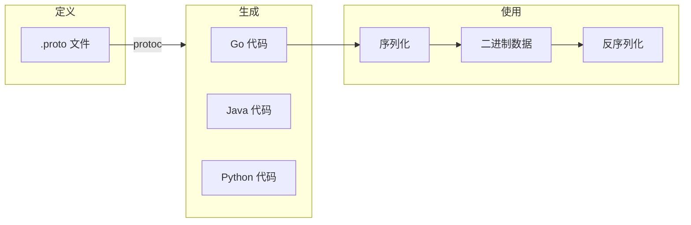
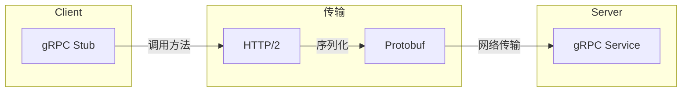
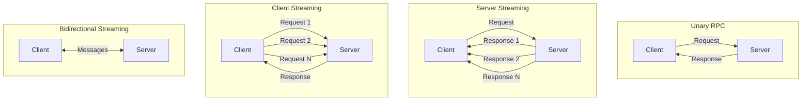
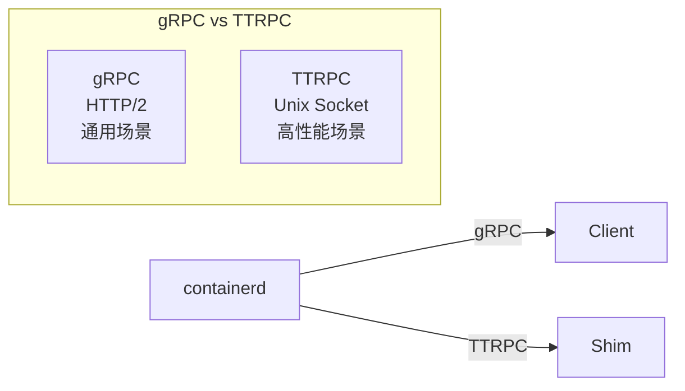
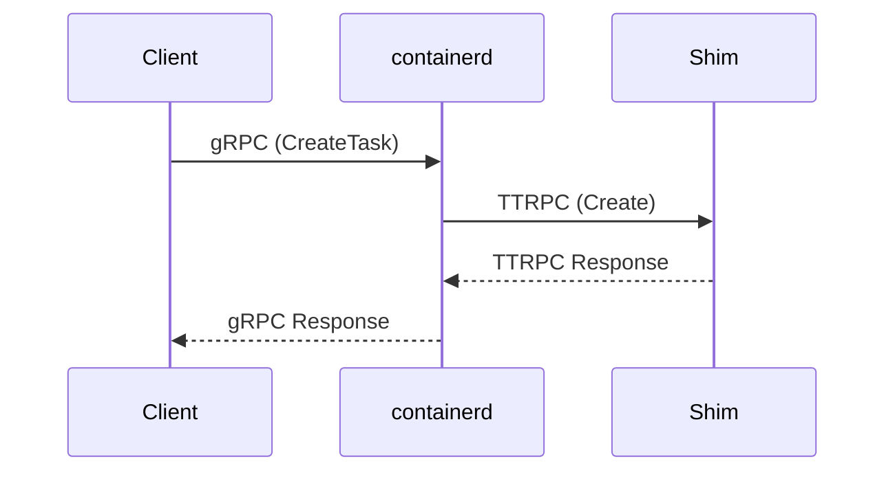

gRPC 和 Protocol Buffers (Protobuf) 是 containerd 服务通信的基础。理解它们对于阅读 containerd 源码和扩展 containerd 功能至关重要。

## Protocol Buffers 基础

### 什么是 Protobuf

Protocol Buffers（简称 Protobuf）是 Google 开发的一种语言无关、平台无关的数据序列化格式：



**优势**：

- 体积小：比 JSON/XML 更紧凑
- 解析快：二进制格式，无需文本解析
- 强类型：编译时类型检查
- 跨语言：自动生成多种语言的代码

### 消息定义

```protobuf
// 文件: api/types/task/task.proto
syntax = "proto3";

package containerd.types;

import "google/protobuf/timestamp.proto";
import "google/protobuf/any.proto";

// 进程信息
message ProcessInfo {
    // 进程 ID
    uint32 pid = 1;

    // 进程状态
    Status status = 2;

    // 标准输入路径
    string stdin = 3;

    // 标准输出路径
    string stdout = 4;

    // 标准错误路径
    string stderr = 5;

    // 是否分配终端
    bool terminal = 6;

    // 退出状态码
    uint32 exit_status = 7;

    // 退出时间
    google.protobuf.Timestamp exited_at = 8;
}

// 进程状态枚举
enum Status {
    UNKNOWN = 0;
    CREATED = 1;
    RUNNING = 2;
    STOPPED = 3;
    PAUSED = 4;
    PAUSING = 5;
}
```

### 字段类型

| 类型 | 说明 | Go 类型 |
|------|------|---------|
| `double` | 双精度浮点 | `float64` |
| `float` | 单精度浮点 | `float32` |
| `int32` | 变长编码整数 | `int32` |
| `int64` | 变长编码整数 | `int64` |
| `uint32` | 变长编码无符号整数 | `uint32` |
| `uint64` | 变长编码无符号整数 | `uint64` |
| `bool` | 布尔值 | `bool` |
| `string` | UTF-8 字符串 | `string` |
| `bytes` | 字节数组 | `[]byte` |

### 复合类型

```protobuf
// 嵌套消息
message Container {
    string id = 1;
    map<string, string> labels = 2;        // 映射类型
    repeated Mount mounts = 3;              // 数组类型
    google.protobuf.Any spec = 4;           // 任意类型
}

message Mount {
    string type = 1;
    string source = 2;
    string target = 3;
    repeated string options = 4;
}
```

### 字段编号规则

- 1-15：使用 1 字节编码，用于高频字段
- 16-2047：使用 2 字节编码
- 不能使用 19000-19999（保留）
- 删除字段后应标记为 `reserved`

```protobuf
message Example {
    reserved 2, 15, 9 to 11;
    reserved "foo", "bar";

    string name = 1;
    // 字段 2 已废弃，不要使用
    int32 id = 3;
}
```

### 生成 Go 代码

```bash
# 安装 protoc 编译器
# macOS
brew install protobuf

# Linux
apt-get install -y protobuf-compiler

# 安装 Go 插件
go install google.golang.org/protobuf/cmd/protoc-gen-go@latest
go install google.golang.org/grpc/cmd/protoc-gen-go-grpc@latest

# 生成代码
protoc --go_out=. --go-grpc_out=. api/types/task/task.proto
```

生成的 Go 代码：

```go
// 生成的结构体
type ProcessInfo struct {
    Pid        uint32               `protobuf:"varint,1,opt,name=pid,proto3"`
    Status     Status               `protobuf:"varint,2,opt,name=status,proto3,enum=containerd.types.Status"`
    Stdin      string               `protobuf:"bytes,3,opt,name=stdin,proto3"`
    Stdout     string               `protobuf:"bytes,4,opt,name=stdout,proto3"`
    Stderr     string               `protobuf:"bytes,5,opt,name=stderr,proto3"`
    Terminal   bool                 `protobuf:"varint,6,opt,name=terminal,proto3"`
    ExitStatus uint32               `protobuf:"varint,7,opt,name=exit_status,json=exitStatus,proto3"`
    ExitedAt   *timestamppb.Timestamp `protobuf:"bytes,8,opt,name=exited_at,json=exitedAt,proto3"`
}

// 序列化
data, err := proto.Marshal(info)

// 反序列化
var info ProcessInfo
err := proto.Unmarshal(data, &info)
```

## gRPC 基础

### 什么是 gRPC

gRPC 是 Google 开发的高性能 RPC 框架：



**特性**：

- 基于 HTTP/2：多路复用、头部压缩、流式传输
- 使用 Protobuf：高效序列化
- 双向流：支持客户端/服务端/双向流式 RPC
- 代码生成：自动生成客户端和服务端代码

### 服务定义

```protobuf
// 文件: api/services/tasks/v1/tasks.proto
syntax = "proto3";

package containerd.services.tasks.v1;

import "google/protobuf/empty.proto";
import "google/protobuf/any.proto";

// Tasks 服务定义
service Tasks {
    // 创建任务
    rpc Create(CreateTaskRequest) returns (CreateTaskResponse);

    // 启动任务
    rpc Start(StartRequest) returns (StartResponse);

    // 删除任务
    rpc Delete(DeleteTaskRequest) returns (DeleteResponse);

    // 获取任务状态
    rpc Get(GetRequest) returns (GetResponse);

    // 列出所有任务
    rpc List(ListTasksRequest) returns (ListTasksResponse);

    // 杀死任务
    rpc Kill(KillRequest) returns (google.protobuf.Empty);

    // 在任务中执行命令
    rpc Exec(ExecProcessRequest) returns (google.protobuf.Empty);

    // 等待任务退出
    rpc Wait(WaitRequest) returns (WaitResponse);
}

message CreateTaskRequest {
    string container_id = 1;
    repeated containerd.types.Mount rootfs = 3;
    string stdin = 4;
    string stdout = 5;
    string stderr = 6;
    bool terminal = 7;
    containerd.types.Mount checkpoint = 8;
    google.protobuf.Any options = 9;
    string runtime_path = 10;
}

message CreateTaskResponse {
    string container_id = 1;
    uint32 pid = 2;
}
```

### 四种 RPC 模式



```protobuf
service Example {
    // Unary RPC - 一请求一响应
    rpc GetInfo(GetRequest) returns (GetResponse);

    // Server Streaming - 一请求多响应
    rpc Subscribe(SubscribeRequest) returns (stream Event);

    // Client Streaming - 多请求一响应
    rpc Upload(stream DataChunk) returns (UploadResponse);

    // Bidirectional Streaming - 双向流
    rpc Chat(stream Message) returns (stream Message);
}
```

### gRPC 服务实现（Go）

```go
// 服务接口（由 protoc 生成）
type TasksServer interface {
    Create(context.Context, *CreateTaskRequest) (*CreateTaskResponse, error)
    Start(context.Context, *StartRequest) (*StartResponse, error)
    Delete(context.Context, *DeleteTaskRequest) (*DeleteResponse, error)
    // ...
}

// 服务实现
type tasksService struct {
    UnimplementedTasksServer  // 嵌入未实现的服务
    runtime PlatformRuntime
}

func (s *tasksService) Create(ctx context.Context, req *CreateTaskRequest) (*CreateTaskResponse, error) {
    // 实现创建任务逻辑
    task, err := s.runtime.Create(ctx, req.ContainerId, opts)
    if err != nil {
        return nil, err
    }
    return &CreateTaskResponse{
        ContainerId: req.ContainerId,
        Pid:         task.Pid(),
    }, nil
}

// 注册服务
func RegisterTasksServer(s *grpc.Server, srv TasksServer) {
    s.RegisterService(&_Tasks_serviceDesc, srv)
}
```

### gRPC 客户端使用

```go
// 创建连接
conn, err := grpc.Dial("unix:///run/containerd/containerd.sock",
    grpc.WithTransportCredentials(insecure.NewCredentials()),
)
if err != nil {
    log.Fatal(err)
}
defer conn.Close()

// 创建客户端
client := tasksv1.NewTasksClient(conn)

// 调用服务
resp, err := client.Create(context.Background(), &tasksv1.CreateTaskRequest{
    ContainerId: "my-container",
    // ...
})
if err != nil {
    log.Fatal(err)
}
fmt.Printf("Created task with PID: %d\n", resp.Pid)
```

## TTRPC - 轻量级 RPC

### 什么是 TTRPC

TTRPC 是 containerd 开发的轻量级 RPC 协议，专为高性能场景设计：



**TTRPC vs gRPC**：

| 特性 | gRPC | TTRPC |
|------|------|-------|
| 传输层 | HTTP/2 | 原生 TCP/Unix Socket |
| 协议开销 | 较大 | 极小 |
| 使用场景 | 通用 | 本地高性能通信 |
| 流式支持 | 完整 | 有限 |
| 内存占用 | 较大 | 极小 |

### TTRPC 使用场景

在 containerd 中：

- **containerd ↔ Client**：使用 gRPC（通用性）
- **containerd ↔ Shim**：使用 TTRPC（高性能）



### TTRPC 示例

```go
// 服务端
server, err := ttrpc.NewServer()
if err != nil {
    log.Fatal(err)
}

// 注册服务
tasksapi.RegisterTasksService(server, &taskService{})

// 监听 Unix Socket
listener, err := net.Listen("unix", "/run/containerd/shim.sock")
if err != nil {
    log.Fatal(err)
}

// 启动服务
server.Serve(ctx, listener)

// 客户端
conn, err := net.Dial("unix", "/run/containerd/shim.sock")
if err != nil {
    log.Fatal(err)
}

client := ttrpc.NewClient(conn)
tasksClient := tasksapi.NewTasksClient(client)

// 调用
resp, err := tasksClient.Create(ctx, &tasksapi.CreateTaskRequest{...})
```

## containerd API 结构

### API 目录组织

```
api/
├── events/                    # 事件类型定义
│   ├── container.proto
│   ├── image.proto
│   └── task.proto
├── services/                  # 服务定义
│   ├── containers/
│   │   └── v1/
│   │       └── containers.proto
│   ├── content/
│   │   └── v1/
│   │       └── content.proto
│   ├── images/
│   │   └── v1/
│   │       └── images.proto
│   ├── tasks/
│   │   └── v1/
│   │       └── tasks.proto
│   └── snapshots/
│       └── v1/
│           └── snapshots.proto
└── types/                     # 公共类型
    ├── descriptor.proto
    ├── metrics.proto
    ├── mount.proto
    └── task/
        └── task.proto
```

### 主要服务

| 服务 | 说明 | Proto 文件 |
|------|------|------------|
| Containers | 容器元数据管理 | `api/services/containers/v1/containers.proto` |
| Content | 内容存储 | `api/services/content/v1/content.proto` |
| Images | 镜像管理 | `api/services/images/v1/images.proto` |
| Tasks | 任务执行 | `api/services/tasks/v1/tasks.proto` |
| Snapshots | 快照管理 | `api/services/snapshots/v1/snapshots.proto` |
| Events | 事件订阅 | `api/services/events/v1/events.proto` |
| Leases | 租约管理 | `api/services/leases/v1/leases.proto` |
| Namespaces | 命名空间 | `api/services/namespaces/v1/namespaces.proto` |
| Version | 版本信息 | `api/services/version/v1/version.proto` |

### 示例：Images 服务

```protobuf
// api/services/images/v1/images.proto
service Images {
    rpc Get(GetImageRequest) returns (GetImageResponse);
    rpc List(ListImagesRequest) returns (ListImagesResponse);
    rpc Create(CreateImageRequest) returns (CreateImageResponse);
    rpc Update(UpdateImageRequest) returns (UpdateImageResponse);
    rpc Delete(DeleteImageRequest) returns (google.protobuf.Empty);
}

message Image {
    string name = 1;
    map<string, string> labels = 2;
    containerd.types.Descriptor target = 3;
    google.protobuf.Timestamp created_at = 7;
    google.protobuf.Timestamp updated_at = 8;
}
```

### 使用 containerd 客户端

```go
import (
    "github.com/containerd/containerd/v2"
    "github.com/containerd/containerd/v2/namespaces"
)

// 创建客户端
client, err := containerd.New("/run/containerd/containerd.sock")
if err != nil {
    log.Fatal(err)
}
defer client.Close()

// 设置命名空间
ctx := namespaces.WithNamespace(context.Background(), "default")

// 拉取镜像
image, err := client.Pull(ctx, "docker.io/library/nginx:latest",
    containerd.WithPullUnpack,
)
if err != nil {
    log.Fatal(err)
}

// 创建容器
container, err := client.NewContainer(ctx, "my-nginx",
    containerd.WithImage(image),
    containerd.WithNewSnapshot("my-nginx-snapshot", image),
    containerd.WithNewSpec(oci.WithImageConfig(image)),
)
if err != nil {
    log.Fatal(err)
}

// 创建任务
task, err := container.NewTask(ctx, cio.NewCreator(cio.WithStdio))
if err != nil {
    log.Fatal(err)
}

// 启动任务
err = task.Start(ctx)
```

## 代码生成流程

### containerd 的代码生成

containerd 使用 `make protos` 生成 Protobuf 代码：

```bash
# 生成所有 proto 代码
make protos

# 检查 proto 文件是否需要更新
make check-protos
```

### buf 工具

containerd 使用 [buf](https://buf.build/) 管理 Protobuf：

```yaml
# api/buf.yaml
version: v1
deps:
  - buf.build/googleapis/googleapis
  - buf.build/protocolbuffers/wellknowntypes
```

```yaml
# api/buf.gen.yaml
version: v1
plugins:
  - plugin: go
    out: .
    opt:
      - paths=source_relative
  - plugin: go-grpc
    out: .
    opt:
      - paths=source_relative
  - plugin: go-ttrpc
    out: .
    opt:
      - paths=source_relative
```

## 调试 gRPC

### 使用 grpcurl

```bash
# 安装 grpcurl
go install github.com/fullstorydev/grpcurl/cmd/grpcurl@latest

# 列出服务
grpcurl -plaintext unix:///run/containerd/containerd.sock list

# 描述服务
grpcurl -plaintext unix:///run/containerd/containerd.sock \
    describe containerd.services.images.v1.Images

# 调用服务
grpcurl -plaintext \
    -d '{"name":"docker.io/library/nginx:latest"}' \
    unix:///run/containerd/containerd.sock \
    containerd.services.images.v1.Images/Get
```

### 使用 grpc_cli

```bash
# 列出服务
grpc_cli ls unix:///run/containerd/containerd.sock

# 调用方法
grpc_cli call unix:///run/containerd/containerd.sock \
    containerd.services.version.v1.Version.Version ""
```

### 启用 gRPC 日志

```go
import "google.golang.org/grpc/grpclog"

// 设置日志级别
grpclog.SetLoggerV2(grpclog.NewLoggerV2WithVerbosity(
    os.Stderr, os.Stderr, os.Stderr, 2,
))
```

## 小结

gRPC 和 Protobuf 是 containerd 通信的基础：

1. **Protobuf**：高效的数据序列化格式
2. **gRPC**：基于 HTTP/2 的 RPC 框架
3. **TTRPC**：轻量级 RPC，用于 containerd 与 Shim 通信
4. **API 组织**：服务定义在 `api/services/`，类型在 `api/types/`

理解这些技术有助于：
- 阅读 containerd 源码
- 开发 containerd 插件
- 与 containerd API 交互

至此，前置知识部分完成。下一章我们将开始学习 [containerd 整体架构](../02-architecture/01-overall-architecture.md)。

## 参考资料

- [Protocol Buffers Documentation](https://developers.google.com/protocol-buffers)
- [gRPC Documentation](https://grpc.io/docs/)
- [containerd/ttrpc](https://github.com/containerd/ttrpc)
- [buf Documentation](https://docs.buf.build/)
