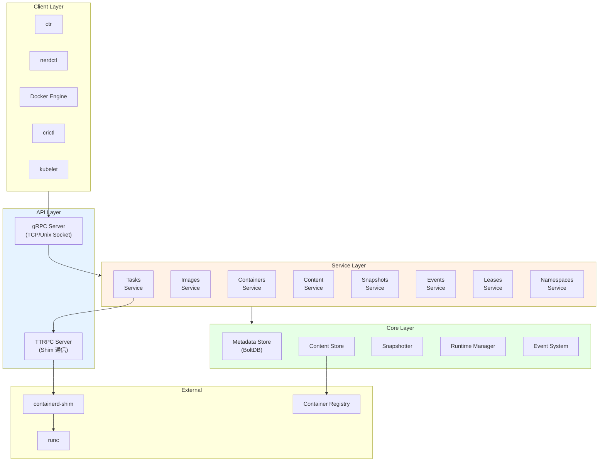
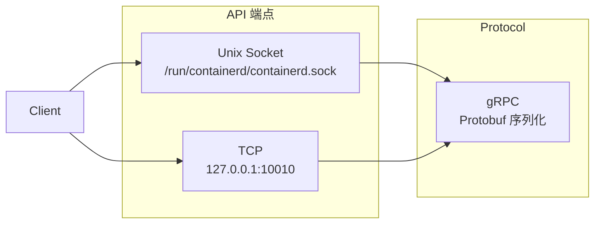
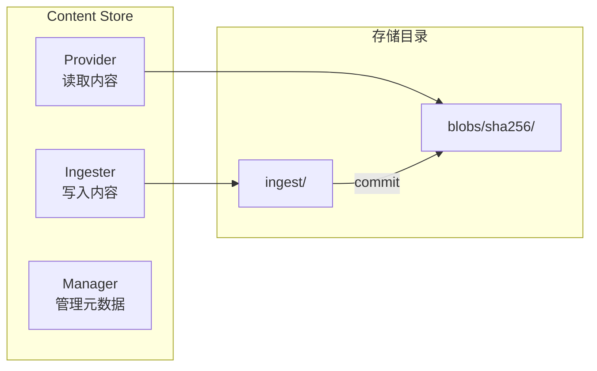
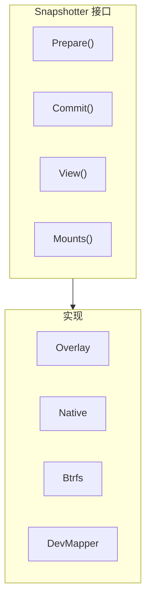
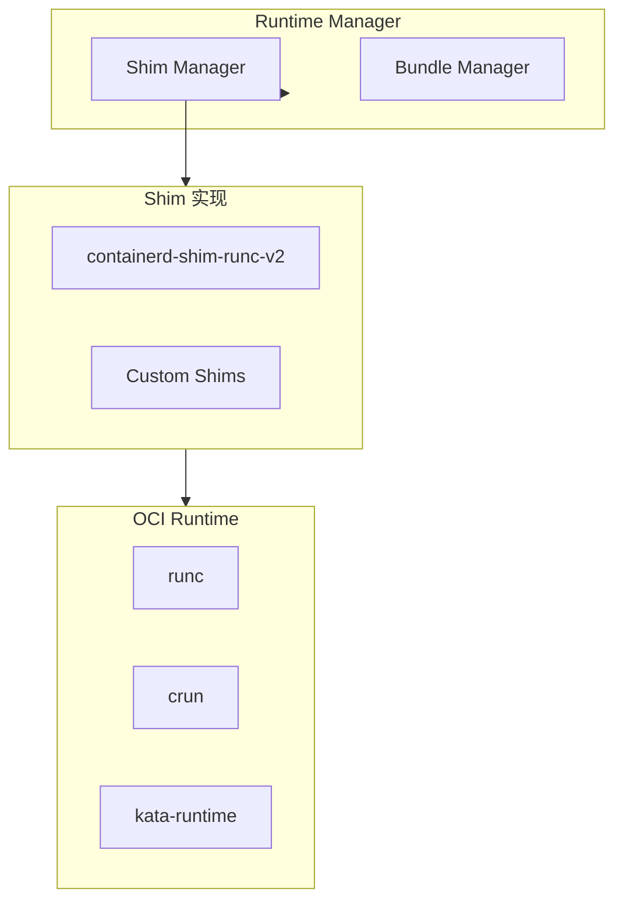
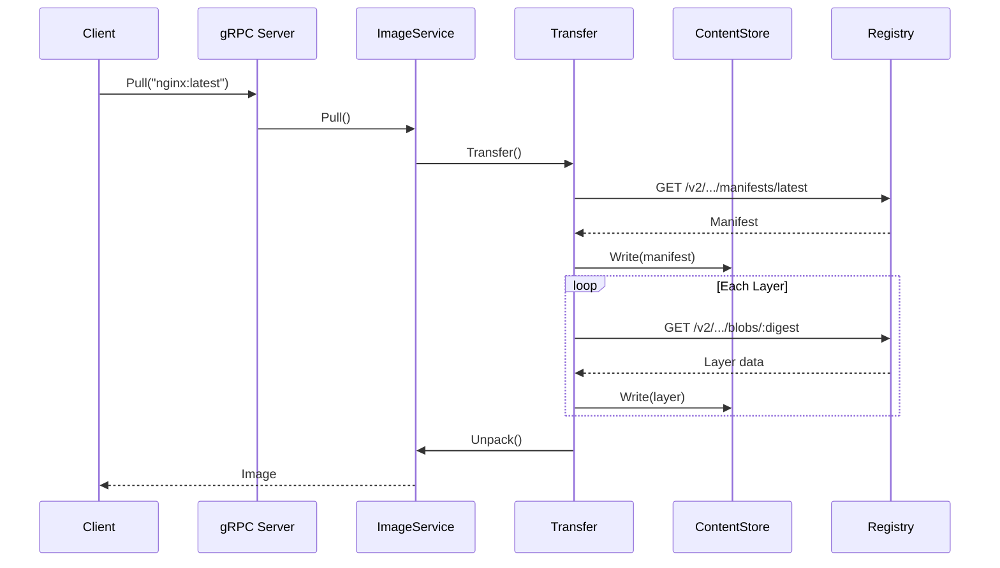
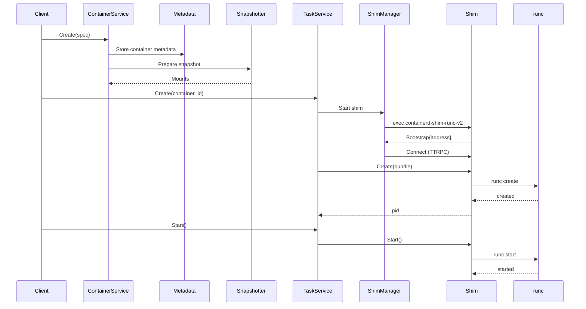

本章深入解析 containerd 的整体架构设计，帮助你理解各组件之间的关系和数据流向。

## 设计哲学

containerd 的设计遵循以下核心原则：

### 简单性 (Simplicity)

- 专注于容器运行时核心功能
- 不包含构建、编排等高级功能
- API 设计简洁明了

### 健壮性 (Robustness)

- 容器进程与 containerd 解耦
- containerd 重启不影响运行中的容器
- 故障隔离设计

### 可移植性 (Portability)

- 支持多种操作系统（Linux, Windows, FreeBSD）
- 支持多种 CPU 架构
- 可嵌入到各种系统中

### 可扩展性 (Extensibility)

- 插件化架构
- 可替换的组件实现
- 清晰的扩展点

## 架构概览



## 核心组件详解

### 1. API Layer - 接口层

containerd 通过 gRPC 暴露 API：



**默认端点**：
- Unix Socket: `/run/containerd/containerd.sock`
- 可选 TCP: 需要在配置中启用

**代码路径**：
- `cmd/containerd/command/main.go` - 服务启动
- `cmd/containerd/server/server.go` - gRPC 服务器初始化

### 2. Service Layer - 服务层

服务层实现具体的业务逻辑：

| 服务 | 功能 | 代码路径 |
|------|------|----------|
| Containers | 容器元数据 CRUD | `plugins/services/containers/` |
| Images | 镜像管理 | `plugins/services/images/` |
| Tasks | 容器生命周期 | `plugins/services/tasks/` |
| Content | Blob 存储 | `plugins/services/content/` |
| Snapshots | 快照管理 | `plugins/services/snapshots/` |
| Events | 事件发布/订阅 | `plugins/services/events/` |
| Leases | 资源租约 | `plugins/services/leases/` |
| Namespaces | 命名空间管理 | `plugins/services/namespaces/` |
| Diff | 文件系统差异 | `plugins/services/diff/` |
| Introspection | 内省服务 | `plugins/services/introspection/` |

### 3. Core Layer - 核心层

核心层提供底层功能实现：

#### Content Store - 内容存储



**代码路径**：`core/content/`

#### Snapshotter - 快照管理



**代码路径**：
- 接口：`core/snapshots/snapshotter.go`
- 实现：`plugins/snapshots/`

#### Metadata Store - 元数据存储

使用 BoltDB 存储元数据：

```
/var/lib/containerd/io.containerd.metadata.v1.bolt/meta.db
```

**数据结构**：
```
v1/
├── <namespace>/
│   ├── containers/
│   ├── images/
│   ├── snapshots/
│   ├── content/
│   └── leases/
```

**代码路径**：`core/metadata/`

#### Runtime Manager - 运行时管理



**代码路径**：
- 运行时接口：`core/runtime/`
- Shim 管理：`core/runtime/v2/shim_manager.go`

### 4. Plugin Layer - 插件层

containerd 采用插件化架构，几乎所有功能都通过插件实现：

```go
// 插件注册示例
func init() {
    registry.Register(&plugin.Registration{
        Type:   plugins.GRPCPlugin,
        ID:     "images",
        Requires: []plugin.Type{
            plugins.ServicePlugin,
        },
        InitFn: func(ic *plugin.InitContext) (interface{}, error) {
            // 初始化插件
            return &service{...}, nil
        },
    })
}
```

**代码路径**：`plugins/`

## 目录结构详解

```
containerd/
├── api/                    # Protobuf API 定义
│   ├── services/           # 服务定义
│   │   ├── containers/     # 容器服务
│   │   ├── images/         # 镜像服务
│   │   ├── tasks/          # 任务服务
│   │   └── ...
│   ├── types/              # 公共类型
│   └── events/             # 事件类型
│
├── client/                 # Go 客户端库
│   ├── client.go           # 客户端入口
│   ├── container.go        # 容器操作
│   ├── image.go            # 镜像操作
│   └── task.go             # 任务操作
│
├── cmd/                    # 可执行程序
│   ├── containerd/         # 主守护进程
│   │   ├── command/        # CLI 命令
│   │   ├── server/         # 服务器实现
│   │   └── builtins/       # 内置插件注册
│   ├── ctr/                # CLI 工具
│   └── containerd-shim-runc-v2/  # runc shim
│
├── core/                   # 核心接口和实现
│   ├── content/            # 内容存储
│   ├── images/             # 镜像管理
│   ├── containers/         # 容器管理
│   ├── snapshots/          # 快照管理
│   ├── runtime/            # 运行时
│   ├── metadata/           # 元数据
│   ├── events/             # 事件系统
│   ├── leases/             # 租约管理
│   ├── mount/              # 挂载管理
│   ├── transfer/           # 传输管理
│   └── unpack/             # 解包管理
│
├── plugins/                # 插件实现
│   ├── services/           # 服务插件
│   ├── snapshots/          # 快照器插件
│   ├── content/            # 内容插件
│   ├── metadata/           # 元数据插件
│   ├── gc/                 # GC 插件
│   ├── cri/                # CRI 插件
│   └── sandbox/            # Sandbox 插件
│
├── internal/               # 内部包（不导出）
│   ├── cri/                # CRI 实现
│   └── ...
│
└── pkg/                    # 公共工具包
    ├── archive/            # 归档操作
    ├── cio/                # 容器 IO
    ├── oci/                # OCI 工具
    └── ...
```

## 请求处理流程

### 拉取镜像流程



### 创建容器流程



## 数据存储结构

### 文件系统布局

```
/var/lib/containerd/
├── io.containerd.content.v1.content/
│   ├── blobs/
│   │   └── sha256/
│   │       ├── <digest1>
│   │       └── <digest2>
│   └── ingest/
│
├── io.containerd.snapshotter.v1.overlayfs/
│   ├── metadata.db
│   └── snapshots/
│       ├── 1/
│       │   ├── fs/
│       │   └── work/
│       └── 2/
│
├── io.containerd.metadata.v1.bolt/
│   └── meta.db
│
├── io.containerd.runtime.v2.task/
│   └── <namespace>/
│       └── <container_id>/
│           ├── config.json
│           ├── rootfs/
│           └── work/
│
└── io.containerd.grpc.v1.cri/
    └── sandboxes/
```

### Namespace 隔离

containerd 支持命名空间隔离：

```mermaid
flowchart TB
    subgraph containerd["containerd"]
        subgraph default["default namespace"]
            c1["container-1"]
            c2["container-2"]
        end

        subgraph k8s["k8s.io namespace"]
            p1["pod-1"]
            p2["pod-2"]
        end

        subgraph moby["moby namespace"]
            d1["docker-container-1"]
        end
    end

    note["不同 namespace 的资源完全隔离<br/>但共享 Content Store"]
```

**使用命名空间**：

```go
// Go 客户端
ctx := namespaces.WithNamespace(context.Background(), "my-namespace")

// ctr 命令
ctr -n my-namespace containers list
```

## 配置文件

### 默认配置路径

- Linux: `/etc/containerd/config.toml`
- Windows: `C:\Program Files\containerd\config.toml`

### 配置结构

```toml
version = 2

# 基础配置
root = "/var/lib/containerd"
state = "/run/containerd"

# gRPC 配置
[grpc]
  address = "/run/containerd/containerd.sock"
  uid = 0
  gid = 0
  max_recv_message_size = 16777216
  max_send_message_size = 16777216

# 调试配置
[debug]
  address = "/run/containerd/debug.sock"
  uid = 0
  gid = 0
  level = "info"

# 指标配置
[metrics]
  address = "127.0.0.1:1338"

# 插件配置
[plugins]
  # CRI 插件
  [plugins."io.containerd.grpc.v1.cri"]
    sandbox_image = "registry.k8s.io/pause:3.9"
    [plugins."io.containerd.grpc.v1.cri".containerd]
      default_runtime_name = "runc"
      [plugins."io.containerd.grpc.v1.cri".containerd.runtimes]
        [plugins."io.containerd.grpc.v1.cri".containerd.runtimes.runc]
          runtime_type = "io.containerd.runc.v2"
          [plugins."io.containerd.grpc.v1.cri".containerd.runtimes.runc.options]
            SystemdCgroup = true

  # Snapshotter 配置
  [plugins."io.containerd.snapshotter.v1.overlayfs"]
    root_path = "/var/lib/containerd/io.containerd.snapshotter.v1.overlayfs"
```

### 生成默认配置

```bash
containerd config default > /etc/containerd/config.toml
```

## 小结

containerd 架构的核心特点：

1. **分层设计**：API → Service → Core → Plugin
2. **插件化**：几乎所有功能都是插件
3. **解耦设计**：Shim 使容器独立于 containerd
4. **内容寻址**：统一的 Content Store
5. **命名空间隔离**：多租户支持

理解这些架构设计有助于：
- 阅读和理解 containerd 源码
- 开发 containerd 插件
- 排查问题和性能优化

下一节我们将深入学习 [插件系统设计](./02-plugin-system.md)。

## 参考资料

- [containerd Architecture](https://github.com/containerd/containerd/blob/main/docs/historical/design/architecture.md)
- [containerd Configuration](https://github.com/containerd/containerd/blob/main/docs/man/containerd-config.8.md)
