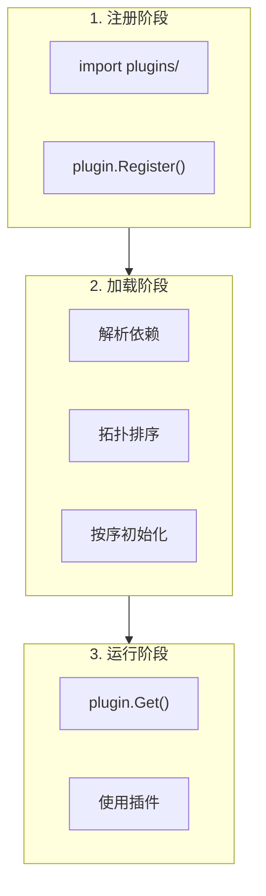
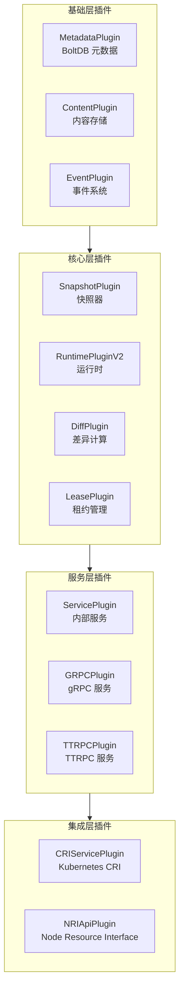
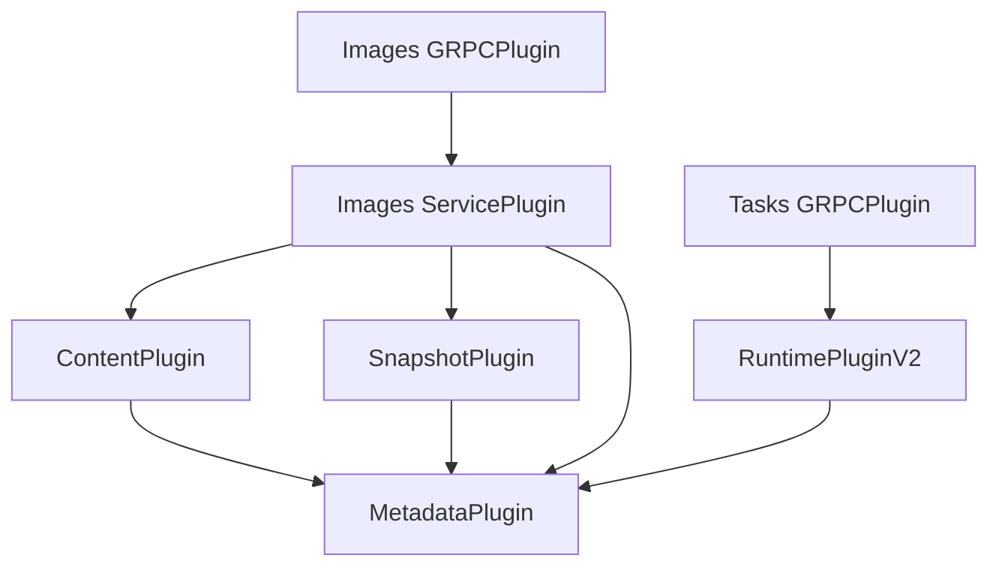
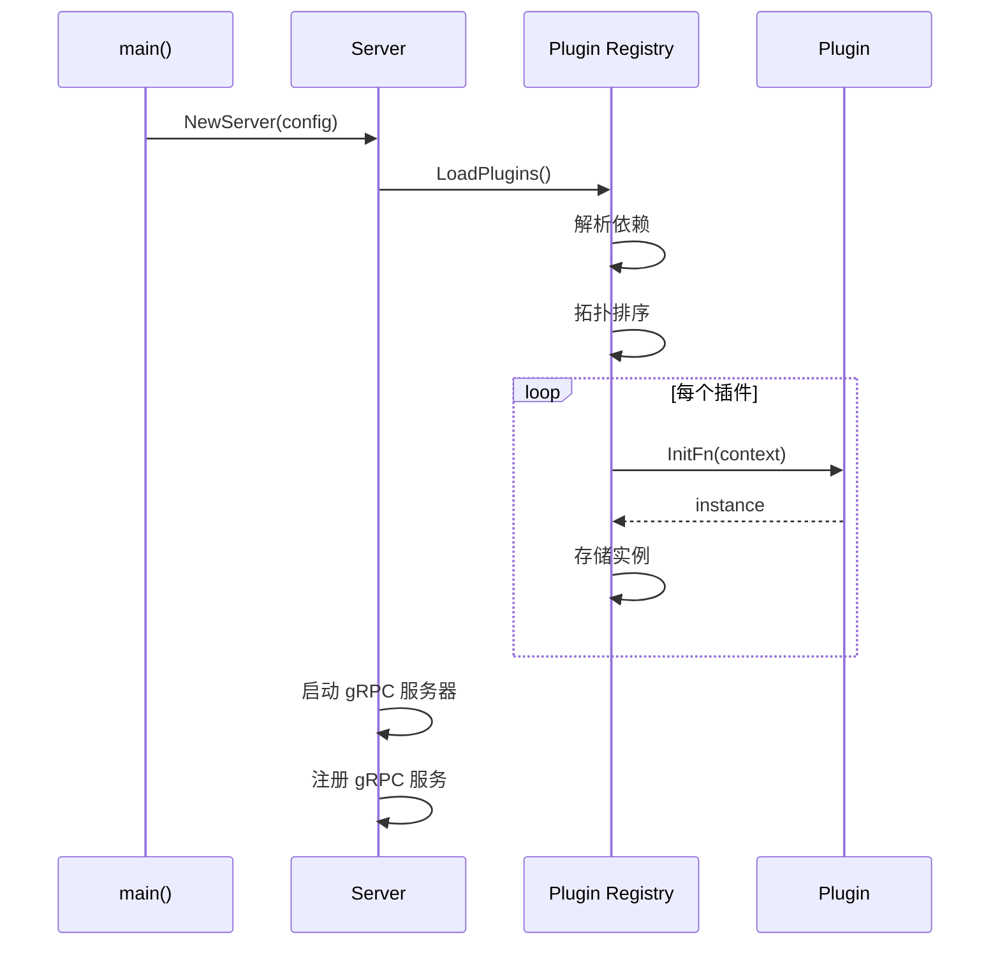
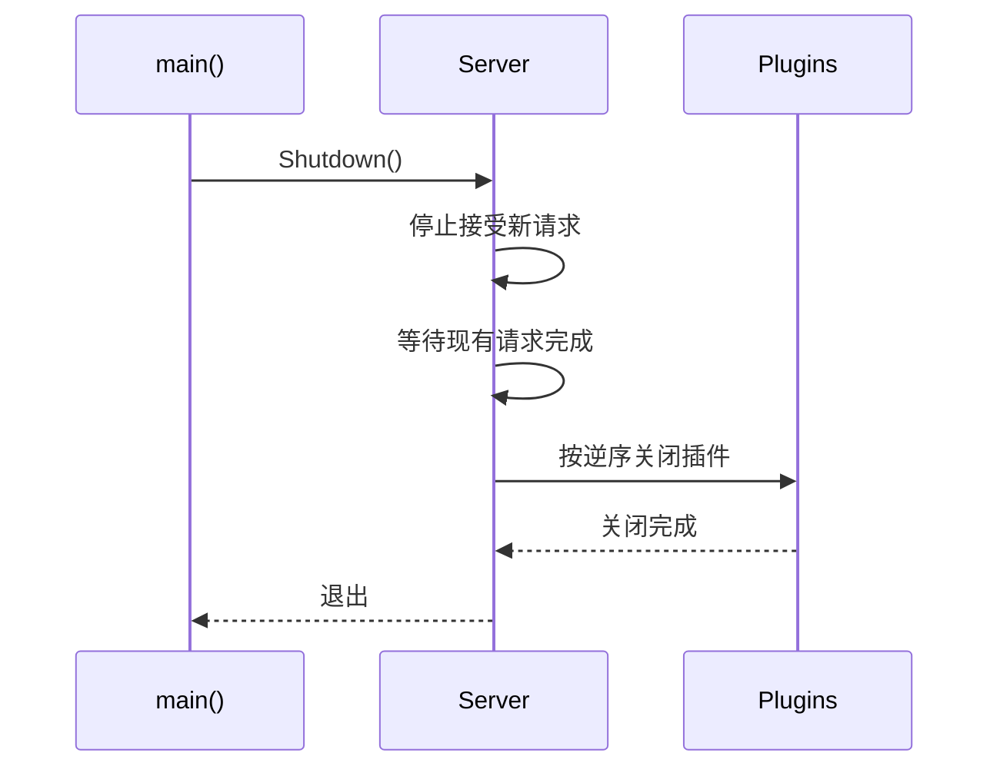

containerd 采用高度模块化的插件架构，几乎所有核心功能都通过插件实现。理解插件系统是深入理解 containerd 的关键。

## 插件系统概述

### 设计目标

1. **可扩展性**：轻松添加新功能
2. **可替换性**：替换默认实现
3. **依赖管理**：自动处理插件依赖
4. **懒加载**：按需初始化插件

### 插件注册流程



## 插件类型详解

containerd 定义了多种插件类型，每种类型对应不同的功能领域：

```go
// plugins/types.go
const (
    // 内部服务插件
    InternalPlugin = "io.containerd.internal.v1"
    // 运行时插件 (v2)
    RuntimePluginV2 = "io.containerd.runtime.v2"
    // 服务插件
    ServicePlugin = "io.containerd.service.v1"
    // gRPC 服务插件
    GRPCPlugin = "io.containerd.grpc.v1"
    // 快照器插件
    SnapshotPlugin = "io.containerd.snapshotter.v1"
    // 任务监控插件
    TaskMonitorPlugin = "io.containerd.monitor.v1"
    // 差异计算插件
    DiffPlugin = "io.containerd.differ.v1"
    // 元数据插件
    MetadataPlugin = "io.containerd.metadata.v1"
    // 内容存储插件
    ContentPlugin = "io.containerd.content.v1"
    // GC 插件
    GCPlugin = "io.containerd.gc.v1"
    // 事件插件
    EventPlugin = "io.containerd.event.v1"
    // 租约插件
    LeasePlugin = "io.containerd.lease.v1"
    // 流媒体处理器插件
    StreamingPlugin = "io.containerd.streaming.v1"
    // 传输插件
    TransferPlugin = "io.containerd.transfer.v1"
    // NRI 插件
    NRIApiPlugin = "io.containerd.nri.v1"
    // CRI 服务插件
    CRIServicePlugin = "io.containerd.cri.v1"
    // Sandbox 存储插件
    SandboxStorePlugin = "io.containerd.sandbox.store.v1"
    // Sandbox 控制器插件
    SandboxControllerPlugin = "io.containerd.sandbox.controller.v1"
    // 警告服务插件
    WarningPlugin = "io.containerd.warning.v1"
    // TTRPC 插件
    TTRPCPlugin = "io.containerd.ttrpc.v1"
)
```

### 核心插件类型关系



## 插件注册机制

### Registration 结构

```go
// plugin/plugin.go
type Registration struct {
    // 插件类型
    Type Type

    // 插件 ID
    ID string

    // 可选的配置类型
    Config interface{}

    // 插件依赖
    Requires []Type

    // 初始化函数
    InitFn func(*InitContext) (interface{}, error)

    // 是否禁用
    Disable bool
}
```

### 注册示例

```go
// plugins/snapshots/overlay/plugin.go
func init() {
    plugin.Register(&plugin.Registration{
        Type: plugins.SnapshotPlugin,
        ID:   "overlayfs",
        Config: &Config{
            RootPath: defaultRootPath,
        },
        InitFn: func(ic *plugin.InitContext) (interface{}, error) {
            // 获取配置
            config, ok := ic.Config.(*Config)
            if !ok {
                return nil, errors.New("invalid overlay config")
            }

            // 获取根路径
            root := ic.Properties[plugins.PropertyRootDir]
            if config.RootPath != "" {
                root = config.RootPath
            }

            // 创建 Overlay Snapshotter
            return overlay.NewSnapshotter(root, overlay.WithAsyncRemove)
        },
    })
}
```

### InitContext 上下文

```go
// plugin/context.go
type InitContext struct {
    // 上下文
    Context context.Context

    // 插件配置（从 config.toml 解析）
    Config interface{}

    // containerd 地址
    Address string

    // 根目录和状态目录
    Properties map[string]string

    // 获取已初始化的插件
    GetAll func() []*Plugin
    GetByID func(id string) *Plugin
    GetSingle func(t Type) interface{}
}
```

## 插件依赖解析

### 依赖声明

```go
// 声明依赖
plugin.Register(&plugin.Registration{
    Type: plugins.GRPCPlugin,
    ID:   "images",
    Requires: []Type{
        plugins.ServicePlugin,      // 依赖 ServicePlugin
        plugins.MetadataPlugin,     // 依赖 MetadataPlugin
    },
    InitFn: func(ic *plugin.InitContext) (interface{}, error) {
        // 获取依赖的插件
        services, err := ic.GetByType(plugins.ServicePlugin)
        if err != nil {
            return nil, err
        }
        // ...
    },
})
```

### 依赖解析算法


containerd 使用拓扑排序确保插件按正确顺序初始化：

```go
// plugin/plugin.go
func Graph(plugins []*Registration) ([]Registration, error) {
    // 构建邻接表
    graph := make(map[Type][]Registration)

    // 检测循环依赖
    // ...

    // 拓扑排序
    var sorted []Registration
    // ...

    return sorted, nil
}
```

### 依赖关系示例



## 内置插件注册

### builtins 机制

containerd 使用 blank import 注册内置插件：

```go
// cmd/containerd/builtins/builtins.go
package builtins

import (
    // 加载顺序很重要
    // 基础插件
    _ "github.com/containerd/containerd/v2/plugins/content/local"
    _ "github.com/containerd/containerd/v2/plugins/metadata"

    // 快照器
    _ "github.com/containerd/containerd/v2/plugins/snapshots/native"
    _ "github.com/containerd/containerd/v2/plugins/snapshots/overlay"
    _ "github.com/containerd/containerd/v2/plugins/snapshots/btrfs"
    _ "github.com/containerd/containerd/v2/plugins/snapshots/devmapper"

    // 服务插件
    _ "github.com/containerd/containerd/v2/plugins/services/containers"
    _ "github.com/containerd/containerd/v2/plugins/services/content"
    _ "github.com/containerd/containerd/v2/plugins/services/diff"
    _ "github.com/containerd/containerd/v2/plugins/services/images"
    _ "github.com/containerd/containerd/v2/plugins/services/leases"
    _ "github.com/containerd/containerd/v2/plugins/services/namespaces"
    _ "github.com/containerd/containerd/v2/plugins/services/snapshots"
    _ "github.com/containerd/containerd/v2/plugins/services/tasks"
    _ "github.com/containerd/containerd/v2/plugins/services/events"

    // GC 插件
    _ "github.com/containerd/containerd/v2/plugins/gc"

    // Runtime 插件
    _ "github.com/containerd/containerd/v2/plugins/runtime"
)
```

### CRI 插件

CRI 插件单独注册（因为是可选的）：

```go
// cmd/containerd/builtins/cri.go
//go:build !no_cri

package builtins

import (
    _ "github.com/containerd/containerd/v2/plugins/cri"
)
```

## 插件配置

### 配置文件结构

```toml
# /etc/containerd/config.toml
version = 2

[plugins]
  # 插件配置格式: [plugins."<plugin_type>"]
  # 或 [plugins."<plugin_type>".<id>]

  # Overlay Snapshotter 配置
  [plugins."io.containerd.snapshotter.v1.overlayfs"]
    root_path = "/var/lib/containerd/io.containerd.snapshotter.v1.overlayfs"
    upperdir_label = false

  # 原生 Snapshotter 配置
  [plugins."io.containerd.snapshotter.v1.native"]
    root_path = "/var/lib/containerd/io.containerd.snapshotter.v1.native"

  # 元数据插件配置
  [plugins."io.containerd.metadata.v1.bolt"]
    content_sharing_policy = "shared"

  # CRI 插件配置
  [plugins."io.containerd.grpc.v1.cri"]
    sandbox_image = "registry.k8s.io/pause:3.9"
    max_container_log_line_size = 16384

    [plugins."io.containerd.grpc.v1.cri".containerd]
      default_runtime_name = "runc"
      snapshotter = "overlayfs"

      [plugins."io.containerd.grpc.v1.cri".containerd.runtimes.runc]
        runtime_type = "io.containerd.runc.v2"
        [plugins."io.containerd.grpc.v1.cri".containerd.runtimes.runc.options]
          SystemdCgroup = true

    [plugins."io.containerd.grpc.v1.cri".cni]
      bin_dir = "/opt/cni/bin"
      conf_dir = "/etc/cni/net.d"
```

### 禁用插件

```toml
# 禁用 CRI 插件
[plugins."io.containerd.grpc.v1.cri"]
  disabled = true

# 禁用特定的 Snapshotter
[plugins."io.containerd.snapshotter.v1.btrfs"]
  disabled = true
```

## 开发自定义插件

### 插件开发模板

```go
package myplugin

import (
    "github.com/containerd/containerd/v2/plugins"
    "github.com/containerd/plugin"
    "github.com/containerd/plugin/registry"
)

// 配置结构
type Config struct {
    Option1 string `toml:"option1"`
    Option2 int    `toml:"option2"`
}

func init() {
    registry.Register(&plugin.Registration{
        Type:   plugins.ServicePlugin,  // 或其他插件类型
        ID:     "my-plugin",
        Config: &Config{
            Option1: "default",
            Option2: 100,
        },
        Requires: []plugin.Type{
            plugins.MetadataPlugin,
        },
        InitFn: func(ic *plugin.InitContext) (interface{}, error) {
            // 获取配置
            config := ic.Config.(*Config)

            // 获取依赖
            meta, err := ic.GetSingle(plugins.MetadataPlugin)
            if err != nil {
                return nil, err
            }

            // 初始化并返回插件实例
            return NewMyPlugin(config, meta)
        },
    })
}

// MyPlugin 实现
type MyPlugin struct {
    config *Config
    meta   interface{}
}

func NewMyPlugin(config *Config, meta interface{}) (*MyPlugin, error) {
    return &MyPlugin{
        config: config,
        meta:   meta,
    }, nil
}

// 实现所需接口
func (p *MyPlugin) DoSomething() error {
    // ...
    return nil
}
```

### 编译插件

插件可以通过两种方式加入 containerd：

**1. 静态编译（修改 builtins）**

```go
// cmd/containerd/builtins/builtins.go
import (
    _ "github.com/your/plugin"
)
```

**2. 代理插件（外部进程）**

对于 Shim 等外部进程插件，通过配置指定：

```toml
[plugins."io.containerd.grpc.v1.cri".containerd.runtimes.myruntime]
  runtime_type = "io.containerd.my-runtime.v2"
  runtime_path = "/usr/local/bin/my-runtime-shim"
```

## 插件生命周期

### 初始化流程



### 关闭流程



## 实用工具

### 查看已注册插件

```bash
# 使用 ctr
ctr plugins ls

# 输出示例
TYPE                                   ID                       PLATFORMS   STATUS
io.containerd.content.v1               content                  -           ok
io.containerd.snapshotter.v1           overlayfs                linux/amd64 ok
io.containerd.snapshotter.v1           native                   linux/amd64 ok
io.containerd.metadata.v1              bolt                     -           ok
io.containerd.runtime.v2               task                     linux/amd64 ok
io.containerd.grpc.v1                  containers               -           ok
io.containerd.grpc.v1                  images                   -           ok
io.containerd.grpc.v1                  tasks                    -           ok
io.containerd.grpc.v1                  cri                      linux/amd64 ok
```

### 查看插件配置

```bash
# 导出默认配置
containerd config default

# 查看当前配置
containerd config dump
```

## 常见插件详解

### Snapshotter 插件

| ID | 说明 | 适用场景 |
|----|------|----------|
| overlayfs | OverlayFS 快照器 | Linux 默认，性能好 |
| native | 原生快照器 | 通用，所有平台 |
| btrfs | Btrfs 快照器 | Btrfs 文件系统 |
| devmapper | Device Mapper | 块设备快照 |
| windows | Windows 快照器 | Windows 平台 |

### Runtime 插件

| ID | 说明 | 使用场景 |
|----|------|----------|
| io.containerd.runc.v2 | runc 运行时 | 标准容器 |
| io.containerd.kata.v2 | Kata 容器 | 安全隔离 |
| io.containerd.runsc.v1 | gVisor | 安全沙箱 |

### Service 插件

| ID | 功能 |
|----|------|
| containers | 容器元数据管理 |
| images | 镜像管理 |
| tasks | 任务（容器实例）管理 |
| content | 内容存储服务 |
| snapshots | 快照服务代理 |
| events | 事件服务 |
| leases | 租约服务 |
| namespaces | 命名空间服务 |

## 小结

containerd 插件系统的核心要点：

1. **插件类型**：不同类型对应不同功能领域
2. **依赖管理**：自动解析和处理插件依赖
3. **配置灵活**：通过 TOML 配置各插件
4. **扩展简单**：实现接口 + 注册即可

理解插件系统有助于：
- 定制 containerd 功能
- 开发新的 Snapshotter 或 Runtime
- 深入理解 containerd 内部机制

下一节我们将学习 [containerd 与 Docker/Kubernetes 的对比](./03-comparison.md)。

## 参考资料

- [containerd Plugin System](https://github.com/containerd/containerd/blob/main/docs/PLUGINS.md)
- [containerd/plugin](https://github.com/containerd/plugin)
