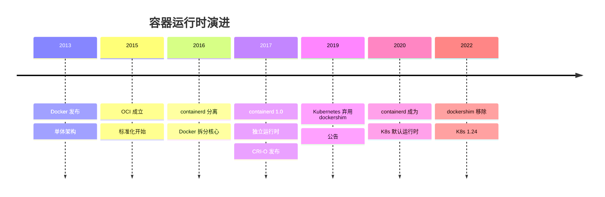
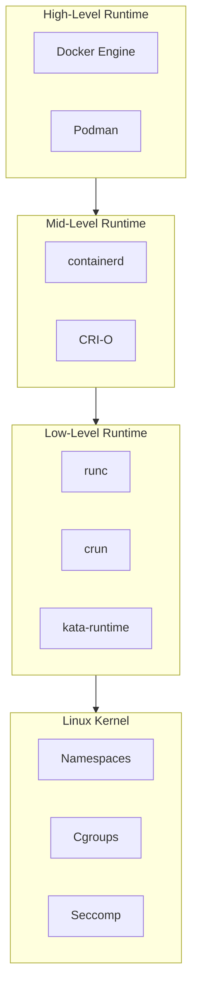
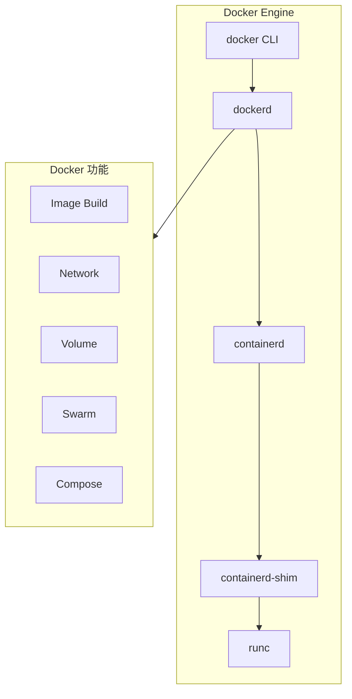
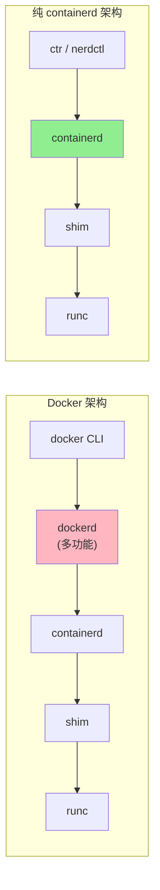
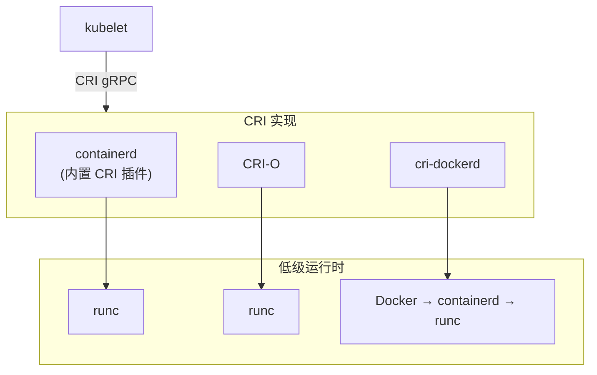
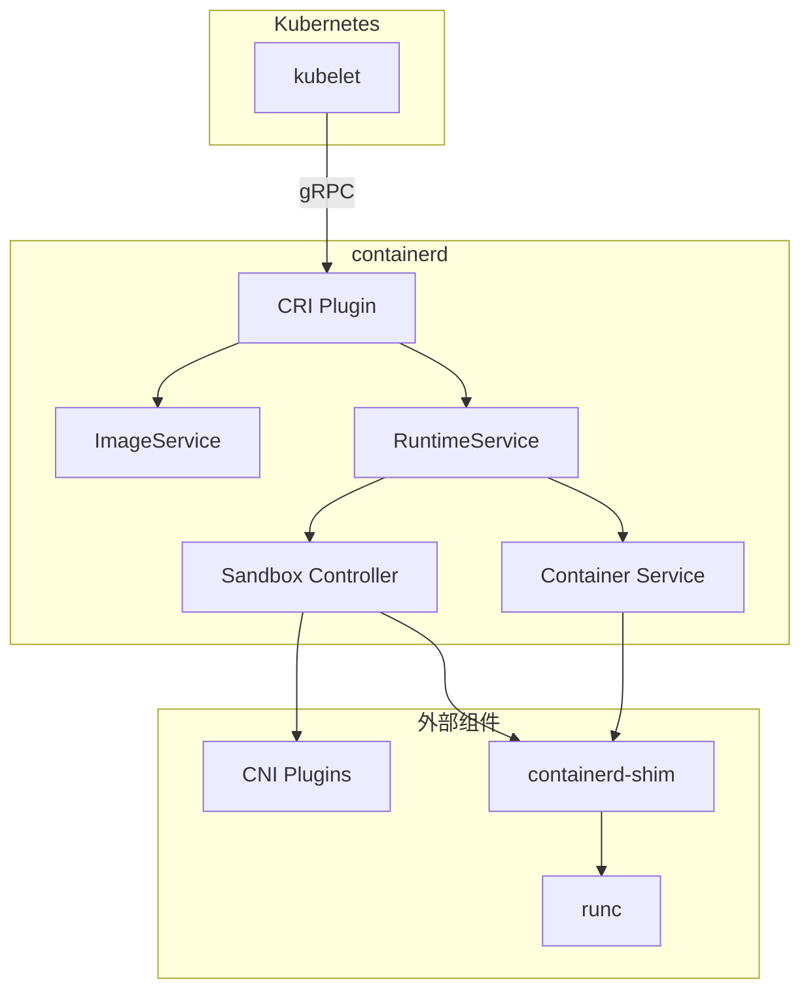
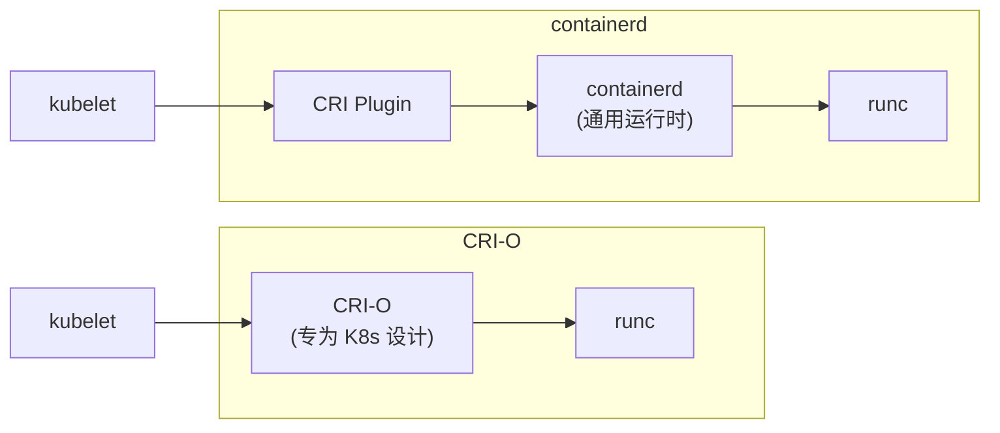
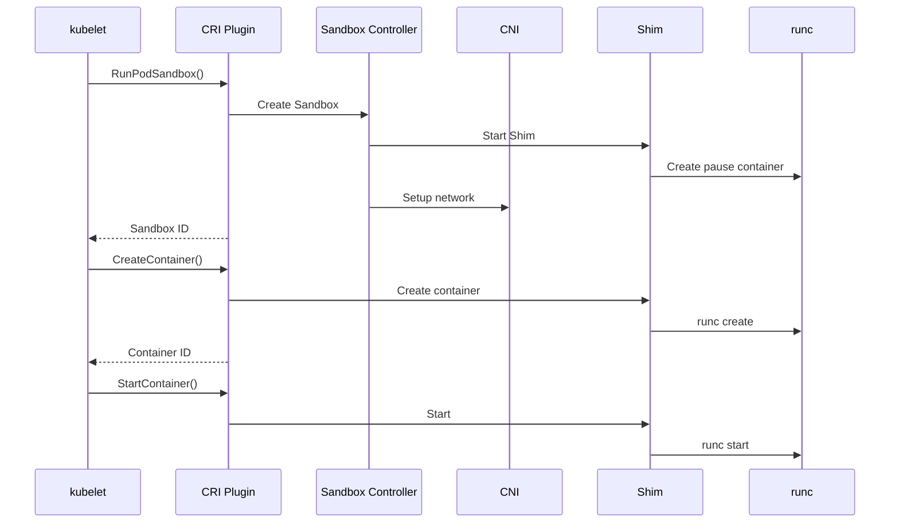
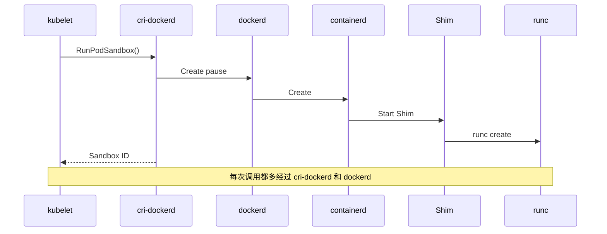
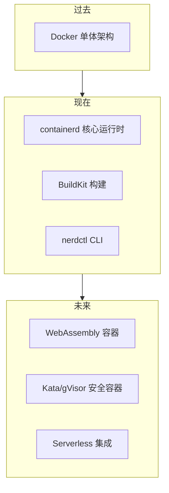

本章深入对比 containerd 与 Docker Engine、CRI-O 等容器运行时的架构差异，以及 containerd 在 Kubernetes 生态中的定位。

## 容器运行时演进

### 历史背景



### 运行时分层



## Docker Engine 架构

### 传统 Docker 架构



### Docker vs containerd



### 功能对比

| 功能 | Docker Engine | containerd |
|------|--------------|------------|
| 容器运行 | ✅ | ✅ |
| 镜像管理 | ✅ | ✅ |
| 镜像构建 | ✅ (BuildKit) | ❌ (需 BuildKit) |
| 网络管理 | ✅ (libnetwork) | ❌ (需 CNI) |
| 存储卷 | ✅ (volume driver) | ❌ (需外部实现) |
| 容器编排 | ✅ (Swarm) | ❌ |
| Compose | ✅ | ❌ (需 nerdctl) |
| API | REST + gRPC | gRPC |
| CRI 支持 | ❌ (需 cri-dockerd) | ✅ (内置) |

### 调用链对比

**Docker 运行容器**：

```
docker run → dockerd → containerd → containerd-shim → runc
(5 层)
```

**containerd 运行容器**：

```
ctr run → containerd → containerd-shim → runc
(4 层)
```

**性能影响**：
- Docker 额外的 dockerd 层增加了延迟
- Docker 的 REST API 转换有开销
- containerd 更轻量、更快

## Kubernetes 中的运行时

### CRI (Container Runtime Interface)



### containerd CRI 架构



### CRI-O vs containerd



| 特性 | containerd | CRI-O |
|------|-----------|-------|
| 定位 | 通用容器运行时 | Kubernetes 专用 |
| CRI 实现 | 插件形式 | 核心功能 |
| 非 K8s 使用 | ✅ 支持 | ⚠️ 不建议 |
| 镜像构建 | 可集成 BuildKit | 不支持 |
| Docker 兼容 | 高（nerdctl） | 低 |
| 生态系统 | 广泛 | Kubernetes 专注 |
| 维护者 | CNCF + 多家公司 | Red Hat 主导 |

### Pod 创建流程对比

**containerd CRI**：



**Docker + cri-dockerd**：



## 性能对比

### 容器启动时间

| 运行时 | 冷启动 | 热启动 |
|--------|--------|--------|
| containerd | ~300ms | ~100ms |
| Docker | ~500ms | ~200ms |
| CRI-O | ~280ms | ~90ms |

*注：数据为参考值，实际取决于环境配置*

### 资源占用

| 指标 | containerd | Docker | CRI-O |
|------|-----------|--------|-------|
| 内存 (idle) | ~30MB | ~100MB | ~25MB |
| 内存 (1000容器) | ~150MB | ~500MB | ~120MB |
| CPU (idle) | <1% | ~2% | <1% |

### Kubernetes 场景测试

```
环境: 100 节点集群，每节点 100 Pod

指标              containerd    Docker(cri-dockerd)
------------------------------------------------
Pod 创建 P99      1.2s          2.1s
Pod 删除 P99      0.8s          1.5s
镜像拉取 P99      15s           18s
CPU 开销/节点     2%            5%
内存开销/节点     200MB         500MB
```

## 迁移指南

### 从 Docker 迁移到 containerd

#### 1. Kubernetes 集群迁移

```bash
# 1. 标记节点不可调度
kubectl cordon <node>

# 2. 驱逐现有 Pod
kubectl drain <node> --ignore-daemonsets

# 3. 停止 Docker
systemctl stop docker

# 4. 安装 containerd
apt-get install containerd.io

# 5. 配置 containerd
mkdir -p /etc/containerd
containerd config default > /etc/containerd/config.toml

# 6. 配置 kubelet 使用 containerd
# /var/lib/kubelet/kubeadm-flags.env
KUBELET_KUBEADM_ARGS="--container-runtime-endpoint=unix:///run/containerd/containerd.sock"

# 7. 重启服务
systemctl restart containerd
systemctl restart kubelet

# 8. 恢复节点
kubectl uncordon <node>
```

#### 2. CLI 命令对照

| Docker | ctr | nerdctl |
|--------|-----|---------|
| `docker pull` | `ctr image pull` | `nerdctl pull` |
| `docker images` | `ctr image ls` | `nerdctl images` |
| `docker run` | `ctr run` | `nerdctl run` |
| `docker ps` | `ctr container ls` | `nerdctl ps` |
| `docker exec` | `ctr task exec` | `nerdctl exec` |
| `docker logs` | - | `nerdctl logs` |
| `docker build` | - | `nerdctl build` |
| `docker-compose` | - | `nerdctl compose` |

#### 3. 镜像迁移

```bash
# 方法 1: 从 Docker 导出，导入 containerd
docker save myimage:tag | ctr image import -

# 方法 2: 使用 nerdctl
nerdctl pull myimage:tag

# 方法 3: 直接从 Docker 的存储导入
ctr -n k8s.io image import /var/lib/docker/...
```

### 兼容性注意事项

1. **Docker socket**：containerd 不提供 `/var/run/docker.sock`
2. **镜像格式**：containerd 完全兼容 Docker 镜像
3. **网络**：需要使用 CNI 而非 Docker 网络
4. **存储卷**：需要使用 CSI 或本地挂载

## 何时选择哪个运行时

### 选择 containerd

✅ 适用场景：
- Kubernetes 集群
- 需要轻量级运行时
- 性能敏感场景
- 嵌入到其他系统

❌ 不适用：
- 需要 Docker Compose 原生支持
- 需要 Docker 专有功能

### 选择 Docker

✅ 适用场景：
- 开发环境
- 需要 `docker build`
- 需要 Docker Compose
- 熟悉 Docker 工作流

❌ 不适用：
- Kubernetes 生产环境（资源开销大）
- 极致性能需求

### 选择 CRI-O

✅ 适用场景：
- 纯 Kubernetes 环境
- Red Hat/OpenShift 生态
- 最小化攻击面

❌ 不适用：
- 非 Kubernetes 场景
- 需要 Docker CLI 兼容

## 架构演进趋势



### 发展方向

1. **更轻量**：减少守护进程开销
2. **更安全**：Kata、gVisor 等安全运行时
3. **更标准化**：OCI 规范持续完善
4. **新工作负载**：WebAssembly、Serverless

## 小结

| 运行时 | 定位 | 优势 | 劣势 |
|--------|------|------|------|
| Docker | 全栈工具 | 功能全面、生态成熟 | 资源占用高、层级多 |
| containerd | 核心运行时 | 轻量、标准、K8s 原生 | 功能相对单一 |
| CRI-O | K8s 专用 | 极简、安全 | 仅限 K8s 场景 |

选择建议：
- **开发环境**：Docker（功能全面）
- **K8s 生产**：containerd（推荐）或 CRI-O
- **嵌入式**：containerd（设计目标）

下一章我们将深入学习 [Content Store 模块](../03-content-store/01-content-addressable.md)。

## 参考资料

- [Kubernetes Container Runtimes](https://kubernetes.io/docs/setup/production-environment/container-runtimes/)
- [containerd vs Docker](https://www.docker.com/blog/what-is-containerd-runtime/)
- [CRI-O vs containerd](https://www.redhat.com/en/blog/introducing-cri-o-10)
- [Kubernetes Deprecation of Docker](https://kubernetes.io/blog/2020/12/02/dont-panic-kubernetes-and-docker/)
