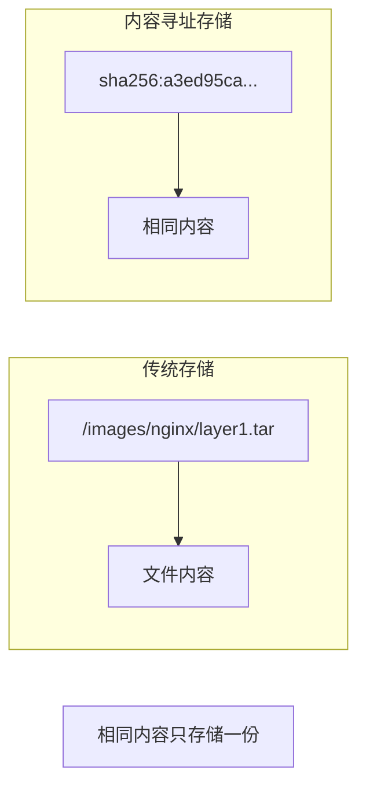
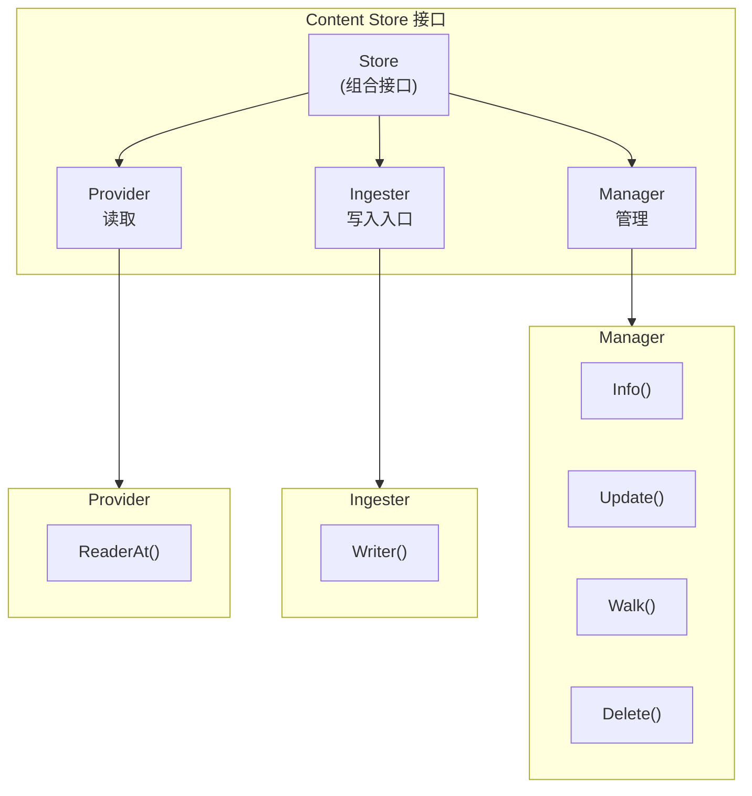
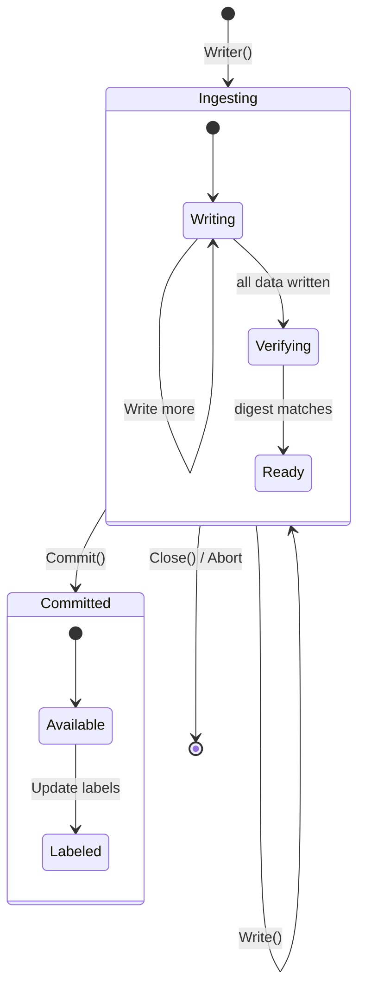
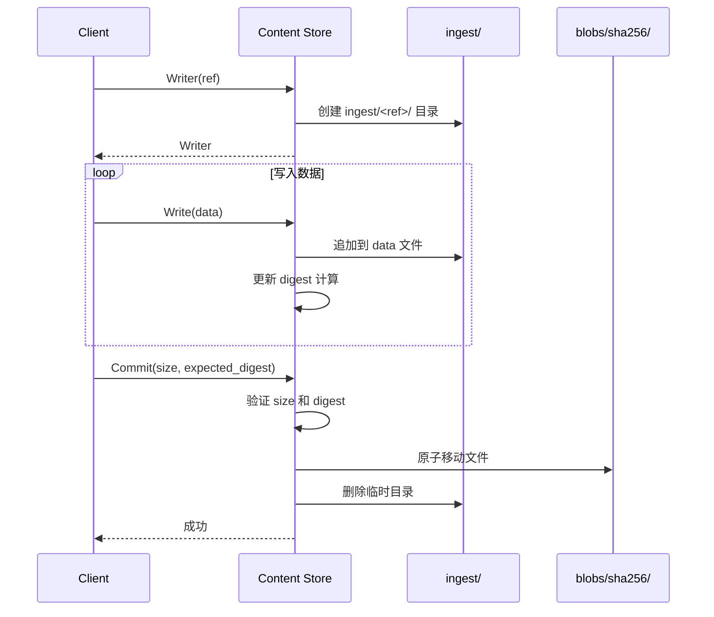
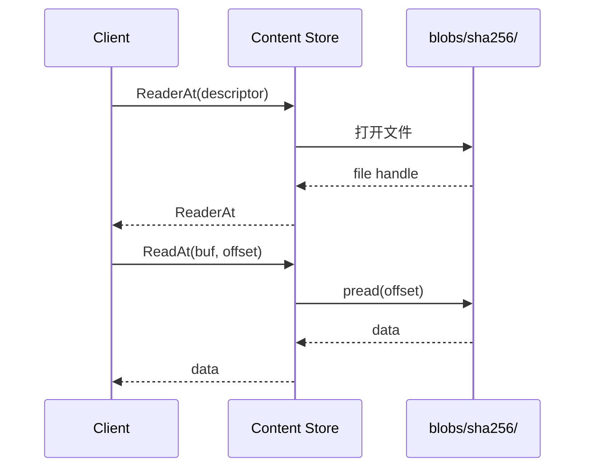
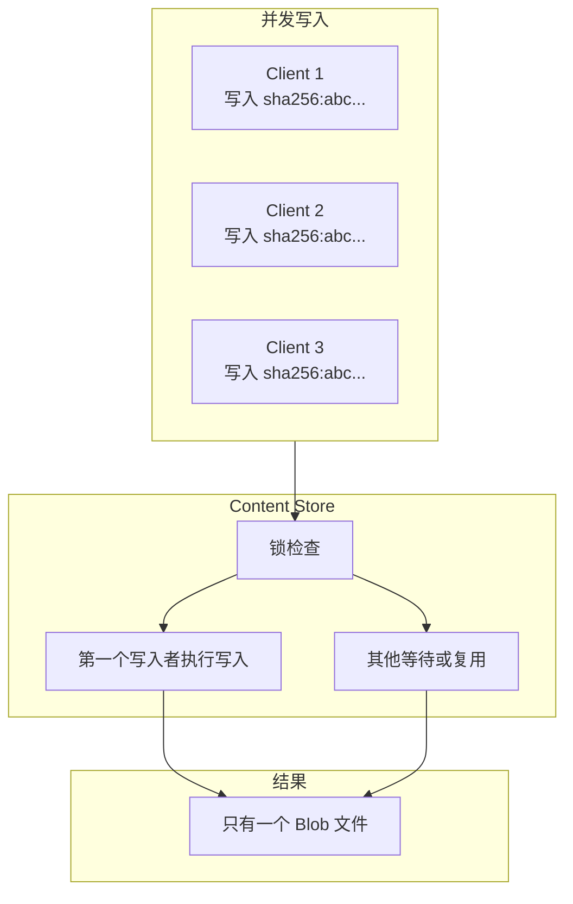
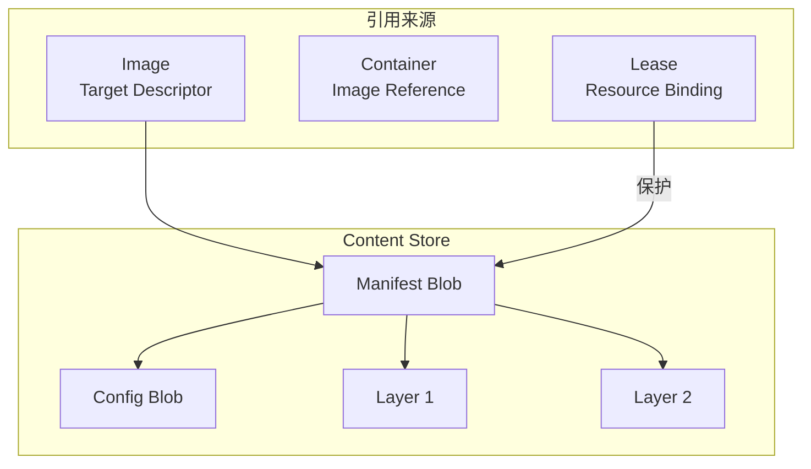

Content Store 是 containerd 的核心组件之一，它采用内容寻址存储（Content-Addressable Storage, CAS）方式管理所有的二进制数据（Blob），包括镜像层、配置文件等。

## 内容寻址存储原理

### 什么是内容寻址

内容寻址存储根据数据内容本身来标识和检索数据，而非使用传统的路径或文件名：



### Digest 格式

containerd 使用 OCI 标准的 Digest 格式：

```
<algorithm>:<encoded>

示例:
sha256:a3ed95caeb02ffe68cdd9fd84406680ae93d633cb16422d00e8a7c22955b46d4
```

- **algorithm**: 哈希算法（sha256, sha512 等）
- **encoded**: 十六进制编码的哈希值

### 内容寻址的优势

1. **去重**：相同内容只存储一份
2. **完整性**：Digest 本身验证内容完整性
3. **不可变**：内容与标识绑定，无法篡改
4. **缓存友好**：相同 Digest 永远返回相同内容

## Content Store 架构

### 核心接口



### 接口定义

```go
// core/content/content.go

// Provider 提供内容读取能力
type Provider interface {
    // ReaderAt 返回指定 digest 的内容读取器
    ReaderAt(ctx context.Context, desc ocispec.Descriptor) (ReaderAt, error)
}

// Ingester 提供内容写入能力
type Ingester interface {
    // Writer 返回一个写入器，用于写入新内容
    Writer(ctx context.Context, opts ...WriterOpt) (Writer, error)
}

// Manager 提供内容管理能力
type Manager interface {
    // Info 返回内容的元信息
    Info(ctx context.Context, dgst digest.Digest) (Info, error)

    // Update 更新内容的标签
    Update(ctx context.Context, info Info, fieldpaths ...string) (Info, error)

    // Walk 遍历所有内容
    Walk(ctx context.Context, fn WalkFunc, filters ...string) error

    // Delete 删除指定内容
    Delete(ctx context.Context, dgst digest.Digest) error
}

// Store 组合了所有接口
type Store interface {
    Manager
    Provider
    Ingester
    IngestManager
}
```

### Writer 接口

```go
// Writer 用于写入内容
type Writer interface {
    io.WriteCloser

    // Digest 返回当前写入内容的 digest
    Digest() digest.Digest

    // Commit 提交内容，使其可被读取
    Commit(ctx context.Context, size int64, expected digest.Digest, opts ...Opt) error

    // Status 返回当前写入状态
    Status() (Status, error)

    // Truncate 重置写入位置
    Truncate(size int64) error
}
```

### Info 结构

```go
// Info 描述内容的元信息
type Info struct {
    // Digest 内容摘要
    Digest digest.Digest

    // Size 内容大小
    Size int64

    // CreatedAt 创建时间
    CreatedAt time.Time

    // UpdatedAt 最后更新时间
    UpdatedAt time.Time

    // Labels 标签（用户自定义元数据）
    Labels map[string]string
}
```

## 存储结构

### 目录布局

```
/var/lib/containerd/io.containerd.content.v1.content/
├── blobs/                  # 已提交的内容
│   └── sha256/
│       ├── a3ed95ca...     # Blob 文件
│       ├── b5c7d3ef...
│       └── ...
├── ingest/                 # 正在写入的内容
│   ├── <ref1>/
│   │   ├── data            # 临时数据文件
│   │   ├── ref             # 引用标识
│   │   ├── startedat       # 开始时间
│   │   └── total           # 预期大小
│   └── <ref2>/
└── ...
```

### Blob 文件

每个 Blob 直接以 Digest 的 encoded 部分作为文件名：

```bash
$ ls /var/lib/containerd/io.containerd.content.v1.content/blobs/sha256/
a3ed95caeb02ffe68cdd9fd84406680ae93d633cb16422d00e8a7c22955b46d4
b5c7d3ef8be5e9e5e5e5e5e5e5e5e5e5e5e5e5e5e5e5e5e5e5e5e5e5e5e5e5e5
...

# 查看 Blob 内容
$ file /var/lib/containerd/io.containerd.content.v1.content/blobs/sha256/a3ed95...
/var/lib/containerd/...a3ed95...: gzip compressed data
```

## 内容生命周期

### 写入流程



### 写入过程详解



### 代码示例：写入内容

```go
import (
    "github.com/containerd/containerd/v2/core/content"
    "github.com/opencontainers/go-digest"
)

func writeContent(ctx context.Context, store content.Store, data []byte) (digest.Digest, error) {
    // 计算预期的 digest
    expected := digest.FromBytes(data)

    // 创建 Writer
    writer, err := store.Writer(ctx,
        content.WithRef("my-content-ref"),
        content.WithDescriptor(ocispec.Descriptor{
            Size:   int64(len(data)),
            Digest: expected,
        }),
    )
    if err != nil {
        return "", err
    }
    defer writer.Close()

    // 写入数据
    if _, err := writer.Write(data); err != nil {
        return "", err
    }

    // 提交
    if err := writer.Commit(ctx, int64(len(data)), expected); err != nil {
        return "", err
    }

    return expected, nil
}
```

### 读取流程



### 代码示例：读取内容

```go
func readContent(ctx context.Context, store content.Store, dgst digest.Digest) ([]byte, error) {
    // 获取内容信息
    info, err := store.Info(ctx, dgst)
    if err != nil {
        return nil, err
    }

    // 创建 Reader
    ra, err := store.ReaderAt(ctx, ocispec.Descriptor{
        Digest: dgst,
        Size:   info.Size,
    })
    if err != nil {
        return nil, err
    }
    defer ra.Close()

    // 读取全部内容
    data := make([]byte, info.Size)
    _, err = ra.ReadAt(data, 0)
    if err != nil && err != io.EOF {
        return nil, err
    }

    return data, nil
}
```

## Labels 标签系统

Labels 用于附加用户定义的元数据到内容上：

### 常用标签

| 标签 | 说明 |
|------|------|
| `containerd.io/uncompressed` | 未压缩内容的 digest |
| `containerd.io/distribution.source` | 内容来源 Registry |
| `containerd.io/gc.ref.content.*` | GC 引用标记 |

### 使用标签

```go
// 写入时设置标签
writer, err := store.Writer(ctx,
    content.WithRef("my-ref"),
    content.WithLabels(map[string]string{
        "my-label": "my-value",
    }),
)

// 更新标签
info, err := store.Update(ctx, content.Info{
    Digest: dgst,
    Labels: map[string]string{
        "new-label": "new-value",
    },
}, "labels.new-label")
```

## 并发控制

### 写入去重

当多个客户端同时写入相同内容时，Content Store 保证：



### IngestManager

```go
// IngestManager 管理进行中的写入
type IngestManager interface {
    // Status 查询写入状态
    Status(ctx context.Context, ref string) (Status, error)

    // Abort 取消写入
    Abort(ctx context.Context, ref string) error

    // ListStatuses 列出所有进行中的写入
    ListStatuses(ctx context.Context, filters ...string) ([]Status, error)
}
```

## 垃圾回收

Content Store 的内容通过 Lease 和引用来保护，未被引用的内容会被 GC 清理。

### 引用机制



### GC 标签

```go
// GC 相关的标签前缀
const (
    GCRefContent   = "containerd.io/gc.ref.content"
    GCRefSnapshot  = "containerd.io/gc.ref.snapshot"
)

// 示例：Manifest 引用 Layer
labels := map[string]string{
    "containerd.io/gc.ref.content.layer-0": "sha256:layer1...",
    "containerd.io/gc.ref.content.layer-1": "sha256:layer2...",
    "containerd.io/gc.ref.content.config":  "sha256:config...",
}
```

## 性能优化

### 1. 直接 I/O

对于大文件，使用直接 I/O 避免页缓存污染：

```go
// 大于阈值时使用 O_DIRECT
if size > directIOThreshold {
    flags |= syscall.O_DIRECT
}
```

### 2. 文件锁

使用文件锁确保并发安全：

```go
// 写入时加锁
func (s *store) Writer(ctx context.Context, opts ...WriterOpt) (content.Writer, error) {
    // ...
    lockPath := filepath.Join(s.root, "ingest", ref, "lock")
    if err := lockfile.Lock(lockPath); err != nil {
        return nil, err
    }
    // ...
}
```

### 3. 原子提交

使用 rename 实现原子提交：

```go
func (w *writer) Commit(ctx context.Context, size int64, expected digest.Digest, opts ...content.Opt) error {
    // 验证
    if w.digester.Digest() != expected {
        return errors.New("digest mismatch")
    }

    // 原子移动
    target := filepath.Join(s.root, "blobs", expected.Algorithm().String(), expected.Encoded())
    return os.Rename(w.path, target)
}
```

## 小结

Content Store 是 containerd 的基础存储组件：

1. **内容寻址**：使用 Digest 标识内容
2. **去重存储**：相同内容只存一份
3. **完整性保证**：Digest 验证内容
4. **生命周期管理**：通过 Labels 和 Lease 管理

理解 Content Store 有助于：
- 理解镜像存储机制
- 优化存储空间使用
- 排查内容相关问题

下一节我们将学习 [Content Store 代码走读](./02-code-walkthrough.md)。

## 参考资料

- [containerd Content Store Design](https://github.com/containerd/containerd/blob/main/docs/content-flow.md)
- [OCI Image Spec - Content Addressable Storage](https://github.com/opencontainers/image-spec/blob/main/descriptor.md)
