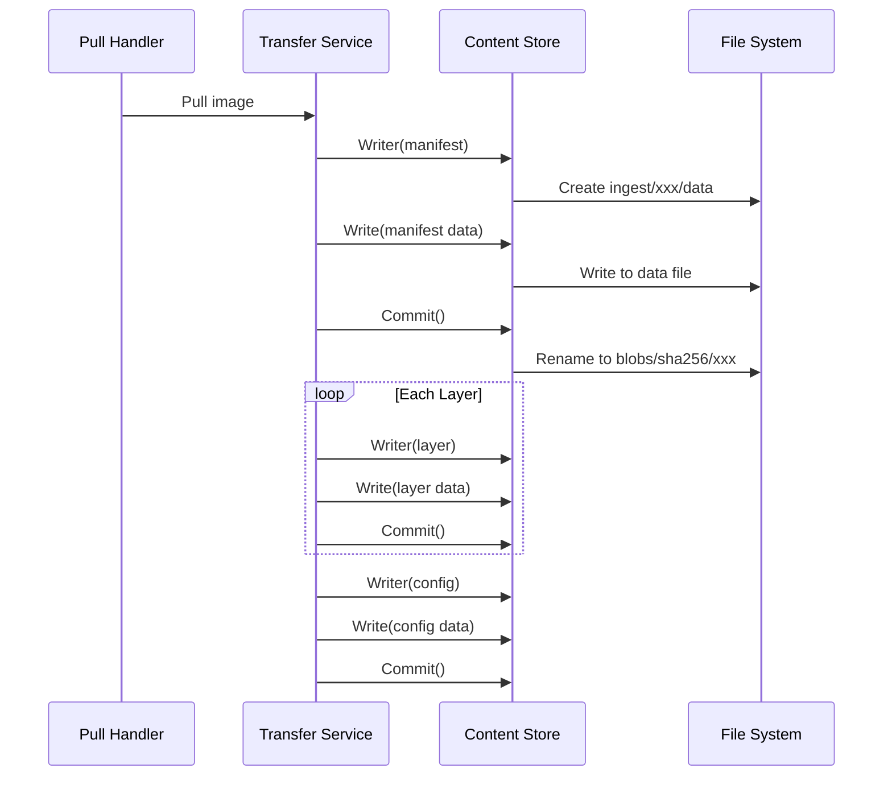

本章深入分析 Content Store 的源码实现，帮助你理解其内部工作机制。

## 代码结构

```
containerd/
├── core/content/
│   ├── content.go          # 核心接口定义
│   ├── helpers.go          # 辅助函数
│   └── local/              # 本地存储实现
│       ├── store.go        # Store 主实现
│       ├── writer.go       # Writer 实现
│       ├── reader.go       # Reader 实现
│       └── locks.go        # 锁机制
├── plugins/content/
│   └── local/
│       └── plugin.go       # 插件注册
└── plugins/services/content/
    └── service.go          # gRPC 服务
```

## 核心接口定义

### content.go 分析

```go
// core/content/content.go

// ReaderAt 扩展了标准的 io.ReaderAt
type ReaderAt interface {
    io.ReaderAt
    io.Closer
    Size() int64
}

// Provider 提供内容读取
type Provider interface {
    ReaderAt(ctx context.Context, desc ocispec.Descriptor) (ReaderAt, error)
}

// Ingester 提供内容写入入口
type Ingester interface {
    Writer(ctx context.Context, opts ...WriterOpt) (Writer, error)
}

// Writer 用于写入内容
type Writer interface {
    io.WriteCloser
    Digest() digest.Digest
    Commit(ctx context.Context, size int64, expected digest.Digest, opts ...Opt) error
    Status() (Status, error)
    Truncate(size int64) error
}

// Status 描述写入状态
type Status struct {
    Ref       string        // 写入引用
    Offset    int64         // 当前偏移
    Total     int64         // 总大小
    Expected  digest.Digest // 预期 digest
    StartedAt time.Time     // 开始时间
    UpdatedAt time.Time     // 更新时间
}
```

**关键点**：
- `ReaderAt` 继承 `io.ReaderAt`，支持随机读取
- `Writer` 支持流式写入和断点续传
- `Status` 记录写入进度

## 本地存储实现

### Store 初始化

```go
// core/content/local/store.go

type store struct {
    root string  // 根目录
    ls   LabelStore  // 标签存储
}

// NewStore 创建新的本地存储
func NewStore(root string) (content.Store, error) {
    // 创建目录结构
    if err := os.MkdirAll(filepath.Join(root, "ingest"), 0755); err != nil {
        return nil, err
    }
    return &store{root: root}, nil
}
```

### 内容读取

```go
// core/content/local/store.go

func (s *store) ReaderAt(ctx context.Context, desc ocispec.Descriptor) (content.ReaderAt, error) {
    // 构建 Blob 路径
    p, err := s.blobPath(desc.Digest)
    if err != nil {
        return nil, err
    }

    // 打开文件
    fp, err := os.Open(p)
    if err != nil {
        if os.IsNotExist(err) {
            return nil, fmt.Errorf("content %v: %w", desc.Digest, errdefs.ErrNotFound)
        }
        return nil, err
    }

    // 获取文件大小
    fi, err := fp.Stat()
    if err != nil {
        fp.Close()
        return nil, err
    }

    return &sizeReaderAt{
        ReaderAt: fp,
        size:     fi.Size(),
        fp:       fp,
    }, nil
}

// blobPath 返回 Blob 文件路径
func (s *store) blobPath(dgst digest.Digest) (string, error) {
    if err := dgst.Validate(); err != nil {
        return "", fmt.Errorf("invalid digest %q: %w", dgst, err)
    }
    return filepath.Join(s.root, "blobs", dgst.Algorithm().String(), dgst.Encoded()), nil
}
```

**调试断点建议**：
- `ReaderAt` 入口：观察 digest 解析
- `blobPath`：观察路径构建

### 内容写入

```go
// core/content/local/store.go

func (s *store) Writer(ctx context.Context, opts ...content.WriterOpt) (content.Writer, error) {
    var wOpts content.WriterOpts
    for _, opt := range opts {
        if err := opt(&wOpts); err != nil {
            return nil, err
        }
    }

    // 检查是否已存在
    if wOpts.Desc.Digest != "" {
        if _, err := s.Info(ctx, wOpts.Desc.Digest); err == nil {
            return nil, fmt.Errorf("content %v: %w", wOpts.Desc.Digest, errdefs.ErrAlreadyExists)
        }
    }

    // 创建 ingest 目录
    path, refp, data := s.ingestPaths(wOpts.Ref)
    if err := os.MkdirAll(path, 0755); err != nil {
        return nil, err
    }

    // 写入 ref 文件
    if err := os.WriteFile(refp, []byte(wOpts.Ref), 0644); err != nil {
        return nil, err
    }

    // 打开数据文件
    fp, err := os.OpenFile(data, os.O_WRONLY|os.O_CREATE|os.O_TRUNC, 0644)
    if err != nil {
        return nil, err
    }

    return &writer{
        s:        s,
        fp:       fp,
        path:     path,
        ref:      wOpts.Ref,
        digester: digest.SHA256.Digester(),
        total:    wOpts.Desc.Size,
        expected: wOpts.Desc.Digest,
    }, nil
}

// ingestPaths 返回 ingest 相关路径
func (s *store) ingestPaths(ref string) (string, string, string) {
    // 使用 ref 的 hash 作为目录名
    dgst := digest.FromString(ref)
    path := filepath.Join(s.root, "ingest", dgst.Encoded())
    return path, filepath.Join(path, "ref"), filepath.Join(path, "data")
}
```

**关键点**：
- 使用 ref 的 hash 作为 ingest 目录名
- 检查内容是否已存在，避免重复写入

### Writer 实现

```go
// core/content/local/writer.go

type writer struct {
    s         *store
    fp        *os.File       // 数据文件句柄
    path      string         // ingest 目录路径
    ref       string         // 引用标识
    offset    int64          // 当前写入偏移
    total     int64          // 预期总大小
    digester  digest.Digester // digest 计算器
    expected  digest.Digest   // 预期 digest
    startedAt time.Time
    updatedAt time.Time
}

func (w *writer) Write(p []byte) (n int, err error) {
    // 写入文件
    n, err = w.fp.Write(p)

    // 更新 digest
    w.digester.Hash().Write(p[:n])

    // 更新偏移
    w.offset += int64(n)
    w.updatedAt = time.Now()

    return n, err
}

func (w *writer) Commit(ctx context.Context, size int64, expected digest.Digest, opts ...content.Opt) error {
    // 同步文件
    if err := w.fp.Sync(); err != nil {
        return err
    }

    // 验证大小
    if size > 0 && size != w.offset {
        return fmt.Errorf("unexpected size %d, expected %d: %w", w.offset, size, errdefs.ErrFailedPrecondition)
    }

    // 验证 digest
    dgst := w.digester.Digest()
    if expected != "" && dgst != expected {
        return fmt.Errorf("unexpected digest %s, expected %s: %w", dgst, expected, errdefs.ErrFailedPrecondition)
    }

    // 构建目标路径
    target, err := w.s.blobPath(dgst)
    if err != nil {
        return err
    }

    // 确保目标目录存在
    if err := os.MkdirAll(filepath.Dir(target), 0755); err != nil {
        return err
    }

    // 关闭文件
    if err := w.fp.Close(); err != nil {
        return err
    }

    // 原子移动
    dataPath := filepath.Join(w.path, "data")
    if err := os.Rename(dataPath, target); err != nil {
        return err
    }

    // 清理 ingest 目录
    if err := os.RemoveAll(w.path); err != nil {
        return err
    }

    return nil
}

func (w *writer) Digest() digest.Digest {
    return w.digester.Digest()
}

func (w *writer) Status() (content.Status, error) {
    return content.Status{
        Ref:       w.ref,
        Offset:    w.offset,
        Total:     w.total,
        Expected:  w.expected,
        StartedAt: w.startedAt,
        UpdatedAt: w.updatedAt,
    }, nil
}
```

**调试断点建议**：
- `Write`：观察数据写入和 digest 计算
- `Commit`：观察验证和原子移动

### Info 和 Walk

```go
// core/content/local/store.go

func (s *store) Info(ctx context.Context, dgst digest.Digest) (content.Info, error) {
    p, err := s.blobPath(dgst)
    if err != nil {
        return content.Info{}, err
    }

    fi, err := os.Stat(p)
    if err != nil {
        if os.IsNotExist(err) {
            return content.Info{}, fmt.Errorf("content %v: %w", dgst, errdefs.ErrNotFound)
        }
        return content.Info{}, err
    }

    // 获取标签
    labels, err := s.ls.Get(dgst)
    if err != nil {
        return content.Info{}, err
    }

    return content.Info{
        Digest:    dgst,
        Size:      fi.Size(),
        CreatedAt: fi.ModTime(),
        UpdatedAt: fi.ModTime(),
        Labels:    labels,
    }, nil
}

func (s *store) Walk(ctx context.Context, fn content.WalkFunc, filters ...string) error {
    // 遍历 blobs 目录
    root := filepath.Join(s.root, "blobs")

    // 遍历每个算法目录
    algs, err := os.ReadDir(root)
    if err != nil {
        return err
    }

    for _, alg := range algs {
        algPath := filepath.Join(root, alg.Name())

        // 遍历该算法下的所有 blob
        blobs, err := os.ReadDir(algPath)
        if err != nil {
            continue
        }

        for _, blob := range blobs {
            dgst := digest.NewDigestFromEncoded(digest.Algorithm(alg.Name()), blob.Name())

            info, err := s.Info(ctx, dgst)
            if err != nil {
                continue
            }

            if err := fn(info); err != nil {
                return err
            }
        }
    }

    return nil
}
```

## gRPC 服务层

### 服务定义

```go
// plugins/services/content/service.go

type service struct {
    store content.Store
}

func (s *service) Info(ctx context.Context, req *api.InfoRequest) (*api.InfoResponse, error) {
    dgst, err := digest.Parse(req.Digest)
    if err != nil {
        return nil, err
    }

    info, err := s.store.Info(ctx, dgst)
    if err != nil {
        return nil, errdefs.ToGRPC(err)
    }

    return &api.InfoResponse{
        Info: infoToGRPC(&info),
    }, nil
}

func (s *service) Read(req *api.ReadContentRequest, stream api.Content_ReadServer) error {
    dgst, err := digest.Parse(req.Digest)
    if err != nil {
        return err
    }

    ra, err := s.store.ReaderAt(stream.Context(), ocispec.Descriptor{
        Digest: dgst,
    })
    if err != nil {
        return errdefs.ToGRPC(err)
    }
    defer ra.Close()

    // 流式读取并发送
    buf := make([]byte, 1<<20) // 1MB 缓冲
    offset := req.Offset
    for {
        n, err := ra.ReadAt(buf, offset)
        if n > 0 {
            if err := stream.Send(&api.ReadContentResponse{
                Offset: offset,
                Data:   buf[:n],
            }); err != nil {
                return err
            }
            offset += int64(n)
        }
        if err == io.EOF {
            return nil
        }
        if err != nil {
            return errdefs.ToGRPC(err)
        }
    }
}
```

## 调试技巧

### 使用 Delve 调试

```bash
# 启动 containerd 调试
dlv exec ./bin/containerd -- --config /etc/containerd/config.toml

# 设置断点
(dlv) b core/content/local/store.go:100
(dlv) b core/content/local/writer.go:50

# 继续执行
(dlv) continue

# 在另一个终端触发内容写入
ctr image pull docker.io/library/alpine:latest
```

### 关键断点位置

| 文件 | 行号/函数 | 用途 |
|------|-----------|------|
| `core/content/local/store.go` | `ReaderAt()` | 观察内容读取 |
| `core/content/local/store.go` | `Writer()` | 观察写入初始化 |
| `core/content/local/writer.go` | `Write()` | 观察数据写入 |
| `core/content/local/writer.go` | `Commit()` | 观察提交过程 |

### 日志调试

```bash
# 启用 debug 日志
containerd --log-level debug

# 查看内容相关日志
journalctl -u containerd | grep content
```

## 常见问题分析

### 问题 1: content not found

```go
// 错误发生在 ReaderAt
func (s *store) ReaderAt(ctx context.Context, desc ocispec.Descriptor) (content.ReaderAt, error) {
    p, err := s.blobPath(desc.Digest)
    // ...
    fp, err := os.Open(p)
    if err != nil {
        if os.IsNotExist(err) {
            // 文件不存在
            return nil, fmt.Errorf("content %v: %w", desc.Digest, errdefs.ErrNotFound)
        }
    }
}
```

**排查步骤**：
1. 检查 digest 是否正确
2. 检查文件是否存在于 `blobs/sha256/`
3. 检查文件权限

### 问题 2: digest mismatch

```go
// 错误发生在 Commit
func (w *writer) Commit(ctx context.Context, size int64, expected digest.Digest, opts ...content.Opt) error {
    dgst := w.digester.Digest()
    if expected != "" && dgst != expected {
        // digest 不匹配
        return fmt.Errorf("unexpected digest %s, expected %s: %w", dgst, expected, errdefs.ErrFailedPrecondition)
    }
}
```

**排查步骤**：
1. 检查数据传输是否完整
2. 检查网络是否有问题
3. 使用 `sha256sum` 手动验证

### 问题 3: already exists

```go
// 错误发生在 Writer
func (s *store) Writer(ctx context.Context, opts ...content.WriterOpt) (content.Writer, error) {
    if wOpts.Desc.Digest != "" {
        if _, err := s.Info(ctx, wOpts.Desc.Digest); err == nil {
            // 内容已存在
            return nil, fmt.Errorf("content %v: %w", wOpts.Desc.Digest, errdefs.ErrAlreadyExists)
        }
    }
}
```

**这是正常的去重行为**，不是错误。

## 数据流跟踪

### 镜像拉取时的 Content Store 调用



## 小结

Content Store 的实现关键点：

1. **简单的文件存储**：Blob 直接存为文件
2. **原子性保证**：使用 rename 实现原子提交
3. **完整性验证**：写入时计算 digest
4. **去重机制**：检查已存在的内容

代码走读建议：
1. 从 `store.go` 的 `Writer()` 开始
2. 跟踪 `writer.go` 的 `Write()` 和 `Commit()`
3. 理解 `blobPath()` 路径构建逻辑

下一章我们将学习 [Snapshotter 模块](../04-snapshotter/01-snapshotter-principle.md)。
