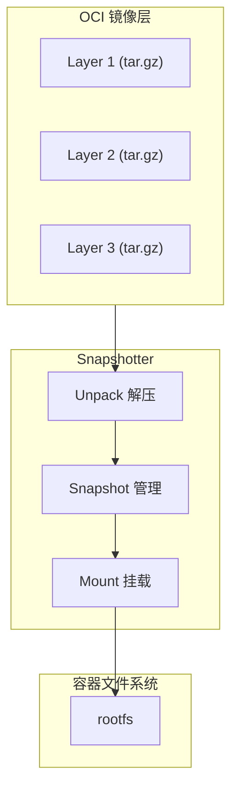
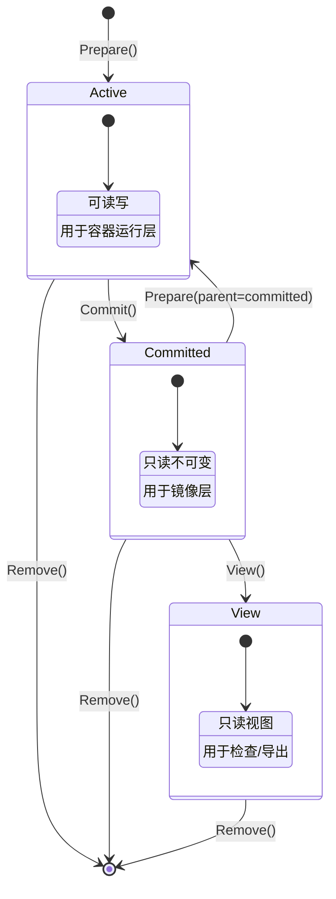
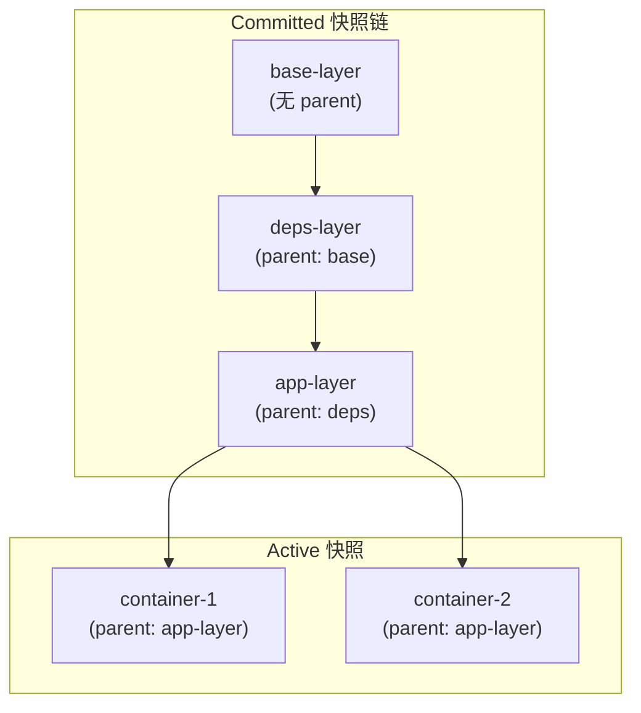
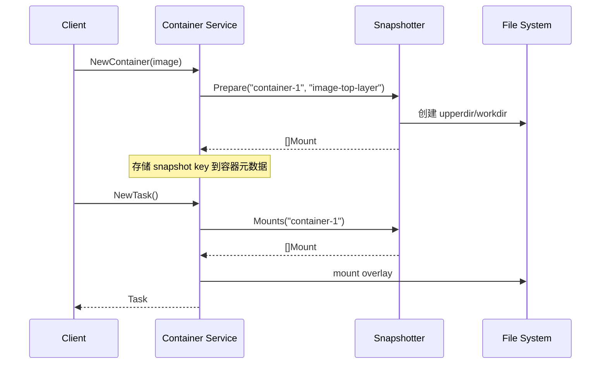
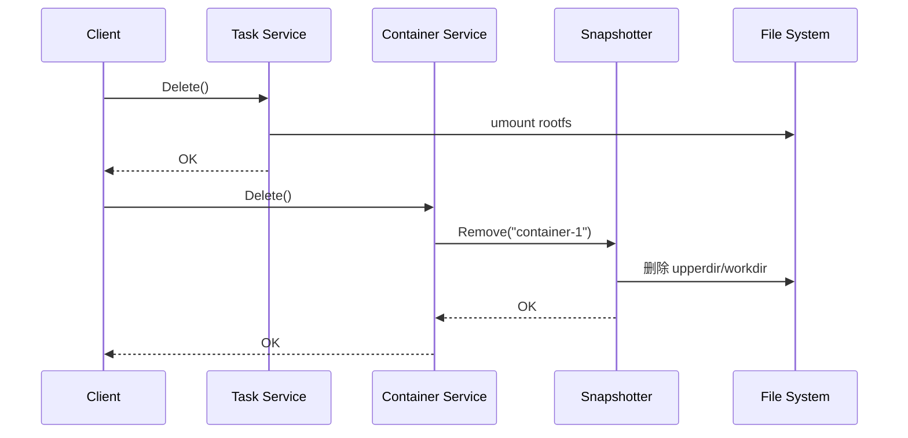
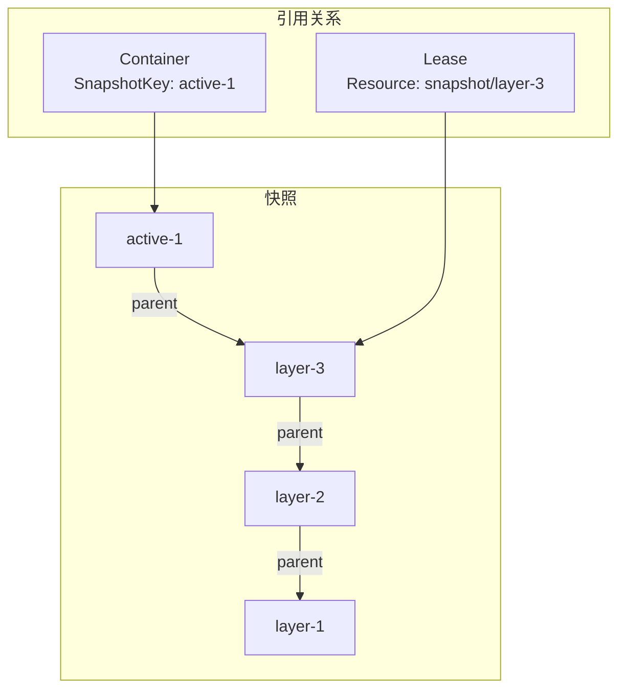

Snapshotter 是 containerd 管理容器文件系统层的核心组件。它抽象了不同的存储后端（OverlayFS、Btrfs、DeviceMapper 等），提供统一的快照管理接口。

## Snapshotter 概述

### 什么是 Snapshotter

Snapshotter 负责管理容器的文件系统快照，它将镜像层转换为可用的文件系统挂载点：



### 核心职责

1. **层管理**：将镜像层解压为快照
2. **挂载点**：提供容器的根文件系统挂载
3. **Copy-on-Write**：实现写时复制
4. **空间效率**：多容器共享只读层

## 快照类型

Snapshotter 定义了三种快照类型：



### Active 快照

- **可读写**：容器可以修改文件
- **临时性**：容器删除后清理
- **用途**：容器的可写层

```go
// 创建 Active 快照
mounts, err := snapshotter.Prepare(ctx, "container-1-layer", "image-layer-3")
```

### Committed 快照

- **只读**：内容不可修改
- **持久化**：作为镜像层保存
- **可共享**：多个 Active 快照可以基于同一个 Committed

```go
// 将 Active 提交为 Committed
err := snapshotter.Commit(ctx, "image-layer-4", "container-1-layer")
```

### View 快照

- **只读视图**：用于检查内容
- **不能 Commit**：纯粹的只读访问
- **用途**：镜像导出、内容检查

```go
// 创建只读视图
mounts, err := snapshotter.View(ctx, "view-1", "image-layer-3")
```

## 核心接口

### Snapshotter 接口定义

```go
// core/snapshots/snapshotter.go

type Snapshotter interface {
    // Stat 返回快照信息
    Stat(ctx context.Context, key string) (Info, error)

    // Update 更新快照信息（如 Labels）
    Update(ctx context.Context, info Info, fieldpaths ...string) (Info, error)

    // Usage 返回快照的磁盘使用情况
    Usage(ctx context.Context, key string) (Usage, error)

    // Mounts 返回快照的挂载点配置
    Mounts(ctx context.Context, key string) ([]mount.Mount, error)

    // Prepare 创建 Active 快照
    Prepare(ctx context.Context, key, parent string, opts ...Opt) ([]mount.Mount, error)

    // View 创建只读视图
    View(ctx context.Context, key, parent string, opts ...Opt) ([]mount.Mount, error)

    // Commit 将 Active 快照提交为 Committed
    Commit(ctx context.Context, name, key string, opts ...Opt) error

    // Remove 删除快照
    Remove(ctx context.Context, key string) error

    // Walk 遍历所有快照
    Walk(ctx context.Context, fn WalkFunc, filters ...string) error

    // Close 关闭 Snapshotter
    Close() error
}
```

### Info 结构

```go
// Info 描述快照信息
type Info struct {
    Kind    Kind              // Active, Committed, View
    Name    string            // 快照名称/key
    Parent  string            // 父快照
    Labels  map[string]string // 标签
    Created time.Time         // 创建时间
    Updated time.Time         // 更新时间
}

// Kind 快照类型
type Kind uint8

const (
    KindUnknown Kind = iota
    KindView        // 只读视图
    KindActive      // 可写快照
    KindCommitted   // 已提交快照
)
```

### Usage 结构

```go
// Usage 描述磁盘使用
type Usage struct {
    Inodes int64 // inode 数量
    Size   int64 // 字节大小
}
```

### Mount 结构

```go
// mount/mount.go

type Mount struct {
    Type    string   // 挂载类型 (overlay, bind, etc.)
    Source  string   // 源路径
    Target  string   // 目标路径（通常由调用者设置）
    Options []string // 挂载选项
}
```

## 快照层级关系

### Parent-Child 链



### 示例：镜像解压到快照

```go
func unpackImage(ctx context.Context, sn snapshots.Snapshotter, layers []ocispec.Descriptor) error {
    var parent string

    for i, layer := range layers {
        key := fmt.Sprintf("extract-%d-%s", i, layer.Digest.Encoded()[:12])
        name := fmt.Sprintf("layer-%d", i)

        // 创建 Active 快照
        mounts, err := sn.Prepare(ctx, key, parent)
        if err != nil {
            return err
        }

        // 挂载并解压层内容
        if err := mount.WithTempMount(ctx, mounts, func(root string) error {
            return extractLayer(layer, root)
        }); err != nil {
            sn.Remove(ctx, key)
            return err
        }

        // 提交为 Committed
        if err := sn.Commit(ctx, name, key); err != nil {
            return err
        }

        parent = name
    }

    return nil
}
```

## 挂载点生成

### Overlay 挂载示例

```go
// 对于 3 层镜像 + 1 层容器
// parent chain: layer-0 <- layer-1 <- layer-2 <- container-layer

mounts := []mount.Mount{
    {
        Type:   "overlay",
        Source: "overlay",
        Options: []string{
            "workdir=/var/lib/containerd/.../work",
            "upperdir=/var/lib/containerd/.../snapshots/container-layer/fs",
            "lowerdir=/var/lib/containerd/.../snapshots/layer-2/fs:" +
                     "/var/lib/containerd/.../snapshots/layer-1/fs:" +
                     "/var/lib/containerd/.../snapshots/layer-0/fs",
        },
    },
}
```

### 单层挂载（Bind Mount）

```go
// 只有一个 Committed 层，没有 upperdir
mounts := []mount.Mount{
    {
        Type:   "bind",
        Source: "/var/lib/containerd/.../snapshots/layer-0/fs",
        Options: []string{"ro", "rbind"},
    },
}
```

## 实际使用流程

### 容器创建流程



### 容器删除流程



## Labels 标签系统

### 常用标签

| 标签 | 说明 |
|------|------|
| `containerd.io/snapshot.ref` | 快照的内容引用 |
| `containerd.io/gc.root` | GC 根标记 |
| `containerd.io/snapshot/overlay.upperdir` | Overlay upperdir 路径 |

### 使用标签

```go
// 创建带标签的快照
mounts, err := snapshotter.Prepare(ctx, key, parent,
    snapshots.WithLabels(map[string]string{
        "my-label": "my-value",
    }),
)

// 更新标签
info, err := snapshotter.Update(ctx, snapshots.Info{
    Name: key,
    Labels: map[string]string{
        "new-label": "new-value",
    },
}, "labels.new-label")
```

## 垃圾回收

### 快照引用

快照通过以下方式被引用：

1. **容器引用**：容器的 snapshot key
2. **父子关系**：子快照引用父快照
3. **Lease 保护**：通过 Lease 显式保护



### GC 行为

```go
// GC 会删除未被引用的快照
// 删除顺序：叶子节点优先

// 例如：删除 container 后
// 1. active-1 变为无引用
// 2. GC 删除 active-1
// 3. 如果 layer-3 无其他引用，也会被删除
// 4. 依此类推
```

## Snapshotter 实现对比

| 实现 | 存储后端 | 优势 | 劣势 |
|------|----------|------|------|
| Overlay | OverlayFS | 性能好、广泛支持 | 需要内核支持 |
| Native | 目录复制 | 兼容性最好 | 空间效率低 |
| Btrfs | Btrfs 快照 | 原生 CoW | 需要 Btrfs |
| DevMapper | 块设备 | 适合大规模 | 配置复杂 |
| ZFS | ZFS 快照 | 功能强大 | 需要 ZFS |

## 小结

Snapshotter 的核心要点：

1. **三种快照类型**：Active（可写）、Committed（只读）、View（视图）
2. **层级关系**：Parent-Child 链实现镜像层叠加
3. **挂载抽象**：统一的 Mount 接口
4. **存储后端**：可插拔的不同实现

理解 Snapshotter 有助于：
- 理解容器文件系统管理
- 选择合适的存储后端
- 排查快照相关问题

下一节我们将学习 [Overlay Snapshotter 实现](./02-overlay-snapshotter.md)。

## 参考资料

- [containerd Snapshotter Design](https://github.com/containerd/containerd/blob/main/docs/snapshotters/README.md)
- [containerd Snapshotter Interface](https://pkg.go.dev/github.com/containerd/containerd/v2/core/snapshots)
