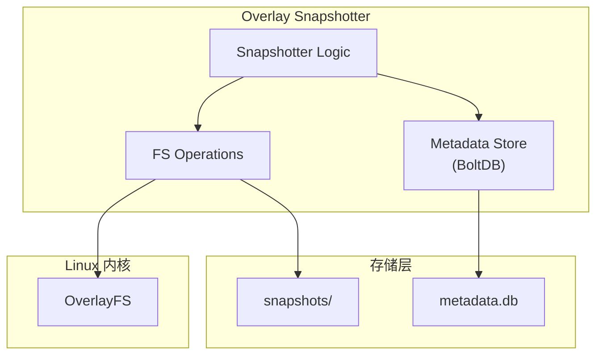

Overlay Snapshotter 是 containerd 在 Linux 上的默认快照器，它基于 OverlayFS 实现高效的容器文件系统管理。

## Overlay Snapshotter 架构

### 目录结构

```
/var/lib/containerd/io.containerd.snapshotter.v1.overlayfs/
├── metadata.db              # BoltDB 元数据存储
└── snapshots/
    ├── 1/                   # 快照 ID 目录
    │   ├── fs/              # 层内容
    │   └── work/            # OverlayFS workdir（仅 Active）
    ├── 2/
    │   └── fs/
    └── 3/
        ├── fs/
        └── work/
```

### 组件关系



## 初始化过程

### Snapshotter 创建

```go
// plugins/snapshots/overlay/overlay.go

type snapshotter struct {
    root         string           // 根目录
    ms           *storage.MetaStore // 元数据存储
    asyncRemove  bool             // 异步删除
    upperdirLabel bool            // 是否记录 upperdir 标签
    options      options          // 挂载选项
}

func NewSnapshotter(root string, opts ...Opt) (snapshots.Snapshotter, error) {
    // 应用选项
    var config options
    for _, opt := range opts {
        opt(&config)
    }

    // 创建目录结构
    if err := os.MkdirAll(root, 0700); err != nil {
        return nil, err
    }
    if err := os.MkdirAll(filepath.Join(root, "snapshots"), 0700); err != nil {
        return nil, err
    }

    // 打开元数据存储
    ms, err := storage.NewMetaStore(filepath.Join(root, "metadata.db"))
    if err != nil {
        return nil, err
    }

    // 检查 OverlayFS 支持
    if err := supported(root); err != nil {
        return nil, err
    }

    return &snapshotter{
        root:    root,
        ms:      ms,
        options: config,
    }, nil
}
```

### 支持性检查

```go
// 检查系统是否支持 OverlayFS
func supported(root string) error {
    // 创建临时目录测试
    testdir := filepath.Join(root, ".test-overlayfs")
    if err := os.MkdirAll(testdir, 0700); err != nil {
        return err
    }
    defer os.RemoveAll(testdir)

    lower := filepath.Join(testdir, "lower")
    upper := filepath.Join(testdir, "upper")
    work := filepath.Join(testdir, "work")
    merged := filepath.Join(testdir, "merged")

    for _, d := range []string{lower, upper, work, merged} {
        if err := os.MkdirAll(d, 0700); err != nil {
            return err
        }
    }

    // 尝试挂载
    opts := fmt.Sprintf("lowerdir=%s,upperdir=%s,workdir=%s", lower, upper, work)
    if err := unix.Mount("overlay", merged, "overlay", 0, opts); err != nil {
        return fmt.Errorf("overlayfs not supported: %w", err)
    }

    return unix.Unmount(merged, 0)
}
```

## Prepare 实现

### 创建 Active 快照

```go
func (o *snapshotter) Prepare(ctx context.Context, key, parent string, opts ...snapshots.Opt) ([]mount.Mount, error) {
    return o.createSnapshot(ctx, snapshots.KindActive, key, parent, opts)
}

func (o *snapshotter) createSnapshot(ctx context.Context, kind snapshots.Kind, key, parent string, opts []snapshots.Opt) ([]mount.Mount, error) {
    // 解析选项
    var base snapshots.Info
    for _, opt := range opts {
        opt(&base)
    }

    // 开启事务
    ctx, done, err := o.ms.TransactionContext(ctx, true)
    if err != nil {
        return nil, err
    }
    defer done(err)

    // 创建快照记录
    s, err := storage.CreateSnapshot(ctx, kind, key, parent, opts...)
    if err != nil {
        return nil, err
    }

    // 创建目录
    snapshotDir := o.snapshotDir(s.ID)
    if err := os.MkdirAll(filepath.Join(snapshotDir, "fs"), 0755); err != nil {
        return nil, err
    }

    // Active 需要 work 目录
    if kind == snapshots.KindActive {
        if err := os.MkdirAll(filepath.Join(snapshotDir, "work"), 0711); err != nil {
            return nil, err
        }
    }

    // 生成挂载点
    return o.mounts(ctx, s, key)
}
```

### 生成挂载点

```go
func (o *snapshotter) mounts(ctx context.Context, s storage.Snapshot, key string) ([]mount.Mount, error) {
    // 收集所有父快照路径
    var parents []string
    if s.ParentIDs != nil {
        for _, id := range s.ParentIDs {
            parents = append(parents, o.upperPath(id))
        }
    }

    // 根据快照类型和父层数量选择挂载方式
    if len(parents) == 0 {
        // 无父层：bind mount
        return o.bindMount(s)
    }

    if s.Kind == snapshots.KindActive {
        // Active：完整 overlay mount
        return o.overlayMount(s, parents)
    }

    // Committed/View：只读 overlay
    return o.readonlyOverlayMount(s, parents)
}

func (o *snapshotter) overlayMount(s storage.Snapshot, parents []string) ([]mount.Mount, error) {
    snapshotDir := o.snapshotDir(s.ID)
    upperdir := filepath.Join(snapshotDir, "fs")
    workdir := filepath.Join(snapshotDir, "work")

    // 构建 lowerdir 选项（父层从近到远）
    lowerdir := strings.Join(parents, ":")

    options := []string{
        fmt.Sprintf("workdir=%s", workdir),
        fmt.Sprintf("upperdir=%s", upperdir),
        fmt.Sprintf("lowerdir=%s", lowerdir),
    }

    // 添加额外选项
    if o.options.mountOptions != "" {
        options = append(options, o.options.mountOptions)
    }

    return []mount.Mount{
        {
            Type:    "overlay",
            Source:  "overlay",
            Options: options,
        },
    }, nil
}

func (o *snapshotter) bindMount(s storage.Snapshot) ([]mount.Mount, error) {
    roFlag := ""
    if s.Kind != snapshots.KindActive {
        roFlag = "ro"
    }

    options := []string{"rbind"}
    if roFlag != "" {
        options = append(options, roFlag)
    }

    return []mount.Mount{
        {
            Type:    "bind",
            Source:  o.upperPath(s.ID),
            Options: options,
        },
    }, nil
}
```

## Commit 实现

### 将 Active 提交为 Committed

```go
func (o *snapshotter) Commit(ctx context.Context, name, key string, opts ...snapshots.Opt) error {
    ctx, done, err := o.ms.TransactionContext(ctx, true)
    if err != nil {
        return err
    }
    defer done(err)

    // 获取当前快照
    id, info, _, err := storage.GetInfo(ctx, key)
    if err != nil {
        return err
    }

    // 验证是 Active 类型
    if info.Kind != snapshots.KindActive {
        return fmt.Errorf("cannot commit non-active snapshot %s: %w", key, errdefs.ErrFailedPrecondition)
    }

    // 删除 work 目录（Committed 不需要）
    workDir := filepath.Join(o.snapshotDir(id), "work")
    if err := os.RemoveAll(workDir); err != nil {
        return err
    }

    // 更新元数据
    _, err = storage.CommitActive(ctx, key, name, snapshots.Usage{}, opts...)
    return err
}
```

## View 实现

```go
func (o *snapshotter) View(ctx context.Context, key, parent string, opts ...snapshots.Opt) ([]mount.Mount, error) {
    return o.createSnapshot(ctx, snapshots.KindView, key, parent, opts)
}
```

View 与 Prepare 类似，但：
- 不创建 work 目录
- 生成只读挂载点
- 不能用于 Commit

## Remove 实现

### 同步删除

```go
func (o *snapshotter) Remove(ctx context.Context, key string) error {
    ctx, done, err := o.ms.TransactionContext(ctx, true)
    if err != nil {
        return err
    }
    defer done(err)

    // 获取快照信息
    id, _, err := storage.Remove(ctx, key)
    if err != nil {
        return err
    }

    // 删除目录
    snapshotDir := o.snapshotDir(id)
    if err := os.RemoveAll(snapshotDir); err != nil && !os.IsNotExist(err) {
        return err
    }

    return nil
}
```

### 异步删除

```go
// 启用异步删除时
func (o *snapshotter) Remove(ctx context.Context, key string) error {
    // ...获取快照信息...

    if o.asyncRemove {
        // 重命名目录，稍后异步删除
        renamed := filepath.Join(o.root, "snapshots", "rm-"+id)
        if err := os.Rename(snapshotDir, renamed); err != nil {
            return err
        }

        // 异步删除
        go func() {
            os.RemoveAll(renamed)
        }()

        return nil
    }

    // 同步删除
    return os.RemoveAll(snapshotDir)
}
```

## 元数据存储

### BoltDB 结构

```go
// core/snapshots/storage/bolt.go

// Bucket 结构
// v1/
//   snapshots/
//     <key>/
//       id -> uint64
//       parent -> string
//       kind -> uint8
//       labels -> map[string]string
//       created -> timestamp
//       updated -> timestamp
//   parents/
//     <id>/
//       <child-id> -> nil
```

### 存储操作

```go
// CreateSnapshot 创建快照记录
func CreateSnapshot(ctx context.Context, kind snapshots.Kind, key, parent string, opts ...snapshots.Opt) (Snapshot, error) {
    // 分配新 ID
    id, err := nextID(ctx)
    if err != nil {
        return Snapshot{}, err
    }

    // 获取父快照的 parent 链
    var parentIDs []string
    if parent != "" {
        parentSnap, err := GetSnapshot(ctx, parent)
        if err != nil {
            return Snapshot{}, err
        }
        parentIDs = append([]string{parentSnap.ID}, parentSnap.ParentIDs...)
    }

    // 保存到 BoltDB
    snap := Snapshot{
        ID:        id,
        ParentIDs: parentIDs,
        Kind:      kind,
    }

    // ...保存...

    return snap, nil
}
```

## 挂载选项

### 常用选项

| 选项 | 说明 | 默认值 |
|------|------|--------|
| `index=off` | 禁用 index 特性 | on |
| `userxattr` | 用户扩展属性（rootless） | off |
| `volatile` | 跳过同步（提高性能） | off |
| `metacopy=on` | 只复制元数据 | off |

### 配置示例

```toml
# /etc/containerd/config.toml

[plugins."io.containerd.snapshotter.v1.overlayfs"]
  root_path = "/var/lib/containerd/io.containerd.snapshotter.v1.overlayfs"
  # 挂载选项
  mount_options = ["index=off", "metacopy=on"]
  # 是否启用异步删除
  async_remove = true
  # 是否记录 upperdir 标签
  upperdir_label = false
```

## ID-Mapped Mounts

### Rootless 容器支持

```go
// plugins/snapshots/overlay/overlay.go

func (o *snapshotter) withUsernsRemapMount(ctx context.Context, mounts []mount.Mount) ([]mount.Mount, error) {
    // 检查是否需要 user namespace 映射
    usernsPath := namespaces.UsernsPath(ctx)
    if usernsPath == "" {
        return mounts, nil
    }

    // 获取 userns fd
    f, err := os.Open(usernsPath)
    if err != nil {
        return nil, err
    }
    defer f.Close()

    // 添加 ID 映射选项
    for i := range mounts {
        mounts[i].Options = append(mounts[i].Options,
            fmt.Sprintf("userxattr"),
            fmt.Sprintf("idmap=%d", f.Fd()),
        )
    }

    return mounts, nil
}
```

## 性能优化

### 1. 异步删除

```go
// 避免删除大快照时阻塞
o := overlay.NewSnapshotter(root, overlay.WithAsyncRemove)
```

### 2. metacopy 选项

```bash
# 只复制元数据，延迟复制文件内容
mount -t overlay overlay -o metacopy=on,lowerdir=...,upperdir=...,workdir=... /merged
```

### 3. volatile 选项

```bash
# 跳过同步操作，提高性能（牺牲一致性）
mount -t overlay overlay -o volatile,lowerdir=...,upperdir=...,workdir=... /merged
```

## 常见问题

### 问题 1: "invalid argument" 挂载失败

**原因**：lowerdir 层数超过限制（默认 128 层）

**解决**：
1. 减少镜像层数
2. 升级内核（4.19+ 支持更多层）

### 问题 2: "no such device" 挂载失败

**原因**：OverlayFS 内核模块未加载

**解决**：
```bash
modprobe overlay
```

### 问题 3: 权限问题

**原因**：SELinux 或 AppArmor 限制

**解决**：
```bash
# 临时禁用（测试用）
setenforce 0

# 或添加 SELinux 标签
chcon -Rt svirt_sandbox_file_t /var/lib/containerd
```

## 小结

Overlay Snapshotter 的关键点：

1. **目录结构**：每个快照 ID 对应一个目录
2. **元数据**：使用 BoltDB 存储快照信息
3. **挂载生成**：根据父层链生成 overlay 挂载选项
4. **性能优化**：异步删除、metacopy 等

代码阅读建议：
1. 从 `Prepare` 入口开始
2. 跟踪 `mounts` 函数理解挂载点生成
3. 查看 `storage` 包理解元数据管理

下一节我们将学习 [Snapshotter 代码走读](./03-code-walkthrough.md)。
