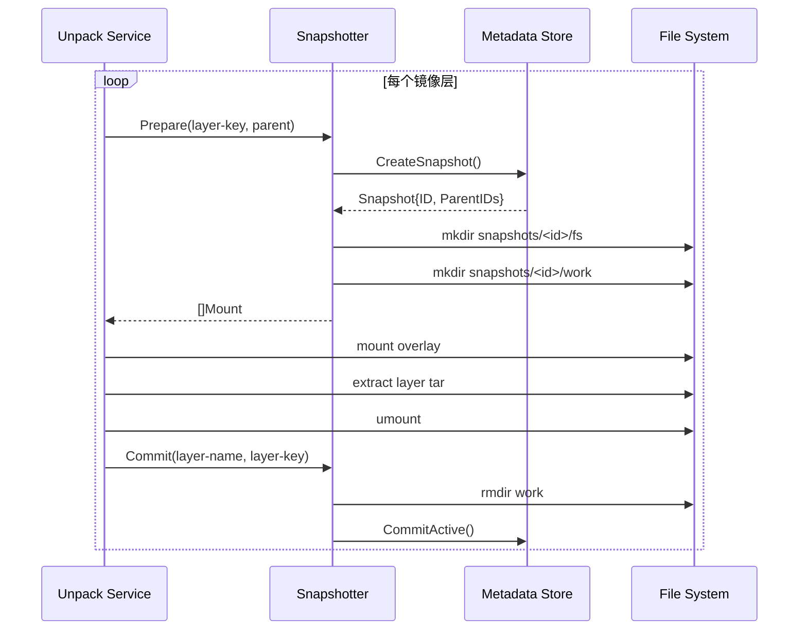
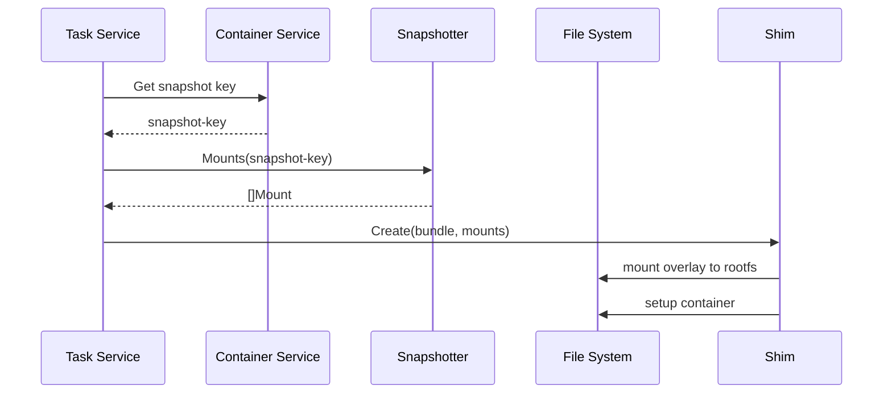

本章深入分析 Snapshotter 的源码实现，帮助你理解快照管理的内部工作机制。

## 代码结构

```
containerd/
├── core/snapshots/
│   ├── snapshotter.go      # 核心接口定义
│   ├── proxy/              # 代理实现（远程 snapshotter）
│   └── storage/            # 元数据存储
│       ├── bolt.go         # BoltDB 存储
│       └── metastore.go    # 存储接口
├── plugins/snapshots/
│   ├── overlay/            # Overlay 实现
│   │   ├── overlay.go      # 主实现
│   │   └── plugin.go       # 插件注册
│   ├── native/             # Native 实现
│   └── btrfs/              # Btrfs 实现
└── plugins/services/snapshots/
    └── service.go          # gRPC 服务
```

## 接口定义分析

### snapshotter.go

```go
// core/snapshots/snapshotter.go

// Snapshotter 管理容器文件系统快照
type Snapshotter interface {
    // Stat 返回快照信息
    // key: 快照标识符
    Stat(ctx context.Context, key string) (Info, error)

    // Update 更新快照元数据
    // fieldpaths: 指定要更新的字段，如 "labels.foo"
    Update(ctx context.Context, info Info, fieldpaths ...string) (Info, error)

    // Usage 返回快照磁盘使用量
    // 注意：可能包含与父快照共享的数据
    Usage(ctx context.Context, key string) (Usage, error)

    // Mounts 返回挂载该快照所需的挂载配置
    // 调用者负责实际执行挂载
    Mounts(ctx context.Context, key string) ([]mount.Mount, error)

    // Prepare 创建新的 Active 快照
    // key: 新快照标识符
    // parent: 父快照（可为空）
    // 返回挂载配置
    Prepare(ctx context.Context, key, parent string, opts ...Opt) ([]mount.Mount, error)

    // View 创建只读视图
    // 与 Prepare 类似，但返回只读挂载
    View(ctx context.Context, key, parent string, opts ...Opt) ([]mount.Mount, error)

    // Commit 将 Active 快照提交为 Committed
    // name: Committed 快照的新名称
    // key: 要提交的 Active 快照
    Commit(ctx context.Context, name, key string, opts ...Opt) error

    // Remove 删除快照
    // 如果有子快照依赖，会返回错误
    Remove(ctx context.Context, key string) error

    // Walk 遍历所有快照
    // fn: 对每个快照调用的回调
    Walk(ctx context.Context, fn WalkFunc, filters ...string) error

    // Close 清理资源
    Close() error
}
```

**关键点**：
- `Prepare` 和 `View` 返回挂载配置，不执行挂载
- `Commit` 将临时的 Active 转为持久的 Committed
- `key` 是用户定义的标识符，内部使用数字 ID

## Overlay Snapshotter 实现

### 核心数据结构

```go
// plugins/snapshots/overlay/overlay.go

type snapshotter struct {
    root          string                // 存储根目录
    ms            *storage.MetaStore    // 元数据存储
    asyncRemove   bool                  // 是否异步删除
    upperdirLabel bool                  // 是否添加 upperdir 标签
    indexOff      bool                  // 是否禁用 overlay index
    userxattr     bool                  // 是否使用用户扩展属性
}

// 选项函数
type Opt func(*snapshotter) error

func WithAsyncRemove(s *snapshotter) error {
    s.asyncRemove = true
    return nil
}
```

### Prepare 实现详解

```go
func (o *snapshotter) Prepare(ctx context.Context, key, parent string, opts ...snapshots.Opt) ([]mount.Mount, error) {
    // 调用通用创建函数，指定类型为 Active
    return o.createSnapshot(ctx, snapshots.KindActive, key, parent, opts)
}

func (o *snapshotter) createSnapshot(ctx context.Context, kind snapshots.Kind, key, parent string, opts []snapshots.Opt) ([]mount.Mount, error) {
    // 1. 解析选项
    var base snapshots.Info
    for _, opt := range opts {
        if err := opt(&base); err != nil {
            return nil, err
        }
    }

    // 2. 开启数据库事务
    ctx, t, err := o.ms.TransactionContext(ctx, true)
    if err != nil {
        return nil, err
    }

    // 3. 在元数据存储中创建快照记录
    s, err := storage.CreateSnapshot(ctx, kind, key, parent, opts...)
    if err != nil {
        t.Rollback()
        return nil, fmt.Errorf("failed to create snapshot: %w", err)
    }

    // 4. 创建文件系统目录
    snapshotDir := filepath.Join(o.root, "snapshots", s.ID)

    // fs 目录存放实际内容
    if err := os.MkdirAll(filepath.Join(snapshotDir, "fs"), 0755); err != nil {
        t.Rollback()
        return nil, err
    }

    // Active 快照需要 work 目录（overlay 要求）
    if kind == snapshots.KindActive {
        if err := os.MkdirAll(filepath.Join(snapshotDir, "work"), 0711); err != nil {
            t.Rollback()
            return nil, err
        }
    }

    // 5. 提交事务
    if err := t.Commit(); err != nil {
        // 清理已创建的目录
        os.RemoveAll(snapshotDir)
        return nil, err
    }

    // 6. 生成挂载配置
    return o.mounts(ctx, s, key)
}
```

**调试断点建议**：
- 第 2 步：观察事务创建
- 第 3 步：观察元数据记录
- 第 6 步：观察挂载配置生成

### mounts 实现详解

```go
func (o *snapshotter) mounts(ctx context.Context, s storage.Snapshot, key string) ([]mount.Mount, error) {
    // 构建父快照路径列表
    var options []string

    // 收集所有父快照的 fs 目录
    // ParentIDs 按从近到远排序
    if len(s.ParentIDs) > 0 {
        var lowerPaths []string
        for _, id := range s.ParentIDs {
            lowerPaths = append(lowerPaths, filepath.Join(o.root, "snapshots", id, "fs"))
        }

        // 构建 lowerdir 选项
        options = append(options, fmt.Sprintf("lowerdir=%s", strings.Join(lowerPaths, ":")))
    }

    // 根据快照类型生成不同的挂载配置
    snapshotDir := filepath.Join(o.root, "snapshots", s.ID)

    if s.Kind == snapshots.KindActive {
        // Active: 需要 upperdir 和 workdir
        options = append(options,
            fmt.Sprintf("upperdir=%s", filepath.Join(snapshotDir, "fs")),
            fmt.Sprintf("workdir=%s", filepath.Join(snapshotDir, "work")),
        )
    }

    // 没有父快照：使用 bind mount
    if len(s.ParentIDs) == 0 {
        roFlag := ""
        if s.Kind != snapshots.KindActive {
            roFlag = "ro,"
        }
        return []mount.Mount{
            {
                Type:    "bind",
                Source:  filepath.Join(snapshotDir, "fs"),
                Options: []string{roFlag + "rbind"},
            },
        }, nil
    }

    // 有父快照：使用 overlay mount
    if o.indexOff {
        options = append(options, "index=off")
    }
    if o.userxattr {
        options = append(options, "userxattr")
    }

    return []mount.Mount{
        {
            Type:    "overlay",
            Source:  "overlay",
            Options: options,
        },
    }, nil
}
```

## 元数据存储分析

### MetaStore 接口

```go
// core/snapshots/storage/metastore.go

type MetaStore struct {
    db *bolt.DB
}

func NewMetaStore(path string) (*MetaStore, error) {
    db, err := bolt.Open(path, 0644, &bolt.Options{
        Timeout: 1 * time.Second,
    })
    if err != nil {
        return nil, err
    }

    return &MetaStore{db: db}, nil
}
```

### 数据结构

```go
// core/snapshots/storage/bolt.go

// BoltDB bucket 结构
const (
    bucketKeyVersion    = "v1"
    bucketKeySnapshots  = "snapshots"
    bucketKeyParents    = "parents"
)

// 快照记录
type Snapshot struct {
    ID        string    // 内部数字 ID（转为字符串）
    ParentIDs []string  // 父快照 ID 链
    Kind      snapshots.Kind
    // 元数据存储在 Info 中
}
```

### CreateSnapshot 实现

```go
// core/snapshots/storage/bolt.go

func CreateSnapshot(ctx context.Context, kind snapshots.Kind, key, parent string, opts ...snapshots.Opt) (Snapshot, error) {
    // 从 context 获取事务
    tx := GetTransaction(ctx)

    // 获取或创建 bucket
    bkt, err := tx.CreateBucketIfNotExists([]byte(bucketKeySnapshots))
    if err != nil {
        return Snapshot{}, err
    }

    // 检查 key 是否已存在
    if bkt.Get([]byte(key)) != nil {
        return Snapshot{}, fmt.Errorf("snapshot %q: %w", key, errdefs.ErrAlreadyExists)
    }

    // 分配新 ID
    id, err := bkt.NextSequence()
    if err != nil {
        return Snapshot{}, err
    }

    // 获取父快照的 ParentIDs
    var parentIDs []string
    if parent != "" {
        parentSnapshot, err := GetSnapshot(ctx, parent)
        if err != nil {
            return Snapshot{}, err
        }
        // 父快照的 ID 加入 ParentIDs 链首
        parentIDs = append([]string{parentSnapshot.ID}, parentSnapshot.ParentIDs...)
    }

    // 构建快照信息
    s := Snapshot{
        ID:        fmt.Sprintf("%d", id),
        ParentIDs: parentIDs,
        Kind:      kind,
    }

    // 序列化并存储
    data, err := json.Marshal(s)
    if err != nil {
        return Snapshot{}, err
    }

    if err := bkt.Put([]byte(key), data); err != nil {
        return Snapshot{}, err
    }

    // 更新父子关系索引
    if parent != "" {
        if err := addChild(tx, parentIDs[0], s.ID); err != nil {
            return Snapshot{}, err
        }
    }

    return s, nil
}
```

## gRPC 服务层

### 服务注册

```go
// plugins/services/snapshots/service.go

func init() {
    registry.Register(&plugin.Registration{
        Type: plugins.GRPCPlugin,
        ID:   "snapshots",
        Requires: []plugin.Type{
            plugins.ServicePlugin,
        },
        InitFn: func(ic *plugin.InitContext) (interface{}, error) {
            // 获取依赖的服务
            services, err := ic.GetByType(plugins.ServicePlugin)
            if err != nil {
                return nil, err
            }

            // 获取 snapshotter 服务
            ss := services[snapshots.Plugin].(map[string]snapshots.Snapshotter)

            return &service{
                snapshotters: ss,
            }, nil
        },
    })
}
```

### 服务实现

```go
type service struct {
    snapshotters map[string]snapshots.Snapshotter
}

func (s *service) Prepare(ctx context.Context, req *api.PrepareSnapshotRequest) (*api.PrepareSnapshotResponse, error) {
    // 获取指定的 snapshotter
    sn, ok := s.snapshotters[req.Snapshotter]
    if !ok {
        return nil, fmt.Errorf("snapshotter %q: %w", req.Snapshotter, errdefs.ErrNotFound)
    }

    // 解析选项
    var opts []snapshots.Opt
    if req.Labels != nil {
        opts = append(opts, snapshots.WithLabels(req.Labels))
    }

    // 调用 snapshotter
    mounts, err := sn.Prepare(ctx, req.Key, req.Parent, opts...)
    if err != nil {
        return nil, errdefs.ToGRPC(err)
    }

    return &api.PrepareSnapshotResponse{
        Mounts: fromMounts(mounts),
    }, nil
}
```

## 调试技巧

### 使用 ctr 调试

```bash
# 列出所有快照
ctr snapshots ls

# 查看快照信息
ctr snapshots info <key>

# 查看快照树
ctr snapshots tree

# 手动创建快照
ctr snapshots prepare test-snapshot ""

# 提交快照
ctr snapshots commit committed-snapshot test-snapshot

# 删除快照
ctr snapshots rm test-snapshot
```

### 使用 Delve 调试

```bash
# 设置断点
dlv exec ./bin/containerd -- --config /etc/containerd/config.toml

(dlv) b plugins/snapshots/overlay/overlay.go:150  # Prepare
(dlv) b core/snapshots/storage/bolt.go:100       # CreateSnapshot
(dlv) continue

# 触发快照创建
ctr image pull docker.io/library/alpine:latest
```

### 关键断点位置

| 文件 | 函数 | 用途 |
|------|------|------|
| `plugins/snapshots/overlay/overlay.go` | `Prepare()` | 快照创建入口 |
| `plugins/snapshots/overlay/overlay.go` | `createSnapshot()` | 实际创建逻辑 |
| `plugins/snapshots/overlay/overlay.go` | `mounts()` | 挂载配置生成 |
| `plugins/snapshots/overlay/overlay.go` | `Commit()` | 提交逻辑 |
| `core/snapshots/storage/bolt.go` | `CreateSnapshot()` | 元数据存储 |

## 数据流跟踪

### 镜像解压到快照



### 容器启动时的快照使用



## 常见问题排查

### 问题 1: "snapshot already exists"

```go
// 发生在 CreateSnapshot
if bkt.Get([]byte(key)) != nil {
    return Snapshot{}, fmt.Errorf("snapshot %q: %w", key, errdefs.ErrAlreadyExists)
}
```

**排查**：
```bash
# 检查是否存在同名快照
ctr snapshots ls | grep <key>

# 删除旧快照
ctr snapshots rm <key>
```

### 问题 2: "snapshot has children"

```go
// 发生在 Remove
children, err := getChildren(tx, id)
if len(children) > 0 {
    return fmt.Errorf("snapshot has children: %w", errdefs.ErrFailedPrecondition)
}
```

**排查**：
```bash
# 查看快照树
ctr snapshots tree

# 先删除子快照
```

### 问题 3: 挂载失败

```bash
# 检查 overlay 模块
lsmod | grep overlay

# 检查挂载选项
mount | grep overlay

# 检查目录权限
ls -la /var/lib/containerd/io.containerd.snapshotter.v1.overlayfs/snapshots/
```

## 小结

Snapshotter 代码的关键路径：

1. **Prepare 入口**：`overlay.go:Prepare()` → `createSnapshot()`
2. **元数据创建**：`storage/bolt.go:CreateSnapshot()`
3. **目录创建**：创建 `fs/` 和 `work/` 目录
4. **挂载生成**：`overlay.go:mounts()` 构建挂载选项

调试建议：
1. 从 `Prepare` 开始跟踪
2. 注意事务的开启和提交
3. 理解 `ParentIDs` 链的构建

下一章我们将学习 [镜像管理模块](../05-image-management/01-image-model.md)。
