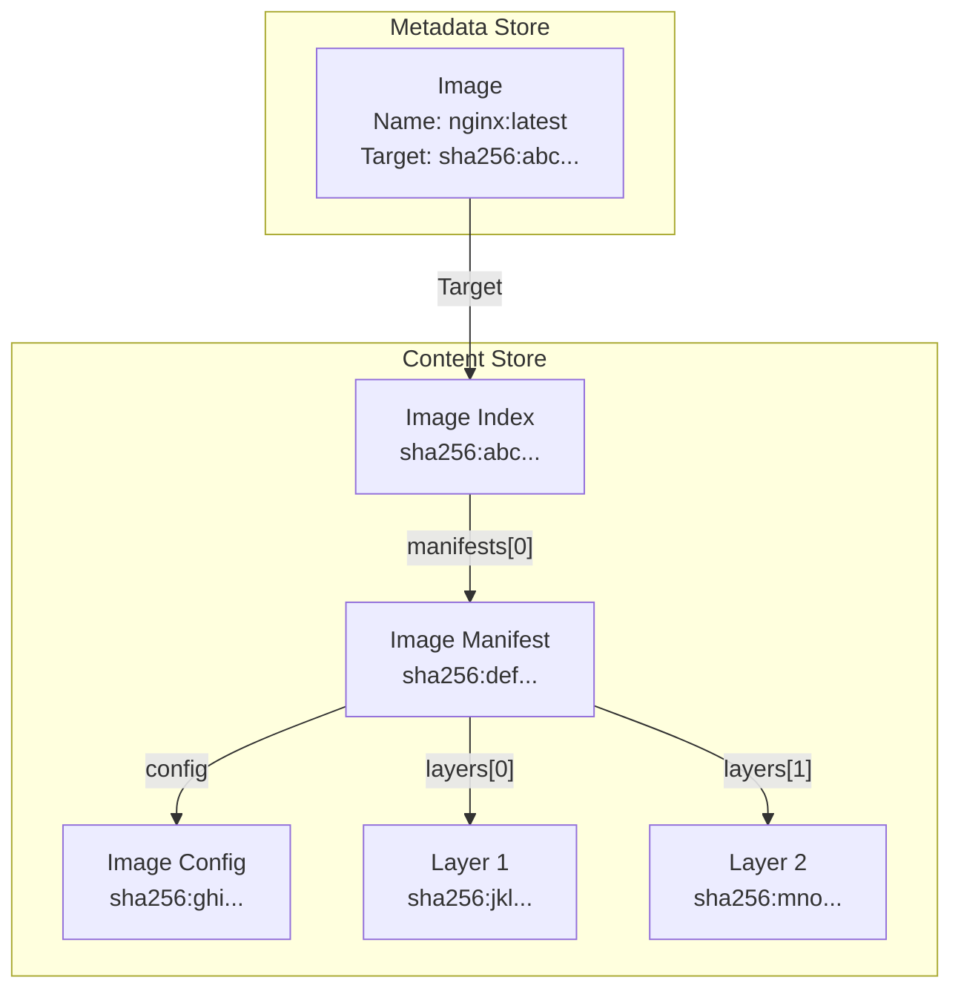
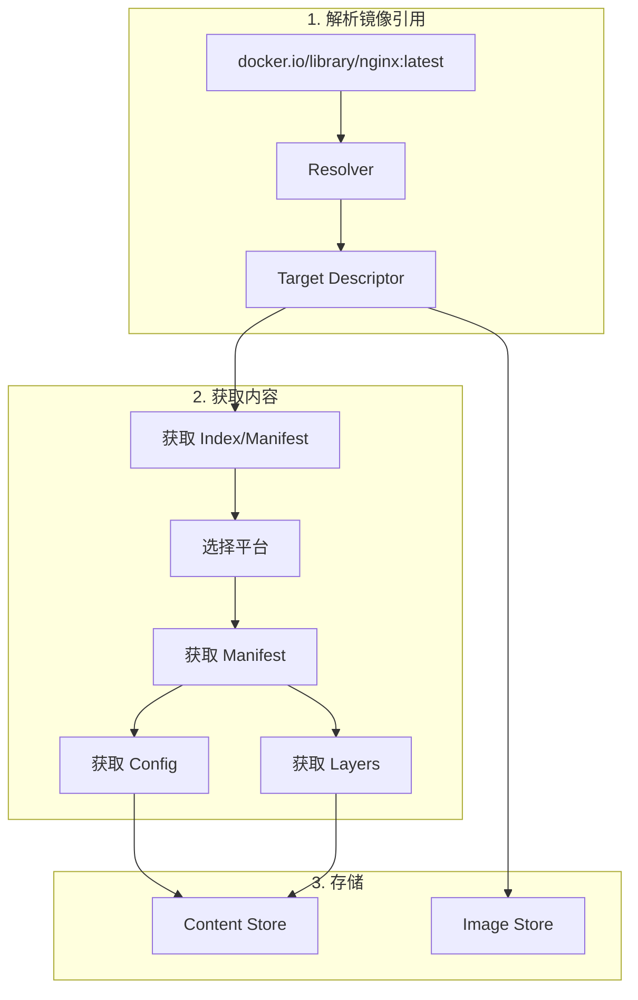
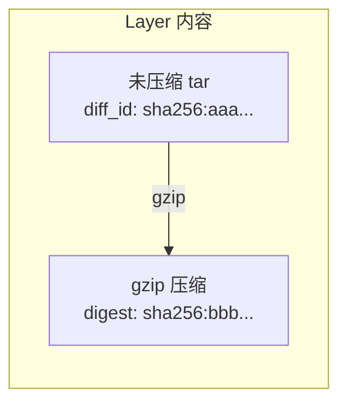

本章深入分析 containerd 的镜像管理模型，理解镜像在 containerd 中是如何表示和存储的。

## 镜像模型概述

### containerd Image 定义

```go
// core/images/image.go

// Image 表示一个容器镜像
type Image struct {
    // Name 镜像的完整引用名称
    // 例如: "docker.io/library/nginx:latest"
    Name string

    // Labels 用户定义的标签
    Labels map[string]string

    // Target 指向镜像内容的描述符
    // 通常是 Image Index 或 Image Manifest
    Target ocispec.Descriptor

    // CreatedAt 创建时间
    CreatedAt time.Time

    // UpdatedAt 更新时间
    UpdatedAt time.Time
}
```

### 镜像与内容的关系



## OCI Image 结构

### Image Index（多架构）

```json
{
  "schemaVersion": 2,
  "mediaType": "application/vnd.oci.image.index.v1+json",
  "manifests": [
    {
      "mediaType": "application/vnd.oci.image.manifest.v1+json",
      "digest": "sha256:def123...",
      "size": 1234,
      "platform": {
        "architecture": "amd64",
        "os": "linux"
      }
    },
    {
      "mediaType": "application/vnd.oci.image.manifest.v1+json",
      "digest": "sha256:ghi456...",
      "size": 1234,
      "platform": {
        "architecture": "arm64",
        "os": "linux"
      }
    }
  ]
}
```

### Image Manifest

```json
{
  "schemaVersion": 2,
  "mediaType": "application/vnd.oci.image.manifest.v1+json",
  "config": {
    "mediaType": "application/vnd.oci.image.config.v1+json",
    "digest": "sha256:config123...",
    "size": 2048
  },
  "layers": [
    {
      "mediaType": "application/vnd.oci.image.layer.v1.tar+gzip",
      "digest": "sha256:layer1...",
      "size": 10485760
    },
    {
      "mediaType": "application/vnd.oci.image.layer.v1.tar+gzip",
      "digest": "sha256:layer2...",
      "size": 5242880
    }
  ]
}
```

### Image Config

```json
{
  "architecture": "amd64",
  "os": "linux",
  "config": {
    "User": "app",
    "Env": ["PATH=/usr/local/bin:/usr/bin:/bin"],
    "Entrypoint": ["/app/server"],
    "Cmd": ["--config=/etc/app.yaml"],
    "WorkingDir": "/app",
    "ExposedPorts": {"8080/tcp": {}},
    "Labels": {"maintainer": "team@example.com"}
  },
  "rootfs": {
    "type": "layers",
    "diff_ids": [
      "sha256:uncompressed-layer1...",
      "sha256:uncompressed-layer2..."
    ]
  },
  "history": [
    {
      "created": "2024-01-30T10:00:00Z",
      "created_by": "/bin/sh -c #(nop) ADD file:... in /"
    }
  ]
}
```

## Descriptor 描述符

### 结构定义

```go
// github.com/opencontainers/image-spec/specs-go/v1

type Descriptor struct {
    // MediaType MIME 类型
    MediaType string `json:"mediaType,omitempty"`

    // Digest 内容摘要
    Digest digest.Digest `json:"digest"`

    // Size 内容大小（字节）
    Size int64 `json:"size"`

    // URLs 可选的下载地址
    URLs []string `json:"urls,omitempty"`

    // Annotations 注解
    Annotations map[string]string `json:"annotations,omitempty"`

    // Platform 平台信息（用于 Index）
    Platform *Platform `json:"platform,omitempty"`
}
```

### 常见 MediaType

| MediaType | 说明 |
|-----------|------|
| `application/vnd.oci.image.index.v1+json` | OCI Image Index |
| `application/vnd.oci.image.manifest.v1+json` | OCI Image Manifest |
| `application/vnd.oci.image.config.v1+json` | OCI Image Config |
| `application/vnd.oci.image.layer.v1.tar` | 未压缩层 |
| `application/vnd.oci.image.layer.v1.tar+gzip` | gzip 压缩层 |
| `application/vnd.oci.image.layer.v1.tar+zstd` | zstd 压缩层 |
| `application/vnd.docker.distribution.manifest.v2+json` | Docker Manifest |
| `application/vnd.docker.distribution.manifest.list.v2+json` | Docker Manifest List |

## Platform 平台信息

### 结构定义

```go
type Platform struct {
    // Architecture CPU 架构
    Architecture string `json:"architecture"`

    // OS 操作系统
    OS string `json:"os"`

    // OSVersion 操作系统版本（Windows）
    OSVersion string `json:"os.version,omitempty"`

    // OSFeatures 操作系统特性
    OSFeatures []string `json:"os.features,omitempty"`

    // Variant CPU 变体
    Variant string `json:"variant,omitempty"`
}
```

### 常见平台

| Architecture | OS | Variant | 说明 |
|--------------|------|---------|------|
| amd64 | linux | - | 64 位 x86 Linux |
| arm64 | linux | - | 64 位 ARM Linux |
| arm | linux | v7 | 32 位 ARM Linux |
| amd64 | windows | - | 64 位 Windows |

## Image Store 接口

### 接口定义

```go
// core/images/image.go

type Store interface {
    // Get 获取镜像
    Get(ctx context.Context, name string) (Image, error)

    // List 列出镜像
    List(ctx context.Context, filters ...string) ([]Image, error)

    // Create 创建镜像记录
    Create(ctx context.Context, image Image) (Image, error)

    // Update 更新镜像
    Update(ctx context.Context, image Image, fieldpaths ...string) (Image, error)

    // Delete 删除镜像
    Delete(ctx context.Context, name string, opts ...DeleteOpt) error
}
```

### 使用示例

```go
// 获取镜像
image, err := imageStore.Get(ctx, "docker.io/library/nginx:latest")
if err != nil {
    return err
}

// 列出镜像
images, err := imageStore.List(ctx, "name~=nginx")
if err != nil {
    return err
}

// 创建镜像
newImage := images.Image{
    Name:   "my-image:v1",
    Target: manifestDescriptor,
    Labels: map[string]string{
        "version": "1.0",
    },
}
created, err := imageStore.Create(ctx, newImage)
```

## 镜像内容遍历

### Handler 模式

containerd 使用 Handler 模式遍历镜像内容树：

```go
// core/images/handlers.go

// Handler 处理镜像内容
type Handler interface {
    Handle(ctx context.Context, desc ocispec.Descriptor) (subdescs []ocispec.Descriptor, err error)
}

// HandlerFunc 函数适配器
type HandlerFunc func(ctx context.Context, desc ocispec.Descriptor) ([]ocispec.Descriptor, error)
```

### 遍历示例

```go
// 遍历镜像所有内容
func walkImage(ctx context.Context, provider content.Provider, image images.Image) error {
    return images.Walk(ctx, images.Handlers(
        // 子描述符处理器
        images.ChildrenHandler(provider),
        // 自定义处理器
        images.HandlerFunc(func(ctx context.Context, desc ocispec.Descriptor) ([]ocispec.Descriptor, error) {
            fmt.Printf("Found: %s %s\n", desc.MediaType, desc.Digest)
            return nil, nil
        }),
    ), image.Target)
}
```

### ChildrenHandler

```go
// 返回描述符的子描述符
func ChildrenHandler(provider content.Provider) HandlerFunc {
    return func(ctx context.Context, desc ocispec.Descriptor) ([]ocispec.Descriptor, error) {
        // 读取内容
        p, err := content.ReadBlob(ctx, provider, desc)
        if err != nil {
            return nil, err
        }

        // 根据类型解析子描述符
        switch desc.MediaType {
        case ocispec.MediaTypeImageIndex, images.MediaTypeDockerSchema2ManifestList:
            var index ocispec.Index
            if err := json.Unmarshal(p, &index); err != nil {
                return nil, err
            }
            return index.Manifests, nil

        case ocispec.MediaTypeImageManifest, images.MediaTypeDockerSchema2Manifest:
            var manifest ocispec.Manifest
            if err := json.Unmarshal(p, &manifest); err != nil {
                return nil, err
            }
            return append([]ocispec.Descriptor{manifest.Config}, manifest.Layers...), nil
        }

        return nil, nil
    }
}
```

## 平台匹配

### 匹配器接口

```go
// platforms/platforms.go

type Matcher interface {
    Match(platform ocispec.Platform) bool
}

// 创建匹配器
matcher := platforms.Only(ocispec.Platform{
    OS:           "linux",
    Architecture: "amd64",
})

// 检查匹配
if matcher.Match(candidatePlatform) {
    // 平台匹配
}
```

### 平台选择

```go
// 从 Index 中选择匹配的 Manifest
func selectManifest(ctx context.Context, provider content.Provider, index ocispec.Index, platform ocispec.Platform) (ocispec.Descriptor, error) {
    matcher := platforms.Only(platform)

    for _, desc := range index.Manifests {
        if desc.Platform != nil && matcher.Match(*desc.Platform) {
            return desc, nil
        }
    }

    return ocispec.Descriptor{}, fmt.Errorf("no matching manifest for platform %v", platform)
}
```

## 镜像解析流程



## diff_ids 与 Digest 的关系

### 区别

- **Digest**：压缩后内容的 SHA256
- **diff_id**：未压缩内容的 SHA256



### 映射关系

```go
// 下载层时建立映射
labels := map[string]string{
    "containerd.io/uncompressed": diffID.String(),
}

// 通过 digest 查找 diff_id
info, _ := contentStore.Info(ctx, digest)
diffID := info.Labels["containerd.io/uncompressed"]
```

## 小结

containerd 镜像模型的关键点：

1. **Image 记录**：名称 + Target Descriptor
2. **内容寻址**：所有内容存储在 Content Store
3. **层级结构**：Index → Manifest → Config/Layers
4. **平台支持**：通过 Index 支持多架构
5. **Handler 模式**：遍历镜像内容树

理解镜像模型有助于：
- 理解镜像拉取和存储
- 实现自定义镜像处理
- 排查镜像相关问题

下一节我们将学习 [镜像拉取全流程](./02-image-pull-flow.md)。

## 参考资料

- [OCI Image Spec](https://github.com/opencontainers/image-spec)
- [containerd Image Service](https://pkg.go.dev/github.com/containerd/containerd/v2/core/images)
