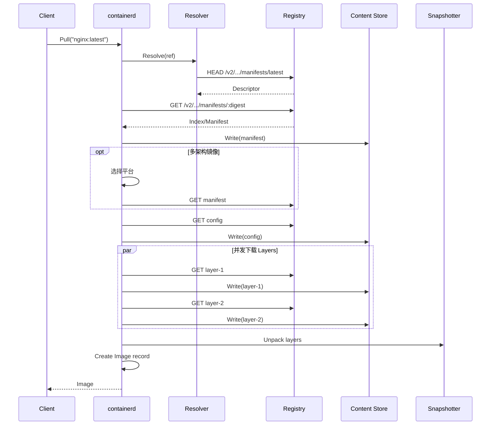
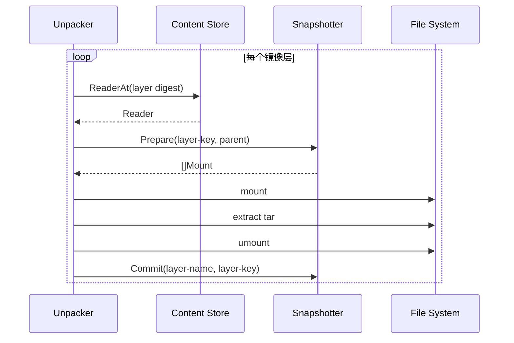
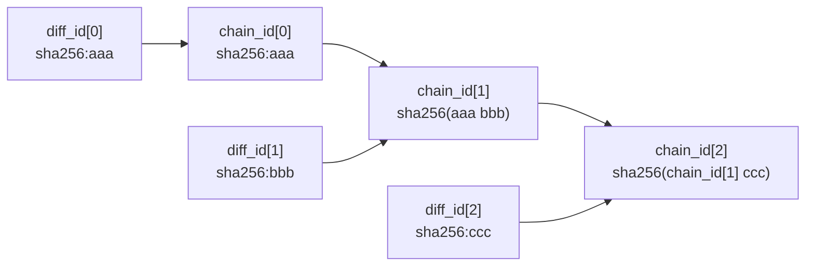

本章深入分析 containerd 镜像拉取的完整流程，从解析镜像引用到内容存储和解压。

## 拉取流程概览



## 阶段一：解析镜像引用

### 引用解析

```go
// 镜像引用格式
// [registry/][repository/]name[:tag|@digest]

// 示例:
// nginx                      -> docker.io/library/nginx:latest
// nginx:1.21                 -> docker.io/library/nginx:1.21
// myregistry.com/app:v1      -> myregistry.com/app:v1
// nginx@sha256:abc...        -> docker.io/library/nginx@sha256:abc...
```

### Resolver 接口

```go
// remotes/resolver.go

type Resolver interface {
    // Resolve 解析引用，返回名称和描述符
    Resolve(ctx context.Context, ref string) (name string, desc ocispec.Descriptor, err error)

    // Fetcher 返回获取器
    Fetcher(ctx context.Context, ref string) (Fetcher, error)

    // Pusher 返回推送器
    Pusher(ctx context.Context, ref string) (Pusher, error)
}
```

### Docker Resolver 实现

```go
// remotes/docker/resolver.go

func (r *dockerResolver) Resolve(ctx context.Context, ref string) (string, ocispec.Descriptor, error) {
    // 1. 解析引用
    refspec, err := reference.Parse(ref)
    if err != nil {
        return "", ocispec.Descriptor{}, err
    }

    // 2. 构建 Registry 客户端
    host := refspec.Hostname()
    client := r.getClient(host)

    // 3. 发送 HEAD 请求获取 Manifest 信息
    u := fmt.Sprintf("https://%s/v2/%s/manifests/%s", host, refspec.Locator, refspec.Object)
    req, _ := http.NewRequestWithContext(ctx, "HEAD", u, nil)
    req.Header.Set("Accept", strings.Join(acceptedMediaTypes, ","))

    resp, err := client.Do(req)
    if err != nil {
        return "", ocispec.Descriptor{}, err
    }

    // 4. 解析响应头
    desc := ocispec.Descriptor{
        MediaType: resp.Header.Get("Content-Type"),
        Digest:    digest.Digest(resp.Header.Get("Docker-Content-Digest")),
        Size:      resp.ContentLength,
    }

    return refspec.String(), desc, nil
}
```

## 阶段二：获取 Manifest

### Fetcher 接口

```go
// remotes/fetcher.go

type Fetcher interface {
    // Fetch 获取指定描述符的内容
    Fetch(ctx context.Context, desc ocispec.Descriptor) (io.ReadCloser, error)
}
```

### 获取 Manifest 内容

```go
func fetchManifest(ctx context.Context, fetcher remotes.Fetcher, desc ocispec.Descriptor) ([]byte, error) {
    rc, err := fetcher.Fetch(ctx, desc)
    if err != nil {
        return nil, err
    }
    defer rc.Close()

    return io.ReadAll(rc)
}
```

### 处理 Index

```go
func resolveManifest(ctx context.Context, fetcher remotes.Fetcher, desc ocispec.Descriptor, platform ocispec.Platform) (ocispec.Descriptor, error) {
    // 获取内容
    data, err := fetchManifest(ctx, fetcher, desc)
    if err != nil {
        return ocispec.Descriptor{}, err
    }

    // 检查是否是 Index
    switch desc.MediaType {
    case ocispec.MediaTypeImageIndex, images.MediaTypeDockerSchema2ManifestList:
        var index ocispec.Index
        if err := json.Unmarshal(data, &index); err != nil {
            return ocispec.Descriptor{}, err
        }

        // 选择匹配平台的 Manifest
        matcher := platforms.Only(platform)
        for _, m := range index.Manifests {
            if m.Platform != nil && matcher.Match(*m.Platform) {
                return m, nil
            }
        }
        return ocispec.Descriptor{}, fmt.Errorf("no matching manifest")

    default:
        // 已经是 Manifest
        return desc, nil
    }
}
```

## 阶段三：下载内容

### Transfer Service

```go
// core/transfer/transfer.go

type Transfer interface {
    // Transfer 执行传输操作
    Transfer(ctx context.Context, source interface{}, destination interface{}, opts ...Opt) error
}

// ImageFetcher 从远程获取镜像
type ImageFetcher interface {
    // 支持的输入类型
}

// ImageStorer 存储镜像到本地
type ImageStorer interface {
    // 支持的输出类型
}
```

### 并发下载

```go
// 使用 semaphore 控制并发数
func downloadLayers(ctx context.Context, fetcher remotes.Fetcher, store content.Store, layers []ocispec.Descriptor, maxConcurrent int) error {
    sem := semaphore.NewWeighted(int64(maxConcurrent))
    g, ctx := errgroup.WithContext(ctx)

    for _, layer := range layers {
        layer := layer // 捕获变量

        g.Go(func() error {
            // 获取信号量
            if err := sem.Acquire(ctx, 1); err != nil {
                return err
            }
            defer sem.Release(1)

            // 下载层
            return downloadLayer(ctx, fetcher, store, layer)
        })
    }

    return g.Wait()
}

func downloadLayer(ctx context.Context, fetcher remotes.Fetcher, store content.Store, desc ocispec.Descriptor) error {
    // 检查是否已存在
    if _, err := store.Info(ctx, desc.Digest); err == nil {
        return nil // 已存在，跳过
    }

    // 创建 Writer
    writer, err := store.Writer(ctx,
        content.WithRef(desc.Digest.String()),
        content.WithDescriptor(desc),
    )
    if err != nil {
        if errdefs.IsAlreadyExists(err) {
            return nil
        }
        return err
    }
    defer writer.Close()

    // 获取远程内容
    rc, err := fetcher.Fetch(ctx, desc)
    if err != nil {
        return err
    }
    defer rc.Close()

    // 复制内容
    if _, err := io.Copy(writer, rc); err != nil {
        return err
    }

    // 提交
    return writer.Commit(ctx, desc.Size, desc.Digest)
}
```

## 阶段四：Unpack 解压

### Unpack 流程



### Unpacker 实现

```go
// core/unpack/unpacker.go

type Unpacker struct {
    content     content.Provider
    snapshotter snapshots.Snapshotter
    platform    platforms.MatchComparer
}

func (u *Unpacker) Unpack(ctx context.Context, desc ocispec.Descriptor) error {
    // 1. 获取 Manifest
    manifest, err := images.Manifest(ctx, u.content, desc, u.platform)
    if err != nil {
        return err
    }

    // 2. 获取 Config（用于 diff_ids）
    config, err := images.Config(ctx, u.content, desc, u.platform)
    if err != nil {
        return err
    }

    var imageConfig ocispec.Image
    if err := json.Unmarshal(config, &imageConfig); err != nil {
        return err
    }

    // 3. 解压每个层
    var parent string
    for i, layer := range manifest.Layers {
        diffID := imageConfig.RootFS.DiffIDs[i]

        // 检查是否已解压
        chainID := identity.ChainID(imageConfig.RootFS.DiffIDs[:i+1])
        if _, err := u.snapshotter.Stat(ctx, chainID.String()); err == nil {
            parent = chainID.String()
            continue
        }

        // 解压层
        if err := u.unpackLayer(ctx, layer, diffID, chainID.String(), parent); err != nil {
            return err
        }

        parent = chainID.String()
    }

    return nil
}
```

### 解压单层

```go
func (u *Unpacker) unpackLayer(ctx context.Context, layer ocispec.Descriptor, diffID, key, parent string) error {
    // 1. 创建快照
    mounts, err := u.snapshotter.Prepare(ctx, key+"-extract", parent)
    if err != nil {
        return err
    }

    // 2. 挂载并解压
    if err := mount.WithTempMount(ctx, mounts, func(root string) error {
        // 获取层内容
        ra, err := u.content.ReaderAt(ctx, layer)
        if err != nil {
            return err
        }
        defer ra.Close()

        // 解压缩
        r, err := compression.DecompressStream(io.NewSectionReader(ra, 0, ra.Size()))
        if err != nil {
            return err
        }
        defer r.Close()

        // 解压 tar
        _, err = archive.Apply(ctx, root, r)
        return err
    }); err != nil {
        u.snapshotter.Remove(ctx, key+"-extract")
        return err
    }

    // 3. 提交快照
    if err := u.snapshotter.Commit(ctx, key, key+"-extract"); err != nil {
        return err
    }

    return nil
}
```

## 阶段五：创建 Image 记录

```go
func createImageRecord(ctx context.Context, store images.Store, name string, target ocispec.Descriptor) (images.Image, error) {
    img := images.Image{
        Name:   name,
        Target: target,
        Labels: map[string]string{},
    }

    // 检查是否存在
    existing, err := store.Get(ctx, name)
    if err == nil {
        // 更新
        img.CreatedAt = existing.CreatedAt
        return store.Update(ctx, img, "target", "labels")
    }

    // 创建
    return store.Create(ctx, img)
}
```

## Chain ID 计算

### 什么是 Chain ID

Chain ID 用于唯一标识一组层的组合：



### 计算方法

```go
// identity/chainid.go

func ChainID(ids []digest.Digest) digest.Digest {
    if len(ids) == 0 {
        return ""
    }
    if len(ids) == 1 {
        return ids[0]
    }

    // chain_id[n] = sha256(chain_id[n-1] + " " + diff_id[n])
    return digest.FromString(string(ChainID(ids[:len(ids)-1])) + " " + string(ids[len(ids)-1]))
}
```

## 进度追踪

### Progress 接口

```go
// remotes/progress.go

type Progress struct {
    Event    string  // 事件类型
    Ref      string  // 引用
    Status   string  // 状态描述
    Offset   int64   // 当前偏移
    Total    int64   // 总大小
    StartedAt time.Time
    UpdatedAt time.Time
}

// 使用 channel 报告进度
func pullWithProgress(ctx context.Context, ...) error {
    ongoing := newJobs()
    pctx, stopProgress := context.WithCancel(ctx)

    go func() {
        ticker := time.NewTicker(100 * time.Millisecond)
        defer ticker.Stop()

        for {
            select {
            case <-ticker.C:
                printProgress(ongoing)
            case <-pctx.Done():
                return
            }
        }
    }()
    defer stopProgress()

    // 执行拉取...
}
```

## 错误处理与重试

### 重试逻辑

```go
func fetchWithRetry(ctx context.Context, fetcher remotes.Fetcher, desc ocispec.Descriptor, maxRetries int) (io.ReadCloser, error) {
    var lastErr error

    for i := 0; i < maxRetries; i++ {
        rc, err := fetcher.Fetch(ctx, desc)
        if err == nil {
            return rc, nil
        }

        lastErr = err

        // 判断是否可重试
        if !isRetryable(err) {
            return nil, err
        }

        // 指数退避
        time.Sleep(time.Duration(1<<i) * time.Second)
    }

    return nil, fmt.Errorf("max retries exceeded: %w", lastErr)
}

func isRetryable(err error) bool {
    // 网络错误可重试
    if netErr, ok := err.(net.Error); ok && netErr.Temporary() {
        return true
    }
    // 5xx 错误可重试
    if httpErr, ok := err.(*httpError); ok && httpErr.StatusCode >= 500 {
        return true
    }
    return false
}
```

## 配置选项

### 拉取选项

```go
// 并发数
client.Pull(ctx, ref, containerd.WithMaxConcurrentDownloads(5))

// 平台选择
client.Pull(ctx, ref, containerd.WithPlatform("linux/amd64"))

// 解压选项
client.Pull(ctx, ref, containerd.WithPullUnpack)

// 快照器
client.Pull(ctx, ref, containerd.WithPullSnapshotter("overlayfs"))

// 标签
client.Pull(ctx, ref, containerd.WithPullLabels(map[string]string{
    "my-label": "value",
}))
```

## 小结

镜像拉取的关键阶段：

1. **解析引用**：规范化镜像名称
2. **获取 Manifest**：确定镜像内容结构
3. **下载内容**：并发下载 Config 和 Layers
4. **Unpack 解压**：将层解压到 Snapshotter
5. **创建记录**：在 Image Store 创建镜像记录

性能优化点：
- 并发下载
- 去重检查
- 断点续传

下一节我们将学习 [镜像管理代码走读](./03-code-walkthrough.md)。
