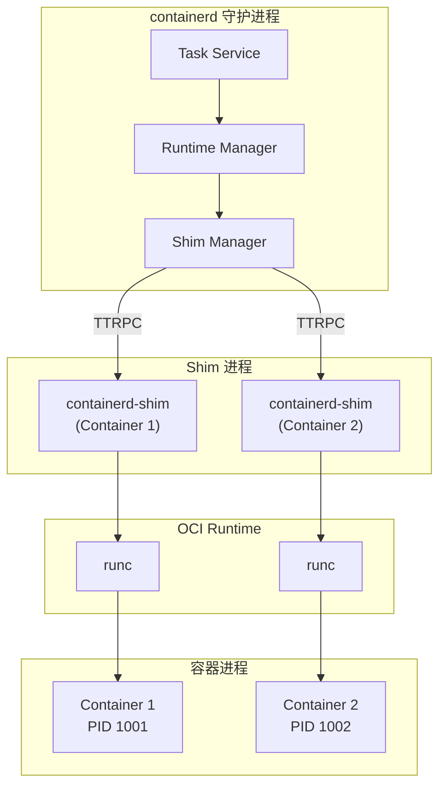
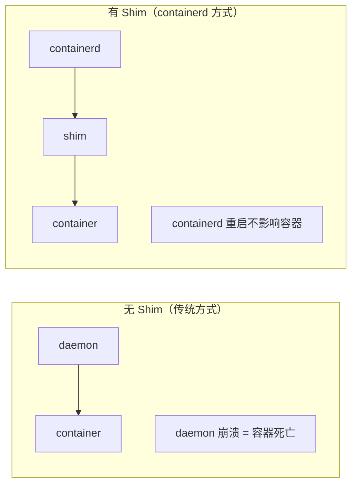
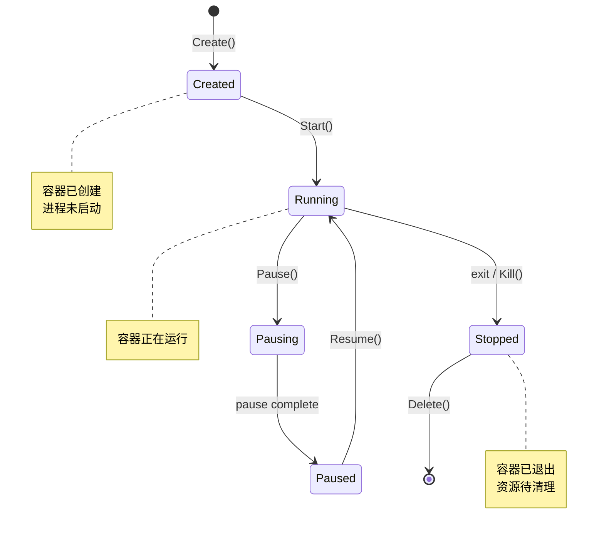
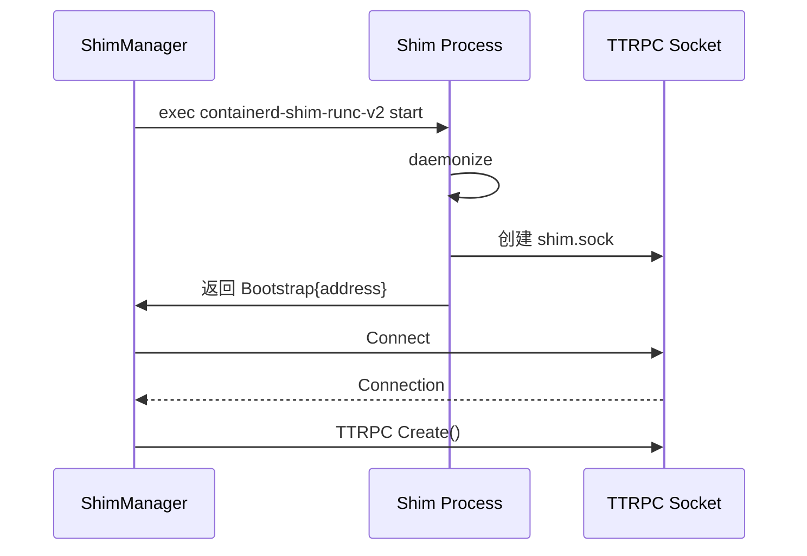

containerd 的 Runtime 模块负责容器的创建、执行和生命周期管理。它采用 Shim 架构，将容器进程与 containerd 守护进程解耦。

## Runtime 架构概览



## 核心设计原则

### 1. Shim 解耦

每个容器有独立的 Shim 进程：



**优势**：
- containerd 可以重启而不影响运行中的容器
- 每个容器的资源独立管理
- 更好的故障隔离

### 2. 运行时可插拔

支持多种 OCI 运行时：

| 运行时 | Shim | 说明 |
|--------|------|------|
| runc | containerd-shim-runc-v2 | 默认运行时 |
| crun | containerd-shim-runc-v2 | 轻量级替代 |
| kata | containerd-shim-kata-v2 | VM 隔离 |
| gVisor | containerd-shim-runsc-v1 | 安全沙箱 |

## 核心接口

### PlatformRuntime 接口

```go
// core/runtime/runtime.go

type PlatformRuntime interface {
    // ID 返回运行时标识
    ID() string

    // Create 创建新任务
    Create(ctx context.Context, taskID string, opts CreateOpts) (Task, error)

    // Get 获取已存在的任务
    Get(ctx context.Context, taskID string) (Task, error)

    // Tasks 返回所有任务
    Tasks(ctx context.Context, all bool) ([]Task, error)

    // Delete 删除任务
    Delete(ctx context.Context, taskID string) (*Exit, error)
}
```

### Task 接口

```go
// core/runtime/task.go

type Task interface {
    // ID 返回任务 ID
    ID() string

    // State 返回任务状态
    State(ctx context.Context) (State, error)

    // Start 启动任务
    Start(ctx context.Context) error

    // Kill 发送信号
    Kill(ctx context.Context, signal syscall.Signal, all bool) error

    // Exec 执行新进程
    Exec(ctx context.Context, id string, opts ExecOpts) (Process, error)

    // Pids 返回所有进程 PID
    Pids(ctx context.Context) ([]ProcessInfo, error)

    // Checkpoint 创建检查点
    Checkpoint(ctx context.Context, path string, opts *types.Any) error

    // Wait 等待任务退出
    Wait(ctx context.Context) (*Exit, error)

    // CloseIO 关闭 IO
    CloseIO(ctx context.Context) error

    // Resize 调整终端大小
    Resize(ctx context.Context, w, h uint32) error

    // Update 更新资源限制
    Update(ctx context.Context, resources *types.Any, annotations map[string]string) error

    // Process 获取指定进程
    Process(ctx context.Context, id string) (Process, error)
}
```

### Process 接口

```go
type Process interface {
    // ID 返回进程 ID
    ID() string

    // State 返回进程状态
    State(ctx context.Context) (State, error)

    // Kill 发送信号
    Kill(ctx context.Context, signal syscall.Signal, all bool) error

    // Wait 等待进程退出
    Wait(ctx context.Context) (*Exit, error)

    // CloseIO 关闭 IO
    CloseIO(ctx context.Context) error

    // Resize 调整终端大小
    Resize(ctx context.Context, w, h uint32) error

    // Start 启动进程
    Start(ctx context.Context) error

    // Delete 删除进程
    Delete(ctx context.Context) (*Exit, error)
}
```

## State 状态

### 状态定义

```go
// core/runtime/task.go

type Status int

const (
    UnknownStatus Status = iota
    CreatedStatus        // 已创建，未启动
    RunningStatus        // 运行中
    StoppedStatus        // 已停止
    PausedStatus         // 已暂停
    PausingStatus        // 正在暂停
)
```

### 状态转换



## Bundle 目录结构

OCI Bundle 是运行容器所需的目录结构：

```
/run/containerd/io.containerd.runtime.v2.task/<namespace>/<container-id>/
├── config.json          # OCI Runtime Spec
├── rootfs/              # 容器根文件系统（挂载点）
├── work/                # 工作目录
├── log.json             # Shim 日志
├── shim.sock            # Shim TTRPC socket
├── shim.pid             # Shim PID
└── init.pid             # 容器 init 进程 PID
```

### config.json 生成

```go
// 从容器 Spec 生成 config.json
func generateOCISpec(container containers.Container, mounts []mount.Mount) (*specs.Spec, error) {
    // 解码容器规格
    var spec specs.Spec
    if err := typeurl.UnmarshalTo(container.Spec, &spec); err != nil {
        return nil, err
    }

    // 设置根文件系统
    spec.Root = &specs.Root{
        Path:     "rootfs",
        Readonly: false,
    }

    // 添加挂载点
    spec.Mounts = append(spec.Mounts, fromOCIMounts(mounts)...)

    return &spec, nil
}
```

## Runtime v2 架构

### Shim Manager

```go
// core/runtime/v2/shim_manager.go

type ShimManager struct {
    root          string      // 状态目录
    state         string      // 运行目录
    shims         sync.Map    // Shim 实例缓存
    events        *exchange.Exchange
    containers    containers.Store
}

// Start 启动新的 Shim
func (m *ShimManager) Start(ctx context.Context, id string, opts runtime.CreateOpts) (shim.Shim, error) {
    // 1. 构建 Bundle
    bundle, err := NewBundle(ctx, m.root, m.state, id, opts.Spec)
    if err != nil {
        return nil, err
    }

    // 2. 解析运行时路径
    shimPath, err := m.resolveRuntimePath(opts.Runtime)
    if err != nil {
        return nil, err
    }

    // 3. 启动 Shim 进程
    params, err := m.startShim(ctx, shimPath, bundle, opts)
    if err != nil {
        return nil, err
    }

    // 4. 连接到 Shim
    conn, err := m.connect(ctx, params.Address)
    if err != nil {
        return nil, err
    }

    // 5. 创建 Shim 客户端
    shim := newShim(conn, params)
    m.shims.Store(id, shim)

    return shim, nil
}
```

### Shim 启动流程



## 小结

Runtime 架构的核心特点：

1. **Shim 架构**：容器与 containerd 解耦
2. **运行时可插拔**：支持多种 OCI Runtime
3. **状态管理**：清晰的生命周期状态
4. **Bundle 规范**：符合 OCI Runtime Spec

下一节我们将深入学习 [Shim 机制](./02-shim-mechanism.md)。

## 参考资料

- [OCI Runtime Spec](https://github.com/opencontainers/runtime-spec)
- [containerd Runtime v2](https://github.com/containerd/containerd/blob/main/runtime/v2/README.md)
